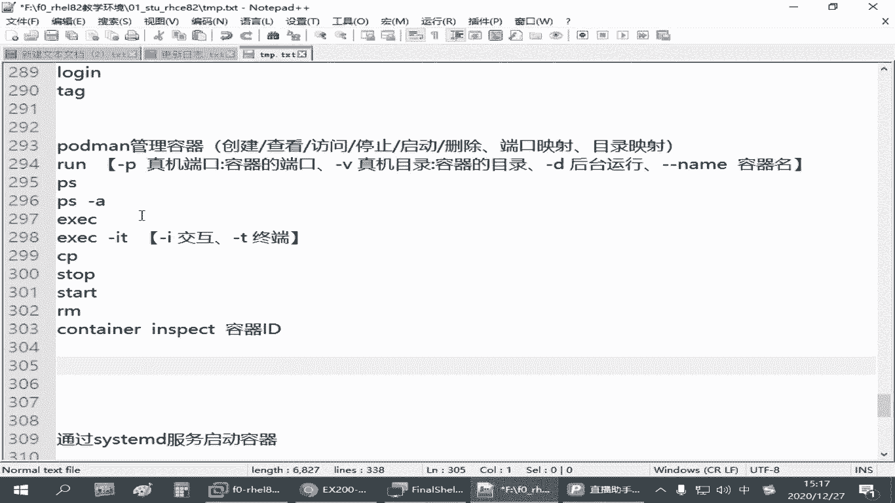
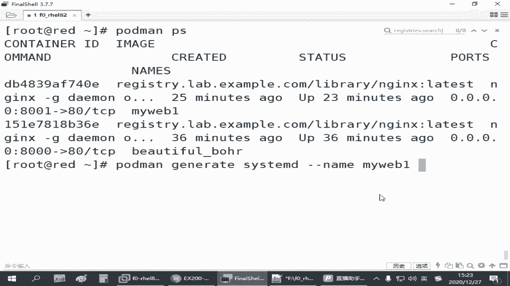
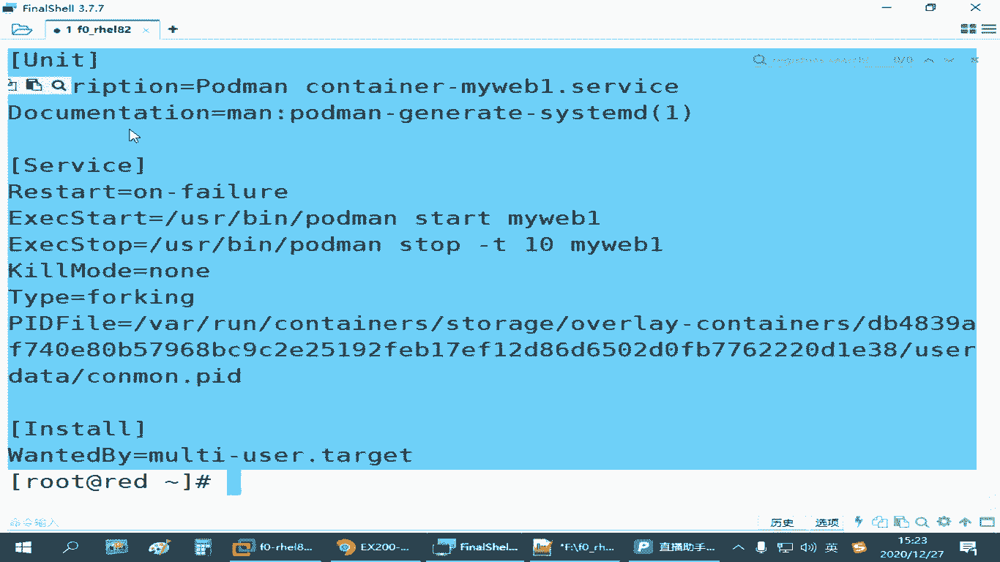
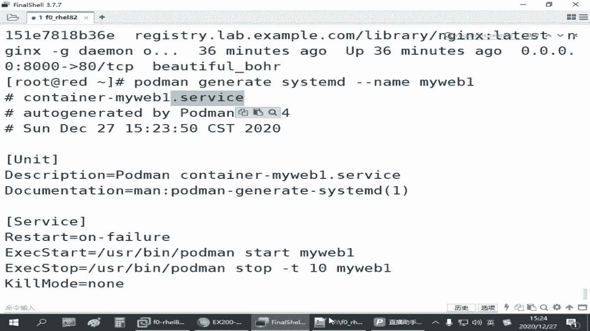
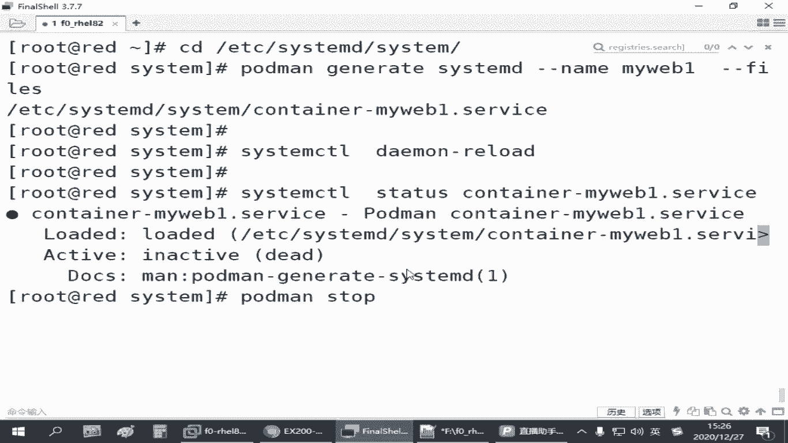
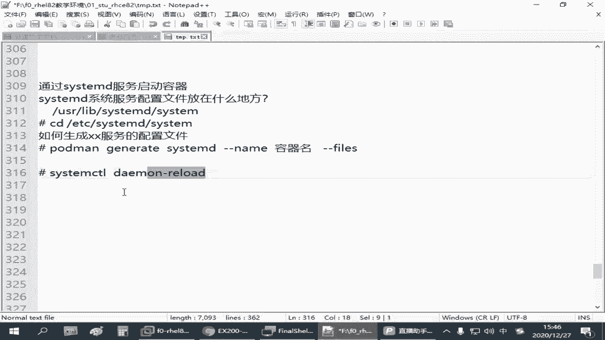

# 备考红帽认证必修课：P28：4.05-容器服务化 🚀



在本节课中，我们将学习如何将手动运行的Docker容器配置为系统服务，从而实现容器的开机自启动和便捷管理。我们将了解系统服务的配置文件位置、如何快速生成服务配置，以及如何启用和管理容器服务。

---

## 系统服务配置文件位置 📁

上一节我们介绍了手动运行容器的方法，本节中我们来看看如何将其服务化。首先，需要了解Linux系统中由systemd管理的服务配置文件通常存放在两个主要目录。

以下是关键目录：
*   `/usr/lib/systemd/system/`：存放系统预置的服务配置文件。
*   `/etc/systemd/system/`：建议管理员将自定义的服务配置文件放在此目录下。

服务配置文件通常以 `.service` 作为后缀。如果我们要将容器作为服务启动，就需要在 `/etc/systemd/system/` 目录下创建对应的服务配置文件。

---

## 生成容器服务配置 ⚙️





了解了配置文件的位置后，接下来我们学习如何为已运行的容器快速生成服务配置。手动编写配置文件非常繁琐，我们可以使用 `podman` 命令来生成。

核心命令是：
```bash
podman generate systemd --name <容器名>
```
此命令会读取指定容器的配置信息，并在屏幕上输出一份标准的systemd服务配置文件内容。



例如，我们有一个名为 `myweb1` 的容器，可以这样操作：
```bash
podman generate systemd --name myweb1
```
为了将配置保存到正确的位置，我们通常先切换到目标目录，并使用 `--files` 参数直接生成文件。
```bash
cd /etc/systemd/system/
podman generate systemd --name myweb1 --files
```
执行后，会在当前目录生成一个名为 `container-myweb1.service` 的配置文件。

---

## 启用并管理容器服务 🔧



配置文件生成后，我们需要通知系统加载这个新服务，然后就可以像管理其他系统服务一样来管理这个容器了。

以下是具体步骤：
1.  **重新加载systemd配置**：让系统识别新添加的服务文件。
    ```bash
    systemctl daemon-reload
    ```
2.  **停止原有手动容器**：**注意**，这里使用 `stop` 停止容器，**不要**使用 `rm` 删除容器。
    ```bash
    podman stop myweb1
    ```
3.  **使用systemd启动服务**：现在可以通过服务来管理容器。
    ```bash
    systemctl start container-myweb1.service
    ```
4.  **检查服务状态**：
    ```bash
    systemctl status container-myweb1.service
    ```
5.  **设置开机自启**：
    ```bash
    systemctl enable container-myweb1.service
    ```
6.  **验证**：重启主机后，容器服务应能自动运行，可以通过访问容器提供的服务（如 `curl localhost:8001`）来验证。

现在，你可以使用 `systemctl start/stop/restart container-myweb1.service` 来便捷地管理这个容器了。

---

## 总结 📝



本节课中我们一起学习了如何实现“容器服务化”。我们首先了解了systemd服务配置文件的存放位置，然后使用 `podman generate systemd` 命令为现有容器快速生成服务配置，最后通过 `systemctl` 命令启用、管理服务并设置开机自启动。这样，管理员就无需在每次主机重启后手动运行复杂的 `podman run` 命令，大大提升了运维效率。