# 备考红帽认证必修课：P29：4.06-rootless无根环境

## 概述
在本节课中，我们将学习“rootless无根环境”的概念与配置。rootless指的是在没有管理员权限的情况下运行和管理容器。这主要针对非root用户，学习如何通过系统服务来启用和管理容器。

## 无根环境简介
上一节我们介绍了管理员如何管理容器服务，本节中我们来看看普通用户如何操作。rootless无根环境意味着用户在没有管理员权限时，也需要能够运行容器。

普通用户运行容器本身是默认允许的，因为容器设计为每个用户提供隔离的独立环境。但需要注意端口问题：普通用户通常只能开启1024以上的端口，1024以下的端口是系统保留范围。

## 用户系统服务配置
普通用户若要添加自己的系统服务，其配置文件目录与管理员不同。

以下是用户系统服务的配置目录路径：
```
~/.config/systemd/user/
```
我们需要将服务配置文件放在此目录下，然后更新系统服务配置。

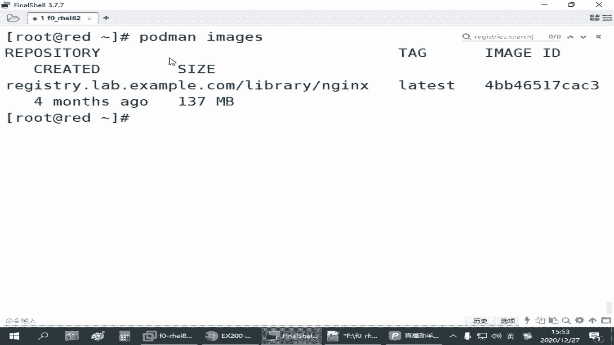

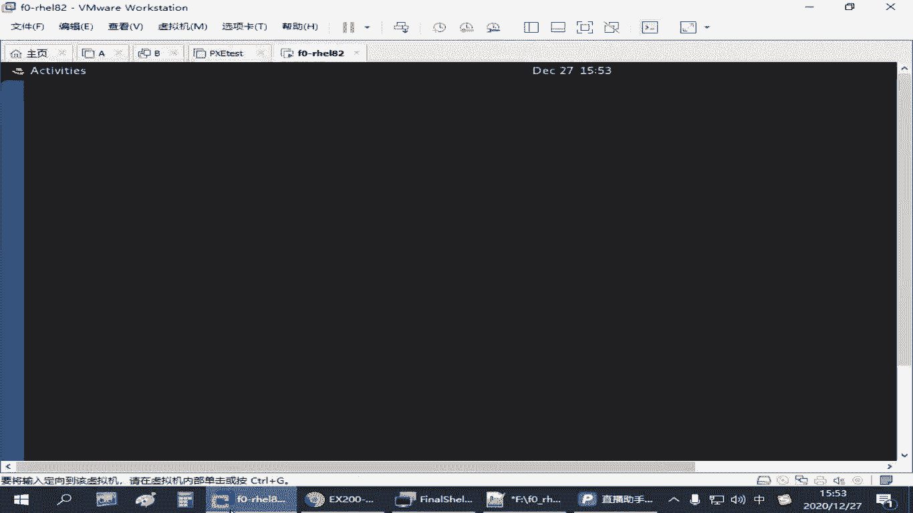

用户的系统服务与管理员的系统服务是分开的。例如，普通用户创建的服务名为`myweb3`，管理员无法看见；而管理员创建的服务，普通用户可能看见但没有操作权限。

普通用户操作自己定义的系统服务时，需要使用`systemctl`命令，并加上`--user`选项。

## 用户容器存储空间
在启用容器时，用户的容器存储也与管理员分开。用户的容器存储位于用户主目录下的特定路径：
```
~/.config/containers/
```
这意味着管理员下载的镜像，普通用户无法直接使用。普通用户需要单独下载所需的镜像。

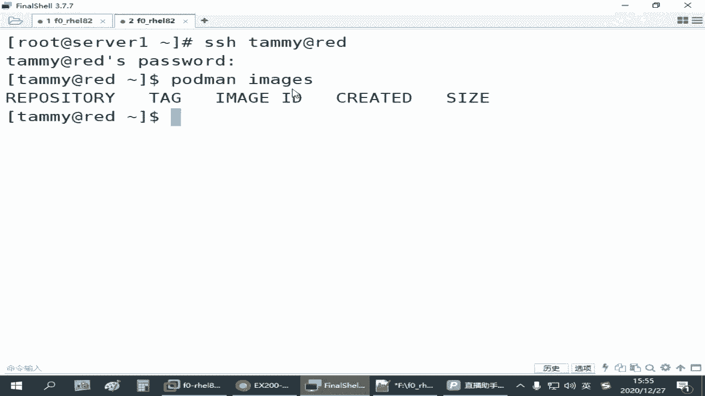

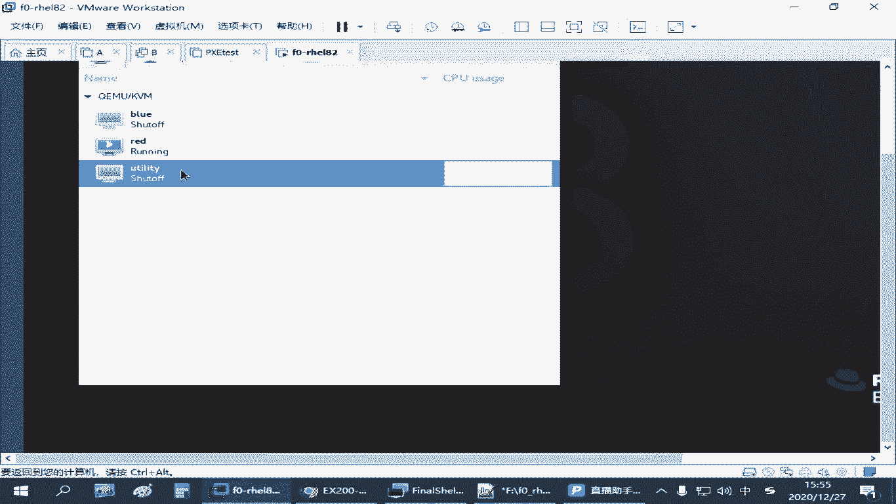

## 实践：配置普通用户容器服务
接下来，我们以一个名为`tdmi`的普通用户为例，演示配置过程。

首先，创建用户并设置密码：
```bash
useradd tdmi
passwd tdmi
# 设置密码为 tdmi
```

使用SSH方式登录到`tdmi`用户。注意，红帽官方教程指出，必须通过SSH直接登录，使用`su`或`sudo`切换到用户的方式可能无法生效。

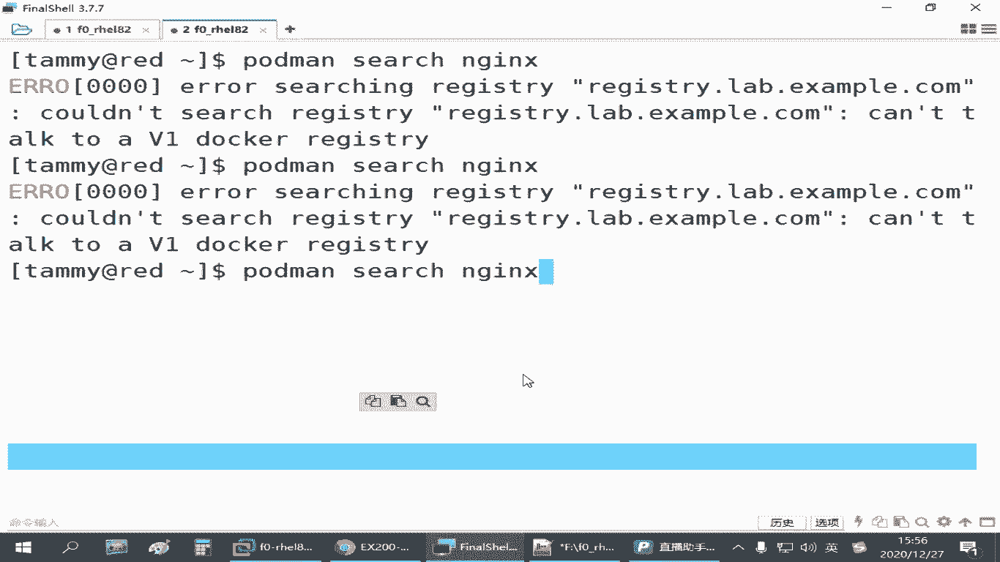

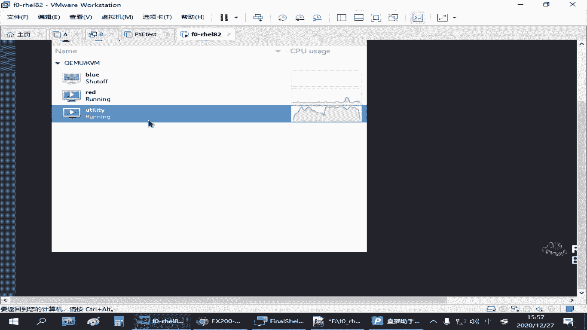

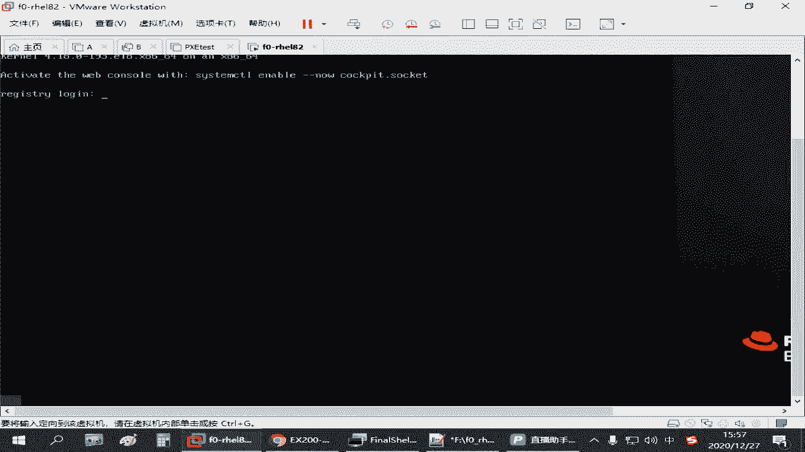

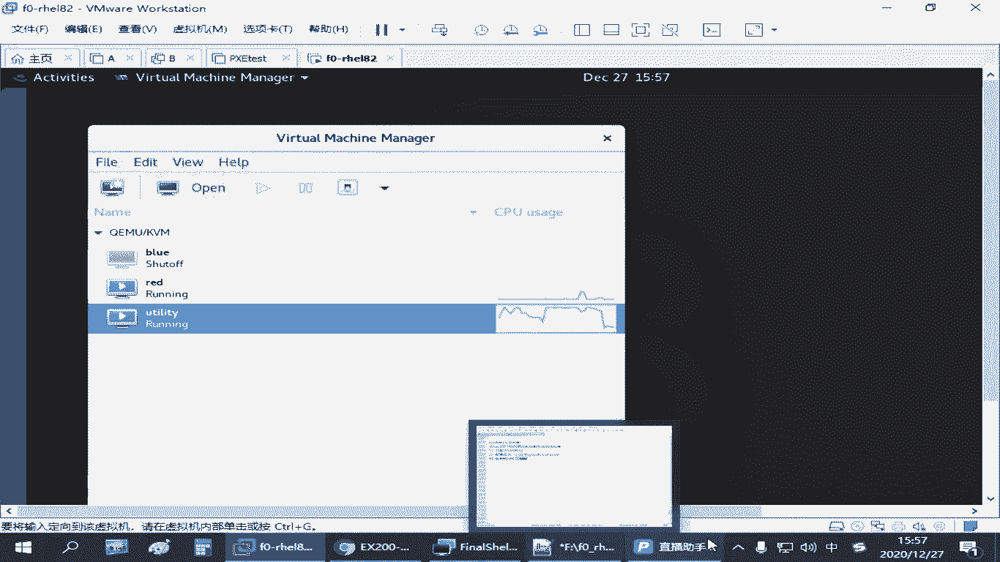

登录后，普通用户需要下载镜像。使用`podman search`搜索镜像时，连接的是管理员全局配置的仓库地址。如果仓库服务未启动，可能会遇到“无法连接”或“连接被拒绝”等错误，需等待仓库服务就绪。

下载Nginx镜像：
```bash
podman pull nginx
```

下载完成后，可以运行一个测试容器。首先，在用户主目录下创建网页目录和文件：
```bash
mkdir ~/containerlog
echo "tdmi test" > ~/containerlog/index.html
```

运行一个后台容器，映射端口和目录：
```bash
podman run -d -p 8080:80 -v ~/containerlog:/usr/share/nginx/html --name myweb3 nginx
```

测试容器是否运行成功，访问主机的8080端口，应能看到“tdmi test”网页。

## 将容器转换为用户系统服务
若要将此容器作为系统服务管理，需要创建服务配置文件。

首先，创建用户系统服务配置目录（如果不存在）：
```bash
mkdir -p ~/.config/systemd/user/
```

进入该目录，并生成服务文件：
```bash
cd ~/.config/systemd/user/
podman generate systemd --name myweb3 --files
```

更新系统服务配置，并启用服务：
```bash
systemctl --user daemon-reload
podman stop -l  # 停止最近运行的容器
systemctl --user start myweb3.service
```

测试服务，访问8080端口，应能正常看到网页。

设置服务开机自启：
```bash
systemctl --user enable myweb3.service
```

## 解决用户服务开机自启问题
普通用户的服务设置`enable`后，可能仍无法在开机时自动启动，因为用户未登录时系统默认不会分配资源。

解决方法之一是使用`loginctl`工具，通知系统为该用户保留资源：
```bash
loginctl enable-linger tdmi
```

检查设置是否生效：
```bash
loginctl show-user tdmi | grep Linger
# 输出应包含 Linger=yes
```

如果上述方法在考试或练习环境中仍不生效，可以采用备用方案：为用户添加计划任务。

编辑用户的计划任务：
```bash
crontab -e
```

添加以下行，使系统在开机时自动启动该服务：
```
@reboot /usr/bin/systemctl --user restart myweb3.service
```

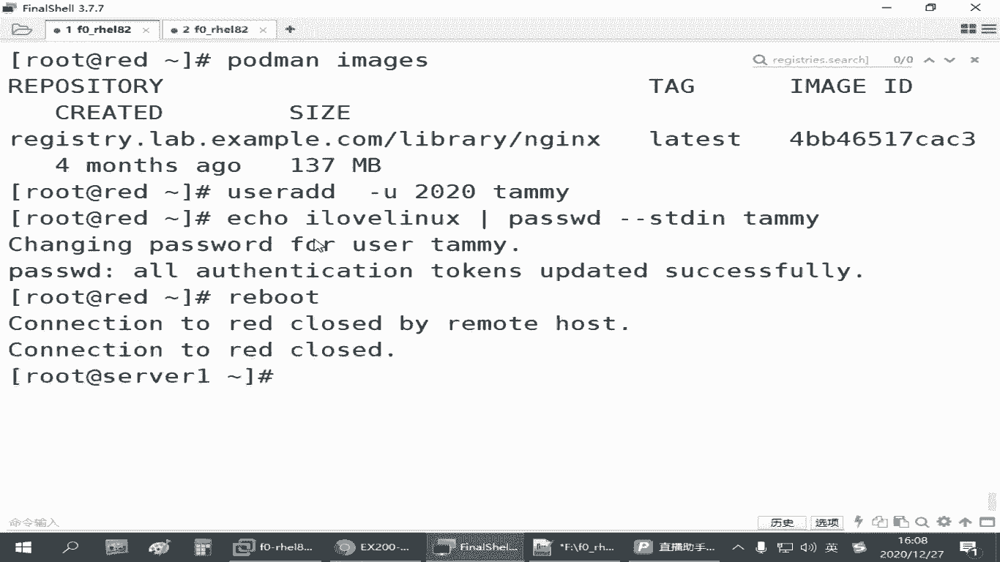

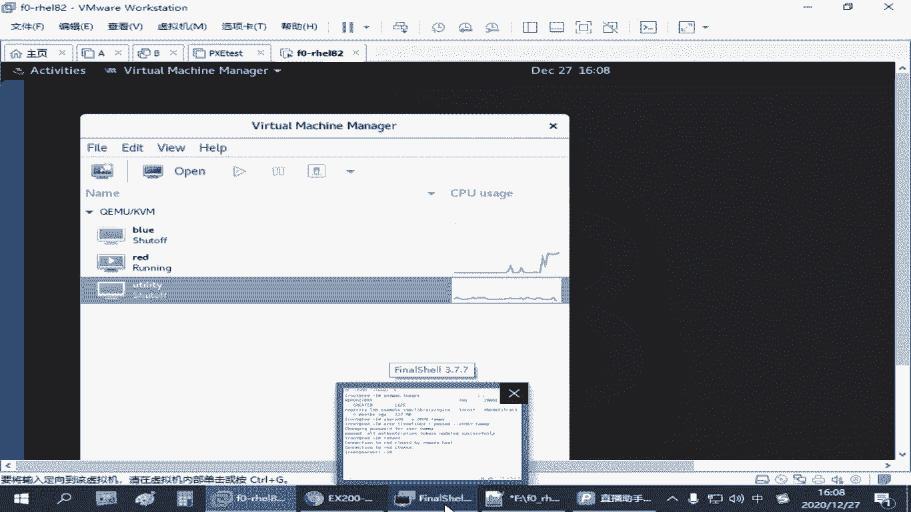

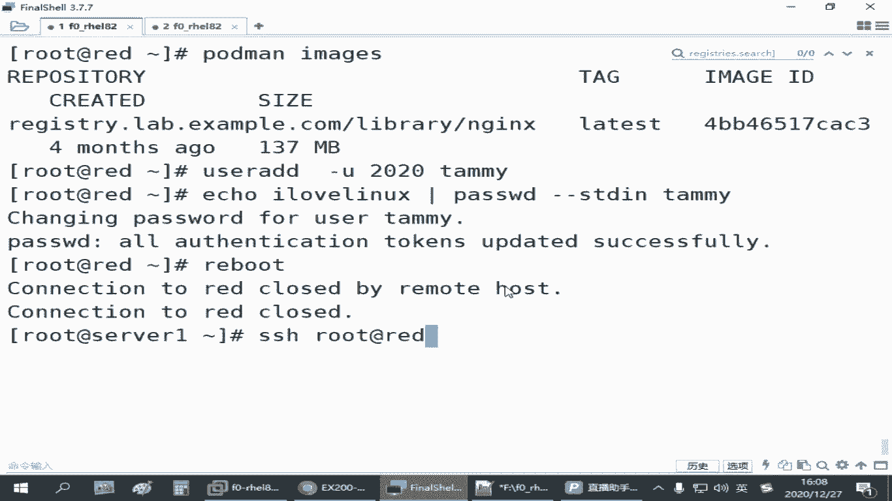

确保命令路径正确，并事先测试命令是否有效。

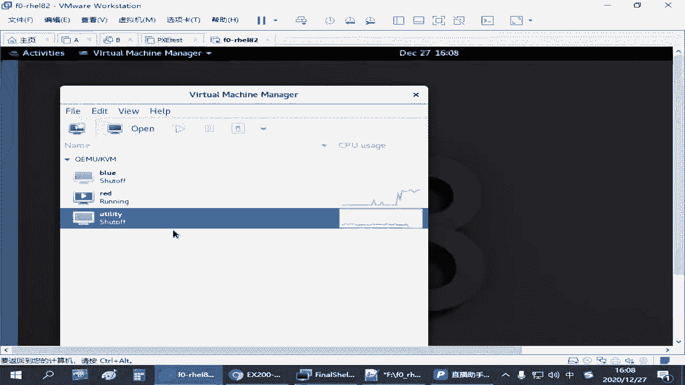

## 核心操作区别总结
本节课中我们一起学习了普通用户配置容器服务的全过程。与管理员操作相比，主要区别如下：

*   **配置目录**：用户服务配置文件位于`~/.config/systemd/user/`。
*   **命令选项**：操作用户服务时，`systemctl`和`podman`的相关命令需加上`--user`选项。
*   **存储隔离**：用户的镜像和容器存储独立于管理员。
*   **开机自启**：可能需要额外配置`loginctl enable-linger`或计划任务来确保服务开机启动。

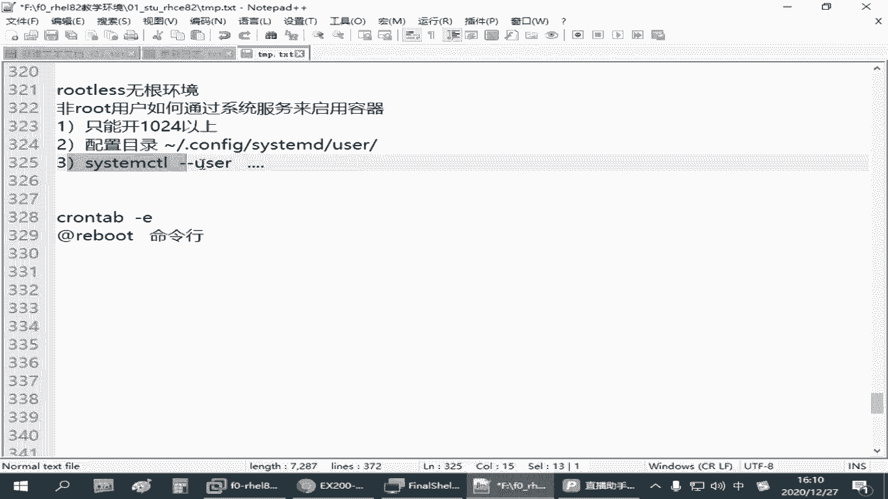

通过掌握这些步骤，你就能在无根环境下，以普通用户身份有效地运行和管理容器服务了。