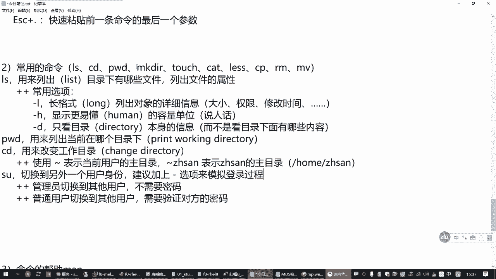
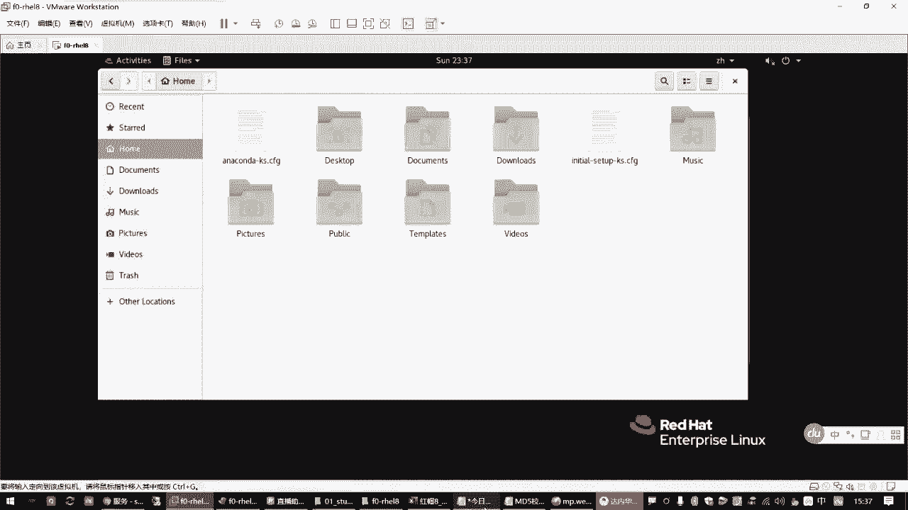
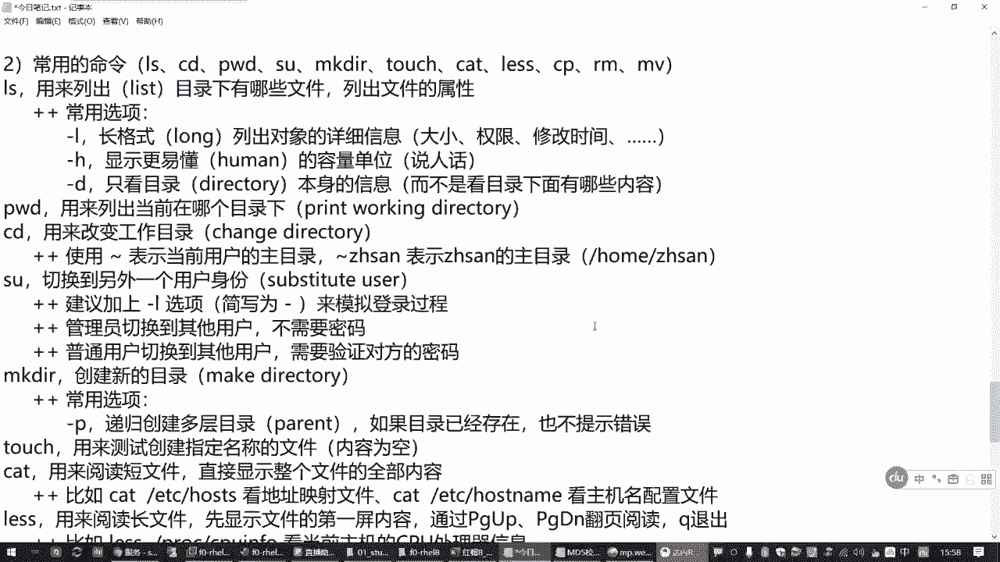
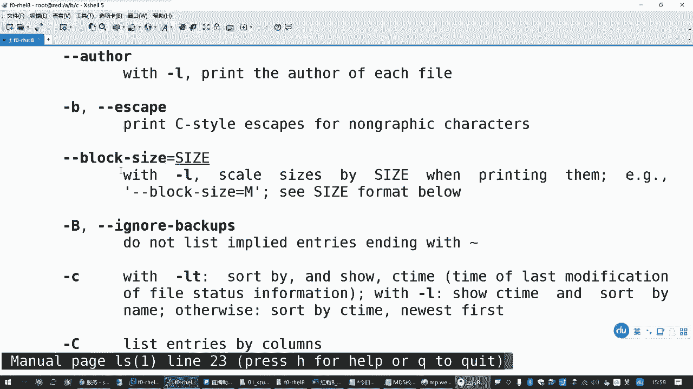
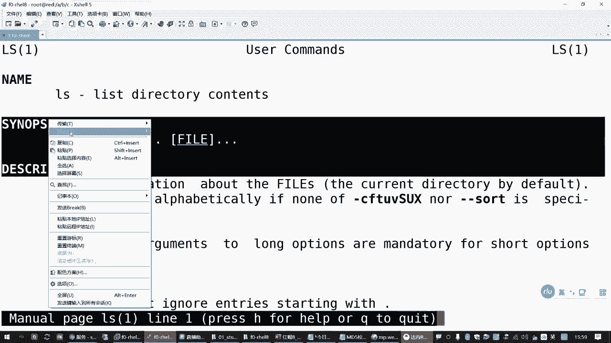
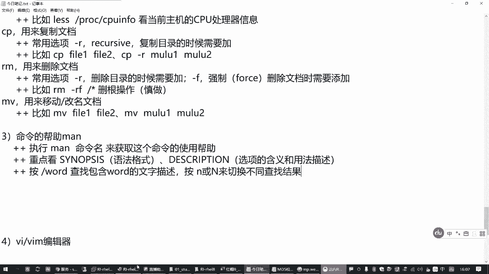
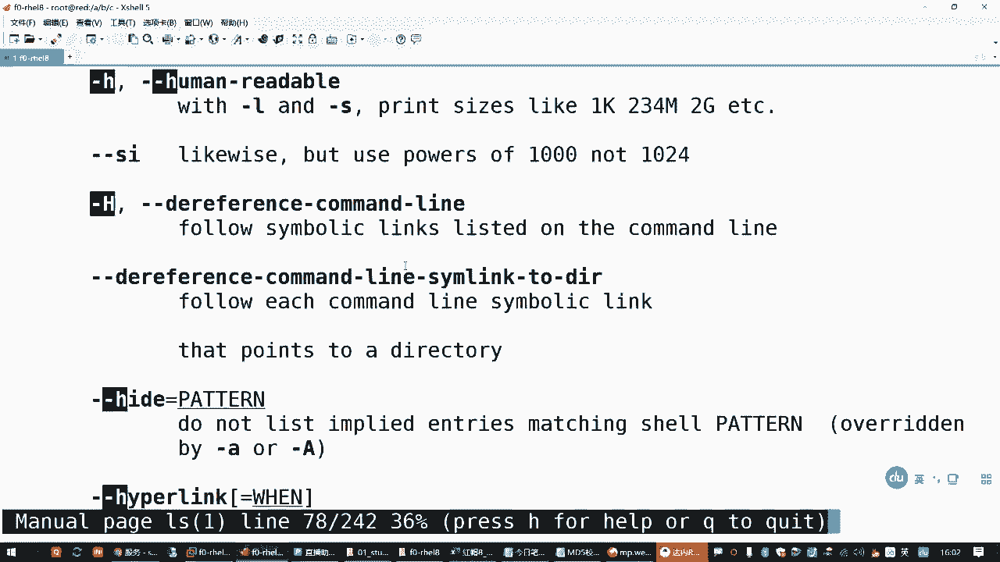
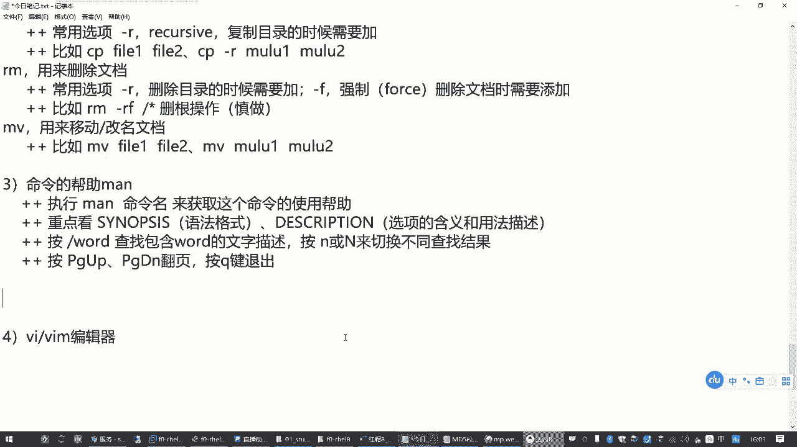

# Linux文档管理：P3：1.02-文档管理常用命令 📁

在本节课中，我们将要学习Linux系统中用于文档管理的一系列核心命令。这些命令是日常操作的基础，掌握它们能帮助你高效地浏览、创建、复制、移动和删除系统中的文件和目录。

---

## 目录探索三剑客 🗺️

上一节我们介绍了Linux的命令行基本格式和目录结构，本节中我们来看看如何探索这些目录。有三个命令被称为“目录探索三剑客”，它们是`ls`、`pwd`和`cd`。

### `ls` 命令：列出目录内容

`ls`命令的作用是列出指定目录下的文件和子目录，也可以查看文件的详细属性。

**基本格式**：
```bash
ls [选项] [目录或文件路径]
```

以下是`ls`命令的常用选项：

*   **`-l`**：以长格式列出详细信息，包括文件权限、所有者、大小和修改时间。
*   **`-h`**：与`-l`选项结合使用，以更易读的单位（如K、M、G）显示文件大小。
*   **`-d`**：仅显示目录本身的信息，而不是目录下的内容。

**示例**：
*   `ls /boot`：列出`/boot`目录下的内容。
*   `ls -ld /boot`：仅查看`/boot`目录本身的详细信息。

### `pwd` 命令：显示当前目录

`pwd`命令的作用是打印（输出）当前所在的工作目录。

**基本格式**：
```bash
pwd
```

### `cd` 命令：切换工作目录

`cd`命令的作用是改变当前的工作目录。

**基本格式**：
```bash
cd [目标目录路径]
```

**特殊用法**：
*   `cd` 或 `cd ~`：快速返回到当前用户的家目录。
*   `cd ~用户名`：切换到指定用户的家目录（如 `cd ~zhangsan`）。

---

## 用户身份切换 👤

在探索目录时，有时需要以不同用户的身份进行操作。`su`命令用于临时切换用户身份。

**基本格式**：
```bash
su - 用户名
```

**说明**：
*   选项`-`（或`-l`）用于模拟完整的登录过程，推荐使用。
*   管理员（root）切换到任何用户都无需密码。
*   普通用户切换到其他用户需要验证目标用户的密码。

**示例**：
```bash
su - lwuser0  # 切换到用户 lwuser0
```

---

## 创建目录与文件 🛠️

了解了如何浏览目录后，接下来我们学习如何创建新的目录和文件。

### `mkdir` 命令：创建新目录

`mkdir`命令的作用是创建新的目录。

**基本格式**：
```bash
mkdir [选项] 目录名...
```



以下是`mkdir`命令的常用选项：



*   **`-p`**：递归创建多层目录。如果父目录不存在，则会一并创建。若目标目录已存在，也不会报错。

**示例**：
```bash
mkdir -p /a/b/c  # 一次性创建 /a, /a/b, /a/b/c 三层目录
```

### `touch` 命令：创建空文件

`touch`命令的主要作用是创建空的测试文件，或更新文件的时间戳。它不向文件写入内容。

**基本格式**：
```bash
touch 文件名...
```

**示例**：
```bash
touch file1 file2 file3  # 创建三个名为 file1, file2, file3 的空文件
```

---

## 查看文件内容 📖

创建了文件后，我们需要查看其内容。根据文件长短，有不同的查看命令。

### `cat` 命令：查看短文件

`cat`命令用于直接显示整个文件的内容，适合查看内容较少的文件。

**基本格式**：
```bash
cat 文件名
```

**示例**：
```bash
cat /etc/hostname  # 查看主机名配置文件
cat /etc/hosts     # 查看本机域名映射文件
```

### `less` 命令：分页查看长文件

`less`命令用于分页浏览内容较长的文件，避免信息瞬间滚屏。

**基本格式**：
```bash
less 文件名
```

**操作方法**：
*   按 **空格键** 或 **Page Down**：向下翻页。
*   按 **Page Up**：向上翻页。
*   按 **`q`**：退出浏览。

**示例**：
```bash
less /proc/cpuinfo  # 分页查看CPU信息
```

---

## 复制、移动与删除文档 🔄

管理文档时，复制、移动（重命名）和删除是最常见的操作。

### `cp` 命令：复制文档

`cp`命令的作用是复制文件或目录。

**基本格式**：
```bash
cp [选项] 源文件或目录 目标文件或目录
```

以下是`cp`命令的常用选项：

*   **`-r`**：递归复制整个目录及其内容（复制目录时必须使用）。

**示例**：
```bash
cp file1 file2          # 复制文件 file1 为 file2
cp -r /boot ./boot_new  # 将 /boot 目录复制到当前目录下并重命名为 boot_new
```

### `mv` 命令：移动或重命名文档

`mv`命令的作用是移动文件或目录，如果在同一目录下操作，效果就是重命名。

**基本格式**：
```bash
mv 源文件或目录 目标文件或目录
```

**示例**：
```bash
mv oldname newname      # 将文件 oldname 重命名为 newname
mv file1 /tmp/          # 将 file1 移动到 /tmp 目录下
```

### `rm` 命令：删除文档

`rm`命令的作用是删除文件或目录。

**基本格式**：
```bash
rm [选项] 文件或目录...
```

以下是`rm`命令的常用选项：

*   **`-r`**：递归删除目录及其下的所有内容（删除目录时必须使用）。
*   **`-f`**：强制删除，不进行任何确认提示。

**警告**：`rm -rf /` 命令会强制删除根目录下的所有文件，导致系统崩溃，**严禁执行**。



**示例**：
```bash
rm file1                # 删除文件 file1（会提示确认）
rm -f file2 file3       # 强制删除 file2 和 file3（无提示）
rm -rf old_dir          # 强制递归删除整个 old_dir 目录
```

---

## 获取命令帮助 📚

面对众多命令，如果记不清用法，可以随时查阅系统自带的帮助手册。





### `man` 命令：查看命令手册

`man`命令用于获取指定命令的详细使用说明。

**基本格式**：
```bash
man 命令名
```

**阅读手册时的操作技巧**：
*   按 **空格键** 或 **Page Down**：向下翻页。
*   按 **Page Up**：向上翻页。
*   按 **`/关键词`**：在手册内搜索指定关键词（如 `/ -h`）。
*   按 **`n`**：查找下一个匹配项。
*   按 **`N`**：查找上一个匹配项。
*   按 **`q`**：退出帮助手册。



**阅读重点**：
1.  **SYNOPSIS（语法格式）**：了解命令的基本用法。
2.  **DESCRIPTION（描述）**：查看命令和各个选项的详细解释。

**示例**：
```bash
man ls  # 查看 ls 命令的完整手册
```



---

## 总结 📝



本节课中我们一起学习了Linux文档管理的核心命令。我们从探索目录的“三剑客”（`ls`, `pwd`, `cd`）开始，学习了如何切换用户身份（`su`），然后掌握了创建目录（`mkdir`）和空文件（`touch`）的方法。接着，我们了解了查看短文件（`cat`）和长文件（`less`）的技巧。最后，我们熟悉了对文档进行复制（`cp`）、移动/重命名（`mv`）和删除（`rm`）的操作，并学会了在遇到困难时如何使用`man`命令获取帮助。这些命令是Linux操作的基础，请务必多加练习，熟练掌握。