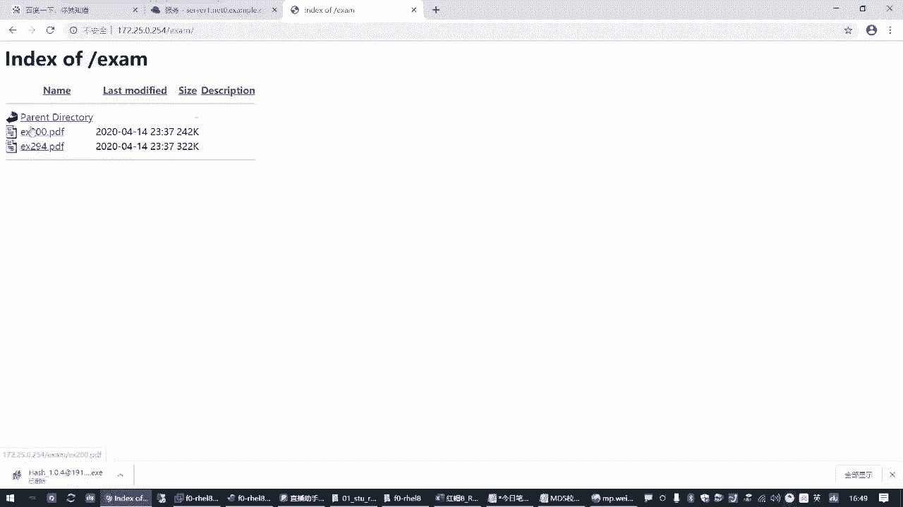
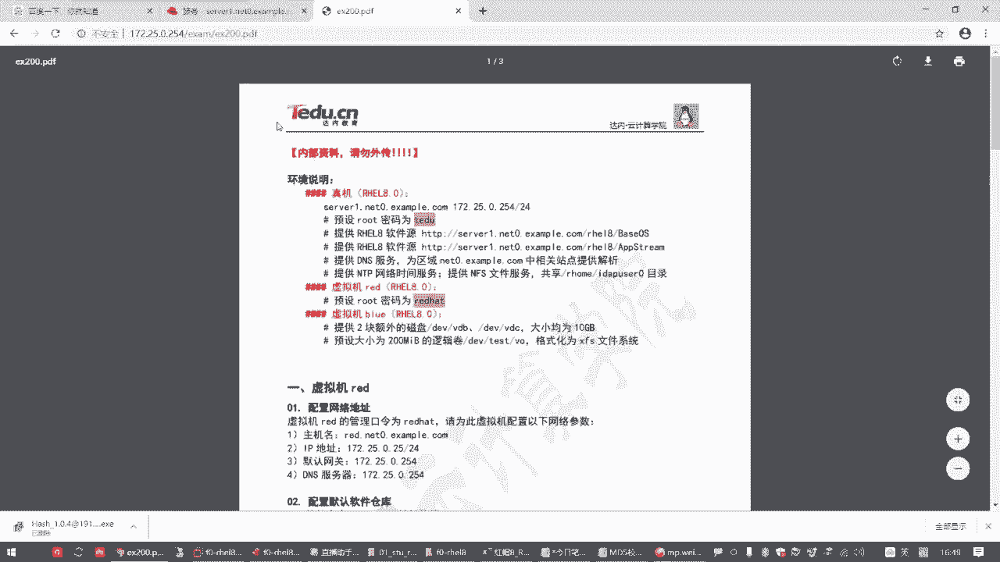
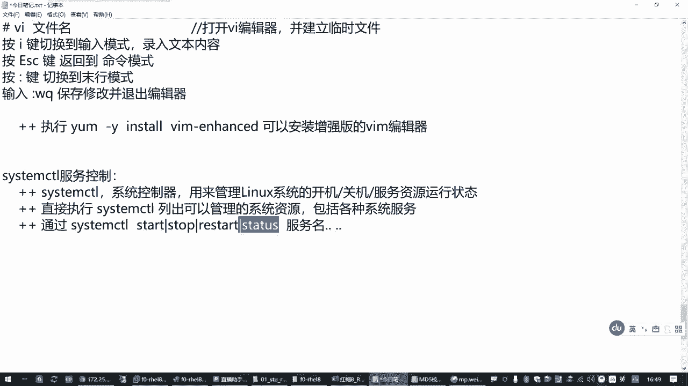
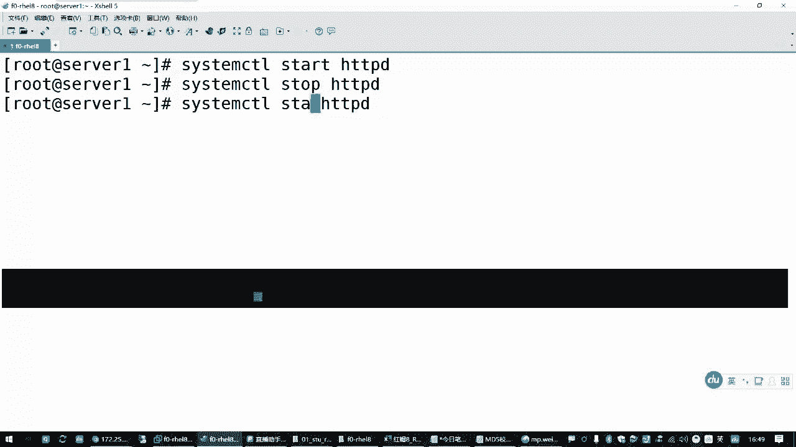
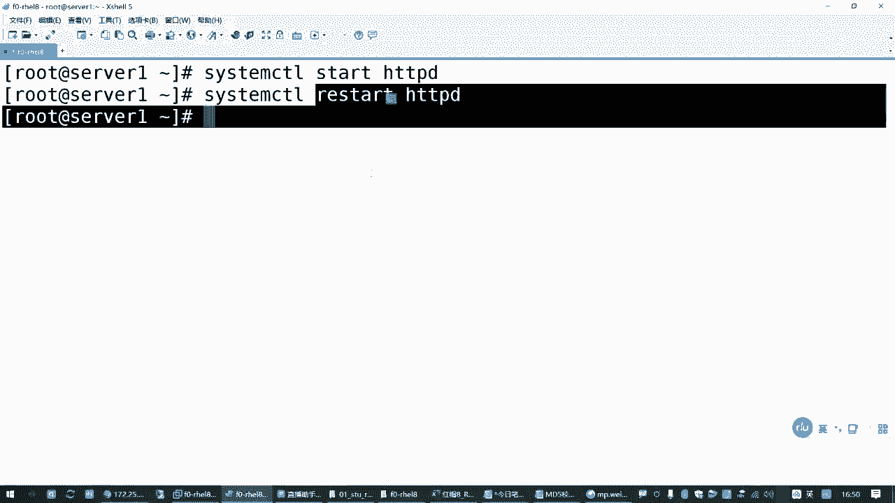
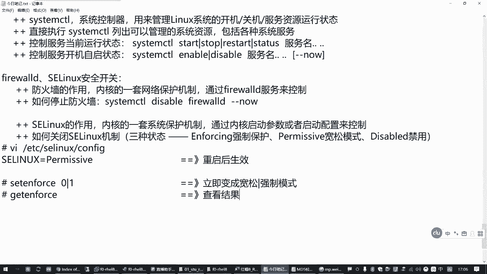
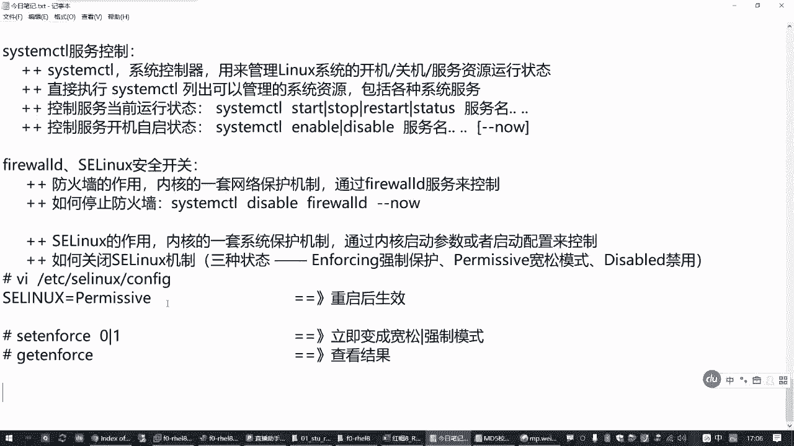
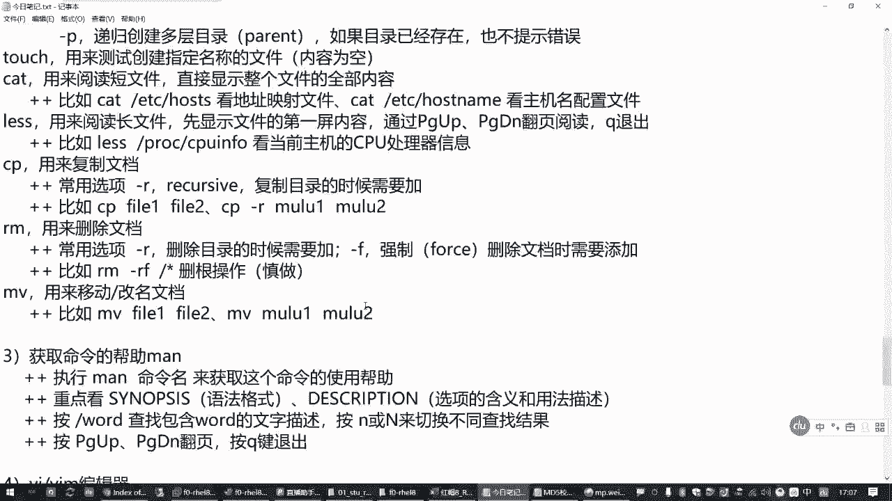
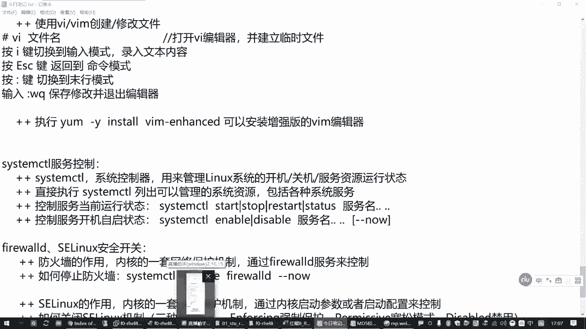

# 备考红帽认证必修课：P5：服务控制和安全开关 🔧

在本节课中，我们将学习Linux系统中两个重要的管理模块：服务控制和安全开关。服务控制主要使用 `systemctl` 工具来管理系统服务的运行状态和开机自启。安全开关则涉及防火墙（firewalld）和SELinux的启用与禁用。掌握这些基础操作是后续学习和考试的基础。

## 服务控制：systemctl 🛠️

上一节我们介绍了课程概述，本节中我们来看看服务控制的核心工具 `systemctl`。`systemctl` 是系统控制器，用于管理Linux操作系统的开机关机以及各种系统服务的运行状态。

以下是 `systemctl` 命令的基本用法：

*   **列出可管理的资源**：执行 `systemctl` 命令可以列出当前系统能够管理的所有资源，包括各种系统服务。
*   **启动服务**：使用 `systemctl start <服务名>` 命令可以启动一个服务。
*   **停止服务**：使用 `systemctl stop <服务名>` 命令可以停止一个服务。
*   **重启服务**：使用 `systemctl restart <服务名>` 命令可以重启一个服务。
*   **查看服务状态**：使用 `systemctl status <服务名>` 命令可以查看服务的当前运行状态。





例如，要启动一个名为 `httpd` 的网站服务，可以执行：
```bash
systemctl start httpd
```
要停止该服务，则执行：
```bash
systemctl stop httpd
```
要查看其状态，执行：
```bash
systemctl status httpd
```
在红帽7和8系统中，`systemctl` 可以同时控制多个服务，只需在命令后以空格分隔多个服务名即可。





## 服务开机自启设置 ⚙️

除了控制服务的即时运行状态，我们还需要管理服务在系统开机时是否自动启动。



以下是设置服务开机自启的命令：

*   **启用开机自启**：使用 `systemctl enable <服务名>` 命令可以让服务在开机后自动运行。
*   **禁用开机自启**：使用 `systemctl disable <服务名>` 命令可以禁止服务开机自动运行。
*   **启用并立即启动**：使用 `systemctl enable --now <服务名>` 命令可以同时设置开机自启并立即启动该服务。

例如，希望 `httpd` 服务开机自动运行，可以执行：
```bash
systemctl enable httpd
```
如果不希望它自动运行，则执行：
```bash
systemctl disable httpd
```

## 防火墙控制：firewalld 🛡️

接下来，我们来看安全开关的第一部分：防火墙。防火墙（firewalld）是内核的一套网络保护机制，通过 `firewalld` 服务来控制。在初学阶段，为了方便练习，可以将其关闭。

以下是控制防火墙状态的方法：

*   **关闭防火墙（立即并禁用开机自启）**：执行 `systemctl disable --now firewalld` 命令。
*   **启动防火墙**：相应地，使用 `systemctl enable --now firewalld` 命令可以启用并启动防火墙。

例如，关闭防火墙的命令是：
```bash
systemctl disable --now firewalld
```

## SELinux 安全开关 🔒

安全开关的另一部分是SELinux。SELinux同样是内核的一套系统保护机制，但它不通过某个服务控制，而是通过内核启动参数或配置文件来管理。

SELinux有三种运行状态：

1.  **`enforcing`**：强制模式。策略完全生效，违规操作将被阻止。
2.  **`permissive`**：宽松模式。策略生效，但仅记录违规而不阻止操作。
3.  **`disabled`**：禁用模式。完全关闭SELinux。

以下是控制SELinux状态的方法：

*   **永久修改状态（需重启生效）**：编辑配置文件 `/etc/selinux/config`，修改 `SELINUX=` 后面的值为 `enforcing`、`permissive` 或 `disabled`。
*   **临时切换模式（无需重启）**：使用 `setenforce` 命令可以在 `enforcing` (1) 和 `permissive` (0) 模式间临时切换。例如，`setenforce 0` 设置为宽松模式。
*   **查看当前模式**：使用 `getenforce` 命令查看当前SELinux的运行模式。

例如，将SELinux永久改为宽松模式，需编辑配置文件：
```bash
vim /etc/selinux/config
```
将 `SELINUX=` 的值改为 `permissive`，然后保存退出并重启系统。

若要临时设置为宽松模式，可执行：
```bash
setenforce 0
```




## 总结 📚



本节课中我们一起学习了Linux系统的服务控制与安全开关管理。






我们掌握了使用 `systemctl` 工具来启动、停止、重启服务以及查看服务状态，并学会了设置服务的开机自启。同时，我们也了解了如何管理防火墙（firewalld）和SELinux的开关状态，包括关闭防火墙以及修改SELinux的运行模式（强制、宽松、禁用）。这些是Linux系统管理中最基础且常用的操作，务必熟练掌握。


> 注意：在实际生产环境中，应谨慎操作防火墙和SELinux，仅在明确需求或学习测试时按需调整。后续课程中我们会深入学习防火墙策略和SELinux策略的具体配置。