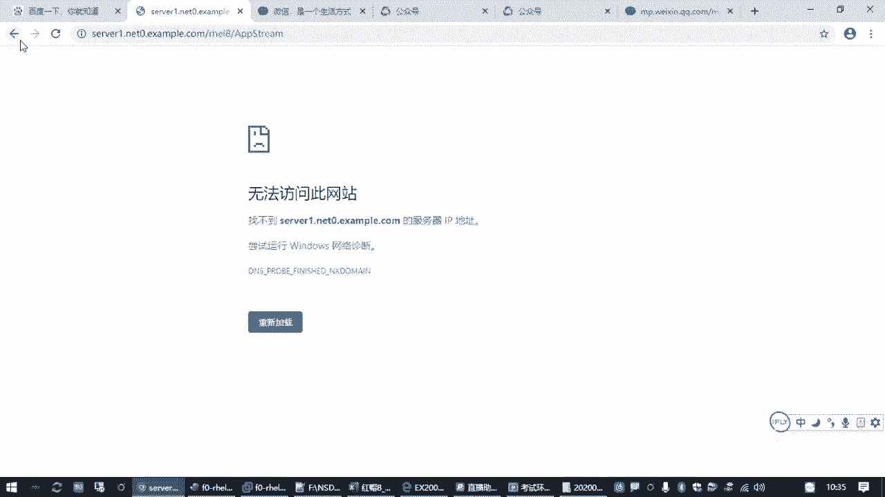
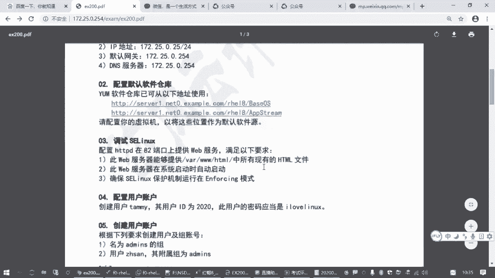
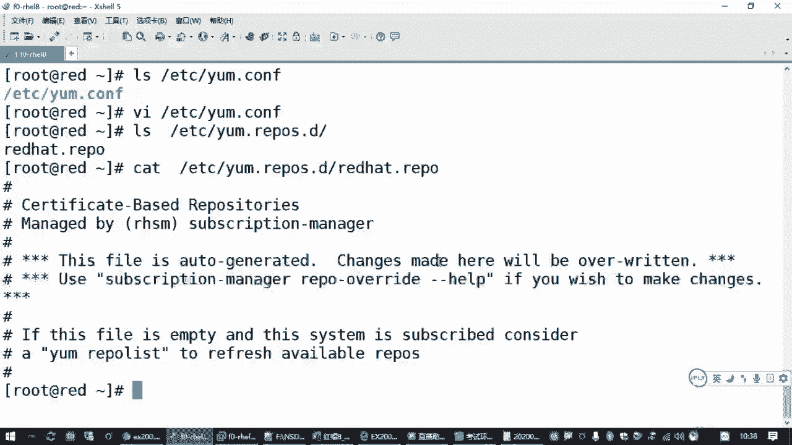
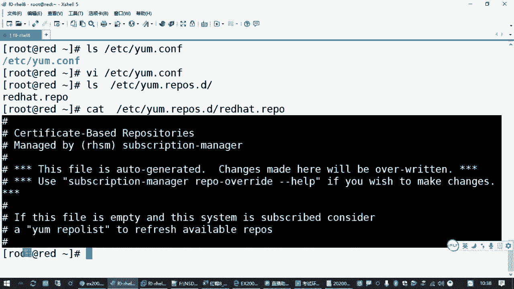
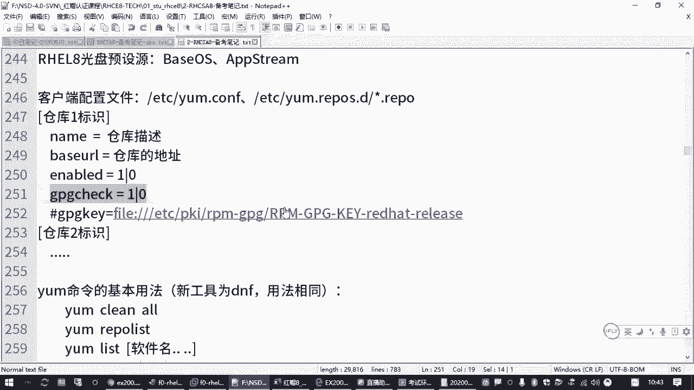
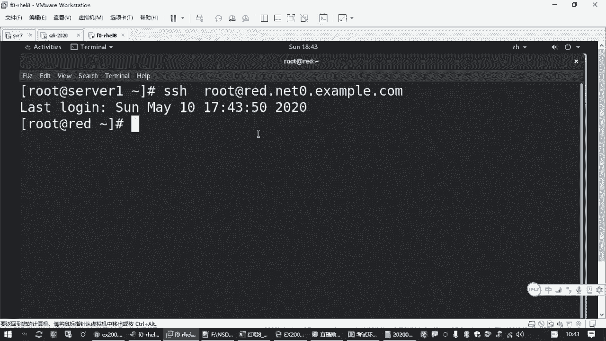
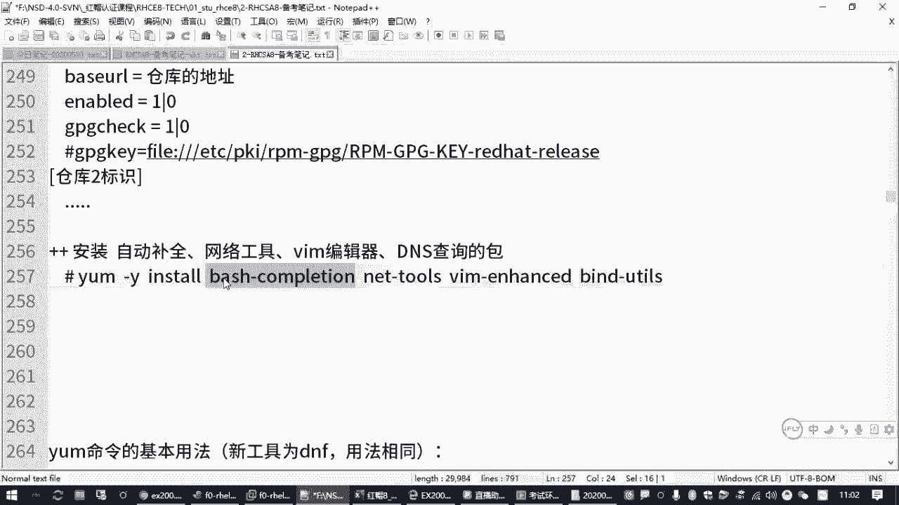

# 备考红帽认证必修课：P7：配置yum源 📦


在本节课中，我们将学习如何为红帽系统配置软件源（yum源）。这是安装和管理软件包的基础，也是RHCE/RHCSA考试中常见的操作。掌握它，能确保你的虚拟机可以顺利地从指定位置获取并安装所需的软件。

## 概述

上一节我们介绍了如何配置网络地址，确保虚拟机能够连接到网络。本节中，我们来看看如何配置软件源。软件源（或称软件仓库）是系统安装软件包的来源。在红帽系统中，我们通常使用 `yum` 或 `dnf` 命令来管理软件包，而这些命令需要知道从哪里获取软件包。

## 理解yum源





`yum`（Yellow dog Updater, Modified）是红帽系统中经典的软件包管理工具。在红帽8及更高版本中，它被 `dnf` 取代，但 `yum` 命令仍然可用且兼容。无论是使用 `yum` 还是 `dnf`，要安装软件包，首先必须正确配置软件源。

例如，安装网络工具包的命令是：
```bash
yum install net-tools
```
但如果系统没有配置可用的软件源，命令会失败并提示 `There are no enabled repos`。

## yum配置文件



`yum` 的配置文件主要位于两个位置：
1.  **全局配置文件**：`/etc/yum.conf`。此文件控制 `yum` 命令的全局行为，例如是否进行软件包签名检查。
2.  **仓库配置文件目录**：`/etc/yum.repos.d/`。管理员在此目录下创建扩展名为 `.repo` 的文件，来定义具体的软件仓库。



系统可能已存在一个默认文件（如 `redhat.repo`），但通常其内容被注释（以 `#` 开头），因此不生效。我们需要创建自己的 `.repo` 文件。

## 配置软件仓库

以下是配置一个软件仓库的基本格式和核心选项：

```ini
[repository_id]
name=Repository Description
baseurl=http://path/to/repository
enabled=1
gpgcheck=0
```

*   **`[repository_id]`**：仓库的唯一标识符，不能重复。
*   **`name`**：仓库的描述信息。
*   **`baseurl`**：软件仓库的实际访问地址，这是核心配置。
*   **`enabled`**：是否启用此仓库，`1` 为启用，`0` 为禁用。不写此行默认为启用。
*   **`gpgcheck`**：是否进行GPG签名验证，`1` 为检查，`0` 为不检查。为简化操作（尤其在考试环境中），通常设置为 `0`。





## 实战：配置考试要求的yum源

假设考试题目提供了两个软件源地址：
*   `http://content.example.com/rhel8.2/x86_64/dvd/BaseOS`
*   `http://content.example.com/rhel8.2/x86_64/dvd/AppStream`

我们需要创建两个对应的仓库配置。

1.  **创建仓库配置文件**：
    进入配置目录并创建一个新的 `.repo` 文件。
    ```bash
    cd /etc/yum.repos.d/
    vi local.repo
    ```

2.  **编辑文件内容**：
    按 `i` 键进入编辑模式，输入以下配置。注意根据题目要求替换 `baseurl` 的地址。
    ```ini
    [BaseOS]
    name=BaseOS Repository
    baseurl=http://content.example.com/rhel8.2/x86_64/dvd/BaseOS
    gpgcheck=0

    [AppStream]
    name=AppStream Repository
    baseurl=http://content.example.com/rhel8.2/x86_64/dvd/AppStream
    gpgcheck=0
    ```
    编辑完成后，按 `Esc` 键退出编辑模式，输入 `:wq` 保存并退出。

## 验证与测试

配置完成后，需要验证仓库是否可用。

1.  **列出可用仓库**：
    执行以下命令，查看配置的仓库是否被正确识别。
    ```bash
    yum repolist
    ```
    如果配置正确，你将看到 `BaseOS` 和 `AppStream` 两个仓库及其描述信息。

2.  **安装软件包进行测试**：
    使用新配置的源安装一些常用工具包，这既能测试源是否工作，也能完善系统环境。
    ```bash
    yum -y install bash-completion net-tools vim bind-utils
    ```
    *   `bash-completion`：提供命令自动补全功能。
    *   `net-tools`：提供 `ifconfig`、`route` 等传统网络工具。
    *   `vim`：增强型文本编辑器。
    *   `bind-utils`：提供 `dig`、`host` 等DNS查询工具。

    安装成功后，建议断开并重新连接SSH会话，以使 `bash-completion` 的自动补全功能生效。

## 总结



本节课中我们一起学习了配置yum源的全过程。我们首先了解了yum源的作用和配置文件的位置，然后学习了仓库配置文件的格式和关键参数。通过实战，我们一步步创建了符合考试要求的仓库配置，并学会了使用 `yum repolist` 和安装软件包的方式来验证配置的正确性。正确配置yum源是后续所有软件安装和管理工作的基石，请务必熟练掌握。