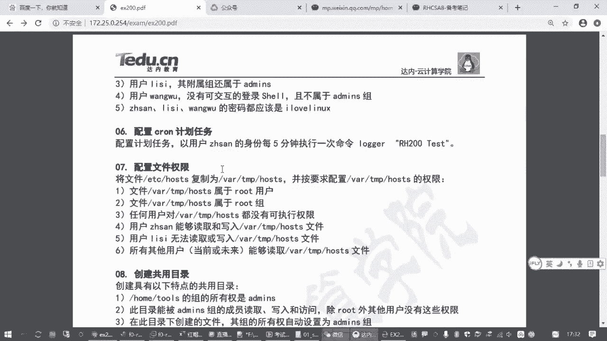

# 备考红帽认证必修课_RHCE／RHCSA／Linux云计算架构师 - P14：2.09-cron计划任务 - 达内-达达小助手 - BV1KS4y1N7RQ

计划任务啊，咱们考试的时候有一道题目是这个样子的，来我来找一下数一数啊。

这里有一个咱练习题。

有个第六题是吧，你看他操作就一段话啊，要求配置一个计划任务，以用户张三的身份每五分钟执行一次命令，就这样吧啊所以计划任务这一块的话呢，大家一方面要知道什么叫计划任务。

然后第二个方面我们怎么样去配置这个计划任务是吧，能做到这个就搞定了啊，啊那相关的知识点这一块的话呢，来我们看一下，那首先一个要知道计划任务，它的含义其实很简单，就是按照我们管理员规划好的时间点。

在指定的时刻，按照那个时间点来去执行某一个任务，所以叫计划任务嘛，就是你管理员提前安排好的啊，到那个时间就自动执行，到那个时间就自动执行，比方说我每个星期六晚上做个备份啊，对不对，就类似这种的啊。

然后每天早上星期一开始的时候，给我把那个网防火墙打开，禁止员工上网访问那些什么电信网站，对不对，这都叫计划任务吧，所以大家等你们以后做这个运维工作的时候，肯定会经常用到这个东西啊。

就是按照计划的时间去执行指定的任务，那在红包的系统里边呢，要实现这个功能，需要有个软件包叫cd，这个一般不需要我们自动去装啊，不需要我们手动去装啊，为啥，因为这是一个系统必备的一个东西啊。

几乎所有的红包系统都要用到这个计划任务，有很多系统任务也需要用它来完成，所以对应的软件包是自动装好的啊，自动装好的嗯你要去了解的话呢，应该有一个包叫做查一下吧，就叫curtables是吧，哪能找到。

但一般我们一般都不管啊，一般都不管，你就知道一下就行啊，那有这个服务之后呢，而且在红帽的系统里面，这个服务默认也是自动运行的，你会发现它默认就是自动运行的，你除非哪天红红包抽风了。

给你给你把它给关了是吧，一般很很少啊，一般不会有这种情况，所以这个服务默认都是开机自自己的，但是你要知道这个方式啊，你要知道这个服务万一他挂了呢，你要知道怎么把它打开是吧。

所以这个状态啊你要注意知道怎么去检查呃，那这个服务启动之后，如果我们管理员希望他在某个时间点去执行一个任务，怎么办呢，那大家就要知道它的一个配置文件，那配置文件的话呢。

呃有一个全局的配置文件是在etc下面叫table，这是针对所有就整个操作系统的啊，有个文件呢在etc下边叫，t a b就表格吗，这计划任务表格嘛是吧啊。

你可以打开这个文件去看它有一些命令环境的一些设置对吧。

然后呢它下面是具体的一些任务。

但是下面的注释掉了啊，其实就没有啊，没有设置啊啊这个文件为什么大家了解呢，有个好处，他可以告诉我们，你再添加一个在指定时间执行的任务的时候，怎么去做好，怎么去做。

那这里呢我们可以看到它这个样板是吧，写的还挺好的哈，你看正常的记录就是下面这一条，这是一个例子啊，那从左到右有五个星号，这五个信号呢在配置这个计划任务的时候，你要把它改成具体的时间。

第一个信号对应的是分钟，你看这个箭头指过来的，第二个信号对应的是小时，第三个一个月里的第几天，第四个1年的第几个月，那其中呢星期天可以用零表示，也可以用七表示，对星期天啊，星期七嘛，这就是时间的表示。

然后呢最后这一点是你要执行的那个任务的那个命令，就这样的吧，那如果你在这个文件里面去添加一个任务，那你中间要写这个任务是属于哪个用户的，因为运行一个任务呢，它需要指定一个用户，所以大家如果你按这种方式。

你写星号空格，信号空格信号空格，你写五个信号，中间可以写一个root，后面再写一个命令对吧，写一个命令，比方说你定期做一个备份啊，或者做一个什么什么操作，那随便扫什么操作吧，这个不是重点。

你在后面写上那个命令就行了，不是比方说你要配个ip啊，或者做个什么做个备份啊啊创建一个文件呀，是吧啊，b下的mad啊，创建一个目录对吧，这都行，那么这一段话的意思就表示每分钟啊，为啥每分钟啊。

因为这个星号就代表你看在分钟这里面，它代表的是0~59分钟，然后小时这里的信号代表的是0~23分钟啊，0~23小时，零点到23点吧对吧，所以你如果写五个信号，就是每一分钟。

但是如果你希望是每个小时整点的时候只执行一次，那你要把第一个分钟改成一个具体的数，比方说零分钟对吧，那就是每一个小时的零分钟执行这个任务啊，那因此大家在写这个任务的时候，要注意的一点啊。

就这个时间的格式分时日月周，然后表示具体的时间的时候呢，有几种表示方式啊，大家要知道啥意思呢，如果是星号表示每一个时间点啊，就对应的分钟或者小时，每一个时间点，那如果是一个时间范围，用减号分开。

如果是一个比方说第15分钟，第七分钟，第九分钟用逗号分开，然后星号斜杠三，这表示每多少多少啊，这一串放到分钟这里边啊，分钟这里就是每三分钟放到小时，这里就是每三个小时放到日期，这里就是每三天放到月份。

这里就是每三个月对吧，然后你比他小的时间点，那打个比方，你如果第一个写一个新号，要避免一些误区啊，然后分时日月周日啊，周日期这里啊，每个月第几天你写一个呃，比如说写一个五，那分时日月周。

那这就是每个月的5号吧，但是这个操作你要注意啊，要特别注意这个操作，他不是说在每个月的5号去执行执行一次，他是会在每个月5号去执行，但是呢它会执行n多次，为啥，因为到每个月的5号的时候。

每一个小时每一分钟都会执行啊，如果你希望每个月的5号执行一次，那你一定要写一个具体的时间点，比方说每个晚每个月每个月5号晚上22点对吧，这时间表示要注意，然后刚才我们讲过了，如果是每五分钟要怎么表示啊。

新号斜杠五，那后面星号没有说哪一天是吧，都是星号，这叫新号斜杠五，这就表示在每一分钟，但是呢要有个隔断间隔，斜杠五不是除以五啊，不是除以五啊，是每五分钟啊，你发了分钟这个地方，然后前面不能有空格啊。

不能有空格，这个时间表示，但是大家不要直接改这个文件啊，一方面这个文件他要写用户名，麻烦是吧，大家如果你要去写的话，也可以写啊，但是不建议大家在这么做，那如果我要给一个普通用户写一个计划任务怎么办呢。

你不要直接改这个文件，为什么呢，我们在配计划任务，有专门的工具，还有专门的工具，这个工具叫con table，要编写计划任务，connetable杠一啊，一代表的意思是edit好编辑的意思对吧。

所以简写是e你要查看你的任务呢，杠l要删除任务，杠rl就是list列表对吧，那r是啥意思啊，remove删除，所以有这个工具，如果你是管理员，你可以控制普通用户的计划任务啊，为啥要有这个东西啊。

因为计划任务是在后台运行的，不需要用户登录，但是有些特殊的任务呢就是给普通用户用的是吧，你要给他指一个身份，所以刚才我们说在全局配置文件里面是不是有个叫ud内，但是如果你指定给某一个用户去设置。

那你就不用，不用指定用户用户名的啊，就是因为你在命令行已经指定了，比方说我们给张三用户设置计划任务，要加一个杠u张三普通用户他可以给自己定义计划任务啊，定义好的计划任务存在哪呢，存在vr底下。

破这个目录下有个chro，然后在cr底下呢有一个用户名同名的文件，但是不要直接用vm去编辑啊，为啥我们con table杠一他就是在帮我们调用vim编辑器，这样最简洁，而且你编辑好了之后。

一旦你保存它就自动通知你那个肯乱计划任务那个服务告诉他啊，用户添加了一个任务啊，你帮我帮我装一下是吧，就起这个作用的啊，来我们先看一下管理员自己的可on这波gl就是看root的计划任务。

那如果你要看张三的计划任务呢，加杠u张三对吧，这两个用户默认都是没有计划任务的啊，那如果我们要添加一个计划任务，就把这个杠l改成杠一，那回到我们的题目里面来，是不是要求我们配一个计划成五，让张三张三啊。

以张三用户的身份每五分钟执行一次命令啊，那然后大家记住这个时间来表示格式啊，然后我们con这波杠一表示编辑指定用户编他的计划任务回车，这个操作呢它会临时调用vi编辑器打开一个临时文件。

你如果后来有修改再保存退出，这个文件就存在，如果你没有改过退出，那这个文件就消失了啊，然后按i键就可以用vi编辑器一样的去编辑，刚才我们说了分时日月周对吧，你就记住这个顺口溜，分时日月周。

然后第二列刚才我们看全局配置，这个格式是不是应该中间要写个用户账号，张三的后面再写了个命令，但是现在你已经管理员指定了，我编写的就是张三的计划任务，这个用户你就不用想了啊，直接写计划任务那个命令操作。

这个命令操作，那题目给你怎么怎么写，你就复制粘贴呗，最后那个句号别复制上，是这意思吧，复制这条命令贴进来，就这个其实在工作当中啊，大家应该用绝对路径啊，为啥呢，因为系统里面。

因为系统里边你这个任务在后台运行的，他可能找不到你那个命令，所以比方说我们找一下那个node这个程序对吧，一般是用用用这个路径的工作当中，就刚才大家你看我们改完任务之后，他会有个提示啊。

安装了一个新任务是吧，刚进去的时候是没有的啊，所以用了一个空的，然后我们再打开，那就是说工作当中啊，大家注意听啊，工作当中呢建议大家用这个绝对路径，这是最靠谱的做法啊，但是考试的时候呢感觉别这么麻烦啊。

因为你也不知道这个也记不住这个在哪是吧，一般考试的时候最省事的做法，怎么节省时间，怎么来，直接复制这一段命令贴进来就好了，前面时间不能写错，刚才我们说的是每五分钟。

那所以大家一定要记住每五分钟怎么表示啊，应该星号斜杠五是吧，放到第一个段落这里啊，分时日月周嘛，你要念一下是吧，新号斜杠五，那你确认没有问题，然后再保存退出去安装新的计划任务表就可以了对吧。

那我们这个计划任务有没有执行啊，我咋知道啊，那这个大家如果想测试，那像刚才我们这个任务你编辑完了之后呢，一方面你可以告l去看一下呀，如果发现这个任务没有问题，那就是对的。

这是最省事的做法哈啊但是为什么还有一个方面呢，就是大家看的时候啊，编辑的时候，如果你这个时间写的不对，他会报错的啊，比方说小时这里我写了个25，这对不对，分时日月周每天的25点没这个东西吧。

那你在保存的时候存不了的啊，他会报错啊，会有提示，你看第一行bad north是小诗，写错了，他做错了，那你没法保存啊，那你要不要从事是吧，你说一个e进去再改，所以这也是检查错误的一种方法啊。

所以你不能写错格式，要对格式说，它就会提示你，直到你格式正确，然后保存退出去对吧，他要提示你安装一个新的计划任务为止，ok吧嗯那到底有没有真的执行呢，那你就得只能等到那个时间点呢，要不你改时间也麻烦啊。

这方法还是有很多，你等五分钟之后，你可以去检查什么呢，你可以去这个命令叫tell，tell是看一个文件的最末尾，你可以看一下挖下的log底下有个clown，在系统里边有个日记本啊。

这个日记本呢记录了计划任务，他都做了哪些操作，在什么时间做的计划任务啊，那个时间记录你要看这个文件最末尾啊，最末尾你要看到了哪个时间点的时候，他会去执行这个任务啊，你可能要等几分钟，对不对。

如果你能够等等五分钟之后，你能看到他有了一条，那说明你就执行了，你比方说上面我们往上看一下，上面我们一开始是不是没有改这个时间啊，是不是每分钟执行一次啊，所以你看他这里以张三的身份执行了一条这个命令。

这说明你计划任务管用了呗，ok吧是吧，那这是计划任务啊，计划任务这道题目，那因此呢这道题目大家在做的时候，我们刚才给大家也讲了一堆啊，那它的要点在哪里啊，就你要知道d这个服务要确保它是运行的。

然后第二个要点写计划任务的时候，那个日期那个日期呀，那个格式日期和器官任务那条那条命令是吧，怎么去写，如果你忘了的话，请参考etc下的con table这个文件，当然我们参考的时候呢。

你可以找到分时日月周，虽然是英文的是吧，但是你有肯定比没有好呀，你看从左到右分时日月周，然后你用的时候呢就这一串啊，你把用户名去掉，那这是第二个要点，那第三个我们在改任务的时候呢。

就是这个计划任务rotable，他的时间表示方式啊，不间隔的不连续的，连续的所有值和每多少多少值是吧，都要学会啊，包括下面这种，比如说你写一个一到15斜杠三，你要发到日期在里面，就是每个月的一到15号。

这一段时间就上半个月，每三天啊对吧，所以这个表示方式很灵活很灵活啊，然后配置工具呢就主要是这三个用法，要知道怎么去编辑，怎么去查看，怎么去删除，其实编辑你删除你不会都没关系。

你大不了你编辑进去再手动删除嗯，使用ctrl z b杠一就是调用一个vi编辑器啊，所以和vi编辑器的用法是一样的，就改就好了，查计划任务执行情况对吧，那今天咱们就讲到这个计划任务在最后一个啊。

然后下一次我预计啊有可能会时间会长一点哈，今天咱们就先讲到这吧好吧，那大家呢还剩下十分钟时间啊，可以把我们的计划任务这道题做一下啊，其实操作啊，你看看操作你简简单到什么程度啊。

其实上面这两条你考试的时候根本就不用做，你直接con table杠一杠u张三，然后写好时间复制粘贴就完事了啊，就这一个操作啊，那大家剩下的时间呢，你把这个题做一下，然后呃针对我们今天讲的内容啊。

如果有什么疑问的话，也可以反馈一下啊，我们再做个答疑好吧，大家思考一下，刚才我们讲到的这个日期在表示分时日，月周决定你这个任务在每个月第几天执行的，是不是又有一个几月几号，然后又有一个星期几啊。

这两个时间点都可以决定你是第几天做，那这两个有个关系啊，那假设你写一个每个月的5号，然后星期这里也有个每个月每个每个星期五，那这个时候呢只要满足一个条件就行啊，就每个月第5号也会做。

然后星每个星期五也会做，一般星期几这个我们一般很少用，除非是有那种特殊的任务，就是周末的那种要执行的，那就是日期，这里呢我就不用日和周，这个地方一般就用一个，你要不想自己纠结的话呢。

