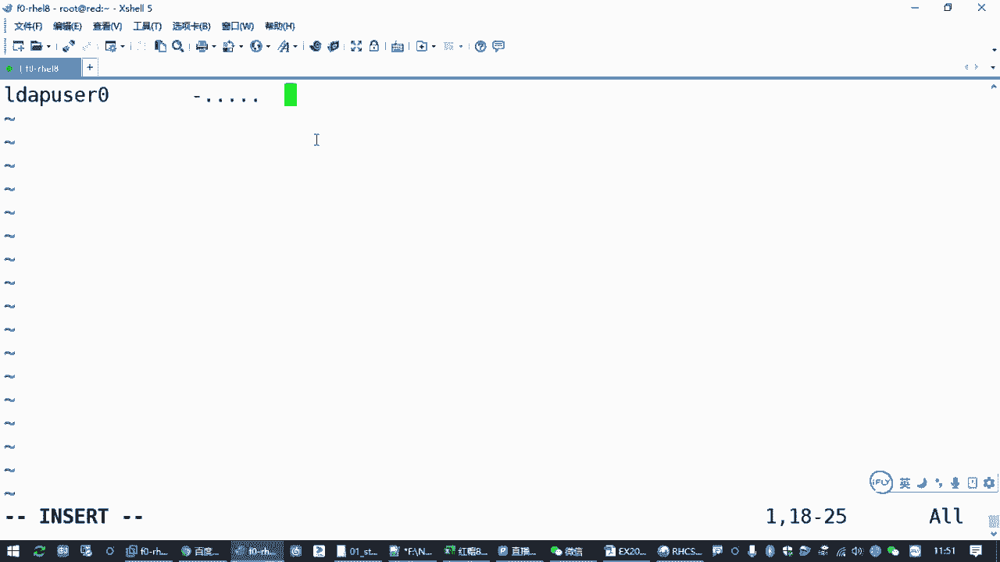

# 备考红帽认证必修课_RHCE／RHCSA／Linux云计算架构师 - P18：3.04-autofs自动文件系统 - 达内-达达小助手 - BV1KS4y1N7RQ

来，那接下来我们看一下我们的。奥特FS那道那道题目啊。

呃，那奥特SS这道题目的话呢，在考试的时候是要求我们去配置。配置OWS能够自动挂载远程用户的一个主目录。那这里涉及到一个机制啊，叫LD那考试的时候呢，它会在我们一个服务器上，像这里的我们练习环境。

就是练习环境就是这个设备一，它会在这个服务器上呢给我们提供一个用户账号，而且这个用户账号呢是配完了啊，配完之后，你在你的虚拟机上是可以通过这个用户账号去登录的。对吧他可能会告诉你，你要验证的时候呢。

是可以用LDLW的0去登录到你的讯机。啊，意思就是你就是说你这个red这台机器啊。

你到时候是可以直接。竖杠到LW user0。对吧是可以这样的啊，但是要注意咱们练习环境没有啊，咱练习环境没有，所以咱们练习环境呢没有这个用户。😊，以前在红贸期的考试里边。

是我们需要去配置这个LDAB客户端的。但是在八个考试里边，这个客户端在考试的时候，他已经帮你配好了。配好了之后你可以直接用啊直接用。但是这个用户呢你直接用之后，你可以竖杠登过去，但是它没有加目录。

所以红帽八的考试考点里边，他要求我们做的是什么啊？

是要求我们配置一个out，能够为这个账号呢准备好加目录。

啊，当然这个用户账号呢，它本身就不是在你ro的这台机器上的。

它是由考试环境里边考试服务器帮我们提供的。所以他的用户账号密码都存在考试服务器上。它的加目住也存在考试服务系统。😡，现在呢他已经帮你配好了，你能够用这个账号登录了。😡，但是加工了没有，那怎么办呢？

考试的时候，他会把这个加目录通过NFS共享给你啊。这有一个叫做网络文件系统是吧？叫NFS它会在这个服务器上提前把这个目录共享给你的这台讯机。那我们要做啥？

我们要做的就是你要配置一个叫outFS自动文件系统。当这个用户一登录的时候，他能够有他自己的加目录。那这个问题就解决了。所以只要这个用户呢一登录他的加盟度就会有。正是考试的时候啊，是这样的啊。

那咱们练习的时候，我们不说了吗？

你这个账号是没有的是吧？我们也没有在搜E上配置一个呃那个叫什么LDAP啊，没有配一个那个东西啊。但是这道题目本身就是给大家介绍一下这个环境啊，但是我们在用的时候呢，你需要知道什么呢？

一方面就是我们要知道。😊，关于这个文件系统，有个叫NIS。She。我们平时我们在本机访问我们的跟分区啊啊VDAE啊是吧？啊，你看我们这个有同学应该接触过是吧？

FSTAB这个文件记录了你本机挂载的这个跟分区是哪个设备是吧？这些文件系统啊，你用的叉FS也好，嗯，那个什么交换分区也好，这些文件系统都是存在你本机的磁盘上的。

She。EXT4或者什么叉FS。或者什么fi这32呀是吧？或者什么我们那个是wi呀。😊，你准备的这些设备啊都是在本机磁盘上的，这叫本地文件系统。那另外还有一个叫NFS，这个叫网络文件系统啊。

网络文件系统的意思就是说你的你的这些资源不放在你本机的磁盘上啊，是放在互联网上。当然很多时候其实不是互联网，就是你局域网机房内网服务器之间的啊一个网络，它共享给你一个存储，这叫有一个啊类型叫NFS。

叫网络文件系统。当然其他的还有那个什么三把呀也算是吧？这个我们现在用的不多了，这个三把共享的话呢，其实就是兼容我们微软的那个windows系统的windows共享。😊，Yes。啊，跟那个就是一个东西啊。

linux系统里边，如果你要用windows的共享，那其实就是桑把。有相关的客户端，相关的服务端。那我们现在考的讲的是NFS。

来再回到题目，他是告是不是告诉我在这个服务器上已经给我们把这个资源共享给你的讯拟机了。而且它共享的目录呢是are home啊，他告诉你一个目录，叫这个，而且这个目录下边呢已经包含了这个用户的总目录。😊。

对你要想办法干嘛？你要想办法把这个目录呢放到你的机器上，要能用。😡，怎么用啊？😡，看第三条第四条。这个目录在你搜唯一的这个主机上，它的地址是它共享给你的rho下边有一个子目录叫LW的0。

然后在你的主机上应该怎么办呢？应该自动挂载到一个叫Rho下的LW0。就是在serv零上，在serv一上的这个目录应该出现在你的机器上这个目录。只有你做完这个操作之后，那么这个用户LWU的0，他一登录。

他才能够用他自己的主目录，他才有权限去写入。ok吧，这是题目的要求啊。当然咱们练习环境呢，因为它没有这个账号是吧？😊，但是我们配置的要点是能做的，我们一样需要去配置一个outtoFS，能够实现。

当我们需要访问这个用户主目录的时候，它能够自动出现。就OK了嘛。😡，虽然不能实现这个用户登录需写入，但是你只你可以用LS命令去看一下。如果你LS命令一看这个目录，这个目录就有了。

那么这个题就算那个考点你就掌握了。那这个考点我们刚才讲过了，这个outtoFS指的又是啥呢？那刚才我们讲的第一个点，你要知道怎么去访问NFS资源。第二个点，你要知道怎么样去配置outtoFS。

让奥特FS实现自动挂载啊，自动挂载。这个自动挂载讲的是啥呢？就是当我需要用一个目录的时候，它能够把那个资源给拿过来。当我不需要用这个资源的时候。😡，这个资源自动就自动就消失了。跟那个流线变魔术一样。

是吧，马上快中午了，我想吃个排骨。那你手一伸，空中就过来一盘排骨，对吧？那你吃那个排骨被你吃完了，你往上一丢，盘子就消失了，对吧？这这个叫自动挂载啊，自动挂载呢。😡，跟我们埋地雷一样啊。我们埋设的地雷。

这个引爆点就是你本机的RhoLW的0。你在这个地方买颗雷，只要你用脚一踩它就能爆是吧？啊，但然我们这不是真的去踩爆，我们是需要用我们的程序或者我们的命令。只要你去访问一下这个目录。😊。

然后这个目录下边呢，就自动有服务器上这个目录下的资源。这就相当于把那个地雷给踩爆了，但是你没访问的时候是没有的。举个例子。😡。

现在你去找这个目录肯定是没有的。are home下的LWU的0。没有吧是吧？呃设至了你去看这个阿ho这个目录都是没有的。但是你配完奥F之后会有。啊，这就是我们要做的。对吧那我们从刚才这两个点来看啊。😊。

那一方面，如果我们要知道你服务器上共享的这个资源在哪啊。

刚说是我一。从我们的客户机来说啊，你要拿到我们NFS的一个资源。检查的方式。

一般就是修慢的啊。杠1。这是查找对方导出有哪些资源，有个叫EX port输出嘛。杠一。去找我们的搜尾一这个福器，对吧？找这台机器。但是你执行这个操作的时候，你发现。😡，哎又包错了是吧，全命令。

咱们练习环境呢最小安装啊又少个包。😊，所以我们要少一个包装一个什么包呢？这个包叫NFS杠Us。这是支持访问NFS文件系统的一些。软件一些命令啊，都是由这个包提供的。啊，你哪怕你要提供共享。

也是用这个包啊。所以要装一下这个包，装好这个包之后呢，那如果我再来检查是吧？smount杠一去检查，你就可以看到，哎，这个服务器共享了一个目录叫areho，允许我们172。25。0。0这个网段来访问。

那正常我们想如果想把它永久挂载的话啊，怎么办？对吧你要去改配置文件啊，就要永久挂载。如果你想临时挂载的话呢，就直接用mot命令去挂载也可以。那被挂载的资源呢，其实就是这个目录，对吧？

是哪个服器啊这个目录啊，NFS文件服务器这个服务器呢你要写上服务器的地址。😊，或者他的IP都行，用冒号分格写上它的目录。你比方说把他的目录上挂载到我们的1个MNT。这是linux系统里边去装载一个分区。

装载一个网络资源的一种方式吧，是吧？有个命令叫man。中文翻译过来叫挂载嘛，这就是把服务器上的一个共享目录装到我们本机的一个目录里面来啊。你如果安装安装成功是吧？这个目录或者说一个设备啊。

安装成功再去看，你就可以看到它下边有一个目录，对不对？可以用这种方式，啊。当然如果你明确的知道它下边有一个这个目录。你在挂载的时候，可以直接在后面写上这个目录的名字。你可以挂察到另外一种路。

然后你挂载的时候，这你发现失败了是吧？😡，LDAPP啊写错了。U在0啊USER。对吧这也是可以的。你去看OBT。😊，你看OPD下面是吧啊，有东西的啊，只不过现在你没权限。😡，LW又的0。他挂载有东西的。

但是你没权限，因为这个目录呢只属于LW整0这个用户，他告诉你没权限，而没有告诉你没有这个目录吧，对吧？这是挂载成功的。这是手动去挂载啊。所以其实在我们lininux系统里边啊，你要使用一个存储设备。

要使用一个共享的资源。要挂载一个东西的话呢，有好几种方式。

Yeah。如果你要挂载的是本地的资源，手动挂载，直接操作。包括你挂载一个目录啊，都是这样的。😡，那如果是呃另外几种方式呢，除了手动挂载以外，你还可以实现开机挂载是吧？那你要改1个FSTAB文件。

里边写一条配置啊，你可以参考我们那个配置文件里面其他的根分区的一些挂载啊，改一改就好了。那还有一种方式呢，你如果在配置文件里面已经有东西，有已经有这个配置东西了啊，你也可以直接手动用半自动挂载啊。

这叫半自动挂载。就你mount只要写一个设备就可以，对吧？这个后面我们讲存储的时候，还会给大家再讲那个文件的啊。但是现在我们考点在里面啊，考的不是在这种方式，考的是一个叫触发挂载，或者叫自动挂载。

或者说叫按需自动挂载。😊。

用的就是out FS。

啊，那是啥意思呢？就是说我不需要用mount命令，直接把这样一个设备挂载到我们的一个目录。因为你一旦你mount挂载成功之后呢，除非你手动把它给取下去，或者你关机重启。

那这样的话呢，你OPD这些目录MNT这些目录这些挂载的资源呢会一直都在不安全嘛，是吧？😡。

啊，那我们自动化的有个好处，就是默认有个5分钟的一个时间。一旦它挂载上去，你5分钟你不用它它自动就消失了啊。😡，那个目录知道就消失了。而且挂载的时候呢，是当你去用它的时候，它才会有。啊。

再回到刚才我们讲过的那个。啊，后面那个地方来啊。我本地需要有一个目录叫are home是吧？LWU30现在是没有的，你啥时候看啥时候也没有，因为你没配置。要么你手动用mon去挂载，要么你配alto F。

那如果你要做RDFS呢，装包配置起服。啊，要有三个东西啊。装软件包的话呢，这个软件包就叫outto FS。所以要装一个auto FS的一个包。啊，这个包装好之后，你要去配置配置是干嘛？就你告诉他。

你来看我们这个题目，其实就是你得告诉他。😡。

这个煤你放在哪个地方？告诉他这个煤埋在哪是吧？然后这是第一个点。那第二个点，如果有人踩了这个雷会怎么样？😡，是不是你也得告诉他，那我们这里就是如果有人踩了这个雷。😡，要去挂载一个资源啊。

那这个没埋在哪呢？就是这个目录啊，你要用来装这个工享资源的这个目录在哪？你要告诉他上一层目录是什么位置。😡，然后这个地雷那个。引爆点就是这个LW的0。然，LW是0。相当于我们配置的时候。

你要说我打算在你的当前系统的R home下边埋一颗雷。啊，那个酶的那个引爆器呢叫LWPUZ0。如果有人一采爆这个引爆器，一访问这个目录是吧？那么请帮我们把这个目录给创建好。

并且呢自动把服务器上的这个资源挂载过来。这就是outFS他干的事。这些目录呢你只要只需要通过配置文件告诉他就可以。你不需要去提前创建啊，只需要告诉他应该在什么地方出现这个雷啊。😡。

那配置的时候怎么去配置啊？VM去找ETC下边有个文件叫al点ma啊。🎼这个。这是最主要的一个配置文件。这个配置文件里边呢，你往里面增加一行。😊，基本的格式在哪一个目录下边埋雷。

那我们现在是不是要areho呀？这个要按题目去啊，题目说你要把这个资序源挂着到你本机的某一个目录，你把目录的底下的一层不要上面这一层，就是你买每买哪一个那个房间啊，把那个房间号写上areho。

然后具体怎么埋雷呢？你后边要写一个文件，这个文件没随便啊，一般就放到ETC下面。比方说起个名字叫阿ho的入。这个扩展名没有要求啊，你写个ABCD也无所谓。为啥呢？这个文件是我们接下来你要创建的这个文件。

你你让他叫啥名就叫叫啥名字啊，因为你一会要用VIM编辑器创建这个文件，这个文件干嘛呢？那这行配置在干嘛呢？😡，这行配置语句是告诉altoFS说从现在开始，你要帮我盯着这个目录。

如果有人访问这个目录下的某一个文件或者某一个目录啊，目录啊目录如果有人要访问我这个目录下的一个子目录。你怎么办呢？你按这个文件里的要求去做，就你要这么去告诉outtFS。那具体怎么做呢？

要请听下回分解是吧？那就是请看这个文件里面怎么告诉你。那这个配置就做完了。所以这个文件里边你只需要配置这一行。告诉他一个目录，然后给他一个策略文件好，叫策略文件啊，你怎么叫都行啊。保存退出。

然后把你刚刚复制的这个策略文件的路径。用VM编辑贴出来。是吧。这个文件在这个文件里面，你要告诉他。😡。

如果有人踩了LW的零这个雷。请帮我们把资源挂载过来是吧？就有要爆炸的啊，叫触发嘛。

怎么写呢？把那个地雷的引爆器写到这。LW又在0，如果有人访问叫这个名字的那个子目录。然后中间有个挂载参数。你需要把我们服务器上的这个资源挂载到刚刚这个位置，对吧？你到时候你要把这个复制。

对吧复制要粘贴过来啊。😊。

W。就这个啊，那中间。你是不是要挂载过来之后。要加一些参数啊，你要告诉他呢，这个文件系统类型是网络文件系统。如果你还觉得有必要的，你可以加个可读可写啊，逗号RW。但是其实这个你默认如果不写啊。

也是可以的。😊，因为服务器共享给我们的已经是可写的，你默认不写不说呃可读可写，那么默认就是可读可写。你可以指定一个文件系统类型啊，叫NIS。那这两个文件一组合就搞定了。来第一行我们配了两个文件啊。

第一个呢是在alt点。マスト。加了一个这个设置，然后在我们后面这个策略文件里面呢，是加了一个。挂载的设置，这两个文件组合起来啊，就实现了一个效果。

当用户访问R home目录下的LDPU载0这个地雷的时候。奥特FS它会提前创建这个目录，创建这个子目录，并且把这个资源。按照NFS文件系统的类型挂载到这个位置。就可以了是吧？这就是配置。

那配置做完之后呢，你让它生效，你得把这个服务给启动啊。😊，来en out FS。干杠那。是吧启动成功之后，我们先LS看一下are home。这个目录你看有了是吧，然后你看一下r home下面的。😊。

但你现在看啊home下面是不是没东西啊，空的嘛？刚才我们开不是空的嘛，然后我们再去看一下LRho底下有个目录叫LDAPU的0，看一下有没有。😊，如果你看到有个提示。

告诉你permission denied啊。就说明成功了。怎么个意思呢？那你换一个目录看看有什么区别啊，我找一个LW一。😊，你是不是发现提示不一样啊？😡，LWU的一它是没有这个目录啊。😡。

但是LWU在0它有这个目录，只是你没权限。啊，为啥呢？来，我们LS再看上一层，我们加一个杠L看一下。你会发现它下面是不是有个LW的0啊？刚刚前面我们没有看的时候，是不是没有啊？😡。

你直接看R后5底下是空的。😡，你现在加一个阿ho下载LW的0，哎，现在出来了，怎么出来了？😡，管理员，你告诉out特FSau特FS帮你建立出来的啊。没错吧，但是呢因为他没有。

就你现在root用户对这个目录没有X权限，你进不去啊。😡，它默认的权限服务器端给我们设置的。没有给其他人锐的权限和X权限，所以你进不去，所以它报错了permissionion。

但是你的触发挂载已经成功了啊已经成功了。这就OK了。那这个目作让你现在看是在的，你等5分钟之后，你不用。😡，这个目录就会消失。如果你那等不及呢，那咱们可以直接stop或者re start啊。R3FS。

你再去看。目录没了，对吧？那这个叫触发画载啊。😡，其实你这个只要你一用它它就会出现啊。LW。0。对吧再看。有了吧，这叫触发挂载啊，叫触发挂载。😡。

那我们考试的时候就是这样的。大家考试的时候呢，按我们刚才讲到的，你直接用LS。

去把这个雷踩爆。可以的，没问题啊。LS也可以引发这个触发怪载。

当然你按考试的题目要求呢，你直接竖杠到这个用户，看他有没有加目录，能不能写入也是可以的。但是咱们练习环境。咱们练习环境和考试环境有点小区别，还没有这个账号是吧？所以你只能用LS去确认。

如果你能够看到这个目录，告诉你权限被拒绝。

也算做成功了。考试的时候这也算算成功了啊，没问题吧。😡，好，当然啊那其实考试的时候呢，如果你还需要有别的用户，那你可能要继续加配置。对吧要继续下配置。那其他就没了啊。

这个地方有点绕啊有点有点绕，就大家理解的点比较多。那这是outFS这个呃操作的时候呢，其实就是装个包，建一个配置文件，然后重启服务就完事了，就没了。呃，剩下的这些呢就是验证的一个操作啊。😊，呃。

打个比方的话啊，其实这个地方呢就相当于呃我们管理员为这台lininux主机请了一个管家回来一样，你让这个管家呢去盯着一个目录。如果有人访问这个目录，就提前帮他把这个目录准备好。对吧你做做管家的话。

要要要揣谋圣意嘛，是吧？人家知道你那个主家有什么要求，你要提前想到。哎，我们这个题其实就是这样的。就是当用户需要访问它的主目录的时候。然后outFS就提前想到了，提前把这个主目的给挂载过来。

他为啥能提前想到，是因为你管理员已经提前告诉他了。只不过呢我们管理员不用守在这个机器前面，我们是让outFS帮我们干这个活啊。

