# 备考红帽认证必修课_RHCE／RHCSA／Linux云计算架构师 - P19：3.05-重置root密码 - 达内-达达小助手 - BV1KS4y1N7RQ

来，我们往下看一下我们的。重置路像密码啊。呃，那从这个题开始，往后的部分主要指的是我们那个迅机补录啊，咱们现在做的题不是在这个环境里面，都是针对的我们那个。

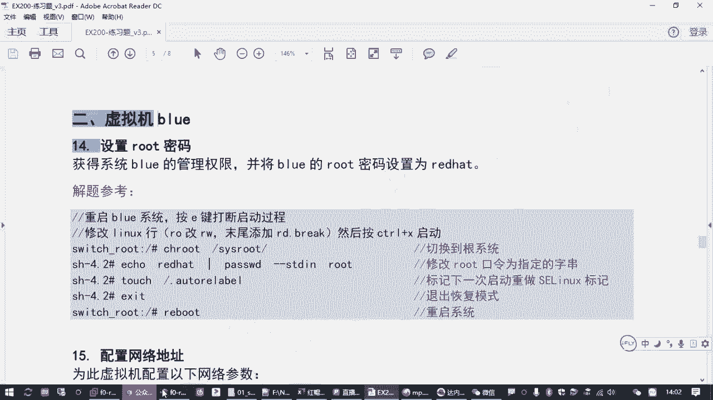

ra的那个机器嘛，对吧？就ra着那个红色那个机器。😊，呃，然后上午的考试呢，不是还有一台机器嘛？就这个blue啊，blue是第二台讯拟机啊，那第二台讯拟机呢呃基本上按红包这个考试的安排的话。

它相当于把一些难的题放在另外一台机器。这样的话呢，基本上哎怎么说呢？大家的通过率可能更有保障了吧。呃，难得起，你万一你做挂了是吧？呃，也就损坏的是不落这一台机器，你也不能全挂了吧，是吧？

所以他把它区分开了，多多少少还有点分。只要你补录里边对个几道题，其实你通过应该问题不大啊，当然最好是都对啊，最好是都对。风险会小一点。啊，那补录这个机器呢呃它首先会有一个题目。

就是要求我们去拿到这台虚拟机的管理员权限啊，拿到管理员权限。这个题有可能是在补录这台机器啊，也有可能是在readd这台机器。意思就是说不一定。那我们练习环节呢，我们是把它做在bl录这台机器上。

但是不管是哪台机器，你都得会方法是一样的。呃，怎么个情况呢？就是考试的时候，他会要求你把补录这台机器的密码设置成指定的一个值。啊，我们练习环境是要求射程端的hat。但是不录这台机器呢。

它原来的密码并不是read hat。跟考试的环境一样，你不知道他原来的密码是多少啊。😡，那这种情况下，我要拿到系统不录的管理管理员权限，并且把它改密码，你就得想办法。两个问题。第一个问题。

你要知道怎么样不需要密码能进到这个系统。你要拿到一个警号提示符的一个命令行界面是吧？相当于是绕过密码啊，进入到系统里面去。其次啊改密码的操作嘛，那中间改密码的操作相信大多数同学都会。

但是呢它中间有一个关于神linux的一个坑啊，这个大家知注注意把那个给填平了就好了。😊，所以破密码呢主要就是这两个题啊，这个题呢不是特别难。那大家在破密码的时候呢，其实我们在虚拟机环境里边啊。😊。

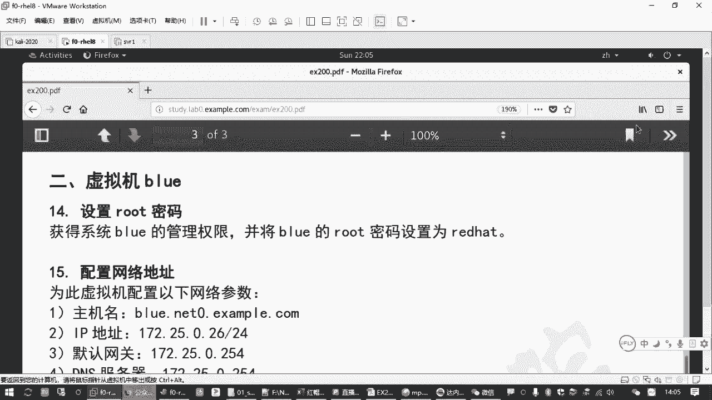

考试的时候啊，有同学还记得那个画面不来再翻来给大家看看。😊。

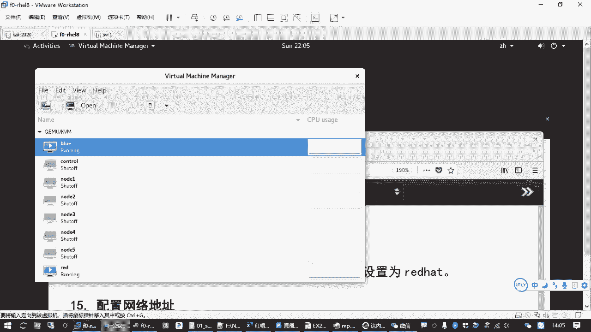

Yeah。

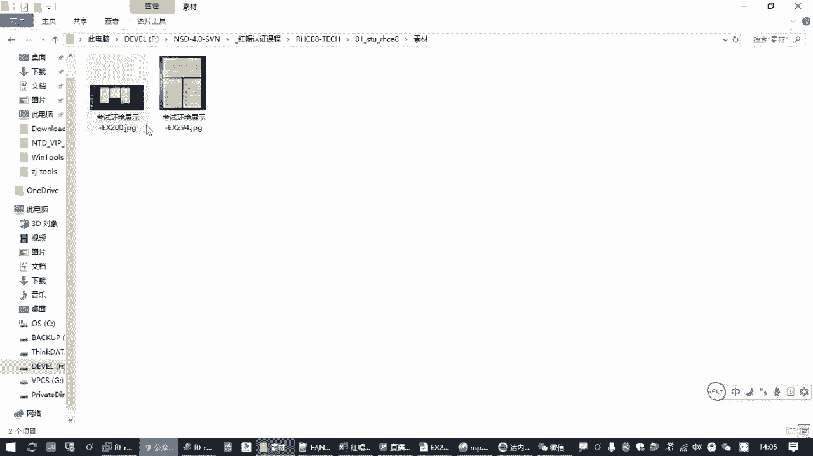

那在我们的考试环境呢，我们不说你可以打开红帽图标底下这个讯机控制器是吧？打开之后呢，有个read，有个blue，那你单击补录，打开是右边这个窗口啊，那个窗口呢它弹出的位置不一定是这个排的这么好看哈。

你打开之后呢，把这个blue这台机器开机，然后呢点开ccl blue去找到它的显示界面。😊，但你进到显示界面之后，让你不知道密码进不去是吧？所以你要在它的那个显示界面里边呢，要做一些操作。😡。

其实大体上我们要破解密码的话，有一个基本的前提，你要把这个讯机先关机，然后重新开机啊。所以如果你补录这台机器已经开过了，你需要把这个机器先强制关机啊，就抛ll off。power off啊。

先power off，然后马上start，再马上点cl。这个操作要快啊，手快有手慢无哈，你操作的太慢了呢，一会进去之后，他就会问你要密码。那手动作一定要快，快到什么程度呢？就是你p off先关机。

从哪个地方要快呢？点了这个start blue，开启这个虚拟机之后，迅速单击cl，打开一个对话窗口，然后把鼠标点进去。点进去在很快的速度要按两次字母键一。这是在干嘛哈？是在想办法绕过。😊。

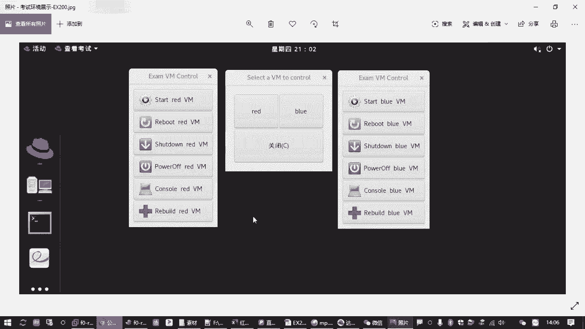

啊，想办法绕过管理员的密码，进到系统里面去。因为他不是要求我们做这个嘛，是吧？那其中呢它的核心点就在于你在开机的过程当中啊，红包发展系统，你在开机的过程当中呢，要去修改它的启动参数。你如果不改的话。

默认是正常进系统。😊，那多用户的系统嘛是吧？那正常是要输密码的。所以我们要改启动参数，那怎么改呢？😡，七的考试八的考试操作是一样的啊。那我们需要去按两次字母键一打断它的正常启动过程去修改。

里面有一个叫linux这一行啊。这样去修改。呃，有些同学可能之前用过5，用过6是吧？那这个呢是在开机的时候，你也是按那个上下箭头啊或者什么意见啊是吧？去编辑最后要改的是改了个con这一行啊。

说以有点小区别。啊，那在红包系统的8个系统里面啊，我们现在讲的是8是吧？按两次字母键一是啥意思呢？第一次字母键。😊，是把它写那个隐藏的菜单给显示出来。因为默认红帽它安装好之后，它有一个恢复模式。

或者叫救援模式。它那个启动菜单它是隐藏的，你是看不见的啊。所以按第一次意见啊，是为了把这个菜单给显示出来，就打断。打断正常启动过程。あ。那第一次按了一键呢，打断之后，第二次再按一键，啥意思啊？

是在它默认选择的正常启动的那一行那个启动项上按字母键一表示编辑啊。就要编辑，就我要去修改啊EDIT editit是吧？😊，那实际上呢其实不用按两次一键啊，是第一次第一次一键呢，你按个上下箭头也行的。

只不过为了方便大家好记，你因为操作又快嘛，是吧？第一次你按了那个一键之后呢，打断它一个启动过程，你马上要按第二次一键。😊，因为你让他那个菜单显示出来之后，倒计时好像只有一秒钟还是3秒钟。

对吧那个时间很短，你稍微一等啊，你过去了，又正常启动了，就相当于你虽然是打断的，但是你啥也没改，那不行啊，所以大家要注意按两次一键。😡，就刚才我们所说的啊，手快有手慢无是吧？嗯，那您正常打断之后呢。

去找到lininux这一行。改它的启动参数，关键点在哪里呢？那那一行配置里面那行那一行很长啊。😊，那一行很长的时候呢，我们要把它的。里边有一个。RO啊，你可以把它改成RW啊，如果用RO。

它是只读挂载你的磁盘里的根分区。就他刚开始引导系统的时候是只读挂载的。但是我现在我要去改的话啊，建议大家加一个把这个RO改成RW，就获得写入权限。另外一方面呢，那末尾要添加1个RDde break。

这个很关键啊，这个参数是告诉lininux内核，我这一次开机啊，因我这一次开机，你不要问我要密码。这叫插入一个中段啊。因为你加上这个之后表示不要密码，因为我要进去修复系统。

所以它可以进入到一个叫恢复模式，叫recovery mode啊。所要加个这个。那加完这个之后呢，你确认没有问题啊，按ctrl X开机，就进那个系统啊，引导那个内核，不是回车啊，回车不管用。

你说你编好之后呢，直接按ctrX。那正确的话就可以进入到系统。进入到系统之后呢。还不能直接改密码。😡，因为恢复模式，它默认把硬盘里的那个系统挂载到一个内存环境临时的一个目录。就是跟下的C路。

我们需要有一个操作。那就是你再从恢复模式啊，你要进入到这个目录啊，怎么进入呢？要加一个训记root啊。一个操作叫CHROOT。进入到这个目录，改变更环境。进入到这个目录之后，然后你再正常去改密码。

因为你有这个更环境之后，那你就可以用那个什么pass word那个命令嘛，是吧？就可以去修改路程密码了啊，改完路程密码之后，然后再退出就可以了。😊，当然，这是正常的情况。但是如果你这台机器啊。

你这台火帽8的系统。他如果启用了slinux安全机制。那你还要做一点小操作，否则的话你改完密码之后，你一退出一重启，系统就进不去啊，系统就进不去。那你还得重新来一遍。就万一你进不去没关系啊。

因为我们恢复模式是一个临时的。啊，是一个临时的，你万一进不去了，你把它熏机关机，重新再来啊，再按两次一键再进去改，直到你改对为止。那这个坑在哪里呢？就是红帽七或者8的系统。

如果它的slin系统啊slinlin是个机制，这叫安全保护机制吧。是上次我们讲过，如果它该机是启用的。只要不是disable的啊，它如果是permissive或者是那个什么inforive。

它都会导致针对你系统的安全做一个强制检查。那你现在在恢复模式，把人家密码都改了，省是会觉得你这个系统已经不安全了。那你还是别进了啊，他给你提的建议就是你别进系统了，这个系统已经不安全了，你放弃吧。

是不是这样的是吧？那你作为管理员，你如果改了密码，而且是在你s启用的情况下，你改了密码，你要跟他打个招呼，怎么打招呼呢？你需要在这个目录下边啊，就在这个临时的更环境，你要创建一个隐藏的文件。😡。

这个文件名称是固定的啊。一点开头的叫alto level啊AUTO啊，点开头的AUTORELABEL别拼错了，因为有些同学容易拼成BLE的。这个文件它就起到一个标记的作用，会告诉slinux。

你开机的时候看看有没有这个文件。如果有这个文件，你要让我们系统里所有的文件，所有的目录重新标记一下我们的安全保护策略。啊，术语叫安全上下文是吧？叫什么context。啊，要重新打一次标记。

因为你系统已经不已经不安全了，那我重新来全部重新标记一下。😡，相当于神是那个保卫科科长是吧？但咱们公司这些人已经不可靠了，我要把这些人全部重新审查一遍，或者我重新招人是吧？然后才能保护我们这个公司啊。

好，这是我们涉及到的一些基本的操作啊。那用到的时候呢，那我们给大家看一遍。Okay。呃，题目本身啊需求就那一行啊，需求你看就那一行，就把root系统的root密码给拿到。

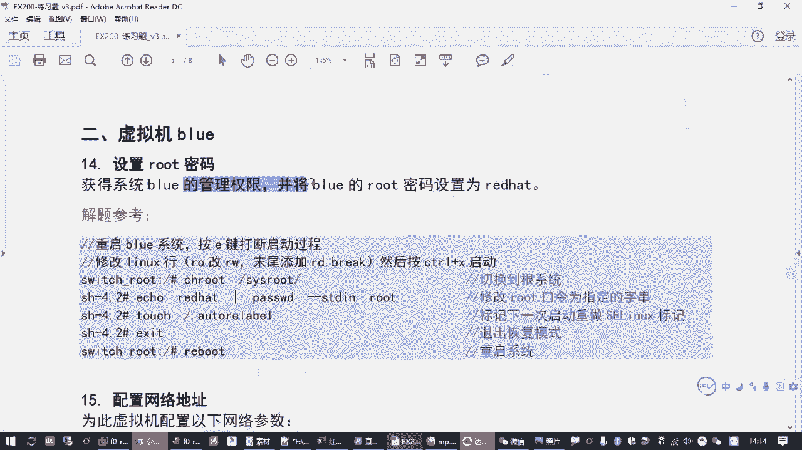

那咱们练习环境的时候呢，相当于你是拿到我们的blue这台机器。你这台机器呢，你现在已经开机了，如果你不知道它的密码，那你进不去嘛，是吧？啊，所以呢我们要把它关机。😊。

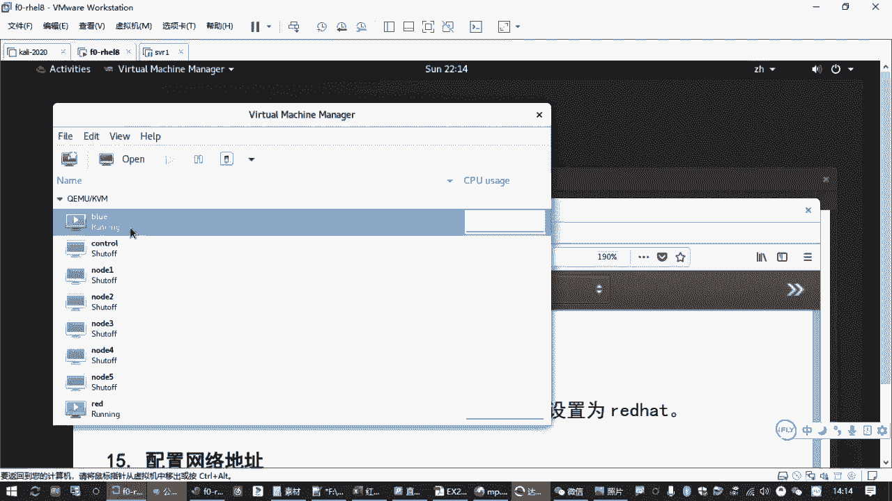

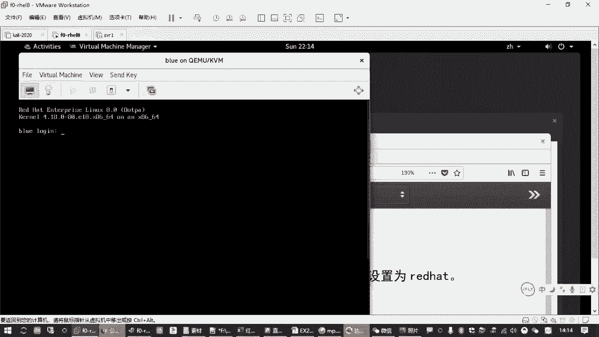

啊，有些同学可能你那个看不大清楚啊，我一边说一边演示啊。就通过这个界面呢要把它关机。或者你直接重启呗是吧？😡，确认，然后等它重启的时候呢，鼠标点进去，赶紧按两次一键就可以打断。打断之后呢。

用上下箭头往下走，这里有一行是linux开头的是吧？找到linux开头这一行呢，往右啊要往右用右键移动到里面有个RO，把那个O改成W。这是让它变成可写的啊，然后再往后移移动到最末尾。不要到下一行。

你在最末我们应该有个什么QUIET是吧？😊，快子啊，在后面加1个RD点BREAK。呃，如果你内容比较多的时候呢，它会自动换行啊，末尾会出来一个斜杠，那个不是一个有效的符号，是一个自动换行的一个标记啊。

你不用去管它，你就正常敲就行啊。敲好之后呢。书敲好之后，crX。如果你忘记了这个界面左下角有提示，plus control X to start是吧？所以按肯就X。那按ctrl X呢。

如果你刚刚写的没问题，它可以正常进入到我们这个系统环境啊，正常进到我们系统环境啊，这个过程应该很快啊，进来之后呢，你看到一个提示符就有一个井号，是吧？😊，那一个叫switch下划线root冒号斜杠顶号。

那在这个提示符后边。我们要做一个什么操作，做1个CAHROOT叫清级root改编到我们的根下的ss rootot SYSROOT。叫根目录。因为这个目录才是你真正的那个磁盘里的那个系统啊。

我们通过恢复模式进去，这是一个临时的环境啊，所以你要改变一下，进入到这个真正的磁盘里的一个系统的一个环境。进来之后呢，改密码，改密码不就pasword吗，是吧？😡。

password root这最基本的操作吧，是吧？😡，然后根据提示输入两次密码。啊，写一个red hat。回车再敲一次red hat回车。改密码方法无所谓啊，正常你就用password。

或者你A可以跟密码，通过管道交给他都行啊。😡，改完密码之后，我刚才我们讲过还要一个什么。😡，打一个slinux的一个标记文件是吧？啊，用一个touch命令。找根下的点。起个名字啊。

跟下点开头AUTORELABEL啊。AUTO就自动锐置重新嘛，LABEL就打标签啊。创建一个这样的一个文件。就做完了，然后呢a个z退出reboot重启。你跳两次一个Z的也行啊，然后重启之后呢。

然后你再等它启动完成之后，再用你改过的密码进入到这个b录系统啊。

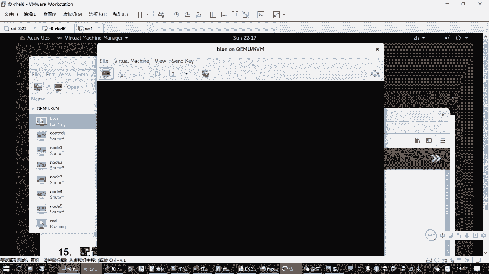

ok了。😊，那这是我们破密码这道题。大家也把这个先练习一下，好吧，因为这个相当于是你拿到另外一台虚拟机去答题的一个门槛啊。你如果你密码设置密码，你都搞不定，那你没法答题啊。

你相当于你另外一台虚拟机的题目你全都放弃了。那那不行是吧，这是个门槛。你拿到密码就获得了这个你就把那个门给打开了啊，才能够进去去答题。Okay。考试的时候是直接通过那个刚才给大家看的那个图片了嘛，是吧。

是通过这个界面。

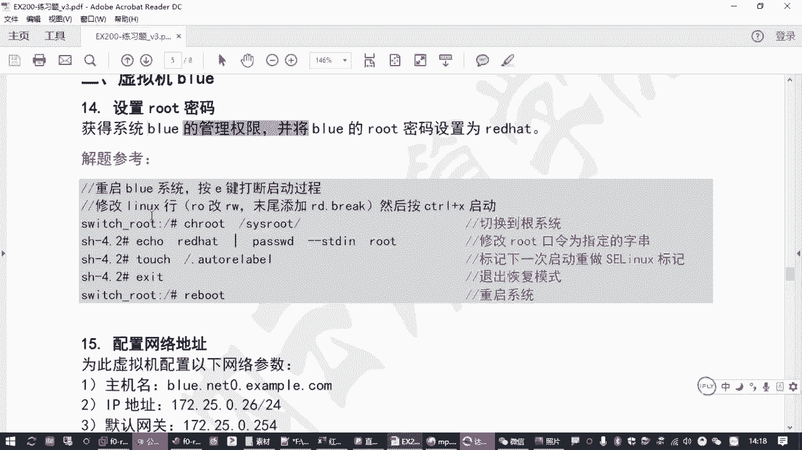

去关机开机拿到控制台是吧，再点进去。嗯，其实过程是一样的啊，就是操作入口这个按钮不一样而已。

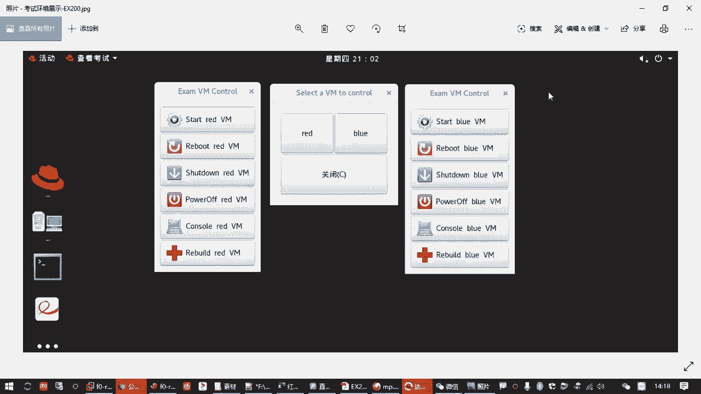

ち。大家破解完密码之后啊，你进入到bl录这台讯拟机，可以顺便把我们的那个网络地址啊。呃，亚母原啊也配好。这个在我们考试的时候，这两个可能也是要你做的哈，这个不一定啊。😊，考试的时候。

有可能你不录那个训机那个IP地址是配好的，主机名是配好的啊，也有可能是没配。那咱们练习的时候呢，你需要去配置一下啊，你反正不管怎么样，你就配置一下呗。用我们上次讲过的那个什么NMTUI呀啊，做一遍嘛。

对吧？😊，呃，然后样么园肯定是要配的啊。😊，有两个数音机都要配圆。

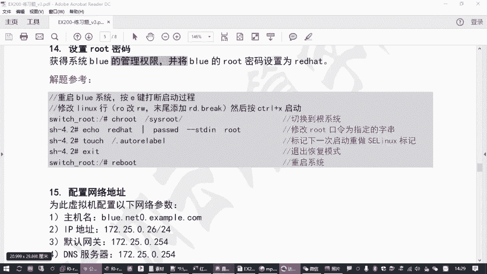

来，我这里过一遍哈。😊，呃，补录这台机器，然后呢用我们的用户root和我们新设置好的密码去登录。呃，登录进来之后呢，然后是用NMTUH设置IP地址是吧？

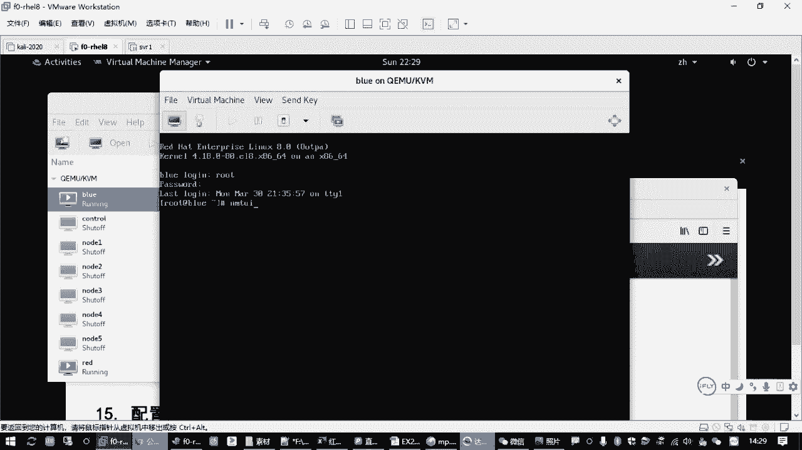

包括设主机名啊。把主机名呢改成题目要求的完整的主机名啊。不录点netote0点example点com。O。啊，再然后呢是。编辑连接。打开之后呢，往上找到IPV4confiration。

把automatic改成manual是吧，就是手动显示。找到AS添加。172。25。0。26，斜杠24。网关添加1个172。25。0。254DNS也添加1个172。25点。0。254。

是吧然后再往下找到我们的require啊，要求IPV4地址选择选中空格啊，按空格选中，再往下呢自动连接一个automaticconect。也空格选中。在table键到我们的ok。

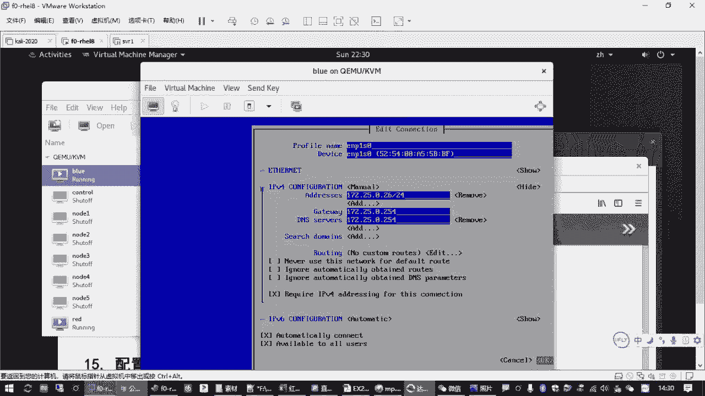

然后再table到后面那个有个返回是吧，返回。然后在DI上activate connection的激活连接啊。到先禁用再激活。再返回再退出，对吧？这不就做完了吗？

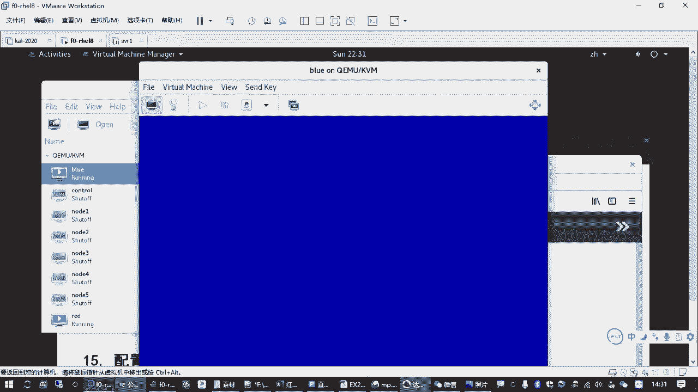

啊，做完之后呢。我们这个就可以关了啊。

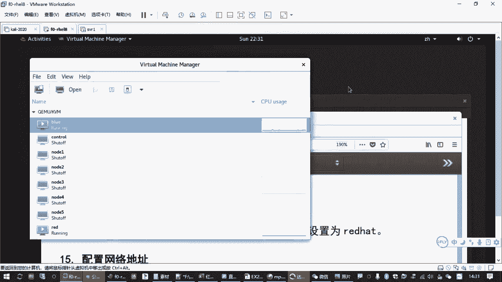

然后我们就可以从从这个命令行啊，从正机的命令行呢就可以远程到你的那个。不录了是吧？我们可以SSH到bl录好，等考试的时候记得加root啊。嗯，因为你考试的时候，你真机是普通用户。

你不加root的话呢啊默认是你普通用户连的啊。然后你可以连过去考试的时候，你连接的时候需要输密码的啊，这个大家注意啊，咱们练习环境呢做了免密啊，做了免密码登录。

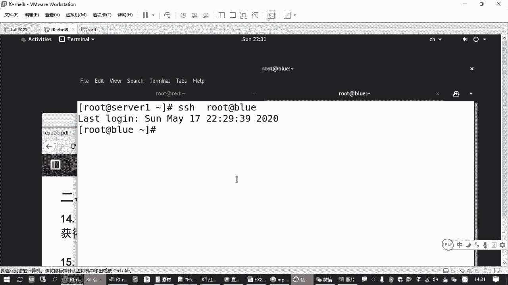

好，那这是刚才我们讲的一个重新设密码这道题目啊嗯那后面的操作呢。来，我们另外开一个。我们接下来讲的题目啊，主要针对的是我们。另外一台讯印机啊，blue。那在这个环境。刚才我们给大家讲到的。

配置网络地址已经做完了，然后还是一个什么亚美源。那bl录这个机器呢也一样啊，也需要做一次配一下亚母。呃，其实呢大家在考试的时候啊，当你把这个网络地址你做好之后，你再配鸭M的时候，你可以不用那个VI了。

是吧？这个大家应该。如果你之前用过这种拷贝文件的话，其实有一个方法。如果你b录呃，你如果你那个root这台机器已经配过了，我是不是可以直接用SCP啊。

你可以直接用SCP把你已经配好的这台虚拟机它的亚母源的一个配置文件，拷贝给。你的补录这台机器。🎼放到它的EDC下的ym点rebers点D这个目录下。你就不用VI再写一遍啊。😡，前提条件你不录这台机器呢。

IP已经配好了，你能远程连过去啊，密码你要拿到嘛，是吧？这样可以拷拷贝过去啊啊，如果提示你要输密码要同意接受密钥呢，你就同意就行了呗。😊，然后输入正确的密码。考不过来了吧。啊，百分百啊，拷贝完成之后呢。

你在这边的blue这个终端确认一下啊ym rap list。Yeah。完成了吧，考试的时候要么配置这是最省事的啊，你已经配过一次了，都验证过的是吧？直接把配置文件拷过来就好了啊。😊，好，那同样的啊。

如果你想用起来更方便一点呢，也建议大家。用y mini令把缺少的那些包啊一起给装上。比方说我们那个嗯伴喜comp是吧？推不见补齐的那个啊，还有那个什么VIM编辑器。VM enhanced。啊。

还有那个网络配置工具，net tos。是不是这些是吧？还有那个做DNS测试，如果你用用的话，你不用就不用装啊。用的话呢一般是建议大家装一个叫BIND杠U条是吧？你看能装上，哎，也说明这个原也是好用的嘛。

好，那网络配置和原的哎和样本源设置啊。Yeah。就这么多是吧，没做是吧，这第二个机器啊，刚才用了一下这个操作。😊，这在热的机器上啊，直接把你配好的文件传给我们的bl录这台机器啊，大家可以参考一下。

这个考试的时候，你就不用再重新写一遍了啊。

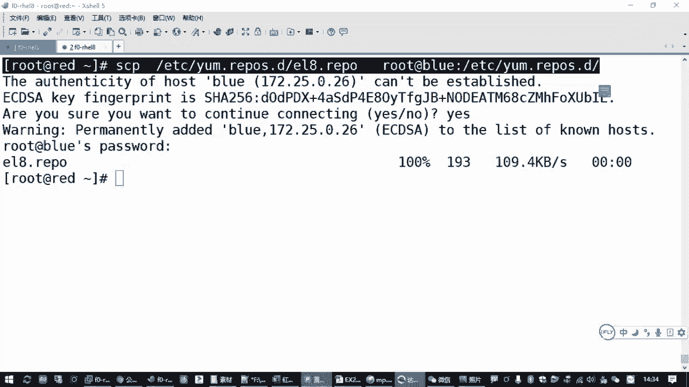