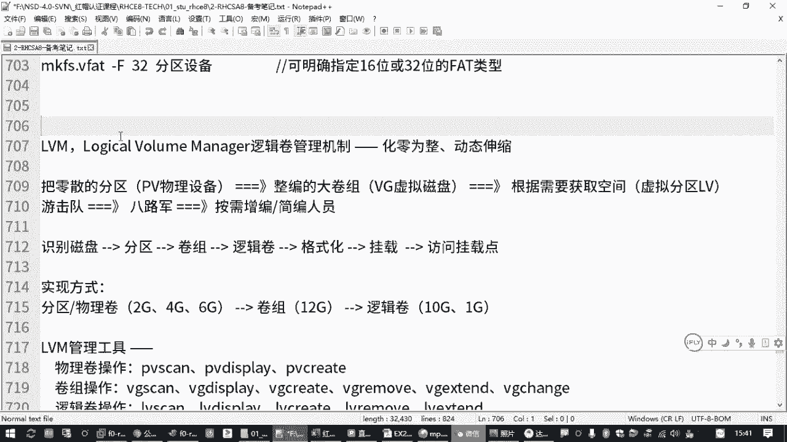
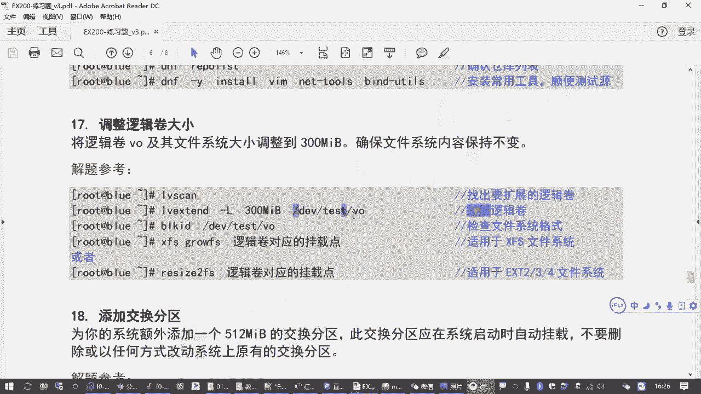
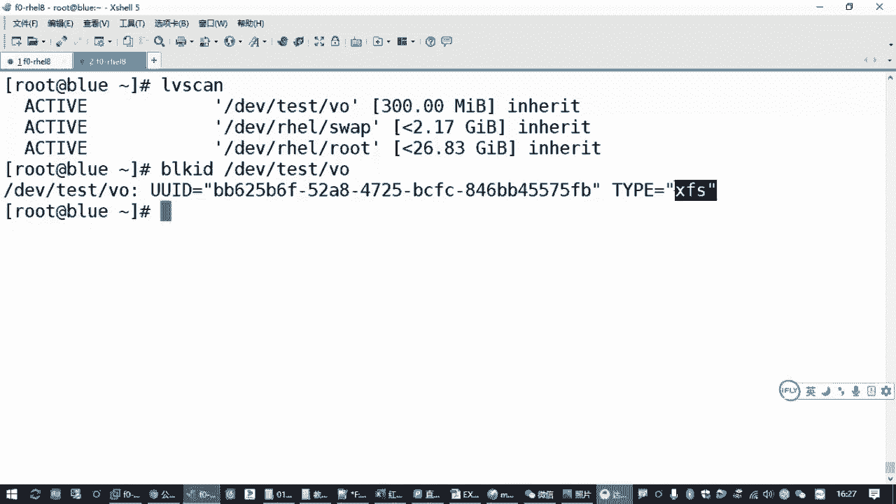
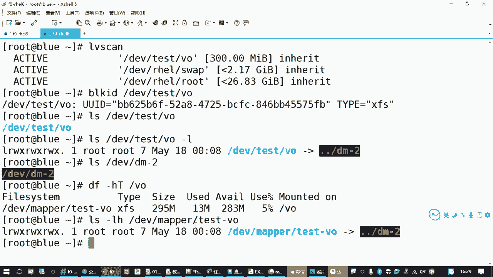
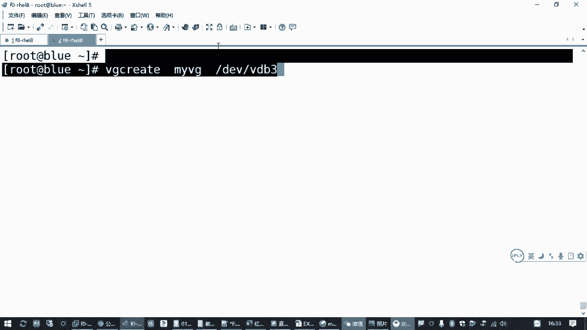
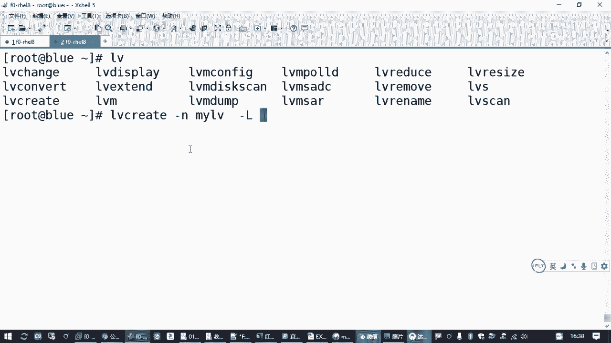
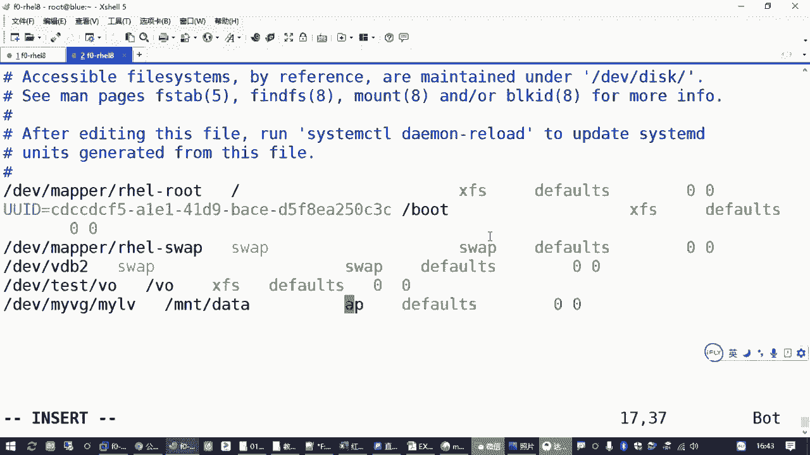
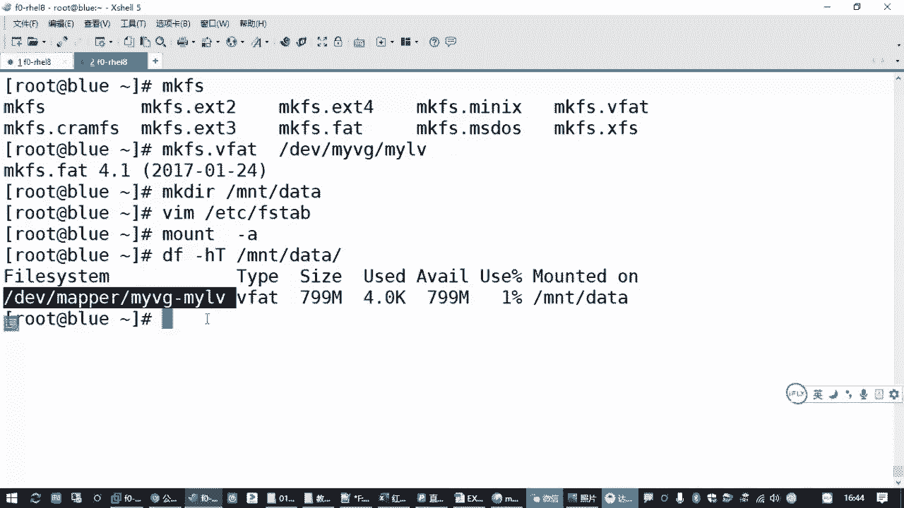

# 备考红帽认证必修课_RHCE／RHCSA／Linux云计算架构师 - P21：3.07-LVM逻辑卷管理 - 达内-达达小助手 - BV1KS4y1N7RQ

好，那咱们再接着往下看啊。😊，啊，交换分区这道题目搞定。然后还有两道题呢是啊关于逻辑卷子啊，关于逻辑卷子。

那逻辑卷这两道题目的话呢。呃，那大家要了解一下，我们有一个机制啊，有一个。

存储机制叫做。LVM。

呃，LVM它的一个含业呢啊代表的是什么呢？叫做。逻辑军啊叫lic。vololume是吧。Mana长。叫逻辑券管理机制。那这个机制呢，它比我们普通的使用磁盘的方式。

会有一些好处。我们通常使用一个磁盘的时候呢，就是我们刚刚前面讲过的是针对磁盘做分区，分老区，然后再格式化，然后再挂载，然后再去访问吧，是吧？

你像我们跟文区也是一样的呀。啊，但是这种方式呢它有不好的地方。比方说你准备一个分区，这个分区可能就是。

就比如说刚才我们这个交换门区。I block。假设我们准备的这个交换分区VDB啊，刚刚我们分的大小是不是512兆呀？那这5122兆，你用了一段时间之后，你觉得这个交换分区空间不够了。😡。

你是不是得加新的分区啊？😡，那如果你想把这个交换面去VDBR这一个存储设备想给它扩大。你是不是扩大不了了，空间不够，我想增大怎么办？加不了了，我在加不了。😡，因为在VDBR512兆之后。

第三个分区已经给你占满了。你不能在第五个分区那个位置再加一段空间变成你VDB啊是吧？你要变可以，那你只能把VDB删了。另外把VDB5再格式化成交换分区，然后再去改了个配置文件。😡。

把那个VDB2改成VDB5麻烦吧。所以我们传统的使用分区的方式，这个分区的大小是固定的。

你分的这个分区是多大，那么就是多大。那这种情况下呢，你把它格式化格式化再用。😡，用起来是不方便的啊。大小调整不方便。对吧这是一个方面啊，这传统的我们在格式化的时候，格式化的对象直接就是分区。啊。

格式化的对象直接就是分区。所以他用起来不方便。另外还有一些不方便的地方，假设我有4块磁盘，每个每一块磁盘呢。都是500G的。啊，500G乘以4是吧，我有4块磁房。😊。

但是我现在想获得一个两个T的那个存储设备。不行吧，你如果你往FB的去分区，那每一块磁盘最大就是500G。那你只能把这4个磁盘呢。😡，变成四个分区。对吧你顶多分成四个分区，要么你做磁盘阵列。

如果你不做磁盘的阵列的话。那你就没办法，这个分区的上限就是你磁盘的大小。最多是500G。

所以针对这些不足的地方啊。😡。

我们就出了1个LVM。这叫逻辑卷的管理机制。那这个逻辑的意思呢，其实相对于我们普通的物理磁法来说的。物理磁法你可以把它当成真实磁法嘛，是吧？那逻辑磁法其实就是虚拟的磁法啊。所以虚拟的磁肪，虚拟的存储。

这个一般就不叫虚拟存储，叫虚拟券啊，叫逻辑券是吧？有一个这样的一个术语啊，叫逻辑券。那它给我们带来的一个好处就是。可以化零为整，还有一个叫动态伸缩，这是它两个最大的一个优势啊两个最大的一个优势。

其中呢化零为整呢，刚才我们讲了一个4块磁盘，每一个磁盘，500G是吧？那它可以把这4块物理磁盘变成一个更大的两个T的虚拟的磁盘。或者你把它叫做逻辑思法啊，这就是LVM第一个特点叫化零为整。4。

500G的合成1个2个T，而且大小不一定要相等啊，我可以1个500T的，1个两1个500G的，1个200G的，我加在一起也是可以的。😊，啊，这是逻辑卷第一个优势。那第二个优势的话呢。

它还可以实现叫动态伸缩啊，啥意思啊？我把了4。500G的磁盘，刚才不举了一个例子吗？😡，来放放到这下面啊，对应一下。😊，我们500G有4块是吧，乘以。4。

假设我们有4块这样一个磁盘啊，它变成一个逻辑的磁盘之后，这有个概念叫卷轴，这就是这个逻辑磁盘，是不是变成了一个2个TB的？

转2TB。那500GB呢这是4块的物理磁盘啊，变成一个逻辑磁盘，2TB。的逻辑磁法。前面呢这是乘以4块物理磁盘真实磁盘吗？这样变，首先化零为整。其次，那你变成这个虚拟磁盘之后，是不是也要分区啊，对吧？

现在这个时候你分区的方式。对吧你再去用这个划分存储空间的方式，就不是直接去找我们那个磁盘了。不是针对我们这个5个G的那个磁盘再去分了啊，我需要往里存数据的时候，我们针对这个逻辑磁盘去划分空间。😡。

划分出来之后的空间啊，我再去做格式化。那正因为如此，所以我们面对的是1个2TB的逻辑磁盘。在这个空间里面，我想用多少给多少。那500G乘以4变成2个T。我假设我从这个2个TB里面呢。

我不想用1个500G是吧？我就想用1个200GB的。😊，分区可不可以？好吧，可以啊。😊，那如果我想用1个超过500G的，我用1个800GB的可不可以？😡，也可以。所以这个很灵活啊，你可以从量TB啊。

从这个2TB把它当成一个整体，从里边你要多少给多少。要200G就200G，1800G就800G，只要不超过2G就可以。😡，那另外刚才我们讲过动态伸缩啥意思呢？😡。

就说如果我们原来分的这个存储空间是200GB，我用了一段时间之后，发现200GB不够用了。我想增加空间啊，我想把它加100G变成300GB怎么办呢？你直接给它加到1300G就可以啊。

直接给它加到300G就可以。那你原来在使用的这个逻辑下呢都不用管啊，都不用管。😡，你该怎么用怎么用，我就悄悄的就给你把这个存储空间了就变成300G了。😡，啊，打个比方，带理你们用的手机号。😡。

那中国移动也好，中国电信也好是吧？啊，联通也好。😊，那中国移动说这个月给你送10个G的流量，它需要你换号码吗？不需要需要你先停机吗？也不需要，需要你拿着你的手机卡去银行卡，去那个营业厅重新换个号码吗？

去重新换个卡片吗？也不需要吧，他直接给你把那个流量给你送送过来增加就好了啊。😡，那这就是我们这个叫逻辑券管理这种机制的一个好处。但是我们之前的那种方式呢，你是针对物理磁盘直接分区。你分区空间不够。

你再增加就不方便。😡，那为啥现在方便啊？因为它的磁盘是虚拟的，是用软件给你管理的那就很灵活。但不受你那个硬盘的实际的位置不会受太大的影响。那依赖于什么？就依赖于LVM啊。

中间有这样一个磁盘管理机制在这里。这是它的好处。也正因为如此，相当于什么？你看我们下面这一条，你把中间这个LVM管理机制把它去掉。就是我们刚刚前面讲到的那一套嘛，是吧？LVM逻辑卷。逻辑卷，哇塞。

相当于是这个啊。这个机制你在没有的情况下，你把它去掉。卷轴。这里。这一块没有，是不是就是我们通常用磁盘的一种方式啊？你windows里边你用那个移动硬盘不都这样的吗？然后硬盘分区格式化。

然后挂载仿复挂在里。但是一旦你有了这个逻辑券管理机制之后啊。就相当于把我们一堆的磁盘设备或者分区交给了LVM，由他来统一分配。他把你一堆零散的设备组装到一起。然后变成一个整体。

从这个整体里边再来分空间给不同的用户是吧？不同的呃应用，你想要一个多大分区，我给你分呗，是吧？不够了，我给你加呗，是吧？这就是化零为准嘛。😡，不是。咱们在上面打了个比方是吧。

就好像咱们以前抗日战争时间时时期的时候。😊，那个游击队变八路军一样的那游击队呢，那你一个一个小队可能就几个人，你打仗是不不方便啊，那你可能这一个村的一个游击队可能是20个人，你要去把八路把那个。😡。

把那个日本鬼子的一个碉堡给搞了，你这不搞不定啊，对吧？啊，但是呢这附近好几个村的游击队可以组合到一起呀，那变成一个八路军的一个连队，是不是啊或者一个大队？😊，啊，东北抗日联军嘛是吧啊。

有时候再冷就由小变大。那当你有一个大队伍的时候，咱们在游击队组合到一起，是不是就可以灵活分配任务了？😊，你打一个碉堡，你20个人不够，我给你派200人够不够，对不对？那今天这个碉堡没多少人。

200人有点多，我给你少一点，撤过100个人回来100个人过去够了。另外100个人呢再去打别的碉堡去，是不是真的？所以这个功功能呢叫做动态伸缩啊。😡，这个你分配出去的存储空间，你300GB。

你觉得分多了，你以后还可以减少啊。只要你没用完，你可以把空间再减掉，可以随着需要啊，你可以增加，可以减少。😡，我们现在用那个移动的手机套餐，你比如方你包月，你买了个有50G流量的，结果你用了半年之后。

你发现这每个每个月我就用了10个G是不是多了？那你在下个月呢，你再把那个套餐换回来，我就换这个20个GB的，是不是是不是就够了，对吧？这叫动态伸缩啊？😊，它的核心机制就是在我们的分区。

磁盘的正常的分区或者直接是磁盘设备都行啊。在这个物理设备和我们格式化创建文件系统的时候，中间加了一个层次。这叫逻辑券管理啊这样一个层次。那这个层次。落实到我们的操作系统里面，具体怎么实现啊？

其实就是把我们的物理设备。变成逻辑设备啊，就物理磁盘或者分区变成我们的逻辑设备。它有个术语的啊有个术语的这个术语叫物理卷。啊，叫物理去啊。然后把它变成我们的逻辑词盘之后呢，叫卷组。

就一组卷组成那么一个整体嘛，叫卷轴。呃，然后我们最常最终用来格式化的那个对象叫逻辑卷啊，叫逻辑卷。它英文名字啊L物理卷啊，物理卷来自于叫什么叫PV。physical volume是吧？😡。

那所以是物理卷，然后变成我们的卷组叫微G。最后呢从这个VG里边呢再来划分空间叫LV。对吧不是咱们那个路易威登叫逻辑卷啊，a logic volume啊。然后针对逻辑卷LV我们再去格式化。好，是这样啊。

这格式化的对象变了。😊，我们传统的方式是直接格式化这个物理卷。现在呢你要中间加两个层次了，是吧？先要组成逻辑磁盘，然后再画空间啊，再来格式化。这是基本的理论。那用到的时候呢，来了解一下它基本的一些。

工具。管理物理卷。

对应的工具呢叫PV开头的啊，如果记不住呢。PV table。有几个单词大家熟悉一下。啊，PVs啊就记几个好记的啊，这扫描嘛？所以PVsky，你看一下有哪些物理券。😊。

对吧你趁看这里我们看到有VDBVDBR是吧？看到有两个，那其他的有些你没分好的就不算啊，你没有用来做逻辑券管理的不算。😊，那再一个。这是扫描啊，如果你要看物理这详细信息呢。

有一个display评Vdisplay。如果你要创建新的那个物理卷，create删除删除一般不管用啊。PV轮木一般管用。因为你物理设备，你用这个min令，你删不掉它，只能取消设置啊，所以很少用。

那如果想看一个物理卷呢叫PV displayplay啊，比方说我们看一下DEV下载VDBE。是吧他会告诉你这个PV设备在哪里，它在哪一个卷组里边是吧，是不是这样的？

这就是那个逻辑磁盘的名字啊逻辑磁盘的名字啊，然后呢它的大小不到2个GB嘛，是吧？😊，然后下面有个概念叫PEsize啊，什么意思啊？就说你在用这个。用这个空间的时候，最少它的一个分配的一个单位。

这叫PE叫物理单元啊。

你至少得用这这么一大小啊。😡，你如果你说我要用用6兆，那怎么办？那我也给你2块，就最小切块切的大小啊。如果你说你要用8兆，我给你2块，你用6兆，我也给你2块，用7兆还是给你2块。你说你要用9兆。

那我按这种这种倍数呢，我再给你3块，就是给你十212兆是吧？这这叫最小的分配单位。😡。

啊，这是关于这个物理卷的管理啊。那另外呢如果我们要管理逻辑磁盘，有VG开头的管理逻辑卷是LV开头的啊。这些指令都差不多，然后位计呢sky也是扫描diabplay呢查看信息。

创建卷轴create删除remove。扩展空间extend啊，更改呢wa to change这有些不常用啊，有些不常用。这个一般。很少用啊，不跟你去的啊。那逻辑线操作的话也是扫描显示创建删除扩展。

对吧这些命令大家用到的时候呢，记不住的话呢，你只需要记住PV，还有VG，还有LV是吧？然后推不见。🎼比方说我要创建一个卷轴，你就打个微G，table一下创建用哪个create。😡。

是吧。啊，那VGcate我怎么去创建呢？记不住打1个MIN看它的用法。

或者我们能不能直接挑一个命令？啊，直接敲命令，它只一个提示，没有显示用法，只是告诉你要刚刚ha是吧？那我们敲manVGcreate。

那你看他的用法。其实刚刚那个也有提示的是吧？

危机cur，然后。危机6啊，这个其实指的是卷轴的名字。然后后面呢是那个物理卷，就是那个物理设备啊，你要用哪一个物理设备来组成这个逻辑磁盘，这就是它基本的用法。

后面这些选项呢那太多了，咱们基本上用不到啊，因为我们只需要用一个啊只需要用一个。这是创建卷组。呃，然后咱们考试的时候，你可以不用按照。套路来哈，不用按套路来啊，啥意思呢？😊，物理卷你可以不用管。

你可以忽略，我们直接创建卷组就行啊。最后我们在分配空间的时候，逻辑卷的管理工具它会自动去帮我们整理物理卷。前提条件，你得有空闲的这些物理分区或者磁盘，明对吧？那你创建卷组的时候呢，用VGc。

你有了卷组之后，再用LV collect去创建逻辑卷。所以刚刚这些操作啊。😡，你先把理论搞清楚。

那然后呢，我们实现的时候就是命令的细节啊。

来看题目。

Yeah。来先看。

先看调整逻辑卷大小。那这个考试的时候呢，有一个现成的逻辑线叫VO。他要求我们把这个VO的逻距线呢把它大小调整到300兆。对吧那基本的操作就是你先要你先要找到VO这个逻辑线，你看一下它原来多大是吧？😡。

然后你直接去给它扩展大小，看能不能行。😡，对吧你扩展完成之后呢，再告诉lininux系统内核说哎这个大小变了就好了。

那怎么办呢？🎼他告诉你有一个逻辑线叫VO，我们直接执行LVtable一下。有个LV干是吧？😊，好像LVS也行啊。😊，显示的格式不一样。但是呢LV干就是更简洁更准确一点啊，你可以直接知道这个设备在哪里。

对吧那比方说刚才我们讲到的LV干，你扫描之后看到VO在哪里啊，就不找到这个VO吗？😊，这个结果里边我们显示的结果啊，VO就是卷组的呃，就那个逻辑卷的名字，test是那个逻辑磁盘的名字。

就是我们刚才讲到的这个卷轴啊，这个概念啊，大家如果你原来没接触过，你可能要琢磨一下，熟悉一下呃，物理卷子的就是物理的设备分区或磁盘。卷轴呢是逻辑的磁盘，就一堆磁盘组合起来的啊，那个虚拟的磁盘是吧？

这叫卷轴，逻辑卷呢是从虚拟磁盘里面分出来的，虚拟的分区啊。

或者叫逻辑分区是吧，或者叫虚拟分区都行啊。逻辑分区更准确一点是吧？

它也能格式化，也能用。所以我们找到这里，它的分区的命名的格式啊，第一位下边有个卷组的名字，然后有那个逻辑卷的名字，你看200兆。那如果要把这个200字扩大怎么办呢？😡，啊。

这个逻辑卷呢可能它已经挂载了的啊，已经挂载了的，好像默认在咱们练习环境应该是挂在这。😊，怎么看它有没有挂载啊？😡，大家有没有用过这个命令？有个DAF是吧，你看一个目录，它对应的是哪一个系统？啊。

对应的是哪一个设备？我们可以看VO这是挂在点。它对应的那个文件系索类型呢是叉FS，它现在挂在点是在这是吧？呃，那个那个设备是这个。啊，第一位下边是有个映射的一个目录。这个就是针对我们的。

就是针对我们这种虚拟的磁盘，这种这种啊，或者那个什么磁盘之类啊，这种的不是物理的设备，它一般有一个mle的目录，下面有个映射。我们可以去找到是吧，那这里tt逻辑磁盘底下有一个逻辑卷叫VO。能看到吧是吧？

啊，那现在如果我们想把它扩展容量啊，怎么办呢？我们要用。LV再继续推波呗。扩展容量有一个工具叫做LVex啊。增强扩展。如果你要减少容量，有个叫reduce。一般不建议大家减少啊，一般只建议增加啊。

因为你减少的话呢，有风险。啊，比方说你这个月你手机套餐，你以为自己是20G流量的，你关机关机用了18个G流量了。然后中国移动给你打个电话说，不好意思，哥们，你那个流量是10个G的，你超出了这8个G的。

我要按0。91兆给你算钱是吧？这这大家都崩溃了，是吧？😊，所以一般情况下呢就是按照你的需要空间慢慢的增加啊，这是一个比较好的一个做法。啊，那现在我们要把200兆扩展到。

原来是200兆吗？题目要求我们扩展到300兆吧是吧？那只需要呢LV extend。

然后扩展大小的时候有个杠大L指定新的大小300兆。然后后边跟上你要扩展的这个逻辑设备的。路径。就可以了，对吧？那注意观察啊，观察它下边的有有一个提示，告诉你。

告诉你是successfullyres的是吧？成功调整大小。调整完成之后。那进入这个命令格式啊，LV extend杠大L指定新的大小啊，不是增加多少啊。如果你要写增加多少呢，应该写个加100兆啊。

直接指定新的大小，你懒得算了是吧？要么你300减200呢算的麻烦死了。啊，这是扩展大小。啊，扩展完成之后呢，我们再次执行LVky。😊，去看是不是变成300兆了。对吧就变成300兆了啊，当然。😊。

linux不知道啊，lininux内核不知道，你现在用的是LVM的管理工具，他知道。😡，那linux是系统，他咋知道呢？linux系统在用你这个分区的时候，刚才我们讲过1个DF命令是吧？😊，可以去查看。

啊，你可以看一下你这个VO，如果你挂着的话，没有挂着，你手动挂载一下也行啊。你发现呢它的大小多大，是不是还是只有200兆啊，约等于200兆嘛？😡，这个相当于什么呢？

相当相当于中国移动给你送了10个G流量，他没告诉你。😡，那你到月底的时候，你都不知道，还，还有10个G流呢，可以随便用啊。😡，你不知道也不敢用吧，所以就会出现这种情况。😡，那。

所以中国移动他会发个短信给你吧，告诉你呃，你是什么什么友好用户啊，或者什么做什么活动嘛，是吧？他要通知你一下。😡，嗯，那咱们linux系统里面呢，如果你把这个逻辑卷大小给改了。

你也要通知lininux操作系统。啊，当然这个主要是在你这个原来的这个逻辑卷呢已经格式化过。在格式化的时候，lininux内核它就会标记哎，这个系统是多大的？就好像在办办那个套餐的时候。啊。

办手机套餐的时候，第一次办不是有一个。说多少钱一个月那个套餐嘛，是吧？在那个时候确定的那那个是系统这也是啊。😡，除非你重新格视化，否则的话lininux系统它只能知道你原来的大小。

哪怕你重启主机都不管用啊，所以你要主动去告诉你这个linux内核怎么主动告诉呢？你要看它的类型啊。说明要block IDD去检查你的。呃，D一V下面的t下面的这个VO。你看他是什么类型的，因为。

文件系统类型不一样，通知的方式不一样。对吧通作的方式不一样。那如果是叉FS格式，我们要用一个叉FS下划线glow FS。这是叉FS文件系统的一个增长啊，用这种方式增长之后呢。要跟什么？要跟你的挂着点。

😡，啊，要给你的挂在嘴。赞。这就相当于高速lininux系统内核。你在VO这个目录下面挂载的文件系统，现在我多送了100兆的空间给你是吧？你记住一下是吧？啊，祝你享用流愉快是吧，就这个意思。😊，啊。

你要用个叉FSgFS啊。你没有做这一步，linux是不知道啊嗯，叉FS这个工作呢，这个这个命令呢，它后边跟着是VO挂的点。啊，当然考试的时候有有可能这个没有挂载啊，这个大家记住。考试的时候。

如果你这个VO没有挂载也没关系，你随便创建一个目录ABCD呀都行。然后你用mount mini把你的DEV下的，就刚刚你扩容的那个设备挂载到ABC。然后再用叉FSgFS跟上这个关键点。对吧一样啊一样。

所以考试的时候，这个瓜载点它有没有给你挂载无所谓啊无所谓。😡，为什么要这么干呢？因为叉FS这个工具。他操作的对象就要求是挂在点啊。如果你直接这么去操作这个逻辑卷呢，它不行啊，它会报错。

那大姐你考试的时候，如果你看到这样一个提示，你就要知道哦，原来你操作的方法不对啊，他告诉你这个设备呢没有挂载啊，没有挂载是吧？那你需要先挂载，然后呢针对这个挂载点，就你得把这个设备呢装到一个目。

再针对这个目录去扩展容量，是吧？😊，啊，你用的这个中国移动那个手机号，你是不是得装到你手机里边，你才知道呀，是吧？得得绑到一个用户嘛，要不然他哪知道给你送流量，发个发个消息，你手机卡没装。

是不是也收不到啊？😡，O了。啊，当然还有一种情况。大家在检查这个文件系统类型的时候，有可能它后边不是叉FS。啊，有可能是EXT3或者4。🎼如果是这种方式呢，大家要换一个工具啊。

叫ress E to FS。啊，用这个命令。这叫重新调整大小，针对ERFS这种文件系统。这是老工具啊，这老工具呢适用于EXT2EXT3EXT4都行啊，都行。后面跟上你的设备。

这个是直接跟你的这个逻辑卷设备啊。啊当然我们这里用不行啊，因为我是叉FS的，你非得用1个EXTEXT的文件系统的工具。他就会报错啊，对吧？他找不到你那种文件系动类型啊。那如果你是EXT格式的。

你用这个工具就好了啊。对吧这是。

刚才我们讲过的逻辑卷扩容这道题目。啊，一般。

Yes。我们做的时候。怎么办？其实就是很简单啊。

你LV干先找到那个逻辑键，然后再用LVex扩展，指定它新的大小。最后再用block IDD检查它的文件系统格式对吧？检查文件系统格式，然后检查完了之后呢，再给它指定叉FS给落FS是吧？

或者res e toFS根据你对应的这个文件系统类型不一样啊，你选择不同的工具。OK吧。😊，来大家可以把这个做一下，好吧。

Okay。好，那刚才我们讲的是调整逻辑卷大小啊呃调整逻辑间大小这道题目的话呢操作的时候。

考试的时候就几就几条命令是吧？真的就几条命令。

呃，正常来说，考试的时候，它的卷子空间是足够的。所以我们只需要执行一条命令，最核心的在这。呃，LV extend杠大L指定新的大小，然后跟上你操作的这个逻辑卷，它的一个设备的一个路径。

这个设备路径怎么来的呢？用LVky去找到的。对吧用这个名西找到的，然后你扩展成功之后呢，你再次用LV干去确认。

就是刚才我们讲到的LVca是吧？呃，用这种方式这种方式呢你确认它这个设备在哪，然后再去给它扩展。扩展完成之后呢，因为这个系统呢，它原来是格式化过的是吧？就相当于你这个逻辑卷已经格式化过。

那之前的大小呢是不到300兆的那linux它只能记住它那个大小，对吧？所以你要通知他一下，那怎么通知呢？你要看它的格式啊，怎么找到它的格式，然后有个叫block IDD。去找你这个设备吧。

那通过这个结果，你去判断它是叉FS还是EXT的格式。啊，刚才我们讲了，因为你不同的格式用的工具是不一样的。

啊，这个你要记住啊。嗯。就比方说咱们是普通的中国移动用户，他可能就给你发一个短信。但是如果我们是那种企业的集团用户。那那那那那个中国移动可定有时候不发短信。

他直接告诉你那个集团的那个企业的那个接口人就行了，这个通知方式不一样呀。😡，所以如果你是EXT2或者3或者4，基本上32现在你已经很少用了，只有一种可能性就可能是EXT4的。如果是这个方式的啊。

你就改一个工具就好了啊，换一种方式去通知。这个跟格式化没关系啊，这两两个工具叉FSg FS和这个resize e two FS这两个工具它的一个作用都是通知我们linux操作系统它的。新的大小。对吧。

那刚才有同学问到的就是说我们这个文件系统DV test VO这个其实是我们要操作的那个设备。嗯，一般呢我们在记的时候呢，是记DV下面的卷组的名字，然后再逻辑卷的名字。呃，然后大家在我们看的时候。

其实你L可以去看一下，它只不过是一个符号链接，你可以加一个杠L。指向的是啥？指向的是不是一个叫DM杠2呀，是吧？对吧是另外一个设备，它中间加了好几个层次啊，那我们再来找一下。第V下的DM杠2，看有没有。

啊，是这个吧。那还有一个一种情况，就是我们用DNF去看的时候。是不是有另外一种写法，是第一位下有一个叫mle test杠VO。这是在D一V下的meal下面啊，有一个卷组的名字，再加一个逻辑卷的名字。

我们查一下能不能对上啊。Okay。

那你看一下这个是不是也是一个符号链接，这两个子箱是同一个设备，你看见没？那就无所谓了嘛，是吧，是不是指的同一个设备？😊。

啊，这个所以这个大家就别太纠结了啊别太纠结了。但一般我们是推荐大家记这个这个好记。😊，然后第一位下边的卷组名，然后再找那个逻辑卷的名字啊，这个是好记的。我们在格式化的时候，挂载的时候都可以用这种方式啊。

那实际上你用这种方式也可以是吧？你起码按这种指向来说，应该是没问题的啊，用下面这个链接的地址呢也是可以的啊。这是找这个逻辑卷的一个设备啊，好吧。😊，嗯，那逻辑圈这一块的话呢，我们还有一道题目。

这是创建新的逻辑键。那这个题目呢基本上可以把我们逻辑卷从零开始啊，到最后格式化使用都可以过一遍，对吧？你看它要求要新建一个逻辑卷叫麦LV，属于卖VG卷组。那其实我们系统里面是没有卖V机这个卷轴的。😡。

考试的时候，你按他的要求去，你去检查一下是吧？😡，呃，那后面呢有具体的要求，你建的这个逻辑卷呢要属于这个卷轴，然后大小是50个单位。这个50个单位是哪个单位啊？就是这个叫扩展快。前面我讲原理的时候呢。

提过一次，就是我们在分空间的时候，是不是最少有一个4兆啊，是吧？啊，那个就是一个单位啊，一个单位。那现在他要求呢，我们最少分的是这个单位啊，就扩展快的大小是16兆。😊，那我们就卷创建卷组的时候啊。

要调整一下。然大小呢是50个单位，那就是50乘以16呗，800兆道嘛，是吧？最后你建好之后再格式化，再开机挂载啊，这个就容易了嘛。😊。

所以大家做题的时候呢，首先你针对这个题目的一个要求。先要做什么？先未计时看，你看一下有哪几个卷组。你可以找到当前我们这个系统里面啊，你会发现有一个。😊，特斯的卷组有个什么瑞卷组。

但是并没有我们所谓的那个什么。呃，卖VG卷筑吧，因为你用那个LV杠，其实你也能看到是吧？😊，那我们有操作系统的那个。交换分区卷跟分区卷。然后由我们用来扩容的VO这个呃逻辑线所在的这个。ts的卷组是吧？

这ES就就这么几个嘛。😡，那如果没有呢，我们叫新创建，这就来自于我们前面让大家分区的。是不是分了一个。FD是个杠L看一下第一位下不是分了一个。VDB3嘛是吧，我们给他准备了1000兆吗？

你就可以用这个空闲分区啊，所以考试的时候，你相当于是用第二个磁盘增加了一个分区，用这个分区来做我们的卷组。

那前面我们给大家提过，我们的逻辑卷要组成我们的卷轴，然后再去划分我们的空间吧，是吧？你先要找到空闲的分区，相当于是物理设备嘛，PV，然后把它组装成逻辑磁盘VG，然后再从里边画空间。呃。

那创建卷组的时候呢，我们也讲过物理卷，这个你就不用管了，就相当于你分区已经做完了。那如果要创建一个卷组位计啊。

那就是未计cate。开始给大家讲过这个操作是吧？你可以直接用麦未机 collect这在创建卷轴的时候啊，可以去这么做。呃，那后面呢跟着是我们的卷组的名字，啊名字是啥？题目要求的叫。卖V机是吧？

那你用什么东西来组你这个名字叫卖V机的这个逻辑磁盘呀？用我们提前准备好的VDB3啊。用这个。这就是一个基本的创建卷组的操作，就是把VDB3组成我们的卖VG。

我们说你把很多的物理卷组成一个卷轴，那你最少得有一个物理卷，你不能一个都没有啊。你要拉一个队伍，你成立一个八路军的一个连队，你至少得有一支队伍吧，是吧？你有两只三支的更好，那没有的话，就至少得有一支。

要不然这个人从哪来呀？😡，所以呢那我们这个操作只需要有这一个分区就可以创建这个卷组啊，卖位机对吧？

这就是最简单的用法。😡，但是呢这么创建之后不符合要求啊，为啥？

他说在这个卷组当中的逻辑卷的扩展快大小应该是16兆。那我咋知道你这个默认往Y分空间大小是多大呢？

你可以Vg display。这显示卷组信息嘛，你后面可以跟上你的麦位计，看你这个卷组的信息啊，看哪里呢？看PEsize。这就是扩展快乐大手啊，第二次提的是吧？😊，默认是4兆。

所以你要一个他找一找他要一个空间，你看默认是给你4兆啊。你要7兆，他就给你2块是吧？要8兆，他给你也是2块，要9兆呢就给你3块，这是分配了一个单位。现在他说呢最少要16兆啊，需要调整一下。😡。

就好像我们八路军就是打日本鬼子是吧，要出任务。但有个最小派出去的人不能少于两个人，对吧？人互相照应，那这个两个人两个人一组，两个人一组。你说要去打招保，你是需要需要几组吧，你说需要5组。

我就给你10个人。😡，啊，你说我需要7个人，那我给你几组啊，然后就给你8个人，对吧？这是有最小分配单位的。😡，啊，那有时候呢可能最近这个敌人比较厉害是吧？你两个人一组还不够出一次任务。

为了保证大家的一个安全，我是最少得分4个人。😡，那你说我这个任务很简单，我一个人就够了，那不行，我再分你四个人，对吧？这叫最小的分配单位啊。😡，嗯，那如果我们在创建卷组的时候，要把这个四改大一点。

那一般啊我们在创建卷组的时候要调整一下。啊，大也不要想着用那个什么危机清理去改啊，这个改的话呢，因为它你在创建这个卷轴的时候，它要有一些存储的一些数据，这个单位不一定很匹配。因此，如果大家见错了。

刚才我们微机 collect创建的这个卷组，哎，你发现建的不对，那手太快了是吧？你可以把它删除。😊，🎼那VGcate是创建对应的VG remove。就是删除。我删除了，我重新创建一下。那再来一次危机。

但是呢你加一个选项。有一个选项叫杠S啊，后边跟上大小16兆。这就是指定我创建的这个卷轴，往外出任务，往外分空间，最少一次要分16兆啊，不能太少是吧？这个其实呢当你这个卷组的空间越大的时候。

你这个分配的单位也应该变大。要不然这个你分的这太麻烦了，是吧？你一次这几兆几兆的太啰嗦了，效率不不高啊。😡，所以我们把它调整一下，重新创建这个卷轴。创建完成之后呢。

我们再来敲微机display卖微机看一下16兆，对吧？这单位就变成16兆了啊。

好，那有了这个卷组之后，再来创建这个逻辑卷叫myLV。

那创建逻辑卷的时候呢，需要指定三个东西啊。

用到的命令LV开保一下。创建新的逻辑卷LV createate。啊，刚刚前面那道题目我们用的是LVex是吧？这是扩展已经存在的逻辑逻辑卷啊。现在我们要创建新的逻辑线，creat啊。😊。

创建新的逻辑卷要指定什么什么东西呢？三个要素。😡，第一个，你这个逻辑卷多大？第二个，你这个逻辑卷叫什么名字？第三个，你这个逻辑卷从哪一个卷组里边去要空间，然后把这三个东西指好就行。那其中呢指定名称啊。

用杠N。指定我这个逻辑卷叫myLV。指定大小，刚才是不是讲过一个杠大L啊？😡。

大小多大？😡，50乘以16。

那你这里呢应该写个800啊。造是吧，这是名称和大小。那后面呢从哪个逻辑卷要空间啊，写上你的卷啊，从哪个卷组，从哪个卷组要空间，指上你的卷组的名字卖位记。这就搞定了。是吧指定它的名字，指定它的大小。

指定它的那个来源啊。LV磁代看一下，多了一个卖LV吧，800兆。明白明白啊，但但家如果你这个你建错了也无所谓，删除嘛。😡。

那LV removemove就是删除删除的时候找到你第一位下面的麦位G底下的麦LV。回收，然后输yes确认。试算完了也可以。那有些同学说，哎，我这50乘以16，我上成900了怎么办，是吧？啊。

我就建建错了，一看不对啊，那你把它删除就好了啊。😊，呃，那如果大家在建这个卷组的时候呢啊建这个逻辑卷的时候呢，这个大小你不想去算这个乘法。对不对？那有时候呢一紧张，有时候可能就容易算错。

那还有一种用法就是杠小写的L，你给他50块啊。

刚才我们不是已经设置好了，一块是16兆吗？你让他自己算去啊，我就给你50块，还多大多大是吧，按题目要求来。😡。

这样算算出来，你再去检查一下，其实还是800兆啊。所以两种用法都行，用杠小写L指定那个P1分块的个数。用大写杠L指定它的最终的大小啊。这是创建新的逻辑键。好，那针对这种逻辑卷的存储。

我们要把它格式化再挂载。就是刚才我们讲到那个正常的使用过程啊，格式化挂载。

啊，格式化的操作呢看题目要求它要做一个什么格式化VFAT是吧？用这种文件系统把这个逻辑卷格式化。

那怎办呢？MakeakeFS。这个MK就是make嘛创建嘛是吧？FS就是那个five sixteen啊。😊，魅力克FS。用什么格式呢？你推我一下，后边好多，你找到。😡，这个we fat不就这个吗？

点VFIT。用这个工具去针对我们的卖V机下的myLV去格式化。那你确认好没问题啊，你别格式画错了哈。😊，啊，用这个工具去格式化这个设备一回收完成了。

对吧那就完成了啊，然后还需要做什么？😡，开机自动挂载了，然后要挂载到一个目录。😡，哎，这个时候就有目录了。

哎，前面我讲那个交换分区，不是有同学问哎，为啥没有目录是吧？😊，交换分区啊是当虚拟内存用的那你说内存还要挂到我们系统里面吗？不需要。你只要告诉他有这样一个设备就好了啊，但是正常的纯数据纯文档的啊。

我们有需要有个目录。那按照题目要求呢，创建这个目录，然后去更改开机挂载的配置文件啊，ETCFSTB回收。在最底下再增加一行。你也可以照上面呢照到复制啊。是吧复制一段。粘贴在这个配置格式里边啊。

我们其实会经常用啊。在这个开机挂载的配置文件里面，从左导到右，从左到右。第一个部分就中间用空格或者用t键分开的顶格写的啊，开头没有空格啊。第一个部分呢就是你被使用的被挂载的那个存储设备。

第二个部分呢是挂载点。如果你是交换分区，那就swipe。如果是其他的存储设备，你必须有一个目录啊。就是你要把这个设备装到哪个目录下去。😡，刚才我们要求的是MND下的data吧，是吧。

这就表示把VDB2装到这个目录。那我们刚才不装的不是VDB2是吧，装的是啥？😊，装的是我们的逻辑卷啊，在第一V下的迈VG底下的迈LV啊。把这个逻辑卷装到这个目录啊。

开机的时候自动装这个文件就是开机挂载的文件嘛。FSTB啊FS file systemTAB就table嘛，叫文件系统表啊，linux开机的时候就会按照这个表格，把一些设备放到特定的目录，这叫开机挂载。

呃，然后第三个部分呢，用空格分开的。是你这个设备用什么类型去格式化的？

那你看我们刚刚采用wifi格式化的是吧，然后照着写啊，叫VFAT。

然后再往后边是挂载的选项，或者说一些参数。你如果记不住，如果没有特殊需求，你就照着写就行啊，默认的啊叫deSS别忘了啊，再后边呢是做磁盘检查，是否做备份的那些参数。你如果不是跟分区。

不是一些特殊需求的一些分区，你就写两个零就行啊。所以后边这一半都不用改了是吧？主要是前边这三例啊。😡，第一列设备，第二列挂载点目录。第三列文件系统类型。写好之后保存退出。然后mound杠A啊。

我们在做交换分区的时候，是不是一个swipeon杠A呀？这是检查你ETETCFSTAB里边有没有交换分区能够挂上的。如果有就直接直接就挂上了啊。

那如果你要检查这个FSTAB这个文件里面有没有正常的设备正常的分区能挂上的那就是mount杠A。啊，慢子。这是自动装载啊，自动把FSTAB文件里边已经配置好开机挂载的那些设备，就装一下，看能不能装上。

如果能装上的话呢，那我们用DNF杠HT去检查，就找你刚刚准备好的那个挂载点嘛。你看一下它能不能挂载上这个设备。刚才我们提过是吧，这个设备就相当于我们第一V下的myVG底下的myLV1个啊，就是个链接嘛。

指的是同一个东西。😊。

O吧。如果如果已经挂上了，那这个题完成了。是吧创建逻辑线啊，创建逻辑线。OK是吧。😊。

那好，我们刚刚前面讲到的。磁盘存储啊，逻辑卷交换分区，然后创建新的逻辑卷啊，包括是扩容是吧？这三道题啊，就讲了这么多，这花的时间还挺长的哈，包括我们前面那个分区，所以大家要把这个练熟练了。

因为你分区分不好了，容易把机器搞挂啊。😊。

