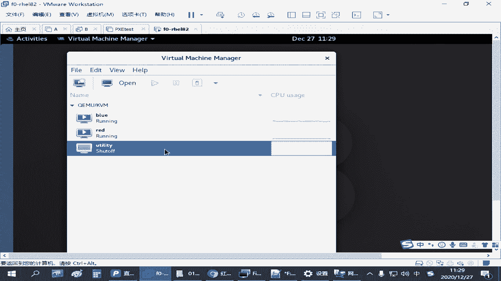

# 备考红帽认证必修课_RHCE／RHCSA／Linux云计算架构师 - P25：4.02-仓库环境配置 - 达内-达达小助手 - BV1KS4y1N7RQ

呃在红帽这个练习环境里面，我们给大家准备了一个虚拟机，叫u t t啊，这个虚拟机大家打开之后，默认就有这个虚拟机不能还原啊，所以大家别把这个虚拟机给删了，这个数据我们不需要给他做任何的修改参数。

啊知道这个意思吧是吧，那如果我们要用这个仓库啊，怎么办，你要把这个虚拟机启动起来啊。

那为什么我们这个环境没有我们在调环境的时候啊，没有给大家把它升机默认开启啊，因为这个环境比较占资源啊，比较占资源应该在四个g以上啊，所以平时大家如果你不练习容器，这个虚拟机是我是给大家设置默认是关闭的。

但是如果你想去下载进项目，大家需要把这个环境啊，把这个虚拟机先开启，开启完成之后，你在配置的时候呢，你都可以用，下载镜像的时候可以用，也需要用，但是当你下载完镜像之后，你觉得诶有镜像了，我不用了。

大家就可以把这个虚拟机关闭了是吧，这可以节省资源啊，要不然当你练习的时候，有时候可能会比较卡，甚至有时候那个虚拟机刚开，可能要等很久啊，你才能联系上这个仓库，没问题吧，这是我们环境里面这个虚拟机啊。

那如果你暂时要练容器的话，那其他的虚拟机我用不到，像blue，你就可以把它给关机啊，这也是为了节省资源啊，为了节省资源，如果你真机都能跑得起来，无所谓，都开始出无所谓啊，我们上午的考试两台虚拟机。

下午的考试六台虚拟机，你全跑起来，只要你真机扛得住是吧，都开灯没事啊，就是怕大家有些同学机器可能有点吃力是吧，就这么调整一下啊，好这是我们练习环境。

准备这个仓库服务器，那有了仓库服务器之后呢，相当于我们在我们的一个红包八的主题上来练习这个容器的使用，因为考试是在那个第一个虚拟当中，所以我们就用我们的那个right，连接到我们的red这台机器啊。

在这个机器上来练习容器的管理和使用，那如果要使用这个容器环境的话呢，第一个你需要装一些包啊，需要先装一些包，所以一样你这个圆一定要配好啊，但我这个是不是又没配啊，刚刚打了一个环境的时候，需要配一下啊。

这大家看那个快速配要么原不了多次了是吧，啊嗯好啊，为啥不，那配好亚本源之后呢，如果要安装容器环境啊，呃em后面有个操作叫什么呢，叫model定go啊，在这个跟普通的因素多呢不一样啊，加了一个模块啊。

后面安装的那个目标呢叫container tools啊，需要装这个这样的一个模块啊，它会把这个软件包和它对应的一些模块配置一起给装上啊，这是我们需要用到的，这个在我们那个笔记上有啊。

所以大家先仔细听一会练习的时候用来说一下安装环境啊，安装环境是model inside杠y这个好记啊，叫容器杠tos容器工具嘛是吧，装一个这个下面这个操作呢，考试的时候不用做。

但大家如果有些同学你原来用过刀客，你还习惯用刀客那个命令是吧，或者你还有一些脚本啊，可能就用dog这个命令的，那大家可以装一个这个包，这是奥特曼和dk兼容的一个工具啊，这炮特曼更刀砍吗。

考试的时候我们就用的pm就行啊，下面这个不需要装啊，这所以这个这个给大家提一下，那装好这个环境之后，我们如果要访问我们的这个仓库最核心的那个工具啊，就是p o d m o n。

那其中呢我们在管理镜像的时候，其实我们说访问仓库咋访问，不就是用这个命令来联系这个仓库嘛是吧，去下载这个镜像嘛，但是你在没有下载镜像的时候，你本机是没有任何镜像的啊，那有一个最基础的命令啊。

叫什么叫页面解释啊，就是我们下面这个镜像管理，镜像管理的操作的话呢，它有个叫什么呢，下载镜像查看镜像啊，叫image啊，下载镜像的话，那叫那个p刚才讲的是吧，image是列出镜像，p是下载镜像啊。

都是跟在我们那个poderman后面，跟着我们poderman后面，那我们先看刚才我们这个包还没装上哈，就大家一会先检查一下有没有镜像，如果没有再去下载。

那下载之前我们是不是要查询一下你服务器上给我们提供了哪些镜像，那这个操作呢叫寿喜啊，h e a r c h c h寿喜空格后面可以跟上关键词，我要知道有哪些镜像呀，能用的呀是吧，再去搜索。

比方说我们那个考试题目，他会要求我们利用仓库服务器上面的某某进校，那你得找到根据他给的这个名字去找到那个镜像的地址，再把它下载回来啊，那这个注册表服务器呢在我们的那个考试环境，它会有一个说明会告诉你。

咱们这个地方应该也有个说明会说啊，有一个容器仓库位于什么什么，考试的时候可能会叫做什么注册表服务器，什么什么啊啊账户名at密密码呢啊red hat 321是吧，这是有用的信息啊，如果需要的话。

那咱们就可以用，如果不需要呢，咱们也可以不用啊，他给我们这个账号不一定要求你一定用的，要看实际情况来我们看一下，我们把这个环境包装完之后，我们可以用奥特曼这个命令啊，email这是看一下当前有哪些迹象。

现在是不是任何都没有是吧，它会列出你这个镜像从哪个仓库来的，它的标记是什么啊，他的i d还有它的大小，还有创建的一些相关的一些设置是吧，都在这里，现在是没有任何的镜像的啊，如果我们想查镜像的话。

有个什么叫就在portman后面啊，跟一个source so，比方说我想搜索一个n gx镜像，就起个这个名字啊，指定这个名称去查询，那查询的时候，如果你装完环境之后，你直接就这么去查，他就会报错。

那大家通过这个报错呢，你会发现他在收哪一个仓库啊，在搜红帽的，他原来默认的配置是找的这个不是找了个excess的那个是吧，找的是那就是缺点，net ht。i o，他告诉你无法连接，连不上啊。

是不是连不上，那既然连不上，那我们等该怎么办，我们是得配置一下，或者咱们在你们自己在练习的时候，你没有皇帝自己找一个正常的机器，你要把它改成我们的什么刀刻的i o是不是也可以啊是吧。

你都可以都可以去测试啊，那怎么去改呢。

刚才我们的这个虚拟机啊，u ity他为我们准备的就是咱们的练习环境等。

刚刚那个叫register，缺点lab。一个demd com，那把那个虚拟机开启之后，我们要去改一个配置文件，这个配置文件就放在etc底下，叫contains啊，下面有个叫regirx。

点c o m f，这就是我们所说的注册表服务器嘛是吧，那叫logic，确实它的配置文件e d c下面的容器目录啊，找到这个配置文件之后呢，打开啊，往下看有一段配置叫做搜索的仓库地址啊。

如果搜索仓库地址有多个在这个reg区后边啊，等号后边方括号括起来里面用逗号分隔每一个地址，用引号引起来，那现在我们练习的时候，那只有一个是吧，那只有一个的话呢，那我们就把多余的要删除啊，就留一个就行啊。

然后里边改成练习环境，给我们那个地址啊，叫这个是吧，等考试的时候，他给你的那个地址是多少，就是多少，因为因为你要下镜像，你得求着别人是吧，人家告诉你地址，你都不用，那你怎么连上的，所以这是一个。

那这个改完之后呢，我们就可以再去搜索，这叫搜索，决定搜索哪个仓库来，我们可以在搜索，那搜索的时候，你会发现又报错了是吧，那你会发现光改了这一个还不够，但是他现在报错呢。

比刚刚我们那个包装好像少一点了是吧，没有说我连不上那个仓库了，但是他告诉我没有办法搜索，为啥没有办法搜索呢，他告诉我有个什么证书签名是被未知的授权机构颁发的，啥意思呢。

就是我们这个仓库它是要求h t t p s加密的，那加密的话呢，他给了我们一个网站证书，这个证书呢现在你也不能联网，它也不是一个什么第三方的那种权威机构发的，所以他觉得这个不可靠。

那不可靠的机构给你一个证书，你敢用吗是吧，那默认他是觉得不应该用啊，那咱们这个练习环境，考试环境有可能可以啊，在练习环境呢，这个它的证书应该是过期了，反正你也不能上网去验证，那不管怎么样啊。

不管是考试文件还是练习环境，如果我觉得我就想用怎么办是吧，还是刚刚这个配置文件除了指定去哪搜索以外往下走啊，还有一个有一些仓库是不安全的，我知道它不安全是吧，但是我也想用，你需要把它列到这一段啊。

叫range，确实点in the curl是吧，也不安全不安全，没关系，我不在意啊，我不介意，那你需要加到我们的register群里边啊，这里边来记住配置格式啊。

里面要用单引号引起来写上你的这个仓库的地址，那就是缺点那点一个example。com，那这个再保存是吧，如果你这个已经声明了啊，就相当于你以及告诉波特曼的命令，说我知道这个仓库不安全不安全无所谓。

你就帮我去收就行，改完这两个地方啊，再来搜索，是不是就能查到一个结果对吧，这个时候你会发现啊，你找到了一个结果啊，他给我的结果呢，你看到它的地址啊，这一长串，这是它的一个标记下载的一个标记啊。

是在我们指定的这个仓库服务器下面有个路径，你给他指定进项的名称，根据这个标记来下载就行了，后面还有一些什么评嗯，几星的啊是吧，自动生成的什么什么的，这个展会别管，还有是否是官方发布的，还有一些标记。

他后面就看不着吗是吧，还有这个stars是那个就好像我们有时候在网上找一些资料，它会给它评级，因为ngx这个镜像呢有很多人都会提供，除了官方这个网站，它能提供，那官方网站上还有别的用户上传的。

比方说我也做一个ng，实际上我上传到红帽那个官方上去，或者刀开那个官方上去，你可能都会搜索出来，那你有时候大家可能要看一下这个评分，一般那个评分那个数字最大的就是最受欢迎的，用的最多的是吧。

当咱们这个镜像仓库里边，你就搜搜索只能搜到一个啊，搜索到这个镜像之后，如果你想把它拿下来啊，我们要去下载啊，下载的操作呢刚才我们讲叫什么pl是吧，p u l l l l下载下载的时候呢。

后面跟上你刚刚搜到的这个地址啊，把它复制粘贴啊，然后回车他就会去联系我们这个仓库服务器，把它下载回来，下载回来的镜像会放在我们系统里面的某一个固定的一个目录啊。

基本上在那个v i r l l i b下面啊，它下载回来之后呢，这个听校呢展开的话应该是one校的nb容器是吧，工作目录应该在这啊，还有一个存储是吧，缓存啊等等等等。

这个目录结构不是一个单个单个的文件啊，咱不用管，你大概知道存那个就行，你下载的容器越多，它占用的空间越大是吧，这是它的一个主要的一个镜像的一个目录啊。

那工作的时候后面我们跑跑跑那个镜像镜像跑起来就变成容器，应该有一个旺乱是吧，现在没跑是没有，后来运行的时候，这个是运行状态，咱也不用管对吧，但是呢你下载完镜像之后，你知道啊，有的地方会存在。

但是谁没事记这个去了是吧，不信那我们管理镜像的时候呢，都是hot man images列表，这个时候你会发现啊，有一个镜像啊，来自于这个地方的啊，它现在占用的大小是137兆。

然后他后面有个叫什么city，是四个月之前创建的这个镜像，我是现在下载的啊，但是这个镜像呢是四个月之前别人创建的社团，对不对，然后中间还有个标记，这个标记呢相当于是它一个版本啊，目前是最新版。

我们后面在管理这个镜像的时候呢，呃前面这个是来自于哪个仓库以及它的名称，后面这是一个版本标记啊，一个叫tag标记，我们在用这个某一个镜像的时候，中间啊如果指这个镜像完整的名字。

一般是把这个rapper啊和这个tag合起来，形中间用冒号分隔啊，来唯一区分一个镜像啊对吧，这是比较方便的一种方式，为什么呢，因为你单凭这个恩杰克这个名字。

有时候我这个主机上我可能要下好几个版本的镜像啊，一个是n，这个是1。7的，另外一个是n，这个是1。9的，可以吧是吧，它是可以同时存在的啊，那如果你要区分你光用一个n gx可能就不准确。

那这个时候我们就可以把这个名称冒号分隔，加后面这个名称一起写上这个标记，可能叫nt是这叫最新版，也可能叫1。9，可能这是另外一个镜像，可能还有一个镜像呢，可能叫1。7，这是允许的，知道吧。

所以我们说ngx作为一个容器在运行的时候会非常方便，做一个镜像也一样，你可以多个不同的版本呢同时存在你当前这个主机上，但如果你没有容器，我在我在一个主机上，你要装多个不同版本的软件包。

你用rpm的方式可能就很费劲，你用源码包的方式呢可能还方便一点，你放几个不同的目录就行，是不是ok吧，这在管理迹象的时候，一会呢大家做完我们这个环境把这个信息下载回来啊，用pyman image啊。

要能够看到好吧，来大家先把我们这个环境先部署上啊。

