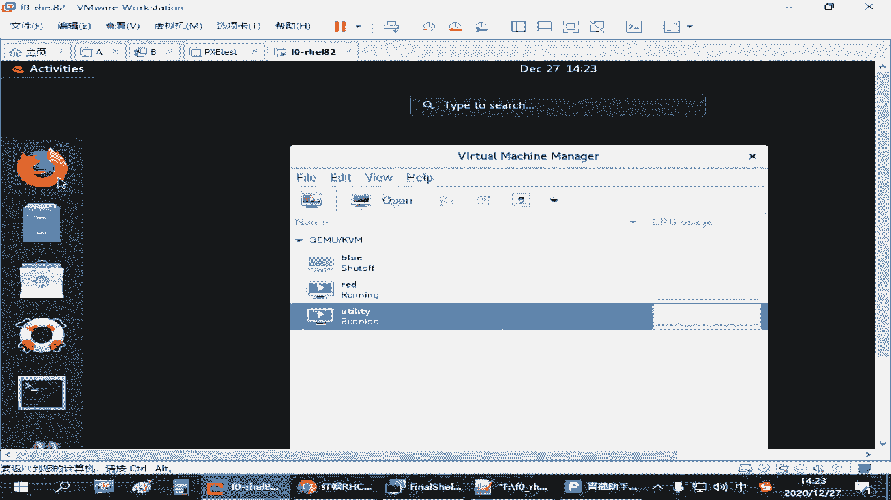

# 备考红帽认证必修课_RHCE／RHCSA／Linux云计算架构师 - P26：4.03-podman镜像操作 - 达内-达达小助手 - BV1KS4y1N7RQ

大家大家部署好了，我们这个容器环境之后啊，如果单独来管理我们这个镜像的话。我们需要学到po man指令的这么几种用法。呃，要搜索镜像呢，直接用色写就可以，是吧？啊。

port man search啊什么什么啊在用。那如果我们要去下载镜像的话呢，用的是破啊。其实要上传的话，用的是那个嗯透析啊，但我们没讲那个上传的应用，因为你需要有账号是吧，还要有权限才行啊。

查看镜像啊，直接执行Email解释。删除镜像RMI啊。ち。就是RM remove木嘛，I就是images。备份镜像用到的是sve啊，导入相当于是相当于是恢复啊，导导入一个已经打包好的一个镜像文件是ro。

那查看镜像这个地方的话呢，呃如果你要。单独去查看某一个。镜像的配置文件啊，其实在页面结释后面呢啊还可以有一个。Oh。好像叫inpect啊，叫这个。这个一般我们看这项配置文件可可能用的不多啊。

但有时候大家想了解一下它是怎么去定义的，大家可以去知道一下。那直接敲一个A面计是呢是列出这个镜像。当前这个环境里面有哪些镜像啊？他是做这个操作的啊。嗯，我们看一下啊，这边是有几个没讲到的，是吧？嗯。

可能中间还会大家遇到一个什么问题呢？就是你在上传镜像的时候或者下载镜像的时候，嗯，有一个叫做。烙个印啊。婆t们闹个音啊。正好刚刚有同学也问到啊，我们给大家那个资料里面也有。考试的时候。

他也会给你一个账号和一个密码。那如果我们那个仓库他需要你去验证用户身份的。那这个时候我们需要去登录，但是如果他不需要验证用户身份份的，那你不用登录了。这不是必须的。来，我们看一下，刚才我们讲过的啊。

如果要登录的话。你看我们前面其实你不登录的时候，下载也能下是吧？如果要登录的话呢，你打一个闹个一啊。获特曼烙个 in后边跟上你的仓库的那个地址啊。然后他会提示你输入用户名，这个时候呢输入用户名。

咱们那个练习环境的啊，那个用户账号呢是ad me。密码是readd hat321。如果他提示你成功。那么后边你在和这个仓库交互的时候啊。你就可以上传啊下载呀啊之类的是吧？只要仓库他给你这个权限啊。

但是大多数情况下呢，一般我们只是下载的话，呃，这种常规的这些镜像仓库啊，一般都可以直接下啊，可以不用登录啊，可以不用登录。好，这个也提了一下。那么搜索的时候呢，我们讲到的这个受气啊，是兽气。

后面跟上一个关键词。如果能他能查到，那么他就给你列出来啊。那下载的时候，我们用到的是那个破的曼破是吧？那如果你这个镜像已经有了，那你要去要去看的话呢，就是用那个im解释啊。

这是看到已经有的那如果你没有的话呢，你可以直接去下载啊，根据这个地址然把它给拖下来啊就可以了。这个前面正好已经操作过了是吧，下载镜像。列出镜像啊。呃，如果我们想看这个镜像，它的配置文件啊，就这个镜像。

在这个环境里面，他怎么去使用的？所以有个叫portman。イ卖ージ啊。你在后面跟一个inpect。因此。Tackle。会面跟上你这个镜像的名字。那后边我们指镜像的名字的时候呢，如果你通过这个镜像。

就最后这个名字。能够唯一定位一个镜像，你直接写NGX就行啊。如果不能唯一定义啊，你可能要把前面这个线呢。要把前面这些东西都写上。那这个后面看到的是关于这个镜像文件的一些资源定义的东西啊，它里来好多是吧？

包括你可以看到它的一些系统环境，你像这个Nject呢是基于什么无板图来做的。是吧创建的时间啊等等等等，还一堆啊。这个一般大家你可能不太关注是吧？刚才我们讲过的是。S这个没有啊。

叫image inspect啊，portman空格image空格inpect跟上镜像的名称。那如果这个镜像。我不想要了是吧？用了一段时间之后呢，刚才我们看到一个。images有一个这个镜像。

这个镜像我不想用的时候呢，我们可以把它删除。呃，删除的时候呢也是port man。RMI啊。或者们RMI啊，这这个叫删除镜像。删除镜像的时候一样，你们可以跟上这个名称啊。你把这个全写上，后面打个冒号。

再跟上一个nice似的也是可以的，这是完整的写法。可以有简单写法啊，就写个N就行。因为我这里就一个真像啊。这个删除了啊，删除了之后呢，我们再去看。说就没了，对吧？啊，没了之后呢，你要么导入啊。

要么又重新下载。如果仓库还在，那又回顾一下我们刚才讲过这个操作，或特慢复活啊。把我们刚刚前面那个搜索到哪，所以有时候你记不住嘛，我就搜索是吧？同样啊我们下载的时候也是指定它的名称啊。

codeman跟上这个。仓库地址、路径和名称啊。Yeah。这是推荐的做法。推荐的做法。Yeah。那刚才讲了几个了，搜索下载列出迹一项，查看迹像定义，然后呢删除迹一项。啊，log个一也讲是吧。

其实都是一个命你的操作啊，这几个用法呢大家会问你会用就行。那再看备份。啊，备份和导入啊就导出导入啊。来下载完成之后，A看一下有一个。呃，要导出的话呢，有个排坡的面啊C。也一样可以。把这个。

定义这个镜像呃，如果要导出的话呢，后面会打一个大于号。比方说我把这个文件呢发到我们的root目录下啊，起个名字叫port image格点它。是吧这我自己备份的一个名字啊，相当于是啊。呃。

网盘里给大家分享的不就有个这个吗？那等它导出之后，我们可以按S去看一下。Yeah。是有有一个在那叫包文件。对吧这就导出去的一个包文件啊。那如果你有这个报文件之后呢，我想导入。

我现在可能不方便去连我们我们的仓库，我想把它给导进来怎么样是吧？啊，那个就用那个LOAD啊load啊加载。那导入之前呢，我们可以或者慢先看一下啊。现在是我们刚刚下载只有一个，那导入的时候呢。

我们可以怎么办呢？可以用portman nodeLOD。然后用杠I啊杠I指定。你可能要从别的地方传到这个呃当前这个环境下的，你做好备份的那个文件。Po的 image。NGX点他。然后导入的时候呢。

一般很多时候是建议大家给他起个新的名字的啊。给他起个新的名字。你如果就写一个简单的名字，不写它的一个路径的话呢，呃一般他会。自动根据它原始的那个传过来的那个镜像那个路径给你起名字。然后我可以试一下给它。

用一个查名字看可行不行啊。导入这种方式啊。起个啥名字，但是你要和原来的区分是吧？区分开的话呢，我们就可以加一个冒号。那7个。你可以换名字啊，可以换名字啊，可以加个版本就行。啊，1。1。那这是导入对吧？

导入。因为我在导入的时候，因为原来有一个那个呃镜像的啊，这个它会有有冲突，因为它中间有一些一层一层的这是资源是已经存在的啊，他不告诉你就已经跳过去了吗？对，会有这个提示。那你原来如果没有充突的话。

那就是直接导入啊。导入之后呢，我们再看一下。P得慢。有没解释啊。就着你看我们下面会多了一个是吧，这有1个1。1。啊，这就是我们自己定义的那其实前面这个名称呢，我们是可以改的。我们下载完镜像之后。

我们在管理这个镜像的时候，这个标记我们可以变啊，可以重新改啊。这个我们考试考试的时候用不到。你如果有改他的标记的话呢，其实还有一个叫什么叫TAG啊，就tag就给他打标记，改版本都行。

这个是在管理镜像的时候，管理我们镜像的那个名称和版本。可用1个TAG。那现在你看我们改的其实主要就是这个是吧？那比如说啊如果要改它的标记的话呢，应该有一个port mant啊，我要改这个。Yeah。1。

1啊，我把它改成什么呢？嗯。改成一个新的ang杠6啊，起个名字。后边版本不加版本也行啊，加个版本也行啊，版本呢给它标记成latett。试一下。改完之后，我们再port man image再看。

你会发现又多一个是吧？啊又多了一个人家多会多了一个。😊，N这个杠6啊内。是不是这就第三个镜像了啊，那你改完之后呢，原来那个名称的迹像，我们再手动给删除啊。我们可以删除的时候呢，用port man。

RM哎。删除镜像，我们说简选的时候啊，我比方说我们想删除一个叫N。那这个时候呢。你看他找到了什么，找到了我们第一个 native。所以这种删除呢有时候就不准确啊。那大家要完整的删除的时候呢。

应该是跟上这么长一串名字，再加个冒号，再跟上后面这个标记是吧？这个会更准确。所以其实你你看我们刚刚这个代念单里删说的，你就把我们原来那个。第一个导入的那个镜像给删除了。把那个n的最终版那个。是吧。😊。

那活的慢。Yeah。RMI啊再把这个新的这个删除啊。最准确的应该应后边再加上一个net是吧，对应到的这个标记啊。把这个删除啊吧，又删了一个在上边。还可以上一个什么，刚刚那个叫1。1的1。1。按这个是的。

对。portmanim没了吧，是吧？啊，没了，来重新再导入啊。port曼啊load杠I。指定刚才我们放到root下的或者im杠N这个点它。后边只一个名字，我们还用刚刚那个名字啊。嗯。就最新版是吧？

你看这一次导入的时候，它没有存在以经充足的那些资源是吧？他就没有说那个呃什么什么已经跳过去了。所以这是刚才我们讲到的呃，关于容器的一些基本管理。啊，大家可以把这个练写一下。啊，简单的练习一下。

但是登录的操作，你就是相当于在你本机标明的一个身份啊，就标明你和仓库互相沟通的时候，它连接了一个身份。这个大家在我们练习环境你可以去这么去验证。

你可以打开咱们浏览器啊。

Oh。可以打开浏览器直接去访问。

就不需要用pod man去访问。比方说你在浏览器里面直接访问那个刚才讲过的那个regitry点lab。点一个 example。点com是吧。嗯。你是可以看到这样一个界面的那这个界面你想进去查询，想干嘛。

我都得登录嘛，是不是？你这个we部界面你不登录没法用啊，首先要你登录这个时候你输一个ad me，输一个readd hat321啊。嗯。就可以进来，这是一个这样的一个一个一个web的一个界面。

在这里你可以看到这常见的这些镜像，你可都在这是吧？还有什么UBI8呀什么的UBI7呀，这些通用的一些镜像。嗯，还在这个la下边说一个按这。我们刚刚搜索的不是就说到收到了这个案件的是吗？

那下面还有1个HTTBD的是吧？还有1个mDB那这些要加锁的是吧？加锁的有可能是下不了。那这个时候你就得登录嘛，是吧？或者说还有些要需要订阅的那你也可能没法，那就需要进一步的授权的啊。

但是咱们现在练习的用的这个呢都是开放啊，不登录也能用。所以我们说这个登录呢，它不是说。必须的，你要看情况。如果你发现你搜索不了，下载不了了是吧？他到时候你要要要登录哎，那就登。

如果你发现直接就下载下来了，那还等个啥不登录呗。

OK吧。