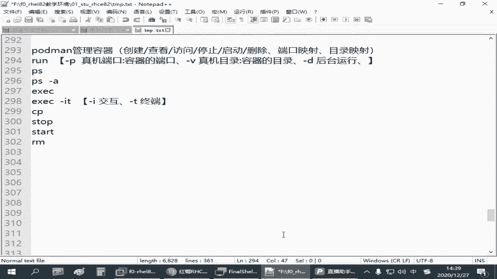
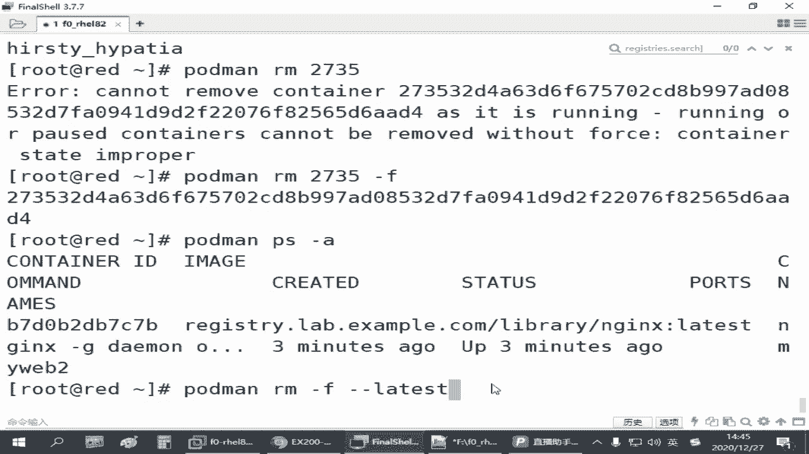

# 备考红帽认证必修课_RHCE／RHCSA／Linux云计算架构师 - P27：4.04-podman容器操作 - 达内-达达小助手 - BV1KS4y1N7RQ

啊，前面我们讲了这个容器的操作的话呢啊它就是在。把经一项给运行起来是吧？那这个时候呢，有时候我们把它镜像给刨起来啊，把它叫做一个创建啊，创建容器。那创建容器呢呃跟在pod man后面的啊，那个指令叫乱。

这个其实翻译过来，这里就要好起来是吧？叫乱啊。那怎么样把一个定向？让他跑起来啊，有好多方式啊，一会我们再说。那查看你当前已经创建好的容器，有个指令叫PS。就跟我们管理进程一样啊，有个PS。

PS可以列出你当前正在处于启动当中的容器。如果你容器已经被你停止了啊，那我们需要用1个PS。后面会跟个杠A啊，这是列出当前已经创建好的所有的东西。Yes。呃，如果要访问当前正在运行的容器的话呢。

有个只能叫EXEC啊EXEC啊执行啊。就你运行一个容器之后，我想用它里面的东西啊啊，用1个EXEC。呃，然后。你已经创建好的容器啊。我如果想把它停止，那就是用stop。已经停止的容器，我想把它启动。

就用start。呃，当然也可以re打的重启。对吧对于类似类似的跟我们管理那个系统服务似的，类似类似的那种操作啊。那如果要删除容器的话呢，是RM。

啊，刚才我们前面讲RMI，这是删除镜像啊。你把这个I去掉，就是删除容器。那乱呢是把镜像变成一个正在运行的。在内存里边能控制的这种状态啊，这叫容器。那如果IM的话呢，就相当于从内存里把那个东西给拿走。

其实有些时候你停止的时候，它可能不在内存里面，是在你有一个运行的一个目录上保持那种状态。就跟那个做快照似的啊，你只要一想运行的时候呢，你变一个star，它马上就能起来是吧？

intop它又变成暂停的状态啊。但是你一一旦你做1个IM，哎，那个容器那个状态的保持数据就没了啊。这叫删除容器。那后面我们讲的这个端口映射和目录映射啊，主要指的是我们这个乱它的一些用法。

这个还是比较常用的啊。呃，乱的用法里边呢。如果要。写两个用方放货表，如果要把你的。Yeah。跑容器的这台机器，它的一个端口。映射到我们容器里边的一个端口啊，我们可以用一个选项叫杠P。

P就是你增记的端口冒号分格在写容器的端口啊。这叫映射端口啊。呃，啥意思呢？啊，刚总不说。

嗯。来看刚刚那个图片吧。

看这个图片。那我们中间这个是不是我们的一台计算机呀？是吧那计算机上面呢我们有镜像，镜量把它跑起来是一个容器。假设这里呢我们跑了一个容器，是那个Nject的啊。那N杰克时呢，他搭了一个网站。

但这个N这个他的一个网站，我们可能另外有一些客户机可能要来访问他的，是不是啊？那这个客户就要访问这个容器的话，怎么访问？你对外是没有直接的接口的。所以我们其他的机器作为外部外部客户啊。

他最终要访问的是不是还是在访问我们这个计算机呀，你这个真机啊。那这个增机对外它要监定的是什么端口呢？比方说它监定的可能是我可以让它监近8000端口。所以从浏览器可能找的是他啊客户机。

那你增记这个8000端口怎么样对应到我们这个N几个容器里面的端口呢？那这个时候就需要有个映射啊。每一个容器，你像我们N吉克斯这个容器，它的端口呢默认默认在这个容器里边就制作容器的那个人。

他已经帮我们定义好了，端口就是80，除非我以后再改啊，你要不改的话，它的端口就是80。所以我们需要有一个映射，映射的操作就是用杠P啊，8000冒号80。这样的话。

我们的客户端就可以通过访问你这台真机的8000端口来访问你N这提供的玩意。

没是吧，这叫端口音射。那还有刚才我们下边要讲的那个目录映射。目录映射呢有时候也叫做。那个容器数据的一个持久存储。因为我们说像这里的inD这个容器啊，它运行的过程当中其实是在动态变化的。

他和你征记的那个目录呢，其实是没有没有绝对的必然联系的。他是一次性的啊。一旦启用，它就在那里，一旦把它停止删除了就没了是吧？那假设我这跑了一个NG个网站，那有用户要访问这个网站有些数据呢？

那用户可能提交了一些数据，那跑哪去了，是吧？那一旦你这个容器删了，用户的网页就没了。嗯所以这种情况下，我们要能做这个容器可以删啊，没关系。但我的那些网页数据呢，我想你在使用这个网站的过程当中。

它要保留的。那这种情况下，我们一般会在我们这台真机上边用一个目录啊，假设你真机上有个目录是A。是吧目录是A。那容器里边用到的这个目录呢，可能是一个目录B。Yeah。

我希望NGX用的这个目录B里面的内容啊，就存到我们真集的A目录里面去。这个是可以实现的。我们只要在启用这个容器的时候加一个目录映射。也是冒号分割啊，登记的目录冒号。容器里面这么录。

这就可以实现你增记的目录和容器里边的目录的关系一个一一对应的关系啊。这个关系叫目录映射啊，或者叫持久存储。这种时候你这个NG个容器，你跑了一段时间之后，就算你删了没关系。

你刚刚使用的操作的B目录的数据都在你真机里的A里面存着。这种音色就好像你建一个链接一样是吧？把它对应起来了。😡，啊，当然如果你。真机准备的目录和讯和这个容器里面的目录是一模一样的那就更更好理解了是吧？

就更好理解了。但这个不是必然的，它可以不一样啊。如果你证据里面还开的SSElinux，那有些时候呢可能要考虑到那个SElinux的一个权限的问题啊。你把证据的目录给训机里给那个容器里边。

他不一定让你这么用啊，所以这个要注意啊，这个要注意呃，映射目录的话用的那个选项呢是杠V，映射容器的话呢是杠P啊。这样的。这是在我们启用容器的时候啊，可以使用这些东西啊。这刚刚我们讲到的这个。

映射端口杠P映射目录的话呢，杠V啊是增机的目录，冒号分隔容器的目录啊。这样就可以把你增机目录和容器的目录呢建立一个关联啊。呃，甚至。如果有时候你增记里面那个SElin属性啊，你需要去保存的话。

一般你还可以在后面加一个杠大G。但是我们工作当中一般就不用这个了是吧？一般就是把Slin给关闭啊，是这个用没有无所谓啊。我们把这个先去掉啊，你们占用的是最多的。嗯。那除了这些以外呢，后边我们运行的容器。

如果我们要访问它啊，有个指令叫什么呢？叫一个选项啊，杠I和杠T两个选项。呃，杠A和杠T的话呢。Yeah。Yeah。你可以不加这个啊，你可以加这个这个杠A和杠T，其中的杠A呢表示的是需要有终端啊。

需要对嗯需要对应的那个交互回中端交互，需要和我们的管理员做交互的。然后杠T的话呢，指的是我们需要有终端。所以一会用的时候啊，一般我们去访问一个容器，最后要跟1个BASH去跟一个拜写啊。

我要执行命令的是吧？进入到一个交互式的命令行的一个环境啊。呃，另外除了这几个以外呢，还有一个叫什么呢？就是。有时候我不想用杠V去去建立一个持久的长期的关系。

我仅仅是简单的想把我们增机里的一个文件给给传递到我们的容器里边去。这有个操作叫CP啊复制。啊，copy。啊，记住啊，我们下面下面列出的这些指令啊，都是跟在po慢后边的啊。

你别把它当成正正常的那个什命力啊，是跟在pod man后面的。好，我们讲了一堆是吧？😊，那还得看例子，大家才好理解啊，我们来看怎么操作啊。

Yeah。来先看。那现在我们有一个。叫做N的容器了，啊有镜像了啊。那如果我们要跑跑这的一个镜像啊。我们可以用ra把它跑起来。那在跑起来之前呢，我们可以用port曼PS先检查一下你当前有哪些容器。

这是列出你当前运行的那个那就那个容器列表啊，现在是没有任何的容器啊。你看它有容器ID啊，对应的镜像，容器里面执行的什么命令是吧？状态是什么啊，使用的端口是什么，名称叫什么？都有。所以在这里呢。

那我们现在是没有任何的容器啊，我们要跑一个的话，或者慢乱。同样啊你要跑一个容器，你或者可以给一长串来的名字啊。这咱就一个镜像，咱就偷懒啊，直接写一个N这啊。😊。

回车。然后这个容器就跑起来了。但是这种方式呢大家会觉得不方便啊，为什么呢？这个容器跑起来之后，它要占用你当前那个前台的啊。你这个界面你再用别的命令就不方便了，是吧？它一直挡在这里啊。所以这种方式呢。

如果我们是那种提供服务的性质的容器啊，一般不这么用。这么有这个这是我刚刚开始挡着，我按了一下ct C啊，把它给停止了。但是停止之后，我们再来port man检查一下。

破得曼PS你发现没有是不是？那我们再彻底检查一下加格杠A，你会发现其实有啊。只不过被我canN就C给退出了是吧？它没有启用啊，没有启用。那如果我要启一个启用一个容器，在后台运行啊。

不要挡着我去执行别的命令。这个时候呢是portman，在运行的时候可以加一个杠D啊，杠D就表示在后台运行一个容器啊。你看它运行完成之后呢，直接告诉我哎，有个ID啊，这容器了一长状的1个ID啊。

这个时候已经运行了一个容器，这个容器我们在执行port慢的时候，PS啊给一个这这个指令，你马上就可以看到这个容器的状态。你看2735这一串，就刚刚它提示的这一串啊。

他当前的状态是正在运行的正在运行的。但是前面这个容器呢，它是退出了的。已经退出的容器啊，处于这种状态的容器，你直接敲port man P看不见，我们再敲一个port man P杠A啊。才能看见。

是不是那你看。那一个启用状态啊，一个是退出状态啊。好，这是在启用容器的时候，我们刚才又讲了一个操作啊，乱后面。

杠D啊，这叫后台运行啊。那除了这个以外呢，大家再关注一下，刚才我们启用的这个容器，你观察这个列表啊。

呃，最后有一列叫names啊，是容器的名字。容器的名字我在运行的时候并没有给他指定你这个容器叫啥名字？其实我每一个容器在运行的时候，我都可以给它起一个名字做一个标记。因为我们考试的时候会用到这个名字啊。

那咱们有个题目。

。嗯。咱们有个题目啊，利用仓库服系上面的某某某某镜像创建一个名为什么什么的容器，是吧？

那怎么指定这个名字呢？需要有一个选项叫杠杠类目。这个是用来指定容器的名称的。OK吧，所以你可以指定名称。那如果我们没有指定名称，它会怎么样呢？

他会随机随机的给我们刺激。他会帮我们自己起一个名字啊，在哪里呢？你看类幕是这一列啊，这有个什么sty。h怕他是吧，这个下边有什么就你论，这个这子就不好是吧，你就不可控啊。如果想指定名称呢。

哎我们是可以在运行这个容器的时候啊，或慢。

让降低啊。安这我们可以指定一个杠杠类啊，起个名字，比方说叫my web一。对吧那这个时候呢我们再port man images啊啊啊不是。portdermanPS。杠A列出所有，现在其实跑了三个了啊。

啊后你看最刚刚最新的那个了哪去了？哎，名字好像没起上是吧？啊，在这。这是运行的时候，但是好像名字不对。名字叫这个，那不对，那用法的不对啊。那是不是要放前面吗？嗯。你调换一下啊。卖外不啊。按这个。

嗯。啊，对，容器那个标记要放最后啊，容器标记放最后。哎，这一次你看是不是对了是吧，这就对应到我们那个名称啊，起容器的名称。呃，那大家运行这种容器的时候，如果指定名称啊呃杠杠内目什么什么放前面啊。

刚刚一下偷懒了啊，所以把这个容器你要起起哪个镜像，那个镜像的名字到最后。前面都是你控制这个镜像，在运行的时候，它的一些选项啊是吧，还一些参数啊，做这个的。好，这是启用容器的一些比较常见的一些方法啊。

那另外还有一个就是。这些容器如果我发现起多了，有些我不用它是吧？你包括像我们刚刚前面有一个不是已经退出的吗？这些容器我们是可以把它给删除的，删除之后就不用不会占用你的那个存储空间了。要么他虽然停了。

它也是保持在那里的。那删除的操作用portmanRM。不要加I啊，加I是删除记症。我们现是删除容器，就是IM就行。那删除容器的时候呢，后边我们要跟上什么呢？跟上这个容器的ID啊。跟上容器的ID。

因为这个ID每一起一个容西，它的ID都是独一无二的，不会重复啊。当然这个ID呢太长了是吧？我也不知道它网整的ID是多少。所以这个时候呢一般我们写一部分就行了，只要能区分开就行啊。他支持这种简简单的写法。

可以跟上这个。

对吧你看就删除了，删除完成之后，我们再来PS杠A。啊，这是刚刚是删除ID以4211开头的这个东西啊。

你看刚刚那个42开头的一个这一次那个状态的是没了，对吧？那刚才中间那个我们那个操作写错了的啊，它这个运行异常不是也退出来吗，是吧？那这种容器我们都可以用portmanRM去把它删除。

825D啊。对吧也删除了。再看啊。现在还剩两个。那现在还有两个呢是正在运行状态当中的啊，我们也破的慢RM去删除2735。那这个时候呢，一般他是不不让我们删的。因为这个容器正在用。正在使用当中是吧。

它现在的状态呢是up。所以这个时候你要删除的时候，它会提示你看not bere的。后面有句话叫without force。就如果你不强制删除是不行的。当然你想强制删除可以，后面价格杠F。

跟我们是按文件差不多是吧？RM杠F。哎，这个可以删除，这个删除之后，你再看。

是不是没了，又剩一个了啊，就剩一个了。Yes。那这一个我们也可以直接ho man杠。啊，port曼RFRM啊杠F强制3。然后还有一个偷懒的用法啊。我们有时候在管理这个容器的时候，刚才不是说了。

是通过这个ID去标记他们，是吧？那有些时候我们最近可能就一个容西了。那我还是去找这个ID，那老麻烦了。所以有一个操作叫什么叫杠L。这个刚L呢相当于是late啊，就找你最近的那个容器。啊。

这就偷懒的一个用法啊，你可以直接用一个杠L，你就不用去指ID了啊。

嗯，那他也会把这个容器。给删除。那一个容器都没有了，OK吧，是吧？这全没了。好，那我们再给大家把刚刚其他的一些用法看一下。😊。

啊，比方说映射端口的啊，在。映射目录的啊这些还有怎么去访问容器的啊？Good。我们port的 man啊在乱杠低，在后台跑一个容器。如果我希望这个容器呢它提供一个网络一个网站服务。

我后面要通过征机端口去访问它的啊，那就加一个杠P。假设我们是8000端口啊，对应到容器里面的80端口。因为容器里面的那个端口是容器坐着写好的啊，所以这个你不能改，但你增记这个端口呢，你可以随便改是吧？

你作为管理员，你想用哪个端口都行，只要你别和别的容器那个对外服务那个端口冲突就行啊。后边跟上N这啊啊，暂时咱咱就不不起名字了，就先这样啊。那这样的话呢又跑了一个容器是吧？那这个容器如果想访问它。

因为这是个N这个是吧？这个容器你只要把它给启动起来。啊，抛的慢。PS只要它当前是up啊，默认它会开一个网站服。默默认会开一个网站，那开一个网站之后，我怎么去访问他呢？你可以在你的真机应用浏览器去访问啊。

命令行的话呢，我们可以用CUIL去测试。怎么去访问到这个容器里的网页呢？啊，我们要访问我们的真机。他的8000端口啊。这个我们就可以看到容器里边提供的网页资源啊。你看其实里面有个welcome to。

是吧。欢迎访问安杰克啊。那刚才我们是起的时候啊，是这么起的。是吧访问的时候呢，用CUL访问真机的这个端口，你就可以拿到容器里面的资源。这叫端口音射啊。好，那这个大家会了之后，我们再来看一遍。Yeah。

那我我们说这个NG，它不是相当一个袖珍版的虚拟机嘛。那我能不能有一个界面，我去用它里面的那些资源，我直接去进去看不好吗？是不是但能不能给我们提供一个命令环环境？那是有的啊。那不是所有的容器都有。

但是大多数容器都有。比方说N节啊，那我如我如果想进入到这个容器里边去看看它的环境，我们可以用portmanEXEC。这叫执行啊。执行的方式怎么执行呢？如果。我们要指定这个容器。

像在刚才我们说偷懒就是刚L了是吧？调用最近的容器啊，或者你就得看他的那个ID啊，调用最近的容器。然后后面呢要它执行一个命令。假设我执行的命令呢是一个ca命令。

我想看一下你这个NG克容器里边的操作系统环境。你可以caETC下的OSrelease啊。那你看那么这个时候后边这条命令相当于是你进到容器里边去执行的啊。

不是你征集的啊你read的这个现在你这个read就相当于征集啊。是吧那他可以告诉我，你看N这个是对应的。这个系统版本啊是一个叫debin啊，linux10。是不是。好，那这个就是我们访问我们的容器啊。

来执行一个命令。啊，当然刚刚我们又说了这个杠L，你如果你同时跑了很多容器啊，有时候为了避免混淆，还是建议大家用那个ID，就你可以先破的慢。

PS看，然后根据ID去执行它里边的某个命令。

啊，像这里的151E是吧，就刚刚这个操作呢，我们可以把它换成。这里是杠L啊换成151E写它的ID。

一样的。文子两种用法啊。那后面可能我们有时候偷懒就用一个杠L了。Yeah。好，那这个会了之后，我们再换一个。假设我想执行的不是一个ca命令。我想进入到一个交互的模式，这个时候一般建议大家执行拜。

这个大家都知道是吧？在linux系统的默认的命令解释器啊。那执行这个的时候呢，你如果希望进入到一个交互的模式啊。Yeah。执行的时候，我们加一个杠I杠T啊。杠I交互杠T终端啊。

这个时候你会进入到一个容器里边的环境，停在这个地方啊。你在这个里边呢，其实我们就可以执行LS。是吧。那你看一下我们里面的里面那个环境。你可以执行PWD。你看里边是不是也有一个独立的目录结构。

这就相当于一个迷你版的一个lininux系统一样啊。当然它不能和我们真正的那个linux系统对比。它不是完整的吗？所以他有些命令有有些命令没有啊，这是正常的。

比方说你在这个环境里面就不能够用我们正常的你真实机的，就这个容器服务器那个平台的生成ctr。你用这个命令，这是没有的。在这个NG这里面呢，你要看它的服务有个serv是吧？然后N这 status。

他告诉我Nd正在运行是吧？那其实Nd呢这个容器里面它提供的网页默认是放在。Uer。NHTML啊在这个底下有一个网页叫index点HTML。

那这个网页呢。他就是刚刚我们从外边访问到的这个网页啊。是不是？那刚才我们是通过这种方式去看的，这是容器里边看到的啊。那假设我想更改N这给我们提供的网页的内容啊，怎么办呢？一般我们增机环境。

我们是可以用VM。但是你在这个容器里面，你会发现没有这个命的是吧？所以我们说容器里边它是一个裁剪过程啊，你不能跟你真正的机器对比，它只把他需要用到的一些东西才会提供。他觉得你这个提供一个网页。

你不需要用VIM你如果要改他的网页，你可以用别的方式。😊，这样才能节省空间嘛，什么方式呢？比方说你可以用一个A呀。OK他一算A。我重立向输出是不是我也可以改这个网页内容。改完之后，这个网页内容就变了。

啊，这是现在我们是在容器里边操作啊，root at容器的ID这是提命令行提示符的一个标记。那改完之后，我们退出来啊，在你read这台机器上，在CURL去访问，还是访问我们read的8000端口。

你会发现网页是不是就变了？对吧这就变了。当然这个变了之后呢，这个容器万一下一次呢你把容器删除再起，这个玩意就没了。因为你这次改的是一个运行当中的一个状态，你改完就没了啊，改完就没了。

所以我们需要有一个把真记的目录对应到我们容器里面的目录啊。这个是才是合适的啊。🤧Okay。那我们这里的话呢。呃，还有一种方法就是。临时我不进容器里边，我临时拷贝一个文件进去也可以啊。

这就刚才我们讲过的那个CP啊，copy那copy的话呢用的操作呢是叫homanCP啊。那我们可以提前准备一个文件。在增记里边，我们准备一个文件，比方说叫做。放到OBT下面啊，叫。index点HTL。啊。

随便写个A吧，A点HTMM斜算字母B。保存退出。那现在是有一个这个文件。如果想把这个ro的主机上的这个文件。拷贝到。Yeah。容器里面去啊，我们可以跟上容器的ID。Okay。用来标记目的地啊。

然后用一个冒号分隔再给它指定。你要拷贝到哪个目的地那个目录，你可以包括目录的文件啊，目录下的那个文件名，用这种方式。去拷贝。

拷贝完成之后呢，我们可以再用CUR来访问。你看这就是我们刚刚传进去的文件。OK吧是吧，这是从我们的相当于从真机传输一个文件啊，到我们的容器里面去。啊，这传输。🤧Yeah。来再看一个。

刚才我们讲过那个钢V啊，如果我希望这个容器在运行的时候，一直用我们增记的一个目录啊。这个一般建议大家在我们的运行容器的时候就指定啊，不要后面在那改。比方说呢我们makeDIR。来创建一个目录啊。

叫we部root。在外部 root下边呢，我们建一个文件啊，它的内容呢写一个port man test。Yeah。放到。我们这个目录下边写个文件名叫index点HTMM啊。对不对对。

这是创建一个在你略的主机上啊，创建一个网页目录，创建一个网页。那如果我希望。我开的一个容器。他使用我们真记的这个目录作为他的网页目录。我们是不是可以抛的慢 run杠D。一方面呢我们可以给它指定端口。

方便测试杠P比方说8001。对应到80端口。另一方面呢，杠V。把我们增机的OBT下的外部路ot。冒号分隔作为容器里边的，它的N这个是识别的。Uer share下的N这H天M。对吧。作为他的网页目录。

后面呢启用我们那个容器啊。啊，你如果要指定名称的话呢，就杠杠内目啊加前面啊，指定一个名称，假的叫my web一。是吧。😊，那这个就比较完整了啊，再启用一个容器，它的名字叫my web一。

它使用的网页目录是我们征集的OP地下的webroot。它端口用我们增记的8001啊。里面端口是80，在后台运行啊。是吧。😊，那这个运行起来之后呢，我们用CURL再去访问一下。read的。

8001这个端口。你看是不是看到一个portman test。OK吧，是吧。😊，那这就是刚刚我们增记的啊，这个时候你这个容器删了也没关系啊，停了也没关系。因为。你如果N这个它需要修改我这个目录。

改完之后其实改的就是你征集的目录，那它是一直保存的。这就是我们说的这个目录映射啊，持久挂载啊。杠V啊用一个杠V。

哎，刚才我们讲到的还有几个没讲的。啊，运行。查看容器啊，列出所有容器，执行一个命令。然后交互模式复制。啊，还有一个停止启用是吧，删除删除刚刚也讲了是吧？呃，停止容器呢来看一下。

坡的慢。Stop。如果我们这只有一个啊，你可以用杠。其我们也可以用刚L试一下，停止最近的停的是DB48是吧？奥特曼。PS看一下。亭总，你看见门了是吧？刚那个DB48没了。😊，但是停止它并没有删除啊。

你可以刚A再去看。

有1个DB48在上面，它的状态变成了退出。啊，当前是退出状态。如果我想让它再启用怎么办？holdmanstar啊。你分不清楚哪一个，就建议大家还是跟ID。

是吧像这里的DP是吧？你如果最近只有一个是建议大家用那个杠L也是没问题啊，这这比较这个看你们自己啊，你喜欢用哪个都行。就是你自终要确认结果，你别控制错了就行啊。

那启用完成之后，我们再。port manPS杠A看一下，你看是不是也启用了。对吧就是这stop和st。启用和停止。

好，差不多了是吧？😊，还有一个你看容器的那个定义。运行当中和我们静态的这个也不常用啊，但是大家也要了解一下吧，说一下，看始我们说一美级是吧，会不会跟上我们的那个镜像的名字，可以看镜像的那个配置定义。

那如果想看容器的呢，会者跟一个con啊。container这个in啊。跟上容器的ID或者杠L。系啦。😊，在里边定义。那如果这个容器呢。Yeah。它有些信息可能是运行起来之后，它是有有一些变化的啊。

你可以通过这种方式去验证。比方说你可以看他的IP地址。那可能他没有运行的时候，这个是没有IP的是吧？这跟我们的虚拟机一样，你虚拟机存在磁盘里面，它没有启用，是不需要再用IP的。😊，那启用之后。

它可能就有。啊，当然不是所有的容器都需要有IP啊，有些容器它不需要这种网络服务的它可能就没有IP技术。这个可以去检查的一种手段啊。

就是portman container inspect后边跟容器ID或者最近一个容器。如果是image跟上镜像的名称啊，那是看镜像的定义。嗯。

这是刚才有讲了一个。相当于是cantain，像老长那个，不过可以推不见是吧？inspect inspect又是检查视察是吧？后面跟上容器的ID啊。这几个指令大家熟悉了之后。

基本上管理容器的一般的使用都没问题啊。

