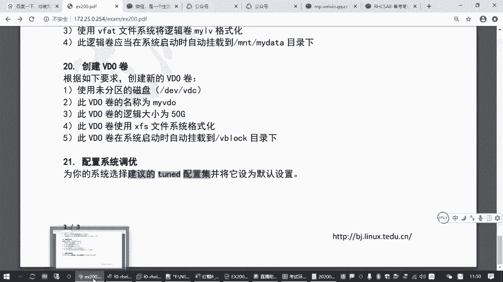
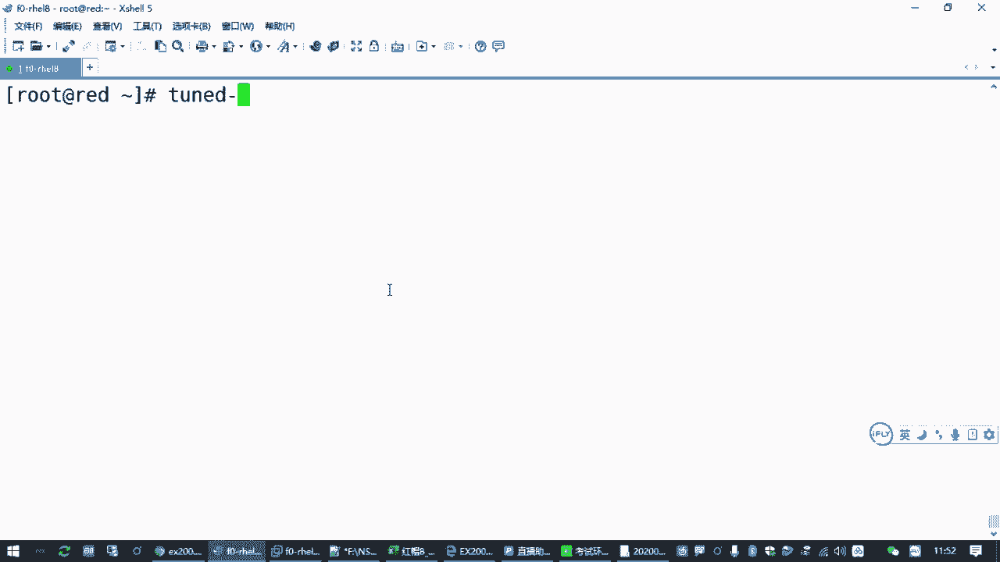
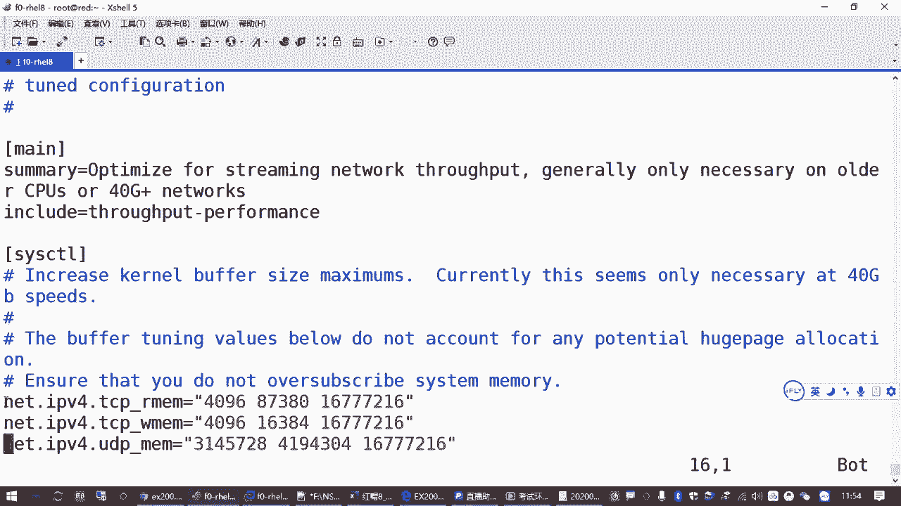
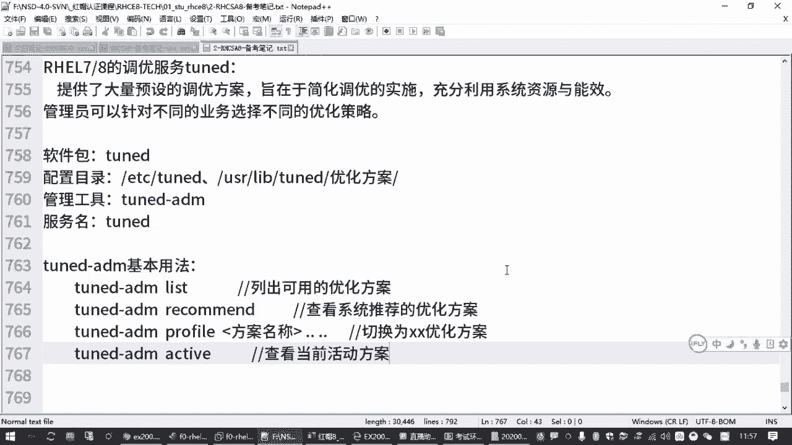

# 备考红帽认证必修课_RHCE／RHCSA／Linux云计算架构师 - P9：2.04-tuned系统调优 - 达内-达达小助手 - BV1KS4y1N7RQ

那接下来我们再讲一个知识点啊，这个知识点的话呢。OkayYeah。

在上午的考试，主要是针对我们的那个。

另外一台讯机啊叫blue。那另外在熏机里面有一个考点啊，呃看起来好像特特别复杂，就一个叫配置系统调优。

就你不做题的时候，你觉得这个哎呀好好麻烦呀，是吧？你说要把一个lininux主机呃把它要调整的更加优秀是吧？更加优化，运行更快啊，应该怎么弄啊，是吧？😊，这个在我们红帽架构师的课程里边。

原来是有一门课啊，专门教系统调优的。那我们这个IGCSA怎么也考这个了是吧？呃其实你别害怕，它考的就是让我们学会去使用红帽给我们准备好的调优的方案。就这个意思。所以这个题目呢呃非常容易啊非常非常容易。

那我们以后做的时候呢，因为咱们那个blue还没有讲那个破密码什么是吧？咱先别管啊，就大家练习的时候，咱们先在read里边，在这个read那个讯机里面先做一下。😊，之后大家模拟答题的时候。

你再换到那个blue里边再去做一下就行了啊。

呃，那关于系统调优这一块是什么意思呢？

我们所说的系统调优，它有个英文单词啊，就叫做。

Yes。TUNE是吧，叫tem啊。那这个东西的话呢嗯它会有一个服务，有个系统服务叫TUNED那在红帽7红帽8的系统里边都有这个。其实原来红帽七也有，只不过红帽没有跟我们说是吧？嗯。

然后我们也平时也很少用。😊，啊，那红帽七也好啊，八也好啊，他这个调优服务啊，有什么好处啊？他给我们提供了大量预设的调优方案。

就说你这个。红帽的这个机器啊，这个主机，你在不同的应用环境应该怎么去优化？鸿茂公司他已经帮我们设好了一些不同的方案。那这些不同的方案的话呢，你只要去选择一下就好了。😡，Okay。啊，当然一般情况下。

我们通常说哎linux要调U调的是哪？一般我们。以前肯定有同学也接触过是吧？你去百度去找很多资料，一般情况下都是要你去找那个嗯用VMVM编辑器去改那个什么，改那个什么。😊，PROC下面的。

关于系统内核的一堆参数，对不对？啊，具体路径好多啊，比方说打开路由功能啊，什么调整那个TCB延迟啊什么啊，各种设置太多了。啊，当然因为我们PROC上次我们也讲过是吧？这是内存里面的运行数据。

它的一个映射。所以你改这个目录下的东西呢，那其实马上就能生效。所以来达到优化我们lininux操作系统，它的运行过程和它的性性能的一个这样一个目标。啊，但是这么改的话都是临时的，你要改的很麻烦。

所以有一种方案就是你得让这台linux主机每次一开机，就把我们这些参参数呢给设好。啊，因为你这个linux主机，你用来做负载均衡啊，或者你只是一个虚拟机，或者你是一个数据库服务器是吧？啊。

网络流量要求比较高，或者你磁盘读写要求比较高。那有很多参数都需要去调的。😊，对不对？啊，那调整的时候呢啊还有很多时候我们就不是改这个了，我们改的是什么，改的是那个EDC下面的一个什么s。😊。

🎼control啊，点CO1F是吧？叫系统控制。哎，原来是改这个，以前老了系统，一般就是我们手动改这个，改完之后呢，一重启就管用。呃，然后这红蒙八的系统里面呢，这个文件你打开看一下。

它其实都给你注释掉了。

啊，他把很多的那种优化参数放哪去了？你看我往这些目录下面放是吧，有好多东西。而且他一般不建议你改这个。对吧那为啥呢？就是说他给我们提供了现成的优化方案啊优化方案。

那如果我们要用这个优化方案需要怎么办呢？我们需要去装一个包啊。

这包呢就叫TUNED你只要把这个包装上就好了。而且我告告诉你们，这个包红帽的系统默认就是装好的。😊。

所以你考试的时候，这个包机本你都不用装。都是现成的啊。你看咱们这个练习环境，咱们练习环境给大家为了节省这个训机资源啊，采用的是最小安装，最小安装它都是装的这个包t啊。😊，对吧这个专包都门管。

那装好这个包之后，如果我们要用怎么用呢？😡。

首先你要确保它的它的这个系统服务是开启的。所以你要enable。t tuned是吧，然后刚刚闹。这个默认也是装好的啊，也是设好的啊，默认也是启动的。所以你说这个题，你看这两步都不用我们做了啊，包也装了。

服务也起了，那我们要干嘛？😡。

那要求就是要按照题目说的，要为你的虚拟机系统选择建议的。那个调优配置级，这个配置集是它那个英文名字翻译过来的啊。嗯咱们理解的话，你就可以认为是优化方案啊，优化方案。

就是这个软件包你装完之后呢，它有很多现成的优化方案，我们只要去选择一下就行了。怎么选呢？最核心的一个管理工具叫teD杠ada a me。🎼这个你做了它补齐那个功能之后，你就可以补出来了。

TUNED杠and me对吧？就这个命令。所以大家只要熟悉一下这个命令怎么用就好了啊，答题的操作。😡，就一两步啊啊，但是我们还是要给大家把这个工具讲一下，对吧？呃，这个工具如果你忘记怎么用呢，没关系。

直接运行啊，直接敲这个命令一回车，他就会告诉你怎么用。😊。

因为你用的不对嘛，他就告诉你正确用法。😡。

那TUNED杠艾 me。后边刚要去看帮助，这看版本是吧，这些都不用管啊，那比较常见的指令在哪里呢？在这一块。

这个花花括起来的这个指令里边，我们要选择某一种。

对吧就这些指令，那有哪几个是我们需要关心的呢？😡，呃，list是列出红帽这个包给我们提供了哪几套优化的方案？啊，叫list列表吗？啊，然后呢，iditive是查看你当前正在用的是哪一套房啊，活动的是吧？

呃，然后呢还有一个就是。re command啊，这个大家要知道。哎，reman就是英文那次翻译过来是推荐的意思。那为啥要做到这个啊？因为题目要求的。

为您的系统选择建议的优化方案，对吧？谁建议的就红包建议的啊。那这个建议的就是推荐的吧。

所以怎么看TUNED杠ad mered它就可以你就可以知道红帽自动找出来的适合你当前这个系统环境的优化方案是什么？啊，所以这个要会啊。😊，那如果推荐的不是我现在用的，我要改怎么改啊？😡，Pfect。

这个翻译过来就是。

这个叫配置级啊配置集嗯，我们中文一般我们就叫叫叫那个优化方案，对吧？那只要TUNED杠ad me profile再选上那个方案的名称就完事了啊。

那刚才我们讲过list active profilerecomd。就这几个会了就可以了。😊，其他的不常用。比方说这个verfi verify呢是去验证它推荐的方案和你现在实际设置的效果有哪些差别啊？

那这个无所谓，因为主机情况不一样，他推荐的这个方案呢，可能在你当前这个环境。那有时候呢CPU的细节可能不支持啊，是吧？那你就可以忽略。😊，所以我们用到的就是刚才我们讲的这4个啊。

对吧列出可用的查看推荐的，然后切换为指定的方案，然后查看当天活动的啊，你要关闭条约方案，可以off。但这个其实也不也不常用，要么你开着就开着开着就不用关是吧，关它干嘛，除非你那个系统出问题了，是吧？😡。

那出问题，你直接把那个优化那个TUND这个服务停了就行了。😊，あ。没对吧？所以其实刚才我们这个笔记里面这最后这一条其实都是多余的。😊，嗯，写写着就留着吧。来来我们看一下。😊。

具体用法啊展示一下效果TUND呃TUNED杠艾 me后面跟一个list。

回收你看黄茂这个TYD这个包给我们推荐的可用的方案啊，1234567899种是吧？这个大家就具体看说明了啊。就比方说这个平衡模式。就在正常的真实机里边啊，好像默认是这个平衡模式。啊。

还有什么桌面环境低延迟的模式，什么网络延迟的模式呃，网络通透式穿透那个模式是吧？呃，节省电的模式啊等等等等啊，还有迅机的客户机，讯机的服务器好做吧。那后面就解释。然后他具体的方案的话呢，其实好多文件啊。

好多文件存在那个那个咱咱们都不用记，存在哪他们用的目录在ETC下的TUND啊TUNED还有什么user lab这下面有优化方案。😊，🎼这里大家如果你有同学想了解它的细节的话啊，啊。

大家你课下再去看这些目录下的不同的子目录。你看这些的是吧？比方说我们找那个什么network。

🎼是。sro是吧，这些目录下就有一个文件。那在这个文件里面呢，就是各种。🎼Yeah。🎼各种优化配置。嘿。😊，这个大家不用记啊，就是你你了解一下就行，听一遍就行啊。Yes。🎼就是一个配置文件啊。

每一种方案下面都有一个这个文件是通过刚刚那个操作呢去切换的啊。你看它下面有一堆设置。比方说你看网络这个地方它就加了几个什么设置TCPIP参数的啊，那个什么读写缓存的啊，那些数值对吧？那这个大家你要了解。

这个就肯定记不住了，你得去找资料对不对？这是增长有说明是吧？增长内核的什么缓冲区大小呀啊等等等等。所以这个是作为课下课外啊，大家有兴趣再去了解，但是我们现在要做的话。😊。

Yeah。这是了解他有哪些方案。😡，那要想看他的推荐的方案怎么办呢？😡，啊，recomd反正你推不见，你看你推不见那个包装的就是好啊。他告诉你，你现在这个系统呢适合作为一个虚拟机的客户端。

叫viual guest。对吧啊，那然后你要把你的系统改成虚拟机的客户端这个方案。😊，怎么做呢？后边干一个。Pro范。🎼然后再加上vitual guest都能table。你看。这就选择。其实我告诉你。

考试的时候，这个默认就是选择这个。所这道题你都不大不用答，知道吗？你不用做，好像就是这个啊，但是这个方法大家得会啊，你你得会去操作啊，会去操作。😊，那你怎么知道你现在用的是哪一个呢？啊。

有个叫active啊。😊，对吧你看当前使用的活动的方案是叫vitual guest，就完了啊。啊，确保TUMD服务开启开机之后自动运行，确保当前的方案是wat guest。就OK了嘛。

那大你大家考试的时候，你要去验证啊，你要去recommend看一下这个方案是否和你看到的activeitive是一样的。如果不一样，那大家要做一下这个操作，如果一样，你啥也不用干。OK吧。😊，好。

这是系统调优这道题目啊。

这个题目可能是上午最容易的一个题目了。有50%的可能性，考试的时候啥也不用做。给有。

