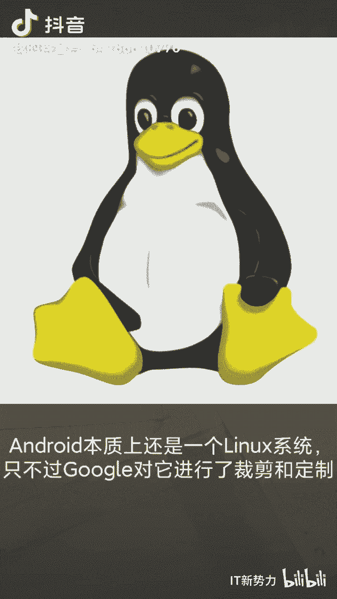

# 安卓系统与linux的前世今生 - P1 - 开源码头 - BV1n34y1D7sW

众所周知，google的android系统跟lininux修有着千丝万缕的关系，可究竟有什么关系呢？

android本质上还是一个linux系统，只不过google对它进行了裁剪和定制。

从图上看到，google自己写了一个叫dalic的程序运行在linux系统上面，这个程序就是android的java虚拟机JVM。因而，使用java开发的android的应用程序。

可以通过java虚拟机运行在android系统上。lininux内核的优势在于大内存管理进程管理，基于权限的安全模型、统一的驱动模型、共享库支持、代码开源等。所以相较于大多数的lininux发行版。

安卓是一个使用linux内核，进行了裁剪与定制的linux特殊的发行版，关注IT新势力，获取更多知识。

