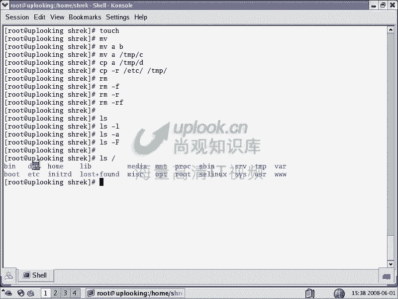
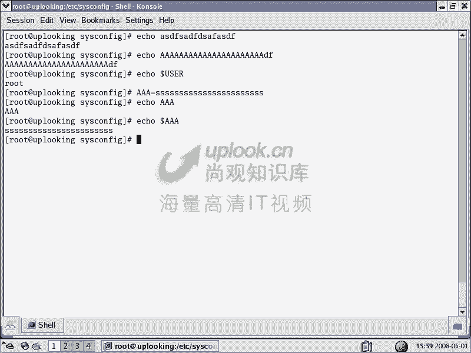

# 尚观Linux视频教程RHCE 精品课程 - P10：RH033-ULE112-03-2-文件相关命令初步 - 爱笑的程序狗 - BV1ax411o7VD

好，我们现在呢开始一下，就是说呃前面讲了很多了啊，小芳还是我跟小芳的话一块给大家介绍这个课程。那个呃我们呢已经把前面的一些比方说大的框架。然后呢，基本的一些使用方式是吧？然后呢这样的一些东西的话。

跟大家说过。你比方说系统是怎么组成的等等啊，那个控制台到底是怎么样的，使用习惯是怎么样的。这个在前几张的话都给大家讲完了。对，那现在的话我们就进入到实质的内容，像一般的培训的话呢，可能直接就是这些东西。

其实这些东西的话，大家最后就是什么运动专是吧？对，然后呢我们现在呢才开始进入到这个阶段。但是呢这些命令的话，实际上是非常简单的啊，非常简单OK我们现在看首先呢是文件操作命令。文件操作命令呢。

这里面像查看文件啊，移动或者是重命名文件啊，拷贝文件或者删除文件或者说创建一个文件，或者说更新这个文件的时间啊一个mod时间还有。

时间就是两个更改时间，就touch命令做这个。那么现在我们来看。呃，OK我们呢现在看假如说你现在对一个稳就是对系统想进行操作的话，那首先就是操作文件了。操作文件怎么操作呢？

你比方说呃现在的话我想看一下这个目录下有哪些文件啊，那么我们看到这个提示符里面，就是我们看这个地方呃，大家看现在这个波浪符号表示呢，我是在主目录下，就是我个人的主目下。那如此的主目录是在哪？杠日对吧？

那么shck用户的瞩目在哪？shck用户的瞩目在哪？那你看啊，我现在到另外一个目录，就是切换目录嘛，CD波浪符号shack，那就到shack用户的主目录了。对，啊那你说在哪个目录下呢？

PWD可以看当前所在的路径。明白吧？明白，这是PWD可以当看看成你当前所在路径。那么这些路径的话都是以根开始。然后呢是一节儿一节分出来的。那么这个时候呢，我们在这个路径里面的话，进行穿梭的时候呢。

就是等一下对目录的操作啊，我们先看文件LS命令的话，可以看这个文件呢有哪些。如果要是我现在创建一个文件的话，就touch一个文件名叫A。那么这样的话呢，就会有这样的一个A的文件。touch文件的时候呢。

如果这个文件已经存在了，那么我们就会更新它的三个时间。这三个时间呢，比方说STATA那你可以看到呢每一个文件啊都会有这三个时间。但是你要注意linux里面的文件没有创建时间。

windows里面的文件有对，对吧？但是linux里文件里面的话有一个access time，就是访问时间，有一个modify time，就是说更改时间，还有个change time。

就是说呃完全的就是说一个是更改文件的内容，一个是跟着更改文件的属性啊，这三个时间。那么如果你touch一下，比方说现在大家看都是呃15点20是吧？对，然后呢我现在touch一下。

A，然后呢再去看，那你这时候可以看到这三这三个时间都变了。那么也就是说一个access时间，一个modify时间，还有个change时间，他们全部都会随着touch命令来对这个文件的操作的话。

全部都进行更新。明白吧？明白，也就是说这个文件如果不存在的话，会怎么样？

你touch一个文件，这个文件不存在的话会怎么样？哎，小方哥是晕头转向啊，那么touch一个文件的话，实质上呢他会创建一个文件，对吧？在这个文件不存在的时候创建一文件。如果这个文件存在呢？

说呀他会更新嘛，更新什么叫时间什么时间。😊，三个时间都会更新，对对吧？对，那为什么不说呢？小芳有点腼腆啊，小芳是男的啊，那个提醒大家一下，就是说是这样的。那么我们知道呢就是说你touch一个文件。

这个文件不存在，它会创建。如果这个文件存在的话，这三个时间都会更新，明白吗？明白LS命令是看到看到这个所有的文件。那么一般来说啊，LS那也错了啊。

LS。LS命令的话呢，它会显示出来。然后LS杠L这是我们最常见的一个参数，就是LS杠L，它是一个最常见的参数，就是显示这个文件的一些基本的属性。明白吧？对吧？那么LS命令的话。

后面还可以加上一个某个路径。比方说ETC目录下的ssfi当中的，比方说s confi目录。那么我们可以看到这个目录下所有的文件，那你可以加上一个杠L看这个所有文件的这个所有的属性，一部分属性也显示出来。

明白吧？是最常用的。那么在linux里面的话呢，一个文件如果是以点开头的那这个文件呢，它就是隐含文件。明白吧？这个时候你LS命令的话，你是看不到的那个点A的话，看不到吧。对，那这个文件名只要一点开头。

它就是隐含文件，它LS命令就不会给你显示出来。那你要想显示出来怎么办呢？LS杠A那这样的话呢，这个刚才创建的这个隐含文件的话就出来了。嗯，明白吧？明白，所以你要想让你的文件不被别人直接看到。

当然了这样比较傻，属于掩耳盗铃型的，就说这种文件的话呢，实际上LS加杠A参数立刻就看到了，对不对？你说傻不傻。但是呢呃但是我们一般所说的隐含文件就是不会对你的这个视觉上造成骚扰的这个文件都以点什么开头。

这个文件名一点开头。明白吗，明白。LS杠LLS杠A还LS什么呢？LS杠F这杠大F参数的话，它比较有用啊。比方说我这些参数还可以连用的，比方说加上一个A啊，那么大F以后呢，如果是目录文件夹的话。

那它前面就加上一个杠。

明道吧？嗯如果可执性文件的话呢，它会加上一个什么？它会加上一个星啊，就是你看到这边有个星嘛，表示它是一个可执行的文件，也就是它有执行权限的文件。明白明白吧？嗯嗯，那么目录后面的话会加上一杠。

就是一个斜杠。然后呢，我可执性文件的话，会加上一个星。如果要是一个链接的话呢，它会加个at，也就是加的样子是不一样的，这个加的东西不一样，明白吧？那你说你那你说哎呦这个蓝色嘛，就是目录了是吧？然后呢。

绿色就是可执性文件了，你还搞那么多花哨加大F干嘛呢？那么你要知道现在的LS命令啊，现在的LS命令。它实际上是一个什么已经加了参数了，杠杠color了，也LS命令默认情况下是没有颜色的。

你现在之所以有颜色，是因为你运行的LS不是原汁原味的LS，而是什么？是一个别名。也就是说呢，我们执行LS的时候，实际上相当于执行了LS杠杠color等于TTY。明白吗？明白，所以他现在我这样的。

如果输对应下来LS，然后呢加上个杠A，你看到有颜色吗？没有，那你知道哪个是文件夹，哪个是文件。看不出来吧那你说哎老师，那你这神经病啊，你这神经病啊，你为什么要这样搞一下，你说你为什么一定要把颜色呢？

那么你如果要再做嵌入式系统，或者再做一个什么在自己做一个定制一个linux的时候，那你自己做一个你系统是吧？那你可以做一个什么blue就是说蓝帽子系统是吧？或者做一个什么绿帽子系统啊。

你随便你你做那么做这些系统的时候的话，你这个过程实际上你这个系统的话，在最开始一点点搭建的时候，是不是没有人可以帮你做这些工作。嗯，那这时候的话，你LS命令看出看到的可能都是这样一堆东西。

这个所以呢这个时候你可以加上一个什么大F参数。那你可以知道哪个是文件夹，哪个是文件，哪个是可执行文件，对不对？对，这样的话就O了，这就是我们讲这个参数的作用。以我们刚才讲的什么呢？

就是说首先LS命令它是一个什么别名，它不是一个真正的呃就是可执行文件。也就是我们并不是直接执行的。命令本身对吧？我们是执行的是一个别名。然后呢，接着的话讲一下。LS杠L参数杠A参数和杠大F参数啊。

这几个参数明白我明白，明白啊，那小方杠L参数干嘛用呢？系。😔，显示的东西更多是吧？对啊，小芳总是特别的羞涩啊。那么我们来看一下，就是说LS杠L，我们先看一下LS杠L参数是干嘛的呢？

它可以把文件的各种属性显示。首先最前面的话是文件的类型。如果是普通文件的话，这边是杠是吧？对，如果要是呃链接性文件是L等等。就是最前面一个字节的话是表示它是一个什么它是一个什么类型的文件。然后呢。

后面这9个位置的话呢，是文件的权限啊，这个我们等下会讲文件权限。然后接着这个地方的话是文件的link数，就是有多少个硬链接指向的这个文件。这个的话呢。

跟文件的这个就是真跟整个的这个文件系统的这个呃储存的话，储存文件的方式有关。这个我们之后的话也会讲这第一个如体的话，表示这个文件的拥有者是如。然后呢，第二个如特表示这个文件的拥有组是root组。

这边表示一个组的名字，明白吗？明白？这个零的话表示文件的大小是零字节，就没有没有任何的东西。然后这边的话是表示呃你的这个时间啊，这个时间就是呃对我们这个文件的更改时间是什么什么时间，明白了吗？明白，好。

那么我们现在呢LS杠L可以看到的文件的属性更多啊，那么现在我们来呃继续往下，刚才给大家说了一个PWD可以看到在整个目录数当中的位置。

对吧然后呢我们现在在看呃，还有呢就是说touch命令，刚才跟大家说过了是吧？对，是可以创建文件或者更新这个文件的属性，是不是更更新这个文件的这个呃三个时间。然后呢，还有呢就是我们的呃其他一些命令啊。

其他一些命令你看一下。

mo copy RM啊 move copy RM然后呢一个是移动啊，现在的话呢，假如说我现在mo当前的一个文件名叫A是吧？移动到TMP目录下，那么直接回车，那它就移动过去了，是吧？

然后现在呢我把这个文件TMP目录下的A文件移动过来啊，移动到当前命目录下，并且改名叫做B。那么现在的话呢就会有一个B文件出现。那么如果要是我想把B文件改成C文件，这样的话直接是可以的。

嗯。对吧对，那么这样的话呢，就相当于是改名了是吧？对，那么也就是说我们实际上不只是把文件进行了呃移用移动，不只可以把文件进行移动，还可以把文件进行什么？名字的更改是吧？对移动的过程当中话，同时改名字。

这都可以。所以呢在linux里面，你要想改一个文件的名字，那么一般是用mo啊，没有其他的这个直接的命令。那么这样的话比较简洁，那么另外把这个文件呢copy到某个位置，比copy到TM屏幕录下的D文件。

那D这个地方，那么直接copy过去，那当前目录下这个C文件还是存在的，是不是？对，那么同时的话呢，TM屏幕录下还会有个D文件，对吧？那这就是我们的嗯。

copy拷贝。那么拷贝的时候呢，它有点就是说如果要是你去copy一个文件夹的时候呢，需要加copy杠RCP杠R把一个文件夹。比方说把KDE这个文件夹copy到TMP目录下去，copy这个文件夹过去。嗯。

那么copy文件夹的时候要加杠R参数。那么同样呢呃。

还有呢就是我们的那个一个move，一个copy，还有一个RM删除文件是吧？删除文件的时候呢，就直接把它删除掉就好了。但是呢如果要是这个文件呃默认情况下，呃，我们呢现我这边没有执行啊，没有执行。

我们现在执行的RM命令，我们给大家看一下。那么我们现在执行的RM命令，它实质上是一个什么执行的是RM杠I。

对，也就是它是杠I是表示什么呢？是呃呃就是说我们的这是什么就是呃交互模式交互模式。就是说我们的互相之间的话，要问一下对方是否要删除，他要跟你进行交互，也就是说你删除这个文件时候，他总是要问你是否删除。

而如果要是你直接去调用并目录下的这个啊RM去删除的时候呢，他就不会问你。那这时候一下就删除掉了。这时候你再看他根本就不问你是不是？对，所以的话现在我这样的再touch一个C文件。

那么我现在呢RMC他就问你是否删除，明白了吧？明白，那就是因为我们执行的RM，它实际上是加了RM杠I的，明白吧？那么我刚才说过一个，就是如果你删你如果要是想拷贝一个文件夹的话，应该加什么参数。

R杠R参数对吧？那想删除一个文件夹呢？也得加杠R。对啊，那这就触类旁通啊。杠R你可以删除一个文件夹啊，这样的话呢他就会说你是否要删除它啊。但是呢这样删除的时候呢。

它每一个文件和每一个文件夹它都会就这个文件夹下，比方说有100个文件。

那他就会问你100次。

痛苦和痛痛苦和痛苦。对所以的话呢你可以呢加一个常见的参数，也就是杠RF，这样的话就是立刻把这个文件夹删除，并且这个文件夹下当中的所有的文件也一并删除掉。但是还而且不要问你是否删除，明白吗？明白啊。

所以的话我们现在看啊，呃给大家总结一下。

想去touch一个文，创建文件是这样的，想去移动一个文件是这样的。那么我可以呢把一个文件名叫A的文件移动成B文件是吧？也可以把A这个文件呢移动到某个目录下，并且改名字叫做什么C文件是吧。

这个我都没有回车啊，我说给大家列看一下。然后呢，这边copy一个文件，把A文件copy到某个某个目录下，并且改名，这样也是可以的。然后呢，我还可以呢copy一个文件夹，对吧？

对我把ETC文件夹copy到TMP目录下去，这个就是这样的命令。那么如果要是我现在的话想去呃删除一个文件，那么可以RM。如果要是想删除文件呢，不要问我是否删除加F参数。如果要是想删除一个文件夹的话。

是什么？杠R参数。那么如果想删除文件夹，并且不要问你是否删除里面的某一每一个文件的话，那么杠RF。清楚了吗？嗯，这个这个命令的话是不是都非常容易啊？对啊，可以仔细琢磨一下啊，非常简单的copy啊。

move啊都是非常简单的。那么大家呢只要对这个系统就是说对计算机操作的话，稍微有点印象，不管你windows还是lininux还是什么什么其他系统，那么操作起来都是非常方便的。

那么为什么我们要讲对文件的操作呢？因为计算机一切东西的话，都是以文件作为基础的对，对吧？没有这个可执行文件的话，那你就不能运行这个程序，对吧？那么运行这个程序以后要打开一个文件。

但你下载的电影是不是也是一个文件对啊，所以一切都是跟文件相关的。所以呢最开始就是跟文件啊相关的操作，当然还少一个LS命令啊，然后LS杠L是吧？LS杠ALS杠大写的F啊，小芳说大写的F是干嘛的呢？

这个参数。呃，等一下，我毒打一下小小芳啊，然后那个大家不要报警。忘了又忘了杠F参数不是后面加各种各样的那个标记吗？目录的话不是加杠嘛？可执行文件不是星吗？如果要设置链接的话，就艾嘛。啊，忘了吗？

没有没有啊，一会儿小芳会被我勒死的啊。那么这样的话呢，希望大家记住啊，希望大家记住这他这些命令的话很简单，太快了。你说如果要是培训刚培训这些东西的话，那是不是很快。

实际上呢关键就是说对lininux系统或者unux系统的话，你要深入的理解它啊，不能光是那个去熟悉一下命令。当然命令的话也非常重要。我给大家讲的就是说对命令的一个习惯性的用法。啊，你方说移动这个地方。

那么它可以呢去改名，它可以把这个文件移动过去，同时改名。对吧原来叫A移动过去以后呢，一到到TMP目录下，同时改名叫做C。对啊，然后呢，如果要copy的时候，也可以copy过去，同时改名。明样吧，明白嗯。

好，那么现在我们来看啊下面的一些其他的命令。

呃，我们接下来再看啊。对目录的一些操作。对目录的操作呢，就是说我现在呢给大家画一个目录数啊，我们说一切的话都是以根作为基础的，是吧？就跟一个树一样。那么一个树的话不是从树根开始嘛啊，一叉是吧？

当然我画的这个树比较丑了，是不是对啊。

这样的那么整个的这是一个什么呢？tree是吧？是一个树形结构，是不是对，那这树形结构是非常非常经典的。那么在我们的这个下面就是说你树上的话，比方说有一片叶子或者有个苹果啊，我画这个苹果的话，稍微丑一点。

假如设有个苹果，你能不能通过树根，然后呢一直找到这个苹果，可以肯定可以，对吧？所以的话任何的一个呃文件在整个的树形结构当中也是可以随意找到的。那么每一个关节就是每一个这个枝杈这个地方的话。

你可以把它认为是一个文件夹。你比方说从根下面的话呢，我们看到啊我们现在看一下。

这边我们现在看LS。LS跟跟下面的有这么多文件夹，对不对？对，那么我们看到第一个文件夹的话是有什么呢？并是吧，还有DV目录是吧，还有后目录是不是？对，那么现在我们拿这三个目录来说。

后目录DV目录还有并目录，拿这三个目录来说，我们现在看一下啊，看这个地方，首先跟大家知道了是吧？那么假如说有三个目录是不是有三叉。对。

一个叫什么并目录。是不是对，一个叫做。呃，这边如此目录啊，这边还有一个什么？很后目录对不对？对，还有什么呢？还有刚才有一个呃。DV目录是吧？那么我就不换DV了。那么在并目录下的话，是不是有个文件啊？对。

是吧？那么如这目录下也有，那么后目录下的话，是不是有个文件夹还叫什么？shck吧，嗯，对不对？那么现在看那么这个这这个地方的话是homehome目录下有个文件夹叫做什么呢？shck。是吧对，然后呢。

这边还有个并目录。对，对吧？这边还有个呃根下的如此目录，对不对？对？那么现在的话并目录下给比方说有个文件的话叫做什么呢？LS文件，我们可以把它认为是一个什么树叶啊，我先把它涂一下吧。Yeah。

比方说呢在这个地方的话，有一个。冇用啊。比方说在这个这地方的话，有一个树叶子叫做什么呢？叫做LS。那么我们找到LS这个文件的时候，这个文件的话全名叫什么？就是说完整的路径应该是什么？

LS这个东西的完整路径是什么？是不是？灯。😊，背影下的LSL是不是？对？那么假如说我现在呢在并目录下，我现在在这个B目录下，那么现在的话我想到shack目录下该怎么做？该到sha克梦想该怎么做？

我现在这个目录下，我现在呢PWD啊，假如说我现在看看这个地方，我现在呢CD到并目录下了，是不是？对，在并目并这个目录下，现在我想到shack这个目录下，是不是我要CD到根下面的home下的ck对对吧？

如果要是我现在想把并目录下的一个文件copy过来，是不是有这样的copy并下的LS然后呢把它copy到当前的目录下是吧？点代表当前的目录点代表当前的目录copy到当前目录下来。

然后呢直接回车O那你现在看到这边是不是有个LS的可执行文件对啊，那你就相当于怎么样呢？相当于把刚才的这个把把刚才的这个LS是不是然后呢把它怎么样复制到ck目录下了。对也就是说你现在的话。

相当于把这个路径的话，在这边这片叶子嫁接到这个地方来。

对不对？对，这个叶子当然画的比较丑了，也就是说他到这个地方来。那么你在这些目录之中啊进行切换的时候，现在你就知道自己的一个位置了。那比方说呃。

嗯，我们现在呢看这个地方啊，现在我在shack目录下是吧？对，那么我LShome，我看home目录下还有哪些文件夹，还有个sh，还有个TDT，还有个DD目录是吧？现在我想着说想到DDTDT目录下去。

我可不可以这样的CD到根目录下的home下的TDT目录，可以啊，那这样直接回车，他就可以到那个目录下去。那现在的话我想到shack回到刚才那个shack目录下，是不是还可以CD是吧？

点点代表它的上级目录。对啊，点点代表上级目录。那么现在是TTT目录嘛是吧？然后现在我这样的移到这边来了。那么假如说我现在shack的话是一个呃目录。那么这边还有个目录叫做什么呢？叫做TTT目录吧。

对是吧？那么现在的话呢，我TTT目录下的点点目录是不是后目录了。

对，然后呢点点就代表home目录，home下的shack目录是不是就到了这个地方来了？对。那仔细看一下，那么TDT这个目录点点我在这个TT这个目录下。

那么点点代表它上面这个home也就是根目录下的home目录，对不对？对，那么根不下这个home目录跟不下后me目录的话，里面有个名叫shack目录是吧？所以的话我一下想到这个shack这个目录下。

那么我这边走的是一个相对的路径，是不是？对相对的位置。那么所以的话我们现在回头看，那么我现在CD点点下面的什么呢？

下面的点点下面的shack目录，是不是就回到shack目录当中。对，那么现在我看是不是在这个目作下，哎，home下的sha是不是？对，那我现在CD点点到哪了？home啊，我再CD点点到哪了？粘贴目录。

当前我站到哪个？根呢对对吧？回车那不就是到根下去了吗？对，是不是啊？那么就这样。所以CD的两个点点以后就到根下面去了，为什么呢？那你再回头看这个图嘛，是吧？

再回头看这个图是不是先到我刚才在TT目录下或者sha目录下是吧？点点不是代表home，home的点点不就是根嘛？对，是不是所以的话这样的一级一级出来，那么现在我想到并目录下，比方说我现在回去啊。

我现在CD呃CD到home下的sha目录下，那我想问一下小芳，你怎么样到根目录下的并目录下去，用相对路径来来使用相对路径来到根目录下的并目录下，不要到不用用绝对路径。

绝对路径的话就是从根开始走，就是根下面的并，是不是？那现在我想用相对路径点点啊点的这种方式。那你告诉我们怎么走CD点点啊，然后到根怎一下。啊，是爱的，就直接摔他。我是不是让你到并幕录下啊，屏幕录下。

然后并就直接加并吗？对，然后下到是0。啊，不是他并幕录像哪有史克目录，并幕录像没有1X克目录。这个沙克诺都是ho下的。然后那个到闭幕时。就到就这样就好了。对嗯，一会儿的话，小芳会被我打死的啊。

那么大家看。我刚才说了很多次，点点的话，我们现在回头的话在这个地方啊呃，点点的话是哪？就是我在现在在shack目录下嘛，shack目录的点点是不是home？对你到home目录下。

那并目录跟home目录是不是平级的？

是不是？对，那么你到home目录下去以后，home目录下有个被目录吗？没有对啊，那你还要再退一级嘛，对不对？所以的话呢呃。

这个时候段话，我现在这样子直接去回车，那大家说怎么样，肯定说没有这个文件或者文件夹，no such fell or director是吧？对，然后这样的CD点点杠点点杠。两个点点以后。

是不是就退到根下面去了？对，然后再加上一个倍语，那这时候呢就当并动了下去了。明白这个事情结构了吗？明白啊，那OK现在的话呢PWD我现在到根目下并目录下，现在我想到什么呢？

到嗯你看我这样的CD啊USR下的并目录啊呃CDUSR下的比方说share目录下。到这个目录下去了。那么我想回到刚才那个ga目录下该怎么走，用相对路径该怎么走？嗯，CD然后点点啊杠啊点点啊，然后杠然后B。

哎，这次也是了是吧？对，那我现在CD到ho目录下啊，那么你说怎么样用相对路径到那个定目录下去嗯，CD点点啊。然后干控杠病。哎，这下你还是比较聪明的，要不然小小芳给惨了，会被我打死他。开个玩笑。

那么这样的话呢，大家就理解了相对路径。相对路径的话，就是说你像一个小蚂蚁一样。那么你在树杈当中的某一个位置，你要走一个相对路径。如果要是绝对路径呢，就是说你直接就是从根啊。

这个树根开始一级一级往上爬的对，明白吧？这就是说呃你从根开始爬的话，那么这就是绝对路径。如果要是你现在在这个地方你想呢从中间怎么走怎么走，那么不是从根开始这样走。

那么它就是什么相对路径是以当前的位置作为一个呃原点，然后呢该怎么走，那么这是相对路径清楚了吗？嗯，啊，O现在的话小方清楚了，那么我们呢来继续啊，这个图的话呢画的比较糙了啊，应该的话画的更好看一点。

那么实在对不起大家啊，我们现在呢来看一下，就是说相对路径这个概念跟大家说清楚了以后，PWD就是你在这个树形当中的某个地方，对吧？你比方说我现在在哪呢？在ETC下的。

s这个目录下对吧？然后呢，你PWD唉看ETC下的ss目录下，就是你当前的话在这个数当中的某位置了。明白吧？明白嗯，那么如果要是CD的时候呢，你就可以放一个绝对路径，对不对？

你也可以怎么样CD一个什么相对路径，点点代表上级目录点的话是代表什么当前路径。明白吗？明白啊，那么你CD的时候呢，可以这样方便。那么CD的时候呢，还可以呢更方便点。

比方说我现在在USR下的share目录下，那么现在呢我CD到什么后目录下的sha目录，对吧？现在我想回到刚才的USR下的share目录下，回到刚才的目录当中，你可以用CD的一个什么一个操作符CD什么呢？

一杠。刚才的路径看到了吗？原来的话你是在哪？原来你是在USR share share下面是吧？对，现在切换路径完了以后，你是不是在shack目录下？对。

然后呢你CD1杠就相当于CD到什么USR的share目录下。这样的话呢，你就回到了什么sha尔目下。这有点乱啊，CD再一杠，这不又回到12目录下了吗？我在CD到什么呢？home下的TDT目录。

那么现在到这个目录下去以后，我这样CD1杠，那么小芳，你说我会到哪？嗯，home啊哎，没错啊，这次小芳的话是聪明的是吧？然后呢。我们就回来，所以CD一杠方便不方便方便啊，你经常切换错误目录。

哎呦我刚才的目录我还要再重新输一遍，很麻烦。CD1杠就可以了。CD的话，还有这样的CD如果直接回车，你就到自己的主目录当中去了。我的主目录是谁呢？我的主目录是在哪呢？是在这个地方。咩啊。

我的主目录在哪呢？我的主目录在这这个地方CD啊，我现在呢在root目录下，我是root是吧，我是root，我的主目录在这个地方。那么我可以这样的啊ecle dollar home。

那么我的主目录是不是就是如此目录像，这边的话是一个环境变量，我是给大家看一下我的后目录在哪，是如此目录像。那么如果要是我现在切换成什么呢？sha账号SU1杠是切换彻底切换成另外一个账号。

那么我现在切换成sha账号。No。错啦。然后呢，我这样的呃，我现在切换成什么呢？shiftp号。s。有。这个账号现在不可用。哦，这个账号可能被我锁掉了。

稍等一下啊，我把它改一下。

错了，刚才是应该pas错杠U。然后我现在SU成什么呢？shack1杠shack。Yes。还是不可用。我先换另外一个账号吧，那个账号的话，我不知道原来做了一些pam还是什么样的东西啊。

等一下我再为了不浪费大家的时间的话，我先这样的用TT账号来做。那么TT账号我希望过去了。那么现在我是不是在我的自己的主目下，对对吧？然后新CD到比方说呃其他目录，比方说USM下。

然后我这样CDE回车会到哪。他自己的主目录对不对？对？那PWD那么除了如此账号之外，其他的账号的话，默认情况下你创建创建的用户，他的主目录都是在home目录下。他是不是回来了？对啊。

那么我现在呢想到shack用户的主目录像CD波浪符号shack，那你就会到shack用户的主目录像。但是呢因为我是TDT用户是吧？对现在我进入这个目录的话呢。

权限被拒绝commission denied，对不对？所以他不允许我去，那我CD到什么如此账号的主目录像可不可以啊？可以可以吗？不照样不行，因为你是一个普通用户。刚才我是不是如此账号？对啊。

从这里面大家可以看到如此账号的什么特权。如此账号的话，就是系统里面的什么老大就是管理员他拥有别人不能拥有的所有的这个权限，对不对？那么就是这样他可以随意便进入别人的目录。但是呢别人不能进入他的目录。

然后别人的话呢要呃就只要你不是如此账号，就是只要你的UID不为0啊，这样说可能比较贴切一些。你的UID不为0，你就不是如此账号是吧？那不是这个账号，那你就不能具有特权，清楚了吗？

嗯啊O现在的话我EXIT退出来，我回到如此账号身这个回到这个如ot的这个身份当中去对啊，O现在的话呢，我给大家呢演示了一下CD命令来进行切换路径是吧？比方说切换了一个什么呢啊。

切换成这样通过绝对路径切换是吧？或者C通过相对路径去切换，对吧？对，然后呢，我还可以直接在当前的目录下，我可以这样切换。我在ETC目录下，我可以直接CDETCfi这个文件夹，对吧？对。

那么当然按table键比较快一些，这样直接的话就到了下级目录。那么也就是说你现在的话在某目录数的某一个位置。然后你到下一级目录或者到上级目录都是非常方便的。对吧，然后你就CD。

PWD的话呢可以显示出你当前所在的位置。呃，还有一些呢就是说类似我们呃看一下，那么在这里面的话呢，创建文件夹删除文件夹啊，创建文件夹的话呢，就相当于你去创建了一个树啊，就比方说我在这里面创建个文件夹。

比方说shackDIR，那么直接创建完了以后呢，你去看一下LS杠L。那么这时候呢你可以看到shackDR在这个地方就已经创建出来了。对，就相当于你在树干上又做了一个什么下一级的支叉。

明白吧，明白？那么现在他我创建了一个名叫shack第亚啊学，我CD到sha亚啊。可不可以啊，可以可以啊，没有问题。那么你现在在这哪个位置呢ET下的s然后D点点出来吧RM可不可以删除它。

那么结果用RM命令是不是不能删除啊？对那么你这边RM命令用加什么参数都可以删除来着？杠R啊，非常聪明啊，杠R可以删除它O这个时候呢，他会问你什么是否删除说是删除，它就删除。但是呢RM杠R的话。

它只能删除就是它每一个都会问，那么最好是RM杠RF是吧？对，那么如果要是有另外一个命令，就RMDIR这个命令，它也可以删除文件夹，但是这个命令的话很少用，为什么呢？因为它删除的这个文件夹只能是空的。

如果这个文件夹是空的，它可以删除。如果非空的话，它就不能删除。烦不烦烦，那你说我就想删除非控的文件夹，那你最好用什么RM杠RF去删除。如果要是你你现在这个文件夹，你就想用RMDNR去删除。

那你还记不记得寻求帮助的时候可以怎么样？呃，最简单的寻求帮助的方法。刚刚。help是吧？对啊，那这个时候你可以看，如果要是你呢这个文件夹是非空的，你想删除它，你加这个参数好了。痛苦不痛苦痛苦。

对他摆明就不想让你用了。所以最根本的就是RMDR基本上就是没有什么实际的价值。所以我们一般都是用RM命令来删除文件夹或者文件呃文件，明白吧？那么RM命令就给以删除。

所以的话现在我们看那么回过头来再看这个PPT啊，那么呃再看这个PPT。

就说你一般RMDR的话，般的是不能不会用的，一般都是用RM杠R命令来删除啊，这就对目录的操作清楚了吗？明白啊好，那么现在呢我们可以看一下，那么再有一个呢其他的一些就是基本操作的命令，你可以看一下啊。

其他一些基本操作命令，比方说eco。

啊。ele这个命令它是不是我们已经用过了？那么小芳，你说 echole命令是干什么用的？

知咩。你后面有什么东西，他就说什么东西，对不对对？嗯。这样的话，它就是你双发出后面它加什么参数，他就把这个参数的话输出到屏幕上，对吧？ele mini就做这个用。ele的话经常用来呢去调用一些变量值。

你比ele dollar是取变量的值。那么我现在的用户啊。user是吧，user是个变量，那么直接回车，它可以把系统变量当中的，就是整个che要当中这个变量取出来。

那么就说我现在呢想看user这个变量的值是什么？因为加了个doller嘛，对doller是取出这个变量的值来，对不对？那么user这个变量的话呢，它就是是吧？

那我现在定义一个什么变量AAA这个变量等于什么呢？hello啊就这样吧，SSS一串东西，那我cleAAA会是什么样子。后面选着S啊，小芳又上当了，ele AA他还是AA。

那么ele dollarll AAA的时候，后面的话这个S才会出来。明白吧？明白，那么加刀了以后才能会取出变量的值，清楚了吗？所以ele的话经常会把这个后面的内容输出出来。

或者说后面这个取下变量值啊等等这些操作的话去用。那么还有什么呢？还有比方说我们的一些啊其他的命令啊。

你方说呃cat这是对文本进行操作的cat查看文件内容more或者list跟cat的作用是一样。但是more和 list的话，它是分页去查看。你要这个文件的话呢，它非常大有20多页。

那么cat直接就把20页给你在屏幕上滚过去，你能看到什么看不到是吧？对，所以list和more的话呢，它可以看到more比起list来说呢，要更简单一些。list可以什么呢？上下翻滚。

就是我可以看上一页内容，可以看下一页内容，那more的话只能看下一页内容。摁空格翻看下一页内容。那么VI是编辑器啊。那么现在我们讲这个VI或者more或例啊非常简单。

因为我们还有专门的要讲VI的这个编辑器的这个呃这个一章啊，专门要讲它。所以的话呢这边的话是非常简单。OK我们现在看。那么也就是说在这里面我们想去什么？

啊，cat一个文本文件，然后cat ETC项面的什么呢？ passwordword。那么这个时候的话，你可以看到这个文件就直接滚过去了。对啊，那么如果要是改成改用more呢。MORE呢。

那这时候呢它就是先显示一页，按下空格的话，它会显示后面部分，再按下空格，它会显示下面一页，明白吧？明白，那么list的话，比起 more来说的话，它是这样的list，然后加上ETC下的passor。

它可以上下翻滚。那么你在这里面你可以什么往下一格一个翻，也可以往上去翻，对不对？对，那么你还可以去查找，比方说用一斜杠，还记得查找吧，对，一斜杠是不是查找对，那是在哪哪个里面的话，用一斜杠进行查找来着。

昨天讲的。man对呀，man配置。那么在这里面的话呢，你想查找衰，那么直接回去，哎，它就查找到衰ck了。摁什么键来着是下一个嗯哎，nex是不是下一个对啊，摁什么键退出啊？

对，非常好。那么这样的话list的话，它可以呢帮我们去呃上下翻滚的去查找，并且呢上下翻滚的话去看，明白吧？明白more的话只能是顺序往下，清楚了吗？嗯，那么VI的话是干什么呢？

VI是编辑它啊正VIETC下的pa错。大家不要对这个文件进行更改，更改的话很可能某些用户说不能用VI这个文件，那么更改的时候呢，你比方说。我现在呢想去进你一进去以后的话，你输入什么键。

它都没有把这个键里面内容写写进去。啊，你要想进大家现在看啊，这现在是命令模式，你摁下I摁下I，大家看这边的话变成inser的了，看到吗？嗯，那么inser的模式的话，你才可以输入这些东西。明白吗？

明白他以输入这些东西，摁下ESC就退出了这种模式，就编辑模式。摁下U可un do就跟那个word里面就是说我不想做刚才的更改了，不是有个向回的箭头吗？un do嘛？那我刚才是不是输入了很多东西啊？对。

一摁U的话，那它就什么？没了。对啊，就是相当于作废了。ctrl加R表示我再做一遍，我我确实想继续做redo明道吧？再按下U是怎么样？undo明白吧？就是比较快了。所以呢你只能在命令模式下。

现在大家看这个地方啊，现在看这个地方，这个地方的话是不是没有东西啊，就表示你是命令模式。你当你摁下I了以后的话，会怎么样？inser的模式对不对？对，这个时候你才能进行编辑。对不对？对。

这时候你才能进行编辑。然后呢，你摁下ESA是不是就回到这个命令模式下了？对啊，那么你这时候摁一下你就可以下命令了，摁U是干什么来着？un do嘛？对，就是说把刚才做的操作撤销掉，是不是？对。

那我摁下U看是不是这样摁下U，哎，回去了吧，是不是？那么redo是什么来着？摁什么摁什么键？ctrl加R哎，对，好，ctrl加R可以redo再按一下UU了。

所以你现在按的这些键盘都是对VI进行什么下命令，因为它下面没有任何东西啊，对不对？对，那么摁I以后是不是进入inser模式啊？对，哎，先介绍这么多，还有很多其他键可以进入inser模式啊。

然后呢我们还可以怎么样按一下冒号表示进入。进入什么呢？命令模式命令行模式命令行模式的话，你比方说我这边输入一个什么Q退出。啊，如果你不想做所有的更改，Q感叹号退出。如果你想做更改什么WQ写入并退出。

如果NX的话呢，就是写入并退出，跟那个WQ是一样的，明白吧？明白嗯，那么如果要是你现在的话想退出不更改，那么就Q感叹号明白了吧？明白，那么直接回车OK那就退出出来。嗯。

冒号加Q的话是命令嗯冒号的话是表示进入命令行模式，清楚了吗？嗯，好，那么现在我们再答一遍啊，进去按inser键是进入什么呢？I键啊，进入inser的模式，就是编辑模式了。NESA是不是退出啊？对。

那冒号是不是进入编辑模式呃，并入命令行模式啊，对，命令行模式想退出该怎么办？Q啊Q如果要是我这个文件做过更改，我想不保存退出怎么办？Q加改叹号啊，如果保存退出呢，WQ。WQ是保存并退出，对吧？

那么直接回撤，那这个文件呢话就退出了，保存并退出了，明白吧？明白。大家不要随便的去改这个文件，你们在做实验的时候，不要去改ETC下的pasword。

你可以把ETC下 passwordsword给它呃复制到复制到。比方说TMP目录像。那么你去什么VI什么TMP目录下的pasword了是吧？这样的话是不是就不会对系统文件进行那个损坏了，对，对吧？

所以的话呢你可以VITMP目录下的pasword，明白了吧？明白啊，OK那么这样的话你再随便的改都可以。那么这边呢是最简单的VI的操作，VI还有很多其他操作，我们之后再讲，那么这是一个基本的一些命令啊。

然后我们现在再看，那么现在的话呃我们再往下翻。

A就是别名，这个别名的话呢是在笑当中起效果的。刚才我们是不是通过ADS命令的话，给大家看到了很多的别名。

还记不得我们说什么是别名来着？LS是不是别名啊？对啊，那么A你可以看一下现在有哪些别名，你要想再定一个别名的时候，非常简单，A是吧？然后加上一个比方说II命令II命令等于什么呢？等于呃。

去执行LS杠L呃，然后呢再加上一个什么呢？呃，等于执行LS杠L是吧？对，那么加双引号，不要忘了。双引号的话呢可以把它当成一个字符串，那么直接回车。然后这样执行II是不是这样执行了？对啊。

就相当于LS杠L吧。对，是吧？现在我不想要这个别名了，那么on alien。对吧对，这样就取消掉了。你这个时候再说哎是不是没反应了，没有啊，那么现在我们看啊，如果要是你执行了这样的一个命令以后。

那么它并不会永久生效。下次重新启动，或者说你再去用别的需要的时候，它就不生效了。那你想怎么让它永久生效呢？那你要改系统里面的配置文件，在那个系统里面有个习惯，你不改配置文件，它下次重启统肯定不生效。

那该改哪个文件呢？你可以去VI啊，你的主目录下波浪符号是不是主目录，对主目录下的杠点是不是隐汉文件，对bashRC你可以呢去VI波浪符号啊，点b是RC，就是你自己的主目录下的什么点bRC。

然后把这行命令的话放在里面。明白吧，现在我这样直接回车，那么我是不是可以把刚才那个放在里面啊？对。是不是II等于。你可以双引号也可以，单引号也可以啊。比方说呃一般如果单引号的话呢，可能更正规一点。

那么这样的LS加L是不是你这个东西就有了，对，这个参数就有了。对，就是说到时候的话，每次启动它都会生效，对吧？然后呢，如果要是不这样的话，那么它就不生效。我刚才Q感叹号并没有给他什么写入啊。

那么如果要是你讲让的。每次启动生效的话，你就可以把这个东西写到那里面去啊，NI进入in字的模式，然后添加上去，对吧？对，就这样OK。

非常简单，然后呢，on alien，那么就可以把这个呢取消掉啊，然后呢我们再看添加用户更改密码，添加用户更改密码。

呃，添添加用户更改密码的话呢，user add是添加账号是吧？对，user add添加账号，比方说叫做什么呢？TODD我添加个to账号是吧？然后呢，这个用户的话他就可以用，但是呢他不能登录，为什么呢？

因为你没有改过他的密码。对你输入个PSWD。然后呢，TODD，然后呢就可以改他的密码。改密码的时候呢，大家注意，root账号的话，可以漠视，就是说复杂性要求。比的默认密码的话应该有复杂性要求。

比方说即至少包含大小写的字母或者是数字，对吧？对，混混杂在一起。但是呢如果root账号它可以改非常简单的密码，1123都可以改root账号可以漠视复杂性要求。但是其他账号其他账号必须得要怎么样。

其他账号必须得要符合复杂性要求。你比方说现在我知道SU成什么。TODD是吧？那么TODD的话，自己输入paword的可以改自己的密码吗。对，那么他改密码的时候必须得符合复杂性要求。如果你输入123。

他呢就会出错。他说你这个密码的话不符合复杂性要求，他就出错了。明白了吗？明白嗯，OK我现在EXIT刚才我切换用户的话，是用SU1杠TODD如果你不加SG1杠的话呢，它进行切换的时候。

就切换成这个用户的时候呢，并不是特别的彻底。SU1杠还是彻底切换。那么如果要是你现在是QOD的这个账号，你想切换成root该怎么做呢？SU杠SU1杠root是吧？对，这是一般人会犯的错误。

就说你切换成root。那么这时候呢你感觉是切换回来了是吧？实际上呢你看我切换成root，那么在输ro的，我忘了如 pass多少。试一下吧。忘了。密码好像不对，那么也就是你切换成如此以后的话。

它实际上啊就是说感觉是切换过去，然后再切换回来是吧？对，实际上是不对的。那么那个时候的话。

为什么说不对呢？因为这样的话呢。因为这样这个时候的话呢，它会怎么样？就是说你现在PS treePS tree是干嘛的？看进程的是吧？对，看进程的。然后你看这个SU刚才我是不是在这里面是如此账号SU啊。

对，然后呢，我切换成什么切换成TODD是吧？是不是啊对QDD是不是又SU成root了？对，那你退出这个hell的话，是干怎么退出呢？你用EXIT来退出。

那么所以的话你现在是不是相当于你已经平白无故的开了三个baase shell了。对，实际上你只用一个ba shell就好了，是不是？所以的话你希望回去的话，你可以讲EXIT是不是我又变成TODD了？

对啊，然后我再EXIT退回成什么？对呀，我刚才从ro切换成SSU乘TODD是吧？再从TOD的话再切换成SEro是吧？是不是对那么这样直接回来是不是回成ro了对啊，O那么这就是我们的SU切换用户。

刚才我们这样呢演示了U添加一个账号，对不对？演示了什么呢？PSSFD更改这个账号的密码是不是？然后呢如果直接回车的话是更改自己的是吧？那么PSSFD然后呢改一个账号的方DD的那是改那个用户的是吧？

对如账号是不是可以忽略复杂性要求啊？对，那普通用户必须得符合复杂性要求，也就是说有数字有字母，有大小写字母，明白吧？明白嗯，那么SU可以切换成任何的一个账号，或者这SU杠切换成这个账号，对不对？

那么想回来的时候应该怎么做I对？好，那么这就是我们有关用户的一些操作。明白了吗？明白。

好，这个的话呢希望大家记住啊，放时我看一下。那么接下来的话我们再看。等一下的话呢，我们会讲第四章初级系统的管理命令。OK那么我们这个基本的这个命令的话呢，我们就先讲到这个地方啊。

OK欢迎大家呢光临就是说上关的这个视频课程。ok我们呢这节课的话先讲先讲到这个地方好。

