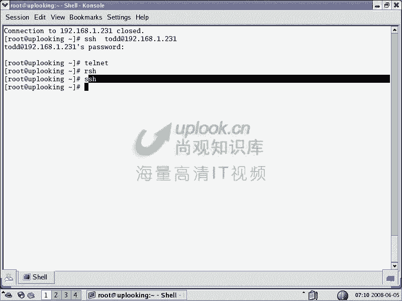
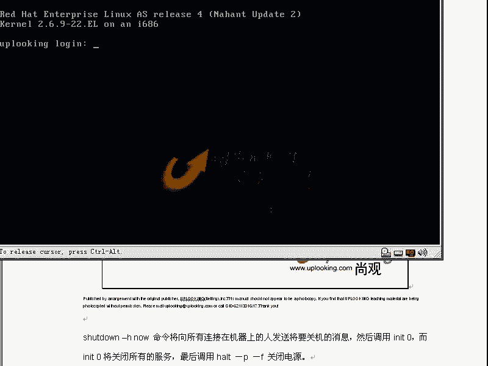
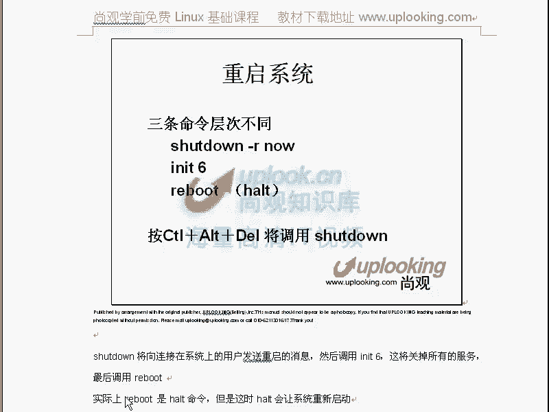

# 尚观Linux视频教程RHCE 精品课程 - P11：RH033-ULE112-04-系统命令初步 - 爱笑的程序狗 - BV1ax411o7VD

我们跟小芳一起呢进入第四章初级系统管理命令的学习。哎，小芳你好嗯你好，那个小芳呢就是说每次的话呢会提出一些问题，然后呢，会模拟大家的话进行一些这种呃提问。然后呢我会给大家一些解答啊，那么这样的话。

我们现在开始了系统初级管理命令的学习。前面的话我们是进入了一些命令的这种呃真正的这种学习是吧？对，但是呢最最前面我们还是要重申一下框架一定要明白，然后呢。

你知要学的自己自己目前学的东西是在整个知识框架的某一个部分。这样的话呢呃你才能有局部的这种详细的这种呃知识，又有什么呢？全局的这种概念。这样的话呢，你才真正能学到东西，对吧？这是我们呃费了很多劲的话。

一直让大家明白的。OK我们看初级系统管理命令。这边的话呢你将收集计算机的一些信息，然后呢切换用户和控盘，然后日期时间等命令。还有呢一些比方说使用光驱啊，然后呢文件系统的加载啊。

然后呢还有就是查看文件系统的状态。然后呢，关机命令等等这样的一些命令。O首先的话我们看一下呢，查看计算机的信息。那么所谓计算机信息的话，你主机名是什么。在windows系统里面的话，哎。

你要清楚一个什么呢？就是说我们跟windows做类比windows你要装一款软件，你比方说下载一个驱动的话是吧？你说你现在笔记本。某一个驱动没有了，你是不是要下载？对，下载的时候。

你比方说IBM某一个model驱动，那么你下载的时候是不是要选择哎是forwindows XP的，还是forwindows9598的，还是windows2000的，还是windows对对吧？

对它不兼容嘛。但是windux里面的话呢，它的版本更多。😊，那你这时候的话还需要收集linux的什么内核版本的信息，或者一些编辑信息。你刚说有些软件它跑在2。6的内核下，它在2。4内核下不能跑，对吧？

哎，有些驱动程序呢方专门方2。6。18以后的版本，对吧？所以这时候你要知道你自己系统的话是怎么样ID那么显示用户的这样的一些属性，明白吗？明白好，我们现在看那么打开这边的这样的一个东西。

那么我们可以看下hose name啊，你想看ho name，你想看自己的主机名，那么uplic点com就是你自己的主机名对吧？对，如果你想改自己的主机名怎么办？hose name。

然后后面跟着自己嘴面啊，比如说hose name我这边输入3W点up点com立刻哎，你再看一下hose name，那么它就变了，对，对吧？然后我再把它变回去hose name点com。

那这里面的话我要提供提提就是提醒大家的话，就是说有一点呢需要注意的。就是你知道主机名啊，在这边设置完以后，你是用一个命令设置的是吧？对，但是在reux里面的话，你用命令直接执行完了以后。

这个结果不保存的这是一个约定俗成，就是一般大家都知道是这样。也就是说呢，你设置完主机名以后，你下次重新启动以后，你的主机名还是那个你改过的主机名吗？不是，那那那怎么样永久更改呢？应该怎么办？小芳。

他有改一下配置文件啊，哪个配置文件。不记得VIETC下的sth confi当中的什么net嗯，明白吗？明白，那么打开这个文件，大家看一下，在这里面有个hos name看到了吗？😊。

网关也放在这里面的hosse name这边的这个hosse name的话，它是永久的更改。如果你改完它以后的话，它是永久更改。那么下次重新启动，它还会生效。嗯，那我想问一下，那这边的话。

刚才那个通过hos name那个命令去改的时候，是立刻更改，下次重新启动不生效是吧？对，那改这个文件的话，是下次重新启动生效。那么现在生效不生效。不生效。啊，所以说这个这个说的非常对啊。

就你改完这个文件以后的话，它现在是不生效的。下次重新启动以后才生效。所以说linux是不是很麻烦？对啊，所以它呢是针对普通用户不能去用的。那么一般都是针对什么专业用户是吧？所以呢它虽然麻烦。

但你外到理以后的话，知道这个习惯以后的话，就会很清楚。那么在这里面我们插一个命令啊，这个命令叫RSF费。😊，就是说改你自己的IP地址。那么比方说你自己的这个网卡，第一个网卡呢，在linux里面叫做什么？

以太网，第一个网卡是ETH0是吧？对你要想改自己的，你这样的话，直接fi直接回车，是不是可以看到以太网的这个第一个网卡的IP地址是1。231是吧？对，那么如果要是我在这边fi想立刻更改它的IP地址。

刚才我说fi直接回车RFfiETH0192168。0。80，是不是直接改自己的180啊，那么这边是不是直接改自己的IP地址了？对嗯，改完自己IP地址以后，你说下次重新启动生效不生效。😊，生效对。

它是一个用命令改完以后，它一般情况下都是不生效的是吧？对你要怎么着才能让他呃永久生效，还是一样改下配置文件啊，那你要知道它配置文件在哪要VI呢就如果要是永久可改自己的某个网卡的IP地址的话。

IE下的下面的什么下面的什么FGTH0。那么你改这个文件啊，这个文件里面大家看直接VI完了以后呢，把这个地方的IP地址的话，改成什么呢？你刚才要改IP地址这样的话，下次重新启动才会生效对不对？对。

所以的话呢这是不是一个约定俗称啊，对，那么我们给大家总结一下，那么刚才的话是这样的，如果要是你用hos name去改自己的主机名，你可以叫hos name直接显示是吧？如果要是想改的话呢。

就是ho name加上一个主机名就改了。但下次重新启动不生效是吧？😊，那你要改它的配置文件，是不是它的配置文件是这个文件，对吧？对。那么我们在这边引申出一个道理，就是说你用命令改自己的某个东西的时候呢。

一般情况下下次重功启动是不生效，除非是把它放在某个配置文件当中，对吧？对，那么这个时候的话我们说阿fi直接回车是看的IP地址fi加上ETH0，再加上1个IP地址啊，这样的啊。比方说我这样的话。

把他的IP地址改成这个是吧？对，下次成功启动生效不生效不生效，不生效的话，是不是要改这个文件的话，才会永久生效。对，对吧？所以呢这就是一个约定俗成。就是我们一般的习惯是这样的。明白吗？明白嗯。

那么假如说你这样的改了以后，你说老师你晕闷了，这让我跳楼去了，太烦了。这个lin啊但是呢实质上的话你有一些命令可以帮助你改这个配置文件。比方说这个配置文件你不知道的情况下是吧？

那么系统当中有个命令可以改叫什么 confi confi这个命令或者是其他命令它都可以自动改这个配置文件，但改完以后它是不生效的啊，所以一般mat config的话是改上面的这个配置文件，改完了以后呢。

它就不生效的。接着的话你要servicework。这样的话就是说一般这两个命令啊，这个命令是改上面这个配置文件自动改由这个命令去改。所以你不用去直接VI它了。😊，明白吗？明白，那那改完了以后立刻生效吗？

不不生效。那么让我们这个网络服务重启一遍service就是把某一个服务network这个服务restar重启一下，是不是让这个网络服务重启一下，他就重新读一下配置文件。对，那OK那这就生效了。

所以呢由ho name的话，我们把网络的一个基本的配置命令的话给大家说了一下。一个ISconfi，然后再一个用ISconfi怎么改自己的。IP地址对吧？对，然后再一个永久的更改IP地址，看怎么改是吧？

如果要是你直接改那个配置文件的话，很麻烦，对不对？那么你可以用什么net conflictfi来改，对吧？net confi改完了以后，你要紧跟着一个什么sce network restart。😊。

明白了吗？明友们。好，那这就是我们由此引出的这样一些东西啊。那么接下来的话呢，我们看你的自己的机器的一些属性，U name啊，U name直接回车，他告诉你是linux。你可能会说的，废话。

我当然是知道是linux。但是呢你要知道youyou呃you name这个命令，为什么它会有这样一个命令去显示这个呃显示这样信息呢？因为呃un name它很可能是其他unux系统都有的一个命令。

你比方说你当前是1个IBM的AIX系统，那你输U name，它会显示什么？IBM它会显示AIX啊，对，或者是显示unix等等。那么你是sreix，它会告诉你它是six。对这样的话呢，你再写一个脚本。

你比方说你自己写这个安装程序。你比方说你自己把QQ弄出来了。QQ的话，你想让它装在ux下装在linux下，那么装在un和linux下的方法是不是不一样。嗯，那么你可以自动做一个判断是吧？

用什么命令做判断。😊，unname对吧？对你可以unname，然后如果要是unname的结果等于unux的话，那么怎么怎么做？如果unname的结果等于unux的话，该怎么怎么做，明白吧？明白？

所以呢它是一个unux世界里面通用的命令，所以它呢你不要感觉它输出的结果特别恶心，或者好笑是吧？当然我就要是linux。但是你不可能让脚本自动知道，所以它脚本经常自动运行的时候肯定用它。😊，嗯。

这个脚本是自动安装的，它可以自动判断是哪种操作系统，对吧？那么这时候name的话呢，你可以加杠A参数，它可以显示更多东西。他告诉你呢你是linux系统。嗯，然后呢，你的主机名是什么？内核的版本号是多少？

然后呢于什么什么时间啊，于什么什么时间编译啊，在哪一年的什么什么时间编译，然后呢编译的是在什么平台下编译的是针对什么平台的东西啊，那么最后是Glin。那么编译平台的话，S86啊，它可以兼容这些平台。

那么你 name可以加很多参数，然后杠R它告诉你内核的版本号，那你在需要编程的时候，是不是可以根据它来判断内核版本是不是2。6内核对对吧？所以你通过这个的话，你可以自己看也可以在需要编程的时候呢。

给我们的这个安装程序去返回一个值是吧？对O这样的话我们清楚了。然后呢再看ename这个命令然后还有IDI name是显用显示用户的属性。😊，那么现在我当前是如特用户。

也就是我的UIDUVID的话就有点像系统当中的身份证号码。哎，我的身份证号码是0是吧？我是谁啊？我是呃全中国的老大是吧？那么当然是我们的主席了，是吧？敬爱的主席。那么这个时候呢我们在这个世界里面。

UID为0的是什么呀？是我们系统当中的老大，对吧？所以的话呢就是如此账号GID为0，那么就是我们的组ID为0的这个人啊，他的阻ID为0，就是说他的这个组还有一个编号。

你比方说中国共产党是我们的全中国的最大的党是吧？也是number one是吧？那他的阻ID为多少为0。那么也就是说我们都是什么啊，不是我我不是共产党啊。😊，就是说呃共产党员的阻碍地位窦为0啊。

你比方说呃什么有一个呃比方说。其他的党啊，当然我对民主党派不太熟悉了。另外一个党打ID维多党，这样的话往下排起来。那么有一个人的话呢，他既属于这个党，又属于那个党，又属于这个党，这样排起来，清楚了吗？

明白那，所以的话就就是说一个集体的这样的一个编号就是组ID了。那么你当然可以说ID杠U，那么他就显示你的UID。ID杠G是不是显示你的GID啊？对，做ID所以呢这个时候呢你想让它显示什么东西。

就显示什么东西，它显示的是用户的信息，对不对？对，那你现在编了个脚本，说不是如此账号，它就不允许安装，你是不是可以判断出来说你的IE杠1，如果不等于零的话，是不是我就不允许安装。对啊。

那你是不是这些命令都可以用得上了。嗯，所以某种程度上来讲，你看很多命令都很怪异。你说这个命令，我当然知道它是linux了，我这肯定知道他为什么还显示个linux，它在需要脚本当中可以判断。😊。

对吧我当然知道他的那个版本号有多少了，这还用问吗？是我当然知道，但是我可以在需要角给当们判断。所以呢他这些命令的话，你可以首先的话你可以自己知道。但是呢多数情况下在需要编程的时候经常用，听懂了吗？明白。

😊，嗯，OK那么这些命令的话呢，就给大家介绍了一下啊，O我们再翻到这边来。那么大家看现在的话呢是一个呃hose name，还有e name和ID啊，我们再往后翻。那么我们再看一下呢。

就是说我们的查看日期啊，查看日期，查看日历，还有呢查看文件的属性。那么当然这些不是一个类别的了啊，那么我们看一下。😊，在这里面呢查看日期是怎么样呢？比如说在这里面我们看一下日期。bate是吧，可以显示。

对啊，几月几号，然后呢可以bate命令的话呢，你说老师我没有手表啊，我不用你这个，我我我的手表还带陆历的，还一块电子表是吧？万年历都有。😊，呃，那老师你你用这个东西的话，不是太无聊了吗？

他也在笑要编程的话，经常用。你比方说你现在做这样一件事，你现在的话每天做一次备份。今天是6月5号是吧，你做了一个什么0605点backup这样的文件，对吧？对，然后呢。

你第二天那么0606点backup的文件是吧？0607点backup文件，你每天的话是不是自动生成一个文件。对这个文件名号跟你的日期相关，对吧？对啊，结果的话你怎么样，每天半夜4。

凌晨4点跑起来去给这个文件起名字去。运动吗？所以你看让它自动干，怎么自动干呢？然后一般情况是这样的，它的格式是加百分号。D。那这时候呢它就显示的是你的一个日期，明白吗？对对？然后呢。

杠呃杠D那么杠d是它的一个月份，明知白吧？你要一既想示月份又显示日期的话，怎么办？0605。那么现在我这样的touch一个文件。这个时候呢我是用反应号引起来啊，这是反引号，反应号是什么呢？呃。

ESC下面那个ESC下面那个反引号，然后呢，data，然后呢加上。百分号M百分号D，然后加上一个点log文件。那么这样做完了以后，你看这边产生了1个0605点log，看到了吗？嗯，对，好不好？

那你加上一个年的话是怎么样？你猜它年是什么？打话是啊。哇，那么小芳的话也非常郁闷的是，这老师有病了是吧？你让我猜个年，我怎么能猜得出来。大家看这边说杠Y的话是年是吧？08年0605啊。

这个时间不一定对啊。那么现在的话我们这边创建出来这样的一个日志文件啊，创建出来这样的日志文件。那么他们是根据其相关的，自动生成的。😊，我把这个命令。放在需要脚本当中，让它自动去执行的时候。

是不是每天执行一下这个脚本，就每天会创建一个这样的文件，对，对不对？所以的话呢你在back up或者做什么的时候，都非常有用。你说呢对你说老师不对啊，我这边的这个日志文件话，我要分析它。

分析它来以后面的日志文件是alac产生的alcle产生的日志文件跟日期相关的，是吧？但是呢这个文件呢它的格式不对，不是这个样子的，你再给我这样子，我觉得不对啊，那我怎么办呢？还有个什么星期几那怎么办呢？

你可以呢去呃，我如果对data显示的这个格式的话，不是特别清楚的话，我该怎么怎么办？再可以加参数加日期那个星期几那个啊，那星期几怎么办？我不知道那参数多少怎么办？😊，小芳去求佛啊，求佛保佑他。

然后告诉他，你说是这样吗？是去烧炷香就知道了吗？嗯，早晚有一天小芳会被我打死的啊，n page嘛，这还是说吗？man page是不是然后man data，后呢你去查看一下，你比方说答M也是知道的是不是？

还有什么呢？你看到这边有多不多嗯，各种各样的格式都有，还有什么分钟小时的对不对？星期几的是不是都有对啊，所以的话呢我说小芳总某一天会被我打死，是不是？然后呢，你在这边可以看到该到底是怎么怎么做的啊。

开个玩笑，那么希望呢小芳下回记住，当你对这种命令的格式或者说命令的某一个呃不熟悉的时候，我们已经说过了X里面的高手是什么，他查找帮助特别快，对不对？对啊，实际上就是这样一些人。

那么这个时候呢他串建这个data，我们给大家演示一下，那么同时的话有ACCALL的话呢显示日历是吧？CAL。然后比方说在2008，那么直接回车，哎，全能出来了。😊，嗯，对不对？对。实质上是没什么意思啊。

你说我这个桌上就有日历。但是你想看的时候，你可以通过它来看。然后呢，fi meaningf meaning令非常重要。那么我们呢我对我的这个同事，或者说我的这个学生他问过很多次。

说老师啊windows里面的话呢，一个可执行文件是点EXE的，我都能看出他还可以执行是吧？对，但是不是在linux里面的话，你怎么知道一个文件到底什么个人？很多文件的话，他都根本没有这个扩展名。

你要说这个文件啊。😊，你要说A的文件，你觉得这道它是什么类型的文件。是吧？对，所以的话你到这个里面去，比方说CD不用不下去，你再这样看，你说哪个文件可执行，哪个文件不可执行，你也不知道。

因为他们都没有扩展名是吧？对，所以这时候呢这个文件到底是什么文件，你可以用fi命令来看。然后fi他告诉你LS命令呢，它是1个32位的可执行程序。那针对英特尔的386以上的处理器的话都可以运行。啊。

那么它呢是 system five以后呢，没有什么太大变化。针对GU呃GUlinux的2。2。5以上的版本的话都可以去用明白吗？明白。所以它命令可以非常棒的告诉你这到底是什么文件。

那比方说在om目录下啊，在波om目录下的话，你看一下这些文件这么多文件啊，每一个文件带扩展名啊，这个带扩展名。但是这个扩展名，你知道它是什么意思吗？所以这时候你可以用命令来看说IR点这个文件。

告诉你这是个压缩的文件，看到了吗？嗯Z压缩的文件。然后fill然后呢VM是不是是一个X的启动的区啊区啊，对是吧？这个这是一个文件。

然后呢fillme那么是不是他告诉你这是一个呃什么什么版本的镜像文件对吧？对那么这个fill命令它是真正可以告诉你文件到底什么文件。😊，而你根据扣展名号在您的里面实际上是不保险的。对。

是吧嗯你说这个engage你能看得出它是一个压缩文件吗？看不出？对啊，那不就完了。你看不出来，那只有f面令才能看到，对不对？就这样。咱们再看啊。は。然后呢，我们现在呃。使用光盘或者U盘等啊，那么呃。

慢的命运的初步知识啊，初步的一些东西。我们再来看一下。mount命的话呢，可能很多人的话呢也能告也也知道是什么意思，会告或者告诉过你该怎么用是吧？你可能大致也用过，但是呢你可能看不到。

就是可能没有见过这么多花样啊。首先mount我现在插入一个U盘啊，或者我硬盘上有个分区，硬盘上呢一般在DV录像呢都有设备文件，所以设备文件的话，就是说在word词里面一切接文件。一切旧文件。

那么他把呃一切旧文件，他把设备的呃，就是他把那个呃。就是说硬件抽象成文件的格式，文件的形式。你当么在目头呃在低V目录下。那么这样的话有SDA1和SDA2是吧？对，因为我刚才的这个硬盘是scus硬盘。

那么它呢或者说模拟成scar硬盘，或者是SATA的硬盘。就是串行接口的这个硬盘。嗯，那么它会是SDASDA是整个的一块硬盘。SDA1SDA1是其中的什么？这个硬盘的第一个分区。

SDA2是不是这个硬盘的第二个分区啊？对。OK那么SDA1和SDA2这是第一个分区和第二个分区。那么我们现在呢想去用第二个分区mount子DV下的SD，你想去用S。S呃SDA2是吧？对，SDR。然后呢。

在这里面把它m到某个地方。这就是一个mark操作，你说m操作，他这样直接去mount直接去mount，那么这样直接。啊，他说SDA2的话是一个spike空间啊，它确实是s空间。那么这样m的时候呢。

呃如果要是它是1个EX，就是一个SDAEm在MNT目下，它SMNT下。那么这时候你们能看到完整的一个数是吧？哎，这个数的话怎么跟这个数的话是一模一样的，看到呢？对。是吧为什么？😡。

那我这样的啊CD到MN7梦想。还是这串东西啊，我C计到什么根下面还是这串东西啊，为什么？灌载过去挂载过去是吧？对，mount命令呢就是一个加载命令。这个命令怎么理解呢？你可以这样想，那。

我现在话要给大家画一下。我现在要给大家画一下mo命令的话呢，在windows里面它是比较难以理解。嗯，就是说就是加载的话呢是比较难以理解。为什么比较难以理解的。因为啊就是大家已经被windows毒害了。

就是你可能是不知道windows到底怎么回事，你看到这个装完系统以后，就有个C盘就有个D盘就有一个F盘是吧？光驱是吧？从来也不想为什么？那么原因什么？

现在比方说我拿最基本的这个windows的这个东西来看啊，你慢慢看windows现在呢比方说windows有个C盘是吧？C盘下呢有一个。😊，啊。😮，流量多一点啊。不好意思啊，我喜欢精益求精。所以的话呢。

希望大家给大家看清楚点。比要说C盘C盘下面呢这是一个根是吧？对，实际上windows的话呢一直也在用树形结构，还记得我给大家画那个数形结构吧。嗯啊那么C盘下面比方说有个文件夹。

那么有个非常熟悉的文件夹叫做什么呢？windows是吧，对，还有一个什么呢？program file是吧？对。program files是吧，这俩个文件夹。然后呢，你在这里面的话还创那个文件夹。

这个文件夹叫什么呢？比方说你做了一个什么呢？😊，document是吧，你的文档问题下是吧？对，地盘呢可就花花了啊，就是地盘上很多好东西了。比方说啊你下载下来的片子是吧，什么片子呢？比方说呃你的这个BT。

BT下载下来的片子啊，里面有什么呢？啊24小时反恐是吧？还有什么呢？还有各种各样的好好好看的像的比方rost啊，friend等等这些好玩的片子啊，这是当然是我也比较喜欢看的那么还有呢下载下来大片是吧？

等等。那么这个时候呢有另外一个是什么呢？game啊game的话有你自己喜欢的什么呢？啊，CS是吧？游戏是吧？还有什么呢？我们的这个呃。😊，比方说呃什么哎呦乱七八糟，我我现在也不知道有哪些游戏了。

反正我看什么叫什么跳舞的，什么劲舞团什么乱七八糟太多了啊。😊，那么还有呢你的这边有个PIC，就是说你的这样的一个呃图片这样的一个文件夹是吧？那么windows下的话呢，你看到的一个图标就是C盘，是不是？

对，进去了以后呢，有这样一些文件夹很好理解吧。对啊，但是实际上是那样的吗？完全不是。你把那个硬盘拆开以后，你看到里面有文件夹吗？有啊它只是给你显示出来而已。

所以它是以树形结构来显示大的文件夹就相当于是根了。那么也就是它的根是什么？这个地方，对根下面的话有几个小的树枝是吧？也就是说它这个树的话，由根这个根是谁呀？C冒号杠是不是？对第一个树枝是什么？

windows是吧，对，第二数值是什么per观 sell是不是？第三个数值是什么？DUC是吧？对，这三个数枝。那么你想找到任何的一个文件，是不是能从根这边的话去找到？嗯，但是windows呢它是多棵树。

就是说呢它地盘的话又是另外一棵树地盘。然后呢，又一个又一个又一个。然后呢，在这个数值上的话，又有三个文件夹是吧？对，24小时反口lost是吧，还有一个文件夹，对不对？是不是啊？对。

那么D盘上的这个文件是不是也能通过这样的方式去找，可以是吧？那么于是的话我们看到呃windows它是多棵小树，是不是？对，那linux的话它是一棵大树。如果要是我们现在呢以C盘作为自己的根。

那在linux里面的话，这个C盘是不是就不是这样C冒号了，是什么？是一个大根，是不是？对根。那么假如说根加载过来，你要想把这个C盘的话，加载过来，那么就输入什么？就输入mount命令是不是？对。

mount命令mountDV下面的SDAE是吧？mount在根下了，是不是？对，那这样的话呢，这个根就是我们的SDE第一个分区嘛，就是原来的在winow上看到的C盘嘛？😊，那这个根的话呢。

下面是有三个文件夹，那么windows文件夹叫什么？根。Windows。明白吗？明白？现在呢假如说你这样mo出了以后，那你这个根是不是只能访问这样的一个资源？SDA1吧。对。

那SD2也就是我们原来D盘能不能访问到，不可以啊，那我怎么样用地盘？我我现在也想用地盘怎么办？也慢了，漫他在哪儿？也慢慢他东下地盘。啊，把地盘帽回来跟下。对啊。那你原来C盘上的东西呢？是不是也不行啊？

所以呢这就是一般人难以理解的地方。就说windows下呢它是多棵树，而windows下是一棵树。所以呢这个时候的话我们想办法怎么办呢？把这棵树加载到某一个树杈上，你知要嫁接吧。嗯啊。

那么于是呢我们在这里面先创建一个文件夹，比方创建一个文件夹叫做什么呢？MNT文件夹。那么是不是这个文件夹的实际路径的话叫做杠MNT啊。对，那么于是的话我们想去加载的时候，就是什么mount。😊。

mount是吧，对，mount子。DEV下面的什么SDA2，对不对？对，那他SDA2到什么呢？MNT目录下去。那这个时候你看啊我如果一旦这是一行啊，我一旦输完这个命令以后。

是不是我的这个D盘就被嫁接到这个地方了。对啊，那我想问你一下，这个BT这个文件夹在lininux里面，如果要是经过这样两次加载了以后，这个BT这个文件夹实际的路径是在哪？路径应该是怎么样？

在那个MNT杠杠MMNT下的ETBT是吧？对，24的话就是在这边找着24了。对，明白了吗？明白，也就是说我们现在看到是两棵树嘛，这边一棵树这边一棵树，是不是？于是的话呢，我们现在看啊。

那他刚才一棵树的话呢，哎错了。刚才一棵树的话呢是呃就是说C盘这样一棵树是吧？对，C盘一棵树，然后这边一个树杈是什么呢？是windows目录是不是？对，是C冒号根是吧，这边是一个什么呢？呃。

这边是一个program file是不是这边有个document的是吧？对，那么这边的话还有个什么呢？MNT是不是？这样出创建起来。那么如果要是在windowux里面的话呢，这个就是什么根是吧？对。

然后跟下面呢有一个什么windows是不是嗯。还有一个是什么呢？客观上。pro是吧，还有个是DOC是吧，还有个是什么？是吧对，然后这时候我再把地盘加载上来会怎么样？D盘架载的MN听度下。

是不是D盘下面有三个文件夹，对，一个是什么呢？PIC文件夹是不是嗯还有个什么呢？BT文件夹是不是？还有一个文件夹叫做什么呢？game文件夹，是不是？那么BT文件夹里面是不是有几个电影啊，对，一个是什么？

24小时反口是吧？另外一个是什么lost是不是迷失是吧？还有一个什么呢？呃，还有一个比方说fend是吧？嗯，好，错了啊。R赢是吧？那么fend，那我想问一下，24小时反恐这个路径应该是什么？然杠嗯。嗯。

M问题啊。然后还有BT杠PPT。对好，然后杠20。哎，这就测殊路径，对，这清楚了吗？84小时网统里面它有个一点RM的文件，这是一个播放文件。你现在明白这个mount了吧？明白啊。

现在就是说很多人话都觉得啊windows里面多好啊，一个分区下面是几级几级的清楚了？那windows里面为什么那么烦，因为windows是一棵大树啊，windows里面是什么？😊。

每一个分区就是一棵小树，明白吗？明白嗯，但是呢实质上啊实质上你想一下，windows实际上也可以去加载的，只不过大家很少去用而已。windows也可以加载。包给大家变个魔术。

比方说右击我的电脑点管理以后，是不是出现一个这个windows的计算机管理啊。对，在这里面它磁盘管理这个地方。windows也是可以的，它也可以加载，只不过呢它是抽象了一下。你要是现在有几个分区话。

实际上是没有加载，反正这个分区没有加载是吧？这个分区没有加载了，没有含符嘛。对，那么我在这边右击它点一下什么呢？可以删除逻辑卷是吧？然后我看这边。😊，啊。

现在的话呢因为这个分区它windows不呃这个windows的话呢，它不支持，如果要支持的话呢，它可以把它怎么样也可以给它加载起来啊，分配一个券标，是不是就加载起来。对，我不分配卷标是不是没有加载，嗯。

明白了吧？明白它也是可以的，只不过呢呃更形象，windows更形象。那么同时的话呢，你可以双击某一个分区啊，点一下它的属性。在这里面的话呢呃错，右击它点一下什么呢？更改驱动器和路径。

那么你可以把它呢呃装载到某一个文件夹当中，你看到吗？嗯，你如果把D盘啊，你如果把D盘装载到C盘的一个文件夹当中去啊，比方818这个文件夹当中去，是不是D盘下所有东西在818当中都能看到。对。

一样的道理是不是啊？对，跟那个mark是不是一样道理？嗯，所以你说windows它真的是一个什么非常好的这样的系统，它把大家特别难以理解的东西直接转换成你直接非常容易理解的东西。

但是它底层或者说实际实现的时候，还是用的传统的思想，只不过呢它在中间把你和真正实现的方式隔绝开了。明白吗？你看我要把刚才我是怎么操作的，大家看一下啊。😊，我现在是E盘是吧？

右击E盘点一下什么更改驱动器名和路径，我实际上可以给它什么装在某一个空白的NTFS文件夹当中，实际上就相当于我加载到某一个分区的某一个文件夹当中，是不是跟wininux里面是一样的对啊。

所以这个呢是一样的。就你比方说你可以加载到C盘下的某一个目录是吧？嗯，那么这样就是我们的啊windows，那么实际上是一样的道了，它也可以把就是刚才我们不是把另外一个磁盘嘛，然后把这个磁盘是吧？

就是刚才那个磁盘吧，对啊，这个磁盘加载到MNT这个目录下去，是不是啊？对。这个原来就是地毯。这个原来是D盘嘛，这就是清楚了。OK那么回过头来再看我们的命密啊。头来再看命令。

那么现在的话我们输入一个m命令，输入mat命令以后呢，你就可以看到你目前加载的所有的资源。现在我们是不是把第一个分区，也就是在windows上，如果要是装上windows以后。

你看到第一个分区应该是C盘是吧？C盘加载到什么跟下吧，对对吧？那访跟的时候是不是C盘相同个文件夹，对，然后呢再去看一下什么呢？再看一下，我是不是又把C盘又重新加载了一遍，嗯，一加载到MNT目录下了。

对不对？对，所以的话它怎么样，也可以看到对啊，相当于我通过两个点都可以访到相同的资源，那你说它当然是一一模一样了，对，是不是？那么我想问一下，假如MNT目录下，原来有两个文件的话。

这个时候我加载完了以后会怎么样？😊，MT那个相对两个文件会怎么样？应该没有，对他就看不到了。对，那这两个文件被删除掉了吗？😡，没有嗯，说的好。那么虽然小我看得出小芳是猜的啊，但是呢确实猜对了。

就是原来MNT录下，假如说在没有加载之前，我们，现在you，我可以youMNT。😊，啊，eMNT是不是就忘掉了，然后再去输入mark，你看到最后那行有没有了，是不是这一行都没有了。对啊。

那么现在我这样的啊，touch在MNT目录下。MM情目下，to取两个文件，一个A一个B touch取两个文件。MNT那么这两个人呢有是吧？对。

然后呢我重新mount下mountDV下载SDAEmount在MNT录下，对不对？然后LSMNT有没有没有啊，一个mount叫MNT。要爱死安问题。出来了嗯，对不对？对，清楚了？

嗯啊所以的话它跟windows的话不一样的话，windows刚才大家看到了，他要求那个文件夹是什么空的是不是？而在windows里面的话，这个文件夹不空也无所谓，只不过你没有办法再访弄原来那些文件。😊。

嗯，一旦加来以后，现在大家知道m的命令了吧？嗯，有关我们我们现在已经是针对命令的话，已经讲了不少了。但是呢我们呃就是说所有上官的学员啊，就是说这个视频的话呢，是很多地方可能都能看到。但上官的学员的话呢。

会发一本那个啊就是练习手册。那么这个练习手册的话呢，大家照着做一下，那么里面的话有很多就是针对性的练习。那么有也许我没讲到的东西呢，在里面的话就会让大家练。

其以话呢刚才大家看到我这个命令到底是什么意思啊，就到底他他他为什么会出现这样的。那么实际上在练习当中的话会有，希望大家呢把练习手册对照着一章一章的话做完。😊，清楚了吗？嗯啊，好，那么这样的话。

我们跟大家说完了一个什么mount命令是吧，mount直接回车是干什么呢？😊，小朋友又该挨打了，那子直接回去，不是显示所有加载点嘛？对，是吧？然后呢mount。

然后如果要是我想把某一个文件加mountt上去的话，是这样mount的，是不是？对要到某一个分区mount上去这样mount。如果想去。卸载下来加载上去是这样加载是吧？卸载下来的话是什么呀？有是吧？

实际上在windows用的非常多的场合的话，你经常去卸载东西的那你要你U盘插上去以后，是不是要想去把它什么自动的去呃就是想去拔掉U盘的时候，是不是要呃安全的把它删除掉，是吧？对。

那实际上就在Umount。😊，明白吗？明白，那windows只不过是自动mark，在windows里面也可以自动mark。你插上U盘以后呢，自动mark上去，这也是可以的。只不过这是一种机制而已。

就没有什么太多的这个公司的话，做的非常好。所以windows做的是最好的，而且大家已经非常习惯使用windows这些东西了，明白吗？明白？😊，那么you mark的时候呢要注意几点。

you mark的时候呢，你不能在这个幕下啊，你不能站在船上，然后呢拆这个船或者站在这个桥上拆桥这不可能的，是吧？所以他呢如果要是你mount完了MNT了以后啊，你比方说叫做mountMNT。

上去的是吧？到MNT里面去。然后呢这个时候的话你youmountMNT行不行？不行啊，这个时候youmount时候既可以youmountMNT又可以youmount什么SDAE是吧？对，这都不行。

为什么呢？因为他说设备正在忙，为什么忙呢？是因为你站在桥上，所以他才忙，所以他你必须得怎么样C就要跟下面来是吧？再去youmount这个SDAE或者youmountMNT都可以。

这样话才能youmount起来。嗯，所以这是初学者最常犯的错误，你站在桥上是不能拆桥的。😊，另外呢有一个程序在用这个目录下的这些东西的时候，你也不能you。啱乜，明明嗯。

所以这就是一个基本的这样的一个使用啊，这就基本的使用。那么这是mount umount，还有就是说mount一个资源。清楚了吗？嗯，加载的机制。我们给大家呢刚才画了一下图是吧？

画一下图的话就是说拿小树和大树，然后呢，linux啊是两棵小树，linux啊是一棵大树。那么linux啊既然是用一棵大树怎么表达两棵树的东西呢，我们把两棵树的话嫁接起来，把它嫁接到某一个树干上，对不对？

对，这样的话就可以嫁接起来。那么这就是小树大树，当然画的比较丑啊，希望大家呢原谅啊，希望大家原谅O这就是mount命令。那么mount的话呢，完整的这个方式的话，实际上是这样的。

大家看mount杠 t vfi什么什么的，这是mount的一个命令。那么比方说你拿一个U盘过来。U盘的话就相当于崭新的一个资源呢是吧？U盘的话一般呢在linux里面会被认成是SD的设备，就的硬盘。

此加的磁盘。嗯，那么帽子如果要是你现在是SDA是吧？那么U盘插上以后的话会变成什么？SDRSDRBA。SDB吧。对啊。小芳的话呢唉。所以呢我还是比较怕小方的啊。

小方的话经常稀里糊涂的给我搞出一些不知道什么东西来。那么SDA2是不是就是刚才嘛是不是SDA的话是表示第一个的硬盘嘛，如果你第一个硬盘有了，那么是不是U盘也被认为是设备啊，是吧？

那这边是不是SDB就出来了。对啊，SDB在MN目录下，明白了吗？明白啊，所以看的SDB那么SDB是整个的一个U盘吧，对，那U盘上的第一个分区应该是什么SDBE对啊，一般SDB然后这样mon的上去。

那么mount命令的话，我们知道啊你的U盘可能是用的件系统去。😊，格式化的对不对？多数情况下，ft文件系统是吧？对，那么你ft文件系统格式化了它以后，那这个U盘格式化完了以后。你加载的时候。

难道跟I就是那个EST3的文件系统一样去加载吗？因为我们知道linux里面用的是XEX3的文件系统嘛，对不对？难道都一样吗？not令它可以自动识别这个呃类型。😊，明白吗？明白，但是当它识别不了的时候。

你有可能要这样用mount杠T什么V fight，这是f32啊，DV项目的什么呢？SDBEmountote在MNT目下，这样的话你的U盘就可以到MMNT目下去找了。啱了吗，明明。🎼那么现在的话呢。

如果要是你这样mount的话，这是一个U盘的mount是吧？呃，那当然不用了以后换会怎么办？不用了以后，是不是应镑他对问题啊。对，这样就可以了，是吧？然后呢，还有就是说我们。诶。

如果是m光盘的话会怎么样？mark啊DV下面的Cro是吧？对，INT对吧？这样可以去用光盘了。那么如果光盘的话呢，它的类型的话不太好找mark杠TRSO9660是不是？然后呢，DV下的CDro，然后呢。

MNT因为光盘的文件系统是ISO9660的。啊，或者说呢它叫什么UFS啊，好像它有另外一个名字，就是它还有一种格式。那么RSO9660的话是用的非常老的。以前的话我记得你是不能去省。

就是说你现在的话你可以直接这样回车嘛？以前的话是这个东西不能省的。或者用我在大学的时候用过一段时winux，我说windows这个破东西也好意思拿出来用啊。那当然99999年的时候。

那么用的时候的话觉得太费劲了，我记那个RSO9660的话都记不清楚，所以的话呢非常讨厌，但是呢在目前看来的话，你把光盘放到这里面，它会自动去加载，就是windows里没有自动加载机制。

当然windows做的非常早了。windows里面也有自动加载机制。因为你记得windows如果放把光盘放到光驱里面，一合上光驱以后，说windows要读一下。对，那就是在加载。😊。

那么重新读取到编缘版的加载，但是linux里面也可以去自动加载。那现在的话呢，当然省略很多，你直接冒上就好了。只有在出现问题的时候，你可以指定一下什么类型。明白了吗，明明。好，常见的话。

mount的话还有什么呢？我还可以mount一个windows的共享。mount个windows共享mount杠一般呢就是以前的话是m191168。比方说windows的机器是0。什么一啊。

这台机器有个名叫ts的共享，把它m在MNT目录像，对吧？对，就是t共享。那么mountMN目录下。那么这是我们就是这些知识啊确实比较基础。但是我们的话就是觉得也非常重要了。

那么mount一个windows的共享t这样共享mountMN目录下，你就可以用MNT目录下去访问那个windows的共享，但是现在的话呢一般都会出错。有很多公司的话或者很很多培训地方的话。

它可能也会还会这样讲，但是是际上这样的话已经不行了，你必须怎么样mount杠T什么FS。看杠192。168。0。1，然后呢choose慢安定录像，明白吗？明白啊，这时候你觉得一定要指量CIFS。

因为话呢原来默认情况是用的是30FS。啊，那么如果要是你现m子的时候呢，必须得输入用户名密码，你看就这样了mo子杠TCIFS然后呢杠O啊user name等于什么呢？比方说等于 mini啊。

然后呢是把1转18。0。1项的t，然后m子的MNT不型。明白了吧？明白，这样的话呢，就是说你要输入这个指定用户，以这个指定用户的身份的话去访问那个共享。因为你经常访问一个共享的时候。

人家让你用用户名称密码做认证啊，对，对吧？是这样的，那么CFS的话是比较新的一种文件系统，就是实际上也是网络文件系统。如果要是呢我在linows里面的话，去共享那一个文件夹，名叫ts文件夹，对吧？

然后呢，共享给谁？那么是用这样的命令去加载这个资源是吧？那么在linux里面共享数据的时候，你要另外一台linux机器给你共享的一个东西，这时候你去加载的时候呢，一般情况下用的是NF方式去共享。

你要用NF的方式去什么加载。明白吗？明白那么接下来的话就是NF方式NF方式mount19218。0。1呃，比方说0。254这台机器的话呢是N是linux机器或者inux机器。

它呢机器上有个名叫mar的FTPR的PB目录，然后呢把它m在MNT目录下。明白吗？明白？那这样的话呢，就可以加载一个airF的共享。明白了吗？明白啊，那么你在加载的时候呢，这边加载是1个NF共享。

那么NFS呢速度要比三0的话要快一倍。它传入100兆可能用一个呃用一段时间。那么呃300的话呢，它是用它的一倍的时间，明白吗？这个NF的话。

在linux的世界当中互相之间共享数据的话是非常容易的那这样的话呢，0。254这台机器上的这个目录里面的数据的话，就被我加载到MNT共享。我访问MNT目录的时候呢。

就会什么就会访问到这个机器上的这个目录里面的东西。当然了，它要不要给你共享，它不给你共享的话，你能加载上去吗？就可以对，所以NFS的话，实际上那台机器的话，启动1个NFS的服务器端给你共享出来这些东西。

明白吗？明白。那么还有一些用法，你比方说。你要说啊。你现在的话呢从网上登录到了1个ISO的镜像，这个是经常尝事的。嗯，你比方说你要呃下载了，比方说reite企业版8啊。

或者reite企业版十啊这样子登录下来。最新的啊当位下来了以后的话，你想去看一下这个光盘里面的内容，你还没刻成光盘，对不对？对，没刻成光盘的话，是不是当位的ISO镜像？对，那这是一个文件嘛。嗯。

那这时候他你想去加载这个ISO镜像ISO镜像的话呢，它相当于是一个镜像。什么镜像呢？把这个文件从第一个字节开始读，一直读到最末尾。连连的系统的这个信息也读起来，那就变成1个SO镜向了。

你想不想做个ISO镜像想吗？嗯啊，根脆这样的cat第一个下载。你现在比方说光盘当中有东西cat这个4D任务，这是不是一个硬件，这是不是一设置文件。对。

n把它输出重新像成什么A点ISO这样的话ISO镜像就做好了。😊，那吗那么你想用这个ASO的话，想去用的时候呢，你可以这样mount杠TISO9660，然后呢把啊还要加上一个参数，杠O。

因为的话呢你现在加载的不是一个设备文件，而是1个ISO的镜像，是一个普通文件，对不对？对，那么要把这个A点ISO的镜像加载到MNT录下，就相当于把这张ISO的镜像刻成一张光盘以后。

把这个光盘放到光驱里面去加载起来一样的。嗯，明白吗？明白他的文件系统类型的话是RSA9660，必须得要加杠Om表示我要用到一个回环设备啊，要把它虚拟成一个回环设备文件，明白吗？明白。

所以呢这就是mount，所以这个地方的话啰嗦了很多啊，但是呢希望大家记住。那么前面的话呢这是普通的一个分区加载是吧？这边的话SDB1的话呢，是我们一般的话，如果要插上一个U盘以后。

如果你原本的硬盘的话是SDA那么你这个U盘的分区的话就是SDB1吧？掉它就可以。但是呢注意不要再插桥上拆墙，你自己在桥上呢，你就拆这个桥是不行的，所以呢必须CD出来，然后呢再拆掉它对吧？嗯然后呢。

mount一个光驱的话呢，一般是这样去用，你要用光盘的话是这样用。如果要是呢不行，那么你可以试着加一下什么文件系统的类型，IO9660是吧？对。

然后呢如果要是你mount一个windows的共享是这样的去mount如果mount一个什么呢？就是目前windows的话呢，升级过很多次，那么现在的windows的共享，一般要用CIFS去mount。

否则的话，默认是什么30FSSMBFS啊否则是30FS那么这便用3FS的时候呢，可以加杠Ouser等于什么什么东西，或者用300FS也可以用这个参数。所以你可以用什么用户的话去连接这个共享。

如果是linux里面互相共享数据的时候，一般是NFNF的话就是说我把那台机箱0。254这台机器上共享了一个叫什么呢marPIPOB这个目录话在这边条件是它要先去把这个目录共享出去，你才能加载。

对它没共享的，你怎么加加载不了。然后呢，这边的话我是加载一个什么呢？这边命令加载了一个什么ISO的镜像。样吧，拜拜嗯。这些东西呢呃真的是一个系统管理的老鸟，被必呀非常清楚啊，希望大家呢记住。

然后呢非常有实际意义啊，这个是非常有实际意义的。那么你基本上什么资源的话都会加载。对对不对？你可以非常方便的去从windows要考一个东西。

我看到有人的话在windows和lindux互相之间通讯的时候，居然用FTP去通讯，这个真是怪异啊，真的特别怪异。还有FTP那很麻烦的，直接用这种方式一共享一co就完了。是慢了。🤧呃。

其他的呢这边是有一些例子啊，这些例子的话让大家去使用。那么CD的话呢，默认上是呃DV下的Cro啊DV下的C如果要是如果要是你这边的话呃这是应该是一个软链接。

也就是说呢DV下面呢这个HDA是第一个IDE的设备是吧？对HDC是第DDE，这是第一个IDE口IDE口不是可能有两个嘛，那么第二个IDE口的ma设备，可能是SHDC也就是说你的你的光盘，要么是HDC。

要么是什么呢？HDA啊，这个可能大家都已经头转向了是吧？头转向。那么这边的话是这样啊，我们先放一放啊，就是给大家呢重新来看一下刚才那个这几个命令，这些命令的话，一定要记住，对大家非常有好处。

我给大家解释了很长。我们再看。呃，这边的话是查看文件的大小及磁盘呃，磁盘大小。那么这个磁盘呃文件大小的话呢，你可以用DU命令来看DU命令的话，可以看这个下面所有的文件的大小。那么你要说我到某个目录下去。

那么你输是DU，那他就看所有文件的大小，这前面的话全都是它的大小多少K多少K嗯，乱吧。对啊，很多人的话还喜欢用什么呢LS杠L来看文件大小，这也是对的那你看到这边是不是有文件大小。

对对吧这个文件是不是比较大嗯，是吧？这个文件其啊这个文件其次，但是你会发觉呢L24命令的话呢，它显示出来文件大小并不是它实际占用的文件大小。不是它实际占的的文件大小。所以呢一般情况下。

你看到这个大小的话呢，不是特别准。尤其是文件夹，任何的一个文件夹。比方说这个desktop这个文件夹，它呢居然占有4K，这里面即使有几千兆的文件啊，它呃就几G的文件，它也是4K。

融资对文件家的话都是4K，要么就是什么8K，要么就是什么16K。那么等让我看一下啊呃。😡，就4K的倍数，L后S杠L跟那你看这个文件夹。4K吧4K吧，这个多一点啊，这个多一点DV是多一点。然后呢。

这边是一个呃ETC是吧？12K吧，4K4K是吧？16K因为DEV话呢，这个目录不太不太一样，它是一个呃UDV的话呢，去UDV去维护的目录，然后这边是4K4K4KC，所以只要是存存放数据。

实际存放数据的这个文件夹都这么大。那你看总共加起来可能连一兆都不到。对，那你说难道整个这个分析下只有一兆的文件呢？不可能对是吧？所以LS杠L呢显示出来的只是文件本身的大小，因为目录也是文件嘛。

目录也是文件。而。😊，因为目录也是文件是不是？嗯，目录这个目录文件的大小是4K，这是很好理解的。嗯，对吧，对。但是目录里面是不是有很多很多其他文件，这个文件大小都不算在目录下面。

所以的话它显示的东西都是假的，就不是真正的文件，不是真正文件大小，这就是为什么呢？LS杠L命令一般不看文件大小。你用它看的话呢，可能看普通文件还可以。比方说LS啊，这样的LS杠L你可以看一下什么呢？

这个t文件大致是这么大，你可以看出来是吧？但是呢你要想看一个完整的值。你比方说DU啊AA点t点GZ他告诉你这个文件是200K。这个文件实际占用空间是200K，但是呢LS杠L告诉你是这样这么大对吧？对。

如果你看这个文件夹，desstop是不间是不是4K啊？嗯，是不是啊？对，那么我现在这样的DU一般呢对文件夹想看文件夹大小的时候，DU杠S啊，杠S的话就是说看这个文件夹大小。desktop。

他告诉你是44K。44K对啊，这样的话我们看到的就是这个文件夹所占有空间的总共的大小是44K的空间。如果要是你想你以那个虚远就是人类可以读的这种方式，那加个H虚不是人类吗？

那H的话不是人类的第一个字符嘛？他告诉你是44K是吧？下面那个文件这边的话是一个什么呢？加上一个杠H，它是不是也会告诉你多少K啊，对啊，这样的话是清楚。嗯，清楚吧？是准。要。对，肯定DU值。

那么DU杠H和DU杠S的话，我跟大家说过了DU杠S的话是显示文件夹的总共的一个汇总。不要显示这个文件夹之下的所有的文件。啊，那么DU杠SH是不是经常用啊？

然后呢接下来的话我们再看一下DFBF呢能显示出你现在所各种各样的，就是你现在所加载的所有资源，这些资源的这个情况就使用情况。然后根分区现在已经被用了81%了，是吧？对啊，那么跟那个一样，DU杠什么呢？

杠H它可以多少兆多少K多少啊，多少G的这种方式，多少兆多少G多少K的这种方式去显示，那么是不是现在占了81%啊，对啊，那么这边是DU呃DF杠H明白了吗？明白？啊，好DF的话是显示分区的这种状态。

这种使用状态。那OK我们给大家讲到这个地方啊，DU和DF。然后呢，其他的一些选项的话呢，大家可以自己再练。这个呢是我们那天的话给大家已经说的，就是切换用户。你如果切换成某个用户的话呢。

可以SU1杠切换过去，或者SU切换过去，对吧？对，那么呃我想切换成12嗯112账户或者套账号该怎么切换SU3。SUsha就这切换过去是吧？对，那么这个跟SU1杠sha的话有什么区别？SU一干的话呢。

它是彻底切换过去。也就说呢它启动的这个配置的话，文件会更多一点。SU直接切换过去的非常简单的切换。嗯，明白吧？明白，那么SU就是切换。那么怎么样退出那个SU切换的状态呢？ESITESIT退出来，对对吧？

千万不要SU回过去，然后再SU回来，再SU过去，再SU回来，那么我们上次课是不是已经跟大家讲过了，为什么不要那样。小黄又忘了啊，小黄又被我打一顿。我想打了一顿啊，那么小方呢是这样的。

就是说当时的话可能没记住，你记不记得说我们SU使用7换的一个用户以后，再SU成ro，然后再SU成那个U。在SU成ro，但实际上打开了好多是啊。对如果不清楚呢话，看一下头几节啊，头几节课的内容。

然后我们再看SU的话呢，这要搞清楚了？SSHSSH的话是远程登录到一台机上去，远程登录一台机器SS默认成SSH服务的话，应该是打开的。那192168。0呃1。231，这是我自己机器。

那么我现在呢SSH过去的话，是不是直接就是以我当前的身份去SS是过去啊。对，那么就是说输当前身份是不是root啊？对，那么那台机像是不是也有root啊对，那这两个ro一样不一样一样一样吗？

就说远程这个大家不要认为231是我自己啊，可能是一个其他机器，那台机器的ro跟我这台机器ro是不是它的密码可能是不同的对。很正常是吧？对你输入那个如册的密码啊，你输入那个如册的密码以后。然后呢直接回车。

那就登录进去了。嗯，明白了吗？明白？那么如果要是我现在呢呃退出那台机器，你是不是EXIT退出回来，对，就可以了。嗯，明白吧？那么这时候呢SSA是SSA是过去的话，那么就这样默认你自己去身份。

如果要是你想以to身份。比方TODD的身份去SS过去的话，那么SSA的 at这个IP地址。😊，是吧对，然后呢再输入一个什么top这个账号的密码。是不是就可以登录过去啊，这边的话我卡l加C结束了。

就是没有真正SS word。因为我记得top这个账号的话，我没有设置过密码，我忘了设置过没有嗯。那么也就说以什么身份上，就是什么什么at这个东西。去SSH。呃，记得那个黑客帝国里面的话呢。

还有用SSH呢破解破解SSH那么也就SHH用的非常多SSH的话就是DS的话表示secure就安全的SH的话，我们是不是说过很多次了？非BASH是吧？SH表示什么是不是对SHELL是吧he的头两个字符。

所以安全的笑就是说我们可以远程连接对方，那么安全的需要。那么最粗浅的远程连接的话是什么呢？te非常不安全，后来呢过到RSH远程笑啊后来是SSHSSH现在肯定是主流了，那么因为SSH呢它比较安全。

为什么安全呢？我们以后再讲。16部分的话就会给大家讲。嗯，就是tnettnet案呢也是跟那个S是一样的。那么比方t的1个IP地址一样的啊。那么想去离开当前的要的话呢，XI如果你的要是登录要的话。

你可以用log什么叫登录要呢？就是说你在这个机器上打开的第一个要。就是说呃你比方说我这个控制台打开的第一个，那比方说啊大家看这边，那么我按contrl加F2输不到第二控台上去了。对。

那么我输入完用户名密码以后，我要输入完用户名和密码以后，打开一个che要是不是？对，这个要就是登录要。那如果我再输入ash输不是又打开，再输入dash输入打开第三个 shell要了。对。

那我就时候用什么呢？PS tree。

看一下是不是我在这边打开了三个摄。对。这现在是不是运行PSH最后一个进程是吧？对，那么第一个 shell要是login shell，这两个 shell都是什么？合同性。明白吗？

明白那么log视场你可以用EXIT推出，也可以用什么log out推出。但是呢你现在我现在这个sha这个体验服是不是在这个市场下？对我退出这个项能不能不能用牢go？他是登录摄吗？不是。

那能能 log out吗？不可以，那你看一下wego out。他是不是说不行啊，对你必须1XI是吧？然后呢，第二次是不是也是一样的对，EXIT。那这个需的话，是不是你可以用Logo？对。对不对？对。

非常简单。那这时候等我再切换回来，切换回去吧，按什么键啊，然后再加F7吧。

啊默人。模配系统是这样的啊，我为这是退出系统。那么我们呢想去关机的时候呢，三条命令sha downIIT0和hochsha down的话呢，它是最高级的命令，它可以在等待指定时间。

等到你后面的话这边是ow是吧？对，你可以加上16。00。那它就在16点的时候准时关机。并且呢会给所有人发一个消息说哥们儿，我关机了啊，你们都退了，你们都撤了，我要关机了。

然后呢这个时候呢沙弹会掉入IIT0。IIT0的话会把所有的服务关掉，最后再把各种各样进程的话干掉。然后最后再调用什么呢？耗呃，就是IIT0最后再去调用什么呢？hot杠P杠F。

如果要是你直接输入hot杠P杠F，直接它断电，所有的服务都不会关。明白吧？也就相当于拔掉电源那样的。所以的话呢hot杠PDF是不是最狠的对，对吧？所以一般我们关机它用什么命令？3杠S啊，对。

这个的话呢是最常用的。如果要是你你就自己处理这个机器。那你知道呢每个地方的话是在干什么，就你自己一个人登录，你完全可以用IIT0，是不是？对，所以INT0的话，我用的非常多的。因为我一般都是自己去是吧？

如果多人同时去工作的话，一般用沙dom杠沙dom杠Hno啊，那么要重启的话，怎么办？重启的话，沙那杠R now杠R的话是什么呃，reboot是吧？对，那么它会调IIT6INIT6啊。

这个I的话呢应该是小写的，大小写要区分啊，一定要注意。INIT6reboot的话呢是直接就是说啊把电源断掉，然后再重新加电啊，这样一回事。所以呢这个时候的话就说我们说这也是三条层次不同的命令，明白了吗？

对对？嗯，OK这就是我们的关机或者重启。所以呢希望大家呢这节的话呢学到不少自己想用的东西啊，OK我们这节课的话先到这边。

