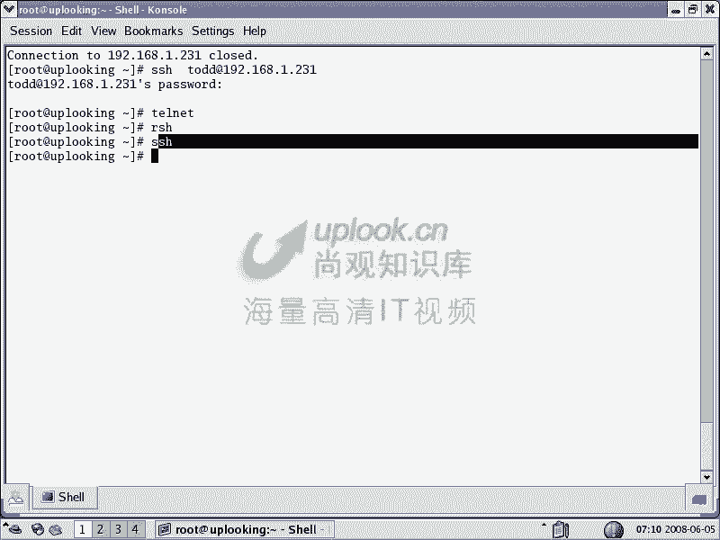
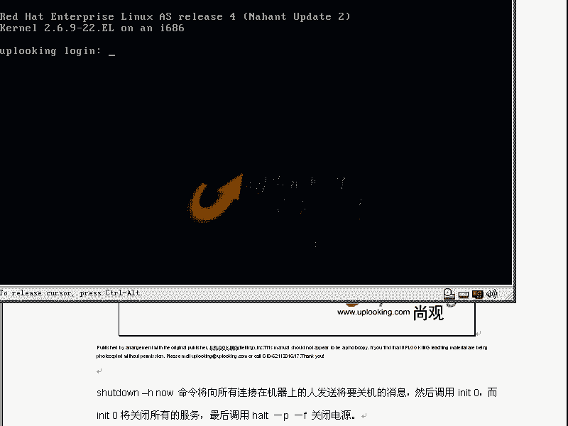
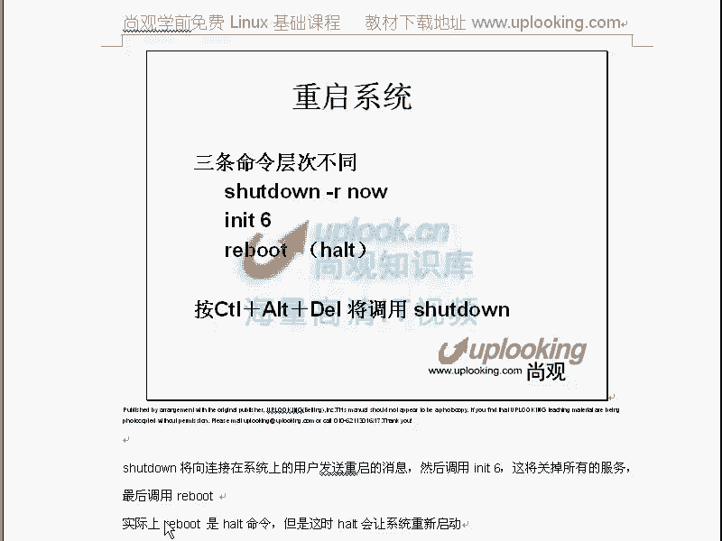

# Linux系统管理：第四章：初级系统管理命令 🖥️

在本章中，我们将学习一系列基础的Linux系统管理命令。这些命令将帮助你收集计算机信息、管理用户、操作文件系统以及执行关机等日常任务。掌握它们是成为一名合格Linux管理员的第一步。

## 查看计算机信息 🖥️

上一节我们介绍了命令行的基本框架，本节中我们来看看如何获取系统的基本信息。了解你的主机名、内核版本和用户身份是进行系统管理和故障排查的基础。

### 主机名与网络配置

`hostname` 命令用于显示或临时设置系统的主机名。

```bash
hostname
```
此命令会显示当前主机名，例如 `uplooking.com`。

若要临时更改主机名，可以使用：
```bash
hostname www.uplooking.com
```
请注意，通过命令进行的更改在系统重启后会失效。

若需永久更改主机名，必须编辑配置文件 `/etc/sysconfig/network` 中的 `HOSTNAME` 项。修改此文件后，需重启系统才能生效。

网络配置也有类似的规则。`ifconfig` 命令用于查看或临时配置网络接口。

```bash
ifconfig
ifconfig eth0 192.168.0.80
```
第一条命令查看网络接口信息，第二条命令将 `eth0` 网卡的IP地址临时改为 `192.168.0.80`。

永久更改IP地址需要编辑网卡配置文件，例如 `/etc/sysconfig/network-scripts/ifcfg-eth0`。更简便的方法是使用 `system-config-network` 或 `nmtui` 等工具进行配置，然后重启网络服务使其生效：
```bash
system-config-network
service network restart
```

### 系统与内核信息

`uname` 命令用于显示系统信息，这在编写跨平台脚本时非常有用。

```bash
uname
uname -a
```
`uname` 显示操作系统名称（如 Linux），`uname -a` 则显示所有可用信息，包括内核版本、主机名和硬件架构等。`uname -r` 专门用于显示内核版本号。

### 用户身份信息

`id` 命令用于显示当前用户的身份信息，包括用户ID（UID）和组ID（GID）。

```bash
id
id -u
id -g
```
`id` 显示完整信息，`id -u` 仅显示UID，`id -g` 仅显示GID。在脚本中，常通过判断UID是否为0来确认是否为root用户。

## 日期、日历与文件类型 📅

在了解了系统基本信息后，我们来看看如何处理日期、日历以及如何确定文件的真实类型。

### 日期与时间

`date` 命令不仅用于显示当前日期和时间，还能以特定格式输出，这在自动化脚本中用于生成带时间戳的文件名非常有用。

```bash
date
date +%m%d
touch `date +%m%d`.log
```
第一条命令显示当前日期时间。第二条命令以“月日”格式输出。第三条命令使用反引号执行`date`命令，并创建一个以当前月日为名称的日志文件（如`0605.log`）。更多格式选项可通过 `man date` 查看。

`cal` 命令用于显示日历。

```bash
cal
cal 2023
```

### 确定文件类型

在Linux中，文件扩展名并不总是可靠的类型标识。`file` 命令可以准确判断文件的真实类型。

```bash
file /bin/ls
file /boot/initrd.img
```
`file` 命令会分析文件内容并返回其类型描述，例如“ELF 64-bit LSB executable”或“gzip compressed data”。

## 挂载与卸载存储设备 💾

文件系统的管理是Linux核心概念之一。与Windows的“盘符”概念不同，Linux使用单一的目录树结构，所有存储设备都需要“挂载”到目录树的某个空目录下才能访问。

### 挂载的基本概念

想象Linux的目录结构是一棵大树（根目录 `/`）。每个硬盘分区、U盘或光盘都是一棵独立的小树。`mount` 命令的作用就是将一棵小树（存储设备）嫁接到大树的某个树枝（空目录）上，从而通过该目录访问设备内容。

### 挂载命令的使用

`mount` 命令的基本格式是 `mount [选项] <设备文件> <挂载点目录>`。

查看当前已挂载的所有设备：
```bash
mount
```

挂载一个硬盘分区（例如 `/dev/sda2`）到 `/mnt` 目录：
```bash
mount /dev/sda2 /mnt
```
执行后，访问 `/mnt` 就相当于访问 `/dev/sda2` 分区的内容。如果 `/mnt` 目录原先有文件，它们会被暂时隐藏，卸载后重新出现。

以下是常见设备的挂载示例：

挂载U盘（假设为 `/dev/sdb1`，文件系统为VFAT）：
```bash
mount -t vfat /dev/sdb1 /mnt
```

挂载光盘：
```bash
mount /dev/cdrom /mnt
# 或指定文件系统类型
mount -t iso9660 /dev/cdrom /mnt
```

挂载Windows共享（CIFS协议）：
```bash
mount -t cifs -o username=yourname //192.168.0.1/share /mnt
```

挂载Linux NFS共享：
```bash
mount -t nfs 192.168.0.254:/shared/path /mnt
```

挂载ISO镜像文件：
```bash
mount -t iso9660 -o loop /path/to/image.iso /mnt
```

### 卸载设备

使用完设备后，必须卸载才能安全移除。`umount` 命令用于卸载。

```bash
umount /mnt
# 或通过设备文件卸载
umount /dev/sdb1
```
**重要提示**：执行卸载时，不能正处在挂载点目录或其子目录中，也不能有程序正在访问该目录下的文件，否则会提示“设备忙”。

## 磁盘空间管理与用户切换 💽

管理磁盘空间和在不同用户身份间切换是系统管理员的日常工作。

### 查看磁盘使用情况

`df` 命令用于报告文件系统的磁盘空间使用情况。

```bash
df
df -h
```
`df` 显示所有已挂载文件系统的使用量（以KB为单位）。`df -h` 以人类易读的格式（如G、M）显示。

`du` 命令用于估算文件和目录占用的磁盘空间。

```bash
du /home
du -sh /home
```
`du /home` 会递归显示`/home`下每个子目录的大小。`du -sh /home` 中的 `-s` 表示汇总只显示总大小，`-h` 表示人类易读格式。与 `ls -l` 显示的文件逻辑大小不同，`du` 显示的是实际占用的磁盘块空间。

### 切换用户

`su` 命令用于切换用户身份。

```bash
su username        # 切换到指定用户，环境变量不变
su - username      # 切换到指定用户，并加载该用户的完整环境
```
从切换后的用户退回原用户，使用 `exit` 命令。只有登录Shell（即首次登录时启动的Shell）才能使用 `logout` 命令退出。

### 远程登录

`ssh` 命令用于安全地远程登录到另一台Linux主机。

```bash
ssh 192.168.1.100          # 以当前用户名登录
ssh username@192.168.1.100 # 以指定用户名登录
```
登录后，使用 `exit` 命令可断开连接并返回本地Shell。

## 关机与重启 ⏏️

正确地关闭或重启系统对于保护数据和文件系统完整性至关重要。

Linux提供了不同层次的关机命令：
*   `shutdown`：最安全、最规范的命令。它可以安排关机时间并向所有用户发送警告信息。
*   `init`：直接改变系统运行级别。运行级别0为关机，6为重启。
*   `halt` / `poweroff`：较低级别的命令，直接关闭系统或切断电源。

常用命令示例：

立即关机：
```bash
shutdown -h now
# 或
init 0
```

立即重启：
```bash
shutdown -r now
# 或
init 6
# 或
reboot
```



计划在指定时间关机（如20:00）：
```bash
shutdown -h 20:00
```



**注意**：在多人使用的系统中，应优先使用 `shutdown` 命令并提前通知用户。

---



本节课中我们一起学习了Linux初级系统管理命令。我们掌握了如何查看和设置系统信息（主机名、内核版本、用户ID），使用 `date` 和 `cal` 处理时间，用 `file` 判断文件类型。深入理解了Linux独特的文件系统挂载机制，并学会了挂载各种设备（硬盘、U盘、光盘、网络共享）。最后，我们还学习了如何查看磁盘空间（`df`, `du`）、切换用户（`su`）、远程登录（`ssh`）以及安全地关机重启（`shutdown`）。这些命令是进行日常系统维护和管理的基石，请务必通过实践熟练掌握。