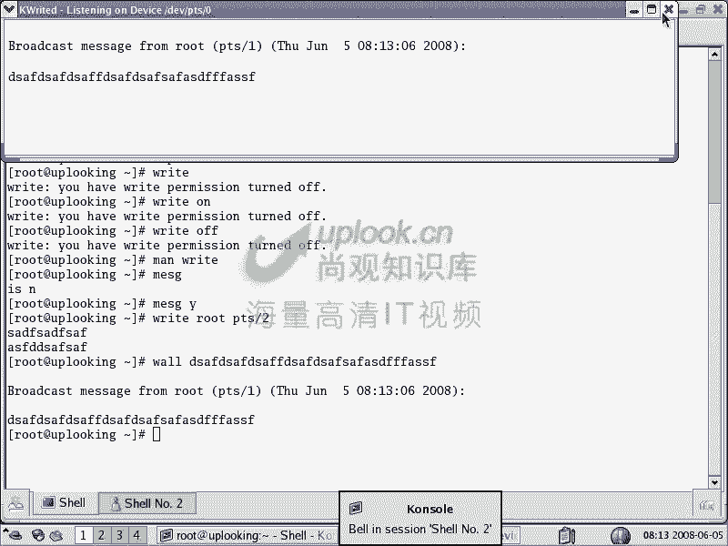
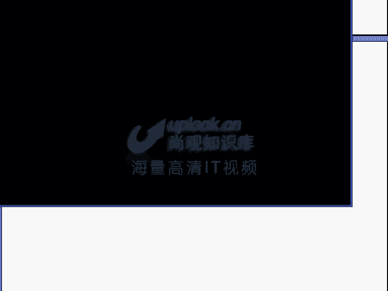
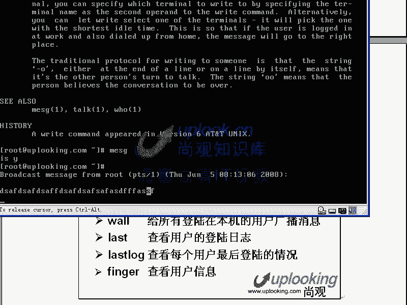
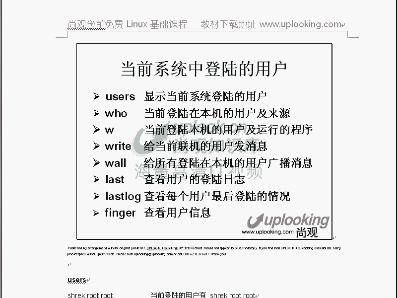

# 尚观Linux视频教程RHCE 精品课程 - P12：RH033-ULE112-05-用户及组管理初步 - 爱笑的程序狗 - BV1ax411o7VD

好，我们开始呢第五章linux系统用户和组织管理。在这里面的话呢，我们把前面讲过的00碎碎的一些用户啊，组的这样一些命令，还有配置文件呢给大家拿出来，单独筛一遍啊，就是说。就是权限用户啊这样的一些东西。

那么拿过来汇总一下，明白吧？明白，还是跟小芳啊，还是跟小芳。那么小方如果回答不出来我们问题的话呢，会被呃我们我们的话上方的话有个规矩啊，就是说如果反复强调的问题，如果要是答答的有问题的话。

他会做俯卧撑的啊，最终的话呢我们可能呃怎么解恨呢？老师怎么解恨呢？就是说吊起来打啊，吊起来打，开个玩笑，就是说我们可能上官的话让大家做俯卧撑，这是紧常的事。就是犯一个非常愚蠢的错误的时候啊，我。😊。

那么第五章的话呢，系统学习一下呢，用户和组的这样一些东西，包括配置文件还有命令汇总一下。那么比方说新建用户组的命令这个我们都讲过了，用户和密码有关的文件啊，用户信息的管理啊，组文件啊，当前用户的状态。

用户交互工具的使用等等。O现在我们看首先的话新建和删除一个用户及组，那很简单，user艾是添加用户是吧？对，userDL删除用户是吧？他做的是改用户的密码是吧？对，那么group艾呢。今天用户组吧嗯。

那groupDL呢删除。G趴座了，改组个密码，你组还要密码啊，确实用的非常少，没什么意义啊。我现在给大家说一下，这个原来都给大家讲过，所以这个地方非常轻松了，是吧？嗯嗯，那么在这里面你看。😊。

我们运行一个consil啊。OK在这里面user添加一个账号的时候，usered添加一个名字叫名账号是吧？对，然后呢你要想删除它的时候，userDEL是吧？删除是，但是呢你删除的时候。

它不会把它的主目删除掉。user实际上是这样的，他们会首先的话呢去自己去改 passwordsword，在这里面添加你的用户的属性，然后呢再去改什么呢？他还会去去改ETC下的什么呢？shadow。

那么他还会去改什么呢？就说在用paword里面的话，它会添加我们名叫s用户是吧？对，然后呢添加一个s组，shack的组的话是在ETC下的什么group。也就是说一个你的衰客组同时生成。

那用户的密码的话是放在sow文件里面，对不对？ET4的sle是吧？对，那么组的话还是组的密码，组的密码放在哪呢？就组的一些属性的话是Gshaow当中。谁摔到的不中。啊，在这里面的话是组的密码。

也就是说格子呃。呃，组的密码放到ge shadow，那么用户的密码放在sle文件里面。你认为四个文件的话，首先呢你U add的时候它都会动。因为你创建一个名字叫s用户，是不是有个名叫s组同时出现。

对对吧？所以的话组的文件也要动。同时的话呢它会去怎么样创建啊，同时的话呢它会创建。makeR创建一个home下的什么shack。明白吧？然后呢把这个文件夹里面呃。

再去copy把呃ETC下面的SKEL是吧？当中的所有的隐含文件，你点开它的隐含文件全部都copy到哪去呢？co包括文件夹文件和文件夹全部都copy到这个目录下的相应的什么，然home下的sh啊。

这里面去嗯明白吧？明白全部都拷不过去。然后呢，同时的话再怎么样CHMOD把它的优者啊CHOWN把它的CO当中是把文件的优者和用有组都改变的。

这样个命令杠大R是把把这个这个文件夹本身和这个文件夹下面的所有的文件和文件夹，子文件夹全都改变杠大R明白吗？明白递归的去改。

所有的那么把它的文件夹和文件的文件夹当中的文件所有的这些子文件夹文件全部都改成什么呢？改成这样的。明白吗？明白，那他还会做这步。所以的话你现在看UC2的添加完以后的话，他实际上做这么多工作。好不好玩啊。

然后你们看啊。😊，可以新建一个。那么我们先看VRETC下载paword的这个文件。pass这个文件的话，那么这个文件的话，我们详详细细的没有给大家没有给大家详细细细讲过。

那比方说shack这个账号添加上去以后，shack是吧？对，就是它的名字。名字呢它这个eux里面的这个文件文本文件，它的分割符是以冒号作为分割符。ote里面用什么作为分的符？是啊封号可能多一点。

但是呢一般大家好像也不太关心为什么，因为你很少用得到。你去双击就完了，他管他什么分割符不分号符。所以你一看这个文件乱，那么它是以分号作为分割符啊，冒号作为分割符。那么前面的话，你就是用户的登录名是吧？

后面这个地方呢本应该是密码，本来应该是密码，结果呢。不是密码，是一个XX表示什么呢？X表示它有密码，有密码本应该在这儿。但是现在我们是不是启用了shadow啊，嗯，停shaow文件是吧？

那密码是不是放在shaow文件里面去了。对，那这个地方就是X。但是如果要你把这个X删除掉，没有把这个地方的X删除掉。这两个冒号之间是不是没有X了？对啊，没有X了以后啊，这两个冒号当中没有X了以后。

那这时候呢这个用户登录的时候就不需要输入密码了。嗯，明白吧？明白啊，那么接下来这个地方是什么？往一下U啊，那么接下来这个500套表是什么？他的UID等500。啊，也就是他的身份证号码是500是吧？对。

那么组ID的话，就是他的这个他是哪个档的呢？啊，他这个党的这个组ID的话是呃501，明白吧？明白，那么这两个冒号之间没有东西，这两个冒号当中没有东西的话呢，一般是放这个用户的一个全名。

也就是这个用户的一个注释，一般这个地方你比方说这个这个账号是吧？这个账号呢，它就说这个账号是一个什么什么什么什么账号，对不对？它是不是它的一个说明啊，对啊，也就是说你这个账号这账号的说明是没有的。

所以这两个冒号之间没有东西，对不对？对啊，这两个冒号当中没有东西，然后呢，接下来的话。😊，接下来的话呢，我们看一下，就是说假如说。假如说呃你在这里面看到的就是说这样的一个用户的属于就是这个注释是没有的。

然后呢，这个地方呢是用户的逐目是吧？对，就这个用户登录进来以后呢，它在哪个地方？然后呢，接下来这边的话呢，是这个用户登录进来以后呢，他的这个shall是什么时？能 loging能 loging的话呢。

就是让他不允许登录了，是不是？我们给大家讲过，就是说让他呢没有呃，就是登录进来以后，他原本应该打开B shell是吧？嗯，bsh对，这是他的 shell要。结果呢让他S并态的能 loging。

那这样他直接这个账号进行完这个程序以后直接就退出了呀。明白我的意思吗？明白，那这样的话，这个账号能不能登录进系统不可能啊，所以的话最终1账号是登录不了系统的。所以一般来说，正常的账号的话是什么？

并且的bash。明白吗？明白你刚才被我乱改过了啊，所以这样的保存退出了以后，你就看到us add添加一个sha账号以后，它呢默认情况下第一个系统你自己添加账号是由500开始的。

主ID和UID都是由500开始的。那么500之前的话是系统原本自动添加的这些账号，对不对？对，那么这时候呢500开始的是你第一个自己添加账号。那么500，然后呢，它的UID呃GID默认也应该是500。

然后他的这个主屋，然后还有他的登录的ll啊，这边的话清楚了吗？明白啊，用户的名字，它原本密码应该放在X表示它有密码，但是放在另外一个地方是吧？对，然后呢接下来的话还有什么呢？还有它的那个呃接下来的话呢。

还有它的一个UID啊，这个呢就是我们的这个ETC下的password这个文件。这个文件呢，我们反反复复打开过很多次是吧？然后呢，这边的话我这样呢退出啊，Q呃WQ是吧？对退出。就是这个文件。

那么刚才说呢系统当中还有一个比较神秘的文件，就是sll掉这个文件。sll掉这个文件的话是放用户的呃就是说密码的。所以呢它比较的让人感觉神秘。那么你可以看到shaft账号的密码，它就放在这个地方。

看到了吗？shack账号的密码放在这个地方。嗯嗯，那么这个密码的话是这样shack账号它呢第二个地方就是它的密码。但是这个密码的话呢，是MD5加密过以后的密码。你可能在接触windows的时候。

你可能说哎这个密码的话难道就摆在这边就完事了吗？但实际上呢，在linux里面的话呢，密码就是用户的密码系统的密码，它是以MD5的加密的形式保存在这个里面。也就是任何人都可以看到。

但是呢你想知道这密码是什么，不可能。啊，因为它是什么呢？单向加密嗯啊单项加密怎么回事呢？我现在啊，给你的数密码是123是吧？我告诉你个加密算法，这个算法算完以后，你12三变成什么一串值。

那这串值放在那个地方，它是不能反推回来的。不能推回它的密码为123，也就是这串值放到那个地方以后，我告诉你把这个值放到这边。那么当我代再输入告诉你密码123时候，你是不是也知道那个预算值啊？对啊。

那就后你把那个预算算法再算一遍，然后算过来以后，这两个值如果是相等的，你就知道了哦，原来你的密码输入的是对的是吧？对，所以当系统的话每次呢都是把你输入的密码进行MD5求和过以后的话，算出来值一模一样。

okK他认为你输入的密码是对的。明白吗？白，所以这是MD5求和过以后的密码。这个地方这两个冒号之间加，那么一般来说呢，这两个doller符号之间的话呢是一个呃阈值。

也就是说呢这两个包doller的这个东西呢不算是密码当中的一部分。密码的话呢是从第二个dollar这边开始，这边的话是求和过以后的密码，明白吧？明白吗？嗯，那么这边的话呢是一个值。

这边的话是一个unix time。什么叫unix time？我们知道unix系统出来是1970年左右开发出来是吧？对，所以的话所有的unix的话呢，以unix呃诞生之日，就是1970年1月1日作为元年。

就是第一天啊，就是unix诞生的第一天。那么第1月1号就是11月2号就是21月3号3是吧？那么到今天的话有多少天，这就是unix time。所以呢这个值的话是一个天数。

就是从1970年1月1日开始到现在的话，要多少天啊，那把手指头、脚指头全搬上去，你也不知道是哪一年是不是？对，所以他非常的头疼，所以in为 time的话，一般呢它这样子保存下来。但是呢你要换算的时候呢。

一般人正常的人类是没有办法换算的。那么你让程序的话去换算一下就可以了。所以呢这个是一个时间。但是呢大家可能一般用的比较少。这个这个零的话是什么呢？这个零的话呢是呃这个零的话呢是表示密码的最短历史。

就是我设置完密码以后，立刻就可以再次更改密码。如果一的话，就是说我一天之后才可以更改密码，明白吗？明白密码最短历史密码最长历史最长历史是99999。那也就是说你的密码能用多长时间？9万多天嗯啊。

9万多天是什么概念呢？大家可以想想算一算啊，假如说你能活100岁的话，一年有365天是吧？有的时候366天是吧？那么在你有生之年啊啊，3万多天，对不对？所以话呢99999表示呢。

说你这一天设置的密码是吧？加99999以后才过期。明道吗？那我如果改成30的话，是不是这天试置完密码，30天之后就过期了。嗯啊，清楚吗？明白嗯，所以的话呢这个地方的话相当于密码永不过期。听楚了吗？

明白这个期的话呢，是密码过去先多少先通知你。头疼吧，这个东西是不是不清楚啊，晕吧啊，但是呢你这些东西呢可以不记住啊，但是你知道跟密码的历史有关。那么但是呢最后一个地方他一定要记住。

也就最后两个冒号之间夹的这个地方，它也是个unix time，如果输入只是一的话啊，如果输入的是一的话，那表示你表示197年1月1号这个账号就被禁用了。也这个账号禁用的unix time。明白了明白。

就这个时候197年1月1号这个账号就已经禁入了。所以呢这个地方你一定要知道，其他的你可以不知道，但是这个地方一定知道，明白了吗？明白嗯，好，我们现在呢给大家说完了这个东西。

然后呢呃也告诉大家整个的这个呃所有文件是怎么回事了。那么因为呢MD5是一种工业上的单向加密的算法。这个算法算出来以后，保存在这个地方，那么你是不能反推回来的，因为单向加密，单向加密，就是加密完以后的话。

很难去理论上反推回来。MD5。这种加速算法。那么我们知道每年的话呢，就是说原来啊就是他已经被中国的山东大学的数学系的王晓云教授啊破解掉了。呃，我们觉得非常强，确实是一个非常厉害的呃女就是女人啊。

那么她非常厉害。有非常厉害。那个他呢可以把我们他呢就是直接让这个MD5的破解大会的话，每年不用召开了，就你们就到此结束了。啊，这个非常有意思。大家可以看到那个新闻，那么2005年的时候。

我记得那么这个M这个王晓云的话呢，他破解完这个以后，但是并不是说你可以根据计算值反推回来密码多少，而是他可以碰算一个配碰撞什么碰撞呢？就是说我1234123可以达到得到这个密码是吧？

同时呢我可以算出有另外一个值也可以达到这个值。算完以后也可以达到这值，明白吗？明白啊，所以他们算一碰撞，它并不是根据这串值的话呢，能给你把那个东西反馈回来，明白吗？对啊，OK这就是sha文件啊。好。

现在我们退出这个文件。那就是shack文件是吧？对，组文件VIETC下的group这个文件的话呢就是组文件。组文件的话呢，里面记录着组和组ID。一般说你添加一个名叫shack的组是吧？

这里面的话就有shack的组，然后呢，shack组的ID在里边。最后一个冒号这个后面的话呢是跟这个组的成员。你比方说我在shack这个地方有另外一个账号，另外一个人的话是属于shack这个组。

那么TODD我添加上去。嗯，明白吗？这样的话呢，你直接改，就相当于把这个用户加入到这个组里面了，你不用输入命令也可以，你直接改这个文件是没有问题的。明白吗？明白啊。

那么这时候的话呃把一个人加入到这个组清除呃方便不方便啊，方便，那么假如说呢我在这里面啊，这里面我要提一个概念，就是说在这里面的话，假如说呃如册用户是属于如册组的是吧？用。😊，逗号分割开。

等于把1个用户也添加上来是吧？再把比方TODD也添加上来，让这些账号属于这个组在lininux里面的话，你觉得他们是不是管理员？是是是吧？那么这是一般人的理解。

就是所有的搞unux呃搞那个windows的这个关理员头都会觉得是什么？是这么回事，但实质上不是大家一定要记住啊，linux里面只区分两种用户，一种用户呢是UID为零的。

另外一种用户呢是UID不为零的那我问shiftf账号，它的UID为0吗？对是500是吧？对。所以他永远他不管加入到哪个组，他都不是管联啊。啊，windows里面为什么那样呢？

因为windows的权限都是给组的那你加入这个组了以后是不是就具有相应权限？对，但是linux里面呢它是什么，他就看你UIDUID不为0，你就是什么平民百姓UID为零了，你才是什么管理员。

明白我的意思吗？明白啊，所以的话呢你把它加入到如的组一点用都没有，只是说呢他对某些文件的访问权限并变大了。嗯，明白吗？明白，所以加入到组没有用，你会现在小芳你会把一个用户加入到组吗？会然后呢呃加入到组。

你可以直接改这个文件就好了是吧？对，那好保存就退出。那么用的最少的话就是什么呢？ETC下的什么直一sow，直接shaow这个文件呢基本上没怎么用过啊，这这实际上是保存用呃，就是组的密码的。

这个呃一般很少用，我是很少用。但是呢它确是我们用户和组必须的一个文件，你要这个文件不存在的话是不行的，明白吗？明白。所以现在的话这四个文件搞清楚了，我们添加一个用户以后。

这个用户的这些属性和组的属性基本上保存在这四个文件里面。那我想问一下，如果你创建了两个机器，这个机器呢装完了以后，你要把这个机器里面的所有的用户和密码全部都移到另外一个机器上，你该怎么办？

这个机器里面有很多用户是吧？500个用户那台机器刚装完，你先把这500个用户全部清移过来，怎么办？那是用户没个密码的话都一样，怎么办？直接把那个配置文配置文件复制过去。对呀，这不就很聪明嘛？是吧？

小方的话呢一直都是嗯就是说比较腼腆啊，然后呢不善于出这种狠招啊。然后实际上就复制过去就完了。你把这四个文件从一台机像复制到另外一个台另外一台机像，O看那么所有的用户名和密码的话，就全部都复制过去了。嗯。

方便不方便方便。所以的话呢在Ldux里面，这点的话非常非常的呃就是说一切就基都基于文件嘛，你只要把文件同步了就行了，是吧？那么你如果复制过去的话，是不是还应该把什么啊。把home目录复制过去啊。

home目录里面的所有文件是吧对复制到什么呢？另外一个机器上是吧？对，另外一台机啊，然你可以用 copy copypy就用H你可以把这个目后目录下的所有的复制到什么？118这是你要迁移过去的那个地方吧？

它也复制到那个那台机器的目录用这个命令就可以直接复制过去，是不是你这个后目录下的所有的文件文件夹全部都复制过去了那这样大家的主路是不也复制过去了那两台机器上这些用户登录的时候就一模一样，明吗？明白。

所以话你就相当于发生了一次迁移，所以切接文件连就是你说系统里面什么最机密，用证明和密码最机密啊，然后这种东西话复制一下就完了。

所以你说linux是不是特别简单所以很多人就喜欢linux这一点你给我复制看试试看头啊然后又有什么这太复杂了，而且。😊，他对你是不公开的，这点是非常讨厌的。但在linux里面所有的东西该怎么去编。

怎么去设置的算法都非常清楚。但windows里面呢全部都是由微软给你包装好了以后呢给你看所以呢一个不懂linux的人，他会直接说什么windows不好不好不好。

实际上windows在这里面做了极大的努力。那么你会发觉linux的权限跟它相比的话是非常的原始的一个东西啊，windows的话呢，它之所以那么容易出错，是因为它实在编的东西太多了，明白吗？明白啊。

那么linux的话简单到简陋的程度，可以说简单到简陋的程度。这个的话给大家说完了，然后回头大家再看，那么实质上呢他们是改这四个文件，添加一个账号以后，它实际上是改了这四个文件是吧？

在这四个文件里面的话都添加了一个用户是吧？前两个的话添加用户的属性是不是？后两个的话是这个用户的组的属性是不是？那么这个添加用。属性的时候呢，还是要一个配置文件，就这个配置文件。那么刚才我们看一下啊。

就说还有啊。ETC下的pa售。当中的这个I要他做了。那我们看这个用户的话是不是都有他们的主目是吧？对他们打开的sell，是不是？然后呢呃筛到文件里面的话，这是用户的属性嘛？另外一部分是吧？

筛到文件里面的话，都有他们什么呢？最短密码历史，最长密码历史等等这些东西。那这个属性呢有一些默认的值。你刚说你创建的用户的话，你想让他的呃默认的密码，最长可以用30天该怎么办？

那你可以改另外一个配置文件。也就是说呢在这四个配置文件里面，那么他们的那个那两个跟用户相关的这个两个配置文件的默认的这个值可以在这里面看VIETC下面的什么呢？loing。点DEFS。嗯。

然后用点DFS在这里面打开以后，你可以看到啊，OK最短的就是呃UID的话，我从哪块开呃，就是说从这个这样看嘛，最长密码历史是9900999是吧？对，然后呢最短密码是零是吧？然后呢，密码最短长度是5字符。

然后呢，你的呃就是说如果要是密码要过期的，过期前多少天警告你是吧？这几个值是不是都可以改。对，然后呢还有就是说你的UID最大值和最小值组ID最大值和最小值都在这里面改。你啱咯，明咩。

这就是我们的这个配置文件啊，就是我们的。EP点DEFS啊它是决定我们创建用户的一个默认属性的。嗯，以后我们讲课都是这样讲，大家得慢慢熟悉。那么在windows里面你可能是非常形象的啊。

大家跟我点这个地方，点那个地方，点这个地方点那个那如果要是我们在这里面啊，我教大家你看啊在linows里面学的时候，千万一定要学什么呢？命令好，千万不要去学什么图形，我看到这个这本书好不好？

你一看这个书里面有大面积的什么那个教你什么这个linux下这个图形该怎么操作，那你就不要看了，这本书的话成功蒙事windows会的，你你还用去学那个东西吗？这东西谁不会。

谁不知道点一下这个东西干这个东啊，我要系统管理是吧？我现在系统管理。那你比方说用户的这个什么管理啊等等这些东西，你点一下不就完了吗。所有这的操作都可以在这里面几点。只要认得什么单词就可以了。

所以呢没什么好学的。那么一般学的话呢，就是学这些配置文件。那么因为那些管理也都是基于这些配置文件来的。对吧那我现在问你，你用什么样的图形工具，把我的这个机器上所有的用户名和密码全部都移到另外一台机器。

怎么移样？不说了。小芳，你知道吗？呃，可能是有的，应该是有的，但是我不知道，为什么我不知道，因为他呢我一般直接去改配置文件就好了。所以我学的是最根本的，是不是？对，那你如果要是学这种工具的话。

你的一些需求你是没有办法搞定的。然后呢，还有最大的一个问题，你现在用的是莱泰的系统是吧？HL4是吧？HL5是不是有些变化？对苏usi跟他是不是又不一样？你到时候你到底学哪种？啊。

我告诉你linux的版本就是什么十七八种，是不是？对，十七八种这种版本，那你用起来的话感觉很舒服吗？那选要一种，再选一种，再选一种，你精通数十个reux的呃图形界面，你就是可笑不可笑。

所以最根本的知识大家一定要知道，明白了吧？😊，好，那么呃我这边给给大家教个技巧，你只要看到这本书里面教你什么呢？在图形界面下用各种图形工具。那么一般来说这本书的话基本上没什么价值，没事了。啊，好。

我们再看。那么再回归回来再看。😊，就是刚才我们新加用户嘛，是吧？创建用户他做了改密码是吧？这个我们呢原来讲过了，那么删除用户的时候呢，删除用户的时候呢，这边有一点删除用户的时候，你要呃就是说你user。

DL删除用户是吧，那删除，但是呢它的主目录并不会被删除。他的email并不会是被删除，明白吗？明白那么如果要是你删除用户想彻底删除一个用户的时候呢，你可以用userL杠R参数。

把这个用户的主目录和email一并全部都删除掉，听了吗？明白啊，这就是用户的T用户删除用户是吧？那么group相对来说好说一点。那么如果要是改用户的属性的话。

就是user mode改用户的属性user mode你直接回车就可以看看他能干嘛user mode你可以把一个用户的什么啊，杠P错改他的 pass错是吧？改他的过期时间是吧？

然后呢让他属于某一个组某属于某些组，然后呢改这个用户的组ID改这个用户的UID改这个用户的主目录，明白吗？明白那他可以用us mode来改那么是用命令的方式，那么问小芳，如果要你不知道这个命令的话。

该怎么了。咩。呃，不知道明令嗯。我让你改这个用户的瞩目该怎么改？小王一会被会被我打死了，好几不是重新加代，你去直接VI这个ET32pasword不就完了吗？啊，VI这个文件不是改一下不就完了吗？对。

那你是优卖那是干什么的？😡，他就是改这些配置文件的呀。对不对？他只不过是用命令行的方法去改，对不对？嗯，你说呢对。小芳早晚要被我打死了，所又再说一遍，盯着咣，然后我们上去。然后呢。开个玩笑啊开个玩笑。

那小方的话呢，可能一开始接触这个系统的话呢，可能就是有很多感触的话，是跟普通的这个呃刚刚接触linux人的话是一样的，是吧？嗯有时候感觉不知道该怎么做啊，就是说稀里糊涂的，但实际上你只要勇敢的去做。

然后呢勇于证实自己的想法。那你学的肯定不会太差，千万不要局限在什么图形界面上。那么这是user modeuser DLuser add是吧？还要改用户的密码的话，怕错的，对不对？对，这一串就出来了是吧？

那么现在的话我想我想问一下大家，你怎么样把这个用户指定到多个组。就是这样的user node现在呢杠大G，你想让用户到如他组群，对不对？还是让shop用户到定组群，对吧？

还要让shop用户到什么套组去让用户，那么这样的话呢，干大G参数，你要会这个命令。为什么呢？因为你经常呢在ll编程的时候，可能用一个命令来执行这个你不可能直接去VIVI是不是需要你交互的呀，对，对不对？

VI是不是你需要你呃一步一步去改保存退出是吧？对，但是如果半业每天半页的话，或者说每一次自动执行的时候，你要说你是原泰的公司的人，然后呢，你需要创建一个账号在那个客户机上，那么你装这个客户的。

就装你们公司产品的客户的话，可能有1000个。然后呢，你到1000个机器上，你每一个都去VI一下嘛，肯定不行，是吧？所以你可能就是要脚本自动去做做，是不是？对，那么这样的话呢。

就可以让shap这账号属于root账号，就属于root组，属于并组，属于top组。那么现在如果要是我再这样，我再给它改呃，就是说我改我还没回撤啊。那么现在我刚才那个改完了以后。

我们看group里面是不是这样。这里面是不是有个sck，对，是吧？然后呢，这个地方是不是有个sh，对对吧？那么套着这个地方是不是还有个sck卡，对，对不对？是吧？嗯，它属于这三个组啊。对。

那么我可以输入IDshack。然后呢，你可以看shack账号的话呢，是属于这三个组的，看到了吗嗯。😊，知道吗？对，那么如果要是我这样的。杠G然后呢，我我换一下变成什么呢？mycyclcle啊括号。

然后再变成一个什么呢？呃，比方说嗯。TPT啊属于这两个组直接回车。那你说我这样做完了以后会怎么样？mys和TPT，然后。有是吧？对那其他的呢如 big还有呢，其他的也也在也在是吧？对，这是一般人的想法。

所以这个时候他你会看见他从这那三个组当中脱离出来，你要干大致的话，并不是把它加入到什么组，而是指定到什么组。比如你又指定了两个组，那他就使用，他就只属于这两个组，不属于那其他三个组了，明白吧？明白啊。

所以他会比较变态啊，这种这种呃命令，所以他呢你要呃就有个心理准备，这是一个习惯用法，这是一个经验啊，我因为原来的话找个到，所以的话我就跟大家说一下，那么这是用户那么组的话很简单啊，哎是吧对啊。

group DEL是吧？对，那么如果改自己的命改组的密码，G pass谁会改组的密码，很很少有人去改。那么组的密码的话，一般是用来切换当前组的时候能用啊，但是呃所以组的密码很少用，而且就是意也不太大。

那么G pass他干什么用呢？他有一个命令的话呢，它非常有用。就是我们刚才的话是不是把一个用户是吧？sha这用户账号属于多个组是吧？对，现在假如说我有一个组，我想让多个用户加入到这一个组去怎么样怎么办？

你可以用什么呢？G pass错G pass，然后呢，这边可以用加上一个什么杠大M然后呢把用户是吧，逗号TODD是吧？逗号。😊，TPT是吧，加入到什么呢？如特组去这样一回撤完以后，然后你再去看。

VIETC下的group。那么这个时候他我们再看下面。在这边是不是TT套shack账号账号都在这里面了，对对不对？对。那么这样的话就是把多个用户啊，把多个用户指定到一个组，就是说给他加入到一个组去。

而上面的话是什么？把一个用户加到多个组，嗯，对不对？对，但这两个的话在1要编程的时候呢会用的比较多一点。在1要编程的时候用的比较多，明白吗？明白，你要是改我的组ID会怎么样？

组 IDD跟那个属于多个组完全两码事。一个用户只有一个组ID明白吗？那这个组 IDD的话，我想切换的时候，是不是用user。mod是吧？对，当这一命令是不是可以签这个用户的组ID啊，对，对吧？

所以呢这就是用户和组的一些操作。同时的话呢结合了一些什么呢？一般的一些基本的技巧和我们的一些习惯。就是说呃我做了一些呃什么操作是吧？就是说一些呃经验的话教给大家。然后呢，这是。

user相关的命令汇总useruser modeuserD啊paswordSU70人工对不对？对，然后EXI退出刚才那个用户的视项，是不是？对，然后呢，这边是组呃，这是用户的配置文件，插lesha是吧？

group直 shadowle是吧？对，然后呢呃。这里面的话呢，我要给大家说一下呢，有一个技巧啊，就这几个配置文件的话呢，大家可能都原来听说过。但是呢我无意中假如说把这个pas错word删掉了。

或者删掉文件删掉了会怎么样？你用户里面好像什么你这个系统当中什么用户都没了是吧？对，那怎么那咋整啊，咋整啊？😊，小芳咋整？没办法，没办法。那么实际上呢你可以用单用户模式进来，单用模式怎么进的话。

到时候我们会说。那么以单用户模式进来，在系统当中，你看一下ETC下面有怕错的是吧？它实际上有个怕错的，还有个怕错的杠。这个的话呢是对前面的他做了一个什么备份。啊，你可以把这个文件它复复制回来。

然后你把它删掉了以后的话，你再把它复制回来。这样的话它所有的文件是不是就存在了。对，所以它有个备份，那么同样删的文件有没有？也有稍毒文件稿啊。底C下的shadow。是吧对嗯等等。那么这样的话就好了。诶。

这就是我们的这四个文件的话，都有备份。我跟大家说了一下是吧？对，然后再往下看。slllow文件每个地方你还记得sle文件刚才那说的那几样东西吗？他是干什么的，每个地方是干什么的，记不记得记得真的吗？嗯。

我觉得肯定记不住。所以说这个时候你要用man page。那么你说shallow这个文件的话，应该用几号man page。sle不是呃man配不是有编号吗？对，那。5。Sow。明白吧？这边不是第5号。

他告诉你第一个是干什么呢？第二个是干什么？第三个干什么？第四干什么？清楚吧？嗯，所以的话呢。还记得我说那句话吗？高手并不是说什么都知道，而是他可以用最快的方式查找到帮助，对不对？对。

同时他对整个的架构的话非常理解。ok这就是sle文件。然后再有呢就是group相关的文件。然后呢，接下来的话我们再看。这是呢当前系统当中登录的用户。那么我们给大家已经讲过了是吧？对啊，user。

Useer。users你可以看哪些用户登录了是吧？那么users只是显示一个列表，那么后它可以显示东西更多，谁登录在哪个地方？还记得我跟大家说的TTY吧？TTY1嗯，TTY1是什么？第一个控制台是不是？

对啊，T22呢。第二个废话就是。那么PDS杠0呢？虚拟控制台，因为它不是真正的T1Y这种控制台，而是虚拟出来的。现在我是不是在这边打开了摄养，看到了吗？嗯，这个摄养的话就是其中的1个PTS杠级。

也就是我当前是不是也是个笑？对啊，那么我这边的话，我去icle啊啊一串东西输出处进向到什么呢？DV录下的PTS杠2直接回收。那么你猜这个串东西跑哪儿去了？跑这里面去了。看过吗？这个控盘是PTS杠2是吧？

那么这个控盘是什么？PTS杠哎，这这是PTS杠1。那么不信的话，你看一下，我这样吧输出这个PT杠1是不是自己收到了。对，那你当成控制函是不是PTS杠1啊？对，所以的话呢你有一个如它是不是在这边登录啊。

对对吧？这个呢是虚拟控制台，一般来说呢，如果别人从外面访问到你，那么也是PTS如果要是呢别人的话呃，在你本机上的alt加F1以后登录，那就T21是吧？alt加F7的奥加F5登录，那是T25是吧？

那么如果star window以后，X window启动起来以后，打开了这个控制台，那么都是PTS杠明白了吗？明白啊，ok这就非常清楚，然后呢，现在我们再看那么这个清楚了以后。

呃users是显示所有的用户，但是不告诉你他是哪个控台上登录的是吧？对，然后呢后的话显示的东西稍微多一点，对不对？那么登的话显示的东西是最多的，它除了可以告诉你谁在哪个地方登录之外。

还可以告诉你他是从哪登录的。如果有人他从远程登录啊，你要说现在我知道SC去到1921681。231。假如说有人访问我自己是吧？然问我自己那么实也是W是不是我自己是从这个地方登录的。对啊。

那我这时候又占有个空制，看到了吗？PDS杠3看到了吗？嗯啊这时候它显示东西更多。所以呢这个时候你想把呃你想把一个远程登录的人的话Q掉，杀掉的时候该怎么办呢？你可以叫到SQ杠9。PTS杠3看到了？嗯。

直接干掉它。那这时候呢你就直接被远程的话杀掉。那么这边的话是从什么什么时候登录的，然后呢，空闲时间是多长时间啊，然后呢，这边是他们占了CPU的时间，他们运行的所有进程，占了CPU的时间。

那么目前的运行什么命令？都能显示出来嗯。所以呢这三个面呢是一对什么呢？users啊， who是吧？W是不是一对都是干相同作用的，是吧？对，当然W的话用的最多一点，我也经常喜欢使用W。

然后呢再看一下其他的。那么right that r这两个命令的话是发送消息用的。你比方说我们看一下这个地方啊呃。Right。WRITE是吧，re我要写给什么呢？写给PTS杠2上的什么呢？

如的账号来发一个消息。s。嗯だ不了。right right还有个开关呢。开关我命令好，我也忘了。rightite这个命令rightite的话还应该有开开关的。忘了是哪个了。这个不好意思啊。

我可能记还是因为很很久没有用了。那它本身的话还是有一个开关啊，本身还是有开关。那么这个开关的话，决定你可不可以给别人写。呃，这样的就是我刚才查一下的话，这样的man right。

就是我忘了到底跟w相关的命令是哪个了。那么man page还有一个呃比较好的地方，你看man right是吧？然后你到最后去呃，shift加G的话是最后到最后去了以后呢，你可以看到这边有个什么呢？

有一个message。嗯，MESG是吧？对啊，那么这样MESG那么现在是等于N的是吧？那么MESGY那么这样的话呢，我就可以给别人写了。那比方说这个时候的话，我再把原来的命令倒带出来。

我说我要给他写一个东西是吧？直接回车，这时候是不是可以写了对啊。按ctrol加呃cttrol加Dctrl加D的话表示呢键盘输入结束。这串东西呢就写过去了。然后你们再看这边是不是我刚才给他写的东西在这边。

对，所以的话呢呃这里面我们刚好呢把rightite。和MESG那么都说了一下MESG决定着你是否可以给别人写的消息是吧？然后呢，right的话是写给谁。当然了，这个命令号呢用的太少了。

因为你现在可能短信或者什么打电话就可以了，是吧？但是呢你想一下，你和你的同事同时连接在一个服务器上，他在上海出差，你在北京是吧？你说告诉他哎你 stop不要给我断那个东西，我现在正在配置什么呢？是吧？

你怎么告诉他。打个电话过去浪费了，随以他你可以wr。你说呢啊please是吧？do not是吧？touch the呃 database是吧？对。么我正在干什么什么东西，你再写给他。那么所以非常简单。

大家明白了吗？messages表示呢你可以写信给别人啊，messageN表示你不能写，刚开始是不是就不能写啊？对，他说permission denied是吧。

permission turn turn off，然后呢，right写的时候呢，一旦你外以后，你就可以给别人写，先写对方的用户名，再写他在哪个空台上，这样的话就可以发消息给他。嗯。

那么有人时候你说哎大家在一块工作，突然着火了，是不是大家赶快谈啊，啊。是吧啊s in后是吧？这是这个CS那么说啊发上创消息说大家赶快逃啊，所有人赶快逃，发给所有连接在这个机上的人。那么W啊。

那么这时候呢，所有人的话都可以收到这个消息。😊。

明白了吗？明白，那么包括呢什么呢？控台上的，比方说呃控台上的人，他也会收到这个消息，看到了吗？嗯。

有消息收到了吧。对啊，所以呢所有空难上登录上的人的话都能收到这消息。所以呢在有紧急时候紧急事情的时候的话，你可以说一个W2。

啊，那么这个是一个三个命令了是吧？对，rightite MESG是吧，还有个是什么WR跟别人交互的，好玩吧。我你再看。再看还有呢就是我们的这边啊就是查找查看用户的登录日志，这个是非常关键的啊。

你的机器被黑了，你都不知道谁黑的。如来老把机器关掉，怎么回事，谁关呢？last可以看last的话直接呢可以看到谁登录了你系统什么时间登录到你系统，它它最后的话呢呃就是说它来选源于哪个地方，是不是？

它可以显示出来，那么last log它显示的东西呢？是另外一套，就是说每一个用户最后一次登录的时间。😊，嗯，对吧？对，那么还有什么呢？

还有就是说我们的finderfinnder的话呢是呃看某一个用户呢最近一次登录。然后呢，他的email，他的计划任务，然后呢，他的主目等等。他这些消息他是看某用户的。清楚吗，原来。好，非常简单啊。

那么我们可以说一下你的系统的话，如果要是遭到入侵了，可疑遭到入侵了。水果的器关了。断掉呢，还是说有人登录上来，哎，我的机器怎么会呃这个配角文件变了，是不是有人登录过来，你不应该用lasts对啊。

lastst dog，你说哎我现在系统能到500个账号。😊，在这么昨天晚上谁登录服务器了，不知道是吧？lastlog你能一块一下看得出来。对是吧？last day大家也能看出来。然后呢。

随最后一次登录是什么什么时间，lastlog可以看每个人做登录情况，figer是查某个用户的计划任务啊啊，他有什么e院啊等等，全都能查看，这就这样。好，那么这节课的话我们就讲完了。

我们一会儿的话会开以后的话开始第一章的学习啊。好，那大家呢可以自己的话去对照原目刚才的这个内容的话呢，重新啊去听一下，或者仔细去研究一下。好好，就这样。

