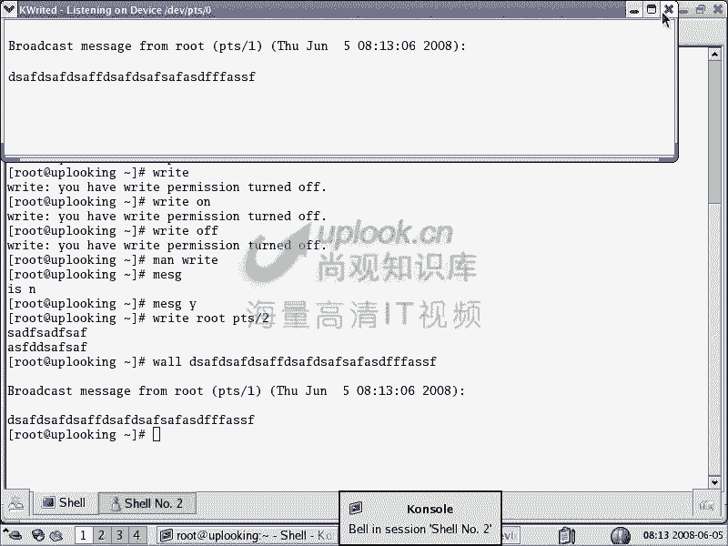
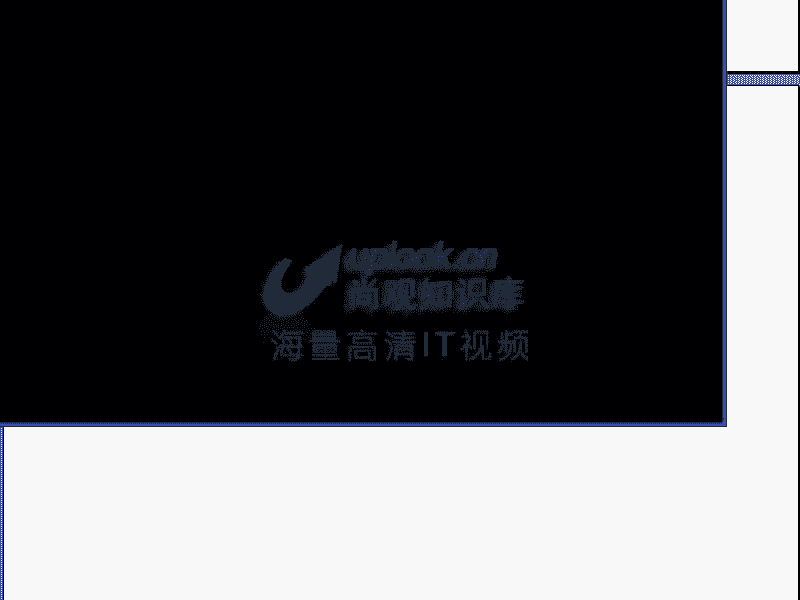
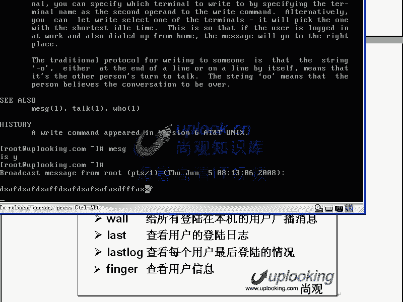
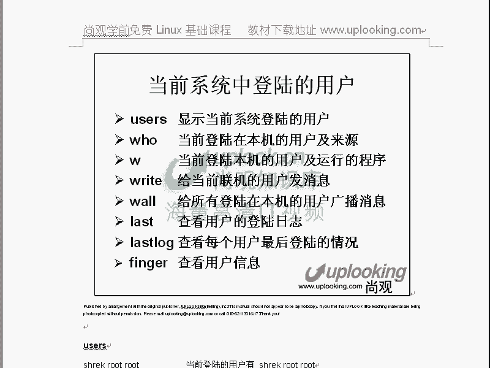

# Linux用户与组管理：P12：RH033-ULE112-05：用户及组管理初步 🧑‍💻

在本节课中，我们将系统性地学习Linux系统中用户和组的管理。我们将汇总之前零散介绍过的命令和配置文件，深入理解用户、组、权限以及相关的管理工具，让初学者能够清晰地掌握这些核心概念。

## 概述

本章节旨在整合关于用户和组管理的知识。我们将回顾创建、删除用户和组的命令，详细解析存储用户和组信息的核心配置文件，并学习如何查看和管理当前系统的登录状态。掌握这些内容是进行系统管理和权限控制的基础。

## 用户与组管理命令

上一节我们概述了本章内容，本节中我们来看看用于管理用户和组的基本命令。这些命令是进行日常管理操作最直接的工具。

以下是创建、删除用户和组以及修改密码的常用命令：
*   `useradd`：添加新用户。
*   `userdel`：删除用户。
*   `passwd`：修改用户密码。
*   `groupadd`：添加新用户组。
*   `groupdel`：删除用户组。
*   `gpasswd`：设置或修改组密码（较少使用）。

当执行 `useradd` 命令时，系统会自动完成一系列工作：在 `/etc/passwd` 和 `/etc/shadow` 文件中添加用户记录，在 `/etc/group` 和 `/etc/gshadow` 文件中创建同名组，创建用户的家目录（如 `/home/username`），并将 `/etc/skel/` 目录下的模板文件复制到家目录中，最后递归地更改家目录下所有文件和目录的所有者。

## 核心配置文件解析

了解了基本命令后，我们需要深入其背后操作的配置文件。理解这些文件的结构是灵活管理用户和组的关键。

Linux 用户和组的信息主要存储在四个核心配置文件中。

### 1. `/etc/passwd` 文件

此文件存储用户的基本账户信息。每一行代表一个用户，字段间用冒号 `:` 分隔。

格式为：`用户名:密码占位符:UID:GID:描述信息:家目录:登录Shell`

例如，用户 `shack` 的一行可能如下：
```
shack:x:500:500::/home/shack:/bin/bash
```
*   `shack`：用户名。
*   `x`：密码占位符，表示真实密码已移至 `/etc/shadow` 文件。若删除此 `x`，则该用户登录无需密码。
*   `500`：用户ID (UID)。0 为 root 用户，1-499 通常为系统用户，500 及以上为普通用户。
*   `500`：主组ID (GID)。
*   `::`：用户全名或描述信息（此例为空）。
*   `/home/shack`：用户的家目录。
*   `/bin/bash`：用户登录后默认使用的 Shell。如果设置为 `/sbin/nologin`，则该用户无法登录系统。

### 2. `/etc/shadow` 文件

此文件存储用户的加密密码及密码策略，权限更为严格。

格式为：`用户名:加密密码:最近更改密码天数:密码不可改天数:密码有效期:警告期:宽限期:账号失效时间:保留字段`

例如：
```
shack:$1$xyz$EncryptedPasswordHere:15000:0:99999:7:::
```
*   加密密码：采用单向加密算法（如MD5）处理后的字符串，形如 `$id$salt$encrypted`。无法从该字符串反推原始密码。
*   密码有效期（第5字段）：例如 `99999` 表示密码几乎永不过期，`30` 表示30天后过期。
*   账号失效时间（第8字段）：一个从1970年1月1日（Unix纪元）开始计算的天数，到达此日期后账号将被禁用。

### 3. `/etc/group` 文件

此文件存储组信息。

格式为：`组名:组密码占位符:GID:组成员列表`

例如：
```
shack:x:500:
root:x:0:shack,todd
```
*   `root:x:0:shack,todd`：表示 `root` 组的GID是0，成员包括 `shack` 和 `todd` 用户。
*   **重要概念**：在Linux中，判断用户是否为管理员（拥有root权限），**只看其UID是否为0**，与是否属于 `root` 组无关。将用户加入 `root` 组只会增加其对某些文件的访问权限，但不会赋予其完整的root特权。

### 4. `/etc/gshadow` 文件

此文件存储组的加密密码，在实际管理中很少使用。

## 用户属性管理与默认配置

除了直接编辑配置文件，我们还可以使用命令来修改用户属性，并且系统有默认的创建规则。

`usermod` 命令用于修改现有用户的属性，例如UID、家目录、登录Shell以及所属组。
*   将用户加入多个附加组：`usermod -G group1,group2 username`
*   **注意**：`-G` 参数会使用指定的组列表**替换**用户当前的附加组列表。若要添加而非替换，需结合 `-a` (append) 选项使用。

`gpasswd` 命令除了管理组密码，更常用的功能是管理组成员。
*   将多个用户加入一个组：`gpasswd -M user1,user2,user3 groupname`

系统创建用户时的默认属性由 `/etc/login.defs` 文件定义，包括UID/GID范围、密码过期策略等。

## 迁移用户与组

理解了配置文件，我们可以实现一个实用技巧：在Linux系统中，迁移用户和组信息非常简单。只需将源机器上的四个核心配置文件 (`/etc/passwd`, `/etc/shadow`, `/etc/group`, `/etc/gshadow`) 和用户家目录复制到目标机器上，即可完成用户、组及其环境的完整迁移。这体现了Linux“一切皆文件”哲学带来的灵活性和便捷性。

## 查看登录用户与通信

管理用户不仅在于静态配置，也在于监控动态登录状态和用户间通信。

以下是查看当前登录用户的命令：
*   `users`：简单显示已登录用户的用户名列表。
*   `who`：显示更详细的信息，包括登录终端（TTY）。
*   `w`：显示最详细的信息，包括用户、终端、登录来源IP、空闲时间、当前进程等。使用 `w` 命令后，若要踢掉某个登录会话（如 `pts/1`），可以使用 `skill -9 pts/1`。

终端类型说明：
*   `tty1`-`tty6`：本地文本控制台。
*   `pts/0`, `pts/1`...：伪终端，通常用于SSH远程连接或图形界面下的终端窗口。

用户间发送消息：
1.  首先确保接收方允许接收消息：接收方执行 `mesg y`（允许），`mesg n`（禁止）。
2.  发送方使用 `write` 命令：`write username ttyname`，然后输入消息，按 `Ctrl+D` 结束发送。
3.  向所有登录用户广播消息：使用 `wall` 命令，然后输入要广播的消息。

## 查看登录历史

系统安全审计经常需要查看登录历史记录。

以下是相关的查看命令：
*   `last`：查看系统的登录历史记录，显示用户、登录终端、来源IP、登录时长等信息。
*   `lastlog`：查看所有用户最后一次登录的时间。
*   `finger username`：查看特定用户的详细信息，包括家目录、登录Shell、最近登录时间等。







当怀疑系统被入侵时，`last` 和 `lastlog` 是排查异常登录行为的重要工具。

## 总结



本节课中我们一起系统学习了Linux用户和组的管理。我们从基本的 `useradd`, `groupadd` 等命令开始，深入剖析了 `/etc/passwd`, `/etc/shadow`, `/etc/group`, `/etc/gshadow` 这四个核心配置文件的结构与含义。我们还学习了如何使用 `usermod` 和 `gpasswd` 修改属性，掌握了查看当前登录用户 (`w`, `who`) 和历史登录记录 (`last`, `lastlog`) 的方法，以及用户间通信 (`write`, `wall`) 的技巧。理解这些基础且核心的知识点，是成为一名合格的Linux系统管理员的重要一步。记住，直接操作配置文件和理解其原理，比依赖图形化工具更能解决复杂问题，也更具通用性。