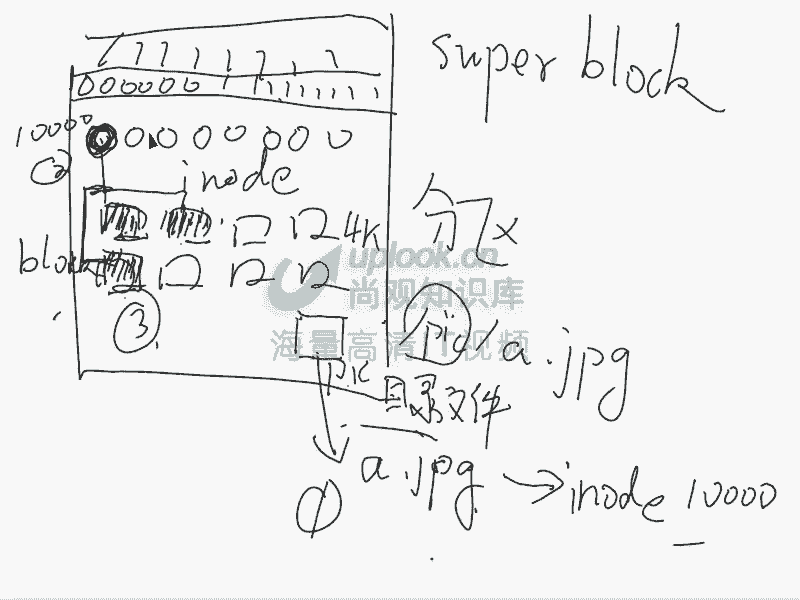
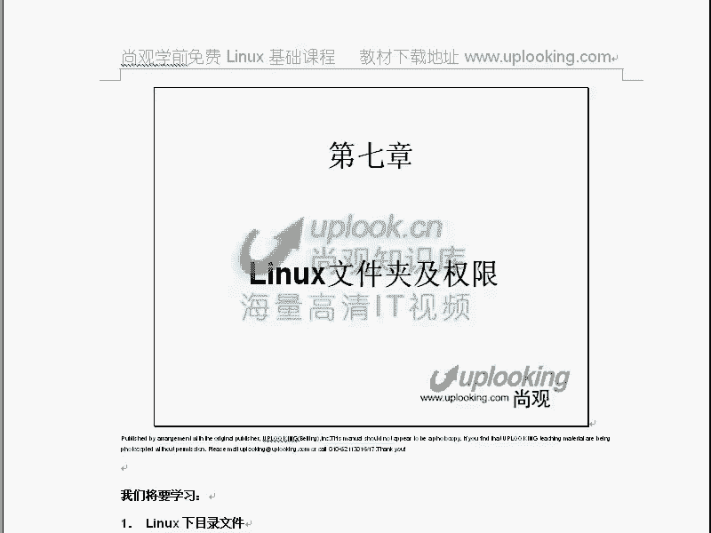

# 尚观Linux视频教程RHCE 精品课程 - P13：RH033-ULE112-06-文件属性 - 爱笑的程序狗 - BV1ax411o7VD

好，我们跟小芳的话一块来继续录一个，就是我们的第六章啊，那够刺系统呃文件的存储及权限。那么文件的存储和权限的话，为什么会呃放在一招里面去想，这个很怪啊。

但实际上你会发现如果要是再从编程者的角度上来考虑的话，我们已经反反复说过很多次，从编程者的角角度上来考虑，那么实际上文件的权限实际上它的属性当中的一个，对吧？我文件它可能有很多属性，对。

有拥有者拥有组是吧？它的权限是其中的一个，所以他们放在一块啊，那么我们就要学习什么呢？没有是文件的基本的概念。可能以前的话大家都说啊，文件不是很好说了，我们看到文件夹里面的一个一个文件独立出来是吧？

很简单啊，但实际上linux里面才会真正的告诉你文件是怎么存储的。windows也是一样存储。但是windows给你抽象出一个小文件的样子，你就认为是这样的。你把硬盘的话，你不信可以拆开看看啊。

你把硬盘上不管怎么刻，你也找不到那个小文件的那个东西去。它不可能是这样。然后呢我们知道lininux里面的文件系统话主要是一个EX3的文件系统是吧？对ES3的文件系统它是怎么存储这个文件。

然后文件的类型，文件的属性，还有呢文件的相应的权限，然后呢，相关的命令啊，给大家总结一下，就是这是我们的内容，内容。然后我们现在看linexel的文件是这样的，呃，Lux文件的被保存在文件系统之下。

那么它呢是由一些东西构成。就说呢文件呃类型啊，访问权限等等。这个的话原来我们已经给大家看到过，在哪看到过呢？大家看一下这个地方呃，我们现在这样的输入LL。看到了吧？对，那这文件的属性就全部出来。

前面这一杠表示文件呢是一个什么？普通的型问机。接着这9个位置的话，表示呢文件的权限。这个地方的话是表示文件的什么link数。link说，然后这个地方呢是表示有文件的什么阅读者和文件的阅母组是吧？对。

这个地方的话呢表示什么小方这是什么。他文件大小。对呀，说的非常好。那如果要这个文件的话，你觉得是这么大吧？不是。不是，那多大。系。他那个写的大小不准，不是很准确啊，那用什么看的比较准确。小芳又忘了啊。

过一会儿的话，小芳就是被我打的尖叫的时候，大家不用报警啊。妈妈。第一啊。对不对？对，DU杠H是不是能看到真正的大小。对，是吧？你说小芳哎，你觉得你应该不应该挨打，应该。嗯，接着是这个时间。

就是它的更改时间，然后文件名，对吧？对啊，回现在的话我们看那么这一串下来以这个呢作为依据哈，我们给大家详细的讲一下。首先最前面这一杠表示文件的类型的话呢，是一个普通文件，只要是文件。那么大家想一下。

你你在windows里面呢，想一象小白，你想一下windows。😊，那mo里面你见过哪些文件？那小华可能说文件就文件吗？还有什么文件是吧？你首先的话呢，从哪个地方考了一个大片是吧？什么文么RM。

那属一个普通文件，对，对吧？还有一种文件的话是目录型文件。目录类型的文件，连这个文件加它实际上也是一个文件，明白吗？它也是一个文件。嗯，文件夹也是个文件，那么文件夹。它是D类型的文件，看到了没有？嗯。

D类型的文件。对啊，那么D类型的文件。那么D类型的文件呢，它后面呢这个属性也是一样的。但是呢它是D类型的，表示它是个文件夹，这个是不是在winows里面也有嗯，对，winows里面有文件夹吧？有。

实际上他们组织形式差不多的。那还有一个文件的话是这样的，就说呢你再看一下L杠2。你T c。那么你可以看到这边有一个什么呢？链接性文件。L类型的文件。啊，这边有个L类型，文家看到了吗？😊。

L类型文件L类型的文件的话呢是表示链接文链接型文件。链接型文件是什么？在windows里面也有叫什么快捷方式。对，是吧，这也是练这些文件。所以的话快计方式是这个。那么还有呢就是其他的什么东西啊。

其他的什么文件，你还知道吗？整个mos里面，你看快捷方式你有是吧，目录也有吧，普通软件有是吧？还有什么文件？执行文件可执行文件。对，那就是普通文件。那一样吗？就是普通文件。所以他们在文件类型当中呢。

lininux里面要丰富多彩很多。它还有一个文件，什么文件呢？大家看现在的话大家看到了什么以杠开头的普通文件是吧？对D开头的目录型文件，然后类型开头的什么链接性文件都好理解。😊，所谓软链接的话。

就说我就相当于快捷方式了。对我们访问这个地方，就实际上访问它指向的另外一个地方，对对吧？那么还有什么呢？还有我们这样。方说呃看一下LS杠L啊DV项目的DV项目的呃SDA记不记得SDA是什么？第一块应？

对啊，那为什么想那么半天啊？第一个下的TTY是什么？TTY1是什么？嗯，第一个更资台对啊，直接回车这两个文件是不是都算看到了是吧？对，但是他们前面是不是很怪？😊，B和什么？

CC啊B的话表示的是block类型的设备文件。C的表示是字符型的设备文件。这一点的话，在windows里面没有windows的话，它呢把你和真正的计算机的专业的知识呢隔绝开了。

但windows里面并没有那么紧密，所以的你能接触到底层东西，那么win windowsdows里面你见不到这两种文文件。那windows呢它自己操作。但windows的话呢。

它把硬件抽象成文件的形式是吧？这时候你访问SDA相当于访问什么？然后你的DY硬盘嘛，对对吧？那我现在catDV下的SDA会怎么样？你把你把你的硬盘的第一个字节开始读，一直读到末尾去，对？信不信？对。

信不信信？这就是全部的这就是你读硬盘，就是你看不到什么东西。你说A硬盘里面不是应该有什么文件啊，有什么东西吗？应该有文件夹了，怎么没有刻花的文件夹出来？那是windows给你显示出来的，对不对？对。

但是实质上呢，它存储的时候都是0101的数据。但它从第一个字节开始读，实际上就把MBR读了。MBR是主引导记录嘛，这个东西在window上你根本就看不到的。

但那windows里面随便你可以抓出原数据来看。你知道吧？嗯同样如果有人啊使坏，他把这个一串数据的话，直接给你输出到SDA上去，你会怎么样？比方说有人使唤啊，大家千万不要模仿啊千万不要模仿。

比方说我这样的啊cat1个ETCL我怕错了是吧？本来的话这东西是显示在屏幕上，是不是？对，那么我输出重功一下，我把刚才输出东西的话，输出到第一下的SDH这是会怎么样？😊，那差的东西跑到哪去了？硬盘里啊。

是不是你硬盘的MBR没有了，对，分区表也没有了。对。文件系统的前面的话都没有了。所以呢你的整个硬盘都相当于废掉了，然后数据全都丢了。可怕不可怕可怕？所以的话呢从某种程度上来讲，我们说一个笨蛋啊。

他在用这个lininux的时候，他很可能会把系统搞坏。而windows里面已经防范笨蛋的账va已经防了很多了啊，你要想把自己的C盘格式化能格式化了？真的对呀。

那但windows9598可以那200块就不行了。因为的话呢他这个已经是呃就改进过了。但是在lininux里面太容易了，你想怎么折腾这个系统完蛋了啊，这个系统一一下的话就70。

那我就我记得经常看到个24小时窗口。他们从哪个地方捡到一个呃什么烧焦的手机，还是烧焦的这么的一个硬盘，把里面的东西分析来分析去就能分析出一个文件来。首先呢我不太相信啊。再一个呢，如果在linux里面。

我保准让它什么都得不到，为什么呢？因为它我从一个地方读出大量的数据过来，然后呢，把这个数据源全部都输出到硬盘上去，那你的硬盘上还有什么数据能存下来。对，如果零全部整整个硬盘的话归零是在名词里面很容易的。

为什么呢？因为我们可以直接如这账号了，它可以直接对设备文件进行操作。而设备文件就是一个普通文件那种形式保存在那边。你往这里面去写，就相当于你直接写入硬盘，清楚了吗？明白。

这就是什么这个SDA所以大家千万不要这样做，这样做的话，你的硬盘就完蛋了啊，你的那个分期表这东不见了，引导记录也引导不了了。你这块硬盘它是重装系统了。明白吗？明白？你像这个机器要重新建MBR等等。

那么一为系统东西呢在我们115啊，就这个视频的话呢，112部分的话可能是公开的。那115部分呢是没有公开的。那么就是上官的111的15部分的话呢，那里面的话有详细的这种描述。

就是说啊整个的硬盘的钱的结构是怎么样的等等。那我们现在看这边的话，我赶快把这个问西去掉啊，千万不要这样乱搞啊，另外呢我也希望大家呢知道就是说你自己不要这样的胡搞。然后呢，再一个对公司的机器的话。

也一定要怎么样，你一定要爱护啊，千万不要乱去动你的这个机器。然后呢，因为你要知道职业生涯当中啊，千万不要犯这种错误，就是数据的话是金钱，你如果把你的数据搞丢了，你自己的话，不管是出于什么原因。

你自己职业生涯当中都会有个污点，这个污点的话，是你自始至终都抹不去。啊也许你换一个公司的话，你可以获得一份工作。但然如果你有这个污点的话，你甚至连换公司都换工作都换不了，明白吧？数据是非常值钱的。

要爱护自己和公司所有的数据。那么当然。你也不要让别人话回换你的数据啊，那么你比方说你明白了这个设备文件的道理以后，你可以轻而易举的把整个硬盘做一个备份做一个镜像。

你不用gstlindux里面话不用gst，因为gst首先它是不用什么平台的，不是linux平台或我平台是吧？你只要引导起来就可以用。

那么在lindowux里面也有小的工具直接可以做你要DD命令第一个下载。比方说SDA我对接设备文件操作输入输入重像啊，一般来说的话，我就用小于号。那么实际上它是可以这样的RF等于是吧？

第一下的SDA然后呢，我输出OF等于比方说TMNT啊，我慢他的一个U盘是吧？或者一个大的硬盘。A点。那么这时候的话，你就把整个的硬盘全部都给他备份了。明白吧？明白，那如果要是我想带现一个分区怎么办？

那就SDAE嘛，对，对对？对，这样备份成1个A点枚值的文件，明白吗？明白，这样的话就直接备份了。但是千万不要把自己又备份到自己的这个硬盘上。那你写到什么时候是个头啊，那肯定最后就是死机嘛。是不是？对。

所以呢这样的话呢，你可以轻而易举的把你的硬盘的啊进行一次完整备份，或者一个分区性完整备份，这是分区性完整备份，对吧？那么这个呢就是我们的。对设备文件进行操作。那么回顾一下刚才我们看的这俩。

那么这边的话呢是一个设备文件是什么？block类型的设备文件是吧？对，还有个字符设备文件。那么block类型的设备文件的话呢，它呢是块设备文件。块设备文件和自符型设备文件有什么区别呢？

块设备文件的话呢一般针对的是慢速设备。蕴含的话实际上是很慢的。而且呢就是说一般我们在硬盘操作的时候呢，它呢要积攒起来，就是它会有配一个buffer，就是一个缓存。然后呢，对这个硬盘操作的时候呢。

是至少512字节，512字节1块1块1块1块去操作，明白吧？明白？所以这种设备文件的话，一般都是块式么文件。典型的什么呢？啊。s家硬盘啊HD硬盘光驱。对吧还有我们的什么ST设备，就是我们的磁带机。对啊。

这些设备的话呢都是块设备软件。那么块设备，然后呢，自营设备的话呢，是我们的什么是我们的那个呃像TTY。你ele一个什么ecle一个一就这样一个字节啊，输出过到第位下，这实际上是两个字节啊。

就是一个一一个回一个是回车这字符TTY一去。那么是不是这样的话立刻就过去了。对，不用等是吧？对，但是时间非常快，为什么呢？因为它是个自动设备，它一个字节或者说半个呃或者是零个字节都可以。😊。

都可以去立刻输入一个字节，两个字节都可以输入。而我们的那个SDA的话呢，是至少512字节1块来操作，明白吧？明白，那么所以的话呢，我们有一些设备的话是一块一块操作，所所以是block类型的设备文件。

还有一些呢是自营的character是character型的自行设备文件。然后呢，在我们这里面TMP目录下的话，会有一些文件，你可以看一下。那么比方说我们的这个呃。然S你显示引开文件应该用什么参数？嗯。

我以后的话计算机旁边准备好把刀啊，然后呢，生气的时候的话，我可以那个向小小芳的话发发发发泄一下杠A啊，记不记得？然后呢，杠A啊就显示隐含文件，并且以那个就是长的方式去显示嘛，就显示文件的信息更多点是吧？

要回车，那么你看一下这边是不是显示出来很多隐含文件对吧？然后呢，我们在这里面看啊，我们找到这个T啊，点fo点unix是吧，自己服，你看到这边的话是不是有个S类型的文件，看到了吗？对。S类型的文件的话。

紫色的它叫做st文件。就是说我们在我们上面的话有一个就是编程的课程，就是unix编程的课程，就是soc编程。那么socet编程的话，它有时候话会用到一个什么呢？socket文件。

这个set文件呢叫网络通信用的是吧？那么你可以把它理解成什么网络类型的文件，明白吗？嗯，但是我们自己一般很少去创建。啊，一般的话我们自己很少去用，很少去创建。那么还有什么文件呢？还有这样的。

就是说我们可以看一下，还有有socet类型的。还有呢就是说我们呃现在的话已经接触了什么。刚才常见的是大是吧，普通文类型文件对D目录类型的文件和，L是链接类型的文件是吧？对，现在还有B类型的C类型的。

还有S类型的这三种windows也没有的是吧？没有见到的这三种文件，一种是block类型的自呃设备文件，还有自行设备文件，还有什么网络类型的文件，还有一种还有一种是什么文件呢？管道类型的文件。

然后S杠L。DV目录是吧，然后呢。呃，GREP以P开头的。那么它是什么网络类型的文件，看到了吗？嗯啊，不是，它是那个管道类型的文件，就是说P开它的文件，对吧？对，那么这时候呢我们看一下总共的完整的话。

就是说7种杠D2。BCSP这样几种类型清楚吗？嗯，这个文件类写。哎呀，累死了。L个L以后，就这么前面的一个字节讲这么长时间。好了吧，嗯，那么接下来的话呢，这是文件的权限。啊文件的权限。

这9个位置的话呢是文件的权限的位置。那么三个三个一组。那比方说我们现在看这个呃0605log是吧，这三个最前面这三个RW杠表示呢是这个文件的拥拥有者对他的这个权限。然后呢。

这个地方R杠杠表示呢是文件的拥有组对它的权限。嗯，然后呢后面这三个位置是others，所有其他人对这个文件的权限。others具有的权限，明白吗？明白，所以说话呢在这里面你可以看到的是什么呢？

是9个位9位，总共呢三位三位一组是吧？三组是吧？第一组是针对文件的拥有者是吧？对第一组针对文件的拥有者。第二组是针对文件的拥嗯，拥有组。第一第一组的话是对文件的拥有者是吧？对。

第二组的话是作为文件的拥有组。第三组的话呢是针对others非拥有者，非拥组的其他任何人。对吧对，那么就是三个权限。R代表什么？啊。还代表什么？突破对呀。小芳会这我杀死的啊，W呢写废话，当然了。😊。

Start了。没有吗？对，你就说的好，故意是哪位小芳的X代表什么？😊，执行。对吧。那么winow里面这个程序值不可不可以执行，不在于它的扩展名点ES扩展名在windows下可以执行是吧？

那在windowux里面有X权限它就可以执行，明白了吗？明白，所以呢这边的话就是说这个地方就表示呢我们的这个文件的优者root对它具有什么R和W就是读写的权限是吧？有没有执行权限，没有啊。

如果要是这个root组的成员是不是对它具有R的权限啊，对，那么W权限有没有没有啊X权限呢有没有啊。那么也是读的权限是吧？对所以一般情况下在系统里面的文件的权限。

一般都是什么644就是说都是什么RW杠R杠杠R杠杠如果文件夹的权限呢，一般都是什么？杠LDD的话是显示文件夹本身的权限ETC文件夹的权限一般是什么？RWXR杠XR杠X也就是说具有的是755的权限。

也就默认文件夹的话是755权限。文件权限是644的权限啊，具体是怎么回事呢。那我等一下看一下啊。好。😊，那大家看呢，就是说这个权限的话呢，我们知道啊RWX代表什么是么？R代表的是读是吧？对。

代表代表的是写X代表执行对是吧？然后呢呃我们说三个三个一组，最前面这三个的套针对用户，中间这三个套针对针对组，后面三个针对others是吧？对，原始不原始，你觉得别扭是不是？对啊，但是没办法。

因为看inux自始至终都有这样。我们说呢因为从70年开始到现在，别了此也是一种类inux系统。他这照着unux这样的方态去写出来，到现在没怎么变过。但是现在的话呢，还好linux有什么呢？

SElinux或者说什么ACL等等，对它有些加强。但是呢我们还必须得把这个东西搞清楚，搞熟了。CHMOD它可以呢用U啊，加上一个比如说加上一个。W是吧，又加呃又加上一个比如说X给这个A这个文件是吧？

然后LS杠LA那么这样。那么这个时候呢你可以看到呃A这个文件这边的话是有个X权限的是吧？对，那假如说我们group和others的话都具有一个X权限怎么办呢？那后可以这样呢CHMOD是吧？

那么G是不是group啊，对other是O是吧？那么都加上一个X给A，然后这样做完了以后，你看是不是这边有个X这边也有个X，嗯，是不是？那么这样的话呢，你就可以把权限的话进行一次校整。

然后呢呃这边做完了以后，你还可以呢用其他方式的话呢去这样去设置它啊，你还可以错用其他方式的话去设置。哎，错了啊。😔，一。点错了。那个就是说如果要是我们现在给每一个加上一个权限或者减一个权限。

是不是非常简单？对那么我给所有的人的话，全部都减去个X权限CHMOD是吧？A就是R了，是吧？对，减去X权限给这个文件，那么是不是这样的话，你看是不是他大家所有的X权限都没了，对，对吧？所以这样非常简单。

如果你要设置什么呃CHMOD啊，A所有的都等于什么呢？RW对A那么这样的话就全部都设成RW了。对，也就是说你可以用UGOA加上减去或者等于RWX对吧？对，非常简单。

但是呢我们经常看到有些人的话是这样的CHMOD。644是吧，A这个文件。那这个怎么回事呢？你看一下，这时候呢他把它权限就变成这个样子，就RW杠R杠杠R杠杠为什么会这样呢？我么6是吧，4。4对吧？对。

然后644我们把它转换成啊二进制数是多少？6的话转换成二进制多少？110，对不对？对，4的话是什么？1004的话是100是吧？这样的话转换成二进制数以后，把十进制转成二进制了以后转换成这样的吗。对。

如果这位有一的话，那我们说是有这个权限的是吧？如果要是零的话，就表示没有这个权限，对吧？对，那么就是怎么样呢？就是RW杠。R杠杠是吧？R杠杠对，对啊，是这样的。

所以他呢最后权限就是RW杠R杠杠R杠杠明白吗？明白？O这样的话我们搞清楚了。那么这个文件呢它本身的话就已经是权限的话，会随着我们的数字这样的变更的话呢，它就变成我们想要的这种样子。然后呢。

你是不是一下子就给每一个你需要的地方呢设置成你要求那么缺限，而不用UGO这样的一个一个再去呃再去等于多少，等于多少加上或者减去，那很麻烦了是吧？对，所以呢数字方式的话是用的非常多的。

那么现在我想考一下小芳啊，CHMOD啊，我现在改成什么呢嗯。755，然后呢，A那你说这个权限应该是什么？7557。5。5权限的话，七的话是什么？转让进去。那么小方可能不会转啊，小方不会转。

那么这里面非常简单。我给大家呃我给大家看一下。75是吧，七怎么转换成二进制呢？这是一个十进制的数是吧？嗯七能不能被二整除？不可以不可以是吧？对它减去一以后是不得6啊，六可不可以被二整除，可以啊。

那么七刚才是不是减去这个一对，是吧？你这边把这个一拿出来，明白吧？嗯，那么变成66除以2以后是多少？333能不能被二整除不可以，那么又拿出来个一，是不是？那么三变成减一以后变成2是吧？

2再除以2是多少1啊，那么就是111，是不是？对，那么这样来读。这样来读，那么就111，这样的话就是七转换成二进制以后，这值是这样的，明白吗？嗯，那么在现在再看55转换成二进制是多少。

那么看五能不能被二整除。不可以。一是吧？对，那么接下来这个数字是多少？是。4除以2以后啊2啊2是吧？对，二能不能被二等除，可以你说这道。对吧这边就零了嘛，对，2除以2以后等于多少1。是对不对？对。

所以的话5的话是什么？101啊，不是101，对吧？对，这样读对不对？那反过来，所以的话十进制转二进制非常简单，对不对？对，然后现在我们回个头来再看，那么CHMD75以后，那么7的话是多少？嗯，那个RW。

111是吧啊，对，是吧，111是吧，对，这个5呢101101。这呢101101，然后呢转换成嗯就是说把它变成那个呃。选项的话RW均准号是多少？嗯，IWX。啊。然后而。然后杠，然后那S。对吧对。

那我们现在看一下小芳推测的对不对。是吧如我们所愿是不是一样的，跟推测出来是一样的对，对吧？所以这时候呢大家就知道这个权限是怎么回事了，明白吗？明白，嗯，那么现在我们再做一个绕口的。

因为权限这个地方实际上非常重要。很多的话所谓的大侠认为自己很懂，实际上未必会懂啊。那么现在我这样的。呃，现在我们看一下呃。把这个权限A这个权限呢CHMOD我给它改成什么呢？0啊4。六。046。046。

然后呢给这A这个文件。那么现在LS杠L以后是吧，A这个文件那么它是变成。如的账号应该是杠杠杠是不是没有权限是吧？对，那么如的组的话是R杠杠是吧？对，R是是RW杠是吧？对，那我想请问一下，如的账号。

它最后的话是什么权限？他只能有一个只读权限吗？只读权限。对，那么实质上呢我们可以叫他哎，如此账号嘛，它应该是什么权限都没有，对吧？对，但是它就属于如它组是吧？如此组具有R权限是吧？

Rs呢具有RW权限是不是？所我说应该是R权限或者RW权限的，对不对？但实际上linux里面权限没那么智能，所以智能的话是不是我们说所权限智能的话是怎么样？智能的话是说权限可以叠加是吧？

那么一个用户属于A组又属于B组A组具有R权限，B组属于W权限是吧？那它就就有RW是吧？但linux里面没那没属于事啊，它算法太简单了，你linux效率高，它去效率确实高，怎么高呢？😊。

如的账号跟这个文件的拥用者是不是一样一样不一样一样一样是吧？对，是这个权限是吧？对。结束。就可以了。根本就没有权限的叠加，明白吗？明白，所以的话呢如此账号当然特殊了，如此账号即使没有权限。

它是不是也可以打开这个文件？可以，因为它是root呀，对，它是EIDV零的账号。但是呢如果要普通用户在这种情况下，它就只有什么杠杠干的权限，就什么权限都没有。😊，因为他的用他的用户。

他的UID跟这个文就是这个用这个文件的UID是一样的那就可以了，就直接就是显示权限，根本就没有权限叠加，清楚了吗？明白啊，明白了哈。明白了以后，我们就再来再来看。

那么这个时候的话我们呃给大家演示了这样的一个权限。然后呢，告诉大家数字的方式是怎么来的。如果啊不明白的话，你再看一下我们就录像啊，把它发问数看一下，那么这就是我们的这个呃就是这个权限的这个部分啊。

然后呢，我们再看一下访问权限这个地方。然后呢，我们再看一下链接数啊，我们在这边看完以后，这边是个链接数link的数目是吧？对，所谓的链接数怎么样呢？你必须得要从我们的文件的存储上来考虑啊。

这个问题再来考虑。那么现在我来看一下文件存储怎么回事呢？咱们看一下。😊，假如说你现在的话呢有一个呃文件，那么你觉得这个文呢是怎么存储的？是拿个小刀刻到硬盘上的吗？不是不是是吧？那怎么存储啊？

那整个的这个分区的话呢，实质上是这样的啊，我们这假如说是一个分区是吧？这个分区最前面这个地方的话呢，这是一个分区啊。这个分区最前面的话叫做什么呢？super block。super block明白吧？

对，这个super block在前面的话呢，有一些。iodeode列表和block链表啊block列表。那么文件系统里面的话呢，iod和block分开的。但是我这边有一堆iode。挨乐的叫做I级点。

就是索引节点。那么还有一些呢block实际存储文件的时候呢，是放在block里面，就是内容的话是放在block里面。那么一个文件，一个文件，比方说这一个block的话，默认情况下一般是4K的4K1块。

你现在有一个文件的话，大概是10K10K的话，它需要占用。33个3个是多少？1312K是吧？对，这就是LS杠L和DU命令的区别。那么DU命令的话呢，它会告诉你实际它占用了12K。而我们的那个LS命令。

它会告诉你占用了多少。10K的空间明白吗？明白，所以就是它的区别。那么假如说这个iod，它所引呢三个block。他所有的三个block。这是文件的实质的内容是不是放在block里面啊？对。

刚才有个美女图片是吧？哇，好漂亮。然后呢，这个图片那么这个地方呢放脑袋和鼻子什么东的，这个地方是吧？然后呢，这个地方呢放到他穿的衣服是吧，就跟它是鞋子是吧，放到这三个block里面。

但是呢这三个相当于这三仓库当中的三个位置，他们是要靠一个im来索引起来的。😊，明白吗？这个od说我自己是被人，就是说我这个ipod已经被人使用了。这个ideod里面存放的说三个block的话，它是占用。

就是它所有的三个block。这三个block的话，也是被人占用了，是不是？对，那么这个时候我们是不是原来给大家讲过一个叫目录文件的东西啊。嗯，你比方说在在如头目录下有个名叫呃如头目录下的话。

有一个名叫那个。目录下的话，有一个名叫美女图片的这OK在这里面的话那个。那么索引的索引的这些blog。然后呢，我们刚才不是说过说有一个目录嘛，是吧？目录也是文件是吧？对，那假如说呢现在我们刚才说过。

就是如果是你现在是在PIC这个目录下的话，有一个文件名叫什么呢？名叫A是吧？H话是一个美女图片是吧？对，比如说A点什么呢？呃，呃GPG是吧？对啊，那么看就是我总是在开开这种玩笑啊。

就是说说那个这是一个图片啊什么的东西啊，那么实际上意思就就是普通文件也是一样的，你的可执用文件也是一样的，对吧？对，那么在这个目录下的话，这个是那个目录文件，你看道吧？

这个文件名号叫做什么PIC就是那个目录文件，那吧这个目录文件，这个文件是不是已经分了两部分存储了，一部分在这儿，一部分在这，是不是？对实际上文件是分成三部分存储的。在这个地方的话，还有一个文件。😊。

这个地方的话，这个这个那么这个文件的第一部分实际上放在这个地方。这个第第一个部分的话放什么东西呢？我把它放大出来，它放大出来。这个地方呢放的什么呢？说这个文件的文件名。😊，放在这地方明白吗？

明白它指向什么呢？一个ilo的号码。直线应个安照号码。I号码为什么呢？1万号i know这是第1万号Io的。あ。这第1万号iod在这个地方明白吧？这第1万号iode是不是就这个第1万号iode？

没有问明白。嗯，那么有人访问到这个文件夹了以后，访问到这个文件夹了以后，是不是能根据这个文件夹里面的信息找到这个文件？对，再根据这个文件，他找到这个I诺的号码。对。

然后呢再根据这个I诺的号码索引到文件的内容，是不是？对，这实际上是什么？第一部分，这第一部分是放在目录文件当中，这是一个什么目录啊。文件明白吗？明白，这是一个目录文件。而这边的话是什么呢？

这边的话是block。块block这边是所引节点，你觉这个地方是什么呢？第二部分I know是第二部分block的话是什么呢？这是三部分，实际上一个文件的话呢，最起码应该分成什么呢？这样三部分存储。

那假如说假如说我现在呢这个文件啊是个空文件什么东西都没有，那怎么办？哪个地方没有一有没有？如果我创建1个A点GPG这样的一个扩文件，一有没有一这个部分有没有没有没有吗？

那如果有A点GPG这样的一个文件名没有在里面，会对对，文文件名在这里面嘛。对，那它指向一个iod是吧？iod应该有没有？And那个。

有什么东西？对，应该是有啊。对，什么东西是保存在idod里面呢？大家看这个地方。

什么东西保在iod里面，你们看到这些东西都是in里面的。就说这个文件的属性啊，这个文件的属性都是在inote里面。听懂吗？明白啊，所以的话呢你这个iod啊这个iod。肯定是有的，记懂吗？嗯，然后呢。

接着是这个block文件的内容，如果没有block占数就应该是为0。明白吗？明白，那文件内容是有的，那么block可能就会至少占用一个或者占用多个，明白了吧？明白，所以说你创建空文件。

它的block可能是没有的。第三部分可能没有，清楚了吗？嗯，那么这个跟我们的link数有什么关系呢？假如说啊我在这个地方这边又有一个文件夹文件，这又是一个文件夹文件，这个文件夹文件叫做什么呢？ETC。

嗯，我在这里面再去创建一个什么呢？B这样的一个文件名，也指向I know的号为什么1万。这个地方是不是也指向艾特号1万？对啊，那么这样的话，是不是通过这个地方也可以进去，通过这个地方也可以找到。对。

那这时候呢它这个link数就为2。清楚吗？明白，但是这个时候呢就无所谓原文件和新文件。因为它呢它们都是相同级别的。明白吗？明白这很多相同级别。好，我们现在给大家做个例子。大家看一下，那在这里面。😊。

那么假如说呢我在这边呃C到TM目录下去，创建一个文件，名叫A是吧？对，那LS杠LA这A文件的话应的是为一嘛，对不对？对，然后呢，我用LN命令是做一个硬链接给A这个文件做一个名字叫B的硬链接，看到了吗？

嗯，然后直接回车。那这时候你在LS杠L。AB。这两个的话是不是指向同一个地方？对，那么它命个数是不是变为二了？对，是吧？那么如果要是我再到什么呢？如他们够下LN把TMP下的B文件哈再做一个什么呢？

再做一个链接名叫做C是吧？那么这个时候你再去看。这样TMP幕录下去啊，然后在LS杠LABA和B是吧？对，然后这时候怎么样？另个数是不是变成三了，对对不对？对。

所以的话呢这个link个数也是保存在Iow当中。也就是说你看到这些东西啊都是保存在I know当中。你想看in里面有什么东西吗？嗯，STAT。第。Iode里面就这些东西。

但是这个文件名不放在iode里面，明白吧？明白，那么也就是刚才我做的这个操作的话是怎么样的？我刚刚做的操作用LN命令来做了一个硬面机是吧？对，那现在如果要是我把AA文件删除掉会怎么样？他那个三个变2。

嗯，然后呢，B文件还存在不存在不存在，B文件就不存在了，B它存在。到s上现在。说的很对啊，三会变成2是吧？是吧？那么B文件的话还是存在的，是不是啊？对对吧？对。

那OK那么如果O把B文件删除掉C文件还存在不存在？刚才我不是给这个B做了一个名叫C的硬链接吗？那刚才我不是给A做了一个人叫B的硬验接，为什么把A删除掉了以后，B还存在呢？应该B应该是一乘以A的呀。对啊。

😔，啊，那是呃刚才我这边实际上已经解释过了，也就是说这个ETC这个目录像，比方说创建了一个名叫什么B的这样的一个意链接以后是吧，跟这个就已经无关了，你明白吗？跟这个地方的这个文件的话就已经无关了。

也就是它是不是直接指向这个地方，对，它也可以直接指向这个地方是不是？对，所以的话呢你把这个地方删除掉以后，它是不是还能指向它对一点问题都没有所以无所谓原原文件和新文件，对不对？对。

所以他你不管删除哪个都无所谓，只有删除最后一个的时候，删除最后一个的时候，link数是不是就变成一了，对那个数就变成一了是吧？对，那么变成一了以后，那你最后一个E链接在删除的时候。

那么是不是它原来是一你删除完以后，它应该变成零是吧？对这个候他才会把和block收回来。如果你原来删除以后，比方这个文件呢比比比较大100兆。那么我创建一个名叫B的硬链接以后。

那你说这个B文件的大小是多少？也应该是100兆是吧？对，那么他们两个实际占的大小的话，是不是100是200兆吗？不是对，还是100兆，这个相当于入口减小了一个。当你减把最后一个入口封上的时候。

你那100兆的空间才会还给什么系统。明白我的意思吗？嗯，就link数为零的时候，它才会收回inote和 block，听楚了吗？嗯，所以link数就是做这个用的，清楚没有？明白。呃。

这个是我们的link个数。link个数完了以后的话，就是说我们的文件拥有者和文件的拥有组是吧？对，然后呢，接着三个时间，这三个时间我们原来给大家说过讲touch命的时候说过是吧？对，然后接着是什么呢？

这个呃。这个文件名，那么这就是我们全部的这样一些东西啊，希望大家呢能有收获。然后呢把软链接硬链接搞清楚。那么硬链接的话呢，刚才我们已经说过了，LO命令给A名叫要做一个名叫B的硬链接是吧？对。

那么硬链接在做的时候呢，不能跨分区。不能跨分区，不能给路录做音连接。啊，也就不能跨分区，不能给目录做硬链接。那个软链接怎么做呢？LN杠S就是做软链接。

那么我现在呢假如说给ETC文件夹做一个呃EEE这样的一个软链接，这是可以的。我给文件夹跨分区做一个软件接都行，但是这个软链接的话是怎么样的？它是相当于另外一个全新的文件，明白吗？明白。

当你访问这个文件的时候，就访问到那个文件夹去了，明白了吗？明白，它是一个全新的文件，跟刚才那个是没有关系的。😊，清楚吗嗯。好，这就是软链接和硬链接的区别。所以呢硬链接好还是软链接好？你说硬链接啊。

你说的这个话的话，问出来以后的话，我自己都没办法回答啊，你毫无意毫就是一点都不想的话，就是硬链接，实际上呢呃不同情况是不同的作用。那么硬链接一般用的非常少。因为你没有什么必要去用的。

除非是你想单独你怕那个文件被别人误删除了，那么你在其他地方做了一个硬链接，明白吗？明白，然后呢，软链接用的是最多的，因为你用起来的话，你软链接又可以跨分区，又可以给目录做很方便，对不对？

所以软链接用的是最多的，而硬链接它太隐蔽了，你怎么知道这个文件的话是一个硬链接还是软链接，你知道吗？😊，不知道你只有根据这个link的话，你能看，如果是二的话。

你可能能看出来它是可能还有个地方给它做了一个硬链接是吧？对，否则的话呢你很难看出它是硬链接什么链接。所以说一般情况下，你除非担心这个文件被删除。那么在lin里面删除文件一般是收不回来的。😊。

你找不回来的。所以的呢这种情况下的话，你可能担担心别人把这个文件误删除掉，那你在别的地方做了一个硬链接给他是吧？然后你删除掉这个地入口了以后，从另外的入口还可以进，对不对？对。

所以的话这种情况下用硬件接，一般情况下的话都是软链接，所以软件接用的是非常多，清楚吗？软件接会不会用会LS杠LSLN杠S是吧？对，给一个圆就是给这个地方做一个名叫什么什么什什么的。软链接对吧？

软链接名字叫这个名字对吧？对，啊，OK这个搞清楚了。好，我们现在看一下这个地方搞清楚没有？那么我们说呢类型是吧，权限连接数第者拥有组修改时间和有文件名都给大家讲一遍是吧？那么我们是以这样的东西的话。

作为呃作为一个依托的来大家讲的。那么这是刚才的几个呃。几个这种一些权限是吧？对，刚才是类型，就是权限，然后这边是怎么样去修改它是吧？大R参数的话是对这个目录下所有的文件和子文件呃。

子文件夹里面所有的文件全部进行修改这样的一个东西，听懂了吗？嗯，明白。然后呢，这边的话呢是数字，用数字来表达。然后这边的话呢是CHOWNCHOWN的话没跟大家说。

就是说改这个文件的拥有者拥为组刚才上节课的话实际上已经用过一次是吧？对，那么CHOWN改这个文件的拥有者。比方说我现在给B啊，改他现在是root嘛，root用户是拥有者是吧？对，那我改成是什么呢？账号。

那么B这样的话呢，你再去看。是不是社会账号拥有者啊？对，那他这是不是一个有音链接的文件啊？对有音链接的文件是不是在这个地方？你们这目录像有个C文件是吧？对，是不是跟它是一模一样的对你改了那边这边也改了。

是不是？对，为什么呢？因为你改的是io，他们妈指向一个iod，嗯，对不对？也就是说你刚才改的话是改在哪个地方呢？改在这个地方。改在这个地方是吧？对他们俩都指向一个挨ol的。那么你改到这个地方。

他们改一个地方，它是不是另外一个地方也就变了。对，对吧？所以硬链接的话呢，你一般察觉不出来啊，那么CH。CHOWN是改文件的庸者是吧？那么直接改成用文件庸者shack是吧？对，那么同时的话呢。

你还可以呢把庸者和拥组一块改，加上个点。啊，你到时候我现在把它的拥有组改成T器组。这让他我们再看。也是一样的，是不是是可用账号拥有TT是拥有组是吧？对，那么现在看呢。

我想把一个目录下所有的文件的拥有者拥有组全部都改掉CHOWN杠8R对。对吧对，刚办完，然后加上一个，比方说s卡，把一个目录下所有嗯把一个。换1个TMP目录像，所有的文件的拥有者和拥有组全部都改成。哎。

拥用者全部都改成善是吧？对，或者拥有组的话也一并修改。这样是不是改了。对，那我单改用用组的话，可以用用这个命令，所以选OWN啊点TDT这样的话也是可以的。明白吧？明白也也可以怎么样呢？

CHOWN呃CHGRP。TTTTM下的C是一模一样的，嗯，没有任何区别。啊，你用哪种方法都可以清懂吗？有人就拥有者和拥有组的这种修改。我们再看。CHRRP和CHO文刚才我是以点作为分割符是吧？

对以冒号作为分割符也是一样的，他们都可以支持大R参数，明白吧？明白。选LN软链接和硬链接啊。这边呢是io的号码，就是io block这种啊这种就是到底是怎么样一个结构。是不是刚才我给大家讲讲清楚了。对。

大家可以仔己看一下。那么呃2。4内核的话呢，以255个字符作为文件名最大值。然后呢，以点开头的文文件的话呢，是隐含文件是吧？对，为他说过了，那么其他的没有什么啊，那么第七章的话呢是文件夹及权限的内容啊。

O这张的话就讲完了。大家如果要是没有有，就是说如果上班的学员的话啊，那么请做一下练习手册。然后呢呃就是说呃可以反反复复看一下，那么不明白的地方的话都看一看就明白了。嗯那么有些地方讲的比较快。然后呢。

你可以啊返回头去再重新看一下啊。

