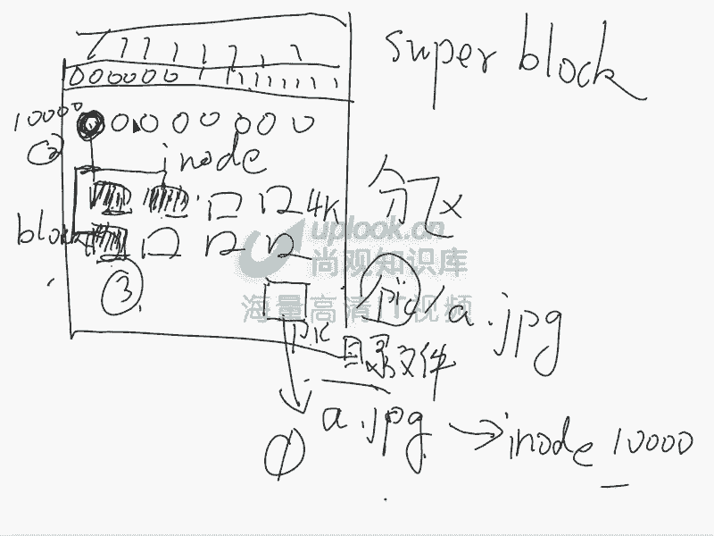
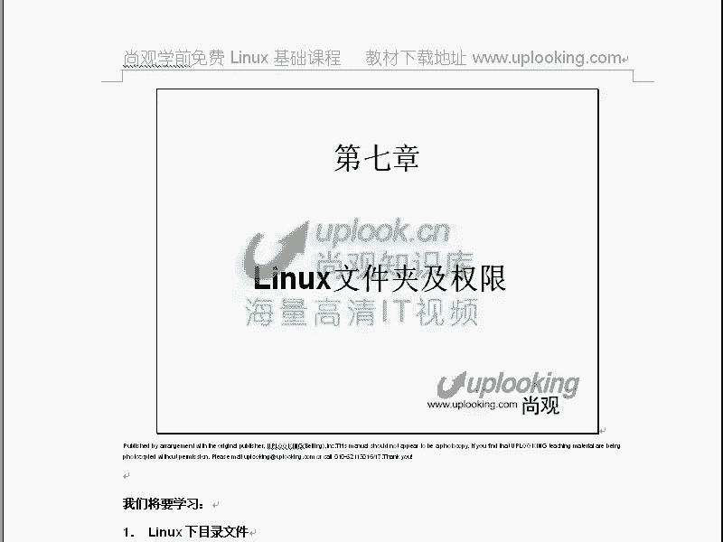

# 尚观Linux视频教程RHCE精品课程：P13：RH033-ULE112-06-文件属性

在本节课中，我们将要学习Linux系统中文件的核心概念，包括文件是如何存储的、不同类型的文件、以及如何查看和修改文件的属性与权限。理解这些内容是掌握Linux系统管理的基础。

## 文件的基本概念与类型

在Linux系统中，一切皆文件。这与Windows系统将硬件和底层细节对用户隐藏起来不同，Linux将几乎所有资源，包括硬件设备，都抽象为文件进行管理。这使得我们可以用统一的方式操作各种资源。

当我们使用 `ls -l` 命令时，会看到一长串信息，例如：
```
-rw-r--r-- 1 root root 1204 Mar 10 15:30 example.txt
```
输出的第一个字符就代表了文件的类型。Linux支持多种文件类型，远比Windows丰富。

以下是Linux中常见的文件类型：

*   **普通文件**：以 `-` 开头。这是最常见的文件类型，如文本文件、图片、可执行程序等。
*   **目录文件**：以 `d` 开头。目录本身在Linux中被视为一种特殊文件。
*   **链接文件**：以 `l` 开头。类似于Windows中的“快捷方式”。
*   **块设备文件**：以 `b` 开头。用于表示以数据块为单位进行读写的设备，如硬盘（`/dev/sda`）。
*   **字符设备文件**：以 `c` 开头。用于表示以字符为单位进行读写的设备，如终端（`/dev/tty1`）。
*   **套接字文件**：以 `s` 开头。用于进程间的网络通信。
*   **管道文件**：以 `p` 开头。用于进程间的通信。

**重要提示**：块设备和字符设备文件允许直接对硬件进行操作。例如，向 `/dev/sda` 写入数据会直接覆盖硬盘内容，可能导致数据丢失或系统损坏，操作时务必谨慎。

## 文件的权限详解

上一节我们介绍了文件的类型，本节中我们来看看文件权限。`ls -l` 输出中，第一个字符后的9个字符（如 `rw-r--r--`）就代表了文件的访问权限。

这9个字符分为三组，每组三个字符，分别对应三类用户：
*   **前三位**：文件**所有者**的权限。
*   **中三位**：文件**所属组**的权限。
*   **后三位**：**其他用户**的权限。

每组中的三个字符依次代表：
*   **r**：读权限。
*   **w**：写权限。
*   **x**：执行权限。
如果对应位置是 `-`，则表示没有该权限。

### 修改文件权限：`chmod` 命令

我们可以使用 `chmod` 命令来修改文件权限。有两种主要方式：符号模式和数字模式。

**符号模式**：使用 `u`（所有者）、`g`（组）、`o`（其他）、`a`（所有人）配合 `+`（添加）、`-`（移除）、`=`（设置）来操作权限。
```
chmod u+x file.txt    # 给所有者添加执行权限
chmod go-w file.txt   # 移除组和其他用户的写权限
chmod a=rw file.txt   # 设置所有人的权限为读写
```

**数字模式**：用三位八进制数字表示权限，每位数字是 `r`、`w`、`x` 权限值的和。
*   `r` = 4
*   `w` = 2
*   `x` = 1

因此，`rwx` 就是 4+2+1=7，`r-x` 就是 4+0+1=5。常见的权限设置如下：
```
chmod 644 file.txt  # 权限为 rw-r--r--
chmod 755 script.sh # 权限为 rwxr-xr-x
```

**权限叠加规则**：Linux的权限检查非常简单直接。系统会按顺序检查用户是否是文件所有者 -> 是否属于文件所属组 -> 其他用户。只要匹配到一类，就应用该类权限，**不会进行权限的叠加**。例如，一个用户即使同时属于多个组，也只应用其作为文件“所属组”时的权限。

## 链接数与文件存储原理

`ls -l` 输出中的“链接数”揭示了Linux文件系统的存储机制。要理解它，我们需要了解文件在磁盘上是如何组织的。

Linux文件系统（如ext3/ext4）将存储空间主要分为两部分：
1.  **Inode（索引节点）**：存储文件的**元数据**，如权限、所有者、大小、时间戳以及指向数据块的指针，但不包含文件名。
2.  **Data Block（数据块）**：实际存储文件**内容**。




而**文件名**则存储在**目录文件**中。目录文件本质上是一个列表，记录了该目录下所有文件名及其对应的Inode编号。

**链接数**就是指有多少个**文件名**指向了同一个Inode。使用 `ln` 命令可以创建**硬链接**，它会在目录中创建一个新的文件名条目，指向同一个Inode。
```
ln source_file hardlink_name
```
此时，链接数会增加。删除任何一个文件名（包括源文件），只要链接数不为0，文件的实际内容（Inode和Data Block）就不会被释放。**硬链接不能跨分区，也不能对目录创建。**

与之相对的是**软链接**（符号链接），使用 `ln -s` 创建。它是一个独立的文件，内容是其指向的文件的路径。
```
ln -s target_file symlink_name
```
软链接更像Windows的快捷方式，可以跨分区，也可以指向目录。删除原文件，软链接会失效（成为“断链”）。

## 修改文件所有者与所属组

除了权限，我们还可以修改文件的所有者和所属组。

*   **`chown` 命令**：修改文件所有者。
    ```
    chown newowner file.txt          # 修改所有者
    chown newowner:newgroup file.txt # 同时修改所有者和所属组
    chown :newgroup file.txt         # 仅修改所属组
    ```
*   **`chgrp` 命令**：修改文件所属组。
    ```
    chgrp newgroup file.txt
    ```
这两个命令都支持 `-R` 参数，用于递归修改目录及其内部所有文件。

## 总结



本节课中我们一起学习了Linux文件系统的核心知识。我们首先了解了Linux中丰富的文件类型，包括普通文件、目录、链接以及设备文件等。然后，我们深入探讨了文件权限的表示方法（rwx）和两种修改方式（符号法与数字法），并理解了权限检查的非叠加特性。接着，通过文件存储原理（Inode与Data Block）解释了“链接数”的含义，以及硬链接与软链接的区别与创建方法。最后，我们学习了如何使用 `chown` 和 `chgrp` 命令来改变文件的所有者和所属组。掌握这些内容是高效、安全地管理Linux系统的基础。