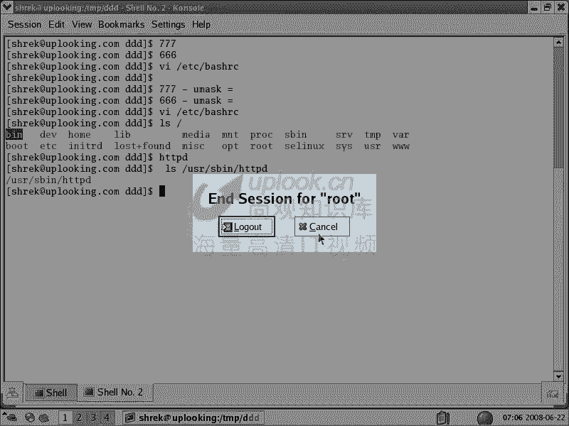

# 尚观Linux视频教程RHCE 精品课程 - P14：RH033-ULE112-07-文件夹属性及umask - 爱笑的程序狗 - BV1ax411o7VD

好，我们和小芳的话呢一块开始呢第几昌的学习是linux的文件夹啊，还有文件夹的权限。我们上节课是不是讲了文件的权限？小芳对啊，那个文件的权限的话呢，我们是以一个脉络来的啊，就是说大家看一下这边呃。呃。

我们是以啊。不好意思啊。い。Yeah。我们呢是以这样的一个方式呢去给大家讲这个整个的这个过程啊，以这这种方式哈讲整个的过程。那比方说呢我们是LS杠L。那么从这个文件啊就是用LS杠L以后。

从这个文件的最前面是吧？一直到最后面，那么每个部分的话给大家介绍一下，就是文件的权限是吧？对我说首先文件的类型是吧？文件的权限是吧？9个位置做的权限。那以后呢大家还可以看到呢SUID权限SGID权限。

还有po的ACL权限，就linux下的权限话总共是有5种啊，神经不神经啊，稀里糊涂，就感觉一般的那个初学者的话感觉这么多，实际上呢一般你用这样一种的话，也还好啊，就是你这种的话，如果明白的话也就可以了。

那么接下来呢有5种权限呢，如果要是你想做一个稍微全面一些的，或者说我们俗称的什么高手啊，你可能要继续往下去学，因为他别人在比方说动你的机器，或者说有一个黑客黑掉你了以后，你不知道到底哪个地方出问题了。

对吧？以这个时候的话，你可能要知道其他的权限。😊，然后接着呢有软链接硬链接i know block这样的一个关系的话呢，给大家引出了这样一个link的概念是吧？对。

这表示呢有多少个文件名指向这个i know。对吧对，那么这是link，然后这个文件的拥有者，文件的拥有组，我们还给大家介绍了命令是吧？CHOWN是吧？对，CHOW啊CHOWN改文件的拥有者的。

比方说CHOWsh。然后呢，我们把这个0605的这个log文件改成shack是吧？那么这个拥有者改成shack。如果想把当前的目录当中所有的拥有者的话，全部都改成一个人。那CHMOD加大R参数是吧？对。

然后呢ck如果把它的拥有组同时也一定的更改拥有组啊，这个文件的拥有组一并的更改。那你可以加上一个点，然后呢加上一个比方说并应这个组是这里面这个文件夹里面所有的文件的拥有者和拥拥有组。

那这样的话你就这样做就好了。因为这个点的话代表什么？这个点的话代表的是。是代着什么？小芳昨早晚有一天啊早晚有一天。你会惨的，你知道吧？被我打死，点它代表当前的目录啊，对。

因为CHOWN大杠大R不是后面一般加一个目录吗？这边加个目录吗？那我没有指定目录是吧？对我加了个点点的话就代表当前的目录，当前目录是什么？就跟你这样的CHOWN杠大R是吧？shack点D，然后呢什么。

😊，明且这是一样的，你啊，因为你就在当前的目录下，就在你的如情目录下了。嗯，明白了明白OK啊，你就明白了是吧？对点代表什么当前的目录，那么上级目录呢？😊，上你目了吗？😊，点点嘛两个点嘛，CB点点嘛对。

😊，唉。小芳啊小芳啊，你惨了，我记住了，然后看一下啊，开个玩笑。那么就是说如果学完了以后的话，忘记啊，那是自然的。因为的话很长时间，毕竟又又过去很长时间，然后呢忘有有一些自然的遗忘那是很正常的啊。

但是呢这些东西的话呢是经常常用的，所以我给大家列出来，然后这个文件的大小。我们说由文件由此处呢，文件的大小。我们说这个文件大小是假的是吧？是文件的真正的大小，但不是它占用空间的大小，对不对？

对我说一个字节的文件，它占有多大空间，这个文这个文件里面就一个字节。😊，是不是至少这样4K啊？对，因为一个block是4K嘛，对吧？那你怎么样去看这个文件，实际占用的大小，是不是用DU命令来看。对。

你比方说我现在这样的icle是吧？呃，icle空，然后呢输出重定向到06。05点log这个文件当中去。Yeah。すごい？输出过去了以后呢，然后我们再看LS杠L卡。那你看到这边是不是一个字节啊？是吧对。

这个文件是一个字节，这个文件一个字节的话，我们叫呢DU啊，然后呢0605是吧，点log。他占多少？哎，这个文件占8K啊。这个文件在8K的话，很可能是我的SElinux启动啊。SElinux启动了。

因为SEElinux的话有一些额外的信息的话，要写在一个block里面。所以你只要往这个文件里面写一个字节的话，那么首先这一个字节是不是占用一个两1个4K啊。嗯，那么另外呢SEuxux的话。

它会占用那个另外1个4K，所以的话总共是8K。啊，那么也就是说你这个文件即使再小，它也占用一个block。明白吧，明白嗯，OK那么现在我们是刚才是以这样的一个呃方式的话给大家讲，然后接着是时间是吧？

modify的时间就是更改的时间，就着文件名文件名这个地方我们给大家提到一点，你点开头的文件是什么文件。你一个单个的一个点开头文件，比方说touch一个文件，你的A啊点A这样的文件，这个文件是什么文件？

は。隐含文件知道了吧？嗯隐含文件，也就你点点开头的文件呢，文件名一点开头文件是隐含文件，那你怎么样才能显示出它来？那我估计小黄又忘了LS杠A对吧？对，才能显示出隐含文件来。😊，小芳早晚有一天啊会被我。

哎，毒打真的是气死人了是吧？然后呢，看一下这个地方搞清楚了以后，我们看呃接下来的话呢呃这是上节课的这样的一个回顾是吧？那么现在我们知道了这样的一个地方，比方说RWR代表什么，小方毒W呢写啊杠呢。

那等没这个权限是吧？对，没这个权限X呢？代表执行吗？对，是吧？对，那现在的话RWX你都能知道它是什么意思是吧？对，那我问你啊，现在的话你看我是到TMP目录下去，然后呢。

makeDRR名叫一个什么呢tDRR。那么现在LS杠LD啊。LLD加的D的话表示显示文件夹的。权限而不是文件夹里面的文件的权限，明白吗？然后呢，这样的。

你看那么现在你觉得这样的一个文件夹这样的一个文件夹。这个文件夹的话呢，它是。RWXRWRI杠XR杠X是吧，这样一个权限。那么看到这样一个权限的话，你说对这个文件夹来说，读是什么意思啊？

读这个文件夹是什么意思啊？直行吗？不是直行X的。那小方说不出来了，那你能呃大家能搞搞清楚吗？实际上大家也是稀里糊涂是吧？觉得哎呀读是执写呃这个读读嘛，是不是R代表读嘛，当独代表写是吧？X代表执行是吧？

对，哎，那这个对文件夹来说，读文件夹是干什么？写文件夹上干什么？😊，X。执行这个文件夹干什么？所以这个文件夹的权限完全跟什么文件权限是不一样的，对不对？对？

所以的话呢我们现在今这节课的话就研究的是文件夹的这个权限啊，我们现在就是研究的这个文件夹的权限。就是说这个文件夹呢，它本身的这个权限不能按文件的那种解释的方法来解释，对吧？

所以的话现在我们来看R代表什么X代表什么，W代表什么？那么说呢对于文件夹来说，最重要的权限实际上是X权限，X权限。对理解这个文件夹权限非常重要。假如说你做一个网站，你这个网站的话呢。

假如说你的这个页面啊，就是这个页面文件，比方说一个PP的文件，或者是一个某一个脚本文件被别人控制了。😊，嗯，那那说明你有个漏洞是吧？这个漏洞的话呢，很可能引起整个网站的问题。

那如果你把这个权限设置好的话，那黑客可能也没有办法。所以理解这个文件夹权限非常重要的，明白了吧？明白。那现在我们看对文件夹来说，最重要的是X权限。X权限呢表示这个文件夹它是否可以CD进去。

你要是想CD进行，那你有个X权限就可以。你要说我们现在这样的呃。

反正我们再开一个啊。再开一个。再开一个，然后呢，你这的S呃C到TMP目录下去mDR呃，我我现在SU成什么呢？他没关系呃，SU成。SU乘 maxA存sha以后的话，LS我们的这个呃test。D二是吧。

刚才这个如子账号是不是创建了一个这个文件夹是吧？对，然后呢我们看到它文件夹是呃如子账号是RWX权限是吧？那我想请问一下，你知道shack账号是对它是什么样的一个权限吗？shack刚才我不是在这边的话呢。

SU成了shack嘛，是吧？那么这个账号的话，对于这个文件夹来说是一个什么权限，你回过头来看，对这个文件夹来说是什么权限。嗯只可以CD吧，是可以CD。对，那你看到这边是不是有个R杠X啊，对，是吧？

也就是others这边就有RX权限是吧？那么他现在是如果具有X权限的话，可以CD是不是？是吧对啊，那我现在这样的啊，呃我呢CH呃MOD都把它的权限改成7。呃，比方说7070。

701test呀701改完了以后，你比方说7是吧，那么就是肯定是111了，是不是？对，然后呢，0的话那肯定是杠杠杠了，是不是？然后呢，1的话是什么？是杠杠1是不是001是不是对。

那这样的话这个权限是什么？改完了以后，它LS那就应该是RRWX杠杠杠杠杠1啊，杠杠X是吧？对，那么这others是具有了一个什么权限？X选限是吧？对，单具有X权限。那我们看看是不是这样。哎。

你看这就是没有加D的效果，他看这个文件夹下面的文件，如果加上D的话，就看这个文件夹本身的权限，明白吗？嗯，你看现在是不是跟如我所愿是吧？对，是不是这样的。那么于是呢我们看others具有一个X权限。

others是具有X权限以后，我们回过头来看，那么现在我是设账号是吧？我对这个test的DIR是不是只有个X权限。对，那我现在CD到testDIR当中去。嗯。😊，C你都不行。哦，我记起来了。

因为呢shopp账号是如特组的成员。s账号是如太组成的，看到吧嗯。我把这些没用的账号删掉。实上如图组，那现在是others是吧？然后CE到什么test DR当中去。还是不行啊。点砸了是吧？

我看一下再SU成shack，然后呢再去什么C到test dR。哎，这样就没有问题了。因为刚才在进入这个shck账号的时候呢，它有个主流啊，就相当于它是个身份的一个主流。

就是当前这个绘画这个ba shell啊。他知道自己的身份，知道自己是如此成员当中的。就如此组当中一个成员，所以的话呢我重新登录一遍就好了。那我现在可以CD进去是吧？对。

因为它others具有的是一个什么权限？others具有的是一个X权限，对对吧？那现在的话我们看那么这边的话，我在LS。很没身顶啊。明白了吧？嗯，所以的话回过头来我们再看回过头来，我们再看。

我们说呢单纯具有一个X权限，你可能只能CD进去，是不是啊？对，然后呢，其说LS都不行啊，但这个目录下LS都不行啊，那你却能干什么？反正就是说你对这个目录文件本身的话缺少一个R权限。

所以当你具有R和X选限的时候，你可以怎么样CD进去LS。明白了吧？明白？那么这个的话，你不信的话，可以看CHMOD是吧？对，如果要是你想给others加上一个R权限怎么办？O加上一个R么。

others加R权限嘛，是吧？对，test呀那么加上去了，然后这个时候的话我们再看同样在L唉，是不会出错了。对，对吧？那我在这里面的话创建两个文件touch。test DIR当中的什么？ABC是不是对。

然后创建三个文件以后，那这边的话在LSA这三个文件都出来了，它是能LS的是吧？对，所以的话呢，对于一般文件夹来说，它的权限都应该是755的权限。系统当中的所有的文件夹默认情下的权限啊。

一般来说都是755的权限。不如你看。是不是755的权限那文件夹是不是755啊？对，是不是？所以呢他可以让others呢自由进到任何的一个目录当中去啊，除了root用户的什么主目录。

那root账号的主目录的话，它是只允许什么自己进去的是吧？那么其他的人的话，他是不允许的s就有杠杠权限，就是任何权限都没有那么也就是一般情况下文件夹的话呢。

系统上文件夹都允许others可以CD进去KLS对吧？那它不具有W权限是吧？对，不具有W权限的话，那你说是怎么回事呢？它它有些什么样的限制。

现在我在这个目录下是不是就没有W权限LS杠LD是吧点当前这个目录的话，对于我来说就RX权限是吧？没有W那我想创建一个文件。我想创建一个有不允许，不允许。所以说就是你没有W权限。当你具有W和X权限的时候。

那你的权限就大了，太大了，你可以CD进去，对吧？LS是不行的，是吧？LS权限需要R权限了。那么也就是说CD进去可以touch文件可以删除掉文件是可以的，甚至什么呢？改写别人的文件。

改写别人的文件都是可以的。改写别人的文件都是可以的。明白吗？明白？也就是说你现在呢呃如果要是没有W的权限，那是正常的。如果有W权限的话，你对这个目录下任何的文件啊都可以去强制的改写。

然后呢可以强制的删除，可以强制的去创建。不信话现在看CHMOD我们给它设成什么O others啊，等于WX权限。知要吧有没test。DR如果它设置O等于WX权限以后，那么现在看这个地方。

那么你在在这里面的话，touch一个文件啊，可不可以啊，可以可以是吧？L行不行啊？可以可以吗？不可以，因为R权限没那样是吧？所以的话呢LS呃LLS权那个命令的话就不行。

现在我强制VEIroot的这个文件。😊，那你看到最下面是read only的，对不对？对，然后现在呢我在这边啊给大家看一下LS杠L test目录下的这三个文件，涉案账号当中创建了一个是吧。

ro此账号创建了三个文件，是不是？对，那A这个文件应该是属于如此的是吧？对，是的对，是不是属于如此的对啊，那么我想请问呃，刷账号对这个文件来说是什么权限？shrack对这个A文件来说是什么缺限？

看啊什么权限。Do。是读是吧？对，因为 otherss嘛是不是？对，那么现在的话呢，身份证账号对A文件来说是一个读权限。那么现在我们这样的去。VI这个文件是不是re的on的对，是吧？

但是呢我现在强烈着改它啊。摁来以后我进入编辑模式啊，强制的改改完了吧。对，还没有保存是吧？对，那我现在这样的保存并退出，对吧？嗯，回车成不成啊，不可能啊，不可以，对吧？对，很正常嘛。因为redom嘛。

但是呢这个时候因为我对文件夹具有什么待配权限，我可以强制保存并退出，你看。我加感叹号看到了吗？嗯，然后直接回撤，哎，这个文件就保保存退出了。那刚才不是不能读呃，不能去改写吗？你现在看现在这不是A文件。

刚才A文件是这样的，是不是？然后现在我再这样运行一下，现在这个文件的话。是不是被改写了？对是不是？对，那么现在你看。在VIA。是不是被改写的样子啊？嗯啊那这就是所谓的什么呢？强制的去改写啊。

强制的去改写。那么也就是说我们对文件夹来说啊，对文件夹来说，如果具有W权限，这个权限是非常大的。明白吧？明白他可以改写任何人的文件，可以创建文件，可以呢删除掉任何文件。只要在这个文件夹下，不管是谁。

明白了吗？明白？所以的话我们说对文件夹来说，这个权限非常恐怖。我们重新列一遍。如果具有X权限的话，我们说可以CD进去，对对吧？如果具有R权限和X权限，我们说可以CD进去，并且LS对对吧？

如果具有单个权限和X权限，那你可以CD进去，并且什么呢？并且创建文件是不是？对，然后呢，并且怎么样呢？可以删除掉任何文件是吧？对，还可以呢去更改是不是？更改自己的和别人的文件嘛。😊，更解。自己的和什么。

别样的文件是不是？对，那么这个时候的话呢，它的权限相当大。那你说这个权限合理不合理？不合理不合理是吧？所以我们说呢你还可以给他加一个T就行。😊，有WX加T了以后，那么它呢可以CD进去。

并且可以touch文件。可以拿RM删除文件，但是呢你去强制的更改啊，删除和什么，你删除的时候只能删除自己的文件。不能删除别人的了啊，那你想去强制的更改的时候，你只能更改谁呀？自己的啊，对。

然后呢不能什么改别人的文件了，明白吗？明白啊，所以的话呢就是说呃X权限RW权限WX权限还有啊WXT这个权限，他们的权限就清楚了。也就是你给他加了一个T权限以后，反而怎么样，权限没有增加是吧？对。

反而降低了，对不对？对，所以呢这就是它的一个就是说这个怪异的地方。所以呢T的话呢，你可以看见了。那么这个文件夹现在是WX权限嘛，是吧？对我现在的话这样的呃CH呃MOD然后呢。

O加上一个什么T对testDR来说加个T权限，然后你再去看哎，这个地方变成小T了，看到没有？对，看到了吧。嗯，所以这个T权限的话，你这样加上去以后，他把X这位遮住了。他改他把X这给遮住了。

遮住了以后的话，你说老师那你呃再给我演示一下，我看还能不能删除掉了。那我现在给大家看现在RMB这个文件，按理说应该能删除到B这个文件是吧？对啊。😊，不允许了是吧？对你说不对啊，呃。

我这样他强制的去什么更改B这个文件吧，是吧？故计重施嘛，是吧？这不是re独那个文件不怕，对吧？因为刚才你摁冒号以后，WQ加感冒号就可以了，是吧？😊，你会车。哎，好像还是可以的。Yes。你有こと。哦。

现在不太不对啊，这边加了个S权限，它的权限已经是超出了。就是说原来我做实验的时候没给它减掉。就是说URWX权限嘛，三种基本权限是吧？对，那还有个S权限，S权限就是SUID权限，现在已经不是是吧？

他现在已经不是那个呃sha账号了。えち。就我在演示另外一个权限的时候呢，遗留起来的。你看现在这样的啊，就是说刚才我们说这样的，我想删除掉它，删除到B文件是吧？不允许吧。对啊。

然后呢我再去VI然后这个BB的话呢是这样的，这个B的话本应该是如此的是吧？然后现在VIC吧，这个是空的文件是吧？然后呢，这样添加上去，刚才不是故技重施吗？冒号WQ是吧？加上一个感叹号就可以了是吧？对。

直接回车，它就不允许不能open这个文件并且写看到了吗？嗯所以的话这个时候呢它的权限就是这种特殊的权限的话就消失了，还是这样你看到吗？最后只能忽悠这做什么Q感叹号退出去，强制退出。

那你再看这个文件并没有被更改对对不对？那刚才为什么可以呢？这个涉及到我们另外一个权限呢，叫做SUID权限。但然为什么可以，因为它有SUID权限，就是这个VIM啊，就我现在执行的VI实际上等于什么？

VIMVIM呢它有SUID的权限。那么任何人运行SUID这个权限的时候的话，它都具有了什么这个如特的身份了。明白了？所以的话它可以强制更改。但是呢这跟我们现在做的一个实验呢实际上是不相关的啊。

我重新来做一下这个实验。那么大家看呢，这是我们刚才的话得出的一个结论。这个结论的话，希望大家记住X权限的时候可以CD进去X权限和R权限的时候可以CD并且LS出来，对吧？然后呢，WX权限CD进去。

touch一个文件，并且RM删除一个文件，那么你可以强制的更改自己和别人的文件，看到了吧？嗯，自己和别人的文件，然后呢，加了个T权限以后，它的权限不会升，反而什么降低了。

那么它只能去删除自己的文件和什么更改自己的文件。那么现在我们这样看呃，给大家看一下，现在我删除掉test。DI二下所有的文件。那么如果要是你不想走是摁Y，你现在是有4个文件要删除，他就摁你问你4次是吧？

对，不想老是这样的话，该怎么办？你加个。F函数不就好了，是吧？所以现在我这样的再去创建一下touch test呃DR创建一个什么呢？创建。A b。C这三个文件是吧？对。

CHMOD然后让others等于个WX权限，那么具有这个对这个文件夹来说具有WX权限。others具有WX权限，那么现在的话LS到LD是吧？tR那么这个时候的你可以看到WX权限是吧？对，然后呢。

现在WX权限。那么现在呃shop账号的话是不能LS的对吧？对，我们看这些文件。那么这三个文件都是属于如此的吧。对，那么现在的话我们说哎设账号想删除A文件可不可以呀？那说我要删除。

这个时候实际上就已经删除掉了。嗯，是不是？对，那证明他可以删除自己的文件，也可以删除别人的文件嘛。对，对吧？那现在的话我这样的呃，它可以强制的更改别人的文。你看现在去VIP这个文件。

B个文呢是read only的嘛。嗯，然后呢我们进入音色模式以后，然后呢我保存退出保存退出是吧？加感叹号。对。就改保存退出了。然后你在这边你说哎保存退出了吗？看一下，你看B这个文件是不是被改了。对。

而且拥者和拥组是不是被改成sck了，对，是不是？嗯，那么刚才的话那个拥者拥组没有变，原因是什么呢？就是第一次我们演示的时候没有变，那是原因是什么？原因就是说你运行VIM的时候，你不是sck，而是谁啊。

而是。而是如此。因为那个VEM那个文件具有SUID的权限。因为前面的话，我是不是把这个SUID权限取掉了？对我把这个地方O加T是不是我把这个VM的SUID的权限取消掉取消掉了，是不是？对啊。

所以的话呢现在的话就是说你看到它改完以后的话改成这个样子，它强制可以更改。因为现在WW和X权限都有了，嗯，是吧？那现在我这样的CHMOD然后O加上一个什么T呀，我给这个test dLO加了个T对不对？

对，加了T以后的话，我们再看加T以后，那你说我现在的话想删除删除C这个文件，C这个文件是不是还是属于如此的对啊，我删除它可不可以呢刚才是可以的是吧？现在是不是操作不允许啊。

对是吧op permitted是吧？对不允许，然后呢我现在在强制去VIC这个文件。😊，刚才是不是可以的嗯那么号WQ加感叹号是吧？对。是不允许。对，那最后只能就什么直接退出了。

所以这个时候的话你看到这边还是一模一样。还你么没有更改啊，30个文件你是死活动不了的。对不对？对，所以呢这里面的话呢，我们跟大家说的是什么呢？R呃就X权限非常重要啊，那么R和X权限是怎么样的？

W和X权限怎么样的？还有什么？WXT权限是怎么样？是吧。我们看一下。是不是这样的一个权限？对对吧？对，那么X就有CDR杠XCDLSWXCDtouchRM是吧？

它可以touch自己的文件删除掉别人和自己的文件。然后呢去强制的更改别人和自己的文件，对吧？加了个T以后的话，它只能呃删除自己的文件和什么更改自己的文件了。别人的文件它就改不了了。对，所以呢这里面的话。

系统当中就有一个典型的例子。LS杠LD哪个例子呢？你们一定要记住TMP目录就是temp目录就是我们的这个临时文件夹，它一定是什么？看到最后个是不是有个T啊？对，这个呢是你们一定要记住啊。

就是这样的CHMD1777就是TMP目录的权限。如果要是这个TMP目录的话，不是这个权限，那它很可能会有问题的。你不能给它设置定77的文件。

你想临时文件夹是不是大家运行起来程序的时候都需要临时文件加去放东西啊，对那你也放我也放，我是如此，我是不是放了几个文件，你你也可以放几个文件对？你放进去以后，那大家都可以读取这appy的是吧？

所以的话它应该是777的权限，也就是你放我也可以放，对吧？对，但是呢如果单纯的77权限的话，是不是我如此的文件放在那边，你可以强制的去更改对这不合理吧？所以加个什么？前面加个1表示什么就是粘贴位。

就是这个T啊，你说刚才比如说CHMOD是吧？O加了个T嘛？对对吧？这个T叫做什么呢？这个T叫做。😊，Staky啊。那么这个位这一类的话呢，就是把它的权限不是降不是升高，反而降低。

所以的话你看到原本的话我们说上节课给大家讲的时是CHMOD是吧，777呀，755是不是？对，那么前面是不是又加了个一呀，这个一的话就代表这个stking。明白了吗？明白啊。

所以的话这个时候呢大家先把它记住啊先把它记住，你要记住TMP它就是1777的权限，1个13个7的权限，明白了吗？明白，它就是典型的一个t位的这样的一个什么应用。粘贴类的应用清楚吧？嗯，那从这件事项的话。

你可以看出啊，就是linux里面充满着这种什么，就是你很难去很难去特别多的去赞扬他。为什么他这些东西太破了，让你去理解这些东西啊，就是小芳他呢也是做技术的人。

他可能跟就是说呃像我的女朋友啊什么的不一样是吧？那比方说呃你的女朋友，那么他呢不愿意接触这些那是很正常的，对吧？但是呢你是一个搞技术的人，你的脑子的话，很多时候都转不过来，对不对？

所以呢他的linux的话呢，他是一种偏向专业人士的这样的一个这样的一个呃应就是操作系统，所以的话呢你的脑子如果逻辑性不够强，那么或者说呢在参与这个这个过程当中话，你觉得很多地方有问题。😊，我又不知道呃。

就说我又不知道这个呃就说处于一种。操作者的这种角度，我觉得他是不合情理的。在这种时候的话，你就要在什么情程在什么角度来考虑这个问题呢？在编程者的角度来考虑问题。也如果你在一个专业人士的角度上去考虑问题。

创造这一切的这个人的角度上来考虑问题，明白了吧？明白啊，所以的话呢很多人的话呢，就是我我这边有几个比较经典的这个例子啊，就是我的学生的话呢前两天还在问我说什么呢？老师他为什么这样。😊，他为什么这样？😡。

我呢就被问愣了，我说这个人他就是这样编的啊，因为的话RWX3种权限是不是非常简单啊？对，非常简单是吧？那他操作起来是不是这个算法做起来非常简单。这个算法做起来非常简单是吧？但是他不合情理。

但是他的算法做起来非常简单。在这个算法做出来以后，他觉得有些功能呢，他需要添加上去，于是他又做了一些额外的权限，这就是什么呢？SUIDSGGID还有呢STICKY这三个权限，就是t位这三个权限。

就SUID是SUID位SGID位还有粘贴位啊，这三个权限什么强制位冒险位和粘贴位三个权限。那也就是他原来的RWX这三个权限，他不能满足需求，他就创建出来三个权限。那你说他为什么？😊。

为什么这个就跟问我们，就说呃月亮为什么围绕着地球转呢？那你知道它有万有引力是吧？那为什么要有万有引力呢？😊，我是不知道，那么可能其他人知道啊，为什么要有万？那也许上帝在创造他的时候的话。

就创造了一个万有隐秘，对不对？所以他呢我们说呃你为什么会有这这么麻烦呢？那你以为创造这个程序的人，就是所谓的unux系统的这种呃编程者，他就这样创造的，明白吧？所以呢他出于这样的一个呃考虑的话呢。

大家就应该呢有一点这种就是有一点这样的一个学习的方法？就是我由此引申出这个linux的学习方法，什么学习方法呢？你不要去把他要求。非常合理，因为它不是windows，没有一个就windows非常伟大啊。

就是说microsoft这个公司。我们说不管怎么去骂他很多不懂不懂linux人的话，稍微用lindux就在那边骂微软是吧微软这么乱怎么这么差，实际上微软的话呢。

他硬生生的把大家的使用习惯改成了另外一种使用习惯。原来的使用习惯都是这个样子的，都是这个这种命一行的那硬生生的给你做出一个非常好非常完美的这样的一个图形界面，那让你去操作，对吧？那你操作来操作去的话。

那么你就特别习惯微软也觉得非常合理。但是呢lindux里面为什么那那些东西不合理，是因为微软做的太完美了，他做的非常合理。那么是按照我们的一般的想法应该是那样的。但是呢毕竟创造这个人的话呢。

他要去把你按照你的思想去实现这些东西的话，他是需要写很多编码的，对不对？那假如说呢我写了非常简单的几行编码，我写了十行编码，微软写了10行编码，那10行编码他中整多行是为了。😊，足你的这种逻辑思维的。

但是呢呃Lux里面的话呢，它只写了十行代码非常简单，所以它的效率高啊，明知白吧？所以呢它充满了这种编程者的这种不合理性。但是呢你要接受它。所以第一点不要按微软的这种要要求的话呢，去要求廉ux啊。

然后再一个呢，从编程者的角度上来考虑问题，你能解释很多事情。你说为什么地球要呃就是月亮话要围绕地球转，地球同时要围绕太阳转，因为有万有引力，那为什么要有万有引力。那我们只能解释说什么呃，上帝创造了它。

对吧？那么或者说我们说呃一切的话就有可能是吧？然后开个玩笑啊，就是说这些东西的话呢，它不是呃就是在你不控制它的时候，那你就接受它就好了。啊，你就说哎上帝他是这样创造对吧？那你接受这样一个道理。

那么就OK了。明白了吗？明白。好。😊，所以呢呃很多搞计算机的人的话，充满了这个逻辑推理能力。但是呢你要知道你现在在这个环境里面，它是一个编程者边编出来的，这也是一个逻辑推理。那他在编的时候。

他希望更简单，对不对？那这时候呢他简单的这个算法，达不到一些效果的时候，他就出了一些变别一摸的这种呃这样的一些权限出来。所以这个时候的话就是我们额外的一些话题了。

那么我们回过头来再看这个LS杠LDTMP目。或者说我们这个TMP目录下的testDR这个目录。那这些目录的权限的话呢，就是我介绍的重点是吧？那RWX那么R代表什么，都不代表什么？X代表什么？T代表什么？

这是针对目录的权限。清楚了吗？明白。那，好，那么小朋友的话，那你告诉我呃，就是说。假如说我描述一个场景啊，我描述一个场景。那么嗯你在这个外边，就是你做一个外b服务器，就是一个呃网页服务器。

这个网页服务器呢呃你比方说我现在这样的serviceHTVD是吧？star我哪怕去启动起来，那么现在我是不是就可以访问自己了？fireairfox不行啊。我现在的话实际上就可以访问自己。然后呢。

我这样的。我通过我看一下这边的IP吧。这边是231啊，我通过我这边的这个微软的这个系统上啊，我打开这个微软的IE大家看是微软的IE吧，是吧？对，然后呢，微软的IE在这里面的话呢去访问什么呢？

192168。0。呃，一点。就是呃1。231是吧？对，然后呢回撤。那么访问到我这个网站了，是不是？对，那么现在我访问这个网站。那么假如说我是一个坏蛋，我是个黑客啊。

那么我通过某种你这里面比方说有一个漏洞叫做什么呢？A点POP的漏洞。我通过个A点POP的话，那我比方说我上传了一个木马上到你的机器上，对吧？那这是是不是危险啊，对，比较危险吧。

那你说啊回头后来再看你说你现在这个目录啊，就是你现在这个文件实际的文件是在哪呢？这里面有个文件是吧？这里面这个文件就不是AN吧，是吧？那你说这个目录的权限应该怎么设？这个目的的权限你说应该怎么说？

ちです。所我显示进程啊，appartache是不是现在在运行？对你看我我这边是IE嘛，IE访问过去以后，是不是appartache这个人那就是这个进程去响应我的请求。就想要黑客的请求是吧？对。

那假如黑客控制了paache以后，他具有的身份是什么身份？是不是aparache这个身份？对，看到了吗？嗯，Aarache这个身份。那现在的话黑客假如说控制你的HVD以后。

它具有的是aparache身份。那么aparache这个身份，他想去改写wa的3W当的HTML这个目录，这里面的些文件，他可不可以改写？可以，他现在可以吗？你看这个那录的缺陷。可以吗？是不是7看到了吗？

嗯5。5对吧？对，那阿arache对这个部的来说是什么权限？这只读。只读是吧？对对这个目录来说，RX权限啊，就是CD进去的，并且LS出来对，对不对？那么是不是这样的权限是刚刚好的对。

所以的话这里面有个误区啊，很多人啊很多人呢他就是做外部服务的时候，他有这样的一个缺点，就是CHMOD他习惯把CHOW他习惯把这个目录下所有的文件夹的文拥有者和文这个拥有左啊，全部都改成ache。😊。

你说这对不对？对对，我这样改完了以后，是不是我就具有了什么apartache这个就说这个文件文件夹的应用者的话是aparache是吧？对，那如果黑客控制了这个HTTPD这个进程了以后。

是不是他可以改写这个应录下任何的文件，对，可以删除这应录下任何文件，是不是？对这都是一个应用啊。所以你说呃你理解这个目录的权限以后，是不是非常有好处？对，那你应不应该把它应应不应该执行这个命令啊？

不应该对，这就是对的。所以的话呢由此啊就是我们呃给大家呢就是说了一下，就是说它的一个应用是什么。那么你这个文件夹的话，一般都是755的权限是吧？那不应该允许呢就是说你直接面对外面的这个人呢。

这个就是说这个进程的话呢，可以改写这个目录下任何的文件，这样的话是不对的。因为你读一下，你让他有读的权限是可以的。但是你让它具有什么具有这个啊W和X权限的话。

那么你的这个目录下的所有的文件不是非常危险的。对不对？对，所以他呢呃这就是我想告诉大家的啊OK那么。如果不明白的话，你呃就是大家可以倒回去重新听一遍啊，走重新听一下。ok我们继续往下。

那么这是我们的文件夹及权限。我们将来学习的是就是刚才已经学习完的是什么呢？linux的目录文件是吧？目录文件的权限，是不是我们现在的话还有一个是什么呢？un must。

in这个概念in must这个概念的话，我们现在看这个地方啊呃现在的话我呢在这里面创建一个文件夹，叫做DDD啊，3个D这个文件夹。那么我现在到CDDD这个目录下去，然后它是一个文件名叫什么呢？如且。

sell就如此自己的文件是吧？然后再他去也然后呢再去makeDR一个叫做什么呢？如此点啊，对吧？然后呢，现在我。是这边是sack是吧，比如我这SU1杠1，我切换成1ack。

C到TTMP目录下到DD目录去，对不对？对我也创建一个文件，名叫什么shack fell，然后呢有。啊，对对对，因为这个文件夹的话呢是默认创建出来文件夹，应该755的文件夹。

它不允许阿德斯去CHMOD啊CHMOD然后呢是77，然后呢。呃，鉴地。点啊。把当前文件夹权限改成77的嘛。嗯，当然了系统当中它最好不要出现77的文件夹啊，然后呢这样的创建一个文件是吧？对。

然后呢make。DR1个1DIR。那么现在的话这样的然S杠L。你看到有root创建的文件和root创建的文件夹是吧？对，那shap创建的文件和文件夹，你看他们有有哪个地方不不一样。

如特的这个文如特这个文件夹是什么权限？你告诉我数字，把它转换成数字。把这个地方转成这个数字。795755是吧？对，也就是如对如此来说，它的文件夹是755的是吧？对，然后呢那个文件呢。明啫。644的。

对吧对你可以转换一下嘛，110转换成二进制的话，就是这边的话是110嘛，转成二进制的话呃转换成那个呃十进制的话，应该是6是吧？对，100转换成十进制的话是什么？4100转换成十进制的话是什么？4。

对吧对，那么就是644。那么对于1账号呃，就1p创创建的文件来说，文件夹来说它是什么权限？是不是775嗯，是不是？对，那么文件呢？这不是6吗？767样的。66对6。665对664啊。

不跟这个上面是一样吗。对不对对。那么小芳的话明显看出来呢，他对这个二进制和十进制的转化还是不清楚是吧？那么你看啊，假如说你具有X权限，那么你应该是一，知道吧？如果具有单权限，那应该是2。

如果要是呢具有R权呃，具有R权限，那应该是什么？4对吧？那现在这三个权限。你说上面这个具有什么R和X权限，R和X权限加起来多少？R权限和X权限加起来多少？55是不是？对，那是不是5啊，对，是不是？

那这个文件加这个呃文件的权限，这是R杠杠是不是？那只具有R权限是吧，多少？4是4是吧？对那如果要是这三个都具有的话，是什么权限？77啊，4加2加1嘛，对对吧？所以把我们现在看的是这样一个情况。对不对？

对，刚才这样的情况OK。😊，我想说明什么呢？😡，为什么两个用户创建出来的文件和文件夹其实权限是不一样的。你看它是不是不一样。对，那现在这样吧，我输一个un must。你可以看到我的you mask是。

002看到了没有？嗯，002看到了吧？对，那么那个融字账号的话。you must是不是？022022，那么一个是002，一个是022是吧？那么他们加起来，你比方说呃shop账号的话呢，它是022呃。

002是吧？对，那么是755呃，775。加上002是多少？777是不是？对，然后呢644啊，664是吧？sck账号的话，这个串建文件是664是吧？对，664。加上什么呢？002是多少呢？606对对？对。

那么同样现在要看那个ro此账号，root账号的un must是不是022啊？对，是不是啊？对，所以呢这个时候的话你看那么如资账号的话，为什么它的权限是755呢？因为它加上022以后是吧。

022以后还是什么？7余期。那么同样644加上1个022以后是多少？还是666。对吧对，所以的话是这样一个情况。也就是说文件夹的权限和文件的权限，文件夹原本应该是717是吧？

应该减去你的u mask的值。对不对？就你实际的这个文件的权限呃，文文件夹的这个权限。那文件的权限呢原本应该是什么？6月6是吧？对，那么它应该权限是什么？就是说减去你的Um的值。明白了吧？明白？

所以说现在我这样自己设一下，you must设置成什么呢？嗯。啊哈啊。我设置完了，那我再创建一个什么shack fell2，它一权限应该是多少，应该是什么样子的？我现在的话设置了1个G。

设置了22的权限是吧？然后再创建一个文件，这个文件的权限是什么样子？日日乐啊。666减去你的22了。那是什么66减去22是多少？44。对呀，那不不是44嘛？对。对吧那我再这样设you must。

我再设成什么？666，那把文件的，我把这个U must设成66，然后再创建一个什么文件，shack fell3，那它是什么样子的？那不没有吗？66减去对6不是000吗？😡，对，对吧？

那我叫you must。设置成什么77。那你说这个时候我再创建一个文件，ship file4，那它应该是什么样子的？414141是吧？因为它是一个掩码的这种作用，并不是直接的减啊。我告诉你说是减。

实际上它是一个掩码作用，所以它这个时候还应该是000。哎呀，它并不会出现负数出来，但是呢它撤你出来文件夹的权限应该是什么？是不是000啊？对。

也就是说un must它呢决定出来你创建文件的默认的权限和创建文件夹的默认权限。那么创建文件加套原本权限应该777是吧？创建的文件的权限，原本的权限应该是什么？圈建文件的原本权限应该是666。

那么66减666和77的话，减去你的unm值，就是你真正的创建出来文件的权限，明白吧？明白，那么系统的话每次在启动的时候的话，都会帮你设置一下你的un must。

那你可以看VIETC下的ba shell。RC每次你的bash在启动的时候，都会去设置一下Um值。那你看如果要是你的UID呢是大于99的，那么你的U mask是002看到了吗？嗯。

如果你的UID呢是不大于99，就是说反过来啊不大于999 else嘛？不大于99，那你的U mask就是什么？02啊，这就是为什么如此账号，他的Uask是02啊，而他的普通用户，他的这个U是什么？

002。那一般的听完课以后呢，大家都是稀里糊涂是吧？你觉的好像。有点晕，是不是有点晕，嗯，手足无措啊，有点晕。老师你说的什么意思还是有点不太清楚。那么我们有练习手册，你做一遍练习手册就会明白。

做一遍练习手册就会明白啊，OK这就是刚才我跟大家说的。那么比方说呃你原本的文件夹的权限该77是吧？对，减去你的什么un must的值就是你的什么实际创建出来的文件夹的权限。对，是吧？

那我的un must是77的时候，你创建出来的文件夹的权限应该是什么？E是7器的时候。没权限就是空空是吧？啊，那就对了。那如果要是你文件的权限应该是66嘛是吧？对，默者是66。

那么减去你的you must，那你的 must呢是77的时候呢，这时该怎么办？是多少，也是空的没权限啊，对，它不可能出现复数，因为它是个掩码的关系，对不对？对，那么这样的话呢，小方理解啊，大家理解没有？

如果不能理解，那么还要仔细去再听一下。然后呢，如果要是呢你那个就是说需要练一下啊，还是看一下我们的那个书啊，看一下我们的练习手册，还要把练习手册，大家呢仔细去照着那个相应的那个章节的话做一遍，明白了吗？

明白，好，现在的话我们来看啊，再看嗯还有些什么内容的话，要给大家讲，还有呢就是说就是那种结构啊。呃，就是说目录的话是以杠分割的是吧？然后呢，前面是D就是目录型文件嘛，对对吧？

然后呢是以杠的话来表示一个节点，一个杠的话表示一个节点，对吧？然后呢，接下来的话呢，点代表什么？当前目录点点代表上一目录，对不对？对，然后呢再看那么是一种D类型的文件啊。

那么文件的权限呢是你看RWX这三个的话，那么分别是什么什么的时候，它是干什么的，分别什么什么的时候干什么？那这是我们的一个什么有目录的权限，然后呢，我们再看。Um值的话呢，它可以。

它可以确定你创建出来的文件或者文件夹的默认的权限，对吧？对，就是可以做这个的。然后呢。为什么root的话是那么大？如那么普通用户的话呃root账号是022的群U。那么普通用户是002的Um。

因为呢在每次都需要在启动的时候，它都会自动判断你UID和G业ID。啊。自动判断UID和GID。然后呢，我们看。这个地方呢linux的根部的结构啊，就是刚才那个UIDJID可能我回想了一下。

可能大家还是有点稀里糊涂。就这个文件。这个文件的话呢，大家可能觉得有点怪啊，杠GT就是gre two就是这是需要编程啊，需要编程的话，它认为大于号的时候呢，它是不能用那个真正那个大于号去用的。

因为那个大于号的话是另外一种运算符。那这边的话你说呃你的ID杠UID杠U是你显示你的UID嘛。你的UID如果要是大于99，这是它的这个语法，明白吧？所以说你刚才可能看的有点稀里糊涂。但是呢我先告诉你。

到时候我再给大家总结。明白吧？明白，那这个是呢g two就是大局较小啊。好，我们再回头头来再看。😊，那你们再看呢没罗次的该目录下这些目录的权限。那，这些目录的这个结构。

这些目录的权限呢大大致都是75的是吧？绝大多数都是75的。那我们给大家看一下呢，这个目录结构，也就是说这样LS啊LS。跟那么这边有很多文件夹，这很很多文件夹它是干什么的？我们是不给大家说过的。

比方说病目录啊，S病目录是干什么的，是说过的嗯，是吧？那现在我给大家总结一下这种目录的话呢，也叫做可预知性目录的设计。可预知性目录的时候。你当然说现在我有个文件啊。

这个文件是HTPD就比方说HTPD这个文件是干什么的呢？这个文件的话实际上就是appartache，就是我们的外包服务的那个可执性文件。它在哪个目录下呢？我知道它是干什么。

在USR下的定啊S定目录当中呢会有个ache。不信的话，你看这个文件是不是存在这？对，为什么呢？为什么我知道。为什么我知道存在这个地方？因为的话，我理解这个可预知性目录的这个结构。

就跟在windows下，我要问你，windows下的话呢，你说你装的office它是在哪儿？office装在哪，默认装在哪？默认在C盘C盘哪个地方？

program file是不是对当中会有个什么microsoft office是吧？对，那windows windows里面带了一个组件，比方说带了一个呃写字板或者带了一个计算器是吧？

那这个组件的话放在哪个目录下？C盘的windows目录型，对不对？对，所以呢这就是可预知性目录目录的结构。那么也就是说你完全呢你没有接触过系统。但是呢你你你去访问我这个文件夹。

或者访问我这个呃文件的时候，你能大致猜出来，为什么呢？因为我们有一种规范啊，那么看B目录的话是放可知性文件肯定是是吧？但是呢是所有人都能访问的可知性文件。所有人都能访问的可能制文件，这是第一点。

同时的话呢，这个对文件目录下的东西的都是系统所必须的。你比方说没有他就跑不起来，没有office，你能不能跑起来？😡，可以不可以是吧？对，但是没有那个expler。

就是我们的windows下不是有这样一个东西吗？那ote下的话会有一个呃。看显示所有的。windows下不是有个explorer这样的文件吗？看到吧？嗯，我们看到这个windows下这个图形界面。

我们看到windows下这个图形界面，就是整个的这个什么开始菜单啊，这个背景啊，还有就说上面这个桌面图标啊都是它出现的，是吧？如果没有它能不能运行起来，不可以啊，所以的话呢。这个就是说。

所以呢就是说呃对于这种expler这样的一个文件来说，那么它呢对windows来说是必不可少的对吧？没有它都不行，所以呢并幕录下啊，就是这个并幕录下它呢是必不可少的。同时呢是所有人都可以执行的文件。

明白吧，明白？那假如说呢有个SB目录，SB目录跟它相对应，就是说它也是系统必不可少。但是呢它是只有管理员可以用的。明白了吧？明白啊，那什么是管理员可以用的？你比方说你格换你你想配置IP地址是吧？

是管理员配啊。对啊，所以的这个文件的话，它肯定是在SB目录下。现在你在这里面执行什么RS。他告诉你说什么。command not for，就是说我们没有这个命令，是不是？对。

但是呢你在这个在这个如此的身份里面，阿尔法这个能不能用可以啊，为什么呢？因为它阿尔法这个。他是在S病目录下。那么我们你看啊普通人。他的路径当中包不包含S对目录。没有没有吧。对，但是呢我们看这里呢。

apple dollar tax就是相当于你在执行一个可执行的文件的时候，这个可执行文件到哪些目录当中去搜索。包含都包含艾滋病了嘛。有可能这边S并不中吧。对，所以的话呢你去执行RS岗fi个是可以的是吧？

但是这边执行的话是不是没有。对那他路径数的话，明显比那边短很多，是不是不行啊？对，那你说他可不可以执行？不可以，他可以执行啊，只是只不过呢它的路径当中不包含，那你给他只一个完整的路径是不是也可以执行？

嗯，是不是？对，所以说这种目录里面的文件啊，并不是说普通用户他是一定不能执行的，他有些也是可以执行。但是一般来说都是由管理员去执行的。明白吧？所以呢他这个路径的话，它不会放在普通人的这个路径当中。

就是这个SB目录，它不会放在普通人的那个pass。路径当中。明白吧，明白。好，这搞清楚了以后这搞清楚以后，那OK我们继续来。我们搞清楚这个了。呃，那么下面的话就好好说很多，S根。

那么像B目录和S并目录就清楚了吧。嗯，是不是？对，那么同样呢你再看USR这个目录是什么目录呢？user目录。user就是用户他可以自己再去装其他软件的目录。

它特别像那个program file所就是windows当中不是个program file嘛，对，这都是用户自己后来装的软件，是不是？所以呢USR目录的话可以说是就说它不是系统本身的，你那office。

它不是系统，你装windows以后就自带的，是不是？你后来装的是吧？对，那么一般都是装在那个地方。那很多同学都说哎，这个USM录像已经有很多东西了，这些东西我并没有装过呀，是不是？

那你可以把它理解成什么呢？整个的linux系统它有很多东西呢是可有可无的。你比方说appartache，那apache如果没有装，你能不能运行起来，真的不能运行起来吗？apartache是个外包服务。

你这个应用程序的话，就是你的这个linux啊，没有这个appartache服务能运行起来吗？他肯定可以啊，我不认行一个服务不就完了吗？但是我的图文界面什么都不受影响了，明白我明白？是啊。

所以的话就是reux系统本身所必须的这些东西，那么它可以放在什么并义下S定录下是吧？最多可执行文件是吧？对，但是你后来装的一些软件，这些应用软件，那可有可无的。

或者说呃就是说根本就不是系统本身所必须的这种文件，那都放在什么？😊，USX下看是不是有个病幕啊。对，对吧。USR下还有个什么SB目录，明白了？那么这两个文件夹的话呢，跟那个B目录和SB目录有什么区别的？

那么B目录和SB目录它是什么？它是系统必须的，那么它是系统，只要有系统就应该有那两个目录，明白吧？但是呢这个地方是后来装的，也就是说你后来装了一个程序，比方装了一个office。

那么它里面可能都放在USR下的B目录下或者SB目录下，清清楚吗？明白啊，windows自己所必须的那些文件是不是都放在C盘下的windows目录下。对，但是呢你像后来装的office。

它肯定不管自己装到C盘下的windows目录下，它装到C盘下的program file当中，是不是？对，那这就是那个类似的目录，明白了吧？那这是可追文件非常重要的。因为很多人都说啊，我的机器坏了。

为什么机器坏了？我连阿fi都没有。😊，我连RF都没有，实际上它是什么呀？他的pass路径错了，是不是？他呢直接去执行S并的RF卡他是能执行出来的。但是他为什么那么嚷嚷呢？因为他要么是普通的账号。

要么是一个普通用户是吧？要么是什么？要么就是说你的那个路径，那个pass那个变量，就是那个路径啊设置错误，就这个路径的话设置错误了，明白了吧？明白，这都是有可能的。所以呢你要是说没有。

那你去执行什么S并且的fi。我说的这些东西的话，都是非常常见的错误，如你一定要理你一定要就是说心里面有这根想，那么没有遇到过的话，也许你刚刚遇到刚刚接触这个系统没有遇到过，但是之后的话。

你会慢慢的知道是怎么回事，明白吧？现在我跟你说了以后呢，你遇到哦，老师当时说过这就好了。然后再看这个B目录和SB目录，还有USR的B和USR的RSB目录，这个你能取。就是你小芳。

你现在明白他们这四个目录的区别了吧嗯。那我想问你，那么USR的并目录和USR下的S并目录有什么区别？いそ？小芳呢总是惜言如金是吧？然后呢，一般情况下呢，轻易不说话，一说话呢就是错的是吧？

开玩笑说小芳的话呢比较腼腆啊，不太愿意说。那么他可能不不太愿意，他要思考很长时间，然后再那说。那么就是说呃。目录啊，它是所有人都可以执行的文件，是不是？对你比方说VIM我们刚才不是说个VIM嘛。

就是编辑器是吧，它就是在USR它并幕录下，对不对？不信亏你看。他是不是在USL的背目下？对，那么我们再看刚才是不是说过一个什么呢？说个HTPD是吧？你一般的人的话，你要不要启动服务啊？嗯。

一般的人不需要启动服务嘛，对，对吧？那你说嗯刚才就晕了啊，HTPD的话就是一个服务，这个服务的话肯定是由管理员去启动呀，所以他是在哪。他现在找不到是吧？那我把这个命令的话呢拿到。

就是说他实际上是在因为为什么找不到呢？因为它的路径当中不包含S并目录，对吧？它实际上是在USR下的什么S并到HBHDVD他是在这个东西啊，明白了吗？明白。

所以的话呢这个道理跟刚才那个并和S病的道理是一样的，听楚了吗？S并就是sstem系统的就是系统管理员的这个stem administrator的我那个可执行文件并代表什么呢？并代表二进制。

并的话代表二进制。啊，二进制文件什么？二进制文件呢？一般的这个可执行的程序的话，都要经过编译的嘛。二编译完以后的话，就二进制这种可执行程序，明白吗？所以呢现在我们看啰啰嗦了半天是吧？

给大家说了定目录和S定目录是不是？对，那么第一个目录的话。第一DV目的话是什么呢？里面是设备文件。那么我们给大家说过一切接文件吧。对，是吧？那么我们说你的硬盘在linux里面怎么表现呢？

是个表现DV下的什么SDA是不是？对这是第一块硬盘SDA1SDA2是不是第二第二个第一个分区和第二个分区啊？对，那么这是SDASDA1和SDA2，对吧？这是我们的硬盘。那如果要是我ca的话。

是不是它就哗哗的硬盘的话就乱转了，对，对不对？你访问到了你的硬件是不是对，所以呢所有的硬件啊，不是说所有的硬件，那么大部分的硬件的话呢，它在D温度下都会有一个自己的设备文件。

这个设备文件呢代表这个硬件本身，明白了吗？明白啊。后目后目录话就是说我user，比方说我这样的。user add我们做过是吧？user addTT是吧？那就会在ho录下创建1个TT的主目录是吧？

TT这个用户的主目录，也除了如此账号之外的，其他的你自己创建的账号，它的主目录一般都是在ho录下，明白吧？明白。L拉B目录呢是库文件，这里面呢就是windows下大家知道有很多DEDLL的动态链接库啊。

但是呢在windux里面的这个库的话呢，都是SO结尾的。你们看LL拉B那么都是SO结尾的这种动态链接库，看到了吗？嗯，对，都是动态链接库。那么这种呃这这个库的话呢，在在那个linux里面的话叫做动态库。

那么在winows里面叫做动态链接库啊，它是一样的道理。在这个目录下的话，还包含着一个什么呢？models目录，这是内核模块内核的模块内核所在的这个就是我有一个内核，比方说2。6。9-22是吧？

那么它所配套的模块就放在这里，内核放在哪了，放在不同目录下VMLNUZ你看这边是不是2。6。9-22。对这边是不是2。6。9-22。1啊是吧？

这两个块就是配套的这个内核就是 kernell就是我们操作系统的核心，它所配套的一堆模块就放在LB写的models目录下，你记住了啊，记住没有？记很ok。好，然后呢接下来的看呢，我们再看LS根。

在这里面的话呢，还有mediamedia的话是什么呢？我放了一张光盘过去，它在winreux里面的话，它自动帮你加载。在那个linux里面自动帮你加载，加有哪 media下的Cro。你看U盘。

当然了确实让你star X以后，就是X window启动了以后，就我们这个同心界面启动了以后，那么你这样做的是吧？那么如果你在这个界面下的话就不行了。

你在这个界面下的话就不行了。你要说。你在这个界面下，就是我们这个文本界面下就不行了。明白吧？明白？在这个界面下的话，你插一张光盘以后，那它并不会给你直接自动下载的，明白了吧？明白啊。

我呢给大家演示为什么不用这个界面呢？实际上用这个界面是一样的，只不过是怎么样？就是说我们那个图形界面啊，我们那个图形呃就是我们那个呃就是我们的这个这个XO界面当中话的好截图好截图。

但是呢你看我们自始至终并没有依存于里面的什么这些什么乱七八糟这些呃可执行文件是吧？图形化的文件，我们都是任一行去执行，就跟你在off加F1ctrl加F1或者contrl加F2的那个那个界面是一样的。

明白吧？都是。

同呃都是那个命令行的这种交互。然后LID目录放的库，库里面的话包含了一个models目录放所有的这个cl的配套的什么内核模块啊，media下面的话呢放的是呃你自动去加载的这个光盘或者U盘。

那它加载点是在这个地方。那U盘的话是在media下面的USB它自动把你加载到那边去，所以自动加载的。MNT的话是比较古老的一个什么古老的一个加载点。以前的话没有mi点，后来的话呢才有咪点，以前是什么呢？

光是MNT。啊，PLC的话呢是什么？PLC的话呢是你看一下SPLOC那这里面的话呢，是我们系统的，这里面的所有的文件都是假的文件都是虚拟出来的文件。你不启动系统，这个目录下什么文件都没有，明白吧？

明白那这个目录里面的东西呢全部都是呃就是你看这里面的东西的话，全部都是现实当中你当前那个内存当中的这些值，你一开这个文件，它当前内存当中的这部分的值，它就给你显示出来。你这它有点像什么呢？

我们内核空间当中对外的一个小窗户，能中通过这个小窗户的话，看到你内存当中的一些状态。你要说现在话。CPU是吧，你只有一个吧，对，对吧？你唉又差了一块CPU那你下次重新启动的时候。

那么这个CPUin的话呢，它就看到是两个CPU的值。就是内存当中对这2个CPU的识别明白了吧？所以它都是假的，就是这个文件都是假的。你现在中断怎么分配的？过一段时间中断中断还是这么分配吗？

那么还是这样的，那它就是一样。如果要是有一些不同，它这边立刻就反映出来。你现在加载了什么10个模块，你又加载两个模块，变成12个了。那这个models当中的话就会立刻显示出另外两个模块来。明白了吗？

可明白，这些都是类似当中纸。那么SP目录刚给大家说过，SRV这是后来添加的TMP目录。那么我们说临时文件夹对吧？VAR目录VAR的话呢是变量，就是那个变量头三个字母。那么VAR的话呢。

就是说什么是我们的这个呃。可变的东西。你比方说wa写的log就放这质度。是吧wa的log放so是质的是吧？对啊，wa的 mail放什么东西的？邮件对呀，咱邮件是不是可变的对啊，那么呃Y下的呃。我想一下。

外省还有很多，比方说we的。Poll。那么这里面的话，比方说Cown，每个人的计划任务也放在这里面啊等等。那么袜里面东西的话一般放可见的这些东西。呃，还有呢就是不止播程目录的话呢，里面放两样东西。

播程目录里面的话放两样东西，一个是科l。一个是G。🤧grab的话是我们的put loader，就是引导这个linux系统bo loader对吧？对。那么ETC目录呢。

ETC目录是放我们的所有的这些配置的，却有一点像windows2的注册表。但是注册表的话当然要比它复杂很多。但是呢linux里面，比方说你现在想看一下linux里面的所有的用户是吧？

用户的配置是放在这里面，对，对吧？所以呢这里面是碰配置文件的，一般都是文本文件。看文本文件。那么接着一呃IRTRDIRTRD里面什么东西都没有，就IRTRD这个目录里面什么东西都没有。

但是呢如果要是你把这个目录删除，你的系统启动不起来的。那为什么呢？因为它的启动过程当中，它需要这样一个加载点。明白吗？如果你把这个文件夹删除掉了，你启动就启动不起来。明系嘛？

los加放lo加放的话是我们的系统的话，如果要出现一个呃坏的，就说我现在的这个比方说有一些文件的碎片丢失了是吧？就文件丢失了以后的话，那会把那个block的话拿过来放在los加放当中。呃。

就是说当你的这个系统的话坏掉的时候，就文件系统的话出出错的时候，那么比如说有一些丢失的块嘛，比如说丢失的块挽救回来以后放到卢斯家放当中。只要你用EF3文件系统格式化，格式化一个分区以后。

那这个目录就自动出现了。明白了吧，明白。MRSC就是以后我们讲au to FS时它的配置文件。啊，OPT目录的话是放第三方软件的目录。你到时候你后来装个oracle，按理说应该装到那OPT目录下。

但是oracle自己的一套体系它不放到OPT你要装个bspher那按理说也是装在什么OPT目录下。😊，但是默认成了OPT目录下没有东西，什么东西都没有，为什么呢？大家都不见外。

大家都认为自己是linux当中的一员apachemyciqcle全都是认为自己是呃linux系统当中的一员，明白吧？他不不见位，所以的话他不认为自己是第三方软件，所以没有人放在OPT目录下。😊，明啱吗。

嗯。你什么有。目录独字用户的主目SEuxS呢就安全加强型linux的这个目录。然后呢，SYS这个呢是也是跟那个PLC是差不多的，跟PLC差不多。这里面的东西的话全部都是假的。

就是说呢你看到这个文件并不是真正的文件。它是反映系统当中的当前的一些配置。那么一般是硬件的一些信息呢，放在s录下。他按照总线啊，或者按照一些设备话呢来让你找到这个硬件的信息，这叫做ssFSsFS。

那么USM目录的话，我们刚才说过了是吧？3W这个目录的话后来建。那么现在我们看看一下啊，忘记。你是不是mark命令。那这时候你看到ss目是不是有ssFSmount在那个地方，对，是吧？

PLC是不是有PLC文件系统mark在那个地方，对，对吧？所以呢他们的话都是什么？就你看到这两个文件夹里面的东西实质上并没有文件，而是这这两个文件系统给你虚拟出来的。Yes。明白了吗，明白好。呃。

这个呢就是我们的跟项目这些东西。那么我想问一下大家，我想问一下那个小芳嘛，啊，你们的话也问一下自己，那么小芳我要问这个库文件啊，库文件放在哪个目录下？库你要IDL拉B梦想。对。

那么mysl的库你要放在哪个梦下？买s狗的库你要放到哪个部位西？买瘦都裤件。也放在L拉B弄下是吧？对啊。是吗？就是在USR下的，还有个LIB目录，那你可以放到这个里面。明白了吗？明白？

那因为mysqcle是不是后来安装的对，是吧？所以他放到USR去了艾艾拉宾姆。那mycyclqcle的可执性文件RPM安装的，不是不是编辑安装的RPM安装的mysqcle的可执性文件放在哪个地方？

会到哪个地方？USR下的S并向的买C口啊。买四个店啊。Yeah。没有装啊。因为没有装mysqcleserv，那么他的客户端的程序的话，放在myscle，放在这里面。看什么？客户端程序放到这里。

所以话呢它是后期安装的嘛，是吧？所以放到USR下的目录下嘛，所以说你应该对这个目录啊有一个预知。所以呢因为它这个目录的话，它在设计的时候就是什么可预知性的这个就是你可以预测的可预测性的这个目录的设置。

明白了吧？明白，这就是我们的现实的意义。OK那么大家呢也可以仔细看一下呢，教材当中的这个这部分啊，那么它呢这边的话有一个解释啊，希望大家呢能得到我们的这个呃就是。自己能预测出来这些文件放在哪个地方。

你装了一个软件以后，你能找得到，对吧？这样的话你对这个整个的系统是不是熟练程度就增加了，对，对吧？比说哎office给我重装一遍。如果我原来装过一次，装到哪个地方来着，我待会我图标没了，我自己去找。

那你在windows里面能找到是吧？window里面是不是你照样能找到嗯，这就是我们熟悉这个目录结构的作用啊，OK这就是这节这节课啊。😊，好，那么我们呃就是说下一章的话呢，就是第八章那个编辑器的使用啊。

OK那么我们这节课的话就到这边。

