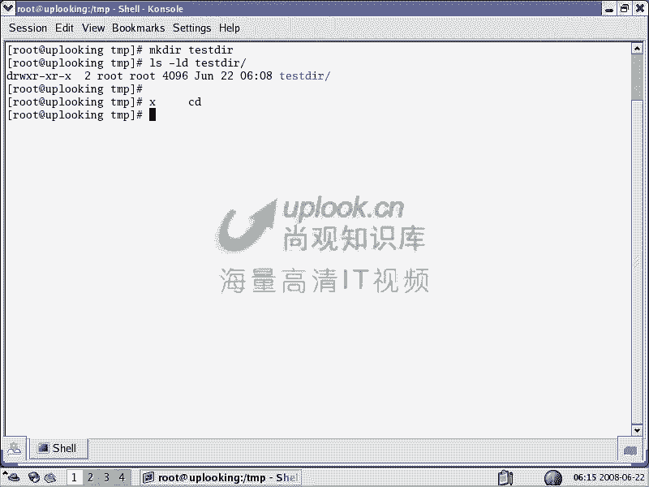
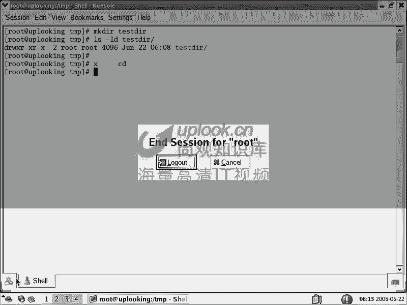
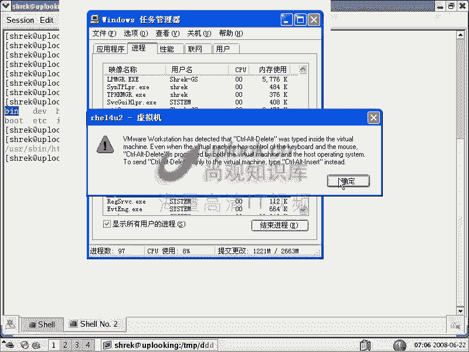
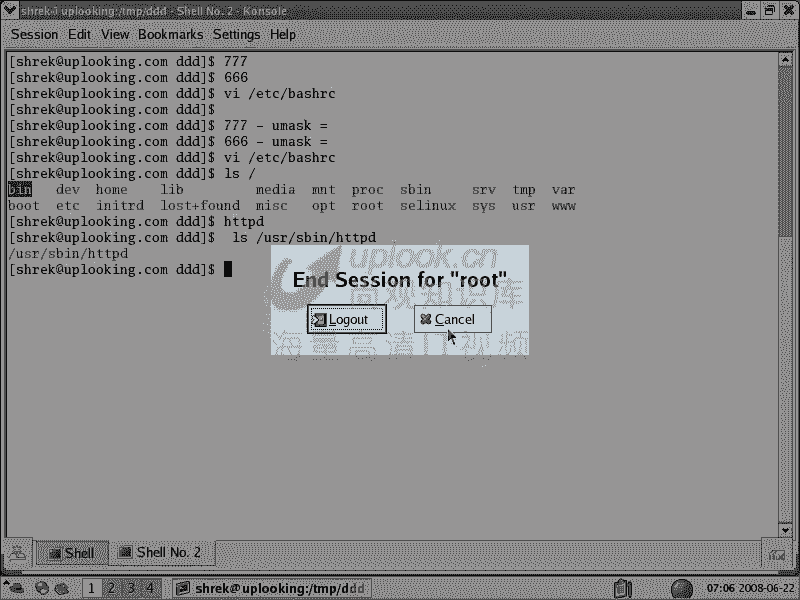
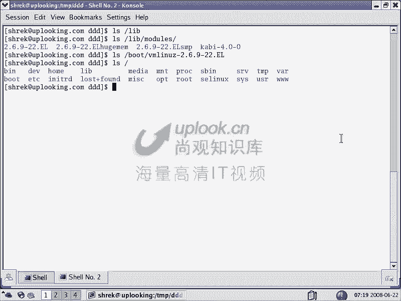
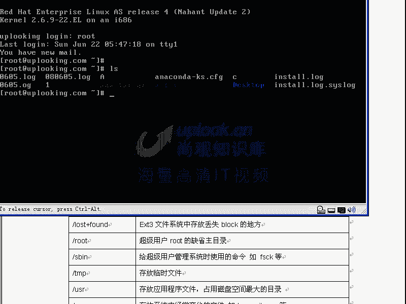
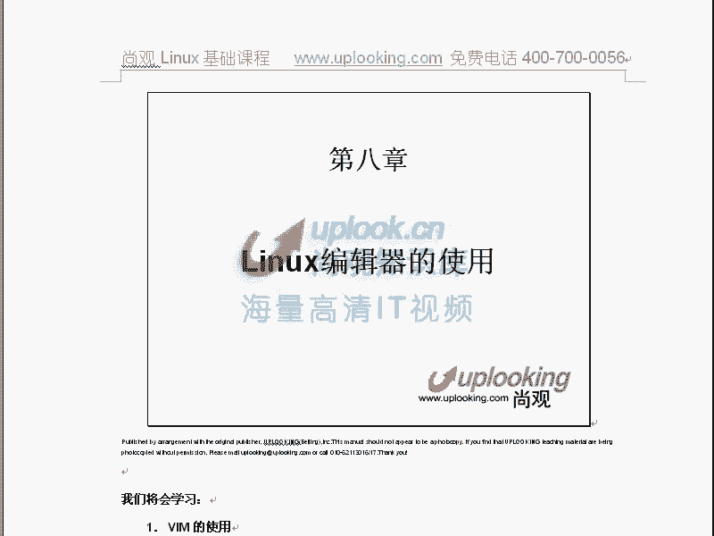

# Linux基础教程：07：文件夹属性、umask与目录结构 📂

在本节课中，我们将要学习Linux系统中文件夹的权限管理、umask掩码的作用，以及Linux根目录下各主要文件夹的功能和结构。理解这些概念对于安全地管理系统和高效地定位文件至关重要。

## 文件夹权限详解 🔐

上一节我们介绍了文件的权限，本节中我们来看看文件夹的权限。文件夹的权限虽然也用 `rwx` 表示，但其含义与文件权限有本质区别。

*   **x (执行) 权限**：这是文件夹最重要的权限。它决定了用户能否 `cd` 进入该目录。
    *   示例：`chmod o+x test_dir` 为其他用户添加进入目录的权限。
*   **r (读取) 权限**：决定了用户能否使用 `ls` 命令列出该目录下的文件和子目录名称。
    *   单独拥有 `r` 权限无法进入目录，必须与 `x` 权限结合使用。
*   **w (写入) 权限**：决定了用户能否在该目录下**创建、删除或重命名**文件和子目录。这是一个非常强大的权限。

以下是文件夹权限组合的典型行为：

*   **只有 x 权限**：可以 `cd` 进入目录，但无法列出 (`ls`) 其中的内容。
*   **拥有 rx 权限**：可以 `cd` 进入目录，并可以 `ls` 列出其中的内容。这是系统目录最常见的权限（如 `755`）。
*   **拥有 wx 权限**：可以 `cd` 进入目录，并可以创建 (`touch`)、删除 (`rm`) 目录内的任何文件（无论文件所有者是谁），甚至可以强制修改他人的文件（如使用 `vim` 的 `:wq!` 命令）。这非常危险。

## 特殊权限：粘滞位 (Sticky Bit) 🧱

为了缓解目录 `wx` 权限带来的风险（例如在公共目录中任意删除他人文件），Linux引入了粘滞位。

*   **作用**：在具有 `wx` 权限的目录上设置粘滞位（用 `t` 表示），用户将**只能删除或重命名自己拥有的文件**，而不能操作他人的文件。
*   **设置方法**：`chmod o+t directory_name` 或 `chmod 1777 directory_name`（数字 `1` 表示粘滞位）。
*   **典型应用**：系统的 `/tmp` 临时目录就是典型的 `1777` 权限，允许所有用户读写，但防止用户随意删除他人的临时文件。

## 默认权限与umask 🎭

当我们创建新文件或目录时，系统会赋予一个默认权限，这个默认权限由 `umask`（用户文件创建掩码）值决定。

*   **umask 的作用**：指定在创建文件或目录时，**需要从默认权限中移除**的权限位。
*   **查看与设置**：
    *   查看当前 `umask`：`umask`
    *   设置 `umask`：`umask 022`
*   **权限计算**：
    *   目录的默认最大权限是 `777` (rwxrwxrwx)。
    *   文件的默认最大权限是 `666` (rw-rw-rw-)（默认没有执行权限，出于安全考虑）。
    *   实际权限 = 默认最大权限 - umask值（注意：这里是位运算的“与”操作，而非简单减法）。

例如，如果 `umask` 为 `022`：
*   新建目录权限：`777 - 022 = 755` (rwxr-xr-x)
*   新建文件权限：`666 - 022 = 644` (rw-r--r--)

系统根据用户ID（UID）自动设置不同的默认 `umask`（如root用户常为 `022`，普通用户常为 `002`），配置通常位于 `/etc/bashrc` 文件中。

## Linux根目录结构解析 🗂️

理解Linux的目录结构（Filesystem Hierarchy Standard, FHS）可以帮助你预测文件的位置，是系统管理的基础。这是一种“可预知性”的设计。

以下是根目录下主要子目录的功能：

*   **/bin**：存放**所有用户**都可以使用的、系统**必需**的基本命令（如 `ls`, `cp`）。
*   **/sbin**：存放**系统管理员**使用的、系统**必需**的管理命令（如 `fdisk`, `ifconfig`）。普通用户的默认PATH通常不包含此目录。
*   **/usr**：类似于Windows的“Program Files”，存放用户安装的**非系统必需**的应用程序和数据。
    *   `/usr/bin`：非必需的用户命令。
    *   `/usr/sbin`：非必需的系统管理命令。
    *   `/usr/lib`：非必需的应用程序库文件。
*   **/etc**：存放系统的**配置文件**（纯文本文件），类似于Windows注册表的部分功能。
*   **/home**：普通用户的**家目录**，每个用户有一个以用户名命名的子目录。
*   **/root**：系统管理员（root）的**家目录**。
*   **/dev**：存放**设备文件**，通过文件操作来访问硬件（如 `/dev/sda` 代表第一块硬盘）。
*   **/lib**：存放系统**必需**的**共享库**和内核模块 (`/lib/modules`)。
*   **/tmp**：系统的**临时文件**目录，所有用户都可读写，通常具有 `1777` 权限。
*   **/var**：存放经常变化的（Variable）数据，如日志 (`/var/log`)、邮件 (`/var/mail`)。
*   **/boot**：存放系统**启动**所需的文件，如内核 (`vmlinuz`)、引导程序 (`grub`)。
*   **/proc** 与 **/sys**：**虚拟文件系统**，其中的文件并不存在于磁盘上，而是内核运行时信息的接口，用于查看或调整系统及硬件参数（如 `/proc/cpuinfo`）。

其他重要目录：
*   **/mnt** 与 **/media**：用于**挂载**外部文件系统的临时目录（如光盘、U盘）。
*   **/opt**：用于安装**第三方大型商业软件**（但许多开源软件不遵循此约定）。
*   **/srv**：存放本机提供的**服务**相关的数据（如网站数据）。
*   **/run**：存放自系统启动以来的运行时信息。

## 总结 📝

本节课中我们一起学习了：
1.  **文件夹权限**：明确了 `r`、`w`、`x` 权限对目录的特殊含义，以及强大的 `wx` 组合权限的风险。
2.  **粘滞位 (t)**：学习了如何使用粘滞位来保护公共目录（如 `/tmp`）中的文件，防止被他人误删。
3.  **umask 掩码**：理解了 `umask` 如何影响新建文件和目录的默认权限，并学会了查看和设置方法。
4.  **目录结构**：系统性地了解了Linux根目录下各主要子目录的用途，掌握了这种“可预知性”设计的思想，能够更高效地定位和管理文件。

掌握这些知识，将使你对Linux系统的文件管理和整体布局有更深入的理解，为后续的系统管理和服务配置打下坚实基础。