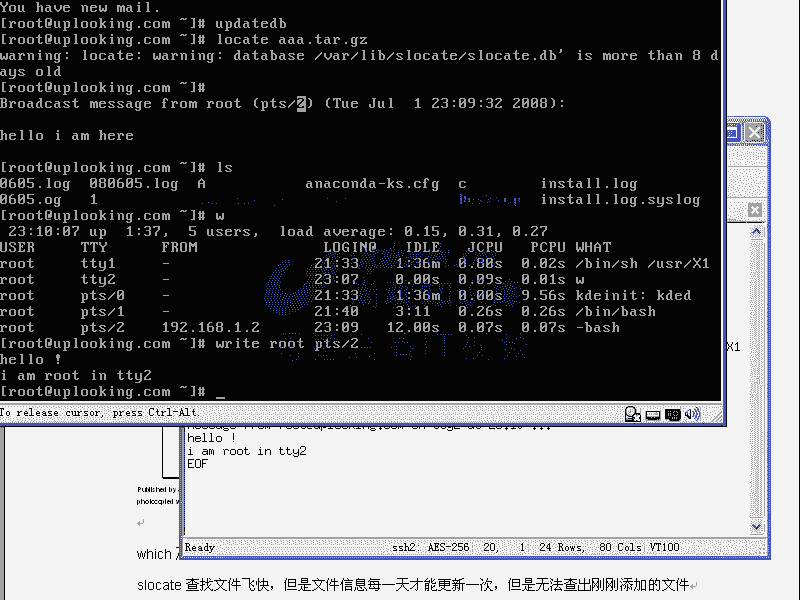

# 尚观Linux视频教程RHCE 精品课程 - P16：RH033-ULE112-09-Linux查找及压缩 - 爱笑的程序狗 - BV1ax411o7VD

今天的话我们跟小赵的话呢一块来录一下，就是我们的呃就是这部分的第九章的文件查找与压缩的这部分的内容。那么呃小赵的话也是难的啊，小赵跟大家打个招呼。大家好OK那么我们呢呃主要讲什么东西啊。

这张那linux里面呃，你的这个文件呃，就是一般安装的时候都是从网上down的下来，这种ta包是吧？ta包就taTARBALL就是求嘛，是吧？tata包，那么把它解开了以后的话，你要把它编译安装等等。

那实际上呢就是多数的话都是这原文档的话都是压缩起来的嗯。再有一种情况呢，就是说你现在它一个程序装完了以后，不知道放哪个目录像。在windows里面你也经常遇到这种问题嗯弄完了以后，这个装哪去了不知道。

所以这时候你需要各种各样的工具能去查找它。而linux下的查找命令的话，居然多达什么5个五六个。嗯，那你说不讲的话，不讲清楚在什么情况下用什么命令的话，这不是头晕了嘛？对吧？对。

O那这就是我们第九章要讲的内内容，那第九章要讲的这个内容的话呢，你看一下啊，我们文件的查找命令是吧？五6个，然后呢，这些不同文件的查找方法，不同的文件用不同的查找命令，他们之间横向的一个比较。

那再一个呢就是文件的压缩命令，这就是我们今天介绍的重点嗯，啊，O这就是我们的内容。那我们先看一下呢linux下的文件的这个搜索命令，那我要想搜索这个文件的话呢？应该有这么多命令。

那么第一个我们看一下which。Wch这个命令呢，它主要是查找可执性文件。什么可执行文件呢？经常我们输入一个命令是吧？比如说LS命令哎，输入个VI命令。对吧然后再输入一个。比方说touch命令等等。

那这些命令的话呢，到底它在哪？你想去你想知道吗？在当前目录下的话肯定没有了，这里面有LS吗？没有是吧，那么你怎么去查找他？Which， which I。哎，这个LW命令呢，它有点这样的好处，就是什么？

它能告诉你最终你执行的到底是哪一个命令。你想一下，我现在有个LS命令是吧？嗯，那我在这个目录下也有，在这个目录下也有个LS命令，你说先执行哪个？whichch能告诉你，所以这是wch的优势。

所以他一般都是查到可执行的命令。明白吗？嗯，那这里面的话我看LSLS的话，我们平时执行的时候，大家看是有颜色的，对不对？对，实际上原本LS是没有颜色，然后我们直接执行它，并且在LS。有颜色吗？没有。

那那为什么有呢？因为话我们执行的是一个Aience，就是一个别名。我们输入的LS实际上执行的是LS杠杠color的东西，对吧？明白吗。那么这个地方再去执行LS的时候呢。

它就是执行并且的什么LS这个命令了，相当于我们执行那个什么并且的LS杠杠什么color。等于TY是不是？这相当于是你完整的一个执行方式，完整的一个执行执行过程。那么他会告诉你这个过程。那这种which。

那一般的命容他会告诉你，哎，那个地方有个RS命令，这个目前还有个RS一共七8个L命令执行哪个？说不清楚，对不对？所以就是which的好处。那么呃也就是说这时候的也破破解了。

就是你为什么LS在执行的时候是有颜色的呀，实际上说你应该是没有颜色的对吧？然后再一个呢，就是说我们看假如说呢你要呃这边顺面提句啊，如果要是你希望你看目录是蓝颜色的对吧？

然后呢呃就是说有你比方说有那个呃有X权限的，它是绿颜色的压缩文件，它是红颜色的对吧？那这边有颜色，你想去改在面它的颜色的时候，你可以改这个文件VIDTC下的什么呢？DIR covers。啊，改这个文件。

那我linux里面的话，小赵的话呢，前几节课没有听是吧？等我在这边的话重复一遍linux里边你要不改这个文件，它下次重新启动时候是不是不生效？对，所以的话呢你在这边改跟windows不一样。

windows左点一下，右点一下，可能下次重新启动是生效的，对不对，但是那个的话它是把配置保留在注册表当中的。嗯，自动保存。但是在linux里面你不手动去改的话，它就不生效。所以你要想手动改。

那么你想你想永久的更改，那么改成个DR colorsors。他这边告诉你说什么。你方说呃。目录啊，它是0134的这种颜色，这实际上是蓝颜色的嗯，你把它改成32，那就是绿颜色，明白吧？

这边就是各种各样不同的颜色的代码。你可以试试看嗯啊，你就可以改这边这个代码，然后最后保存退出的话呢，就可以每一次LS的时候，它的颜色又不一样的。因为是取决于这个配置文件，嗯，明白了吧？明白了OK呃。

那么我们现在在看啊，在在这样的一个情况下，在这样的一个情况下，那么我们说LS呢，我们这个整个的执行过程中清楚了。那么我们再举个例子，比方说which。Color NH。

VIM啊which VVIVI那么我们平时执行VIM的时候就是执行的US而且它并且的VIM对吧？嗯然后执行VI的时候呢，实际上是VI等于VIMVM是在这个地方。

它是不是就把整个的执行过程的话就给你列出来嗯，也就是你最终输入VI实际上是执行的什么VIM嗯，这点的话，在HEL5里面不是这样HEL5里面，你输入VI就是VI如果输入VIM它就执行VIM它没有这个A。

就没有这个别名明白吧？所以whichch的话给大家说清楚了。那我们现在再看例子，在当前录像，我touch呃看一下有哪些文件啊，当前录下是不是有个呃，比方说0605，哎，不是这边AA点踏点JZ是吧？嗯。

只有这个文件，那我这样的which。比方说AA点t点GZ是不是？能找到吗？no这个文件in什么这些目录当中是不是？他也说的很清楚，他首先说他自己没有找到嗯，但是说的不是说这个文件不存在。

而是说不在执些目录当中。明白吧？那么也就是说明说什么呢？为itch的话它只会搜索指定的目录，这些目录的话都是放可执行文件的地方，但是呢不会搜索当前目录嗯，明白吧？也不会搜索你指定的目录，他只搜索什么呢？

那个pass就是说呃ecle dollar dollar是取出变量的值来PAATH在你的这个路径当中，这些目录，它会搜索其他目录它不会搜索。也就是你执行这个文件的时候，执行这个命令的时候。

它会搜索哪些目录，他就去查。但是他不会搜索。你任意选定选择的目录或者当前目录，明白吗？他只搜索一些就是说你特定指定好的目录，这是whichach。所以呢那现在的话呢，比方说我现在有一个成有一个文件。

我要查找，你想用W去查找，那么除非它是可执行文件。否则还是啥查找不到，对不对？对，是不是这道理？OK那么现在看。呃，比方说呢现在这样的，我输一个大写的X，这个X的话呢是一个可执文件。

那我们是应该能查得到which。X他告诉你呃，X的话是在USR下的X11R6当中的并且的X是吧？它可以执行的。但是如果你查找一个库文件，或者查到一个什么东西，你能让我们看一下L拉D录下的话。

有这么多库文件是吧？那我们看一下这个这个文件的话，在哪？我们想用位来查找一下。肯定也没有嗯，查找不到，所以的话它不是一个普遍查找的命令，嗯，就是一个可执行文件的什么命令，对吧？回过头来我们再看啊。

回头来我们再看那么where is where is的话跟which的话很相似很相似，他查找的东西呢是差不多的where is查找东西差不多的。

你方说where is l他会告诉你说什么在并目录下LS是吧？嗯但是他要告诉你什么呢？比那个W的话还多什么就是说你的的man page就是你的帮助帮助是在哪个目录下，你看看明白了没？

这是不是man page所在的目录man当中的man一当中的什么L一点一点Z对吧？这是不是个 page是不是帮助所where is的话呢，它是那个which的话多了一个什么查帮助助，帮助到底哪个文件。

这是where is但是它的位置查的都是可执行的如这。件话在其他地方，比方说刚才这个地方。对吧位置是不是查不到？对，那么VI is能不能查到？哎，表R意思是可以查到。よし。太强了。砸了是吧？你看。

像什么where isA点刚他也查不到是吧？现在他查不到。但这个库系统的这个库的话，它是能查到。嗯，他告诉你在这个里面，但是呢它跟呃which的话呢是差不多的。就说它查找的目录的话跟W的话略有点差别。

但是呢一般来说话也是不包含所有的路径，但是刚才这个库的话呢，显然是可以这点的话属于我失色啊，原来的话粹就是演杂了。那么大家呢也由此的话呢可以感觉到where is跟which的一点点区别。嗯。

但是呢呃一般用where is的话还是少嗯还是非常少。因为它也不是查找所有的目录。你看这个目这个文件呢能是查找不到对吧？对，然后再看。还有什么呢？S locate或者locate。

那么S locate或者locate呢它是一样的。就是我们这边输入一个什么呢？whichitch啊 locate。那么他告诉你是在这个目录下是吧？嗯，然后呢，我这样的LS一下LS是不是要列出它呀？嗯。

然后事先是不是要执行的which呃lo是吧？我这个地方的话加上一个什么反引号，就是说ESC下呃，就是ESC下面那个反引号，嗯，ESC下面那个，然后直接回车，那么就相当于我把它列出来了嘛嗯。

然后呢再加上一个什么哎杠L，那他告诉你这个文件的话呢，它实质上是Slo的一个什么软链接。所以的话你输入什么locate还是Slo是一样的他查找东西的话，就非常快。你刚说lo，而且是全部都查找。

你说我要查找什么LS相关的那他告诉你LS相关的，这些全部是查找，整个的有LS命令呃，有LS字样的，所有的路径全部都显示出来。你当说我现在LSAAA点点JZ那这时候他告诉你，在这个哎不是LS啊。

Locate。Yeah。他这边的话出现一个警告，他没有查找到嗯，是吧？为什么没有查找到？他说这个数据库啊。已经8天没有更新了。因为我查这个文件，它跟这个数据库有什么关系？你刚才看到他查的速度非常快。

对吧？实际上呢他并没有查真正的文件，他是查什么他自己的一个数据库。而这个数据库呢，如果要没有更新过，那他这个当前不能访问当前这个文件，你现在比方说刚刚装了个软件，这个软件里面包含在100个包是吧？

100个程序，这100个文件放在这个系统当中，结果呢你现在用locet去查是查不到的。嗯，因为这100个文件并没有放在这个数据库里面去。这个S locate的数据库里面去。所以的话呢现在他还是查不到。

那你说老师你刚才不是说已已经能可以查到了吗？对吧？所以这时候呢你可以运行一下什么update dB这时候呢它就更新一下这个数据库。所以呢他们两个的话是配对的market和update DB是配对的。

那么updDB的话用来更新这个数据库。这个数据库更新了以后的话，你它就能查到。呃，你小赵，你是不是觉得这个东西很无聊，就是这些命令用来用去很无聊，不是挺好玩的，挺好玩的。

那因为的话呢就是一般人来说都会觉得这个学这东西有什么用啊，好像感觉特别枯燥啊。实际上呢你在操作这个系统的时候，你不是用图形界面去操作的。嗯啊不是现在我们多同心界面，那纯粹就是这样的画面。

在样的话，那我现在问你来，你给我找一个文件。你该怎么着？搜索对要有那，你可以up faceDB是吧？对。然后把当前的所有的目录数更新一遍，是不是？嗯，然后接着再怎么样。

接着再locate去查找一个A点叉点JZ，是不是它可以查找到是不是现在的话还没有更新完啊，还没有更新完，所以这边的话是看不到的。这是文本界面。那么想象一下你在windows下是不是可以去控制它嗯。

对吧对我们都想，比方说在这里面。我看一下。诶。

Right。OK现在的话呢，你比方说我用这个windows下这个工具啊去连接那个服务器。你方说192168。1。231啊。看一下。我去连接他，然后呢except，然后输入一下他的密码。

appingO那么我在windows下是不是连接这个地方，嗯，我在这是这是windows下的一个程序啊，这个程序的话用SSC来远程连接这个服务器，也就是远程连接这个服务器。嗯，明道吧？你们信说哎。

不对吧，那你看一下啊，我这样W2给所有人发一个消息说什么？helloI。

呃，RM1呃。I am here。是不是所有人没发到，他自己也能收到是吧？嗯，这个是不是也收到了？是，所以的话呢在这些界面里面的话，你去查找文件是经常的事情。嗯，对对对，所以这个是比较有必要的啊。

这边的话呢我先把它关掉EXIT是不是退出刚才这个然后我是在windows上去连它的嘛？你个是不是W，我是不是在1。2这台机器上去连它？

是不是在这个地啊？我是在这儿。那么另外呢这个这个控制台是TTYR嘛，刚才我问的是TTYR，然后呢你念一下W，是不是我是TTYR是这个地方的对，这是我嗯，是吧？那么我想给他发一个消息。

给这个这个地方PTS杠2的这边发一个消息，我是在TTYR就是说在这个地方看吧？他是不是在这个地方，对，那么我要是我在这个里面想给他发一个消息，那么我这样的right。

就我们讲过的啊嗯。right呃如此在什么呢PTS杠2上是吧？然后呢回车说什么hello。诶。I am是吧。嗯。如uch in什么TTY2嗯，对吧？你看它下面是不是跟着去变的。是不是这边是会变的？然后呢。

我们这边ctrl加D表示输入结束。ok那他这边的话就什么。好，结束了。那你说。你你觉得这东西是。我们在干嘛？好像在玩一个游戏是是是吧？是，那么。把这个地方你看这个地方的话。

是我们的一个windows的程序是吧？对，这个地方是我现在跑的一个小的lininux系统，是个虚拟机是吧？假如说它不是一个虚拟机。是希浪的一个服务器。

那么你的平时的管理是不是通过这样的一个远程的方式去维护着这样一个服务器，是，对不对？对你想一下，你比方说哎，我们现在看你假如看不到那个东西，看不到那个东西，光看到这样的一个嗯，光看到这样。

是不是我现在连到服务器上。对我去管理它。嗯，那是不是都这种方式去管理的？都是一种方式管理。你那现在我想说，哎，你刚才装的软件装到哪去了，你给我查一下。

你刚才不是 download了1个AA点太之内的包吗？那现在应该更新完了是吧？嗯，locate是吧？AA点。点JZ是不是？对，能查找到吧，可以。是不是在这儿查找到了？嗯，所以的话我们现在讲的这些命密啊。

都是未来你要管理服务器的基本的方式。嗯，千万不要认为说这个命令很无聊，我用图形界面也可以做。那你告诉那那我告诉你，你说现在这个情况的话，你现在在管新浪服务器或者百度的服务器。那他们这些公司的话。

全部都是在用lininux的。那你怎么管，那都是这种方式去管，明白了吗？明白了。好，那么现在的话我怎么退出它呢？EXXT退出来就好了。

这就是一个就是secure CRTsecure CRT这是一个主流的管服务器的这样的一个呃，就是用SSE就是客户端windows下去管那个linux服务器的这样的一个程序，非常简单。明有吗？

只要那边的SS服务打开就好了，O把它关掉了。那么接下来的话我们再看啊，接下来我们再看呃，回到这里面来，我按al加F7al加F7就是到我们的这个图形界面上去了，嗯，对吧？我这边做这个图形界面目的是什么呢？

做这个图形界面是目的是好录像啊，跟那个平时我管理的话是没有关系的。我不用这个图形界面照样可以怎么样，很好的把它管理好，明白吗？明白了嗯，O那现在的话我们搞清楚up的up dB的话已经更新完了。

然后现在的话你再去locate的话，它是能查找出来。如这么么录下这样一个文件，对不对？那么我刚才进行的upB是吧，这了很长时间，是不是对。😊。

平时把你的服务器在那边放着，你平时执行upDB吗？你不会去执行，会对吧？对。没事干，想起来的执行up这个很少。所以的话它实际上是在系统的计划任务当中，每一天的4。02分，凌晨4点02分自动执行。嗯。

在这个cme里面，就是在计划任务里面，在linux里面的这个cown啊，在这个地方呃，你看一下catETC下的cown点ba。Cme点 daily的话呢，就是我们每一天都要执行的一个计划任务。

在这里面的话有众多的文件，也就是这里面的这些文件每一天晚上4点02分都会被全部都执行一遍。嗯，其中是不是有个update看这边有个是S located点chme，嗯，你看看它，你看看这边是不是要执行。

up对啲啲啊。看到吗？嗯，是是吧，是这是他就在执行upDD。也就是每一天晚上它会自动帮你执行。那你今天的话新装的软件能不能查找到？呃。现在还不能对，所以你除非你手动运行一遍。嗯，对对不对？对。

那你会发觉哎，linux这么麻烦啊，太土了。实际上windows里面它也是这种机制，只不过他不告诉你而已。你不同的查找方法，它有的是就是特别的嗯有的有的情况你去查找的时候。

它是特别的那种呃给你踏踏实实的把文件硬盘上每一个文件都搜索一遍。也有的时候呢，它就直接通过缓存去查。而这个缓存呢就跟这个upDB出来这个数据库是一样的，明白吧？明白。好，O那么现在我们这个up dB啊。

upate dB和什么locate或者是什么S locate，它是不是一对的？对这个机理搞清楚了吧。嗯嗯那它是不是查找所有路径的呀？呃，是对，好，呃，小赵的话要比小芳强多了。小芳已经被我毒打致死。

前前几天的话，我讲过的东西，他老是忘，然后就被我毒打一顿。こ。看我们在此默莫为他默哀啊。开玩笑，那么这边的话呢我们讲了三个，这三个好像都别别扭扭的，嗯嗯，是不是？没一个是真正去贴心的给你去查找。

踏踏实实给你查找，对不对？对，所以呢这时候我们找到一个ff是真正去查找。嗯，他呢就是说呃你现在让他去查找，那么他就有什么踏踏实实去查找f，但等是比较复杂的一个。

你要说现在话f啊NIA点t点JZ那他直接就查找到了，是不是？对，但是呢这个时候他是从当前目录开始查找。嗯，你比方说你在别的目录下，你比方说你在后目录当中啊，12目录下，那么里面我看有一个。C文件啊。

我给他touch一个文件嘛。1分钟下我踏一个什么呢？呃newel。点TXT这样一个文件，它是个new file定。然后你放。他是不可能查老大的。嗯。因为什么呢？因为fo子的语法并不是这样去查。

fin是这样的，你输入一个fin，要告诉他一个路径，然后我从根开始查，也就从相当于从C盘这个底最底查C查查C盘下所有的文件是吧？那么现在下的话，这边就是什么？从我的这个最基本的目录开始查。

查整个的目录数，明白吧？然后呢你还要告诉他其他的name名字为什么new file点TST。啊，这个时候呢它就会整个的硬盘的话就开始动了啊，滋滋滋的话去响啊，硬盘的话就吱滋响，那么大家可能听见。

我是能听见的啊，那么这时候的话呢，我cttrol加 C把它结束掉，这时候它就是踏踏实实的从根开始查找一个名字为什么这样一个文件的。嗯啊，你说哎这个文件名号我记不太清楚。我记不太清楚，那该怎么办呢？

你得从根开始查找是吧？new file哎，这个文件名的话，我忘了什么，那你可以加双引号，加上一个新星是不是代表任意多个任意字符啊，再加上一个什么新啊再加双引号。

就上呢所有new file这种文件全部都会显示出来。嗯，明白吧？这是饭的，你说饭的好用不好用？嗯。比较好用比较好用，但是比较慢比较慢是吧？说的非常好。饭的话呢从根开始。开比确实比那个小芳要强很多。

小芳的话那个打死你是不冤的啊。没有那么就是说。确实查找的时候呢，就是说它是比较慢的。因为你想一下一个硬盘啊，它是最慢的设备。嗯，而不是说就是不是说整个系统里面最慢的。

而是经常访问的这个设备当中最慢的设备。内存是不是要比硬盘快很多。对CPU要比硬盘快很多。快什么呢？几百万倍几千万倍。硬盘的话呢，它是最慢的设备，所以你要整个搜索一个目录数这是很难的。嗯。

所以呢这个时候泛呢它的效率是最低的。但是它的功能确实最强。嗯你比方说我看它呢想去查找一个new file这样的文件的话，它必须得要这样加杠R加正格表达式单引号引起来点新new。fill啊点心。

那这样的话呢，你才能查找，就是所有new file开头这种文件嗯，查找速度多快，对，是吧？因为我们在创建这个new file的时候，点TSC的时候，是不是已经updupdateDB完了。对，是吧？

所以他现在还是查找不出来，是吧？但是我再说一遍up date dB。那这个时候的话等一下去查的话，它的速度就非常快嗯，是吧？对。而f呃而范的面令的话，它就会怎么样，踏踏实实的给你看。

他把整个目录数话全部查遍，它不用正则表达，你看它这边直接就是星是吧？嗯，星代表任意都是任意字符嘛？对，但是呢这边用正则表达式，正则表达式的话要加个点表示任意的一个字符。星的话代表什么？任意多个点嗯。

这个星的话代表任意多个点，明白吧？任意多个前面的字符，如果加上A星A星的话，就是任意多个A，有0个A，1个A，两个A3个A。如果点的话就是任意多个点是吧嗯。那么任意多个点。

一个点的话代表任意字符就是任意多个任意字符。所以呢在正的表达式里面，点心跟在那个通配符里面的这个星是一样的。他们俩用的东西是不一样的。嗯，他们俩用的这个表达方式是不一样，被阿DB完了吧，是不是啊？对。

然后再再搜索一下，能不能搜出来，可以。是不是嗯哎速度快不快快啊，让饭子的话给你踏踏实实打。师等。所以fd的话在这点上的话呢，它是要更慢一些，但是它的功能确实非常强。那么fd从任意的一个目录。

比方从ETC目录开始查查名字为什么呢？啊，名字为带network这样的一个文件。那么前后的话我都不限是吧？前后都不限，再一回车。那它这个ETC目录下所有带network的这种文件全部都列出来了嗯。

是范着来查找。是吧对。这样他查找出来以后，他能决定你干什么，对这些文件做什么。你比方说我这些方式就是显示出来这些文件的话呢，并不是特别的并不是特别的那个清楚。

那我这边加上一个什么杠LS我想把它用LS杠L的方式列出来，这是它的一个选项，明白吧？嗯，加了一个选项，这个选项的话就是相当于LS杠L，然后呢，以长的方式去列出它们。那这样的话，你看你会知哎。

把这个文件整个的一个情况全部都列出来了，这是一个network这样文件嘛，嗯，对吧？对，那么也就是我可以加呃这样的一个方式去非常方便的去那个找到任何的文件，而且对他呢进行一些呃进行一些操作。

那么这个LS的话是非常简单的操作，我还可以做其他的，怎么做其他的，你看一下呃，我呢放的呃这样的一个文件。那么我呢还可以呢加EXEC。去执行一个什么呢？fill命令fall命令的话呢。

就是说我如果要是这样的啊，fill呃。ETC下的他做了，那他会告诉你这个文件是一个什么文件，嗯，对吧？对，那么现在我这样的呃，杠EXECfi。然后呢，但这个比较复杂，很多的话有特别多经验的管理员的话。

他都不太明白。那么这样的加上杠再加这样，可能你记不太清楚是吧？嗯可，是不记得有点不太清楚。但是呢呃前面的话我们是清楚的是吧？对，前面讲清楚了吗？

加个杠EXEC是不是能么清楚嗯就说我后面要执行个程序嗯执行什么程序呢？刚才我是不是演示了一个fill命令啊，对是吧？

fi命令是吧fi命令后面是不是加上一个加上一个文件那我刚才是不是在这个地方可以查找出来这些东西那么也就是说把查找出来东西，放在大括号这个地方，大括号代表查找出来的路径明白了吗？明白。

那么必须得要以一个空格啊，这个地方要有个空格空格空开，然后呢一个斜杠一个号我为什么要这样呢？我到时候再讲的时候的话，会给大家详细讲，但是你们现在要死记住什么大括号代表我查前面查找出来那些路径。

那些路径放在这个地方，比方查找ETC目录下有个什么paword啊比方说ETC目有个swordETC上目录下有个network文件那这个就会把ETC下work放在这个位置。明白吗？明白。

那么最后还必须得一个空格结束，然后呢一杠，然后呢一个号号必须这样，然后这样直接回撤。哎，他会告诉你说什么，这个文件是吧，它是一个。shall的脚本可执行的嗯看到了吗？而这个文件呢。

它是一个什么阿斯克玛的英文的文档，你看到了？这个地方的话它是一个directy，是一个目录是吧？对，这边的话是一个什么shall的脚本嗯啊，这个地方的话是一个阿克玛的什么英文的文档。啊。

阿斯玛文档directy阿斯玛文档阿斯玛文档阿斯玛文明白了吗？明白了，哎，方便不方便方便。那现在这样的，我想去查找出来这样文件，我想把他们都删除掉。可不可以啊？可以你千万别回撤，一回头系统文件就完了。

所以说你要对他进行操作的时候，你最好是怎么样在这个地方的话，你找一个目录来练，不要找系统人都说linux动不动就了，实他不会操作，他把这个东西一删除完了，然后他说这个网络为什么启动不起来能启动起来。

叫有鬼现在查找一个什么名字为什文件X执行RM删除操作RM删除现在要执行的不是fi命是M命我回撤，那这个文件就没删除掉但是呢我现在还没有回撤没回的话，在执行这删除命。

耽误其他人你说我本来要删除这两个文果删除10个文件不知道这个目录下那么多文，他在执行的，他说有些我要删除，有些我不删除。😊，那你可以把它改成什么？O。哦，那这样一飞车的话。

他会说当他要执行这个命令的时候，他会说你要不要执行他，如果你回答Y，那就就删除了。如果N的话就是什么不删除删除嗯，明白吧？明白，那这样的话呢，他就会比EXEC的话，稍微温柔一点。

EXEC的话就特别狠对吧？对，啊，但是呢你想OK如果用O的话，是不是要你人为的话去跟他干预。对你是不是要人语的人为的干预。对，那这个能不能放到需要脚本那面。比方说每天半夜自动执行一个清理命令，嗯，是吧？

可以可以吗？用O还是用EXEC应该用。每天凌晨2点钟，你要把系统当中某些文件全部都删掉啊，每天晚上要执行一个这样的删除的命令。那么你半夜爬起来摁Y呢？你要不要看起来弄呢？你不不会不会的话。

那你应该用哪个命令EXEC对啊，那用EXEC的话，就是说你不用去怎么样。不用引起来，不用你去跟他交互了，明白了吧？所以EXCC是不需要交互，而OK的话是需要交互的。你看这两个区别了吧？格式都是一样的。

这个大括号那两个大括号是吧？然后呢一杠一个分号是一定是这个样子啊，O那么f的命令的话，它确实非常强嗯。这个可以你可以想象一下，你刚说在windows里面，你可以右击某个目录，说我要查到某种文件，然后呢。

查找出这些文件以后，自动帮我打包，自动帮我邮寄。你有没有这个功能？好像没有。对，那所以说lindux好用还是windows用，很多人都觉得windows好用。但是实际上在管理的时候。

我也觉得windows好用windows干什么时候好用呢？它这个通行界面非常方便。对，但是lindux的话呢，他在做这些事情的时候，如果你对需要的话非常熟。你发觉的话呢。

它有很多地方要比windows还要出色。嗯，尽管的话你要记的东西非常多，但是呢你要知道啊，小赵，你要知道你是一个什么系统的人，就搞系统的人，就是搞我们这个IT技术的人，你不是一个普通的。😊，普通的人。

如果普通人的话，我建议你用windows算了，嗯，或者用一个通音界面比较好的lininux。嗯，但然如果要是你是一个搞技术人，那你就lininux。因为他很多地方要比呃要比windows要强，嗯。

比比你用那个通音界面要强很多，明白吧？可。我说这还没完啊，你也为完了，我觉得轻松了，还没完。放着的话，这边我们刚才查找什么文件名字，是不是啊？对，但是呢我们看一下LS加L，那么你列出这个文件了以后。

这个文件这个名字只是一个属性是吧？嗯，它还有权限是吧？对在这个最前面权限，这边是文件的类型是不是嗯，文件的权限，文件的link是我文件的拥有者拥有组。啊，文件的大小，文件的更改时间。

这些属性全都可以进行查找。也就是你可以根据文件的大小去查找。可以根据文件的类型去查找，可以根据文件的拥者去查找。嗯，嗯，那你比方说我现在所下f。

我要从后目录开始查找一个什么用户为什么shack这样的一个文件。那这个文件查找出来以后，杠什么然S全部列出来，是不是全都是sha嗯文件是吧？那么我要查找一个什么呢？呃文就是用户为sha。

但是呢同时啊你可以杠 a and嗯and呃杠groupgroup为也为shack的文件。那么其他文件的话不要列出来。那这样的话呢，你看刚才的话呢就是有一些sha文件。

拥有者为什么shack用组为shack切是吧？嗯那么现在这些文件的话呢，就在这里面在我这边查找的时候，这一遍查找的时候，这些文件就不见了。看到吧？所以说你可以用杠A是and是吧？对。

那么R的话应该是个什么？杠A是N。如果要是这两个条件是货。哦，港欧啊，非常聪明啊。啊，确实比小芳要好很多啊。小芳的话呢经常让我喊的哑痒呀。那么杠O的话呢，就是outO就是说可以是个条件，也可以那个条件。

你还可以把更多的条件串起来。你还可以把更多的条品串起来。你能说什么？我现在的话呢呃我不能我不找文件夹，我就找什么文件TYPE啊，杠O杠TYPE类型为什么文件。啊，如果光找目录，它类型为什么陌录目录啊。

那么这样的话，它就是什么呃，说用户拥有者的话，啊这个文件的拥有者为12，或者是什么拥有组为12。啊，或者是什么呢？啊，错了，这个地方的话错了，我再加个A啊嗯杠A啊。

and那它的这个目录一定是一个目录的时候是吧？这样的时候呢，它就会把它列出来。如果我想LS杠L去列出来LS杠杠LS是吧？这样的话它就会列出来。那么这样的话。嗯，TYPT这边杠杠EXEC啊。L。

杠 l d 啊。然后呢，这样的话是能掌握他的格式了。耶。不人砸了。嗯。TPT。这些参数加累加的时候，可能还要加其他的东西啊。唔し。这个我觉得应该是一个bug，应该是bug。

当然这个TYPE后面的话可能把它当成一个参数，就是当他自己的一个参数。那么现在我们看啊。这点的话呢，我没有就是在这个这次操作的时候没有给大家呃解解答出来。但是呢我没有时间去琢磨它。

那么在linux里面这种事情是很多的。那么所以的话你做一样事情的时候，一定要反复的验证。如果验证成功，你要是写个需要脚本，那么验证它成功那你多做一次测试一下，这样的话才行，经常会出现一些莫名其妙的问题。

但是呢基本的功能的话呢，它是应该是不变的。但是你要是做一些事情的时候不符合你的这个期望，或者说跟你预期的不太相同，你要仔细分析它才行。嗯，啊，我觉得这个范的话，我们给大家说过了，那么杠user的话呢。

是呃就是说我们这样fin首先的话是一个目录对吧？对，然后呢你可以什么杠user杠TYPE是吧？杠 name杠group，然后呢杠。PERMPRM创是权限啊，权限为什么什么的时候，然后呢。

杠呃你比方说大小。呃，s对大小。然后呢，杠M time更吧时间就以这些条件的话作为一个依据，就跟我们这样LS看到的这些文件的属性是一样的啊，就是你可以任何的这个属性的话呢来作为查找的呃条件。然后呢。

在查找出来以后干干什么呢？就是把这些东西以这些条件的话去查找，查找出来以后干什么呢？Okay。杠O。啊，杠EXEC是吧，杠LS做这些事情，所以这些都是它的属性嘛。明白吧？那么我现在再做一个例子啊。

大家如果要是在哪个地方，如果要是没有看明白的话呢，你可以暂停一下，我慢慢看看。那么再做一个例子，做一个什么例子呢？我们这样的LS呃，我这样的fin从后me目录下去查找。

查找一个权限为就是说整个的根目录下啊，从根开始不应该有任何的一个目录，所权限为什么777就是others可读可以可执行啊，那么这样的话，我PERM。那么它首先的话是呃权限为什么呢？777是吧？嗯呃。

这边的话呢可以做加号或者减号。加号呢它的权限范围是非常。多的717的话呢表示RWXRWXRWX3个地方都是就9个地方的话，全部都质1嘛。嗯，如果要是你这边是加号的话，表示任意的一个地方质1嗯。

那它就会什么显示出来，它就会查找了。所以它我们这个地方的话，应该是什么？这9个位置同时质疑嗯，也就是说呃这边你要方说如果要是我这边是加717的话，那么这每一个文件都是符合的。嗯。

因为他们任意一个地方都有一个地方质1嘛。那这个地方的话质一吧，这个地方质一了是吧？但是如果要是我用减号的话，减77的话，那它就是什么必须是RWX。RWXRWX那么现在这里面呢就没有一个是符合要求的。

明白吗？明白，77的话呢是呃三个十进制的数把它转换成二进制以后，七转换成二进制是三个一嘛一嗯，然后呢，第二个7转换成二进制，也是三个1。那么就是说三个7，那转换成二进制以后就是9个一。嗯。

那么加就减减去7表示这9个一全部都是一。嗯，明白吧？明。好，那么接下来的话呢，杠A啊，你可以给你加杠A默认就是杠A。嗯，那么就是说什么呢？TYP类型为什么呢？No。啊，这样的话呢，我列出它来。

我看一下啊。这样的我用简啊，那么用这种方式的话呢去列出来。那么我从都当中去查找所有的目录。那么目录的权限，如果是77这种危险的权限，就是系统当中不应该有这样的权限啊，如果按这样的一个文件夹。

那么我把它列出来。嗯，这是经常做的。你比方说你入新检测啊，你系统的话哎我系统会不会被别人黑掉，或者说我这个系统当中有没有漏洞，很多人都求助于什么呢？这些什么软件实际上你完全可以自己去搜索。

这样一搜索以后，如果这个目录的权限为77啊，那它不对近啊，这个目录怎么会77呢？那为什么任何人都可以去读写执行呢？那系统原本的话有那么几个目录，如果要是就是这些原本的这个目录的话，不是那几个了。

多了几个，那显然你的系统上就出现问题了？嗯，那你看现在的话查到出很多。当然这些目录，你看大部分都是TMP目录是吧？而且它的权限不是777啊，除了这个目录之外，是77，这是我自己创建的，看到吗？嗯。

TMP目录下的DB你看这个目录名字傻乎乎的，我自己创建的，在给大家演示的时候创建的嗯但是其他的目录全部都是什么？这边RWX是吧？RWXRWT看到吗？嗯它实际上是一个什么1777的权限。

也就是说它这期这三个7的话是之一的。嗯，但是呢它前面还有个什么？1啊就是这个有个多余的权限。这个权限的话呢，我在讲默录的这个权限的时候，给大家讲过了，就是这个期的话呢，相当于一个粘贴位。

它把这个77的权限实际上降低了降低的要求了，明白吗？比如所以呢这个地方的话实际上是什么？就是说是1777的，也就是系统当中话，不应该有77的这个文件夹，像我这个的话就是我的失误。

嗯如果要是你在管理个服务器的时候，你经常这样一搜索，一看有这样文件夹，应该把它删掉。除非这个文件夹有存在的理由，那么不应该是什么完全的赤裸裸的77。那么你至少应该是什么1777的权限。

那么TMP录录就是这种要嗯明白吗？啊，那么这边的话，我就是给大家讲f的命的时候呢，又讲到了一个实际的例子。这个实际的例子就是什么呢？就是说你用这个用这个f这个权限查找的话，可以查找一些系统的漏洞。

是不是？系统的可能存在的隐患。然后呢在在winows里面。你你没办法去找嗯嗯windows里面没办法找吧。对，那么挺麻烦的。那么这些各种各样的条件组合在一起，在windows里面，你可能去搜索一下。

但windows那个搜索的话很很费劲。就是我经常的话发觉他有的时候是用缓存。有的时候呢是用那个真实的这个文件，有的时候查找一遍以后，他第二遍他就不好好查了。嗯，对啊，这种情况非常多。

所以呢在这里面的话呢，啊大家在学这个范的时候呢，就应该清楚啊，嗯非常有用。OK那么现在的我把应用历史调查。那么我们看一下刚才输入的这些命令是吧？嗯，那我刚才输的什么find去查找新的是吧。

文件那么find杠 name啊，大家可以在这个地方的话，按一下暂停键啊，好好看一下，那么也可以在这里面呃在这里面的话呢，看一下刚才我们讲的这些命令嗯，讲这些命令。我们从上面的什么which是吧？

到LS的那个配置文件是吧？对，然后呢，which他告诉你一个命令到底怎么执行的。然后呢，之后的话，我们说which的话呢，它查找是pas路径是吧？pass这个变量所代表那些路径，其他路径它不查找。

然后呢跟他。把它跟呃where is的话做一下对比，对比对吧？做对比，然后呢，用which和where is呢我们说witch是干嘛的？哎，where is干什么的？然后呢，接下来的话呢。

我们这边的话做了一个非常常用的这样的一个技巧。那么你可以用反引号，就是ESC下面的反引号把这个命令引起来。which locate是不是它会把这个loc这个路径呢显示出来是吧？对。

然后呢你再加上个LS杠L，你是不是能看到这个路径，你就这个文件它的一些属性啊。嗯那这样的话呢，你一条命令可以执行什么？你这样输入了一行，实际上相当于执行了两个命令，嗯，对吧？对。然后呢，接下来的话。

upate dB是不是可以升级loccate所代表的那个数据库啊，对对吧？可以升升级uplo代表数据库。而且我告诉大家，每一天4点02分凌晨4点02分，它自动执行的啊啊，然后呢loccate能查找到它。

那么接下来的话呢，cart你可以看到这个凌晨执行的4。02分的一个需要脚本就是啊每天凌晨执行。但如果要是你是一个台式机嗯，你每天的凌晨4。02分开机吗？不会看。对。所以的话呢服务器上啊每一天都会更新。

你的台式机就不一定了，可能八九天都没有开过，对吧？所以它这个数据的话可能会很老，有可能你要手动执行B这样的话你才能用什么，你才能用lo去把它轻松的查找出来对吧？那么上面我们讲的三个那个which是吧？

there is是吧？然呢还有就是说我们的这个lo是吧？loet在查找的时候的话，我们说如果你想用正确表达式查找的话，那你要lo杠R，你说正则表达式是什么，那么到时候我们再跟大家说。

当然你要记住的loc如果是你想查找模糊查找，它不是经线查找，那你要loc杠R，然后用单引号啊这个正则表达式包含起来的文件名引起来你说正则表达式不知道啊是你就先多死丝的记住。

一定要记住正则表达式单引号引起来，用杠R的话来引用对吧？那么介绍完这几个命令以后。which where is locatecate和lo配套的up DB以后，然后呢。

我们这边话呢就给大家讲了f范相对来说是比较复杂的。嗯，如果你直接去这样的执行的话，它只是在当前的目录下去查找。当前的目录及这个当前目录之下的子目录去查找，其他目录他不查找。那么你要给他一个什么。

给他一个路径，说我要从哪个地方开始查找一个名字为什么什么的文件。对吧如果要它是模糊查找的时候呢，它这边是用双引号引起来的。是双引号引起来的话，那这里面的这个星代表任意多个任意字符嗯。

任号代表任意多的一任意的一个字符这个的话呢，我希望大家呢一定要仔细做一下我们这个练习手册当中的第一章的那个练习啊，不是第一章就是那个命令那个部分练习。第不是第一章就是第二章那个练习的话。

里面的话把正就是说这个通汇符的话讲的非常清楚。大家如果不做的话呢，就不清楚了。放的话呢，从哪个地方开始查找一个符合什么什么条件的东西，是吧？那么查找出来它以后的话，还可以执行一个参数，对吧？

如果要是你觉得LS不够用的话，你还可以用EXEC或者杠O的话去执行不同的命令如果这个命令的话比较危险，那你可以杠O来进行交互如果要是呢你已经非常确认了，那你就执行杠EXEC是吧？总之这个格式的话呢。

我跟大家说过很多次，一定要记住。然后接着呢就是说我们查找各种各样符合各种各样条件。那你可以什么杠user是吧？杠group还可以用它杠A呀，还还是杠O的话，就把它连起来嗯是吧？对，那么还可以什么呢？

杠size，你说哎大于多大的文件是吧？杠size加多少多少K减多少多少K就小于多少的，大于多少的等等。那么这样的话呢，我这边还给大家演示一个什么权限为什么什么样的是不是嗯啊我们说这个也是非常常见的。

你可以查找系统当中有没有无意中你创建出来的漏洞。嗯啊，黑客入侵的时候，他可能在这个目录下就创建一个文件。对吧对，那么系统当中的这种文件夹它是有数，就那么几个，你突然多了几个，那肯定有问题。嗯，是不是？

对，就是查找到整个的这个东西。那么这些呢这四个命令呢可以说都是非常呃非常精准的这样的。这四个的话都是非常精准的这个查询命令啊，那which的话呢它是显示一个值可执性文件的完整路径啊。

然后呢按照这个Aance，然后再到pass这个顺序的话去查找，对吧？呃，where is呢搜索一个可执性的工具及其相关的配置和帮助，对吧？然后呢，接下来的话，这个语法的话呢，在我们的书上都有。

S locate是SO的一个什么软件接件是吧？它配套的什么DB是不是对，这个我们跟才家说过，然后呢还有就是说我们的这个f命令啊，f命令那这个f命令的话是一个路径，然后再加参数再这再加表示式是吧？

这个比方说杠us是这个文件的拥有者杠group是文件的拥有组杠内的话是文件的文件名是吧？然后呢，PRM是文件的这个权限，然后呢，size是文件大小PP是它的类型是吧？然后呢，就是饭啊，然后呢我们再看。

那么这边直接到这个压缩工具了。实际上呢我们这边还有一点要给大家讲讲清楚，就是说我们看看这个地方。系。还有一下。大家如果要觉得快的话呢，可以暂停一下啊，尽量暂停一下。あの。唉。看一下。

刚才这个地方刚刚发给，我们刚才只是讲了4个是吧？对，实际上还有个什么呢？GREP。嗯，这个东西它就好玩了。这个东西呢它按理说它不是一个可执行文，它不是一个搜索命令的。

但是我们却可以让它用就是用它来进行搜索。你知道windows里面有没有觉得一个功能比较好，说我要查找一个目录下所有这个带着那个指定字符的文件嗯。你用过没有用过，你比方说我给某某公司准备了一份合同啊。

说啊我针对什么呃比方说呃微软的一份合同是吧？这个合同呢叫做什么啊，微软的授权协议是吧？这个协议的话呢，当中的这个合同的名字，我记得，但就是这个合同的这个里面的这个title啊，就是它的这个标题我记得。

但是这个文件名我不知道是什么文件名。嗯，弱文档。这个title叫做什么呢？什么什么合同，结果保存的文件名叫做什么呢？ABC点DUC文件。嗯，但你不能根据文件名来查嘛。你要搜索包含的这样指定字符的文件。

嗯，那你可以用G样EP在lininux里面。那GAPP是这样的，GLAPP的话，本来就是说把指定的这个东西的话送到上来，然GAPPsha是吧？嗯然后直接回他就等待你的标准输入，就是等待你键盘输入。

嗯嗯你键盘可以输入。没有反应吧？没有没有反应的时候。当你输入到一个exshark有这个关键词的这样一行的时候，它就会显示出来啊，能sha。有吗有有事啊。有12个吧？有那我再回车的时候，他这行就出来了。

嗯，那也就是说你相当于手动输入了这么多东西，嗯，它只会给你显示出来包含着你这个指定关键词的这块，明白吧？那么现在这样，我GRAPP12。ETC下的pa索。是不是他做了这个文件里面。

如果包含了社会这个关键词它会显示来。对，那我直接回去了。嗯，是不是这个文件很多，当它只显示出包含着shack关键词的嗯是吧？对，那我现在是不是对一个文件进行操作的对。

那我想对一个目录里边所有的文件进行操作，你不要说这样的GEP杠大R这个文用的非常多，对一个目录下所有文件和目录当中所有的这个就是这个指定的文件。

那这个指定的文件夹下的所有的文件和这个文件夹当中的子文件夹当中所有文件进行递归的这种设置。嗯，也就是所有的这个文件啊都去查找shack关键词嗯在什么呢？ETC目录下。那这样一回车。系。

他告诉你s的文件里面有是不是有这样几行。然后呢呃他做的文件里面有这样几行是不是？对，比较多是吧？如果这个文件的他出现多行的话，他每一行都要显示一下，是不是？嗯，对，麻烦吧。嗯，那你可以加个参数。

加个杠L参数只列出文件名来。那他告诉你，这几个文件当中包含的是这个关键词，明白了吗？明白了啊，那么如果要是呃就是说你用GIP去搜索一个目录下所有包含指定关键词的这个时候的话，就非常方便了。

跟那个window下查找是非常相似的。嗯，你理解了吗？明白了。但是呢他只是搜索呃文本文件，其他文件的话呢，他一搜索的时候，他可能不不支持那个格式，嗯，明白吧？嗯就是它劣势。

但是它呢相当于一个非常非常非常呃忠实，或者说呃踏实的一个人，他帮你去从底层去执行这个命令，他一点都不含糊，这是他的好处。嗯，你告诉他怎么做，他就怎么做。但是他不会他没有技巧去处理那些高高技巧的文件。嗯。

能够第一次文件他可能不是这么组织的，他不懂，嗯，明白吧？明白，这就是他的一个缺点。但是呢通常情况下我们是这样的话，非常多，嗯，用的非常多，这个在编程的时候也是这样。

你现在的话别人给你一个呃别人给你一个程序啊，比如别人给你一个呃。你们公司给iphone啊，就是比方说apple那个嗯嗯那个公司的这个手机的话呢，要开发一个程序，给你一串代码。

干把打包是吧嗯扔在你里面快给我改一下，把那个把这个apple呃apple苹果是吧？嗯给我改成什么呢？banana给我改成什么呃香蕉是吧？那这时候的话，你是不是要搜索一下。

那哪些文件当中包含着个apple是不是这个目录当中，所有东西你全部都要搜索一遍，更大而是搜索一遍，对不对？在这个源代码目录下包含着什么apple的文件，全国给我列是吧是不是可以了？

所以这就它非常好玩的地方。那么所以说他你说它是一个真正它是一个查找文件的命令吗？不是它是搜索这个文件里面指定字符的这样命令是不是？对，但是我们可以让它做到这一点，这是最常见最常见的明白了吧？

明白O那这就是我们所有的搜索命令啊，我们都给大家讲完了。😊，明白了吗？明白了，横向比较一下。现在我现在我想问一下小赵啊。呃，现在的话比方说嗯我刚装了一个软件。这个软件呢我不知道装到哪个目录下去了。

应该用什么命令去查。嗯，是是。是什么样的软件？呃，就是一个软件，它有可执行文件，也有库，也有什么什么。比方说orcle，我知道他装在哪个目录下去，你该怎么样去查什么位置位置啊，那么Witch的话呢。

它是查可执行文件是吧？对但orle的话，它未必会把这个自己的可执行文件放在指定目录下。他只查找那几个目录，明白吗？嗯，阿克他可能装到其他目录下去了。那就如果如我的话，可能会用那个slo。

Slo那又犯一个错误，那我刚装的软件，我先更新一下先upDB是吧？哎，这是好主意。嗯，那我建议大家呢在装了个大型软件以后，你如果要是不懂它的一个用法，不知道它所有的文件的话，你可以upateDB一下。

然后用SO去查找这些文件嗯进行设置，对吧？那么如果用范围的话呢，它是一次性的。就是说你现在只是说我现在就想查一下。我现在就想查一下，但是呢我并不是想那个我想踏踏实实查一下。

但是我并不想利用那么长时间更新所有的目录，我想查某个目录下的这个踏踏实实的这些文件。嗯，呃当前有的这些文件你用fo子来查，嗯，对吧？对。好，这个呢就是我们给大家说的呃比较啊全部都比较一下。

O现在话我们再来看。就是范的这个的话，我希望大家呢再仔细看一下那个我们的呃书籍啊，给大家发的112部分的书籍，这些的话是非常重要的技能。不管你编程也好，管理也好，这些技巧的话，如果清楚了以后。

那么很多人啊都感觉一个高手高高在上。实际上你不知道他脚下踩着这些基础的知识。如果他对知识非常熟悉的，就跟一个什么呢？呃，这种我们传说中的大侠啊，他平平常常的一件是吧？

包含着什么什么什么什么实际上呢那简简单单一招就是他的一个呃就是他真正的这样的一个功底，这个功底的话呢非常重要。这就叫深刻理解。你能对这些命令的话深刻理解，那证明你对这个lininux的话。

操作起来非常熟练的。嗯，那么你像我们原来给大家分析过一些alcle就是工作的一些职位，那他都是要求深刻理解这些东西，熟悉需要编程什么，这些都是跟这个分不开的。你实际刚才我们给大家操。

呃演示过在linux在呃在lininux里面去连这个lininux机器啊。那你在连的时候，平时管理是不是也是这样界面，对你离不开的逃不掉的对对？所以这篇的话一定要非常熟悉。我们再看一下呢。

我们的linux里面的这个压缩工具啊，linux里面压缩工具啊，它跟windows里面不一样。linux一般呢崇尚于啊，就是我们讲unux的特点的时候，我们说unix linux它都是一脉相承的，是吧？

嗯，他们都有个特点，就是什么呢？我用特别简单的命令执行一个简单的操作。那你说我要是想做一个复杂事情的时候，你一个简单命令能够用吗？不够用是吧够我是不是要把它套在一起，嗯，两个命令同时做。

所以呢这样造成了我们linuxux里面的压缩就是压缩用的。打包是打包用的。所以这点是挺讨厌的。所以我们现在先介绍的就是这个压缩工具，它就专要门干压缩用的。嗯，明白吧？ok来我们看，那么压缩话是这样的。

我们可以用什么呢？非常古老的comprcomp现在这个命令已经没有了嗯。家。你要想装的话，是能装上，还是有，就是你可以装啊，外下的FTPM。所在光盘下。没文件啊，算了。

那么也就是说这个compress的话，它呢在这个光盘当中有这个包，但是默认不给你装。因为现在用的已经太少了。如果要是有的话呢，你可以用compress。把什么把一个文件啊。

比方说呃这个当前的这个比方说0605。啲啊。OG这个文件，然后把它压缩嗯啊。当然现在的话是没有这个文件，压缩完以后的话就会生成一个什么呢？0605点OG点大Z的文件。有如它自动把它的文件名就变了。

要缩啊，那你要把它解压缩的话就是什么？uncomp。你白吧？你要继续这样的压缩，嗯，所以它是一个就一对啊压缩压缩出来以后的话就冲成这个文件。嗯，然后把这个文件的话再怎么样去压缩一脉相承。

它后面的这些文件都是这个样子的嗯所以的话你说。傻不傻，特别傻。如果你是两个文件，他不给你压缩，给你压缩成两个文件，他不会打包，打包打包压缩是压缩，明白吧？明白，所以这种类型的程序的话都是这样。

那么我们说现在有的话用的最多的市场占有率最多的就是GZZ啊GZ。😊，军队现在我想把一个文件啊，然后说。大A这个文件它进行压缩。那你会发觉LS杠L以后，你看这个大A这个文件就叫做A点大呃。

A点GZ看到了吧？嗯，那这个时候的话，你这个文件你这个时候这个文件它实际上已经是什么压缩文件了，而原本的文件被删除掉了嗯，明白吧？那么你想解压缩该怎么办？嗯。但。所以这个RGz是吧？啊，思路非常清晰啊。

非常好。但是呢错了，叫做GRz。G这啊G昂慰G的话表示GU啊呃，R的话就是说什么安慰加松吗。G，然后呢A点这个Z那这样它就解开了。嗯啊，那时我再去压一下，你再压一下，我输不是fiA点这Z哎。

fllA点呃大一点GD他告诉你说什么？这个的话是一个GD不压缩的数据是吧？嗯，它这个文件的话，原本文件叫做AA，明白吧？你看这就是我们这个那么GRZ这刚才我们是用GRV做解压缩的，是不是？对。

实际上你可以不用它，你可以用GZ加个参数杠DA点GZ件杠D。没有啊，所以呢这是G安位。那么说G安位呢它压缩的比例的话呢，它是叫。高的就是就较高的，它比comppressise要高。

但是呢B zip two的话呢要比它还要高。is it to。BZ two的话呢，我这边压缩AA这个文件啊，那么直接压缩完以后呢，你看一下。这边就是A点BZ two。嗯，接尾是BZ two。

那么你要把它解开的话，该怎么办？呃。嗯。On be this two be on the two啊。嗯对不起。😊，A点BZ这样的话就把它解开了，所以的话呢它就是非常的规律。

那么同样你是不是还可以BZ to杠D去把它解开嗯。是吧对。这样的话也可以一样的一的。所以这个压缩你清楚了吗？有那谁压缩比例更高呢？Bive to压缩缩比例更高。嗯。

所以你在经常在网上当load的程序的时候，你看到的是Bive two的压缩啊，经常会看到Bive to压缩。我们现在给大家看一下啊。公司网站啊，网站3W点呃，大家知道内核的话在哪？

内核是最常用的一个呃开源程序吧。嗯在cl点ORG上是不是？对你现我们进去。ま。在这个地方，比方说HTDP。没有选择没有选择这个。这揉蒙的是吧啊。好慢。进去了以后呢。

你看到这个目录下它的coll的源代码就有点GZ的，有点BZ two的。嗯，明显的话就是点B。咋整呢？你要把源代码显示出来。哎，听错了。😔，TP吧。う。就是说我们看到这个目录下的这些文件啊。

就是我 kernelel的源代码，它要么是点JZ结尾的，要么点BZ two。那BZ two的文件大还是GZ的文件大，你你觉得呢？嗯，BC two的文件BC two文件档。啊。

不那个压压缩之前的文件应该是大。对，那我就说JZ和BZ two都是压缩压缩文件的嘛。这两那哪个会把这个文件压缩的更小一点B two那BZ two压缩的文件是小嘛，是吧？

需要比JZ要小所以的话GZ的文件的话要大一些点JZ结尾的文件大点B two的在就小那这是他们的受不了了，它受不了。他这边FTP3万C或者HTP的方式的话去发问。但是我刚点这边的话点不出来。

所以的话呢就先先这样算了。受不了了。你先不管他了啊不管他了。那个就说呢大家会发现的话，在那里面的话，BZ two或者Z这个压缩比例的话呢，是能立刻看到。如果要是大家到点过机上，你可以看到这两个文件。

那么哪个大哪个小一般我们首先首先下载的时候 two的文件嘛？Z的文件是吧？那这样的话呢我们就看它比拥有更高的压缩比例就相当于RR现在大家用原来用，R为什么要比压缩比例要更高啊，对对不对？那在里面的话呢。

还可以呢就是说呃还可以呢用我们的。呢它是专门的一个打包命令。后来我们在这个打，你说windows里面，我们比方把一个文件夹里面东西全都要压缩是吧？嗯，我们直接用压缩工具就完了。对。

但是在windows里面你要先打包再压缩，毕定吧？所以的话呢t原来就光打包用的，现在的t也可以打包完再压缩，但是还是用GZ或者BZ two的这个压缩方式，嗯，明白吧？那么现在我们看如果你光是打包的话。

那非常简单了，光打包，你看现在我这样的呃。在TMP呃，现在我这个目录下有很多文件是吧？嗯，我现在ta我要创建一个C创创建创啊V的话是过程可见。嗯，F表示后面跟的是一个文件，在TMP目录下做一个什么呢？

名叫如此点t的包，这样的一个文件打好包的这样一个文件，就是这个文件呢这个文件名是一个包裹啊，包裹的文件名，嗯，明道吧？然后呢把当前目录。

这是不是一个点代表当前目录当前目录下所有文件全部都打到这个包当中去，这样一回车。哎，就打过去了。那这个时候大看你看。TM目录下是不是有个如此点pa文件嗯，是吧？你可以看看大小。那这个头候这个时候呢。

他就是把那个所有的这个目录下所有的文件和子目录下所有文件全都打到这里面去。嗯，或者说你说哎我想。我想呢呃。在这个里面啊，我除了想打这个包之外啊，就是说现刚才是CBF嘛。

嗯我现在这个文件这个包裹已经存在了，是吧？对我往里面追加一些东西。追加。那比方说我想把ETC下的pa座放进去是吧？嗯，ETC下的s。放去是吧，嗯还要买一T剩下的这。考费的这个目录里面所有的文件也放进去。

尤须把文件文件名的话排在后面，嗯，你可以继续往下排，对不对？对，那这些的话就全部都放在里面。嗯。RBS。CBMRBN是吧？对，那你在taCVF的时候也可以这样。

你要在如同幕录下啊TM屏幕录下创建一个strck点ta文件是吧？嗯，把后目录下的。sha这个文件夹全部放进去是吧？嗯然后把呃比方说USR下的share目录下的。

USR下面的share下面的呃DOC当中的这个文件夹里面所有文件也放进去。嗯，是不是？对，全部都放进去。那么是不是有把一个文件夹放进去，把一个把另外一个文件夹跟到到后面是吧？对我还可以再跟文件。ここ。

随便你嗯再添加几个都行，这样的话我就创建了一个什么sha点 time的问题。嗯，对吧？对，那么如果要是想追加的话，还是RVF嗯啊，如果想把它解开的话，怎么办呢？X的呀嗯对。TMP怎下的root点它嗯。

明白吧？明白了。如果要是你想把它解到某一个地方。你现在这样解测的话，就解在当前梦想了。嗯，刘想解在别的地方。杠大C解到什么呢？解到呃TMP目录下的DDD目录下去嗯。他就直接解到那个木录下去了。嗯。

你再去看这个刚才卷子。时下知啲我。嗯，即解开了嗯，像像什么什么com杠TS点CFG等等，这些文件就全部在这里面了。这边的话就是解到另外一个录像。如果说当前录像解的话，就是这样。嗯，明白吧？明白了。

那么回顾一下的话就是什么呃，partCVF是吧？RVF呃XVF是吧？对，还有个TVFTVF的话是查看啊，但后你个包的话，你都不知道里面什么东西瞎解什么呀，是吧？一定要解开才能看嘛？你可以说么TVF看嗯。

明白了吧，明白了。那你觉得麻烦吧？我这光打包啊不压缩啊，跟压缩没有关系。所以说呢你在打包并且压缩的时候呢，可以什么CVFZZ的话是表示呢GZ比压缩。如果要是你不是Z，而是什么J那表示BZ two的压缩。

知道吧？那我这样CBFZ，然后呢，我在TMP目录下创建个root点par文件是吧？对，这个时候你应该加个点GZ的，对不对？对，怕完了以后再加上压缩嘛，是吧？对，然后把root目录全都。压缩下去嗯。

全部都打包并压缩，然后呢包含着ETC下的pas座这个文件是吧？这样的再包含ETC下的sow是吧？这个文件那这样一做完以后，哎，这个文件的话就是什么就是。体屏幕无下达如此是吧？行。这有个如字点句子的文件。

那么刚才是用的这个命令嘛，对吧？对，那你要解开的话，taXVF。Z对必须加Z啊，然后呢TM屏幕下的root点ta点GZ嗯，明白了吗？明白了啊，那么你还可以怎么样呢？你还可以呢去呃。尔话把它解开的时候呢。

加上一个什么杠C是吧？对大C1样的是吧？嗯把它解到什么TMP目录下的，然后DDD目录当中去，对不对？对那同时的话你要注意啊，你在打包的时候，如果加的是一个完整路径嗯是吧？那它解的时候的话。

就会在这里面的话，出现一个什么root目录嗯，明白吧？就会出现一个ETC目录，就会出现一个什么ETC目录，就是一个root目录，1个ETC目录，如果要是你在打包的时候，你不是用的杠root。

因为你现在就在ro图目录下，对不对？对，那你就这边加了个点，那这个ro图目录下所有的文件就会解解到这里，而不会解到这个目录下，再加上一个root嗯嗯。清楚了吗？明白了。明白了是吧？

可能很多同学的话呢还不太明白啊，我给大家看一下，就这样一个意思。你呢刚才是在如此录下。你是在这个root目录下，是不是？对你本人的话在这个地方，root下面有个A文件，有个B文件是吧？对。

那么你在这边part的时候，CVFZ的时候是吧？嗯这般root点。他。点GZ是不是啊？对，然后呢，这边你后面输入了这个点，因为你本身是在如它目录下嘛，对你这边点，那是不是有个A文件。

有个B文件被打到这个包里面。对，那这时候呢它这个root这个路径的话并没有记录下来。对，那么如果F解开的时候， XVFZroot这样的一个文件的时候，它这个文件放在这儿哈嗯解开这个文件名的时候，那么。

解开的时候，那么在当前录下就会有个A文件，有个B文件，它没有路径的。嗯，如果要是你在t的时候是什么？你t的时候这边不是一个点，而是如此的。

那这边的话解开的时候就会在当前目录下创立一个什么roroot目录，在这里面这个A文件，然后呢再创立就是还是个root目录，再创立一个B文件，明白吧？这就是说如果你是这样的，那么它解开的时候呢。

它就是这样子。嗯，在当前录像是这样的。如果你是这样的，那么它解开的时候呢，就是这样的这个样子，其就没有包含路径，明白了吗？明白。好，那么回头大家看啊。刚才的话呢，我已经给大家呃这样大致解释一下。

如果要没有明白啊，你反反复复再看一遍就清楚了。呃，t是这样的，那么t尔的话呢，在加Z以后，你就不能用RVF了。RVF只能是不加Z的时候用，那么你如果你加Z的话。这时候就不行了，所以RBF就不能用。

那但是TBF还是可以用的，查看的是可以查看TBFTM讯目录下的root项目的。点partZ啊RVF是不行的，明白了吗？明白了啊，好，那么t的话呢，它用的在linux里面或者unux里面用的非常多。

他经常这样用，然后你们知道做它经常上做备份嘛？嗯，他经常做备份啊，我要创我要创那个CVF啊，在第一目录下ST0，这是我们的这个ST0是不是我们的个设备文件，第一个下设备文件是吧？对S表示C加T表示。

type就说磁带机，你见过那个摄影机那个词吗？类似啊差不多，它一个的话可以原来的话比较小的时候可以达到20G的这个20G40G嗯，相当更多。那么。第一个磁带机零代表了第一个嗯，ST1的话代表第几个。

第二个对，那么这个时候呢，你可以加上微镜。比方说home下的sha，把sha下面把home下的sha的所有文件全部都备份到那个磁带机上。然后每天备份子，每天备份子，这个可能经常嗯经常来做的，明白了吗？

明白，这是常见的一个呃运行的方式，这就是part嗯。明白了吗？明白了，那么大家呢需要呃掌握这些，那么我可以用一下hiist。来给大家看一下，那么你可以呢呃仔细看一下这些命令啊，可以按一下暂停。

然后仔细看下这些命令，看明白不明白啊，看明白不明白。OK这边的话如果要搞清楚了以后啊，那叫暂停啊，你可以仔细看一下。如果搞清楚了以后的话，我们再看一个，就是在windows下。

大家知道有个win zipip是不是啊？嗯，那么在linux里面也有zip。啊在呢还有什么on zip就跟是一样的，也就是你从windows下找了一个zip文件，你可以直接把它解压缩啊，没有问题。

你要说zip，我要压缩一个什么呢？嗯压缩一个叫做A点ZIP的文件啊，把ETC下的password和什么呢？ETC下的什么shaow，全部都压缩起来。那这样的话呢。

我在这个当前目录下就会有个A点 zipip的文件嗯，啊，你要把它解开on zipip a点 zip zip。😊，看了嗯，2R没有。只有zip只有工具没有IR，那么如果要是想IR的话。

你才从网上可以登录linux版的IR程序一样的啊，它那个程序的话非常简单。所以这个呃z和onz的话是非常简单的，看到了吗？嗯非常非常简单，你可以呢去呃自己的话呢，再看一下它的其他参数。

但是说呢有这些以后呢，基本上你就搞得定了嗯。一般能见到的就这些啊，那么刚才的话呢说了一下什么，就是他CDF是吧？对，那么实上你还可以什么呢？这。

这的话呢就是root目录下呃TTM幕录下做一个root点t点BZ two的这样的文件了，这样压缩比例就高了嗯，是吧？然后呢把呃ETC下的pa错了是吧？ETC下的shadow是吧，全部压缩进去。

这就是一个BZ two那你要解开的时候，是不是也就加杠XVF嗯，这。对XV对吧？对，OK那么大家可以暂停一下，仔细琢磨一下我刚才说的啊，仔细琢磨一下我刚才说的啊，这就是我们要讲的这个内容。

如果没有问题的话呢，我们可以看啊后面啊大家可以呢仔细想一想，然后呢我们看。那这边的话就是踏包的使用是吧？解开啊，或者说呃加加上压缩。然后呢，大家从网上的话也可以看一下到高呃一般是怎么用的。嗯。

O那么这就是我们的第呃第九章啊。好，那么我们现在的话就讲到这个地方。

