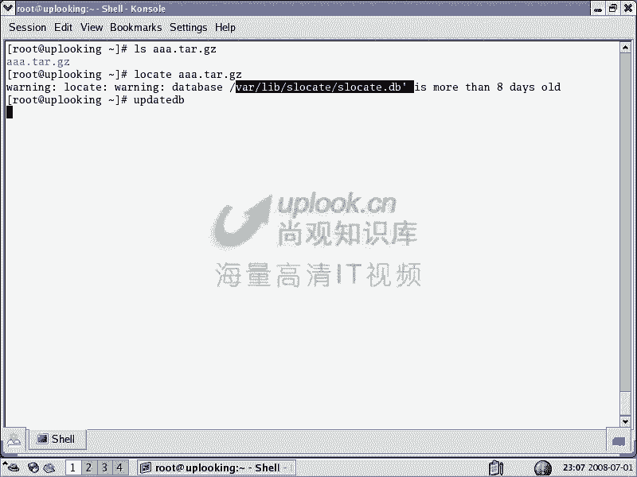
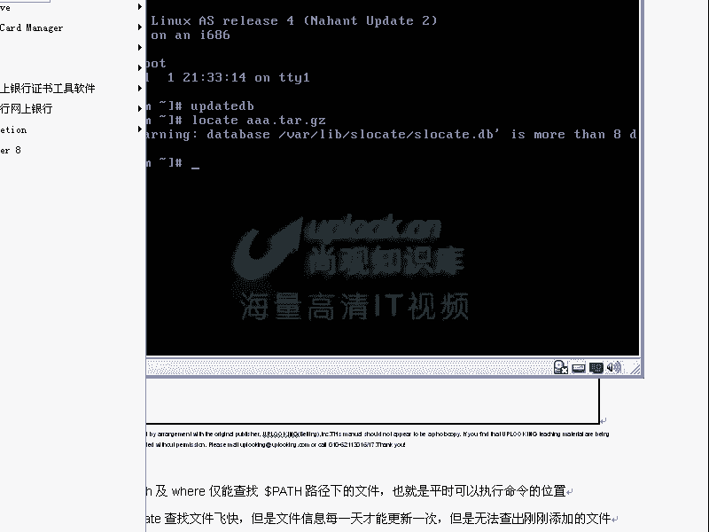
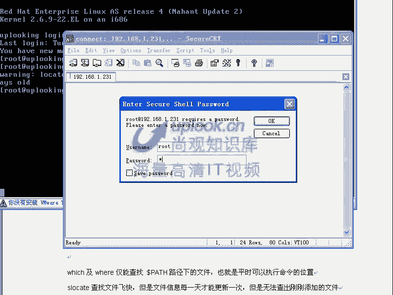
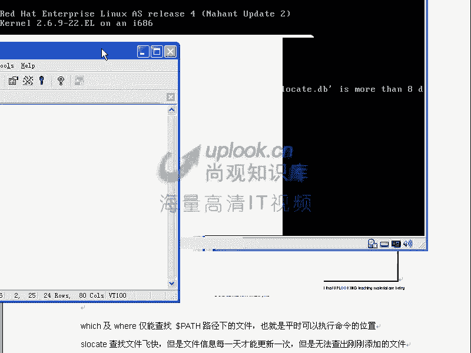
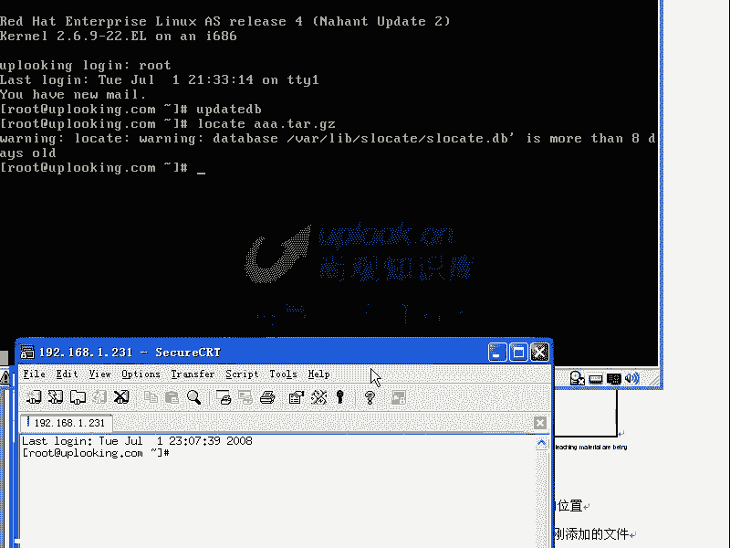
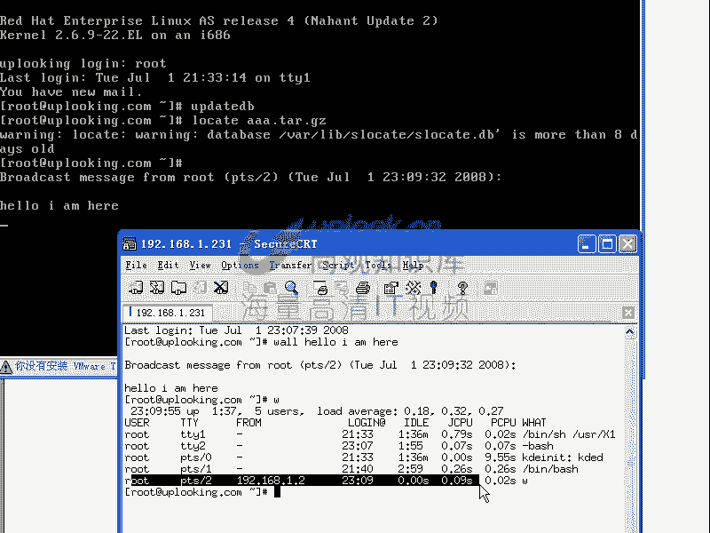
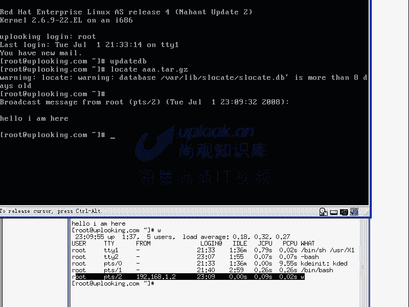
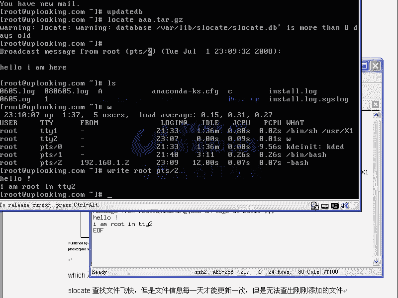
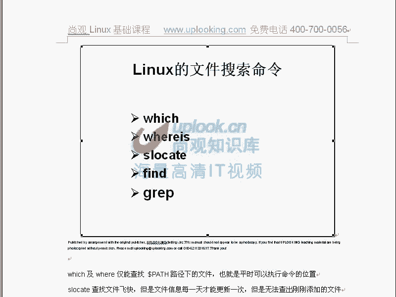
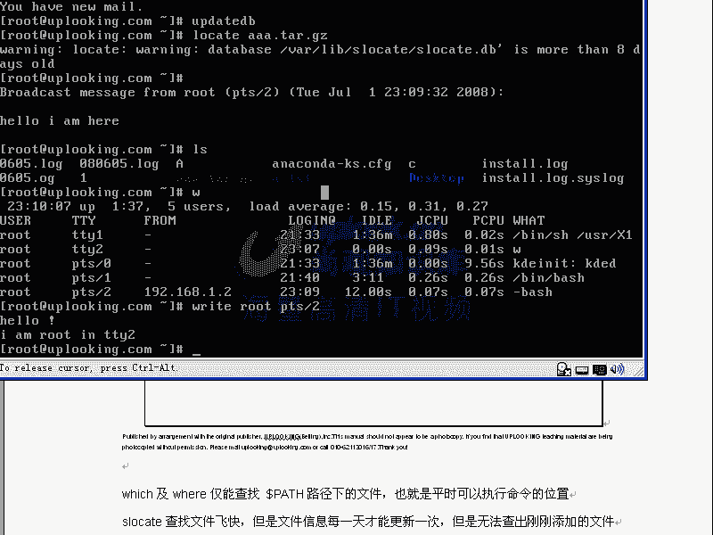

# Linux文件查找与压缩：第九章：文件查找与压缩工具详解

在本节课中，我们将学习Linux系统中用于查找文件和进行文件压缩的多种工具。掌握这些命令对于系统管理和日常操作至关重要。

## 文件查找命令

在Linux系统中，有多种命令可用于查找文件，每种命令都有其特定的用途和查找范围。

### which命令：查找可执行文件

`which`命令主要用于查找可执行文件，特别是系统命令。它会显示命令的完整路径，并遵循别名（alias）和`PATH`环境变量的顺序。

**公式/代码**：
```bash
which [命令名]
```

例如，查找`ls`命令的路径：
```bash
which ls
```
该命令会显示`ls`命令的实际执行路径，如果存在别名，也会显示出来。

### whereis命令：查找命令及其相关文件







`whereis`命令用于查找二进制可执行文件、源代码文件和手册页（man page）的位置。它的查找范围比`which`更广一些。







**公式/代码**：
```bash
whereis [命令名]
```





例如，查找`ls`命令及其帮助文档：
```bash
whereis ls
```

### locate与slocate命令：基于数据库快速查找





`locate`（或`slocate`）命令通过查询预建的数据库来快速查找文件，速度非常快。但数据库需要定期更新，新创建的文件可能无法立即查到。

**公式/代码**：
```bash
locate [文件名]
updatedb # 更新locate数据库
```

例如，查找包含`network`的文件：
```bash
locate network
```
系统通常会在计划任务中（如每天凌晨）自动运行`updatedb`来更新数据库。

### find命令：功能强大的实时查找

`find`命令是功能最强大的文件查找工具。它实时遍历文件系统，可以根据文件名、类型、大小、权限、所有者等多种属性进行精确查找，并可以对查找到的文件执行操作。

**公式/代码**：
```bash
find [起始路径] [选项] [表达式]
```

以下是`find`命令的一些常见用法示例：

*   **按文件名查找**：
    ```bash
    find /etc -name "network*"
    ```

*   **按文件类型查找**：
    ```bash
    find /home -type f  # 查找普通文件
    find /home -type d  # 查找目录
    ```

*   **按文件大小查找**：
    ```bash
    find / -size +10M  # 查找大于10MB的文件
    ```

*   **按文件权限查找**：
    ```bash
    find / -perm 777  # 查找权限为777的文件
    ```

*   **查找后执行操作（使用`-exec`）**：
    ```bash
    find /tmp -name "*.tmp" -exec rm {} \;
    ```
    这条命令查找`/tmp`目录下所有`.tmp`文件并删除它们。`{}`代表查找到的文件路径，`\;`表示命令结束。

*   **查找后执行操作（使用`-ok`，交互式）**：
    ```bash
    find /tmp -name "*.tmp" -ok rm {} \;
    ```
    `-ok`与`-exec`类似，但在执行每个操作前会询问用户确认。

### grep命令：在文件内容中查找

虽然`grep`主要不是用于查找文件本身，而是搜索文件内容，但结合`-r`（递归）选项，可以非常方便地查找包含特定字符串的所有文件。

**公式/代码**：
```bash
grep -r "搜索字符串" [目录路径]
```

例如，在`/etc`目录下递归查找包含字符串`root`的所有文件：
```bash
grep -r "root" /etc
```

如果只想列出包含该字符串的文件名，可以加上`-l`选项：
```bash
grep -rl "root" /etc
```

## 文件压缩与打包工具

Linux中压缩和打包通常是两个独立的概念，但常用工具将它们结合了起来。

### 压缩工具：gzip与bzip2

`gzip`和`bzip2`是常用的压缩工具，它们只压缩单个文件，不进行打包。`bzip2`通常能提供比`gzip`更高的压缩率。

**公式/代码**：
```bash
gzip [文件名]        # 压缩文件，生成 .gz 文件，原文件被删除
gunzip [文件名.gz]   # 解压缩 .gz 文件
# 或使用 gzip -d
gzip -d [文件名.gz]

bzip2 [文件名]       # 压缩文件，生成 .bz2 文件，原文件被删除
bunzip2 [文件名.bz2] # 解压缩 .bz2 文件
# 或使用 bzip2 -d
bzip2 -d [文件名.bz2]
```

### 打包工具：tar

`tar`命令最初用于将多个文件打包成一个归档文件（tarball）。现在它通常与压缩选项结合使用，实现打包并压缩。

**公式/代码**：
```bash
# 创建归档文件（打包）
tar -cvf [归档文件名.tar] [文件或目录...]

# 查看归档文件内容
tar -tvf [归档文件名.tar]

# 解包归档文件
tar -xvf [归档文件名.tar]

# 打包并压缩（使用gzip）
tar -czvf [归档文件名.tar.gz] [文件或目录...]
# 解包并解压缩（使用gzip）
tar -xzvf [归档文件名.tar.gz]

# 打包并压缩（使用bzip2）
tar -cjvf [归档文件名.tar.bz2] [文件或目录...]
# 解包并解压缩（使用bzip2）
tar -xjvf [归档文件名.tar.bz2]

# 解包到指定目录
tar -xvf [归档文件名.tar] -C [目标目录]
```

**参数说明**：
*   `-c`：创建归档。
*   `-x`：解包归档。
*   `-t`：列出归档内容。
*   `-v`：显示详细过程。
*   `-f`：指定归档文件名。
*   `-z`：通过gzip过滤归档（压缩/解压）。
*   `-j`：通过bzip2过滤归档（压缩/解压）。
*   `-C`：解包到指定目录。

### zip与unzip工具

`zip`和`unzip`命令用于处理`.zip`格式的压缩文件，这种格式在Windows和Linux之间通用性较好。

**公式/代码**：
```bash
zip [压缩文件名.zip] [文件或目录...]  # 压缩
unzip [压缩文件名.zip]                # 解压缩
```

## 总结

本节课我们一起学习了Linux中多种文件查找与压缩工具。

*   在文件查找方面，我们了解了`which`、`whereis`、`locate`、`find`和`grep`命令，知道了它们各自的特点和适用场景。`find`命令功能最为强大和灵活，是系统管理中的利器。
*   在文件压缩方面，我们学习了`gzip`/`bzip2`用于单个文件压缩，`tar`用于打包（并可结合压缩），以及`zip`/`unzip`用于跨平台压缩。`tar`命令是Linux下最常用的归档和压缩工具。


熟练掌握这些命令，将使你能够高效地管理Linux系统中的文件，无论是进行系统维护、日志分析还是软件部署，都能得心应手。