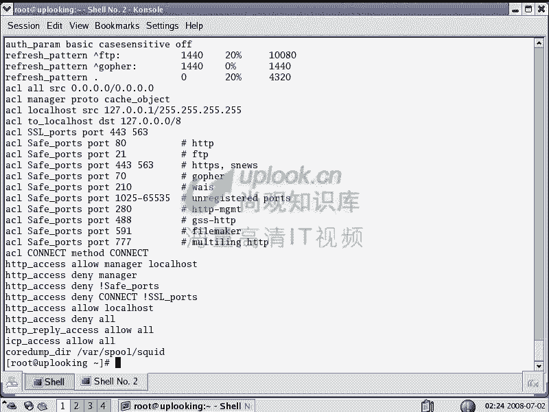
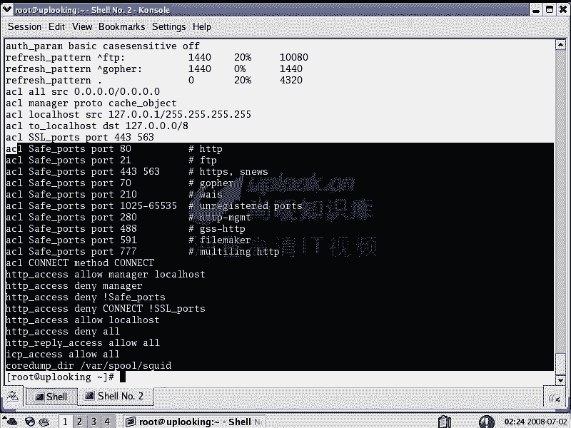
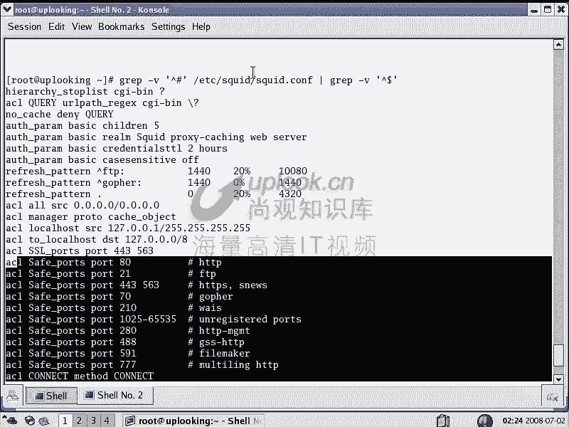
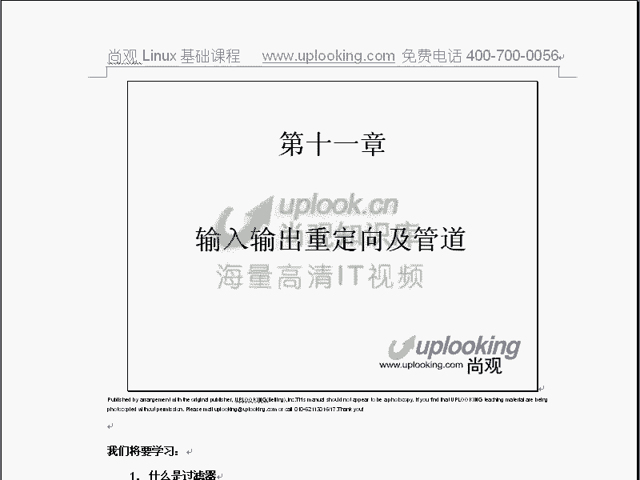

# 尚观Linux视频教程RHCE 精品课程 - P17：RH033-ULE112-10-文本处理及正则表达式 - 爱笑的程序狗 - BV1ax411o7VD

小赵呃，我们现在呢开始第十0章，就是我们linux啊对文本的操作的命令啊，文本的操作命令以及正格表达式。这是我们第十章内容。那这个呢在windows下的话很少见，就是这张内容的话。

windows下你可能基本上没有参加过。为什么呢？因为你想一下lindux和windows的一个区别的话在于什么呢？windows它的配置信息的话，它保留在注册表里面是吧？对你去改一下注册表，嗯。

可能能打开个工具改一下。对，然后把一个注册表文件注册注注入到那个注册表里面去，这个也会是吗？对，但是呢在windows下，那么是注册表lininux里面的所有的配置，它是放到文本文件里面。嗯。

那你想对这些文件进行编辑的时候，是不是要改下改去。对，所以这个时候的话呢，就要用到对文本的操作。嗯，啊，然后呢再一个呢就是正何表达式，正策表达式是什么呢？就是说我们想去把自己要求的那些文件啊。

你到时包含着shack啊，这样的。然后在这里面，我想把包含着shack的这个字样的东西啊，他所有的文件里面包含着shack的这样的筛选出来是吧？对，结果呢哎shack出来了，shack器也出来了。

是不是？嗯，那这时候的话你这边两条的话都出来，两条都出来。不是我所想要的。嗯，那么我怎么样去精确的描述我想要的文本，正文表达式做这个。你方说我现在用正文表达式，那我现在要的是什么呢？

包含着shack这样的一个单词的，而不是这样的一个。而不是说shack什么什么东西，就是说加个shackQIE不加QIE的。嗯，那我就说单独的一个单词。嗯，这就正么表达示了。

这样一回车是不是只有一行出来。对啊，因为这行的话不符合我们要求，为什么不符合呢？因为我加了这个标号以后表示这个单词是以SHREK以开头是以SHRK接给因为。那这边的话，这个单词是什么？QIE结尾的。

是不是对？啊，所以他就不符合了，这就是正的表达式。嗯，明白吗？明白。好，我们看。😊，那么这个呢就是这章我们要讲的内容。这张的话呢，对于windows下你可能接受的少。

但是呢在linux里面的话是经常用到，而且在需要编程啊，或者说在编程的时候，就是C语言编程啊，C加加编程，还要在你系统管理的时候非常多的用到。而正则表达式用的更广。

不管是windows下linux啊用的非常多，嗯，明白了吗？嗯，好，那么这就是我们的这个呃这样的内容。那么主要的话是按照这个脉络，对文本文件的操作命令用正则表达式的命令，然后正则表达式怎么样的。

对文本文件的一个操作实力。然后组合这些命令完成复杂的任务。嗯这是我们的一个讲的这样的一个脉络。嗯啊O我们看。那么文本文件的操作命令。那么我们原来已已经给大家讲过，就是说。

想查看一个文件chatETC线的pasor是吧？cat是什么猫是吧？对，但实际上它是一个缩写啊，那么这个命令这样就会去，哎，这个文本文件就全部都过去了。嗯，但是这种命令啊。

cat它实际上是对文本的一个操作，不一定非是对文本文件的操作，它对文本的操作。那么像它这个类似的话，还有什么呢？还有我们more类 had啊，那么我们说看字面意义。ま。那么ETC下的靠座呢。

它可以呢来回翻是吧？对上下翻，那cat直接一一瞬就完了是吧？一下全部显示完了，这个可以上下来回翻，嗯，对不对？对，然后呢Q退出来末尔的话呢是只能往下翻。默的话呢是只能往下翻。哎，错啊。

只能往下翻空格嗯是吧？往下翻那么呃这两个这三个的话呢，基本上都是查看用的，嗯，是吧？对，其中的话list的话呢还可以进行查找。啊，more尔号不能进行查找。那也就是这里面比较强大的实候是类似类似。

但是他需要交互，什么需要交互呢？刚才我跟大家说过，嗯，交互的话是你在半夜做一件事情啊，或者说执行一个脚板，你还要起来就按一个键，然后把它呃就是让它退出啊或者怎么样。

所以这个交互的命令呢需要编程的时候就少见。嗯，那么我们看more的话呢，它就直接哎显示完就自动退出了是吧？对，cat也是，所以呢这个两个命令呢不能说它不好，而是说什么在非交互模式的时候呢。

可能用的非常多。嗯，交互模式的话可能用的是list多一点。对，而ca。他是看这个文件的头十行，默认头十行，tailll是看什么这个文件的末尾十行啊，那么tailll的话呢。

当时我们说过一个tailll一个非常重要参数杠F参数，它可以盯着什么呢？一个日志一直的话盯着你看我这样盯着。是吧嗯没有不动了吧，嗯然后呢他就一直看着这个文件。这个文件如果要是一旦发生变化，它就变。嗯。

明白吧？那比方说在另外一边啊，在另外一边，我把某个服务打开service HTVD我把这个服务的话重启一下。在这个日志当中。看到吧？嗯，有相应的一个消息出现，嗯，对不对？对。

这是不是我们正在监视着这个文件？嗯，对啊，那么ctl加C然后把它停掉了。嗯，那么这个就是退。所以呢这三个的话呢，实际上都是对我们呃这这五个文件呃。

这5个命令的话都是对我们的文就是对我们这个文本的这个操作简单的操作是吧嗯。Cat。是吧对，就5个命令简单的操作。但是呢我们现在可呢并不是在看它，不是说你把这个文件打开就完事了。嗯。

那么它还有各种各样的其他的这个呃作用。比方说我看一下。能帮我们用正则表达式的命令啊用正则表达式的命令嗯，看一下。正文表达式的话呢，它是有很就是很多种。然后呢，这些命令的话呢。

不只是原来那几个像list的话，它可以用正文表达式。然后其他的话呢就用的少一点。然后我们给大家看一下这个就是额外的一些命令。这些命令的话呢是这样的。DIFF啊UIQ cut啊st然后WC等等。

这些的话呢，我们原来已经接触过一些。你比方说我们上呃上一章给大家讲的这样的一个命令，这样APP机的嘛？嗯啊那么像我们说这些命令的话呢，都有一个统一的这样的一种呃就是统一的这样的一种类别，叫做过滤器。

你原来ca，你说我这边不是看一个文件的嘛，是吧？那你ca直接回车。它不动了，对不对？嗯，不动了以后，你输入什么东西，它就跟着输入什么东西，嗯，对不对？对，那这点的话是不是跟GLEP是不一样的？

G然EPAA是吧一回车。那当你输入输入什么呢？这样的时候没有没有没有就是没有反应是吧？对当你输入连续4个A，是不是有这个东西啊？对。那他就会怎么样？他就会跟着来一句也就是筛选你的。

所以呢这些呢都是对文本处理的命令。嗯，那么GREP的话呢是上节课讲的，我们当时讲的杠大R参数就杠小L参数，对不对？嗯，对，那么杠大R的话是对整个的一个什么目录进行全部这个里面的文件全部得筛选一遍是吧？

杠L的话是只显示这个文件的文件名，嗯，对不对？对，那现在这样的GREP然后呢，我们加上一个什么呢？sharackETC下的怕错了。当时我们给大家举这样的例子呢，才能筛选出来是吧？对。

然后呢我如果要是用这样正的表达式的话呢，他就可以只筛选一个是吧？嗯或者说我更精确的来匹配我想要的那个嗯，对吧？就这样AP。那么跟这种类似的命令的话呢，还有很多，你比方说cut。

cut呢它也是显示它显示什么呢？比后pa错。那么这时候呢cut是截断啊截段cut杠。F。我这样的。你看这样的这个就是说ETC帕座的这个文件的话，这一行的话是不是呃你能看到先是一个1是文件名是吧？

嗯其实这是一个冒号作为分割符是吧？对，第二段第二列的话实际上相当于X是吧？对，第三列是个500是吧？嗯，第四列是什么？是。呃，第四列的话是501是吧？那这样的，然后我这样他看看的话，我这样呢。

COUT然后首先看杠T冒号以冒号作为分割符符啊，杠D冒号啊，以冒号作为分割符cut杠FR啊IF1就是说第一列ETC下的哈。这样的话，是不是所有的名名字就出来了？对吧对。然后呢。

你再加上一个什么GREP衰是不是组合在一起？嗯，哎，这边是不是就可以出来。那比方说哎我现在我是想看s用户，他他的这个 shell是多少，那么他用的是什么 shell杠F6啊？他用的是哎。7啊。啊，错了。

啊脑子有点不清楚GP1XETC下的pa，然后呢加上一个管道，就说直接把这个输出给下面一个命令作为它的输入。嗯，然后呢cutCOT杠D冒号以冒号作为分割符杠F7这样一回车，哎他们两个都用 shell嗯。

我是不是想用什么呢，就要什么？对那这时候话我可以写个视要脚本说所有呢以杯 shell开头的这些东西的话，怎么怎么着是吧我可以做一个视要脚本来自动处理。嗯，这个脚本的话呢。

可以不依赖人的话去交互它可以自动处理一大堆的文档文本文件，这就是它的作用。那么cut的话是这样一个命令。那么cut的话，刚才我们看它是杠F7是吧？那么我这样的直接回车哎，所有人的主目就出来了是吧？

杠F6。是什么呢？所有人呢登录的上就都就出来了。那么这就是杠D冒号，然后杠F7。如果要是你现在的话想去cut一个什么呢？cut说呃杠C啊一。是3，那么我想把第一个字符到第三个字符全部都看下来。

直接回去了。嗯，嗯嗯是不是？嗯第一个字符到第三个字符看得下来。那么这是我们刚才用的几样东西，非常方便那非常方便。那你说我有什么样的需求呢？你比方说你在需要编程的时候呢，经常需要只截取某一段。

那么用它这个话就可以非常方便的去截取出来。那么跟他类似的，你说GP的话是筛选出来。对，然后看的是阶段是吧？对，还有个SORT是排序排序。那么你看我们现在catETC下的pas索尔这个文件。

那你看到这些文件的话，它的UID是51是吧？对这个UID是47是吧？嗯，这都很正常。但是这个边是29是不是嗯，是吧？这2929怎么排到51之后了，这好像不太按顺序来的是吧？对我现在想让它按顺序来一次。

按照顺序从大到小这样来排一次怎么办呢？啊，你可以这样SORT杠T冒号以冒号作为分割符加。它这是第三列是吧？第三列零的话是第一列一的话是第二列嗯2话是第三列啊，加2嗯，那么从第二列开始排。然后呢。

杠N以数字的方式来排序，你说废话当然以数字方式排，当然它呢会把它当成阿斯克玛来排序。嗯，你要A小A和一这个一字符，就是那个字母，对，就是那个数字一谁的，它是按阿斯克玛来的。

那么如果谁排前面谁谁就是按照这个数呃，谁的个阿斯玛值大的话，就是谁排谁排在后面嘛。但是杠N了以后，他就把整个的你要方说有111是吧？嗯，111是吧？嗯，那么他原来是按照第一个字符来排嗯，我加杠N了以后。

他就把111当成一个首字了。嗯，他就先排第一个，如果要是不加N的话，它就排第一个呃第一个字字符嗯，然后再排第二个字符，这样的话很很啰嗦，所以加根杠N的话比较好，杠N了以后，我ETC下的。pass了。

那这样直接回车，你会发觉这边的话就是按照从小到大的顺序嗯，看到了吗？看到。是吧对。是从从小到大的顺序来排。这个时候呢你你对你说一下，就是你感觉这个文件它有没有变化。这个文件的话有没有变化？没有没有变化。

嗯，那刚才不是已经排序排好了吗？培训我刚才不是从。小到大进行一次排序嘛。那这个文件有没有改？有没有按照我的那个将车改过改改。改过了啊，那应该是没改，我估计我故意要这样问一下啊。

就很多人话像都会有这样的就是想法。就是我这样做完以后，他就应该给我改过来是吧，没有。它只是给你显示在屏幕上排序啊，所以说一般你要改的话，你要先把它输输出同新样同一个文件。A这样的文件，那你这样一回车。

然后你再catTMP下的A是不是就看那个文件嗯，那个文件就是刚才你看到的从大到小，那从小到大这样的一个顺序。那这个A这个文件是改过的。嗯，明明白吗？明白了。我看看这样的对吧？嗯，A这个文件的话是改过的。

有吗。所以说这个地方的话就感觉很枯燥，你感觉好像好像没有什么关系啊。你你去讲了半天什么东西啊，吧跟我有关系没有。但是呢在需要编程里面的话，非常多的去用。举个例子啊。比方说。啊。嗯呃。

我这边设置一个变量值啊，等于一或者零，等于零的时候呢，关掉这个符，等于一的时候呢，开启这个符。嗯，那你怎么编这个脚本，怎么样编这个程序，那我可能用是正个表达式截取。第二列是一还是0？如果它等于一。

那我就star某个符。截取等于零，是不是就star这个分？所以这种事情的话呢，在需要编程的时候是非常多见。嗯然不要认为说我的雷诺思坦没有这个需求，我不学它。但是实际上呢linux啊难就难到这些地方。

你一旦熟悉了以后，这些东西一旦熟悉了以后，你会发现你对linux这些东西非常熟悉。雷ux对你整个来说，它就相当于敞开心扉啊。嗯，敞开心扉。然后你去用它的时候是非常方便的。这时候你越用越熟练。

而普通人啊就觉得这点太盘了，我放弃了，那他怎么样，他永远都不会这个系统，嗯，不会这个系统的话呢，他在专业领域它是永远没有办法登堂入室。嗯，所以你会觉得这个东西啊难但实际上你学一学的话就非常容易过去了。

嗯，当你去努力把这些参数记一下，玩一遍的时候，哎。非常容易非常方便。在做一些管理的时候就非常方便，你也能看懂别人的视要编程。所以这个时候的话你一定要坚持下来啊，坚持下来。那刚才看了一下pl的话。

s的话呢是把它进行什么进行这种排序是吧？排序的话给你显示出来。如果你想让它保存的话，你就加个大于号，保存在哪个文件当中，但是你不能把这个文件从这里面去读出来，同时又写到这个文件里面去，这是不行的。嗯。

你直接把这个比方说把TMP的A文件，然后呢替换成什么ET pass，就是我把这个文件排序完以后再输出回这个文件，这是不行的。嗯，你不能说自己踩在桥上，就在里边拆桥对吧？就重新我把这个桥重新盖一下。

那你拆的话这个这个文件就变了，对吧？所以不能这样，那你可只能重定向成另外一个文件，这样的话就把它进行更改。如果你只是想看一下，只想显示一下，那么就这样，那就会以显示出来。

那它这个地方的话是按照这个地方从小到大的顺序啊来进行排。如果要是你想反向进行排序，反向进行排序，那你可以加上一个什么杠N杠B。あ？杠R杠R是反向来序嗯，这边的话就是按从大到小的方式方式来排训嗯。是不是？

对，那么我给大家举个最简单的例子，你能不能把这个目录下啊排名前三的文件啊自动删除掉。你看DU。杠SH呃杠DU杠H就要是显示这个文件嘛，是吧？DU直接回车。

那么每个文件的话就是边多多少K多少K是不是都显示出来嗯，那么现在我这样的，我如果要是DU啊，我把这个刚才它显示出来这个列表全部都怎么样的？全部都给st这个文件嗯，是吧？它是不是要排序了，对。

但是你发现它排序了没有？没有。没有吗？好像是你。😔，啊，这样从这开始是吧？嗯，还信了吗？你看这个st的话，我就没有加杠N参数，嗯，没有加杠N参数，它是不是先排第一个字符，他不把这个当成一个数字字嗯。

他先排第一个数数呃字符，排第一个这不是一排在最前面，二排的后排吗？嗯他排第一个字符，他不把这个当成整个这个数字。所以如果你加上个杠N的话。是不是就整个嗯按照这个大小排排序了是吧？

排完了以后你看那么杠我现在是不是想把呃其中的这个头前三名啊前三名弄出来，那么这边是杠V，我呃杠R啊反向来排序。是不是啊？对，反向来排序，反向来排序的话呢，我们看这边是不是呃前面是这样的一个文。

这两个是个文件夹是吧？嗯，然后呢接下来这个也是文件夹。嗯，那么这个时候的话，你看前面的话呢是最大的，这是当前的这个文件夹总成的大小。嗯，那么这边的话呢是这个这个文件夹的大小。

接下来的话是这个文件的大小是吧？那么假如说到我这样的到R了以后，然后再加上一个什么呢？Haad。高恩。把头三行显示出来，是不是这样的？对，那我这样呢，然后再加上一个什么呢？cat就是cut就是。

就是说我把其中的什么。第二段嗯截取下来。嗯，是不是是那这时候我在做什么操作是不是很方便了？嗯，当然你不能这样删除啊，这样一删的话，是把整个的文件夹删除了。当前的文件夹删除了啊。

也就是说呢我给大家做了一个小的例子，就是说呢用这个命令啊组合起来做这些事情，你是可以实现的啊嗯。明白了吗？明白了明白了。OOK那么现在的话我们看一下，那么刚才的话给大家总结一下，最简单的是t是吧？对。

然后呢是呃list。然后呢，还有是什么末是吧？那么还有呢就是pad看文件的头时行。如果要是你想去用一些其他参数的话，比方说想看前五行pa杠N啊，那tail也是tail是看末尾的行那么这边杠N。

然后杠N20看末尾的20行是吧？然后呢tail什么呢？杠F是盯着那个文件一直不要动是吧？直到Nctrl加C，把它停止了以后对吧？然后呢接下来的话我们给大家说了1个GREP是不是？GLP的参数呢很多。

那么我们上节课给大家讲的大R对一个目录下所有的文件和子文列张当中所有文件进行筛下去是吧？然后呢还有就是什么呢？GREP杠L是吧？然后呢加上杠LR杠L的话是只显示出那个文件名来，包含着指定字符的文件名。

那它后面的话可以加正则表达式，对不对？单号引起来的。能表达式嗯，是不是？对，然后呢GLP的话还可以加这些参数。杠V的话是反向选择，嗯，不包含这一行的。刚才是不是包含这一行的？对，那么杠V是反向选择。

不包含这一行的。然后呢杠L啊杠R还有什么呢？还有杠。诶。杠C统计这个文件里面有多少行，就是行号显示出来。嗯，然后呢还有就是说我们的那个。诶。咁。大A2杠大B2啊，这个的话等一下我跟大家说是什么意思？

然后呢，还有就是我们刚才给大家看到的cut杠D以冒号作为分割符。把这个地。二段到什么第四段显示出来是吧？对，或者说呢杠C啊第一个字符到第5个字符看得出来嗯，是吧？就是看。然后呢。

还有就是SORT杠N以数字方式来排序杠R呃反向排序，就是说刚才是正向从小到大，现在从大到小排序。然后呢，还有什么呢？杠。T以冒号作为分割符是吧？嗯，加2从第二列开始排，加3从第三列开始排嗯，明白吗？

明白，是这样的，这是我们的cut，还有st。然后呢，GREP的话，刚才这个地方的话还没跟大家说清楚，是不是？那我们拿过来在这边的话再来说。那比方说GREP。

现在的话我想把12啊从ETC它所有当中呢显示出来是吧，或者把杯上。显示出来，那么就是说这些行当中包含着be这个字眼，嗯，对不对？对，那如果是加上杠5一的话，会怎么样？反向选择不包含哎。

那它就是凡是包含的，它都不显示，不包含的全部都显示出来。嗯，对不对？对，这边就是最简单的啊，这边是杠B是吧？嗯那么现在我这样的，比方说GLEP。12，那么它显示出来这样两行是吧？对。

但是有的时候呢我想看上下文，你那么光把这一行显示出来，我现在想寻求一个帮助是吧？嗯，你把这一行代码给我显示，结果呢它的代它这个代码是个循环，你光显示出一行来，它整个这个循环的话8分之5行是吧？

那你可以这样。杠A比方说5就是after这一行的下面的5行杠。B5这行的上面的五行啊显示出来。那这样的话，它就是把这个上下文都显示出来。嗯，你看了吧？上下文显s这一行的什么？上面五行显示出来是吧？

下面的话它就这么几行，下面只有三行，所以它就只显示上行，那么整个的这个上下文的话，它就会显示出来。嗯，这就是杠A和杠B这样参数嗯，啊，明白了吗？明白了，好，那么看一下这些参数的话呢，希望大家记住嗯啊。

记住，然后呢cut杠D。冒号冒号作为分格符cut出来的什么呢？第一第二列到第四列是吧？还有呢第一个字符到第五个字符等等。这个就是刚才我们大家说的嗯啊，那么尤其要记住呢，组合起来去使用这个命令。

那么你的脑袋话是越越学越聪明，但是越学那个windows人越傻。为什么这么说呢？允许window人的话是人家给你包装出来一个什么东西，你自己的话就是用人家已经包装出来的东西在那边，你能创不了多少啊。

是别人给你做出来以后，你只是用而已。越用的话呢越变成傻子啊，真的是这样。所以呢大家的话如果要是想去做比较底层或者说技术比较高的这种工作，那么你越来越傻，那肯定是你的效率可能会高一点。

但是毕竟这些东西都是别人给你创造出来的对，那你一直呢就是没有自己的这个创新能力。大家看刚才我在做这几样工作的话，都是自己在想。嗯，那么你可以充分发挥你自己的想象力。OK这就是我们的这样的几个命令。

那么还有啊还有其他的，比方说看W个CWC的话呢，我们知道厕所的意思是吧？开玩笑啊，WC的话呢是呃统计一下的这个文件里面的话有多少行多少个单词，多少个字符。

这样的你有这样的WC然后呢ETC下的password。这时候呢你能看到这个文件里面的话，总共是什么？42行67个单词，1000多个字符。那么如果要说我只想看某一段。

那么WC杠LETC下的password。他只有42行是吧，第二个单词呢。word嘛看不word是不是？对啊，如果要是字符的话呢，是character是吧？对，就是多少个字符，这样的话就可以单独显示出来。

所以这个WC的话你有杠L杠W杠C来显示某一段是吧？嗯某一个数字。如果要是你不加的话，三个全部都显示出来，嗯，对吧？就是WC。我们再看那么另外呢，像DIFI和UIQUIQ的话。

你就是把相邻的相同行的话呢给它去掉。你比方说我们现在看。Cut。啊。杠D冒号以冒号作为分割符嗯，杠F7。ETC下的pa错，这样的话是不是把大家的笑全部都显示出来。嗯，有些人用什么no log。

有些人用dash是吧？对那么我如果要是加上一个这样。UNIT是不是错了？Yes。真啊。这样的话是显示出所有人的笑是吧？对，加上1个UNIQ。看到吗？嗯，他就把这种，比方说这几行的话全部都背 shell。

他就只只是一个背 shell。这边的话呢是全都log in，那么就是no login是吧？嗯，它上面还有人用背 shell，那他就是又是背下。那如果要是你想把它什么呃。全部都筛选一下SORP。

是吧SRT是不是彻底排序了？对，彻底排序完了以后，再加上一个什么UNIT这个。看到吗？嗯，然后UIQ，然后再统计一下有多少种事啊。六种。这整个就一串就。用下了是不是？对，那么好像URQ的话呢。

加可以不用snt。我看一下那个参数叫什么，到N好像是。よし。杠癌是忽略大小写。是。看一下，就是说对于我来说的话呢，很多也不太熟很多也不太熟。但是呢我呃但是我呢是就是说现查嗯。

通过就是我们第一章教大家的这种帮助的方法的话，去献查，如果要是你对我们第一章啊，就是为什么我们第一章就是给大家大致介绍完以后，抓完了系统以后先讲帮助。嗯，因为没有一个人的话，能把这个东西都记得那么清楚。

所以的话呢我在这边的话也是现现长帮助，这也是对我自己刚才操作的一个狡辩但是呢你要知道你以后啊也未必比我强的啊，但是这个并不代表说你什么你的水平差。而在在于什么呢？你非常迅速能找到帮助，这是你的本事，嗯。

是吧？对？我看看到D啊，好像是。更止。啊，就是只能打出不是杠杠1吧。Yes。我看一下哎呦。确实是啊总是那个。很对不起大家啊，对不起观观众啊。嗯 friendriendline。公司俾你哋班大啲翻系扶条。

干啥忽略大侠写。N。杠U啊，就是说我现在想实现什么呢？呃，刚才我们不是用这种方式啊，就是snot先排一下序st先排下序是吧？st排序完了以后再用UIQ的话。

把那一行的话呢单独就是这样的话没有一行是重复的，对不是？但是我想用一个参数的话也达到st加UIQ的效果。我记得是有一个参数。但是这个参数的话，我忘了刚才要查一下还没查出来嗯，杠U的话有有点像。

但是这个U的话好像这个地方还是没有没给他筛选。对啊，嗯，是吧？杠U的话好像是有点像，有可能这般多了个空格或者少个空格的原因。嗯，但是我现在不太确定，那我也没有时间的话，再给大家再确定这样一个小的问题。

但是大家已经应该明白我的意思了。我可能又点狡辩。😊，真那有在。但是呢呃这个过程的话呢，希望大家明白。然后呢我们一般呢做这个编程的时候，你肯定要试很多次。这个时候的话你就有精力的话去做这件事。

因为我的话呢没有这样的需求。就是说没有人说要求我一定要做这个事儿。所以的话呢，我有时候的话，我是大致模糊的记者。但是我想去寻求帮助的方法把它确定的时候，结果没有确定下来。所以在上一章和这一章的话呢。

都有一些问题。但是呢这个问题的不是特别大啊啊希望大家能把我讲的比较清楚的地方呢，记住啊，你们以后的话呢可以寻求一下这个答案，但是这个东西就是在实际生产系统上的话，这个东西不是做一加一等于2嗯，是吧？

你能把它做出来就OK了，这就是我们的应试的教育和实践的这个区别嗯。okK那么这边还有个DIFFDIFF非常有意思。DIFF是这样的。DNFF那么对比两个文件，比方说A点TXT和B点TXT它们的区别。嗯。

那比方说呢我在这里面呃我cooffee啊。cooffpy EC下的。啊算啦。阿购。VIA吧。A一的话呢，这边是向正直。这样几行，然后呢，我把Acopy成什么B，然后呢，我VIB这个文件。

在B这个文件里面的话呢，比后第二行这个地方新开了一行嗯，新开了一行的话叫做TPT是吧？然后在这里面的话，这个这个地方的话，我又加了几个字符。那么这样做完了以后，那么A和B现在不一样。

第IFF的话能告诉你A和B的话有哪些区别？这样一回去你会发觉他说第二个文件呢，在第二行这个位置的话多了一个第三行多的内容是一个大于号，就是说这个文件多的是什么呢？TPT这样嗯。

然后呢这边呢接下来它这边不是多了一行嘛？多了一行以后呢，这边是不是就错开了对，也就是第一个文件第四行和第二个文件第五行是相对应的是吧？那么4C5说第一个文件的话是这样的，就是小于号第一个文是这样。

第二个文件是这样的。明白吧？这个时候呢把它们之间的区别呢就显示出来。嗯，这个的话用处啊是在什么时候呢？首先你能对比出来两个配置文件有什么不一样。嗯，但是它还有一个非常大的用处是什么呢？

你比方说你先写的一个软件，这个软件的话呢是第一版。那你又什么呢？又有第二版出来，你是不是对第一个版的这个软件的话更改了很多东西啊？对这时候的话第一版这个软件呢，假如说是100兆。Yeah。

第二版这个软件的话呢是110兆嗯是吧？嗯，然后呢，你要你想升级你的软件吗？你要想升级你的软件，我是不是要给你110兆第二版的内容啊？对，当然也有一种情况就是什么？我只给你差异的部分。

假方说只有20兆是差异的。嗯，我把这个20兆的话打成一个patch，就是说这种东西。PAATCH patchch打成一个点patch的文件，比方说什么。A用A点patch这个文件嗯。

用patch这个文件怎么生成呢？你就用DIF来DIFFF来生成。嗯，你不方说我们看一下这个啊，就是又拿科l点ORG就是我们的in特呃就是我们的。很烦啊，嗯百度等等这些。那后咱样Wcol点。

ORG是吧？对，到cl点ORG上去。然后呢，我们看这边，你看它的这个新版的这个内核在出来的时候，它是不是和旧版的话是有一些差异的。嗯，它就会把这个差异的话呢变成一个patch文件。看到了吗？嗯。

什么什么tch什么什么tch。你可点出来看一下它的这个区别在哪。诶。我还是打不开。不好看是我浏览器的问题还怎么样？我到某个镜像当中去啊。晕啊。😔，OK这个地方然让我们到科到这个源代码当中去，然后到2。

6内核嗯，是吧？对这个科等于LG。呃，科勒点R这里面放的是当前内核的这个。最新的镜像嗯，200内核。那么我们看这些都是change rock，chanro。还没有列出吧。啊。

这是刚才我们说的点GZ的文件和点BZ two文件，嗯，对吧？对。原还没有在到点t。这些都是一些什么呢？就是说呃数字签名，担心的话，别人把这个文件的话呢改动了。这边我们先看一下。

你看一个BZ two的文件是吧？这是2。6。20。10是吧？嗯，这个BZ two的文件和这个GGZ的文件的话，谁大你看这样一个是41兆，一个是52兆。那也就是点JZ的文件它要大，比如说它的压缩比例要低。

嗯，对吧？对。这个解开你知道多大吗？就是个内核的话，解开你知道多大吗？300多兆。啊四百多啦。哎，这个pat啊不知道还能不能看得到。太多了。看不到啊，在这个在这个目录下可能是没有。也可能是还没有出来。

那么本来给大家想看，哎，这边不是开看到吗？嗯，touch跟2。6。25点什么什么？也就它两个版本的话呢，出现两个边的时候啊，它的差异部分的话。它差一部分的话呢，就是说做成一个patch文件。嗯。

那这个patch文件是由谁来做的？DNFF来做的，明白吧？他两个目录下，所有的文件全部都生成一个patch，生成一个patch以后，他让你去打。嗯，那你比方说你现在有1。0这个版本。

在你拿到这pch以后，立刻把你这个1。0的版本升成到2。0。明白了吗？明白就是DNF和patch实际上是一对。嗯，DNFF和patch实际上是一对。嗯，明白吧？

白以后大家在做就跟我们做那个呃比方说机呃Gmail不是gmailQmailQmail的那个升级的时候，就用到这个pa文件。而且很多时候的话，你在做这个软件的时候，升级都是这样来做的，明白吧？明白。

所以费了很多同识的话在讲这个问题。可以给大家看到了看到点ORG里面的这些东西。嗯，那么目的是给大家讲清楚这些呃，就是说这些实际的应用嗯，是吧？OK再看下面。

那么这个就是我们的呃两个呃这边的话就是我们的这个文本处理的这些命令。那么回过头来的话再看。UIQDIFF是吧？DIFF相配套的是什么呢？PAATC或patchpatch呢一般打鼓零的时候是这样。

比方说patch杠P0，比后级别是多少，我可能打多次patch啊，输入成定项A点，就像我们刚才那个PAATCH。点2。6。什么9这样的一个文件。那么这个pach文件的话就直接打进去了。嗯，那就这样去打。

它是由第这个pach文件就是由什么DNFF生成存成嗯，明白了？嗯白，就是他们的一个文本处理的这样的一些命令和这样的一些参数。嗯，明白了吗？明白。

OK那么这个地方呢呃大家仔细看一下啊UIQ是把相邻的相同行头去掉是吧？变成一行DIFF看两个文件不同的地方差异的部分，你如果要是你方方说哎，我刚装进星际争霸或者我刚将装了个魔兽是吧？

那这个怎么运行起来是这样的，那个怎么运行起来这样的，哪个地方不同，是不是你可能有两个配置文件DIFF一看啊，当然在linux里面的话，没有见人用魔兽争魔兽争霸了是吧？对我看他们什么dble了就是什么呃。

阿天换眼神什么的，他们玩的都是蛮轻松的。在没意思。开个玩笑，就是说这个东西的话呢，大家一旦反起linux它以后，对那个游戏的话真的是好无所谓了。你会发觉呃如果要是很多人呢都说我戒除掉自己玩游戏。

这个瘾该怎么办呢？你就去学编游戏，对不对？对，那么游戏的话很多都是运行在这个平台上嗯。你在那边辛辛苦苦啊，叮目咣去升级啊什么什么，结果哎让人家花一刀就给劈了，为什么那你家伙把游戏服务器给黑掉了。

者那个家伙什么在网那上面拉直的候的学了一些编程的知识往那边发值的时候，把自己的属性改的特别大，直接啪下就自己就特别厉害。这个时候你自然就没有兴趣，那个练级怎么怎么样，结果直接让人家一刀干掉了。

你想不想把他干掉，你肯定也想改是这个时候的话整个的呃你就发现你的兴趣点不在玩那个游戏上，在这个整个的这个世界，你原来就当一个世界当中的一个人，现在相当于这个世界的干掉，就是上帝啊。

你就能当这个世界的主宰者。那这时候的话你自然就蛮强了。你就兴趣不在那上面。所以这边的话呢啰嗦了很多，希望大家呢有兴趣去学这是最重要的O。😊，呃，这个地方呢说完了，然后呢我们再来看再来回过头来看什么呢？

正么的表达式。这个正法表达式的话呢，是非常呃有学习的意义。用这和表达式的命令的话呢？GREPloccate杠R2是吧？loccate记不记得干嘛用的呃。查找文件哦，对然后那个和数据库数据库更新嗯。

就是他可以它有个数据库是吧？对，然后呢list的话是什么呢？list的话是呃查找就是我用list不是看一个文本文件嘛？嗯我可以在这个里面的话。

用政策表达式去查找VI的话也可以SED和AWK我我们刚刚不是说了好好些的话，对文文就是文本操作的命令嘛？嗯像cut那些实际上这两个是大步头，这两个是大步头，这两个的话甚至都可以编程的，做事情非常非常多。

他们两个是主要视要编程的时候用的非常非常多的东西。嗯那这两个的话呢是比较复杂的。但是我们又给大家讲，为什么呢？在讲视要编程的时候要给大家讲O那我们现在看那么像GAPP用政策表达式的话，我们后看啊。

比方说现在我们GLEP这个表达式，就正常表达式有哪些？GLEP那你这时候呢，我跟原来不是加shackETC下的它做的吗？对，那么你在用正个表达式的时候呢，一般是要怎么样？用单引号把它引起来。嗯。

这样用单引号引起来的话呢，我们以后就会知道为什么。因为单引号的话呢，可以避免我们单引号之内的东西被事所所那个干扰啊，被事所干扰。呃，我们再重新重申一下，每天的话讲完这个课以后。

必须得要把那个练习手册当中这一节的练习做一下。嗯，那么在前几章的练习当中的话，大家可能看这样的，我ele一个心，你说呃刚才我我现在这样的讲这个命令的话。

是目的是解释说B什么我们要用单引号把这个东西引起来。嗯，那你看我艾le一个心，按理说你说艾le一个什么AA是不是它就显示AA啊？嗯，对 echoleDB的话是不是显示BB是吧？

那么艾le一个心会显示什么？都。不知道。😔，显示的是文件名。哦，明白吧？嗯，也就是说我们的悲射啊在处理这个星的时候，我们这个碑射啊在处理这个星的时候。他不是按照这个文他不是按照这个星是一个字符去处理。

而是把它当成一个运算符。嗯嗯记得任意多个任意字符啊，就是范的命令在查找的时候，嗯，对吧？所以呢这个时候的话，他就把它当成一个文件名了。所以这些文件名就显示出来。嗯那你想不想说你在做正则表达式的时候。

这个地方就会就会全部都替换成文件名，一个干了，嗯，对，对吧？所以话你现在看Ile一个单引号，加上一个心。是不是关系之行，这是不是没有受到关干扰，对吧？对。

所以说我们说为了避免你的正格表达式里面东西跟通配符，也就是悲视所认的那些东西，像干干扰或者互相作用。所以一般上都是用单引号引起来。嗯，那么我现在这样呃GREP啊，然后呢，我这边单引号。

我去做一个正格表达式。那么现在说是任意多个任意字符。你方说我现在以R开头的任意多个任意字符。你方说我如果要是。啊。我看啊S开头的吧，我如果要是以任意多个任意字符是点星啊，嗯点的话代表的是什么呢？

这样的一个句点代表的是任意的一个个字符。星的话呢，代表任意多个前面的字符就任意多个点，那就是说以S开头的中间什么我都不管。嗯，那么最后一个什么呢？K结尾的。嗯，这样的。

那么在ETC下的password当中显示出来。嗯，还是这样啊，S开头。😔，算啊，我这样子写可能不太对啊。这样吧。那我这样加了一些文文本，然后对A文件有一下操作。嗯，GRP我这个呢。A这个文本。

那这些的话全部都显示出来，只要有shack就种显示出来是吧？嗯嗯。那以K结尾的，就是有一就是相当于。怎么说呢？算了就看这个以S开头K结尾是吧？嗯，然后呢点心中间任意字符这样的做出来。

那么假如说我是这样的。然后呢，我加上一个doer符号。他说SH。R一K。你打了符号。那这个时候呢只以sh肯结尾的胸显示嗯，那么呃。咦。😊，Yes。对啊，old应该出来啊。我看一下这个文件啊。

这文件是不是我多了一些什么东西？这边多了个多了个空格看嗯。是不是以shack结尾的？对，是吧？hello sha嗯，然后old shack都出来了。嗯，因为刚才后面的话多了个空格，所以呢这个字符的话。

以什么什么结尾呢？看到好像是什么？你看到这边的话有个old sha是吧？这个空格不会显示出来，嗯我把它重新删掉了空格以后的话就好了。嗯，那么这样的话，以sha结尾。那么以shack开头的呢？以山开头的。

那sha开头的就这一个字符嗯，就这一行。对，那么如果要是包含这shack这个。字字样的全都出来了。嗯，所以现在我们看呢给大家总结一下一点。点的话在正则表达式里面代表着任意的一个字符。嗯，然后呢。

如果要是新化呢表示任意多个任意任意多个前面的字符，你们常见的A新A星号表示任意多个A，它可能是零的A，也可能是一个A，也变成两个A，明白吧？那么点新的话就任意多个任意字符嗯。那现在的话你们想匹配一个点。

就单独的一个句点。嗯，那是把它当中一个普通字符，而不是任意多个任识字符，那你就可以加上一个脱衣服。一干嗯就是脱衣服，把这个点它本身是个运算符嘛，是吧？嗯，把它的特殊意义脱去。明白吧？就是脱衣服。

然后你看我要匹配一个心该怎么办？修对，一杠一修等于星一个星是吧？对，这就是说我匹配这个单独的这一个字符。嗯，那么我们说以什么开头的话，是一个向上的一个尖嗯，开头，那么以一个什么结尾的话。

就是一个dollar去结尾，对吧？比方说shack结尾是吧？对，以什么呢？K开头是吧，这样的去表达。然后呢，还有就是说我们现在的话想去呃匹配的话是一个单词，这个单词以什么开头，这个单词以什么结尾。

这样一这样的一个小于号嗯啊。以什么结尾，这个单词以什么结尾。比方说这个单词的话是以S开头的，这个单词的话是以K结尾的。中间的话呢有两个字符。中间两个字，那就这样去表达，嗯，明白吗？明白嗯。

那么如果要是呢我们说单独以什么开头，那你可以什么？就这样，比方说以啊A开头嗯啊ANA开头，那么这个单词以AA开头，那这样的话就可以单独这样写就行。然后呢，如果要是我们说前面一个字符啊，重复多少次。

比方说A这个字符的话呢，重复18次。重复18次。要这样去行。嗯，这个什么思？那么很多人的话都看到这么多表达师以后就头疼。我靠，这他妈是给人看什么，是吧？都在骂啊，为什么这样？但是实际上你真的琢磨进去。

你发现它不难，为什么不难呢？这个单词的话有什么开头，有什么结尾，你看一下嗯。这是不是就是一个大于号小于号对，只不过它要前面加个托译符而已嗯，是不是对，那这个单词它重复多少次，这个字符重复多少次。

是不是大于号是吧？只不过前面加上一个杠而已。这就是我们说什么呢？啊，我们经常骂的，辱骂他说什么这个东西不好，怎么说状他你习惯了看清楚就好了。嗯，那现在的话你想知道呃就是整个英语单词啊。

有超有没有超过40个字母英语单词？在这个linux系统里面的话，有一个字典文件那字典文件的话放着所有的文件呃，所放着所有的这个单词。在US而且的sha下的DICT当中有个word这个是字典文件。

这个文件里面的话有各种各样的单词啊。你看一下，比方说我这样的VI它那看到这里面的话全都是各种各样的文件，呃，各种各样的这个单独的嘛，是吧？那么现在这样呢。

超过40个单词是吧超超过40个母字母字母单词往GLEP筛选是不是嗯，是不是要加单引号引起来？对，那么我说超过40个字母也可以说任意一个字母是吧？嗯任意一个字母的话是不是有点啊嗯嗯。

然后呢重复到母重复40。40次是吧？对啊，逗号40次和40次以上是吧？如果我直接这样的。那么是不是重复正正好好40次啊？嗯，对，那么如果要重复404到50次，40逗号什么50是吧？嗯。

如果是40次以上多少次我都不管了嗯。把这个50去掉，加个逗号就好了。嗯，然后到40次以上。那么对什么呢？这个文件里面也就是点一这个点重复什么呢？44或者41次或者42次这样等等，我就不管了，这一回车。

那就开始搜这个文件。看到吗？这个单词就是linux系统当中呃，不是就是说整个这个呃我们说英文单词里面可能比较长那个单词，我不知道是什么意思啊，大家有兴趣的可以看看。好吧。

你说重复18就是我们知道有一个国际化的组织，叫做什么I18N。I嗯I18NI18N是表示什么呢？国际的什么呢？就是说我要把这个国际上的这些。我要把国际上的这些呃所有国家的语言啊都排一下。

就是说你比方说你你知道原来的话，我们开发一种软一种软件，它有中文版还是英文版，嗯，还后什么俄文版等等是吧？嗯那么I18N的话就是试图把是国际化组织，它试图把所有国家的语言的话呢，统一的话来管理。

所以呢它就是什么international什么什么东西。嗯但这个单词特别长。于是呢就改叫I18N嗯以I开头，以N结尾中间18个字母嗯，明白了吗？明白。所以说呢我们说I18N到底是哪个单词？

我们看一下以I开头是吧？嗯，以I开头，那我这边的话是一个向上间是吧？I是吧？然后呢点就任意一个字符是吧？重复什么181618字是吧？我忘了是总共是18个字母还是中间18个字母，所以我就是18个字母是吧？

嗯你现在18个字母，以N结尾吧，N结尾，然后再加上个do时号，对不对？对，然后直接回去。也 get头以N结尾中间18个字母的文件A那个词单词更母是什么？

我看啊什么interernational什么什么东西啊，我忘了是不是这个。我忘了我忘了是不是这个啊。嗯明白了吗？明白了，所以呢这个就是一个典型的应应用。然后呢，这个应用的话呢还会很多。

那么也就是用正则表达式啊，我告诉你大家，就是说你千万不要认为正则表达式只是在我们这边去使用这些命令的时候用一下这些命令是用到了正则表达式。但是呢在你的apartache管理。

你比方说我要把一些你比方说你访问Q z。我这样子给大家看一下。呃，比方说呃100，比方说呃QQ号，比方说呃。666777。到巴这样的一个QQ号是吧？然后呢点Q z是吧？点com对不对？可以回车。

那么它自动就会纯定向到哎，是这样吗？哇，Q中。点com点CN吧，成成人网站了。啊，你输重点心吧。Q重点comM点C。虽在我不知道能不能打开啊。这个这个域名的话是被人恶意注册了。

不是不属于P呃不属于腾讯嘛。那么这个Q中的话，你这边加上这样一个数字了，它会自动给你转成什么呢？什么三呃Q重点com点C杠user等于什么什么。嗯，那个时候它就是用众作表达式把它进行转换。嗯，明白了吗？

明白，所以这个时候的话你。哎，是。这个Q字的话，我忘了这个域名是什么了啊，姓域域名是什么。总之呢就是说不只是命令了各种软件的话，它也用到这个这种表达式。所以这种表达式的话呢用的非常多。

所以大家有必要的话把它仔细琢磨清楚。嗯，那在这边呢重新说一下，点的话代表的是任意的一个字符。然后呢心的话代表的是任意多个任意任意多个前面怎母描A心代表任意多个A嗯点心的话表任意多个任意字符嗯。然后呢。

一杠表示脱异服，你后面的话这个字符呢，你想把它当字符看，而不是当一个运算符看，那么这边就是杠点，那表示就单独的一个点，嗯，对吧？然后呢，杠星就一个星这样的一个运算符，那就是一个字符，嗯。

不把它当运算符了。那么以什么开头向上一个尖是吧？以什么结尾？什么什么doller，以什么时结尾。然后呢，这样的话是以什么什么开头，以什么什么结尾，对吧？然后呢，这样的话就是表示这个这是以什么什开头。

以什么结尾，是说这个单词以什么什开头，以什么结尾，你也可以只要一块嗯，然后呢这边的话是表示这个前面这个字符的话重复了多少次，嗯对吧？嗯，那么现在我给大家看一下。再给大家看个例子。

我给大家看这个文件ETQUID呃SQID当后SQID点com。在这个文件的话呢，大家可以看一下，总共是3405行，看到吗？嗯，总共是。1111万个字符嗯，对吧？那么这个文件里面的话，大量的都是什么？

是不是大量的都是你看到这里面大量都是井号注释是吧？嗯，对是吧，还有一些空行是吧？对，那真正你要设置的地方是不是很少嗯。你看啊这地方是不是一个设置啊？对，是吧这个地方也是个设置是不是？嗯。

但是真正设置的地方是不是很少？对，那你说哎把你的配置给我看一下，我把这个文件给你，你能你3000多行翻翻译去累不累？对，那我想用这个我刚刚学会的正种表达式来对对它进行一下这个修理啊。

你看GREP它刚才里面是不是大量的都是以井号开头注释那我加上你个反就杠V反向选择啊，是不是该单引号了，嗯，单引号以井号开头的。要不要不要对呀，杠唯一不是反向选择嘛，你几号看他都不要嗯啊。

把ETC下的scriptet当中的scriptet点com，对不对？对，那这样的一回车完以后，你看呢哎。怎么这么多扣行是吧？嗯，好像确实是注释的地方取消掉了是吧？但是很多控行控行能不能取消掉也可以。

我在这里面再加上一个什么管道，再加管道GREP什么？是不是该这么多表达式了？嗯，那么我说杠低，我要反向选择是吧？嗯，开头就什么就结尾，刚开始就结尾，中间什么东西都没有，是不是后头嗯。

等一下他执行完前面那个，然后执行来是不是筛选出来了？是而你这个配置你配置在哪些就干干净净的给你显示出来了。嗯，对不对？对，那么用的就是这样一个两个政策表达式，你这样APP2个政策表达式，嗯。

翻个方面方便，所以的话看你的脑筋是怎么样的。如果脑子聪明的人啊，他越喜越来越喜欢这个东西嗯。

考验的是你的什么智力智力水平，是不是？好玩3400多行啊就变成这么几行。嗯，你可以你说哎现在变成多少行了，数一下吧，WC什吗？杠L是是WC杠LR对，那看一下多少，3400多行变成了几张35行35号。

对吧？嗯，是非常方便。这也是刚才我们学过的，是不是啊？对，那么我用用这个中间的竖杠啊，这个竖杠的话是就是那个嗯就是一斜杠那个上面那个字符，就那个键跟斜杠的一个键啊，大家可以自细看一下。

那么这个呢就是刚才我们给大家说的这些东西。然后呢，我把这个正式表达式再重新推出来看一下是吧？嗯就表示一个字符重复了18次是吧？就重复了40次，一个逗号，就是40次以上对吧嗯。啊，OK那么这些内容的话呢。

大家还有一些政策大，这不是正完整的智策大使，还有很多啊，嗯这不是完整的。那比方说我们再给大家演示一下VI啊，VI里面用正策大使VIETC下的操座了是不是？嗯，现证号我想把啊全部都进行一下替换是吧？

那么这样的啊按一下冒号我要进行替换S是号替换是吧？嗯，我先这样的看起来太麻烦了我先。S替呃整个的一个M号表示全文替换，整个从上到下全部都替换S替换替换什么呢？把s替换成了什么替换成GPT。啊。

这样的6个题吧。直接一替换，你发觉tract和sh全部都替换了。嗯，对不对？嗯，不符合我的要求啊，我是想替换这个地方，我想把这个文把这个呃就是说home这个目录的话替换成别的，我不想替换这这些地方嗯。

那么这时候呢你摁一下U是吧？反毁了是吧？啊，那这时候我再去替换，按一下冒号按下上是吧？那刚刚命令调出来，那我这时候需不是要用字么表达式，嗯，就这么表达式，我说呃，以什么呢？呃。

以这样的一杠开头的这个sh这个地方，然后呢替换成什么呢？替换成啊。shack下面的什么shark。啊。TDT这个啊切换成TDT这个目。那你看单纯的话是替换成这个地方，是吧？对。那这样的话。

你就把这个指定的地方提下来。嗯，所以这就是VN里面用这个正格表达式的地方。他在查找啊，你看我在查找的时候，也可以用正格表达式嗯，所以这个地方是很常用的，那么还有就是我们刚才lo是吧？

到R你可以单号把你的正格表达式引起来，对不对？这就是我们这张的内容费了老鼻的劲啊给大家讲，那大家呢可能会觉得有点枯燥，把后面的练习做一下，你会枯燥一下，你会慢慢觉得有趣，为什么什么情况会枯燥呢？

就是你觉得没什么意思？为什么没什么意思呢？因为你老是被打击是吧？这个东西不会，这个东西不会，但是你一旦学会了以后，你都比别人强啊，而这个东西用的真的是很多，明白了吗？明白了好，那这就是我们这章内容啊。

这张内容。刚才我们给大家讲了啊，这个地方还没有讲中文号还没有给大家讲。中文号是这样的，就是说我们现在啊像呃比方说任意的任意任意的一个字符是吧？然后GREP是吧？嗯，大家好，任意的一个字符。

然后我现在呢是想以什么呢？ABC。开头的写ABC开头的。那么这边的话就是什么呢？啊，中括号当中就是说当前的这一个位置可能是中括号当中的任意的一个值。嗯，明白吧？任意的一个值。那么这时候的话呢。

把它以ABC开头的在ETC下的pas当中，ABC开头的那这边A你看是不是ABC嗯是吧？当中的任意一个字符开头的这行当中也ABC任为任意的一个字符开头的问题。那么现在的话这样的，那么ABA到什么呢？

A到Z只要是小写的全部都显示出来是吧？那它就多了是吧？对，那么现在你想反向选择。反译名字，那么就是说不是以A到Z开头的。那么这个在中括号里边，你再加上个向上的间嗯，但表示不是这个中括号当中任意一个字符。

明白吧？另外一点，那比方说。不是A到什么呢？A到。系。Excellent。Next。可以去，那么不是呃。起码。不是A不是B，比不是C，一直到T，不是T是吧？向上这个基然表示不是A到这边的这个字符。

那么它就是UVWXYZ是不是？嗯就是这些，那么这边的话还可以是数字，你要说不是。一到什么呢？9啊，这样的都可以，或者是1到1开头的，这样都行。嗯，明白吧？明白了？这就是中合好这这么表达式嗯。

这边呢还有比说这有列表点任意的一个字符是吧？嗯任意多个任意字符是吧？向上间表示以A开头的行，以A结尾的行。那么这是单词的话，以GOOD开头的是吧？嗯单词的话是SH结尾的是吧？嗯ABC当中的当前的位置。

当前的一个位置是A是B是C当前的一个位置不是A不是B不是C。那么A新代表任意多个AA啊，这是0个A1个A两个A3个A，那是更多的AA问号表示一个A或者是0个A单独组成的，那么A加表示。

一个A两个A3个A就是不是零的A0的A就不包含在内嘛。嗯这个的话跟这个相比的话，就是零的A不包含在其内。那么这边是A重复的二次嗯，是吧？嗯刚才我们说过。

那么这个呢还都是什么简单正则表达式还有更扩展的正则表达式扩展正则表达式就更麻烦了啊，但是大家吸口气吧啊，我们不讲那么多了，为正则表达式的话它是比较简单，但是扩展正表达式比较复杂那你要用正扩展正则表达式。

你要用什么呢？EGREP这还有个命令EGLP就是用正则扩展正策表达式啊，神析有气啊，我们这这一章的话结束了啊，O好，那就到这儿。啊，下一章的话我们是什么？十1章啊，下章十1章树书中成效及管道啊。

O那么小赵我们就今天到这儿啊做不要忘了做练习好嗯。

