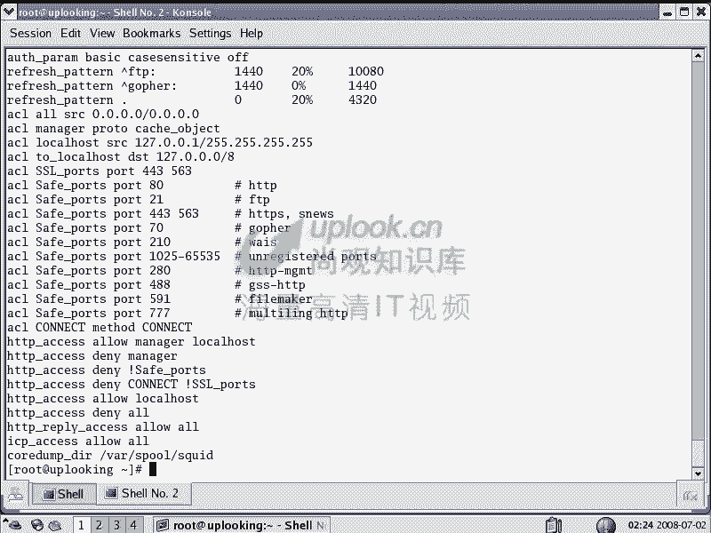
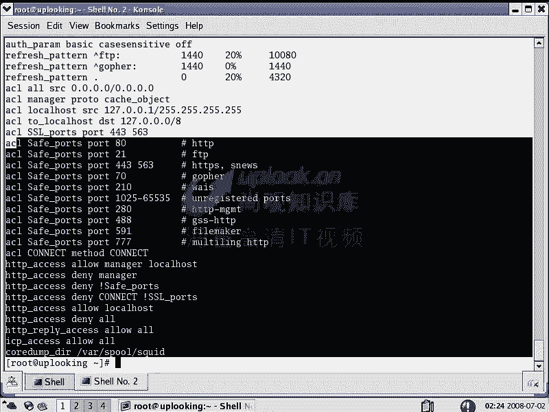
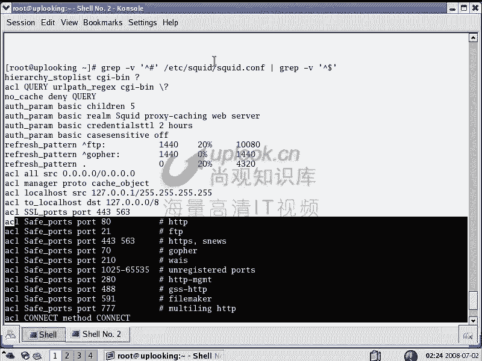
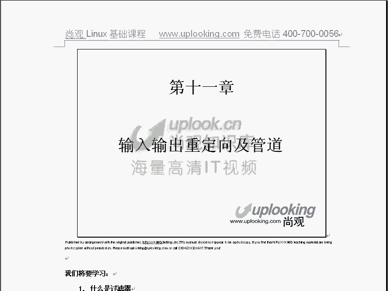

# Linux文本处理与正则表达式：P17：RH033-ULE112-10-文本处理及正则表达式

## 📖 概述
在本节课中，我们将要学习Linux系统中对文本文件进行操作的核心命令，并深入探讨功能强大的正则表达式。这些技能是Linux系统管理、配置和Shell编程的基础，与Windows系统主要依赖注册表不同，Linux几乎将所有配置都存储在文本文件中，因此熟练掌握文本处理至关重要。

---

## 📝 文本文件操作命令

上一节我们概述了文本处理的重要性，本节中我们来看看具体有哪些命令可以用于查看和初步处理文本。

Linux提供了多个命令来查看文件内容，它们各有特点：
*   **`cat`**：将整个文件内容一次性显示在终端上。
*   **`less`**：可以上下翻页查看文件，支持搜索功能，但属于交互式命令。
*   **`more`**：只能向下翻页查看文件，显示完毕后自动退出。
*   **`head`**：默认显示文件的开头10行。使用 `-n` 参数可以指定行数，例如 `head -n 5 file.txt` 显示前5行。
*   **`tail`**：默认显示文件的末尾10行。同样可以使用 `-n` 参数。其 `-f` 参数非常重要，可以实时监视文件的新增内容，常用于跟踪日志文件，使用 `Ctrl+C` 终止。

---

## 🔧 文本处理过滤器命令

仅仅查看文件还不够，我们经常需要对文本内容进行筛选、截取、排序等操作。以下是一些强大的文本处理命令，它们通常被称为“过滤器”。

### **`grep`**：文本搜索
`grep` 用于在文件中搜索包含特定模式的行。
*   `grep ‘pattern‘ file.txt`：在文件中搜索匹配模式的行。
*   `grep -r ‘pattern‘ directory/`：递归地在目录及其子目录的所有文件中搜索。
*   `grep -l ‘pattern‘ *.txt`：只打印包含匹配模式的文件名。
*   `grep -v ‘pattern‘ file.txt`：反向选择，打印**不**匹配模式的行。
*   `grep -A 5 -B 5 ‘pattern‘ file.txt`：显示匹配行及其**前后5行**的上下文。
*   `grep -c ‘pattern‘ file.txt`：统计匹配行的数量。

### **`cut`**：截取文本列
`cut` 命令用于从文件的每一行中截取特定部分。
*   `cut -d‘:‘ -f1,3,5 file.txt`：以冒号 `:` 为分隔符，显示第1、3、5列。
*   `cut -c1-10 file.txt`：显示每行的第1到第10个字符。

### **`sort`**：排序
`sort` 命令用于对文本行进行排序。
*   `sort file.txt`：默认按字母顺序排序。
*   `sort -n file.txt`：按数字大小进行排序。
*   `sort -r file.txt`：反向排序（从大到小或从Z到A）。
*   `sort -t‘:‘ -k3 -n /etc/passwd`：以冒号 `:` 为分隔符，按第3列（用户ID）的数字值进行排序。

### **`wc`**：统计
`wc` 命令用于统计文件的行数、单词数和字符数。
*   `wc file.txt`：输出行数、单词数、字符数。
*   `wc -l file.txt`：只统计行数。
*   `wc -w file.txt`：只统计单词数。
*   `wc -c file.txt`：只统计字符数。

### **`uniq`**：报告或忽略重复行
`uniq` 通常需要先排序，用于去除或报告**相邻的**重复行。
*   `sort file.txt | uniq`：排序后去除所有重复行。
*   `uniq -c file.txt`：在每行旁边显示该行重复出现的次数。

### **`diff`**：比较文件差异
`diff` 用于比较两个文件的差异，是生成软件补丁（patch）的基础。
*   `diff file1.txt file2.txt`：以标准格式显示两个文件的差异。
*   `diff -u file1.txt file2.txt > change.patch`：生成一个统一的差异补丁文件。

---


## 🧠 正则表达式核心概念

了解了基础命令后，我们将进入更强大的领域：正则表达式。它是一种用于描述字符串模式的语法，能让文本搜索和替换变得极其精确和灵活。

**使用正则表达式时，建议用单引号 `‘ ‘` 将模式括起来，以防止Shell解释其中的特殊字符（如 `*`）。**

以下是正则表达式的核心元字符：

*   **`.`**：匹配任意**一个**字符（除了换行符）。
*   **`*`**：匹配前面的字符**零次或多次**。例如，`a*` 匹配 “”、”a”、”aa”、”aaa”……
*   **`.*`**：匹配**任意长度**的任意字符（贪婪匹配）。
*   **`^`**：匹配行的**开头**。例如，`^Hello` 匹配以 “Hello” 开头的行。
*   **`$`**：匹配行的**结尾**。例如，`world$` 匹配以 “world” 结尾的行。
*   **`\`**：转义字符。使后面的特殊字符失去特殊意义，变为普通字符。例如，`\.` 匹配一个真正的句点，而不是“任意字符”。
*   **`[abc]`**：字符集合。匹配方括号内的**任意一个**字符。例如，`[aeiou]` 匹配任何一个元音字母。
*   **`[^abc]`**：反向字符集合。匹配**不在**方括号内的任意一个字符。例如，`[^0-9]` 匹配任意一个非数字字符。
*   **`\<` 和 `\>`**：单词边界。`\<word\>` 匹配独立的单词 “word”，而不是 “wording” 或 “password” 的一部分。
*   **`\{n\}`**：精确匹配次数。前面的字符恰好出现 `n` 次。例如，`a\{3\}` 匹配 “aaa”。
*   **`\{n,\}`**：至少匹配次数。前面的字符至少出现 `n` 次。例如，`a\{2,\}` 匹配 “aa”、”aaa”、”aaaa”……
*   **`\{n,m\}`**：范围匹配次数。前面的字符出现次数在 `n` 到 `m` 之间（包含）。例如，`a\{2,4\}` 匹配 “aa”、”aaa”、”aaaa”。

---

## 💡 命令组合与正则表达式实战

掌握了单个命令和正则表达式后，我们可以通过管道 `|` 将它们组合起来，完成复杂的文本处理任务。这是Linux命令行强大威力的体现。

**实例1：提取并排序所有用户的登录Shell类型**
```bash
cut -d‘:‘ -f7 /etc/passwd | sort | uniq
```
这个命令组合：
1.  `cut` 从 `/etc/passwd` 文件中提取第7列（Shell）。
2.  `sort` 对提取出的Shell列表进行排序。
3.  `uniq` 去除相邻的重复项，最终得到系统中所有不重复的Shell类型。

**实例2：快速查看配置文件的有效设置（去除注释和空行）**
```bash
grep -v ‘^#‘ /etc/squid/squid.conf | grep -v ‘^$‘
```
这个命令组合：
1.  第一个 `grep -v ‘^#‘` 过滤掉所有以 `#` 开头的注释行。
2.  通过管道将结果传递给第二个 `grep -v ‘^$‘`，过滤掉所有空行（`^$` 表示行首紧接着行尾）。
3.  最终只显示有效的配置行，使得冗长的配置文件一目了然。

**实例3：查找超过40个字母的英文单词**
Linux系统自带一个字典文件 `/usr/share/dict/words`。
```bash
grep -E ‘^[a-zA-Z]\{40,\}$‘ /usr/share/dict/words
```
这里使用了扩展正则表达式（`-E` 参数），模式 `^[a-zA-Z]\{40,\}$` 表示：以字母开头和结尾，并且中间至少有40个字母的单词。







---

## 📚 总结
本节课中我们一起学习了Linux文本处理的核心知识。我们首先回顾了用于查看文本的基础命令（`cat`, `less`, `head`, `tail`），然后深入学习了功能强大的过滤器命令，如用于搜索的 `grep`、用于截取的 `cut`、用于排序的 `sort`、用于统计的 `wc`、用于去重的 `uniq` 和用于比较的 `diff`。

更重要的是，我们引入了正则表达式这一强大工具，学习了如何用 `.`、`*`、`^`、`$`、`[]` 等元字符精确描述文本模式。最后，我们通过管道将多个命令和正则表达式组合使用，解决了查看有效配置、统计信息等实际问题。



这些技能是进一步学习Shell脚本编程、高效管理系统和进行数据分析的基石。请务必通过练习加以巩固，你会发现Linux的世界因此而变得更加清晰和可控。