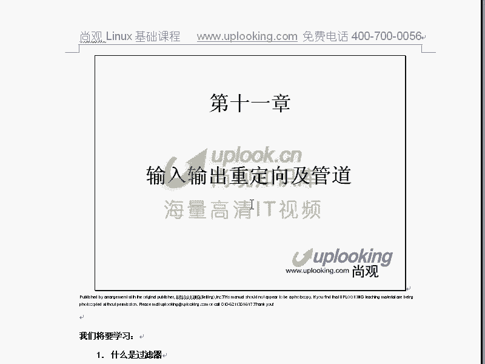
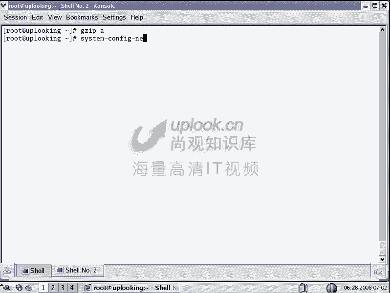
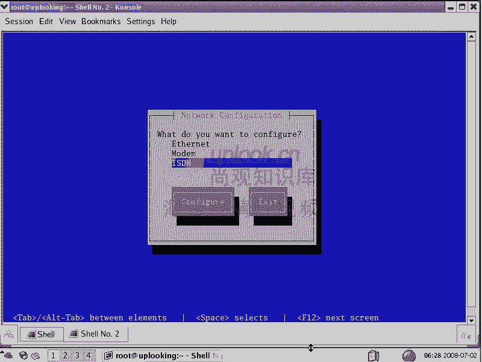
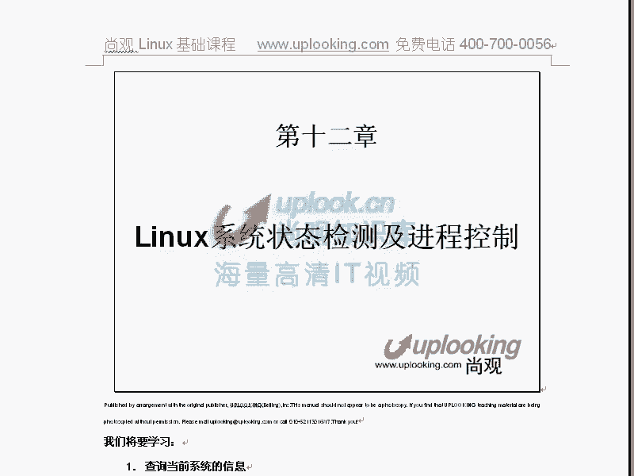

# 尚观Linux视频教程RHCE 精品课程 - P18：RH033-ULE112-11-0.输入输出重定向及管道 - 爱笑的程序狗 - BV1ax411o7VD

等一下。老师好，我们今天的话呢来给大家讲一下，就是说呃linux里面的输入输出重定像及管道。啊，这张的话呢不是不是很多。大家学的话呢可能会比较轻松啊。嗯呃每学一段，每学一章一定要练一下。

不要一气全都听下来，听能听下来的话，除非你特别熟练，否则的话呢你就是感觉很枯燥了，就你练一练的话，觉得哎我这个东西能用呢感觉比较舒服。嗯，所以这章的话呢，相对来说还更少一点啊。

呃输入输入重定像和管道的话呢，这张讲的是什么东西呢？主要是这样。现在。对于一个linux系统，那么你看到一个文件呃，一个命令做这个做那个它呢实际上呢都是呃都是大部分做这两件事情。

从某个地方呢得到一个数据源进行一下处理，然后呢再输出出来。这个时候呢就是呃涉及到一个输输出的问题嗯。这个呢呃就实很多人他可能不会想那么多啊，说哎什么输入输出啊，什么管道，我做一个命令的话。

他帮我做一件事儿嘛？是不是很简单的？但是呢从本质上编程时候来讲啊，你说一切的话，你要在编程编程者的角度上来考虑问题嘛？从编程者的角度上来考虑，你比方说LS命令LS命令是不是显示出文件名嗯嗯。

对吧对，比方说L啊L显示文件名，对吧？对当你显示文件名的时候，它实际上是从硬盘当中读出数据，然后给你输出到屏幕上，对不对？对，这是不是输入输出啊？嗯，是对吧？它涉及到输入输出，还有个重定向的问题，嗯啊。

即管到这就是我们今天要讲这样内容。那么在linux里面啊，在linux里面大致呢这些东西啊分成这样几类。

你看一下。大致呢啊就是说我们会先讲一下过滤器，然后呢再告诉大家什么是标准的输入输出，怎样改变这个标准的输入和改变这个标准的输出。然后呢，这个输出的种类有哪些？怎么样改变，然后呢，接着介绍一下管道。嗯啊。

那么就是我们介绍内容。那么我们说呢linux里面的工具的话呢，分成三大类，一个是过滤器，一个是编辑器还有个交互工具嗯，过滤器编辑器和交互工具。嗯，那么过滤器的话是什么呢？过滤器是这样。

就是说我们在这里面你看LS命是不是它从一个地方去读，嗯，然后又输出到屏幕上来，对，对吧？是那这就是过滤器，还有呢你方说cat cat ETC下的password。是吧嗯他是不是从这个文件当中读对。

然后输出到屏幕上来。对。这种类型的命令的话都叫做过滤器。嗯，过滤器的话就是从一个来源的话，把它作为输入。然后呢，并且它有个输出源，把它做到输出源上去。嗯，就这种类型的命令都是过滤器，明白了吧？明白。

那你看我们cat cat是不是最简单一个过滤器对。那这个过滤去它必然有个输入是吧？对它还有个输出。对，那么标准的输入是什么？标准的输入，你一般输入的话是怎么跟计算机进行输入输出的？嗯。

就是你给计算机一些消息，怎么给键盘命那个键盘是吧？对要输入一些东西，对不对？嗯，所以键盘是我们的标准的输入，而标准的输出是什么？显示器。对呀，那么cat呢它就是最简单的一个过滤器。你看啊，我输入cat。

一回车，他是不是在等你的键盘输入，对你键盘输入，我现在键盘在输入啊，输完了一回车是吧？对，是不是输入这行结束啊嗯。是不是输出到屏幕上来了？对。对不对？对他是不是从这里面去输入，然后呢输出到屏幕上。嗯。

那么最简单一过滤器。嗯，其他过滤器呢相对来说的话稍微复杂点。你比方说我们给大家讲过的GZ记不记得？记得GZ是不是我们说来把一个文件，比方说A。A这个文件啊进行压缩是吧？对，A这个文件进行压缩的时候。

是不是他把这个文件作为输入源？嗯，然后把这个输入源的话呢，进行一些什么压缩算法的这种压缩是吧？嗯压缩完了以后是不是生成一个文件，对，是不是输出了，嗯，它也是过渡器，明白吗？明白了？

所以呢从本质上来讲的话，输入输出重项是针对过滤器来的。而我们过滤器的话，在整个lininux系里面占绝大多数的命令。这命令的话，比100个有80个可能都是过滤器，明白吗？明白啊，okK那就是过滤器。

然后呢我们再看除了这个之外的话，还有什么呢？编辑器编辑器的话呢很多VI对吧？你说我VI能不能做过滤啊呃做做这个输入输出重定项不行，为什么呢？它这个交互工具啊，相当于实际上这种编辑器的话呢。

它跟交互工具是一样的，这个交互工具有哪些呢？你比方说我再跟大家输一个交互工具，比方说输入一个什么sstem杠config杠呃nwork。

杠7Y啊。这样的一个交互工具。哎，你看这个东西能不能输入输出重定项吗？嗯，不能对，它是一个交互工具。所以说我们说输入输出重定项是针对什么过滤器来的，嗯，明白了吗？明白了。

OK这就是输入输出重定项。然后接下来的话我们再看呃过滤器和输入输出重定项。那么这里面的话呢，有一些呃就说我们的这个呃细节的一些东西，就是接下来我们要展开的。首先告诉大家三三种类型的命令，过滤器是吧？嗯。

过滤器交互呃呃编辑器还有交互工具，我们说过滤器的话，它涉及到一个输入输出是吧？对，那么现在我们就讨论这个什么输入输出了。刚才呢我们那个小赵的话呢，也跟大家说了，就是哎过滤器的话，我们呃输出的话。

标准输入应该是键盘嗯，标准输出是显示器显示器对吧？那我们现在看标准的输入stand in啊，标准的输出stand out错误的输出stand error嗯啊。

也就是说呢它的输入的话呢是一个那么标准的输入的话是键盘是吧？嗯，输出的话是有两个，一个是正确的输出，一个是错误的输出嗯啊那么现在的话呃我看小赵的话呢，稀里糊涂的是吧？我给大家演示一下就清楚了。

你比方说现在我们看。LS命令是不是有输出啊，嗯，是不是输出到屏幕上来？对，那么当我想改变这个输出的时候，我这边是不是输出重定下一个大于号，就是把输出到应该输出到标准输出上的东西。

结果输出到我指定的一个文件当中去，比方说TMP下的什么ANA这个文件。嗯，那这样一回车，你看屏幕上有没有输出，没有没有。那你看一下TM下的AA。是不是这内容在这里面嗯，是不是？是，所以这个时候的话呢。

它就是一个改变了输出的这样的一个方式。嗯，明白了吗？明白，那么你看我再给大家举个例子啊，就是刚才那个例子LS然后呢LS大于号是吧？一个大于号是不是把标准的输出就重立下的嗯，对吧？

然后呢标准的错误输出是怎么样的？你看啊那个LSTTT有没有这个文件夹呢，它没有这个文件夹是吧？对这是不是有个错误的输出啊嗯，那这个错误的输出，我在输出的时候，我按大于号输出是吧？TMP下的AA。

按理说的话，他会把那个呃就是说把这个就是把这个信息的话呢，这串信息是输出的是吧？对，应该放在这里面是吧？嗯，对。有没有没有哎，为什么呢？因为。大于号是表示把正确的标准的正确的输出输出出去。

而标准的错误的输出是二大于号嗯，明白吧？所以它这个时候呢，你如果要是还是刚才这个命令，那么你想把错误的消息输出重项的那边二大于号，是不是？然后输出完，那我再catTM下的AA会怎么样？

刚才是不是这里面已经有东西啊，嗯，对，现在我又输出重项，那你说这个文件里面将会怎么样，多出一个错误的多出一行，刚才这个错误的消息是吧？嗯，那么直接回车，你看是这样？不是是吧？对。

那么也就是说呃我这样的输出重立项或者这样的输出重立项的话，它呢是事先把这个文件进行清空哦啊，尽管刚才是有东西的，但是呢我再大一号过去的话，它就已经是吧空了。然后呢，我会把我当前需要输出东西再放进去。

这个就牵扯东西比较多了啊，嗯我们给大家说的是什么？一个大于号表示把正确的消息输出重定向到一个文件里面去，对吧？比方说是刚才这个样子。那这个时候呢输正确的消息的话，输出重新向的这个文件里面。

这个文件的话会事先被清空掉。嗯，然后呢把这个消息。放到那里面去。嗯，但是当你呢出现一个错误的消息的时候，这个错误的消息呢不会重现过去。因为这个一个大于号的话，只重新向正确的消息。嗯。

当你想重新重新向错误的消息的时候呢话，那你可以加上一个什么2大于号，嗯，是吧？对这个的话也会把这个文件先清空掉，然后呢再把东西放进去，明白吗？明白了，明白了，好，我们给大家讲的什么呢？就是说呃。

我给大家讲的是一个是大于号，一个是二大于号，对吧？嗯，这两个清楚了，那么他们两个都会把后面这个文件清空掉，然后呢，把你输出东西的话放到这个文新文件里面去。相当于那么我们经常的话用它还经常这样。

你比方说呃你比方说在TM下的。DDD目录下去是吧？嗯，RM杠RFC我把这里面所有文件删除掉，那么现在没有文件吧，嗯，没有文件是吧？嗯，那我输出重项直接一个大于号嗯，ABC会怎么样？都于有念出来。

所以话呢你新建文件，你前万到诉大概新建文件啊touch一个A是吧？现在实际上你就直接什么大于号B，那这时候呢这个文件就新建出来，对吧？嗯，但是呢这个文件如果要是很大。

比方说我copyETC下的password，然后呢copy到当前目录下。那么现在这里面是不是有个pasword的文件啊，嗯，这个文件的话应该是有大小，是不是啊？对这个文件的话现在有1K多嗯1。9K。

那现在有一个大于号password。😊，这样会怎么样呢？把它清空了。嗯，看到了吗？这不是大小吗？这个地方是这么大吗，是不是对，现在的话有没有没有对。明白了明白了。所以呢我们看啊这个时候呢一个大于号。

它可以直接把这个文件的话，就是输出重定向，新建文件啊，新建文件呃新建文件输出重定向清空文件，它都可以做。嗯明样吗？明白，所以的话这个大于号的话，我们刚才给大家说了，它可以怎么样呢？新文件。

创建个新文件是吧？嗯，怎么样创建新文件呢，就直接这样于哎，想清空一个文件这样的是不是？对那么想去把这个正确的输出的话，重定向是不是？嗯，那你可以怎么样。这个样子是吧？对，正确的输出重定项是这个样子。

那么我们说二大于号的话，就是把错误的东西冲向出去，是不是他们两个都会把那个文件清空掉，就目标文件清空掉。如果目标文件在，那么就把它清空。嗯，如果目标文件不在，它就新建一个文件。嗯。

那我们常见的用法还是这样cat输出重定项成什么A点TXT文件，你这样一回事，是不是它等待你标准输入啊，是不是我说hello。This is a test。是不是嗯。回车。呃。

诶 group for you。嗯。Hello， kitty。是吧嗯然后呢等等，你说哎我输了这么多，刚才我cat的没有加大于号的时候，是不是我输入一行，他就给我显示句行嗯。

但是现在好像我输入完以后它没有反应了，对不对？嗯，那那怎么回事？我这边的话按下crl加D结束嗯啊，进入对。good for you。这些hello kitty都是我们同事啊。然后看一下A点TF9。

这个文件是不是跟刚才你说的是一样。嗯，哎那你说。这又是怎么样？这这又是一种用法，是不是？对啊，所以它这个东西是很很好玩的。嗯，啊，你可以任应的去使用它。那么二大于号的话，我们刚才说过了。

就是错误标准的错误消息啊，错误的消息的话有很多种。你比方说有调试的消息啊，总之它不是故意输出的消息。嗯，那么这些消息的一般都是错误消息。嗯，那么我们刚才说你要输入重立上的时候是正确的和错误的先分开的。

是不是？对你想一块输入输入进去怎么样？你要方说我这样的。呃，LS啊。那哎啊这样的fd从根开始查找门字为，然后这样一串东西嗯，这样一回撤。慢快。这个时候呢，你一回车以后，他呢就开始查找。

查找他会查找很多东西是吧？嗯，那么但是有的时候呢这个文件不存在的时候，他就会出现一个错误。说这个文件不存在。那现在的话我不知道会不会能能不能找出来啊。还是没有显示出来，先不管。就是我在查找的时候呢。

如果要出现一个错误，它错误的消息输出出来，嗯，正确的消息呢也输出出来。但是当我想去把正确的消息的话重定向的时候呢，这是一个大于号嘛。比方说重定向到TMP目录像。

就什么find file这样一个文件是吧嗯？没有错的消息的话，我也想重定向这个地方，R大于号，明白吧？明二大于号，然后呢，一般是这样的，加上一个什么呢and一表示呢，我把错误的消息也重定向到这个地方去。

嗯，所以呢一般是这样去表达。嗯啊，那么如果要是你现在想去怎么样呢？想去把正确的和错误的在linux里面全部都重定向到这个文件里面去，你还可以用另外一种表示方法。那么这个地方呢就加上一个什么and符号。

嗯啊and大于号。那么这样的话呢，它是不管正确的还是错误的，全部都重定向这个地方，跟上面这个命令是一模一样的结果，但是下面这个是不是写起来的话，非常简单啊，对，对不对？对。

所以这就是我们的什么就是说正确的和错误的，全部都重定向到一个地方写法嗯，明白了吗？明白了。那么我们知道这两个输出重定向，它都会把目标文件清空。那我不想清空，我想追加到里面，该怎么办呢？那我可以这样的。

你看le AA是吧？输入从列上到A当中去，那么cat A这里面是吧？对，那我再去执行一遍，再catA还是一行，对不对？这个你应该很好理解了。嗯，因为它要先清空A文件嘛，嗯对不对？对。

那么当我呢把这个一个大于号变成两个大于号的时候，就变成追加了啊。我是不是回去了三次啊？嗯，那这里面的话就应该有什么呢？思毫嗯，对不对？对，这就是追加。所以呢总结一下一个大于号清空文件或者是新建文件。

或者是把正确的消息重向过去。二大于号把错误的消息重新下过去，或者把那个文件也清空掉，就无所谓。那么接下来的话呢，我们说当你想它正确的和错误的全部都重新这的时候，那么你可以加上一个什么and大于号，对吧？

然后也可以什么呢？先是一个大于号，然后接着是2大于号and一是吧？就这样的两种写法。嗯，对吧？把正确的和错误的全部都重新向那个地方去。然后呢，还有呢就是我们的什么，还有呢就是我们的呃追加两个大于号追加。

在这里面的话，我们给大家说了一个例子，你比方说A这样的话，我们可以轻空它，可以新建它是吧？还可以什么呢cat，然后输出请重新向A这样的话呢，你输入的内容就变成A文件里面的内容啊，嗯，对不对？对。

那么这就是我们刚才讲的这些东西有没有问题，就是嗯。没有没有啊嗯嗯。大家也可以看一下啊，稍微琢磨一下。你可以在听的时候的话，按一下暂停键，然后呢，把我刚才竖的一些自己来敲一下，嗯试试看对吧？嗯，然后呢。

我们再现在再来给大家再更多的说一下，你比方说。现在啊我这样的cat输出图一像A呃，我比方说cat。呃，这个的话大家可以暂停一下看一下啊。然后呢，我们接下来往下讲了。啊，cat，然后呢是输出重定线啊。

cat的话，我就这样的，我就这样的呃显示出来。那么刚才的话我是输入一行，它就回呃回答一行是吧？对，这没好像没什么没什么好说的，这很简单嘛，是不是但是现在呢我这样的还是一样cat呢，我加两个呃。

就是说这是输入重项，一个小于号是输入重向的，一个大于号是输出重项嗯，两个小于号的话就是说呃做这个事情，你要说我输入一亿啊，两个小于号是1一。那么你看到这个提示符是不是就变了。嗯。

是吧那么现在我还是这样的输入一行，哎，有没有反应，没有再输一行，还没有反应是吧？再输一行是不是还没有反应？嗯，那么当你按cttrorl加D的时候，表示键盘输入结束的时候。

他才会把你刚才输入的那几行输出出来。所以呢大加两个小于号的话，就是说等待你进行输入，直到出现两个小于号嗯。直到出现两个小于号之后的这个EE。的时候它才会一并给你输入出来，或者摁下ctrl加D的时候。

它才会输出出来。嗯，明白吗？明白，所以这个时候呢就是两个小于号的作用。有一个小于号应该输入重复一下，两个小于号的话，就是说等待着你输入，先不把你的输入给那个命令。

等到你出现这个两个小于号后面的意义的时候，或者摁下ctrl加D的时候，它才会把你的输入一块给这个命令。明白了吗？明白了，那我看一下数重录像的话，通常在什么地方。数重录像的话，我们一般用的特别少啊。

你比方说我这样的cat我直接回车，那你这是不是在输入，嗯，是不是？那么你cat一个小于号，然后呢，这样的，它就有点问题是吧？嗯那么这样的话你加上1个ETC下的pas错了。

你表示我把这个文件当成是cat命令的一个输入，对不对？嗯对啊，那么你说哎这不是跟cat这个文件是一样的吗？对吧嗯，但是呢你看这两者的区别在于什么呢？cat要支持后面的这个参数作为输入。

也就是cat写的这个程序，那它就直接能这样用。嗯，但然有些命令它是不支持的，有些命令它不支持后面加一个文件名作为输入的，那你就要自己去做。你比方说。我们有一个特别简特别好玩的命令啊。

TR命令TR特别有意思。TR的话是这样的TR你加个双引号，比如说A到Z啊，小A到小Z是吧？嗯，再加上一个什么大A到大Z是吧？你加一回撤以后，你输入一个hello一回车，它是不是变成大写的，嗯。

然后输入小写的是不是变成大写，哎，是不是变成大写的，嗯好玩吧？考试加D结束是吧？对，哎，那你说我现在想把一个文件啊全部都变成这个样子，小写大写的话，调换一下，我加上一个什么ETC下的错。😊。

对是对专一回车。这是什么？太多的参数多他不支持后面这个参数作为他的输入人，是不是？嗯，对于这种情况下的话，你就需要用什么？数的营销啊，明白吗？嗯这个时候呢。嗯。😊，对吧对于傻子来说的话。

你输入重击项的话就需要了。明白了吗？明白嗯，所以呢这个时候的话输入重项的话，你可以作为一个这样的一个呃就是说。你能推测出来这个命令到底是什么地方编的有问题啊，那能对用数重向试试看看成不成。嗯。

但是呢还是一样的，它肯定是对过滤器才有作用。嗯，这编辑器啊交互工具它是没有作用，嗯，对不对对。所以的话呢这就是典型的一个输入重项的例子。OK那么刚才我给大家讲了，输入重项和什么？就是两个输入重项是吧？

嗯，这样的方式你你这个后面这个字符的话可以无所谓，随便什么字符都行。那么这样的话，我跟刚才那个结合起来，比方说cat输入重项成一个A文件。呃，A点TXT的文件，然后呢，两个数重下E1E是不是？嗯。

然后这样直接回车，是不是你开始输出了？对，你说hello。啊， ok。是吧嗯点com上端是吧？上方的英文名就是abbroing啊，我输完了，我最后输入一个什么EE结束直接回撤。哎。

这个消息它也不会输出出来，是不是？对，那么放哪了？哎。对吧这里面的内容的话就跟刚才述的是一样的嗯。很多同学的话呢，这个时候他就琢磨了。你有病吧？可是我病啊，有有人说有病啊，你说这个东西的话。

你直接编那个文面不就好了吗？😡，那我问你，假如说你现在需要创建1个A点TXT文件，但是只能通过sell脚本去创建。你这个脚本的话是非交互模式，嗯，不由你去控制的。就比方说他每天半夜去创建一个文件。

这个文件里面有些什么什么内容。你咋整啊？是不是你必须得要爬起来，半夜凌晨2点钟备份的时候爬起来是吧，说我要取一个名字，我要VI进去是不是行？对，但是你这个东西呢放在s编程里面。

hell shell编程里面的话，那它就可以自动创建这个文件了。刚才我现到VIB点SH这样的个s脚本是吧？这个脚本当中话是这样的输出一个命呃，B点TXT是吧？对，然后两个小于号比说DDD是吧？嗯。

那么这样的话，我说。呃呃， this。Is a test。是吧嗯然后呢呃。下面就是内容。这内容的话输出上去是不是？嗯，这个文件的话呢，我最终结束了，我输个DDD。啊，那可以说对吧？嗯。

然后呢CHMD你要想让他去执行，可以执行，那给他加上那个什么A加上X加上X权限是吧？嗯，给B点SH这样的一个脚本。那么你执行它的时候是这样的，点杠B点SH或者是什么呢？我现在没有回车啊，我现在没有回车。

或者是点杠B点SH，或者是你执行它的路径啊，然后TMT项目。的，DDD目录下的B点SH嗯，明白吗？那这样我行行式都行，那我这样点杠B点SH。冇有发噶嘛嗯。看一下B这个文件哎，B点TXT这个文件。

是不是这个内容？嗯，是，那你现在是不是通过一个脚本自动一执行，这个文件就创建出来了。嗯，对。需不需要跟你交互不需要你这样执行一下吗，需要跟你交互吗？不需要，那你放在计划任务里面，每天半夜去执行。

是不是就嗯很方便对。这就是它的作用，明白吗？明白OK我们总结一下啊，输出环境下。2。是是同类项还有什么呢？and是是同类项是不是？对。and输出成项还有什么呢？还有二大于号and一这种方式，嗯，对吧？

对，那么输入成项是做什么的？两个输成项做什么的，两个输出成项是做什么的，对不对？这是我们刚才讲的内容嗯。如果要是不清楚的话呢，回顾一下啊。B点SH这个文件啊，就刚才在做的那个例子。

OK那么现在呢这是我们刚才给大家讲讲的。然后呢，现在的话呢，我们还要再进一步啊，大家先呃可以琢磨一下。进一步的话是怎么样呢？就是说我能不能把前面一个命令的输出给后面一个命令，直接作为它的输入啊。

你比方说这样的一个例子。viux词里面能不能统计出这个目录下多少个文件夹，有多少个文件？总共有多少多钱？你比方说这样的，然后SETC是不是啊？那这样的话有这么多文件，多少个？数一下123把脚趾头的搬上。

是不是？然后呢，可能把你隔停坐位的脚趾头也发上也不够。那么LS这时候你加上个WC到L啊，WC到L。都会告诉你239个文件。嗯啊，你说WC杠L不是显示行吗？是不是显示行啊嗯啊显示行是吧？

但是实际上呢你要S。这个命令尽管你看到好像一行是应该包含着这四个文件的，是吧？实际上不是。那么你把它输出重新项出去了以后，它那边只是给你显示出来一个格式，然后输入重进项成A，然后你cat a。

你会发觉这一个文件是一行的。嗯，也就是说它那个LS的话呢，是尽管是给你显示出来。而已。显出来这样而已。但是真正的给到后面一个命令作为它的输入的时候的话，那么它实际上就跟A这个文件里面是一样的。

所以他到我加成这样的。加个WC杠L是不是就能显出来到底有多少个文件。嗯，一个文件名的话是一行嘛，嗯，对不对？对，所以这时候我能显出来。那么你说哎有多少个文件夹呀，这里面。我可以加杠L吧。

嗯但L文件夹是不是以D开头的，你看以D开头的是文件夹蓝颜色的，嗯，对不对？对，那么普通文件是不是以杠开头的？嗯，对，对吧？以D开头的是文件夹是吧？嗯，还记得昨天我们讲正额表达式吧。嗯。

以D开头应该怎么说。加上管道是吧？E地开头的GREP。这块表达式应该用什么引起来？对翻引嗯，那么以什么什么开头那斜靠向上的这个尖是吧？肩啊向上接对啊，以D开头是吧开头。是不是全都是目录，对，对不对？

那么全都是目录目录有多少个？WC是到L哎，80公。好玩吧？嗯，所以这个时候的话你是不需要一个呃大的国民矩去帮你做这件事情，你自己是搞定的。明白了吗？自己只要头脑的这个想象力充，就是非常富有想象力。

那你能把它搞定。嗯，明白了吗？明白这个时候呢你看呃LSETC像杠LGLEP向上的一个D。那么这时候呢，你可以把所有的文件夹显示出来，这就是跟我们昨天的那个就串在一起的。但是你看到其中这个管道。

就是这个竖杠，这个竖杠的话，就是那个回车那个附近的有一个竖杠，就是呃就是分成两段的那个就是斜杠的那个跟斜杠那一个键的那个呃那样的一个键。这个竖干的话呢。

它呢是把前面一个命令的输出直接给后面这个命令作为它的输入，明白吧？这就是管道，管道呢也只能串联什么过滤器，嗯，明白吧？相当于两个管子，我把它的头和那个那个管子的进口拧在一起。嗯。

那个管子的出口和第二管子的进口拧在一起，这就是管道，你还可以一直串下去，嗯，明白了吗？这边你看我们串了三角管管子嘛，嗯，对不对？对，这就是我们的管道，明白了吧？明白了，那你说有多少个普通文件。142啊。

有多少个链接？以L开头的17个链接，对不对？嗯这样话能都能显示出来，这就是我们的什么管道嗯。如要是你在某一个地方啊，你比方说我想把这个管道啊呃就是在某一个地方的话呢，我复制一份。

你比方说我想现在看一下到底有多少个软链接啊，那么我可以用T11把这个内容啊，就相当于我现在本来要输出呢，到这个地方的话，是不是要。看一下啊。在这个地方哈是不是要输出所有的软件接？对这个所有的软件接段。

我在这个地方，我还想看一下什么到底有多少行。是不是他只能告诉我十7行。对，原来这个内容是不是就不能输出了。嗯，那我想说在这个地方我复制一份出来，这个复制的这份给WC杠L。同时的话。

我还要把那份什么原本那份的或者说复制出来那份放到某个地方去。那么这时候你可以用TE来做复制。TE成什么呢？比方说啊呃BBB这个文件，然后再加上一个管道，明白吗？那这样直接回车。你看十7是吧。

你在caBBB这个里面的话，就刚才那里面的这种嗯，明白吧？明白你说哎，这并没有显示出来呀，你要想显示出来，你看一下现在的话，我们是不是在。PTS杠2嘛嗯是吧我现在运行个Wouble命令嘛。

我是在PTS杠2上这个这个我现在这个空台在PTS杠2上，对吧？那么我现在这样。刚才TE到BBB当中去嘛，嗯TE到什么DV下的PTS杠2嗯，是不是直接回车是不是显示出来。对，同时他告诉你总共有17个。嗯。

是不是啊？对，所以他呢你可以呢做很多很多的这种呃设置，或者说很多很多的这种呃。就是随你的这个想象，你的想象足够丰富，你可以把这些命令框任意的搭起来，就跟你个给你个积木一样。嗯，这个积木看你自己去做。

但windows不一样，windows给你搭好了，然后你去照着windows的去做好了，windows不给你提供这个功能，你没有用了，明白了吧？明白这就是他们的区别啊，OK那么现在的话我们回归一下。

看我们刚才讲的什么，这是我们刚才讲的管道啊，管道还有一个是什么呢？TE是吧？TE这个命令，就是在管道用的时候复制一份出来，对吧？复制一份到指定的文件当中去。OK那么这是标准的输入输出及重新项。呃。

这章的内容的话呢基本上就结束了。小于号重新定义向输入是吧？嗯，那么呃指定输入源明确输入源。你比方说刚才cha命令它是不需要的。但是呢TR命令它就需要了嗯，是不是？对。

两个小于号的话是让它先去把什么输入缓存下来，直到等到两个小于号之后的那个数值的时候，然后再一并的输出出去，对吧？对。输入中新下。啊，然后呢还有就是我们的一个大于号，两个大于号这要做下去是吧？一个是追加。

另外是清空掉对方是吧？对，二大于号是错误的输出是吧，错误的输出。错的输出重项。那么2两个大于号的话是也是追加了。管道的话就是把前面一个命令的输入给后面一个命令直接作为它的输出，是不？啊。

前面一个命令的输出啊，作为一个后面的后面的输入。你们你们。那这就是一些例子啊，比方说这边加个more啊，一个输出的话呢，太多，它老是分页啊，那么一下就滚过去了，加个more的话。

它就会什么一瓶一瓶的去显示，对吧？这就是一些例子。所以呢希望大家呢自己来用一下啊，自己来用一下。那么第十2章的话就是我们的系统状态的检测及进程啊，进程的控制。OK这就是我们的呃11章的内容。

那么希望大家呢能呃搞清楚啊，能搞清楚，那么我们现在的话呢给大家看一下，就是说呃这个数输重一下，就刚才我们那个TR命令啊，有一个非常好玩的这样的一个东西，它有一种密码。这个密码的话是这样的。

就是我把呃小A到小Z呃小A到M吧，MN这样的。呃，小N到Z。还有吗？我看大A到大M。这是一种密码替换啊，挺好玩的。大家可以如果有兴趣的话，可以自己琢磨一下，就大N到大Z，然后呢把它进行一下替换。呃。

这边的小A到小M啊，小A到小M这一段替换成什么呢？大N到大Z这一段。大N到大Z这段，然后呢把这个小N到小Z的话替换成什么呢？大A到大M。那么同样这边的大A到大M替换成什么？大N大A到大M替换成N到Z。

是不是？对。小A到小N到小Z，然后那边呢什么呢？大N到呃大N到大Z的话，替换成A到什么？A到小小M。然后呢，这样一回车，这是一个现方式。那么你输入一个什么？比如说嗯I love you是吧？

MUC那么直接回车。是吧变上一下密码，这边的话就是说把这个作为一个个体啊，这样的一个个体。然后呢替跟这边的话相对应。就是说这个A替换成大N啊，大N是吧？然后呢，这个M的话呢替换成什么大Z是吧？

当中的话呢，一一对应当中的话一一对应，那么这边的话呢也是这样替换，这边是一个小挺好玩的东西，那么跟那个结合在一起的话就是什么？现在的话我要把一个文件进行加入，嗯，输程复像什么呢？ETC叫索。

直接回车这个文件的话，你就看不出原来的样子，根本就看不出来，对不对？嗯，所以呢这是一个小的什么小的加密的这样一个游戏，叫什么码来着，我忘了，但是挺好玩的一个东西，大家可以自己琢磨一下啊。

这是一个小的加密的一个例子，实际上输入重重项。那你现在的话想把这个文件话进行什么？加密完以后输出重像成什么呢？输出重向成一个。ABC这样的一个文件嗯啊点TXT。是不是这个文件就解就加密了。嗯。

你要把它解开的话，把这两个算法把这个地方。放到这边来，这个地方呃，就是这个地方的话，放到后面，这个地方放到前面，嗯，是不是它就解回来了。对啊，所以呢这就是你你可以把它直接加密。

把一个文件的话加密成这个样子了。嗯，是吧？对，然后还有呢一些。一些那个做法也挺有意思的，大家可以自己琢磨一下，这边的话是用输入输出重项的话呢来做的。那么你说哎我不想出重项加，就是给一个文件。

不是想输出成一个文件，我想直接发email。啊，给你的另外一半啊，发一个 emailmail，比方说给女朋友啊。管道。管道会吧？嗯，mail是发email。到S指定什么呢？指定出呃这个S的话是主题啊。

说什么呃，加密的量啊。可以。这是主题，能后发给谁呢？shack at up点com。一回车。哎，就发给我了我一看哎，这是一串密文。嗯，大家可能说哎这个东西的话能发出去吗？这个mail命令能发出去。

mail命令它也是一个什么？也是一个过器，它也是有输入源输出源的，它输出是什么呢？发email发出去，输出到这个email地址啊，它就发出去了。那么输入源的话呢，可以是任意的一个文本。

就刚才把我这个文件里面的内容的话，加密以后给了mail命令，那么主题这个email的主题是for you啊，然后发给谁呢？发给shack明白了吧？这样一会撤这个邮件就出来了。啊，它就是一些应用。

OK那么这节课的话呢，我们就讲到这个地方。下节课的话第十二章就是说我们的系统检测及进程的控制。嗯，好，OK那我们这章结束。

