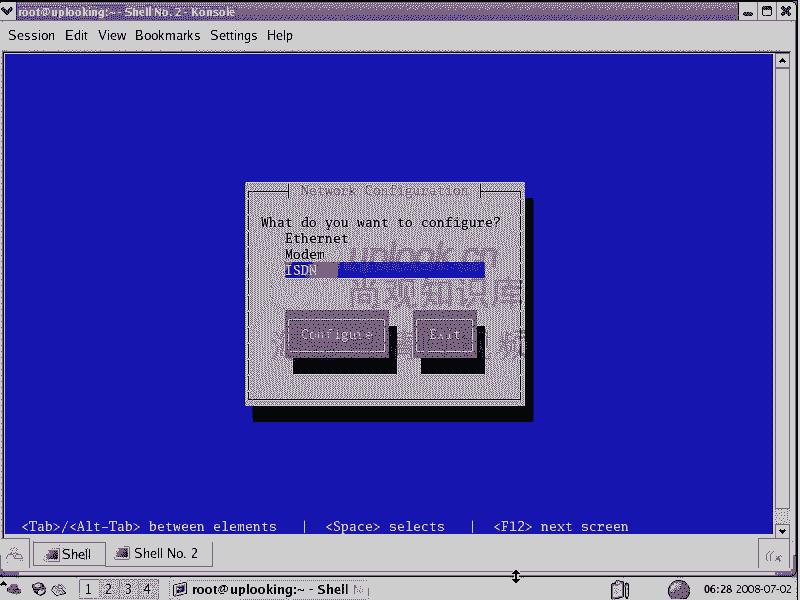

# Linux基础教程：第11章：输入输出重定向及管道 🚀

在本节课中，我们将要学习Linux系统中一个非常核心且强大的概念：输入输出重定向及管道。理解这些概念，能让你更灵活地控制命令的数据来源和去向，将多个命令组合起来完成复杂任务。


## 概述 📖


对于一个Linux命令，其本质通常是从某个地方（输入）获取数据，进行处理，然后将结果发送到另一个地方（输出）。本章将详细介绍如何改变这种默认的输入输出行为，以及如何通过管道将多个命令串联起来。

## 命令的分类

在深入讲解之前，我们先了解一下Linux命令的三大类别，因为输入输出重定向主要针对其中一类。

*   **过滤器**：这类命令从标准输入读取数据，进行处理，然后将结果发送到标准输出。例如 `ls`、`cat`、`grep` 等。它们是输入输出重定向和管道操作的主要对象。
*   **编辑器**：如 `vi`、`nano` 等，用于交互式地编辑文件内容。
*   **交互工具**：如 `system-config-*` 系列命令，提供图形或文本界面与用户交互。

**输入输出重定向和管道主要是为“过滤器”类命令设计的。**


## 标准输入、输出与错误



每个过滤器命令在运行时，系统会为其打开三个默认的“数据流”：

*   **标准输入 (stdin)**：默认是键盘，命令从此读取数据。
*   **标准输出 (stdout)**：默认是显示器，命令将正常结果输出到此。
*   **标准错误 (stderr)**：默认也是显示器，命令将错误信息、警告等输出到此。

## 输出重定向

输出重定向是指改变命令输出的默认目的地（显示器），将其导向到其他地方，通常是文件。

以下是输出重定向的核心操作符：

### 1. 重定向标准输出 (`>`)

将一个命令的**标准输出**保存到文件中。如果文件不存在则创建；如果文件已存在，则会**清空**其原有内容。

```bash
ls > file_list.txt
```
执行后，`ls` 的结果不会显示在屏幕上，而是被写入 `file_list.txt` 文件。

### 2. 重定向标准错误 (`2>`)

将一个命令的**标准错误**保存到文件中。同样会清空目标文件。

```bash
ls /nonexistent_directory 2> error.log
```
执行后，`ls` 命令产生的错误信息会被保存到 `error.log` 文件中。

### 3. 重定向标准输出和标准错误 (`&>` 或 `> file 2>&1`)

将命令的**标准输出和标准错误**都重定向到同一个文件。

```bash
# 方法一：使用 &>
find / -name "*.conf" &> all_output.log

# 方法二：使用 > 和 2>&1 (效果相同)
find / -name "*.conf" > all_output.log 2>&1
```

### 4. 追加输出 (`>>` 和 `2>>`)

如果希望将输出**追加**到文件末尾，而不是清空文件，可以使用 `>>`（标准输出）或 `2>>`（标准错误）。

```bash
# 追加标准输出
echo "New line" >> existing_file.txt

# 追加标准错误
some_command 2>> error_log.txt
```

## 输入重定向

输入重定向是指改变命令输入的默认来源（键盘），使其从其他地方（通常是文件）读取数据。

### 1. 基本输入重定向 (`<`)

让命令从指定的文件中读取数据，而不是等待键盘输入。

```bash
# 通常 cat 可以这样用
cat < /etc/passwd

# 对于某些不接受文件参数的命令，输入重定向很有用
tr 'a-z' 'A-Z' < input.txt
```
`tr` 命令通常从标准输入读取，使用 `<` 可以使其从 `input.txt` 文件读取内容进行转换。

### 2. 内联输入重定向 (`<<`)

也称为“Here Document”。它允许在命令行中直接嵌入多行文本作为命令的输入，直到遇到指定的“结束标记符”。

```bash
cat > newfile.txt << EOF
This is line 1.
This is line 2.
This is the end.
EOF
```
执行后，`cat` 会将 `EOF` 之前的所有文本作为输入，并通过输出重定向写入 `newfile.txt` 文件。这在编写自动化的 Shell 脚本时非常有用。

## 管道 (`|`)

管道是Linux中最强大的概念之一。它可以将一个命令的**标准输出**，直接作为另一个命令的**标准输入**。

其基本语法是：
```bash
command1 | command2
```

以下是管道的一些实用例子：

*   **统计文件数量**：
    ```bash
    ls /etc | wc -l
    ```
    将 `ls /etc` 的输出（每个文件名一行）通过管道传给 `wc -l` 命令，统计出行数，即文件数量。

*   **筛选和统计**：
    ```bash
    ls -l /etc | grep '^d' | wc -l
    ```
    1.  `ls -l` 列出 `/etc` 的详细信息。
    2.  通过管道传给 `grep '^d'`，筛选出以 `d` 开头的行（即目录）。
    3.  再通过管道传给 `wc -l`，统计出目录的数量。

*   **分页查看长输出**：
    ```bash
    dmesg | less
    ```
    将内核消息通过管道传给 `less` 命令，可以上下翻页查看。

## 命令 `tee`

`tee` 命令像一个“三通管”，它从标准输入读取数据，**同时**将数据写入标准输出和一个或多个文件。这在需要既看到输出又保存到文件时非常方便。

```bash
ls /etc | tee file_list.txt | grep '^a'
```
这条命令：
1.  执行 `ls /etc`。
2.  将其输出通过管道传给 `tee`。
3.  `tee` 将数据**保存一份**到 `file_list.txt` 文件。
4.  同时，`tee` 将数据继续通过管道传给 `grep '^a'`，筛选出以字母 `a` 开头的文件名并显示在屏幕上。

## 综合应用示例

让我们看一个有趣的综合应用，利用 `tr` 命令和重定向实现一个简单的文本替换“加密”：

```bash
# 创建一个简单的替换密码：a-m 替换为 N-Z，n-z 替换为 A-M
# 加密文件
tr 'a-zA-Z' 'n-za-mN-ZA-M' < secret.txt > encrypted.txt

# 解密文件（反向替换即可）
tr 'n-za-mN-ZA-M' 'a-zA-Z' < encrypted.txt > decrypted.txt
```
这个例子展示了如何组合输入重定向 (`<`)、输出重定向 (`>`) 和过滤器命令 (`tr`) 来处理文件。

## 总结 🎯

本节课中我们一起学习了Linux输入输出重定向及管道的核心知识：

1.  **重定向**：我们学会了如何用 `>`、`>>`、`2>`、`&>` 等操作符，灵活地将命令的输出导向文件，或用 `<`、`<<` 改变命令的输入来源。
2.  **管道**：我们掌握了 `|` 操作符的魔力，它能将多个简单的命令像积木一样连接起来，构建出功能强大的数据处理流水线。
3.  **辅助命令**：我们了解了 `tee` 命令可以在管道中分流数据，既保存到文件又传递给下一个命令。


掌握这些技能，是成为Linux高效用户的关键一步。它们让你能超越图形界面的限制，通过命令行组合完成各种自动化、批处理任务。请务必多加练习，尝试将不同的命令用管道和重定向组合起来，你会发现命令行世界的无限可能。下一章，我们将学习系统状态检测及进程控制。