# 尚观Linux视频教程RHCE 精品课程 - P19：RH033-ULE112-11-1.4.解决Linux服务器访问比较慢的问题-网络测试命令讲解-ping-netstatarping-arp - 爱笑的程序狗 - BV1ax411o7VD

啊，小明，你有什么问题吗？就是最近我们那个服务器前一段时间都挺好的嘛？然后最近一段时间访问的时候是吧，大家都反应说你服务器反应特别慢嗯，那我也不知道是为什么什么原因造成的。

然后能不能教我一下怎么查看一下是吧，是网络的问题，还是说其他的问题啊，你现在应该升官了吧，升官了以后的话呢，我觉得就是你现在要具备一个就是说什么样的能力啊，就是不是说遇到一个问题以后的话，就立刻问我嗯。

而是应该有个自己的这个。思考的过程是吧？你觉得就是说呃你现在访问慢是吧？嗯，这个服务器访问慢，你做过一些什么样的操作，或者说你想这个东西应该是什么样的问题，把你的思路说出来，对和不对都没有关系啊，嗯。

那我就先嗯先拼一下，看看服务器能不能是吧，正常访问外网或者啥的啊，然后试范一下，然后是好像是没有什么问题的啊，然后那我就再可能我就看我就看一下那个服务器的那个嗯有关网络网关啊，DNS啊这方面的配置嗯。

嗯，还是就是没有什么问题，也没找出来原因啊，后来我说说能不能是抓几个包，看来是访问量太大了，导致的，还是说有DDOS攻击啊什么的，当是其我找问慢还没整出来，就是说这个服务器访问慢啊，这个服务器的话。

可能是你的现在一个生产系统是吧？然后呢大家一开始访问慢不慢，然后呢，现在是不是突然慢了啊，就是如果我去解决这个问题，我可能会突然我我看我这样去想啊，你看啊如果要是我一开始访问慢，嗯，原来就慢，现在也慢。

是吧？那就是我服务器一开始装系统的时候就有问题，对，要么是我装的这个软件有问题，要么的话就是呃公司的那个网站或者哪个地方有问题对吧？那这个时候的话呢，我就会去解决一开始安装的时候就会存在的这些东西。

比方说什么呢？内核参数啊，比方说有什么呢？呃就是你比方说我的网站呃，就是我的这个呃服就是这个。软件的版本啊，是不是有bug等等啊，还有的话呢就是说呃。比方说一开始装了以后。

那么我的这个就是网络的这个状态啊，就比方说网线啊或者网卡会不会有一些什么样的问题啊，明白吧？那如果要是一开始装的时候就已经有问题了。嗯，那我可能从这些方面的话呢去解决，而如果要是一开始没有问题。

后来突然变慢了，那肯定是有个什么原因，什么个因素对吧？那这时候我看啊慢到底是什么慢，就是说你是发出去的数据包受到了限制，掉包率特别大，还是因为我们的服务器的反应有问题。比方说我看一下top。

看一下服务器状态怎么样啊，是吧？也就是说如果是突然变慢的，那它自然是有一个原因，这个原因到底在哪，或者什么触发的原因，比方说你们的比方说昨天啊就是这两天开始慢的。

那么前天或者是这一周是不是有人上传了新的新版的这个就是网页或者新版的这个网络游戏的这些东西，对吧？所以这些因素的话，你要搞清楚，然后才能针对性的决问题。嗯明白了？你的网关一直都没有改。

那怎么会突然他变成他变慢了，是吧？那可能有ERP攻击的，是吧？所以这个时候的话我们就要呃。大致去分析。嗯，那我的经验的话呢，我就是把我的思路告诉你一下。行，好吧，呃，首先我觉得你聘的话呢，倒是也对啊嗯。

但是呢聘实际上并不能解决这个就是并不能看出这个到底是对还就是到底是怎么样的。你般我任意聘一个网站啊。方我在windows下拼某个网站拼啊，3W点C呢点com点CN是吧？那这时候我去拼。

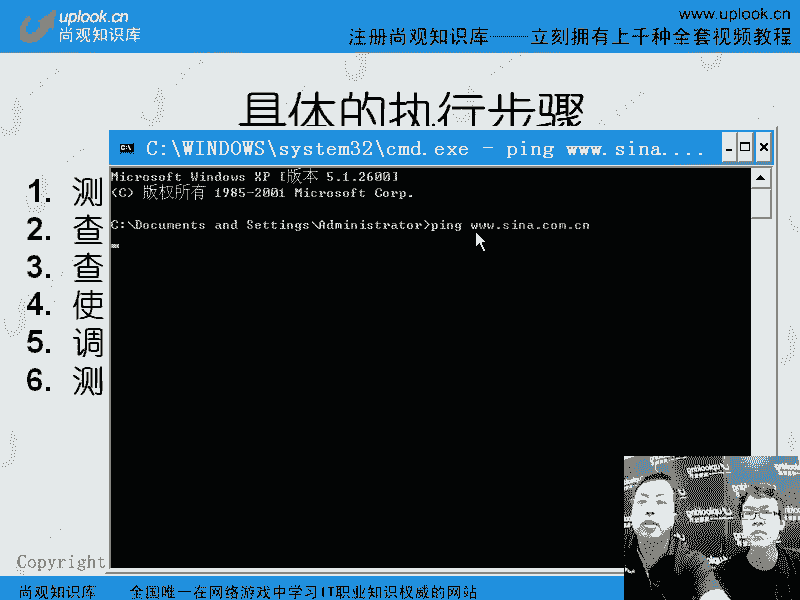

啊，这时候的话呢，他告诉我多少毫秒多少毫秒是吧？当然这是一台服务器。如果我拼自己的服务器，比方说拼呃我们公司的服务器是吧？嗯，up点CN啊，那这时候的话呢，它反馈的速度是怎么样怎么样，对吧？嗯。

这时候它只是一个对比的关系啊，也就是说你能看到啊，你这个服务器可能跟新浪的服务器的那够跳数都是差不多的。嗯，对吧？如果我再去拼你其他的服务器。比方说3W点啊。盛大了啊，我不知道是不是盛大是这个域名。

我不知道盛大是不是这个一名啊。你看他的反应的这个跳数的话呢，也算是比较快。嗯，那我知道至少知道他们的这个就是网络的这个资源差不多。就是说并不是说这个网络带宽多快，而是这个网络的跳速啊。

距离我现在来说是差不多的嗯，那同时的话你让外地的同事去拼一下是吧？那么是不是地区性的问题。比方说某个地方不慢，某个地方快，那这就是各个地方的这个网络状态的问题了啊，如果都统一慢。

那你看到这个响应的时间是不是都是差异很大，如果响应时间差异很大，那就是说可能是这个路途当中啊，某个路由器或者说你买的这个服务器，这个服务器的话呢，它所在的这个位置啊，就是它所在的位置资源太差了。

我们要到那边去兜一个大圈子，然后中途遇到的路由器特别多那导致它总是储存转发，储存转发，然后呢，这个数据包延迟了很长时间。所以拼的话，你只能看这么一个东西。明明白吧？那当然拼的话。

你可以加上一些其他的参数。啊，windows下的话呢 pin啊问号呃，就是杠问号，你可以看的话呢， pin这个个数是吧？呃，pin杠T的话呢，这是我们常见的参数了。杠T的话就一直拼啊，对吧？

如果你拼100个包，看一下它的掉包率是多少嗯，是吧？那么杠T杠N的话呢，加上一个100，那么你可以拼100个包嗯，1000就是一拼1000个杠T的话，就是持续拼，嗯，直到你摁crl加T对吧？

那linux里面的话呢也是一样啊，linux里面也是一样，pin的话呢，也是很多的这个参数。

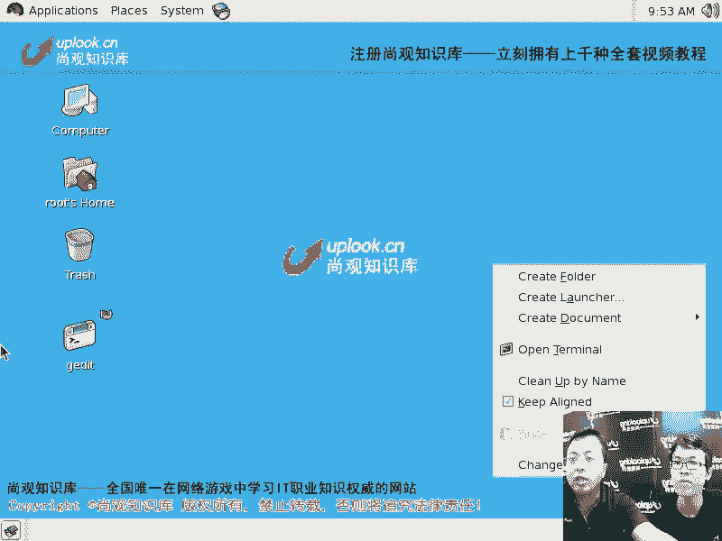

啊，拼也可以很多参数，比方杠C是拼多少个。如果你直接拼对方的话，他就一直拼，直到你摁ctrl加C，那就相当于windows下那个pin杠那么杠T嗯啊，当然了你还可以去加什么其他参数。

那我用的比较大多的一个，比方说我拼一个杠S啊，呃默认情况下，我们拼一下看一下啊。默认拼一下，看一下他这个边响应速度是多少多少毫秒是吧？对，非常清楚。那这边的话呢默认的包是什么呢？64大B啊。

64个字节哦，对吧？那现在的话呢，我现在加上一个什么呢？拼这边加上个杠S啊，加上一个什么呢？1024啊的字己，1024个字节来拼他们。那这时候的话呢，他这边并没有用1024啊，就是大致的一个数值嗯。

这么大，然后呢拼它，那你看呢这个响应的速度啊，时间自然就有所增加嗯啊。也就是说你可以根据什么呢？呃。你可以根据这个呃包的大小，然后呢测不同的这个包的大小的调包率。嗯啊也就是说你去从那边传输数据。

或者你传输数据过去，那么一般包是多大，你可以拼一个值啊，明白了吧？嗯呃，但是呢拼的话呢，他这边用的是咱们都知道拼的话呢，实际上用的是什么值呢。用的是ICMP协议啊，也如你发的包的话呢。

它并不是并不是一个就是说并不是一个什么什么端口的什么什么包嗯，它只是一个ICMP协议，就是跟TCP协议和UDP协议并列的一个协议。它根本没有所谓的端口它只有类型啊。

那也就是说对方的话直接把这种类型屏蔽掉。或者说这个类型ICMP的这种类型，数据包传输是没有问题的。嗯，那你拼就没有问题啊，但是呢你传输其他的包。被防火墙打住了啊，这时候的话就是有问题了，嗯，知道吧？

所以的话呢如果在linux下的话呢，我建议你啊，如果要是你想去看这个比方说这个就是这个数据包，最终想看啊某一种协议，它的数据包怎么样tenet啊，然后呢到它的C那点com点CN上去是吧？

嗯然后加上个80端口啊，这就是我们的HTTP协议嗯，而不是我们的pin的那个ICMP协议啊，明白吧？现在我这样一回车然后呢输入一个de啊跟啊，那这样的话呢。

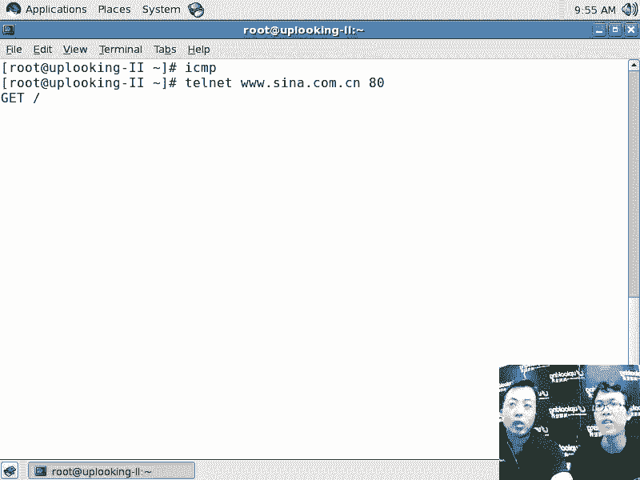

这边的话呢，这个就是说这个得到的信息的话呢，就有说明的话呢，你看它它是有这个响应的啊，有这个响应的对，有这么多这个响应的。你看他用的是sreetqID啊，当然这个也不是不一定是新浪的服务器了。

可能是新浪买的CDN买的那个内容分发网络，就是不在全国很多城市的那个服务器能买的这种东西啊，这是CDN那么这个的话呢，就是我们的这个呃就是代理服务器看到它的代理服务器。所以的话我这样te的话呢。

才能真正找到具体的一个应用。你说慢啊，我就想知道到底什么慢不突然变慢的是不是然后呢我拼的话呢，我只能看到一个大概的SMP协议的这个就是通路的状态，那不并不能代表所有的协议那我想看具体协议的时候。

通不通的时候，我可以用tnet加上一个端口明白了明白那你也可以看到它的响应时间。你像刚才我这样te的时候，这才算。

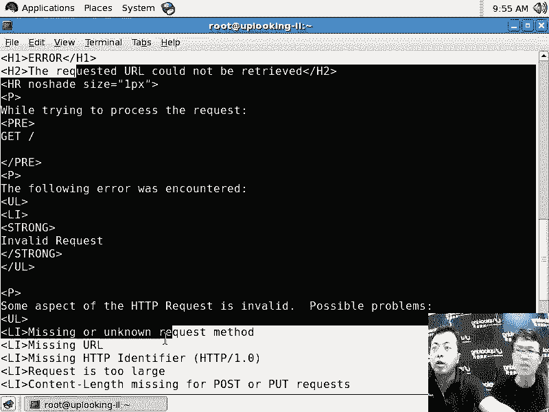

立刻出来，刚才是很长时间的话就没有出来，对吧？对，这就说明的话响应时间的话呢变快。刚才的话是比较慢。那说明它有个DNS的这种，比方说反向查找啊等等这样的时间明白了明白了吧？

所以现在的话呢我们说看这个通路的状态，你首先要看个调包率，你可以去pin，也可以用用其他的工具啊，比方tnet，然后呢去看一下那边的这个访问速度怎么样。嗯如果是HTTP协议，就是ache啊。

或者说in啊等等这种HTP协议，就网页就网页，那你有大量的工具可以去测啊，有大量的工具测，你就测一下，比方说linux里面自带的这个。啊，AB命令AB命令是压力测试呃，杠N比方说1000啊。然后呢。

杠C1000模拟1000个客户端嗯进行1000次查询，查询的是什么呢？查询的比方说呃3W点C呢点com点CN嗯，这这个服务器的根就是这个服务器的这个数据。然后呢，我们看一下它最后的话呢。

这个整个的速度是多少。那你拼的话呢，可能就不是专业的测某种服务的工具。啊，也就是说慢它可能是慢在什么上呢？慢在这个某种服务上嗯。呃，这边的话呢是被可能是被拒绝了。

也就是说他可能有这个就是说这个就是防防御，就是你一个来源爆发处理的这个能力啊，我不知道就是说。呃，是不是这样的原因？嗯。😊，你看下搜狐吧。啊，这个不是攻击了啊，这是那个就是压力测试的工具啊。

我们可以看看这个从咱们这边到那边的这个整个产生100个后端，100个连接，然后看它的那个就是流就是反响应速度啊，或者一个页面处理的时间等等这些信息。也就是说慢什么协议。慢啊那慢是你主观的这个感觉。嗯。

那用具体的软件去测，比方load runner啊，更复杂的，或者AB啊AB的话就是最简单的就是R去自带的那这些东西的话呢，去测的时候，数字上是不是确实是慢啊啊，慢多少明白吧？你不能一个慢就完事了啊。

所以的话呢这边我就测我测自己是很快的。Yeah。我现在这个服务器呃，我现在这个机器才叫真掉慢啊，嗯到底什么原因引起的慢？这个这种慢的话呢，可能就是系统的问题了。我说一个top来看一下。

CPU的占用率是哎这么多id豆啊。应该是没什么问题嗯。啊，我把塞我把I table stop掉，嗯，然后呢在AB的话呢来测一下。咱们IP地址啊，IP地址是多少，看一下。啊，249嗯。

3点293点29那怪什么。啊，这样的话就很快啊，那比方说呃就是说每一个连接的时间是吧，处理的时间，然后呢，就是说每秒钟处理多少请求啊，每秒钟处理多少请求。我们这边的话100的话太小了。

一般的话是呃几万啊，这样的去测嗯。这个面令就是说一个客户端是吧，进行1000次请求是吧？不是1000个客户端进行总共1000次请求啊，那也就是说每个客户端进行一次一次啊我以为是一个客户端进行一次啊。

你看这边是。每秒钟的话呢进行的是91次的这个处理，这太小了啊，因为现在这是虚拟机。嗯，可能有其他虚拟机的话在偷这个呃CPU，导致它响应速度就比较慢，嗯，明白吧？明白，就这样的一些问题。

也就是说你慢的话呢，必须得要有理由啊，那如果要是你纯粹想看链路慢啊，就是说你看这边是几步？第一的话呢是链路是不是有问题？那就是ICMP的包是吧？pin或者是用那个 pin系列命令是吧？

pin只是最简单的对吧？对那在lininux里面还有什么呢？tra色。root啊啊那chro3WC点com点C。那你得看整个咱们到新浪这边有多少节点啊，这些节点每个节点的调拔率啊。

每个节点每个节点的这个。比方说这个就是掉包率啊等等啊嗯。啊，traceroot的话呢是比较简单的，它的下一步，它这边只是看节点。嗯，那么像之后的话呢，MTR是看每个节点的最小选应时间，调包率等等。嗯啊。

这边我就ctr加C先结束它啊嗯，pin是一个tracero是看的也是SAMP的协议，但家看的更多啊，MTR的话呢就是非常好用的了。那我用MTR的话用的非常多。你看这边是调包率知道吗？每个节点的调包。

每个节点啊，每个节点调包录？这是看通路的通路没有问题，通路没有问题。那现在慢那你比方说访问过去了以后，你看哎慢那可能是针对你这个协议是不是有调包的问题是吧？或者是说SMP是很容易通过。

那么其他协议是不是被别人转换过了，嗯，或者是说防火墙是不是阻挡了，或者防火墙是不是有限制。嗯，然后防火墙我在前面加上一个什么呢？加上一个流量控制，或者说防止DD攻击的这种限制。

那是不是他就没有办法允许那么多的数据包通过。然后呢，它这个限制达到防火墙的限制达到的时候，10个人去访问，结果只允许三个人进入，那这时候呢，你就发现7个人就很慢啊，所以的话呢这是这些问题，嗯。

那看通路的话呢，接着就是某种应用的这种包啊，是不是非常通畅，然后呢再看什么呢？sem就是看我们的这个opop system。就是说什么呢？OS啊OSOS就是我们的这个操作系统操作系统嗯，操作系统的话。

那你当然是用什么呢？top啊，用什么呢VN。等等这样的去看啊，嗯，然后呢还可以用什么呢？night state看一下你的现在呢这个是不是遭到攻击了啊啊，那么很慢，是不是有人持续在攻击你。

嗯啊我我有一个原来见过一个就是我们这边的老师，他是做云计算的啊，在006年开始做云计算，嗯，05年05年就开始做。那个时候的话呢，他。还那个什么就是说刚刚自己创业，他说他的网站啊，他原来在我这边讲过。

他的网站上上线的第一天开始就不断的有人对D滴对他进行DD攻击啊，那那个时候的话网站那么慢，那你实际上一查的话能查，明吧n state你能查一下啊那top和VM state的话，我就不跟你讲了。

因为这个好对I就是那个CPU的占用率啊s还有还有这个user的占用率啊，就是内核空间和用户空间是吧？占用率那night state的话呢。

你这边看什么时候的话呢是一个就是可能的结果啊就是可能被攻击的这个结果night state啊这样一回车n stateNTP那这样的话呢你能看到很多的话，你正在监听的这个端口对吧？那这些端端口的状态啊。

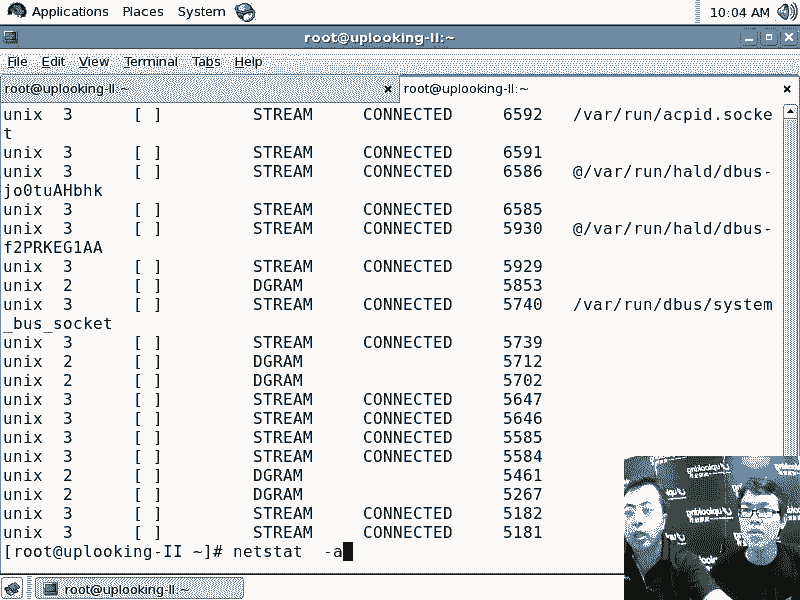

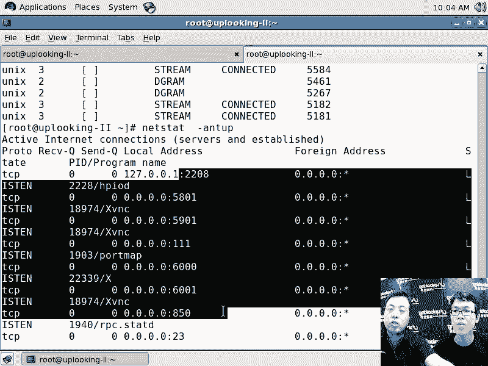

这边端考的状态的话，你看啊都是listen是吧？如果要是TCP协议的话，它的状态是listen的状态。如果UDP的协议的话呢，它没有状态啊，因为TCP的话呢有三次握手对。

你给我发过一个包那我说就相当于我你给我打个招呼是吧我说你好啊我这是回应你是吧？说啊好久没有见了然后呢我想问你一件事情啊，这咱们三次握手，就是三三次这个对答以后，哎，咱们建立一个连接是吧？

说咱们开始谈正事了嗯是不是那这时候的话呢，我们已经经历过前面的寒暄了以后，那么我们接下来的话呢就是一个establish的状态吧那我我在这边什么事都没有的时候。

就是listen的状态我可以听别人去跟我说话所以listen状态还有就是说那个establish的状态，还有的话呢就是我们的什么 out等等就说等等这些状态就是说你说好，那这件事。

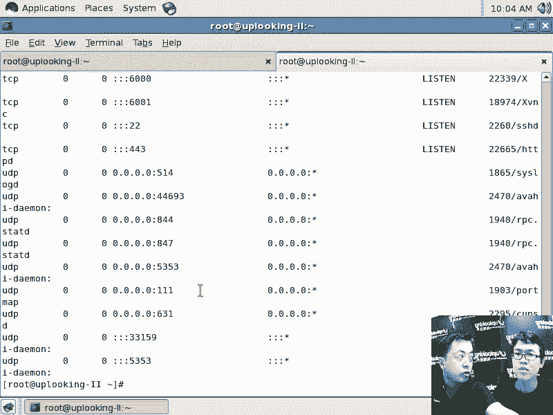

我明白了那我那那回头见啊，然后这个时候的话就是说我们已经结束这个会画，那这也是状态。嗯，所以的话呢TCP协议是有这个状态的。嗯啊，那么UDP协议的话呢，就有点像是一个不太负责任的这样的一个传递机制。

比方说的话呢，你想给我传递一个什么东西。对，然后你把一本书啪扔到我桌子上，然后掉头就走。啊，这个书的话就是那个内容是吧？那我去给你传递数据的话，我把这个书呃，比方说添加一些批注。

然后照着你的脑袋哗扔过去，也不用说啊，这个时候没有所谓的状态，只有说就是说你发过一个包，我再发一个包等等，没有所谓的状态。所以D协议是不面向连接的没有状态。而TCP协议的话呢，是就是这种面向连接的。

是有这个状态。嗯，所以你如果要是80端口的网站嗯，或者说22端口的SSH或者说443端口的这个HTTPS就是加那个加密的这种HTP那这些的话呢，它都有什么的状态。嗯，那当有人对你进行攻击的时候啊。

对有人对你去攻击的时候，比方说一般情况下我这个服务器还没有经过怎么样配置，我统计下的话呢，有多少个这种乱七八糟的连接啊。

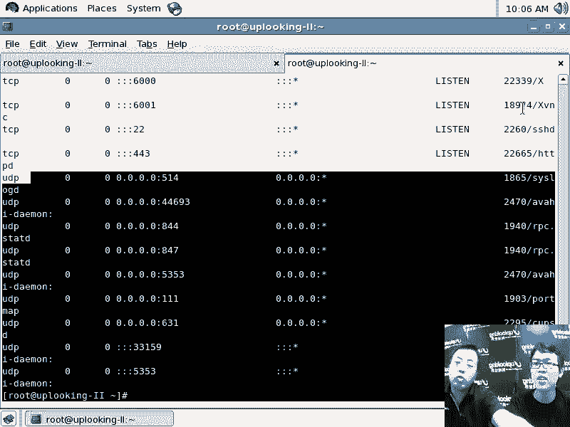

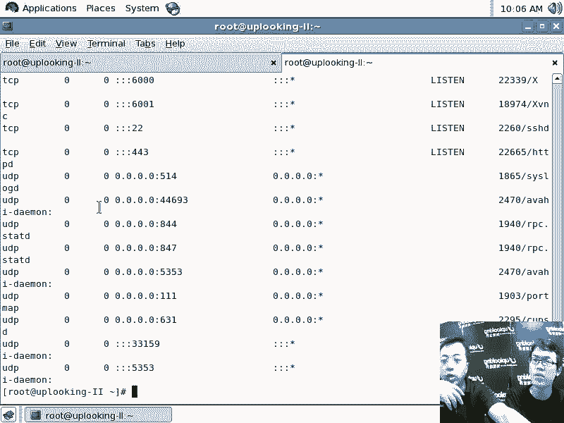

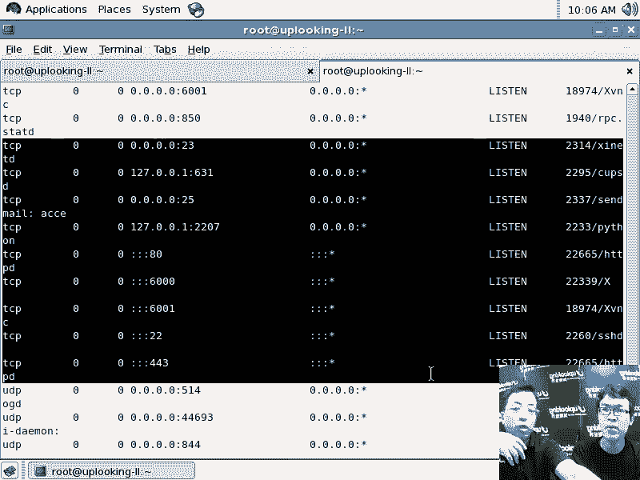

或者类似的状态。那么27个嗯，结果的话呢，你随时一调出来就有几千个这种访问。嗯，啊还有的话呢上上万个这种连接啊，几千个连接或者上万个连接。嗯，那肯定就是有人，要不你的网站特别的受欢迎。嗯。

要么就是有人的话呢，给你发大量的这种包啊，那也就是说你到底怎么分析说你的网站特别受欢迎，还是被人家攻击的对啊啊呃如果要是你看到你看这种状态啊，嗯，这种状态的话呢，是大量都是establish的状态。嗯。

啊就是就是说我要分成几点的话给你讲啊嗯。nex state跟NTUP那么首先数量非常大是吧？对，那你现在要知道你的系统，那它为什么这么受欢迎。嗯，那如果要是你的网站一直流量都比较大，嗯。

那你当然知道啊现在大可能比起以前来没有特别爆发的增长，那也是很正常的啊，是吧？这是一个评定的最主要的一个依据嗯，是吧？如果要是别人的话呢，去访问你想知道到底是非法的访问攻击还是什么呢？

还是这种正常的这种访本，嗯，那你要看几个，就是说如果要是established。假如说establish的这种状态啊特别的多啊特别多。那说明有人确实在看你的网页啊啊，确实在看你的网页。

但是呢确实看在看你的网页，它也有可能是什么呢？CC攻击，CC攻击是什么呢？他就不断去访问你哪某个网页。你要说我的机器啊想去攻击你，然后我的机器想去攻击你找一个小的网页直接攻击你的话。

你的这个网站的话就受不了。因为他每每一个链接都访问你一个网页，每个链接访问给你的网页，一秒钟发去好多好多访问，然后你给我把数据传递过来以后啊，我又不看我再发第二个或者发第第三个。

或者我一并像刚才那样发了1000个啊，那你就要满足我这1000次请求。那这个时候你就不可能正常的满足正常人的请求嗯，明白吧？所以这个时候的话。

你要看是不是establish的你出来establish的话，你有可能是正常访问嗯，也有可能是什么呢？CC攻击啊，那我怎么看是不是CC攻击呢？那你想我一下。给你传递了什么呢？我一下给你传递的这种。

1000个连接嗯，那是不是我的IP就有1000个连1000个I我的就是你有100个连接都是相同的IP啊，对不对？那说明的话呢有一个机器的话呢不怀好意的给你发这么多包所以的话呢，尽管你的连接数非常多。

但是实际连接的IP数比较少那说明有人对你进行CC攻击啊，明白了，如果要是你的IP的话呢，是很多的多种多样的嗯，大多数都是establish状态，那说明你的网站特别受欢迎。

完那你要查一下你的网站是不是有一个什么类似验照门的这种情况R是吧？小明你的裸照公开了是吧？然后大家都来看。那这个时候的话呢，一传是十传版，大家都蜂拥而至，都是在看实际的网页那他们的IP自然是不同的。

就是有很多很很多多种多样的IP，那么不是一个IP的话，有几百个连接。明白吧所以这种访问的话呢，就是正常的访问，你可以看这个就是说如果是CCCC攻击的话，那么就是什么呢？😊，它的这个IP数量比较少，嗯。

就是IP的种种类特别少。但是每个IP的话产生人接别多的特特别多的IP明白吧？如果要是。就是说这个数量非常大，就是说上面这个命令话的数量非常大。嗯，然后呢。😊。

多数都不是established什么叫多数呢？至少不是1比1啊，就是establish状态的话呢非常少。比方说总共的话呢，1000多个连接嗯，总共只有20个什么的established。呃。

那绝大多数的话呢都是什么呢？DD攻击什么DDUS攻击呢？就是这种啊SYNSYN的什么呢？fl攻击。啊，就是说这个洪水攻击S and floor的洪水攻击这种DD攻击。

所以这个的话呢攻击如果要是一天都在持续，每一天都在持续，那你的网站肯定快不了啊，这这个当然你就要优化一下你的机器，或者说前端的防火墙的话呢，加上语优化如果没有防火墙的话呢，自身机器自身的话。

你要优化一下，明白了吗？嗯，所以这就是说什么呢？就是我们的这种啊DD攻击或者说establish的等等这些这些攻这些CC攻击。因为CC攻击的话呢，它是什么？

就是说我这台这台客户机想去CC攻击你的服务器的话，嗯，我们俩要先建立三次手，建立好连接以后，我才好。跟你说什么呢？我要看你的首页嗯，或者看你某一张特别大的图片，或者看你某一个复杂的PP的页面，知道吗？

这是我们俩要建立这种连接以后，它的状态自然是establish而SON的洪水攻击是什么呢？就是说利用TCPIP协议的这种相当于一开始机制不是特别健全。嗯，我冒充别人给你发个消息过去嗯，发个数据包过去。

发过去以后的话，你一接到啊，你一看不是我的IP而是其他人的IP，然后呢你就会给那个人发一个数据包过去，说跟他去确认，你比方说我这个时候的话呢，跟你远距离打个招呼我在门外面你说什么哎嗨你好。

我是沉水扁是吧？你录一个端头就扔过去了是吧？但是你砸的是沉水扁砸的不是我呀对不对？我是冒充其他人的话呢，给你去发的一个包这时候你肯定没砸到，你还听着哎。有没有AU一生是吧？嗯，就是三次握手嘛？嗯。

对不对？结果他第三次握手总是没有过来，你这时候的话还要去听啊，那要等到超时啊，那这时候我一会儿又说啊，我是李东辉，你又号砖头过去了，对吧？所以你这边的话呢看到就是说和沉水扁有一个什么呢？

有一个砖有有一个砖头的，就是说这个time out是吧？有李东辉有个time out都不是established，因为我不断在冒充别人的话，给你发消息啊，明白吧？明白了啊。

所以的话呢这是这种啊这种情况嗯，这是这种这种情况。所以的话你能用nex state，你最起码能看你的网络的繁忙程度嗯啊，看到繁狼程度以后，你要判到是CC攻击，还是说什么呢？还是正常的访问啊。

如果established的非常少，全部都是那种啊，就是那个time out等等，这种超时啊等等这种连接，那说明你遭到了洪水攻击啊，明白了吧？明了。😊，SON的洪水攻击啊嗯。

那么如果要是你再想去确定一下，就是网络的话呢，是不是你的服务器太忙了，掉包率特别高啊。到你的那个服务器那边的调包率特别高。那你还要看一下什么呢？你的服务器是不是确实啊这个数据量非常大。嗯。

那么你可以用IP check。啊， track或者是什么呢？或者TCPdnk嗯啊，或者是什么呢？wear sha啊，wear sha这些都是抓包工具，嗯，都是抓包工具。行啊。

具体你可以啊就是咱们的话大致说过是吧？还有一些的话呢，比方说呃。抓包工具啊看到非常繁忙。还有一个的话呢，有可能是什么呢？你这边不忙啊，但是呢网关就是你这个服务器啊，不是在机房里面吗？嗯。

你的服务器不是有个网关吗？对，网关到这个服务器之间啊，网关到这个服务器之间。特别特别就是数学特别少啊，但是呢你比方说这样我给你画个图啊。你现在的这个服务器，比方说在机房托管着啊，这是1个4U的服务器。

比方说那它的话呢一般会连接到你的机房的这个路由器上是吧？机房的这个路由器。那机房的这个路由器的话呢，你有连接的外网，对吧？对，结果的话呢，很多的这个客户机啊再去侦测的时候，发现发现的话呢。

到你们这边的这个数据包啊，就发了很多数据包以后啊，嗯，结果实际到的只有这么多。也就是说你就方说60%的调包率啊，60%多的调包率，那结果的话呢。

你在这边侦测的用ipP check侦测的这边的CPU也没有问题。啊，连接又数又特别少啊啊什么原因呢？可能就是说这个节点就是网关啊到你的实际的服务器这个地方的话呢有问题。嗯，那有可能是什么呢？

有可能是这个网关啊接的其他的服务器上是不是有ARP病毒呢？嗯，那也就是所有的数据包的话呢，都经过什么呢？这台服务器的这种就是冒充嗯啊，也就是说这个数据包过来的时候，都要经过这个服务。

就是说经过网关了以后，还要经过什么呢？这个数据包再传给你，就是经过这台服务器再传给你。嗯，也就是说这个服务器冒充了网关，所有的数据的话呢，并不是你的这个机器和这个网关直接去沟通，而是你。发给数据包给他。

然后呢由他的话呢再去给网关，他冒充了网关，知道吧？这就是所谓的什么呢？ARP欺骗，也就是说你欺骗了就是这台服务器啊，这台坏蛋服务器嗯欺骗了我们这个善良的服务器，也欺骗了网关吧？

他利用的就是ARP协议里面的这种就是设计不健全的机制啊，他冒充别人所以这个时候的话呢，你要看一下啊，有意识的要看一下什么呢？自己是不是呃自己是不是这个ARP啊，有攻击。那你可以ARPING啊。

ARPNNG然后呢加上1个IP谁的IP呢？就是get的IP嗯啊就是我们的默认网关的IP，如果反应响应啊回应的话呢，是回应的话呢，是两个呃就是两个IP地址。比方说你像ARP啊19268。3。1啊。

这是咱们的网关你回撤。

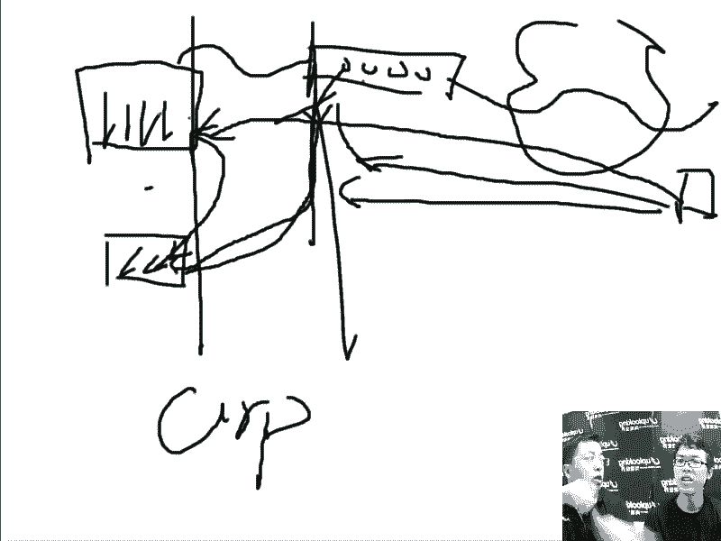

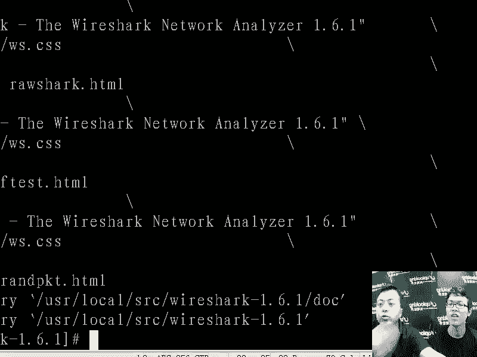

啊，你看啊这边的话呢，等了很长时间，回应只有一个m地址。这个说啊我说。哪个网卡的IP地址是1。2的8。3。1啊啊哪个啊然后呢有一个回应，这是这块网卡。这块网卡说什么我的我的mac地址是多少多少嗯。

结果假如说这时候两个人，一个说我的mac地址是这个，一个是说我的mac地址内那你的局域网内肯定有一个是冒充网关的哦，明白吧？冒充网关，那所有的数据包都经过他什么呢这种啊调换一下了，嗯。

那这个时候你的机器肯定是啊就是这个数据包都经过他去转发一下，他中了ARP病毒啊，明白吧？他告诉所有局域网内的其他的机器说谁我是三。1，不是那个真实的网关，嗯，明白吧？

你把数据包都发给了这个冒充的机器里头，这个冒充的机器又把数据包再传给网关再传过去。你不知道数据包已经被别人调调截取调过了。所以这就是什么呢？有可能引起你的速度非常慢。那同时的话呢。😊，是不是有内鬼啊。

假如说这个机房的话呢，全都是你们公司的这个机器。内鬼的话呢，不一定是你的同事，有可能是什么呢？你的服务器可能被别人黑了。嗯啊，他在内部的话侦测所有的网络交通，他冒充网关，嗯，明白吧？

所以这个的话呢也是非常危险的。嗯，这个有办法解决吗？嗯，那你就ARP杠S嘛啊ARP就是设定嘛。嗯就是说假如说现在有两个人都声称自己叫3。1。对啊，自己的IP是3。1嗯，那你ARP杠S。

然后绑定那个网关的mac地址啊，你说那我怎么知道哪个快哪个慢，一般的话呢，中ARP病毒的响应是最快啊，就是他想的最晚你像如果要是如果要是现在真有那个机器啊，你要我就把另外一台机器的话呢，设成呃3。

1啊嗯。啊。F个啊嗯ETH0冒号2哎呦我看现在是ETH0还是ETETH1啊，FETH1啊，冒号1嗯19218。3。嗯，来吧，我这样设定完了以后啊，你再看。看到吗？啊，有两个对，有两个。一般的话呢。

我先把赶赶快把那个换掉，要不然的话一会儿的话。我们的这个。我们有同事可能就开始叫嚷了啊，我怎么上标网了是吧？能是这样。那如果要是有两个机器的话呢，IP地址同一个的时候，他会给你这样回应。

但是呢一开始的两个包，你能看到有两个mac地址嗯，接下来的话呢全都是一个，明吧？现在全都一个，那那个肯定是假的，因为那个ARP病毒的话呢，已经把ARP的这个间隔时间修改过了哦，啊。

它肯定会盖过真正的那个默认网关，所以它的响应速度是最快的。嗯，所以这时候你把那个两应速度慢的那个设置成啊网关，明吧，你就可以这样的ARP当然这个方法是土方法啊，这是我的经验啊，嗯但是呢经验准不准呢？

有可能是不准啊，杠S。然后你把刚才那个mac地址，对吧？就是。😊，啊，这是假如说啊是这样的，嗯，然后呢这边输入个192168。点3。1啊，我老是记不住是哪个I是IP放在前面，还是mac地址放前面啊。

你可以自己试一下啊。啊，DRP杠刚效。啊，先是IP地址。啊，先先是那个IP地址，然后再是什么呢？再是mac地址啊，明白吧？先是IP地址，再是mac地址，而这样的设置一下以后，以后你跟三点1去通讯的时候。

就是通过这个就是访问这个mac呃mac地址啊，明道吧？那啊所以这就是我们的这样的一些呃设置啊，这是我们的这是我自己的一些血淋淋的教训啊，就是经验型的东西，然后把我们的那个命令的话呢，给你拿出来。

然后呃你自己去判断嗯啊判断因为呃你说慢啊，你说访问速度太慢。你最起码先看一下套啊，对，然后再看一下VM state吧嗯是吧，然后nex state看一下吧，然后再抓把包，看一下速度怎么样是吧。

明看看有多少这个数据包。那这些的话呢都是一些就是说我可能会按照这样的思路来就是验证到底为什么慢的这个原因是吧嗯。具体的话呢，你说肯定是这个命令肯定能把它解决，这不可能啊，这不可能明白？明白吧？

1000个人可能有呃有800种啊，1000人800种的这个情况，是吧那可能就是我只是教我这种方法通用的啊，那当然你的机器如果确实哪个地方坏了，是吧？嗯你也可以让我的话去帮你去修啊，但是你要付费了。

开开玩笑啊，嗯就是我可能就是说没有办法去给你就是说具体解决某个东西。因为那样的话呢，你可能也未必能学到东西。嗯，所以我把我的经验的话呢，尽量多的去教给你。O好吧，呃，然后呢我们再来。

就是说呢这些东西的话呢，是一个就是最后你就是你自己在找问题。但是呢有一些就是稍微深一点的地方啊，嗯就比方说内核参数是需要你再去考虑的。就是内核参数的话呢，在网络部分的话呢，可能会引起大的麻烦。

但通常情况下它是一个什么呢？通常情况下它是不会出问题。但是出了问题的话呢，你一般也不知道是什么问题啊，就是它是比较较深的一个问题啊，较深，等一下的话呢，我们可以从简单的内核参数开始。

然后呢给你就是跟你说一下，可能怎么样去排除一个内核参数引起的，就是说网络访问特别慢的问题。好的，明白吧嗯。

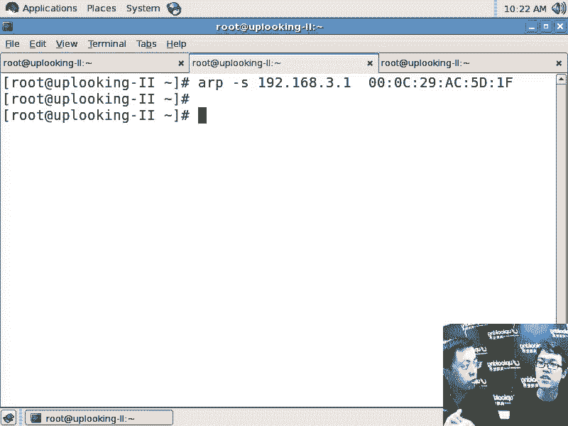