# Linux服务器运维：P19：网络诊断与性能分析

在本节课中，我们将学习如何系统地诊断和解决Linux服务器访问缓慢的问题。我们将从网络连通性测试开始，逐步深入到系统状态检查、攻击识别和ARP欺骗排查，为你提供一套完整的故障排查思路和实用命令。

## 网络连通性基础测试

上一节我们讨论了问题分析的基本思路，本节中我们来看看最基础的网络连通性测试工具。

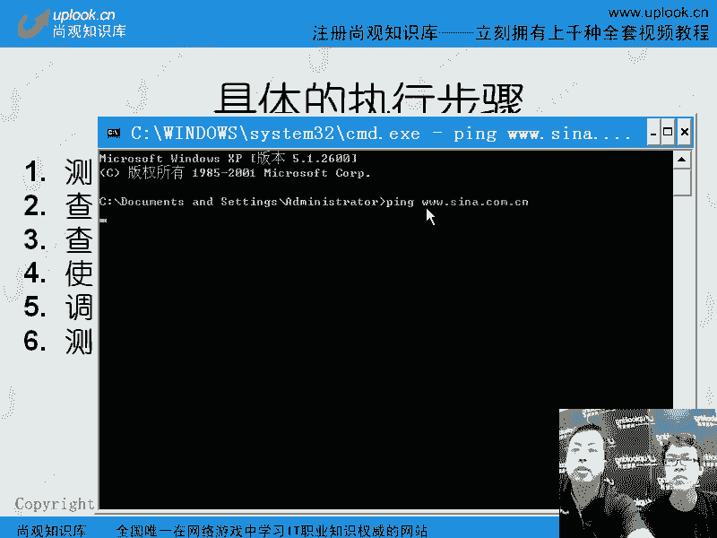

### 使用 `ping` 命令

`ping` 命令使用 ICMP 协议来测试与目标主机之间的连通性和延迟。它是最常用的网络诊断工具之一。

以下是 `ping` 命令的常用参数：


*   **持续测试**：`ping -t <目标地址>` (Windows) 或 `ping <目标地址>` (Linux，默认持续直到按 Ctrl+C)
*   **指定测试包数量**：`ping -c <数量> <目标地址>` (Linux) 或 `ping -n <数量> <目标地址>` (Windows)
*   **指定数据包大小**：`ping -s <字节数> <目标地址>` (Linux)

**示例**：发送 5 个 1024 字节的数据包到 `www.example.com`
```bash
ping -c 5 -s 1024 www.example.com
```

**注意**：`ping` 只能反映 ICMP 协议的连通性。如果目标服务器或中间防火墙屏蔽了 ICMP 协议，即使网络正常，`ping` 也会失败。此外，它无法测试具体应用服务（如 HTTP）的可用性。

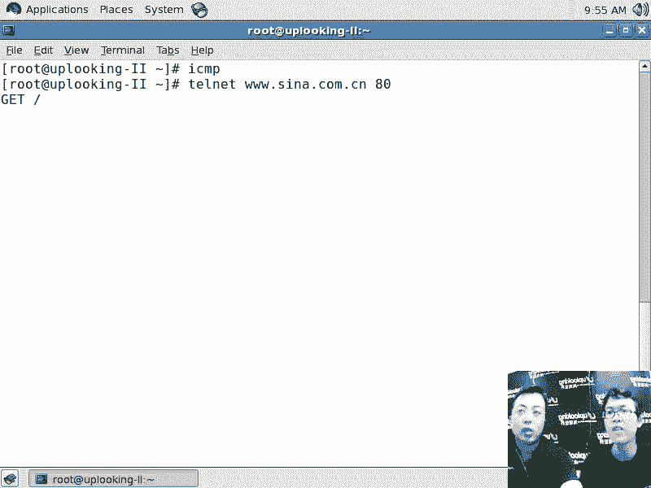

### 使用 `telnet` 测试应用层端口

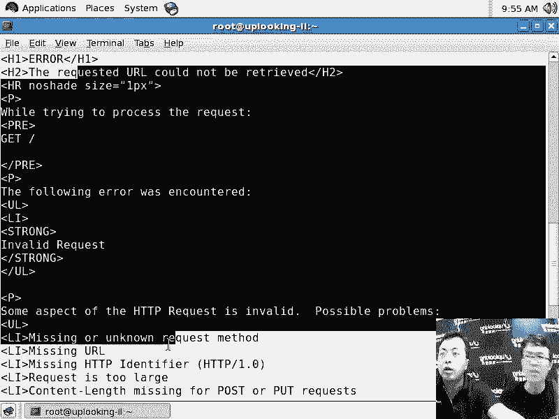

要测试具体的应用服务（如 Web 服务）是否可达，可以使用 `telnet` 命令尝试连接其对应的端口。

**示例**：测试能否连接到 `www.sina.com.cn` 的 80 端口（HTTP服务）
```bash
telnet www.sina.com.cn 80
```
如果连接成功，通常会显示一个空白光标或服务器标识，这表示该端口是开放的，网络通路和应用服务基础层面是正常的。连接速度也能直观反映响应时间。

### 使用 `traceroute` / `mtr` 追踪路径

`ping` 告诉你终点是否可达，而 `traceroute` 或更强大的 `mtr` 命令可以显示数据包到达目标主机所经过的每一跳（路由器）及其延迟。

*   `traceroute <目标地址>`：显示路径上的节点。
*   `mtr <目标地址>`：结合了 `ping` 和 `traceroute` 的功能，持续测试并显示每个节点的丢包率和延迟，是诊断网络中间节点问题的利器。

## 检查服务器系统状态

如果网络通路没有问题，那么问题可能出在服务器本身。我们需要检查服务器的资源使用情况。

### 使用 `top` / `vmstat` 监控资源

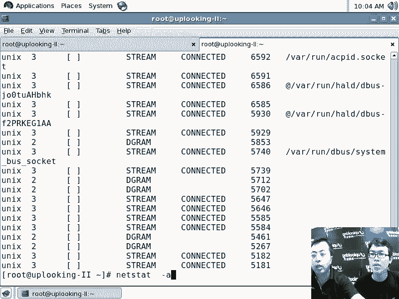

*   `top` 命令：动态实时查看系统的整体性能，包括 CPU 使用率（用户空间 `us`、系统空间 `sy`、空闲 `id`）、内存使用、负载（load average）以及各个进程的资源消耗。CPU 空闲率过低或负载持续过高都可能导致服务变慢。
*   `vmstat` 命令：报告关于进程、内存、分页、块 IO、陷阱和 CPU 活动的信息。它有助于了解系统的整体压力来自哪里（CPU、内存还是IO）。

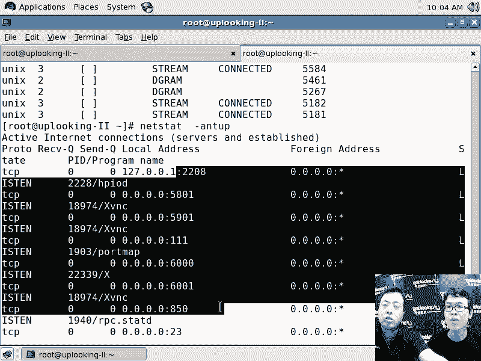

### 使用 `netstat` 分析网络连接

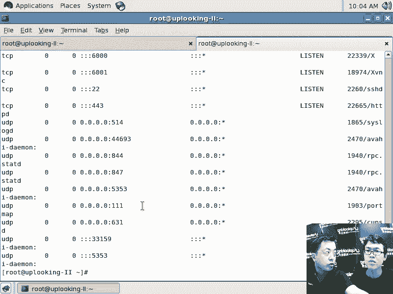

`netstat` 命令用于显示网络连接、路由表、接口统计等信息。在诊断“慢”的问题时，它至关重要。

**常用命令**：查看所有 TCP 连接及其状态
```bash
netstat -antp
```
**关键点**：关注连接状态（State）和数量。
*   **LISTEN**：服务正在监听端口，等待连接。
*   **ESTABLISHED**：已建立的活跃连接。
*   **TIME_WAIT** / **CLOSE_WAIT**：连接正在关闭或已关闭。

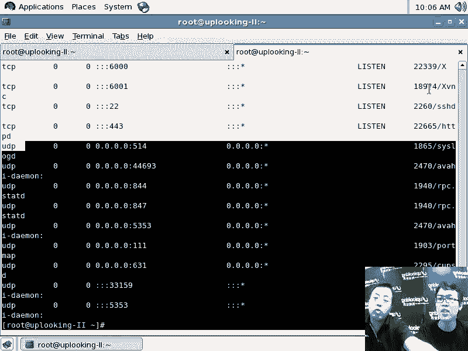

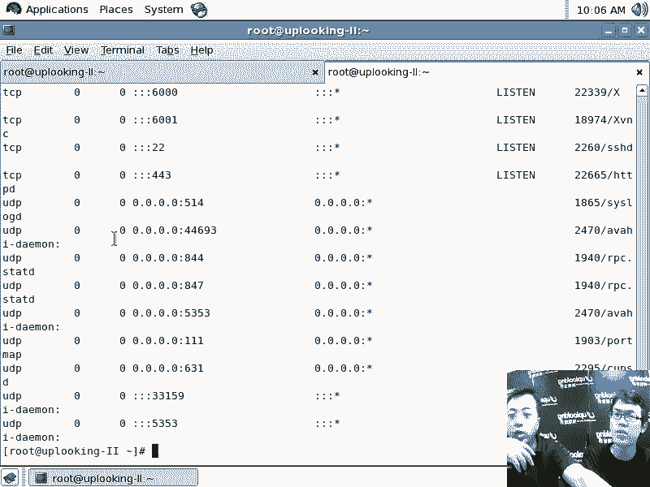

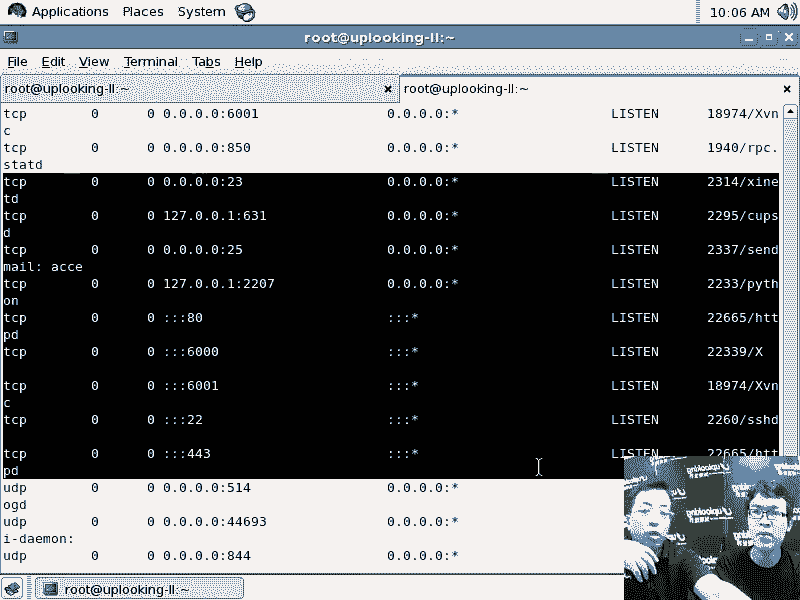

**如何分析**：
1.  **连接数激增**：如果 `ESTABLISHED` 连接数异常高，可能是网站流量大（正常）或遭受了 **CC攻击**（Challenge Collapsar，一种针对应用层的攻击）。
2.  **区分正常访问与攻击**：
    *   **正常流量**：连接来自大量不同的 IP 地址，每个 IP 的连接数相对平均。
    *   **CC攻击**：连接可能来自相对较少的 IP 地址，但每个 IP 建立了大量连接（例如，一个 IP 有上百个到同一端口的 `ESTABLISHED` 连接）。
3.  **SYN Flood攻击**：如果存在大量 `SYN_RECV` 状态的连接，而 `ESTABLISHED` 连接很少，服务器可能正在遭受 **SYN Flood** 攻击（一种消耗服务器资源的DoS攻击）。这种攻击利用 TCP 三次握手机制，发送大量伪造源 IP 的 SYN 包，导致服务器维护大量半连接队列而耗尽资源。

## 排查局域网内问题：ARP欺骗

如果服务器在机房或局域网内，访问慢的问题可能源于局域网内部的干扰，例如 **ARP欺骗**。

### 理解 ARP 欺骗

ARP（地址解析协议）用于将 IP 地址解析为 MAC 地址。在局域网中，设备通过广播询问“谁的 IP 是 X.X.X.X”，拥有该 IP 的设备会回应“我的 MAC 地址是 XX:XX:XX:XX:XX:XX”。
ARP欺骗是指恶意主机冒充网关或其他重要主机，回应错误的 MAC 地址。导致所有发往网关的数据包都先经过这台恶意主机，它可能进行窃听、篡改或仅仅因为转发能力不足造成网络拥堵和访问缓慢。

### 使用 `arping` 检测 ARP 欺骗

`arping` 命令用于在局域网内发送 ARP 请求，查询某个 IP 地址对应的 MAC 地址。

**检测方法**：向网关地址发送 ARP 请求
```bash
arping -I eth0 192.168.1.1
```
（请将 `eth0` 替换为你的网卡名，`192.168.1.1` 替换为你的网关地址）

**结果分析**：
*   正常情况下，应该只收到一个来自网关的 ARP 回复。
*   如果收到**两个或以上**不同 MAC 地址对同一网关 IP 的回复，说明局域网内存在 ARP 欺骗。

### 临时防御 ARP 欺骗

发现 ARP 欺骗后，可以临时静态绑定正确的网关 MAC 地址。

**命令格式**：
```bash
arp -s <网关IP地址> <网关正确的MAC地址>
```
**示例**：
```bash
arp -s 192.168.1.1 00:11:22:33:44:55
```
**注意**：静态绑定在重启后会失效。根本的解决方法是部署网络设备上的防 ARP 欺骗功能，或使用专业的 ARP 防火墙软件。


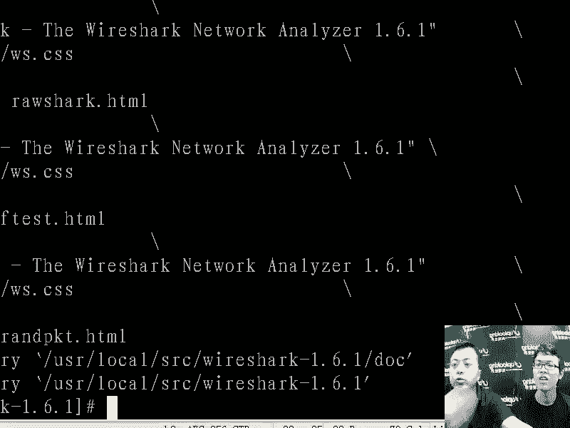

## 高级诊断工具简介

当基本命令无法定位问题时，可以考虑使用更专业的工具。

*   **抓包分析**：使用 `tcpdump` 或 `Wireshark` 捕获流经网卡的数据包，可以深入分析协议交互、丢包、重传、延迟等细节问题。
*   **压力测试**：使用 `ab` (Apache Benchmark) 等工具对 Web 服务进行压力测试，量化其性能。
    ```bash
    ab -n 1000 -c 100 http://your-server.com/
    ```
    （模拟 100 个并发用户，总共发起 1000 次请求）

## 内核参数调优（进阶）

某些情况下，服务器访问缓慢可能与 Linux 内核的网络参数设置有关。例如，`net.ipv4.tcp_max_syn_backlog`（SYN队列大小）、`net.core.somaxconn`（连接队列大小）等参数如果设置不当，在高并发场景下可能导致连接失败或延迟增高。调整内核参数需要谨慎，并基于对系统压力和架构的理解。

---

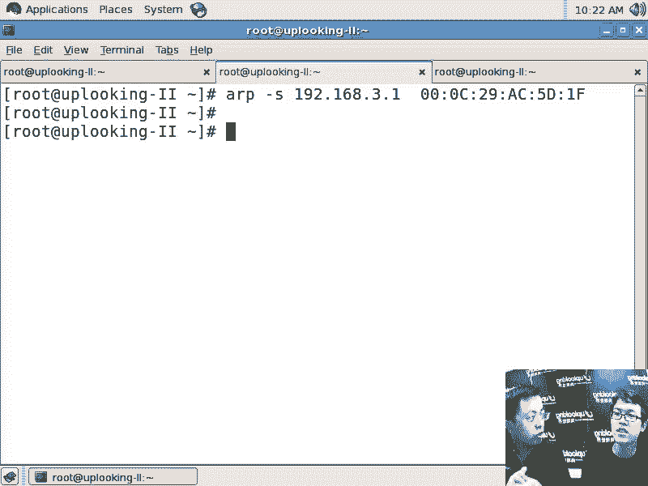

**本节课中我们一起学习了**诊断 Linux 服务器访问缓慢的完整流程：从使用 `ping`、`telnet`、`mtr` 测试网络连通性和路径，到利用 `top`、`netstat` 分析服务器系统状态和网络连接，识别可能的 CC 攻击或 SYN Flood 攻击，再到使用 `arping` 排查局域网内的 ARP 欺骗问题。最后，我们简要介绍了抓包分析、压力测试和内核参数调优等进阶手段。记住，排查问题是一个逻辑推理过程，需要结合多种工具的现象，逐步缩小范围，最终找到根本原因。