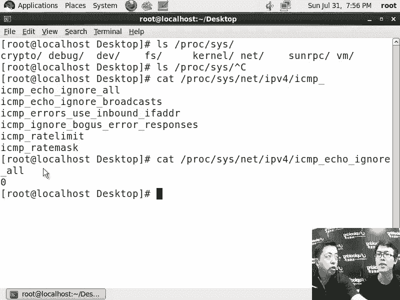

# 尚观Linux视频教程RHCE 精品课程 - P20：RH033-ULE112-11-1.5.解决Linux服务器访问比较慢的问题-网络测试命令讲解-内核参数的修改 - 爱笑的程序狗 - BV1ax411o7VD

啊，嗯，咱们的话呢把刚才的话呢，这个就是。就是说筛选的过程的话呢，用图画的话呢来再来表现一下。O啊，这是一个哎呀，这个有点吵啊。然后呢，这是一个客户我是吧？嗯，他告诉你非常慢，那你要判断到底是什么慢。

对吧？那他本身的话呢，他是有。internet上的这样的一堆节点，是不是？比如说一个节点，一个路由器接着一个路由器有道少跳，对吧？最后的话呢跳到了我们的这个机房里面来。那这个机房的话呢。

它有一个交换机是吧？三层交换机或者是一个路由器，是不是大型路由器，然后呢再连接到你的比方说如果机房比较大的话，可能有两个路由器，嗯，对吧？然后呢，这个可能也是个三层交换机这个路由器。

然后呢再去连接到什么呢？你的这个。服务器这边对吧？它有可能还连接在其他的这种服务器，其他公司的服务器，千千奇百怪的各种各样的服务器。嗯，对吧？那也就是说如果你啊到它的这个网关这个地方。

到它这个网关这个地方，整个这个链路的话呢是慢的那它自然也会感觉嘛，嗯，那你可以用什么呢？用pin是吧？或者是MTR是吧，或者是什么呢？terro对，对吧？然后来查看，那在windows里面的话呢。

就是pas pin啊，windows里面是PAATHPRNG是吧？还有什么呢？traer。对吧嗯，trar就是windows里面的，它能检查这个整个的这个链路状态的话呢，是不是通畅的，嗯。

或者是是不是有问题。但是呢他们都是检查什么呢？ICMP协议的包哦啊，那你也可以用什么呢？天。tenet1个IP加上一个什么呢？端口啊，这样的话呢来看某个协议的包是不是有问题啊，这边就太靠下了是吧？

就tnet啊，大家看不清楚这个地方是tenet。那如果要是这条链路没有问题，那么我们到了这个地方，到了比方说这个地方啊，我们的链路没有问题。然后到这边你看掉包率也非常的少是吧？对。

但是还是比较慢啊还是比较慢。那你要在这边要考虑到一个什么呢？ARP攻击的问题嗯啊用ARPING然后呢来看一下在这个链路里面，是不是有人在冒充你或者冒充什么呢？其他的这个就是网关嗯。

然后呢再用ARP杠S来解决这个问题，对吧？然后呢，现在就到了我们的这个服务器本身这个地方了。这个服务器本身的话有问题。那你可以用什么呢？top啊top的话呢，当然是一种就是看上去比较方便。

但是呢它本身啊占用资源会比较大嗯，你可以用什么呢？VM state啊，一般我是用VM state来看啊然后的话呢再去用top来看啊。

VM state的话呢可以跟PS啊啊去连用什么PSAUX看一下进程的状态啊，是吧？然后呢也可以用什么呢？n state来查看嗯是吧？呃当然PS命令或者top命令的话，你能看到进程的这种状态啊。

你比方说还有PS杠什么呢？一。F是吧，大写的L啊，可以看线程啊啊，L是线程，大写的L是线程。嗯啊那这些的话呢就是常规我们给大家介绍过的这些。方式是吧嗯，然后呢我们再来看一下什么呢？就是说比较隐秘的。

就是说我现在的话呢已经确定这个服务器是有问题了。嗯，啊我确定服务器。因为我同一网端内的其他的机器都没有问题啊，就这台服务器有问题。嗯，那这样服务器是不是新装的，装完了以后的话呢，一直都有问题，对吧？

那不是突然出现的问题。那这时候我要看什么呢？我要看这个服务器啊，其他的都确认过。比方说防火墙啊，当然这个前面的话呢，可能某个地方的话呢，还有防火墙啊，这个防火墙的话是不是有问题。嗯。

如果没有这个防火墙的话，那税胞都是来去的话，都没有问题的。那如果有防火墙，你要看防火墙是不是经过改动过，或者说配置过是吧？好的，如果要是我现在本身这个机器都没有问题。

我用IP table所又把自己的这个防火墙又清掉了。嗯嗯，你可以看下自己的这个防火墙啊是不是有问题呢。那现在的话呢就进入到下面的一些这个具体的嗯就是稍微隐藏一些的这个设置。嗯，好的，啊，看一下。

比方说IP tables是吧？然后呢输入个杠L啊，你可以看到IP tables当中现在有没有规则，然后呢，还不要忘了什么呢？杠T啊，杠TNAT。

啊，这两个都要看。如果你看我现在的话就是非常空的。嗯，什状态默认情况下，input的数据包都是接受的嗯，而没有其他的这种任何的规则，嗯，对吧？那说明的话我的防火墙都是非常干净的对吧，没有设置过什么。

如果你不放心的话，想刨除掉防火墙的问题。

告F。这样的话就清掉了啊，把自己默认的这些规则都清掉了。没呀，访问还是慢啊，那这时候我觉得啊就可能是你的什么呢？内核参数的问题了，那个参数就是说你访问。

因为现在我也不知道你到底具体访问的是什么东西嗯呃访问什么东西嘛啊，如果访问的是你比方说外部服务器啊等等。那么这个数据包有问题。那么通常情况下我会这样他去查看。

为什么说IP就是说这个呃访问就是这个内核参数最后来讲呢？因为它比较隐蔽啊，你看一眼啊呃。

假如说现在我有个H16啊，这个H16。内核参数的话呢都是在PC文件系统下啊你可以看到系统的话，默认会把POC文件系统mount在PLOC下。啊，我告诉过你，就是PLOC的话呢。

它实际上是一个呃虚拟虚拟的文件系统它里面都不是真正的文件，对吧？那现在的话呢我去输入一个什么呢？mount啊，然后呢杠TPROC是吧？对，然后呢not啊mount在比方说AA目录下对吧？

这样一回车嗯然后LSA那这边的话呢跟我们的什么呢？POC是PC是一样的是吧？因为它都是这种虚拟文件系统。那我只是做了把这个虚拟文件系统添加了一个访问的点啊。

那这样的话呢就是PLC文件系统PC文件系统里面显示的东西啊，都是内存当中实际的值啊，也就是说我去ca比方说PLOC下面的什么呢？比方说mount啊，这个时候的话呢就是系统mount了多少资源，它就是。

更新的嗯，就在内存当中，它确实是这样去m的。但是呢系统当中还有一个程序啊，比如说呃ETC下的M table。这个的话呢也是mount的这个东西。但是它的话呢就不准，为什么呢？

因为它是ETC目录下的一个实际的一个文件。这个文件更新不更新呢？不一定啊，而我访问这个mount的时候，它实际上是访问内存当中的一个值对内存当中现在的状态是怎么样，更新对它肯定就是这样的，明白吧？

所以这就是PLC文件型啊，明白啊，所以的话呢你能通过PLC文件系统的话呢，看到很多的东西。那在我们的PLC目录下啊，有很多的文件夹，你看到了，对吧？对你数字命名的这里面的话呢。

就是我们每个进程进程ID比方说我有个进程的话呢，它的PID啊，就进程ID是一这边有一个名叫一的文件夹嗯，这里面的结构都是相同的，每个进程这个文件夹里面的结构都是相同那比方说我们的比方说我们的这个。

PS命令啊啊PS tree命令。对，还有的话呢像什么啊Q命令等等，他都到这里面去找相应的资源。比如PLC文件系统没有加载，那基本上呃就是很多命令都有问题。嗯啊，但是呢在这些目录里面有一个目录非常特殊。

就是net目录。对啊，就是s目录。ss目录s目录的话呢，它这个下面又分门别类的有一些子文件夹。嗯，ss目录里面的这个这个东西的话呢，跟其他目录的话有一点不同，就是ss目录下的东西一般是可以改的。

绝大多数是可以改，当然少数是不能改动啊，改动是什么意思呢？就是你想我如果访问一个文件，这个文件就是内存当中一些数值。那我改动这个文件呢。就改内存啊，就改内存里面的数值对吧。

也就是说改我们的操作系统当中的一些数值是吧？嗯，实际上就是内核参数哦啊，所以的话呢现在你看啊我给你做个小实验，嗯，比方说我现在cat。PLOC下的ss当中啊。s当中的net当中的什么呢？IPV4啊。

IPV4就是我们现在用的最广泛的这个协议。IPV6还没有广泛的去使用是吧？嗯，IPV4里面有ICMP的包是吧？对ICMP啊，比方说ical啊ignore。嗯，啊这个包这个的话呢就是一个内核参数。

你ca它得到的值是什么呢？0看到了吧？嗯，这是0，对，这个值是0，那角就表示什么呢？这个值并没有设置，就说这个内核参数并没有设置，没有设置的话，你看它的意思啊，ICMP的ic口包。

忽略吗？忽略所有的Ile包吗？0。就是不忽略吧？不忽略，那就是响应所有的Iod帮。所以你聘我的话是能拼通的。

哦，知道吧，你像我这边的话呢，拼一下拼。1928。3。23。智能拼通对是吧？那么如果改呢？😡。

我这是H1L5啊，这H15，我现在要回到H16里面来。对，在H16里面，这样的，我再去ecle一个值，ecle一。😊，输出重定向到PROC下的ss当中的net当中的IPV4当中的ICMPicical。

一诺啊啊，我把它设置成一这个值嗯，然后一回车。设成一了是吧，你再pa一下，就变成一了嗯，是吧？这是一对，对吧？然后呢，我们再去拼。

啊，就不能拼通了，拼不通了呀，这是H715啊，嗯，但这边是H15啊H715这台机器，那是拼不通的，为什么呢？因为的话呢你已经忽略了所有的ICMP的包哦，ICMP的Iical包全部都忽略。

因为拼的话就是你给对方一个eical request嗯，就说回应吗？ele不是回响回声的意思。对你跟大商也好啊，你好啊，大山你也好是吧？那就回，不是说你也好。😊。

就是他给你回声嘛，嗯icicle的话就是回声的意思嘛。对icical request就是说我请求一个回声，那对方的话就会给你一个回应，这是ICMP协议协议这个包里面啊一种类型。嗯啊，那这种类型的话呢。

就是请求对方回应。我把这个类型的响应全部都关掉，全部都忽略忽略嘛。嗯or嘛是吧？忽略掉，所以的那他就不会给你回应啊，明白，那同时的话我再把它置一啊，这是H16啊，H16，我再把它制成零啊，刚才是一嘛。

制成零那这样的话呢你再拼。

啊，已经这这这已经能拼投了。对，这已经能拼通了，对吧？嗯，所以这就是这样的。那pin的话呢，在linux里面啊，还有一个功能是什么呢？杠B参数就是pin个广播包啊哦，你现在拼这个广播包的话呢。

因为H715H16都已经做了更改，就是说广播包不响应。所有的windows都不响应广播吧啊啊都不响应广播吧，所以现在没有任何人给你响应。嗯，知道吧？但是我如果要在H16里面把这个广播包的话。

给广播包的响应给你打开。你看一下啊，根据刚才的经验是吧，我们ca的是ICMPIle是吧，ignor all。那我这边ignor什么呢？还有一个叫做ignor啊，broad是吧？广播啊。

pro然后呢，你看这里面是一，就是它忽略广播包，这在R7L5R716里面才有的。R7L4的话呢就没有。嗯，那它就是至零的那我现在icle啊零啊，输出重定向到什么呢？这个文件里面去。

嗯啊输出重定向过去了以后，然后呢我再cat一下，它这边变成零了嘛。对，然后你再去拼这个广播包。

嗯嗯嗯。你发觉啊。呀还是不给我回应啊。

这个的话呢有可能是我们虚拟机的问题啊，我在这边拼一下。因为你聘的是一个网段的IP。那我自己拼一下。

主机不能。不かな。呃，这就有问题了。咱的防火墙跟SE那个是没看嘛？防火墙的话倒不会有问题。就是有可能是那个就是就是因为这这不是实际的机器，是虚拟机是吧？嗯，呃。

可能是win因为它经过windows转移到呃，经过windows转移到，那其到windows的话会怎么去处理这种包呢？对对吧？就说这个参数是可以改的是吧？你看。😔，刚才是哎246是谁啊？

246不是这台就行。那可是刚才我已经把他的IP干改掉了，3点了。你看微杆看一下。

又它变成246了为什么呢？因为因为H16比较麻烦啊，H16它有一个叫做netight manager的东西嗯，network manager的话，它总是会就是如果要是是你这个网卡一接通啊。

它有点像windows下这个右下角这个网络的这个图标一样。你说你先接通了一个网卡。然后呢又接通一个网卡，它会把路由重新改一下。

所以它实际上是监视网络的状态嗯啊那所以的话呢我在这边IF这个已经是不怎么管用啊，是因为有个net manager在运行。嗯所以它有一个问题。但是呢刚才是因为我设置了两个IP嘛。

对我这个机器设置两个IP但是我改完了以后的话，你再看我拼这个广播包的时候，它是给有回应的嗯，那相对来说如果要是我我不知道在我这个H15啊，这是H15这台机器啊，对这H15这台机器，我再一个什么呢？

零啊输出重定向到PROC下面的n灯。😊，当中的light当中的IPV4啊，IPV4当中的ICMP是吧？ICMP然后呢ignore。要得啊。Ile啊挨le。你个唔多啊我的。啊，然后呢这样输出过来。

然后在HEL6里面看一眼啊，HL6里面看一眼。你看就两个两个机器回应嘛嗯，1个246，1个249对是吧？那么这个这个的话呢就是我们所说的这个内核参数，就是说它非常隐蔽，你感觉好像是比较简单是吧？

但是呢它却可以非常深刻立刻影响你的性统啊，也就是说你实在找不到进程也没有问题。对，设置也没有问题，然后呢去什么ARP病毒什么的也没有啊，怎么着都找不到的时候，那你就开始怀疑是内核参数的问题了。

所以这个内核参数是最后你要去确认的内核参数的话呢，我们说都是在PLC下的s目录下的相应的文件夹，相应的这个文件里面内核参数的话要改的话呢，你看我这样的话呢，就是一个改变参方法啊，但这种方法的话呢。

是一个比较土的方法，就是说是一个呃你知道原理，你也会用这种技巧但是呢它并不是一个系统规定的方法。它有的时候经常会出现问题？系统里面。还是怎么改呢？是用ssCTL这个机制。嗯。

ssCTL这个机制去改内核参数的话，是一定你要呃明白的，明白吧？它怎么改呢？非常简单。你看啊我现在。杠W是写入啊，就表示我要写入内核参数了。嗯，内核参数写入，就像我这样的去改，或者说CT要这样改，嗯。

改完了以后立刻生效，下次启动不生效啊啊，等一下我再来说这个问题啊，我看这个杠W该怎么写呢？那你看啊POC下的s目录。

对下的东西是可以写的写入的，其他的目录一般都是只读啊，只只给你看一眼，对吧？嗯，是让你看当前的状态，并不是让你去改，对不对？所以的话呢我们把前面两个目录的话呢给它隐去。啊，隐去隐去了以后的话呢。

接着是nightIPV4是吧？对，那我这边这样写night点IPV4点ICMP下划线。也就我把这个杠。😡，啊，变成点变分D啊，然后呢你想改哪个那个参数，就这样改，然后ecle啊加选ign。他等于。啊。

下划线。嗯一吧bro。啊，我先写完啊，kis。是吧嗯然后呢我让他刚才是零嘛。对，刚才0以后的话呢，我这边R16啊，R716就能拼通了，是不是？249嘛是吧？对，然后呢我看。这边。让它等于个一啊。

刚才是零嘛，对，刚才设置成零以后就能拼得通了是吧？拼广播高它就有响应了。对，那现在我设置成一，这样设置成一，设置成一了以后的话呢，我再去拼在R716里面再去拼啊，这是H16是吧？

你看这边是logo host对啊，logo host这个R716哦，这样的看可能会清楚一点。我再拼3。0。😊，那就只有一个响应，249就没有想象。对，你要吧？啊？所以的话呢这样的话，我的这个参数啊。

内核参数就跟icical是一样的。嗯，只不过的话呢不用输入完整的这个名字。那你需要把这个完整的路径的话呢，改成把杠改成点，同时把PLC和ss去掉。嗯啊那这样的话呢，这个目录下有些什么样的文件。

你全都能搞定。你比如PLC下的ss当中啊mat啊IPV4。

里面的所有文件啊，这些文件你全都可以改。然后啊IGP协议是吧？嗯I组组国协议是吧？IGP协议max最大的这个什么membership啊，就是它的这个数量就是这个成员数量是吧？还有什么呢？

IP里面的这个这个IP碎片的这个这个最大的大小啊，然后等等TCP的相关的东西嗯是吧？然后等等这些这些参数的话。

你全都能改也就只要是在这个目录下的任何的文件都可以改吧都可以改它的内核的参数的数量是非常多的。我有疑问，就是说这些文件不能拿那个VI进行更改是吧啊。

不能VI不支持它的这种简单的方式VI的话呢是打开普通文件I你去VI这个文件的话呢，它会就是VI试图去写入更多的东西，结果的话呢我们这并不是一个普通文件，它不不允许你VI话写那么多东西所以导致的话呢出错。

你可以试一下。

反正我试过是不行的，不行，你写入的话是不行。所以我们一般是用ele最简单的方式往里面追加个值呃，往里面去更改一个值啊，明白，明白了啊，嗯所以的话呢这就是我们的不管是net还是什么呢？

比如FS最大打开多大的文件呢？fill max啊啊，你看这个文件，那你想去改的话呢，就是什么呢？sCTL啊杠W写入嗯FS点fill max。明白吧？嗯让他等于比方说10万。写它就等于10万了啊啊。

只要你知道这个文件的位置，那你就能用CCTL杠W去写。嗯啊，你肯定会觉得这么傻，我直接挨扣不就完了吗？我为什么要去介绍这个这个CCTL这个机制呢？啊，为什么呢？就像我刚才说的，你挨ical也好。

还是CCTL也好，嗯，它全部都是什么呢？当下生效，重新启动就不生效了。那你想让它重新启动也生效怎么办呢？比方这样的啊。你看我这是H115啊，对H715VIETC下的ssCTL嗯点com。呃。

写到这个配置文件里是吧？对，打这个配置文件，这个配置文件里面的话呢，全部都是什么呢？全部都是这个样子，就是说全部都是像我们的CCTL杠W写入的那个那种写法，对吧？那我刚才写入的是什么呢？

net点IPV4点什么呢？ICMP是吧？下划线icical是吧？嗯下划线ignor是吧？下划线嗯，O。部萝。The kissed。是吧嗯等于什么呢？等于我要我想让它设置成零啊，默认是一嘛，是吧？

我把它设置成零啊，想应该啊，那这里面呢这个其他的话呢有很多有用的。比方说最有用的就是IP forwardIP forward你一旦设置成你一旦设置成。哎呦，这是什么？我按的什么键啊？

我IP forward的话呢，一旦设置成一了以后，那它就允许你的系统做路由器啊就是允许你的两个网卡之间的话呢，互相转发数据包啊。

就是比方说你想通过我去给别人去转发个数据包是吧这说明我已经开始做一个什么呢？邮递源了是吧？就是你想把我我这边有两只手嘛，一只手的话呢，比方说呃可以去连接外面那个屋子，一只手连接咱们这个屋子。

但是呢我作为路由器，我虽然连接起来了，但是我并不会帮你们转发任何的数据包，嗯直到我把IP forward打开里头，就设置成一了以后啊，然后你给我发这个数据包，我才会交到什么呢？左手右手交到左手。

然后再用左手的话呢扔到其他的屋子里面那也就是说这个功能是IP forward转发功，路由转发功能你要不打开它你既做不了路由器，又做不了防火墙明白了？做由器做防火墙做这个只要转发的些这个数据包的工作。

必须得要把它打开这是非常重要的一个参数，所以。第一位嗯啊我把我刚才设置的这个套像呢排在第二啊，放在0这个地方设置完以后，我再看一下有没有跟我这个冲突的啊。没有啊，下面的话呢是几个。

比方说呃IIPC通讯里面的这个消息队列啊，还有的话呢就是最大最小共享内存等等这样的一些机制嗯啊。那我这边设置好了以后，等于让它等于零了以后啊，然后呢保存并退出。对，那你改完了以后。现在生效不生效呢？

不生效，我说得重启一下服务或者啥才行吧。啊，你可能重启一下系统就OK了，就是重启一下系统，它就生效了。嗯，你想让它立刻生效啊，立刻把这个文件里面所有的设置读一下，并且把它设置出来嗯运行个参数sCT。

L啊，刚才是杠W嘛？啊啊你这边是杠P。啊，杠P的话就是读取这个文件，让它立刻的话生效生效啊，我这样的一回撤啊，你看你刚才设置的这个值，它就已经是什么呢？生效了啊，那这时候的话你再打开R716啊。

我现在切换到R716下去，嗯，切换到R716下去，然后再去拼广播网嗯。啊，有两个人给你回应了，对，他也给你回应了，对吧？对，所以这就是我们的CCTL这个机制。明白了啊。

那你说你可能又回到刚才你讲你问我这个问题了，嗯，你给我解决吧，这个系统到底哪哪个地方坏了是吧？嗯嗯你给我改一下那个参数，让它变快点，那我也不知道你到底是什么问题啊嗯。

所以的话呢当你排除了很多问题了以后啊，一般啊我们有一个就有一个特别。呃，就是秘技啊秘籍，然后呢去告诉你就是解决解决这种内核参数的这个潜在问题，你别管知道还是不知道啊，就是知道不知道是哪个参数的问题。

你可以把一台好的机器跟它同等配置的一个好的机器，然后装的操作系统都是一样的。嗯，然后呢或者说机器配置也差不多，内存都是大大小差不多。嗯，然后你把它的机器上的什么呢？当下的这个配置全部都导出。

输入一个什么呢？CSCTL啊杠AA的话，就是把当前可以改的所有的内核参数全部都给我显示出来。

哦，打开，你看一下啊，嗯我这样一回车，所有的那颗参数全部都显示出来了啊。你根本就不用去看，嗯，知道吧？CCCTL杠A啊，那具体放在哪个文件里面呢？随你啊。

然后TMP一个文件。比方说这样的嗯啊这样的重立向到这边了以后，你把这个文件copy到另外一台机器上，嗯，copy到另外一台机器上去以后，在那台机器上运行什么呢？就是你S copypy啊。

嗯你拿TMP目录下的A点SYSCTL啊，对，copy到比方说19218点什么什么什么这个机器上copy到那台机器上以后，然后呢，在SSH过去是吧？嗯，什么什么那那台那台机器SS过去了以后输入什么呢？

在那台机上输入一个ssCTL杠T嗯，然后呢再加上一个杠FA点SOSSCT啊。呃，就把这台机器的所有内核参数导入到那台机器上去。这样的话呢，你看问题有没有解决掉。嗯，就是那台有问题的机器有没有解决掉。

如果解决掉，说明是什么呢？内核参数的问题啊，清楚了吧？嗯，所以的话呢把这台机器改，就是这样改完了以后的话，你再可以对比一下，就是你这个文件你基本上已经确定了是内核参数的问题了。对，然后你再。

这台机器上把这台机器的这个CCPL的所有的参数再导出，跟它的话呢进行对比。啊，你看到底是哪个内核参数，有问题，有问题吧？啊，明白了，明白吧？嗯，这样的话基本上可以解决内核参数的问题。嗯啊，清楚了吗？

可以。那何参数的话呢本身是非常的复杂。嗯，就比方说你说TCPIP协站，我给你看一眼。然后我们现在到。CD啊POC下的n呃s。当中的n嗯啊然后呢到IPV4当中去。那这里面的话呢文件啊。文件有多少个？

79个啊，这些文件的话呢，每一个文件的话都相当于是一个内核参数。对，都是那个参数他有的有的有的里面不止一个那个参数啊，有的里面不是01啊，你比方说我给你看一个。啊，三个值哦，那这些值的话呢。

它到底代表什么？它是TCPIP协议站的实现，就是TCPIP协议站它到底是怎么样一个问题。就是说它到底哪就是呃你说Rmem它是收写收数据包的时候缓存的大小。嗯，这是设置缓存的大小。

那你要熟悉TCPIP收发数据包的这种机制，它就已经涉及到内核编程里面的东西啊，但是你简单的内核参数，你就可以直接改，就像刚才我把这个IP方的打开一下，把IP方的关闭一下，对那个ICMP的那个回应的话呢。

开启一下关闭一下，这是0101非常简单，当然你说Rme这是涉及到TCPIP协站了对吧？还有什么呢？ITCPIP的这个比方说呃碎片的这个组合啊，碎片的组合窗口的大小TCP的窗口的大小啊。

这些的话呢都是涉及到开发的一些东西了。嗯，那如果要是你不太熟悉的话，你要把它都解决掉。那你太太牛了，你可以到时候一定要教教我，真的一定要教教我啊，反正我觉得我自己的这个可能只有少数的几个啊能熟悉。

然后能查一下，对，能查一下。但是呢到底是就是说这个基底是什么，那你必须得要看TCPIP实习站实现这个参数的时候，他是怎么用C语言去实现的哦，那就太复杂了，不一定特别复杂，就是就是你关键是没有精力去搞。

你如果有精力去搞的话呢，不一定会特别复杂。就是我现在觉得你如果开发的话，C语言稍微会一些是吧？然后呢，你能稍微看得懂一些代码，就是那其实的话，我觉得你的能力啊会上到很高的台阶。比如说你以后的话呢到这个。

呃，比方说比较大的公司去以后啊，年薪二三十万的时候是吧？那你可能就要具备的就是稍微深入一些的开发方面的这种那个能力啊啊，你看这边深层次的调优，嗯，他就要用到开发方面的知识嗯啊，清楚了吗嗯。

所以就是说呃我重新给你梳理一下。好的啊，那么在PLC下的ss录像啊，那么隐藏着很多很多文件夹，翻门叠类的有什么呢？很多文件夹啊，有什么呢虚拟啊就是虚拟机的是吧？对。

有呃虚拟内存的不是虚拟机VM的话不是虚拟机啊，是虚拟内存虚拟内存啊啊，然后netight网络的FS文件系统的debug的啊。

two啊我不太清楚了嗯DV啊就设备等等 kernelel本身的嗯啊上RPC通讯的就是说我们NFS就用RPC通讯远过程调用啊，远过程调用。那这些文件夹的话呢，都是各个子系统的一些设置啊这些内核参数的话呢。

随着你加载的驱动的数量不同，嗯，它的这个就是能提供的内核参数也是不同的。那么加载这个新的驱动上去，它可能就多几个参数。嗯啊，这个的话呢就是我们的可以改的啊，大部分是可以改的。嗯，怎么改呢？

那你可以ecle一个值啊，你比方说刚才三段的值是吧？对NABV。CVC把这个值重定向到什么呢？POC的s目。相应的这个里面去，对吧？然后呢也可以怎么呢？ssCTL杠W去写入啊，把PLC下的ss去掉。啊。

比方说n点IPV4点IP下划线forward。然后这样的话呢让它等于一，这样的话呢就是把它的IP转发打开了，嗯，对吧？那TL上面这两种方法的话呢，重新启动完以后都不生效，那你要怎么办呢？

的L点这样的话呢下次重新启动的时候，它就生效了。嗯，但是呢你现在的话呢又不想让重启机器呃不想重启，那你就输入一个什么呢？sL杠P啊，生效。对然后呢你想排除掉系统的这个内核参数的问题。

但是呢你又没有什么太深厚的这个基础或者经验，那你就这样吧把另外一台机的内核参数导出完全导出，或者只导出某个部分导出某个部分呢很简单了L是吧？把A不是导出所有？

你加个GREPIPV4PV4的所有的那个参数都导出然后呢再输出重定向到一个文件一个文件里面去。随便叫什么是吧？然后在S copy过去那你S copy过去以后怎么样去写回来呢？CCT啊杠P是吧？

写入直播加杠F指TMP录下的A点L那如果要这样的话呢，我我忘了行不行啊，我忘了行不行我记得好像是杠F的话要放在前面杠P的话要放到后面这样的话去写容啊这刚才我可能少说了一句，这样的话呢。

你就可以保证你把某一部分你就完全导入过来了，排除掉内核参数给你带来的问题，因为这个的话呢像我的一个学生啊，他实际上现在水平比我强多了，在百度工作，他教我的他有一天的话呢。

他就死活在搞那个内核参数他是搞不定啊，他那个时候刚刚装H15H15刚出来没几天啊怎死活搞不定后来的话呢，把H14里面内核参数全部都写到H15里面去，然后就搞定不一样也可以这样是吧？可以很多都是相同的。

啊，很多都是相同的啊，这是一个实际的经验。嗯啊，那么希望可以帮到你。好吧，那具体的话呢，你自己的话呢呃看一下那些招成不成。嗯，好的，然后呢解决这个网络速度稍微慢点的这个原因嗯啊。

还有没有问题啊，没有了。