# 尚观Linux视频教程RHCE精品课程：P20：RH033-ULE112-11-1.5. 解决Linux服务器访问慢的问题：网络测试命令与内核参数修改 🔧

在本节课中，我们将学习如何系统地排查和解决Linux服务器访问缓慢的问题。我们将从网络链路测试开始，逐步深入到服务器内部，最终讲解一个非常隐蔽但可能影响性能的关键因素——内核参数的查看与修改。

---

## 问题排查思路概述 🗺️

当用户报告服务器访问缓慢时，我们需要进行系统性的排查。整个过程可以形象地看作一个从外到内的筛选过程。

上一节我们介绍了问题排查的整体框架，本节中我们来看看具体的排查步骤和工具。

## 第一步：检查外部网络链路 🌐

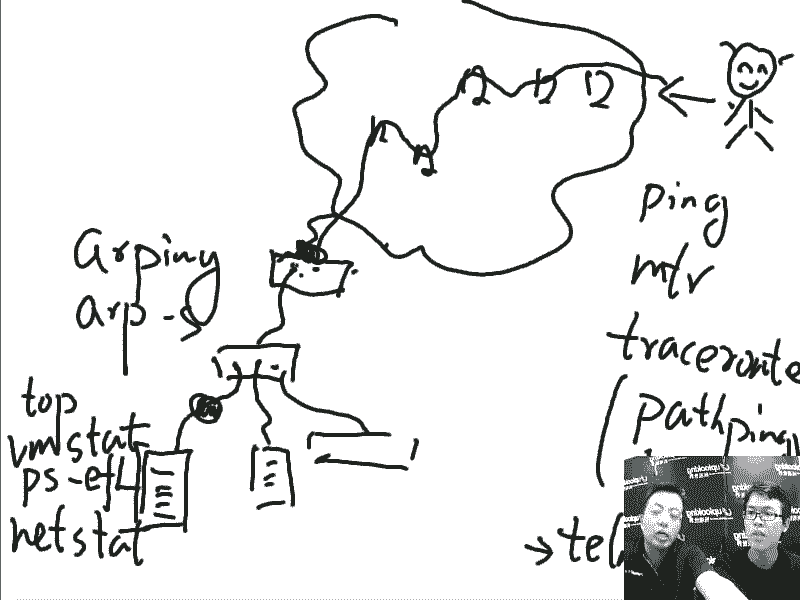

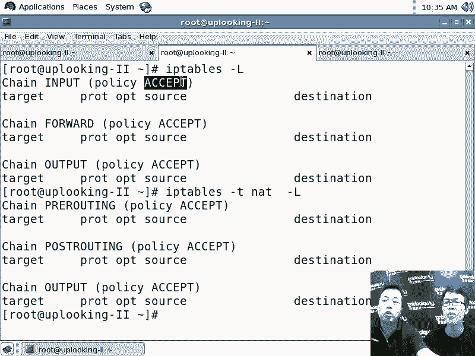

首先，需要判断问题是否出在客户端到服务器机房之间的网络链路上。这条链路可能包含多个路由器和交换机节点。

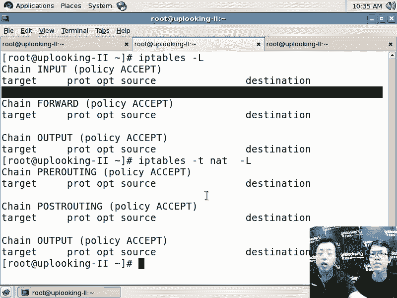

以下是检查网络链路状态的常用命令：

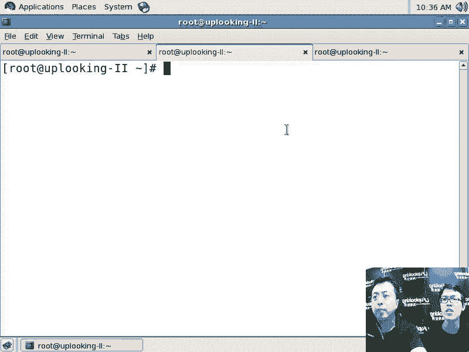

*   **`ping`**：测试与目标IP地址的连通性和延迟。
*   **`traceroute` (Linux) / `tracert` (Windows)**：追踪数据包经过的路径，查看每一跳的延迟和状态。
*   **`mtr`**：结合了`ping`和`traceroute`功能的网络诊断工具。

> **注意**：这些命令主要检查ICMP协议的数据包。你还可以使用`telnet [IP] [端口]`来测试特定协议（如HTTP的80端口）的连通性。

如果链路测试显示延迟高或丢包严重，那么问题可能出在网络服务提供商或中间节点上。

## 第二步：检查局域网内部问题 🏢

如果外部链路没有问题，那么问题可能出现在服务器所在的局域网内部。

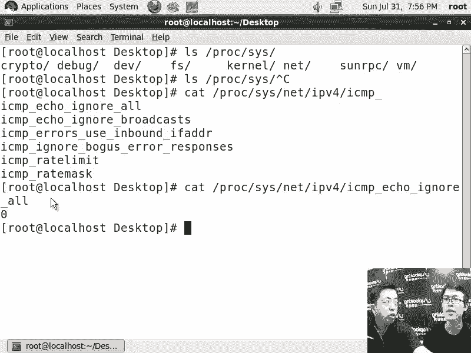

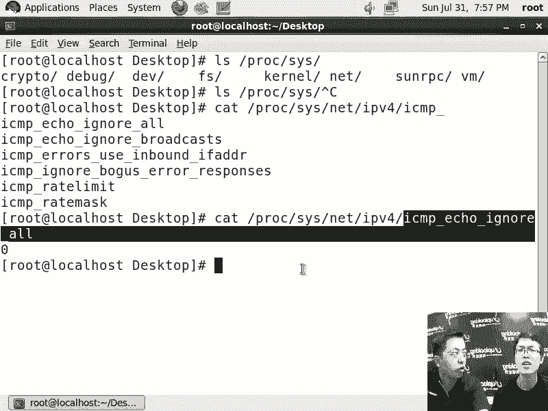

此时需要考虑是否存在ARP攻击。以下是相关的诊断和解决命令：

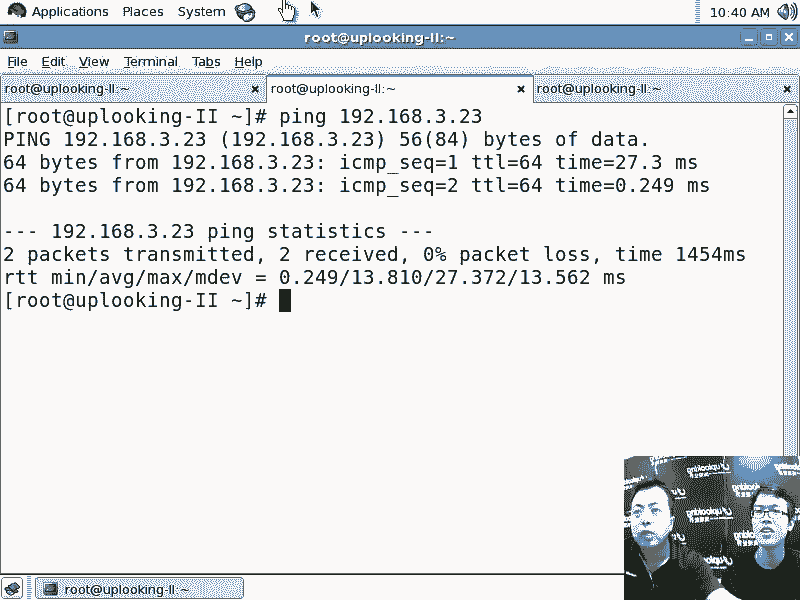

*   **`arping`**：用于检测局域网内是否存在IP地址冲突或ARP欺骗。
*   **`arp -s`**：可以静态绑定IP和MAC地址，防止ARP欺骗。

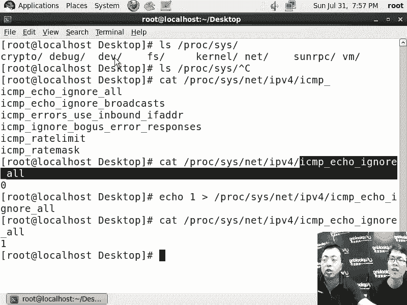

## 第三步：检查服务器本身状态 💻

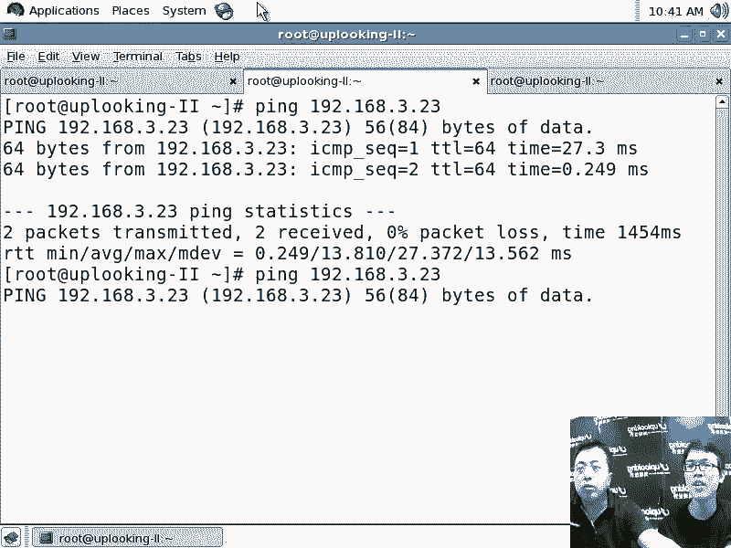

如果确认问题出在目标服务器上，我们需要检查服务器的资源使用情况和网络连接状态。

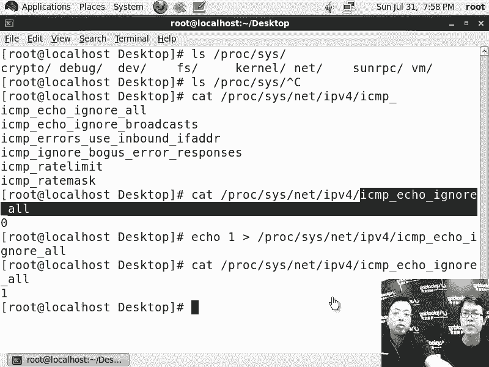

以下是检查服务器状态的常用命令：

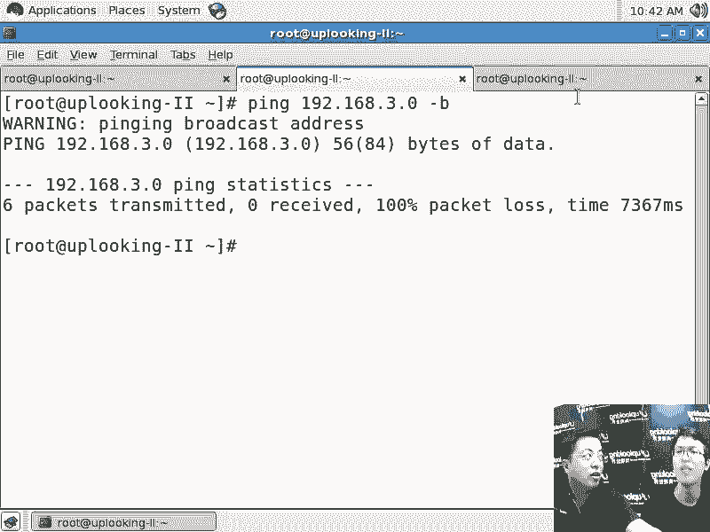

*   **`vmstat`**：查看系统的进程、内存、交换分区、IO和CPU活动信息。这是一个开销较低的整体性能查看工具。
*   **`top`** 或 **`htop`**：动态查看进程状态和系统资源占用情况。
*   **`ps aux`**：查看系统中所有进程的详细状态。
*   **`ps -eLf`**：查看进程的线程信息（`-L`表示线程）。
*   **`netstat`** 或 **`ss`**：查看网络连接、路由表、接口统计等信息。

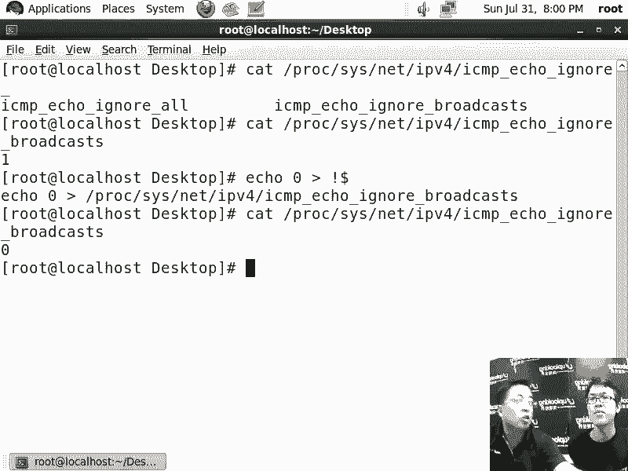

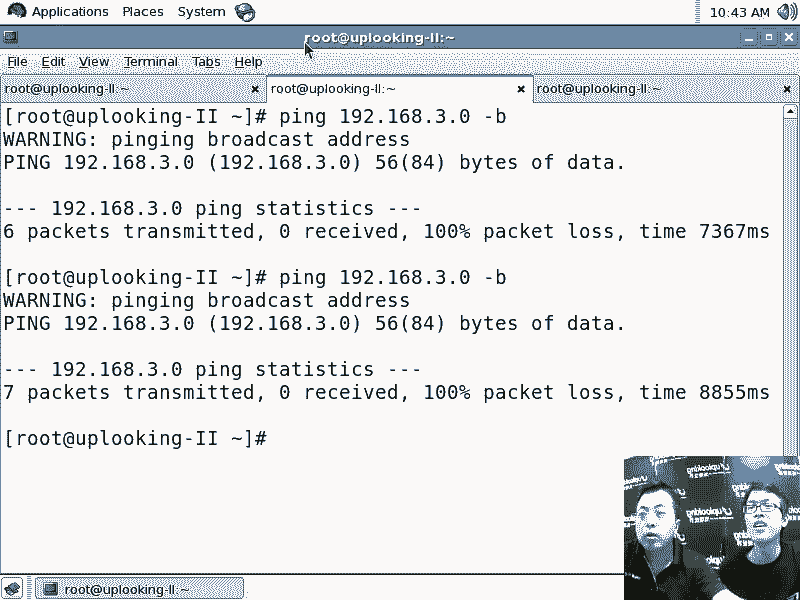

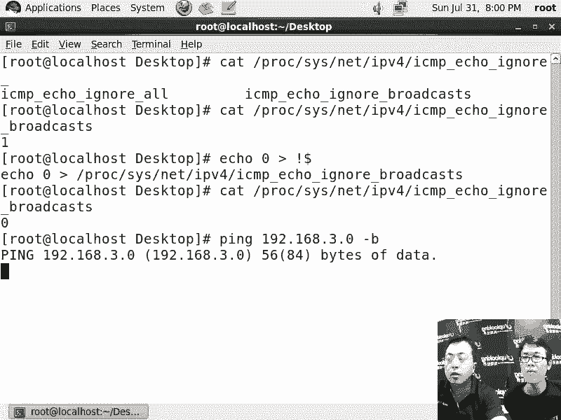

## 第四步：检查防火墙规则 🛡️

如果服务器资源使用正常，接下来需要检查防火墙是否配置不当，阻挡或限制了正常的网络访问。

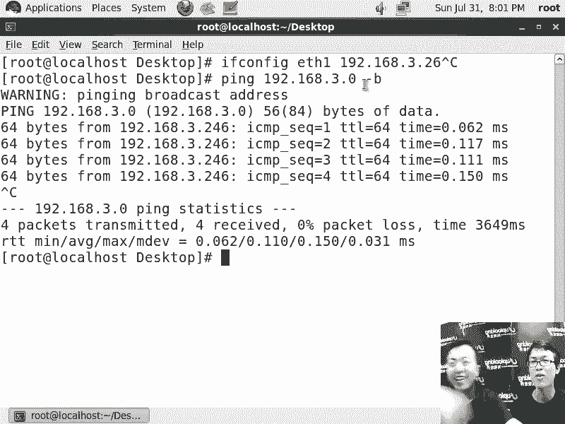

使用以下命令检查`iptables`防火墙规则：

```bash
iptables -L          # 查看filter表的规则
iptables -t nat -L   # 查看nat表的规则
```

如果发现规则可能有问题，可以临时清空所有规则进行测试（生产环境慎用）：

```bash
iptables -F
iptables -t nat -F
```

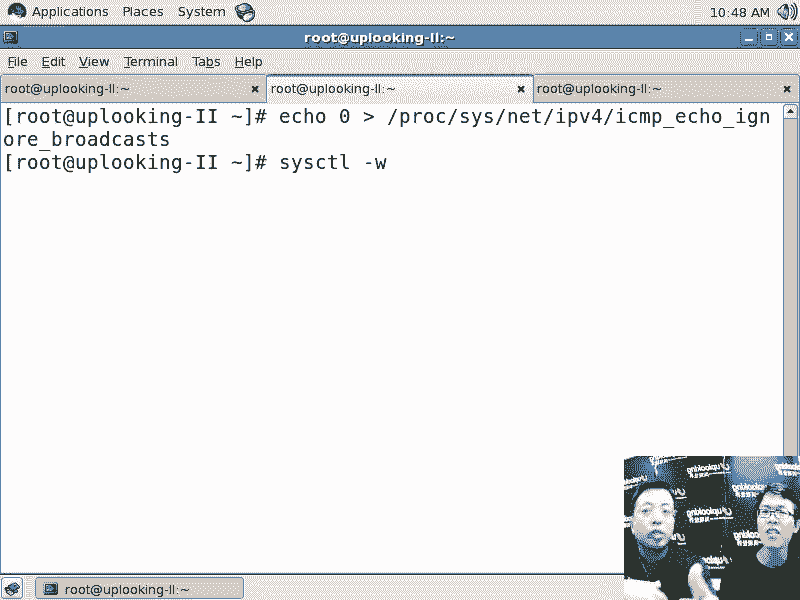

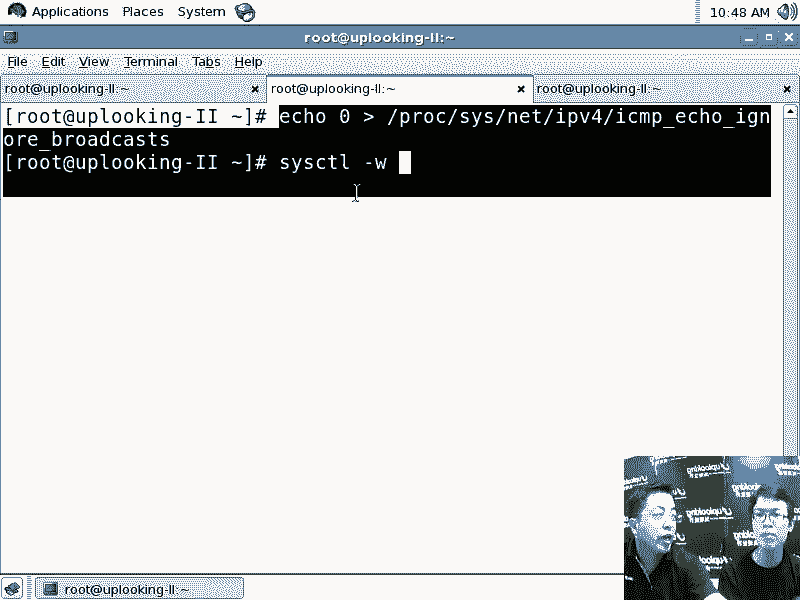

## 第五步：检查与修改内核参数 ⚙️

如果以上所有步骤都未能发现问题，那么一个非常隐蔽的可能性就是内核参数配置不当。内核参数直接影响着操作系统处理网络请求等核心行为。

### 理解 `/proc` 文件系统

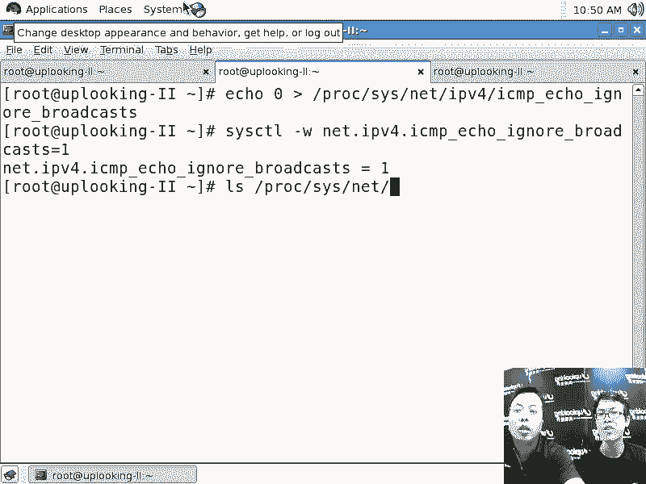

Linux内核参数主要通过虚拟文件系统 `/proc` 来暴露和设置。`/proc`下的文件并非真正的磁盘文件，而是映射到内存中的内核数据结构，读取它们就是读取系统的实时状态。

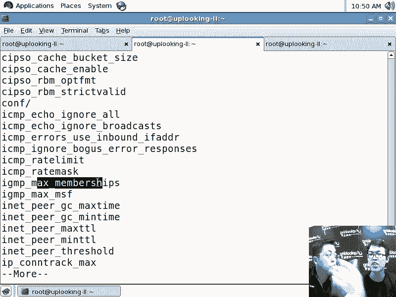

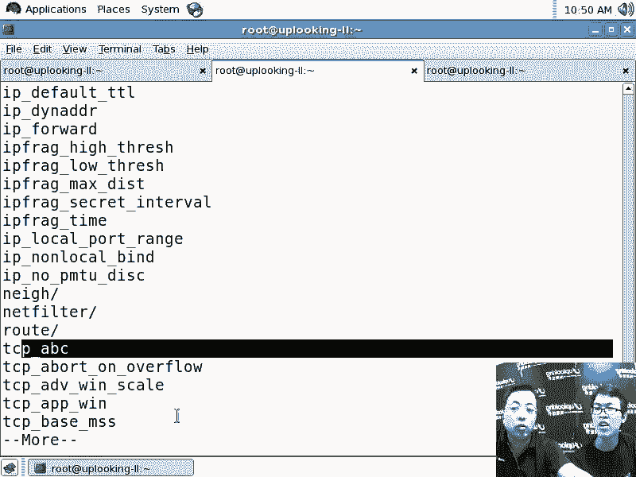

与网络相关的内核参数主要集中在 `/proc/sys/net/` 目录下。例如，IPv4协议的参数在 `/proc/sys/net/ipv4/` 中。

### 查看内核参数

你可以直接使用 `cat` 命令查看这些参数文件。例如，查看是否忽略所有ICMP回显请求（这会影响`ping`命令）：

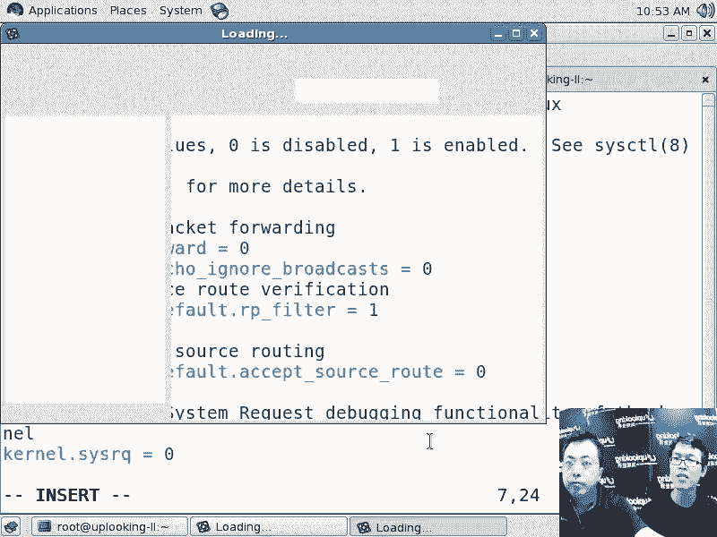

```bash
cat /proc/sys/net/ipv4/icmp_echo_ignore_all
```
输出 `0` 表示响应ping请求，输出 `1` 表示忽略。

### 临时修改内核参数

修改这些文件的值可以直接改变内核行为。有两种常用方法：

**方法一：使用 `echo` 命令重定向**
```bash
# 开启忽略ping请求
echo 1 > /proc/sys/net/ipv4/icmp_echo_ignore_all
# 恢复响应ping请求
echo 0 > /proc/sys/net/ipv4/icmp_echo_ignore_all
```

**方法二：使用 `sysctl` 命令**
`sysctl` 命令提供了更规范的修改方式。它使用点号`.`代替文件路径中的斜杠`/`，并省略`/proc/sys/`前缀。
```bash
# 开启忽略ping请求
sysctl -w net.ipv4.icmp_echo_ignore_all=1
# 开启IP转发功能（使Linux具备路由器功能）
sysctl -w net.ipv4.ip_forward=1
```

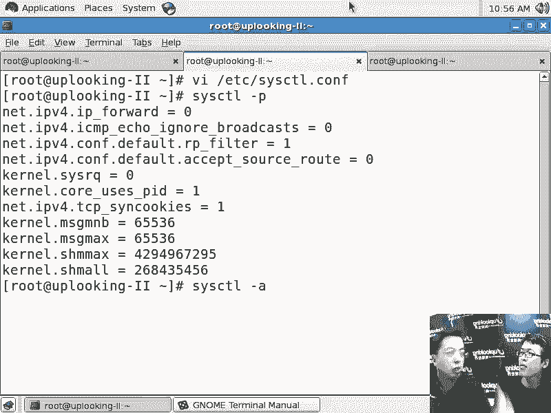

> **注意**：以上两种方法都是**临时生效**的，系统重启后会恢复默认值。

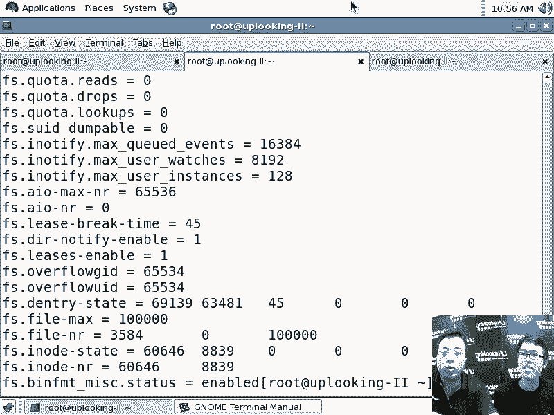

### 永久修改内核参数

要使内核参数修改在系统重启后依然生效，需要编辑配置文件 `/etc/sysctl.conf`。

1.  打开配置文件：
    ```bash
    vi /etc/sysctl.conf
    ```
2.  在文件中添加或修改参数，格式与`sysctl -w`相同：
    ```
    net.ipv4.icmp_echo_ignore_all = 0
    net.ipv4.ip_forward = 1
    ```
3.  保存文件后，执行以下命令使配置立即生效，而无需重启：
    ```bash
    sysctl -p
    ```

### 内核参数问题排查技巧

内核参数繁多且复杂，当怀疑是内核参数导致的问题但又无法定位具体是哪个参数时，可以尝试以下“秘籍”：

1.  **导出正常机器的配置**：在一台运行正常的同配置服务器上，导出其所有内核参数。
    ```bash
    sysctl -a > /tmp/good_settings.conf
    ```
2.  **导入到问题机器**：将导出的配置文件复制到有问题的服务器上，并全部应用。
    ```bash
    # 在问题服务器上执行
    sysctl -p /tmp/good_settings.conf
    ```
3.  **观察问题是否解决**：如果问题解决，则基本确定是内核参数配置差异导致。之后可以对比两台机器的参数文件，定位具体是哪个参数的影响。

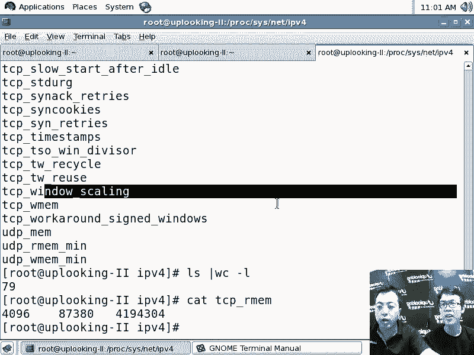

---

## 总结 📝

本节课中我们一起学习了如何系统地解决Linux服务器访问缓慢的问题。我们按照从外到内的顺序，依次介绍了：

1.  使用 `ping`、`traceroute` 等命令检查外部网络链路。
2.  使用 `arping` 检查局域网内的ARP攻击。
3.  使用 `vmstat`、`top`、`netstat` 等命令检查服务器自身的资源和网络状态。
4.  检查 `iptables` 防火墙规则是否配置不当。
5.  最后，深入讲解了最隐蔽的一种可能——**内核参数**的查看与修改。我们学习了通过 `/proc/sys/` 目录和 `sysctl` 命令来临时或永久地调整内核参数，并掌握了一种通过对比导入配置来快速排查内核参数问题的实用技巧。

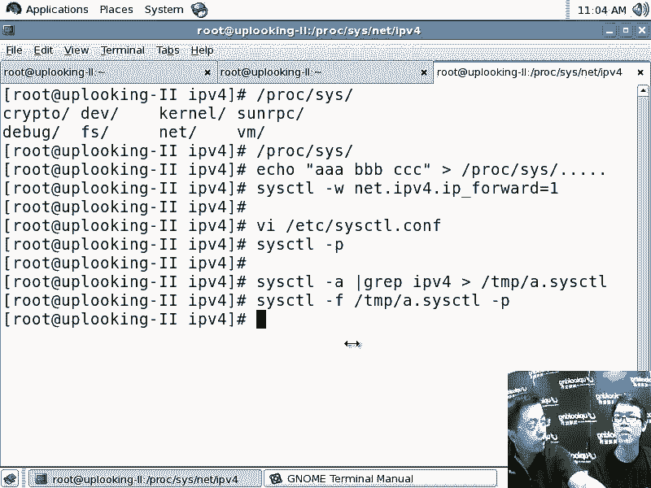

通过这套组合排查方法，你可以应对绝大多数服务器访问性能问题。记住，内核参数调整需要谨慎，在不明确参数含义时，最好先查阅文档或在测试环境中验证。