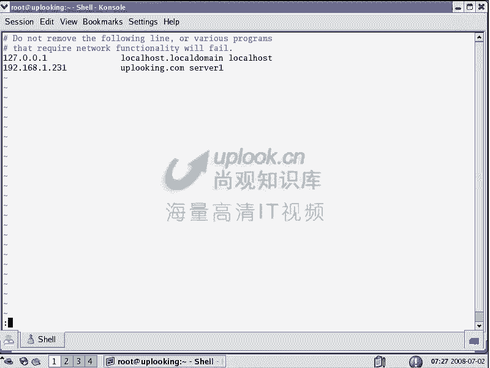
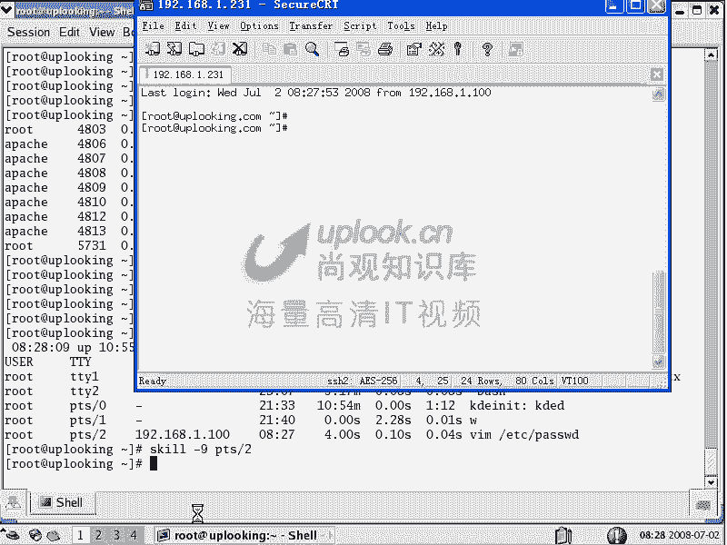

# 尚观Linux视频教程RHCE 精品课程 - P21：RH033-ULE112-12-1-进程控制 - 爱笑的程序狗 - BV1ax411o7VD

这样我们开始第十二章的学习。好嗯，是lininux的系统状态检测及进程的控制。这一章的话呢就会有很就是挺有意思的，为什么挺有意思呢？你在windows下经常也遇到一些问题。

实际上呢整个操作系统的原理都基本上是相同的。那么在lindux里面跟windows里面这个地方的话，它就有很多类别的地方，嗯，甚至的话它还可以反过来加强你对lininux的认识。嗯嗯，好。

系统状态检测就是我们现在看看系统现在到底怎么了怎么那么慢，啊windows里面你也会经常遇到这个问题，是不是？对，那怎么没有反应啊呃，进程的控制，我现在话想把这个进程Q掉，我这边可能有病毒了。

或者这个程序死机了，对不对嗯？😊，所以呢这就是我们这一章要讲内容。那么我们呢要学习的是，首先的话是查询当前系统的信息。然后再一个呢是查询当前系统的状态。啊，就是说你现在系统信息，你是什么内核版本呢。

对吧？等等这些消息。然后呢，你接下来的话系统状态，你现在为什么那么慢啊，用什么命令PLC文件系统是系统的一个小窗户啊，原来我们给大家说过PLC就是内核的一个小窗户，那眼睛是心灵的窗户是吧？

那你直接去呃伸到我肚子里面去抓我的心，看成什么样的，这个也不太可能。所以的话呢这个的话你抓内核看科到是怎么样的，那也不太可能。因为科到现在正在工作，对你不可能让他什么暂停下来工作。

你既然已经暂停过来工作了，然后你又回过头来去什么去控制自己，这不太可能有点像一个活人，他要用自己动手把自己的心脏拿出来，这样看，这是不可能的。因为你就在他的这个你你就是在他的这个平台上工作。你不可能让。

停下来供你去看，对不对？所以的话我们通常情况是用PLC去透视一下，去看一下这个内内核进程的显示。你看哎这些进程呢有哪些等等。然后呢，进程控呃控制进程，然后呢，进程的前端后台，这是我们要讲内容。

这是第十二章的内容啊。

OK我们现在看。那么首先的话呢，系统信息的收集，这个我们原来讲过的。hos name看你的主机名。

在linux里面，我们反反复复强调过ho name非常重要。现在我们host name的话是app点com，就是我们的主机名的话是app点com。如果要是你默认安装，什么都没有改过。

那你的主机名应该叫做什么local host，就是本地主机啊，或者local host点local动就这样。这个文件的话是自我做解析用的。我们知道要解析一个3W点新浪点com的域名。

是不是解析成一个IP地址，嗯，对不对？对，那么你要解析什么呢？local host点local等待或者local host是不是解析成127。0。1是自己的IP了。对。

那么你要解析uplook点com的话，是不是要解析成什么1。280。254是吧？嗯这个现在显然是不符合要求的。我看hos name。那么现在的话我应该把它解析成什么呢？一定要注意，当你改完主机名以后。

你应该把它解析出你自己的IP地址。我现在IP地址是231啊。0。231哎，1。23药。我看一下我的IP地址。

阿卡费的是查看几来B地址。

1。231对吧？对。那我把这个0。254改成什么呢？1。231，这样的话呢可以保证你的这个主机啊在启动不少服务的时候呢，非常快去启动起来。否则的话你的服务启动要很久很久，三个秒启动要5分钟，你就受得了。

对不对？所以的话我们反老复给大家说，如果是你改你的主机名，你要把你的主机名和你的IP地址做一个对应嗯。

一个标准的host文件。一个标准的host文件应该是能把local host这个主机名解析成127。0。1嗯，把local hostlocal等待也能解析成127。0。1。

然后再把你自己设定的主机名解析成你的IP地址。嗯，明白吧？明白，这是大家在生产系统上的话，要坚持一个原则，否则的话不按规矩出牌，你最后只有什么，有的时候你就莫名其妙的出现问题啊。

那么在windows里面也有host文件，你知道吗？嗯，你你你看到过吗？呃，我记得是看过过，在C盘下面的C盘下面的windows目录当中的。

诶。你。C盘是吧，C盘下的windows当中的sstem32。system32。system32当中的，我看。Drivers。traverse当中换有个ETC那吗？这边有个host嗯，看到吧嗯。

现在我这个host文件做过中多病毒啊，所以它这里面什么一点host hosts点MN什么的话，被病毒改过。那这个病毒它原来把那个诺盾的那个升级的那个网页啊，就是那个域名啊，然后解析成127。0。

1故意让我升级不了，太坏了，是吧？你看现在可以打开它，因为它是没有没有后缀的呀。那个后缀在windows里面打开的话，就比较麻烦。你及时本去打。

就现在完全被删删掉了，实际上原来应该有个什么127。0。1的解析的嗯，那删掉了。那你可以看这个。

Okayか。

Yeah。这些文件啊在linux里面都有ETC幕下有service文件，那有service文件network pro啊，这个LM hosts词点呃这个LM hosts的话呢，是那个什么文件。

是那个呃就是说解析那个主机名的，不是解析域名的吧主机名的。

这个当然不是我们解有全都删掉了，不好意思，看不到了。因为话我们这个文件的话已经被那个诺顿啊，就相当于清掉。他有一个他有一个病毒的话，你专门去清洗这个文件的。所以的话呢呃前一段时间的话出现病毒的时候。

他被杀掉了嗯。

被删掉了清掉。那么这个地方呢就在windows下，你也应该看可以看到这样一行，就是那个windows下那个host文件，也应该有这样一行。嗯，也就是它也有host文件，host文件就是做解性的嗯，对吧？

那么这是一个你可以呢通过host name，我说由hos name来给大家，就是就是说告诉大家这个主机名是吧？应该好好设置，然后呢由其的话呢，还有就是ETC下的host文件，就在我们之前的话呢。

跟大家说过如果想永久的更改自己的主机名VIEC下的s当中的什么这个文件，那么把里面的这个主机名的话呢，你可以改一下，那这里面hos name等于什么什么什么嗯对吧？对。

然后呢这个地方呢就是说永久的更改自己的主机，还记得我告诉你一个原则。如果要是你把这个东西改在配置文件里面，下次重新启动的时候，它是不生效的对，明白了吧？

明白所以的话你用hosse name去改自己的主机名，下次重新启动生效无生效生效生效吗？我用host name这个生效然AA点这时候他下次重新启动不生效改那个配置文件才生效同时的话你还应该改host文件。

把你的主机名和你的IP地址做一个对应对吧？就我们已经老生常谈了，为什么要谈这么好多次呢，有很多自认为高手的人啊，他就不按规矩出来，我随便改个主机名再说是吧？管他呢。这是不对的。

U name杠A可以看你当前的这个平台等等。这个我们原来也给大家讲过啊，也给大家讲过。还有呢就是last last loglast last log可以看你呃在什么什么时候啊，这个系统启动过啊。

然后谁登录过你系统怎么启动过，就是有没有重启在什么什么时间的话是重启啊啊等等嗯，这个机器呃，last log的话呢，是看每个人啊，每个人的话最近一次登录的时间，对吧？这个呢是我们看系统的一些信息啊。

系统的一些信息。

然后呢，如果要是你看系统的状态，就当前的这个系统状态。你比方说你想看一下当前系统的话呢，我们现在用内呃用我们的硬盘是吧？嗯，那么是不是快满了DF的话可以看这个原来我们给大家讲过啊，现在81%的可用是吧？

对，然后呢DU可以看呢你的现在这些文件的大小，对吧？对DU杠SH加上一个目录，你可以看这个目录的大小，34兆，对吧？对，这就是我们的DU那么如果想讲看内存的大小的话，内存现在使用了多少。

有没有剩余fr面你可以看嗯，对吧？对，是free。

然后呢，还有呢就是我们的呃PLC文件系统。

PLOC文件系统呢，我们刚才说了就是小窗户那一段嗯，对，是吧？嗯，小窗户这段的话，我们看LSPLOC那么这个我们在原来也给大家说过，这里面所有的文件或者文件夹全部都是假的。嗯，你看到它是文件文件夹。

当你ca它的时候，比方说这样的caPLC下的 file system的时候，那你看到的是一个什么？看到是这么一串值，你感觉它是一个文件是吧？嗯，实质上它是内核当中的一些什么数值给你显示出来。

你ca这个文件，它就把那个数值给你显示出来是这么一个东西，那你如果要是把它m在比其他地方，它照样也能看到，你比说这样的，我m了是吧？杠TPLC我把什么呢？呃PLC文件系统mo在什么呢？

那没有任何来源，那s在我的MNT目下，然后在LSMNT。跟你PLC一模一样嘛。嗯对对吧？对，那说明什么？说明这些东西啊根本就是呃就是你是把。那ve就是没有东西啊。

就是没有任何东西m在1个PL呃1个MNT目录下，就相当于你访问MNT目录下的时候，它只用到的是1个PLC文件系统嗯。那这PLC文件系统，你说啊PLC文件系统，他就知道你要访问什么东西了。

所以这两个地方都是一模一样。那你当然可以把它什么you过来。那么说为什么要给大家强调一个PLC呢PLC文件系统里面的这里面的东西啊，你看一下，你要说你现在想看一下你现在这个呃有哪些mount啊。

比如说有哪些呃加载点。

n子在这里面就是所有的加载点是吧？想看一下内存。刚才你不是说内存使用情况是用frreee命令看的吗？对，实际上free命令。他是看什么呢？PLC里面的memory info。

他是看这个文件的嗯明啊他给统计出来。所以呢归根结底PLOC如果要是没有加载你的各种各样的像阿卡fi个命令啊，这些命令啊，全部都是不能用的。嗯啊，host name这些命令话全都是不能用的。

所以PLOC的话是非常重要的，明白了吗？明白嗯，那么PLC这个文件系统上，我们给大家介绍一下。那么在上端的调优的课程当中话，我们专门有针对PLC的这个系统调优的内容。那么这里面的东西呢。

一般叫做内核参数。你比方说我们现在看在这个里面ttPLC。s目录下这里面的话呢是我们的内核参数，也就是你这个其他的文件都是看一看像mem info。你说我现在用了100兆内存呃，剩余的话有100兆。

我直接把那个一后面那个100改成200，那么剩余的就有200兆内存这肯定不能让做梦，是不是？所以的话呢这些文件大部分都是只读的，只有这个目录下的文件的话呢，是可以设置。你要在这个里面的话。

m里面那么IPV4里面这里面有大量的什么呢？有大量的这个参数，内核参数。比方说IP呃ICMP然后呢呃。Ile啊I口igor这个呢就是说别人聘你能不能聘得通啊。嗯，那么实际上你的机器就在那边运行着。

网络也通的，但是我就不想用你的拼的请求。嗯，那我可以把这个值的话，icical。一、输出重动项看到吗？嗯，输出重功向一个感叹号加个保er，表示呢这个上一个命令的最后一个参数，那么直接就回撤。明白吧？

嗯这个时候的话别人聘你就聘不通的，聘你19218。1。231。嗯，Q空吧。对，然后我把它改成零。自己也拼不通，别人也拼不通吗，然后你再去拼能能通啊？有哎，好了吧，内核参数啊嗯所以他我们专门的话呢。

在呃乔约的里面的话，会给大家详细的再去讲内核参数。但是大家现在需要知道什么呢？POC是一个。内心的小窗户是吧？然后呢，别人的话呢，一些命令都是要到这个窗户里面来查相应的数值的。嗯，明白吧？

明白像RSfi个命令啊，就是查看你的IP地址的命令啊，查看你主机名的命令啊，然后呢mount命令啊，它都需要PL4软件系统，明白了吗？明白来源于此啊，okK那么这个PL4的重要性统。刚才跟大家说了。

还有呢就是我们的系统日志嗯。

系统日志的话呢，这个我们原来没有怎么提过啊，所以系统日志的话呢在放在wa的log目录下，就是一般的这个呃我们现在就是说常见的系统日志的话，都放在这个里面。

常见系统日志放在里面，你比方说ACPI的这个呃还有就是说count日志，还有呢就是启动时候的日志mail的日志，计划任入的日志。然后mycle的日志这是RPM安装的mycle的日志RPM包的日志。

然后呢安全相关的日志等等，那在这里面我们用的最多的是什么呢？大家看message的日志是用的最多的。为什么呢？在我们的系统讲系统那部分上关的这个系统的115部分的课程当中哈，告诉大家日志的原理。

因为看到所有的程序，他们都会把指定级别的日志全部都会写到mesage当中去，当然不是说所有的日志了，当然绝大部分的日志，你比方说ache出现的问题，你首选应该看哪个日志呢，就看这个日志那一般看日志的话。

我们是不是告诉大家tail是吧？下的下的meage是吧？这个时候你能看到系统的最近的一个情况，是不是？那么我们说tail我们告诉大家一。F是吧，它就一直坚持着不动了，对不对？对。

直到你摁ctrl加C好它结束掉，嗯，是不是对？然后呢，还有就是我们的这个比方说还有呃。wa的log下面的S呃ec这个文件是吧？嗯这个文件的话呢，你可以看它的内容配用一下是吧？对，还有呢就是我们其他的。

那么我们说messages啊，看一下啊，messages它里面是什么东西呢？messages它里面是什么东西呢？就是我们各种各样日志的话，都往里面去写啊，那么它是一个汇总汇总。

那么其他的话呢用的比较多的，像secure secureecure的话呢是安全相关的。你比方说你改了一个用户的密码，或者说你添加一个用户或者个用户的话登录一下等等。这些消息的话。

会会放在seecure当中，嗯，明白吧？那么到底有谁登录上来。你比方说有一个人啊他登录一下你的机器，然后呢，登录进来以后的话，我们说黑客如果黑到你以后，他会要他有个特别恶心的名字叫什么擦屁股，是不？

他要把他的这个痕迹擦掉，是不是所以他会直接顺手把他这个日志清掉，是不是有个日志清掉所以呢这个日志的话呢，如果他具有如的权限，他可以直接清掉。

但是呢有另外一个日志就是还是安全相关的叫WTTMPWTMP这个日志的话呢，他是以二进制的方式是跟安全相关的。当你登录完以后，你想改你说我没登录过。把这个日期改了不行，这个是二进制的文件。

那么你是改不了的啊。那么这个时候的话，你改它的时候啊，就除非是你用特别的格式去把它改掉。那么所以的话你这个时候呢用last。你刚说这个里面的话有个WTMP这个日志是吧？对你看这里面内容。他说很怪的嗯。

看到了吗？对很怪的。所以你这个时候呢想去改这个里面的东西，你直接去改是不行的。那么必须得用什么呢？last命令去查看你last命令是不是可以查看啊？对。

但是这个时候你查看出来的东西就是从这个日志文件里面读出来的。但是这个日志文件却不能随便的去改。嗯，不是说你把这个日期改，它就无论那个时候了，明白我的意思吧？所以呢这个日志的话是为也是安全相关的。

但是它为了保密的，嗯它保密存储的，seecure是安全相关的。但WTMP的话，它是保密存储。嗯，然后呢，你有关email的日志，有关email的日志的话呢，是什么m。啊。

那么刚才我们刚才用到了一个mail命了，就上节课的话，的管道的时候，用到一个mail命令。mail meaning就是说我们还可以什么时候值通过mail的话输出不出去是吧？对，那么那个mail的话呢。

它是连接本地的email服务器，这个email服务器所有的文件相关的东西全部放在这里。嗯明白吧？明白，然后呢接下来的话呢，像mysql就是mysql是我们的数据库文件啊，嗯。

你会以看到这些日志文件的话都有什么1234等等这些这是截段日值。阶段日志因为你的日志的话不断更新啊嗯不断更新。那结果你这个日志的话呢，有100多兆了，你看着费劲吧。嗯所以的话它每隔一星期的话。

它会有半个截段日志。嗯啊如果超过一个月的日志，它会清掉，这样的话保证你系统的话是怎么样呢？是稍微清洁一些啊，然后呢还有就是说XFERlog这个日志的话呢，你看它的字面意思好像看不懂是什么日志。

它实际上是FTP的日志。嗯，这是STP的日志。啊，你要想看FTP有谁登录过，那么你现在FTP谁传输不多少数据，谁总是来访问你，谁总是来攻击你，那你看这个日志嗯，明白吗？明白，那么也就是说安全的日志。

那么是这个，然后呢安全的加密日志WTMP是吧？嗯如果你突然发现用rast看到的空的啊，没有几个人登录过，那说明有人把这个文件清空掉。嗯，所以他这个时候呢有点危险。

再有一个呢就是说mlog email的日志。那么Cme的话是计划任务。我们不如说了，你每天4。0凌晨4点02分，还记得那个loccate吧。

记得loccate不是要有个配套的upDB那个程序要更新它的数据库嘛。那这个时候的话呢就是由Cown去做的，就是由他来做的。那他假如说在做这个upDB的时候出错了，他记在哪？嗯。

就是记在这里crown这个志吗是吧？然后呢，跟启动相关的就bit log是吧？然后呢，还有就是我们的这个呃。其他的话用的较少，像什么RPM啊，什么呃XRGXRG的话是Xwind。

就现在我们看到是个图形界面嘛。嗯这Xwindow图图形界面的这个启动时候的话，有些什么问题，在这地方就出现了，嗯，明白吧？OK我给大家讲完了这个地方以后呢，这个常的日志的给大家讲完以后的话。

我们可以看到这边的一个汇总的说明啊，汇总的说明。

你要说D messageD messageage的话呢，这个日志文件的话，实际上是内核的一个日志buffer啊，就是log bufferffer。这里面的话，直接当前内核的一些产生的一些消息。

你要用de messagesage来看，你可以看这个文件，也可以在这里面运行什么D messageage，你可以看内核相关的日志，嗯，明白吧？白通过它来看，所以呢这个是一个，然后呢。

我们用的最常见的就是说什么message，对不对？然后其他的日志的话呢，大家可以看一下这个大致我们刚才都跟大家说过了，嗯，是吧？对。仔细琢磨一下，看看书。那常见的看日志的方法。怎么看呢？

你比方说我现在突然系统出现一个问题，那看到到你俩出错了，我这时候该怎么看？嗯。

嗯，刚才我不是演示过哦，怎么看日志呢？那系统现在有个出现的错误，这个服务启动不起来，我应该怎么做？嗯，看那个messages，看message很好啊，是不是很好嘛？就是te一下是吧？嗯。

wa下到log下的messages。哎，我刚才那个服务出错是吧？嗯然后我看一下到底是哪出错，那么这是最常见的。嗯，你说哎。谁把我这个用户的密码改了，谁呀说是吧，你这时候特有谁呀？😡，是不是？

对你能看到谁登录过你的系统，或者说什么输密啊，错误那这些消息明白了吧？明白了。那如果看看email方面，哎呦，email怎么发不出去了？看哪个日志。你个错。

Mlog嘛嗯Mlog。对吧对。还没有logg，你可以看email的日志，对不对？

好，这就是我们常见的日志。OK我们再看一下呢后面的后面的话呢就是说一个进程。那么进程是什么？这个等一下的话我们要呃拿windows的话来给大家说一下。

嗯啊拿windows呢说一下那个进程呢就是说是我们系统当中啊，每一个程序就是我们平时所说的程序嗯你经常的话去呃玩一些游戏，比方说CS是吧？对然后呢模兽是吧？然后呢或者打开word，打开IE这都是进程了。

嗯，那么所谓的进程的话呢，就是在我们的系统结构当中的话，原来我们给大家说过系统结构当中是这样的。

诶。你不方说现在系统。在一分为二。那么我们知道内核的话呢，是不能随便去打扰，就跟你的心脏一样，你不能让它停下来以后你去摸一下，对不对？对，所以就说内核当中的话呢。

是大量有大量的这种呃首先有一个基本的坑了嗯。科nel就是我们科l点ORG嗯是吧？对，那天的话上去过是吧？嗯，然后在这里面呢有大量的什么呢？model斯是不是这边的model斯的话是不是有很多啊嗯。

对吧对，那么这些模块他们呢在外面的话会有一个什么呢？进程嗯。这个是为了系统为了完成某项任务的话呢，打开了一个程序。那么在这里面呢，我们看到进程，有可能进程当中的话呢，还有什么？还有现场。

一条一条的这种县城，县城的话是re是吧？嗯。啊，它可能有多条线制，内核当中的话，有可能某一个模块或者说一些就是内核空间当中的话也有什么呢？限制。😔，也要内核县城，但是它不可能有进程。嗯。

进程的空间的话是独立的。你为还有一个进程，这个进程和这个进程想去互相访问的时候呢，他必须得通过IPC通讯。就是说进程间通讯的话去访问你不能说你管别人借点钱是吧？直接示放人家口袋里面去拿钱，这个叫偷了。

对对？这叫什么？入侵，这就叫什么缓冲区一出了。嗯，这个进程如果直接跑这个进程里面缓冲区一出啊，对不对？所以在进程和进程之间的话是通过IPC通讯嗯明白吧？白，所以呢这就是一个进程。

那么我们打开word是不是一个进程嗯是吧？对那么在linux里面的话，我们说这个东西要更清楚一点，那么你可以呢通过这样的一个方式啊，比方说呃就说top命，你可以看到很多个进程。😊。

这进程是不是都在运行？嗯，对，那么进程前面的话呢是它的PID就是进程的ID。进程垃圾看到了吗？嗯然后呢这个user就是这个进程的拥有者，这个进程的是什么身份啊，这边的话是它的优先级。

这边是它占样的吸拟内存大小，这边是呃实际内存大小共享内存，然后呢，还有它的状态，还有百分占用百分之CPU百分之内存啊等等。那么这个地方的话是什么呢？是我们的呃累积的CPU的时间，这边是执行的哪个命令。

对吧？对这样一的内内容，那么现在的话我们看到这样的一个呃一列一列的这样的一些选项，这就是我们一个进程的属性那么我们看到实际它占的内存的话是这个地方RES看到嗯RES它能占到这个多少内存。

这个地方呢是虚拟内存大小，这个并不是真实就是它整个的这个内存空间的大小，但是呢有一些内存空间的话，它是公用的那它实际占样内存的话呢，是中间这个地方的内存。明白吗？嗯那我刚才执行的命令是什么呢？

是啊套对吧？那么在windows里面的话，你也可以看contl加delete是吧？对。

看一下啊。在windows里面的话，看一下windows里面是这样的，嗯，对吧？对我们打开好多多了是吧？嗯IE是吧？浏览器等等这些东西。那么这些东西呢就是我们的呃这些的话就是我们的这个进程，这也是进程。

这边是这个用户的拥用者。嗯，那这个进程的拥拥有者，是不是跟那个有一样一样一样不一样，你还可以增加更多的力。查看。选择地你还可以加更多的嗯。CPU时间是吧？对CPU使用增量，CPU高峰值、页外侧误。

什么IO读取。更多对，那你看跟这个一样不一样一样。对吧嗯所以的话呢这个都是类比的。为什么有时候学windows越学越傻呢？就是这东西你一般很少去看的。嗯，然后也不会去理会它。

这个时候呢你在这里面在linds里面呢，这些东西的话，你必须得要搞得非常清楚。嗯，那它最上面的话呢是显示了一些什么什么几点启启动的，这个系统几点启动的是吧？然后启动了多久，对吧？嗯。

现在有多少个人在登录是吧？嗯，现在多少个人登录。负载的情况，每隔1分钟5分钟还有15分钟，它的这个等待执行的任务的个数。这个的话在调试的时候我们会详细的去讲。嗯，然后呢接下来的话内存的使用啊。

CPU的使用啊等等。那么我们看到这里面的话呃，这一列一列，比后它占了CPU的百分比，占内存的百分比是吧？CPU时间累积时间有多长时间，然后呢，这个PID是多少？嗯，啊，这个进程的拥有者是谁是吧？

这都是能直接看到了，如果要是你用top的话，你方说top你直接能看到这个列表，现在的话呢，它是按CPU来排序，谁占CPU多谁排，那现在我想按按内存来排序，那你只需要输一个大写的M。大起的M。

他就按内存来排序，嗯，谁占内存多，谁排在前面明白吧？明白，那么如果手上Q到某个进程，就杀掉某个进程，按K。杀掉这个进程，比方说我刷掉这个什么呢？2971这个进程是吧？嗯，2971，那么一回车以后。

他问他说默认情况，我发的是第15号信号，第15号信号，那么你就是这个默认信号嘛，合是就杀这个第15号信号，他呢就会给那个进程，相当于发了一个信号。嗯，那么有点像这样的。

我们现在这个进程之间的话是不能互相之间控制的是吧？对，现在假如说这个进程的话，想让这个进程的话死掉啊，那么你想让他呢就说这也相当于一种那个控制了。嗯，那你想让他的话呢去呃关掉自己。

那么你可以给他发一个信号。那这个信号呢在32位系统里面的话可以有32个。嗯，那你默认情况给他发的是什么呢？第15号信号。第15号现场就有点像什么？哎，你现在有一堆进程，每一个人是一个进程。嗯。

你告诉你你说，哎，哥们儿。自杀吧嗯。他如果要想用你这个进程，他不一下就跳楼自杀了，对不对？嗯，这个时候他会把他自己的身后事准备的好点，写好遗书是吧，等于收拾好了直接自杀。

但是呢如果要是你告诉他自杀说他不动，他屏蔽这15号信号，那你可以强制的去杀掉他。第9号信号强制杀掉，嗯，明道吗？就是一个进程，就是top是不是top他是不是要杀掉一个进程啊？嗯。

那就是他可以发第9号信号过去，明白吗？明白，那么这个时候呢，你就要知道对方的PID了。那现在假如说我现在要杀掉这个进程。

这个进程的话是什么？2980看到了吗？嗯啊，那我现在的话要K，我要杀掉，那么杀掉这一笔个进程呢，2980，对不对？嗯，2980，那你发第15号信号吗？我说我要发第15号信号，他必须得响应。

对他如果不响应怎么办？第九号。直接把它Q掉2980就没有了吧？嗯，是不是？所以呢这个时候你就发的是另外一个信号。嗯，明白吧？明白那么这个进城间通讯的一种方式，也就是什么single就是我们的这个信号嗯。

明白吧？明白那么top是不是可以做这件事那么实际上呢还有很多人可以其他人可以做。你比方说可以用什么呢？可以用Q命令Q命令是专门产生信号Q杠2你可以看到啊Q杠L你可以看到它能发送的所有信号。

你看第15号信号的话是不是terminal嗯让他去终结自己是吧？你知道阿道德不演呢终结标是吧？TEM开头啊，TRM那么这边的话就是让它终结。

然后呢还有就是我们的这个呃还有呢就是我们的这个第9号信号第9号信号的话就是信号么Qq信号，这个呢就不是让他自己去终结但是这个强制杀掉的判哎这个9真好用Q杠9很好。但是你最好用的话会导致他什么呢？

导致他系统啊就是导致这个人的话。啊。让它关掉，它不是自己关的，你直接一刀把它干掉了是吧？一刀把它干掉。但是呢他头打开很多子禁程，嗯，他没有回收好，这个没有把每个子禁程关掉。

那么是不是他的子禁程就收失去了控制。嗯，有可能啊有可能是这种情况，那这时候呢会产生僵尸进程。就这个进程的话就没办法控制了那么所以他最好不要用什么干久的话去随便杀。

这个时候呢让这个进程的话没有办法完整的终结自己不太好。嗯明白吗？明白了好，这就是我们的QQ呢L你可以看到能发到的所有信号，那么这些信号呢不一定非是杀掉。

你看到这个进程这个命令的话杀气腾但实际上它并不一定非是杀掉进程，那么你也可以刚才是不是top命令看到所有的进程你还用PS命令PSAU啊A的话是显示呃就PS直接回车的话。

它显示现在登录的这些人打开什么程序然后呢A的话呢显示的东西稍微多了一点每一个控制台它都会显示当前的一个进程吧？然后呢PSU那么就显示当前这个东西的话有点像top显示的那些地了，看到吗？

是不是显示东西都是一样的个是吧？PS也就是它这进程的ID是不是？然后呢占CPU分。内存的百分比是吧？嗯，占了虚虚拟内存的百分，那虚拟内存还有实际内存隶属于哪个控制台嗯啊，那么这是它的状态，S表示是什么？

sleep。S4表示weeping。那么这边的话是它的呃就是在什么什么时间开始的啊，然后呢。占用呢累积的CPU的时间是多少？然后呢，正在打开哪个程序，嗯，那PS那个是不是也看也可以看可是吧？

PSAUX这是我们常用的。

AX呢就是不只显示控制台上的进程了，而且还显示什么？还显示你呃后台的进程。嗯，你比方说后台有一个服务，这个服务你说历属于哪个控台？你这样他输入一个什么s HTVD star是吧吗？它器启动起来。

和它器启动起来以后，你看它属于哪个空呢。问号它不属于任何共态，它是后台守护进程对不对？所以这种进程的话呢，在PSAUX的时候由X来显示出来。嗯没有这个X它只显示这个控制台下面的进程。

它不显示后台进程明白了吗？白，所以这个时候的话呢，这个X是做这个，那么PS杠EF这个的话也是显示所有的进程，但是它显示的东西列数啊，跟AUX不一样。但是呢在ux系统里面的话，用PS杠EF用的非常多，嗯。

明白吧？明白，那么也就是说你到底是用AX还是杠EF随便你你看哪一列比较你比较喜欢看，那你就你就用它好了。但是呢PS杠就是PS杠和PS不加杠它是不同的参数，这个在linux里面这个参数啊。

lin我们VF是吧？你也可以加上杠CVF它是一样的作用。嗯，那么像LS面，我们一般知道是LS。L是不是这是它的参数？嗯，但是一般的雷个指明的命令的参数都是加杠的。嗯，但是PS命令它可以加杠，可以不加杠。

加杠和不加杠是不同的意思。嗯，你要说PSEF和PS杠EF它不一样嗯。明白了吗？明白了。那么我们现在看PSEF是这样显示PS杠EF是不是显示更多嗯，其他东西是不是？对。

所以这时候的话我们能看到这个呃这个进程的不同的列，你看到它是不是不同的列嗯，是不是那么它是不一样的PSEF和PS杠EF和PS什么呢？AX啊，那我们常用的参数呢，刚刚跟大家说了PSA知道了是吧？

U知道了X知道X是显示后台是否是进程是吧？那么F是干什么呢？显示父子关系。嗯，进城之间有父子关系的。那么也就是说你这样的一回车以后，你看哎。这个进程是其他的这8个进程的爹，对不对？是他们的大，对吧？嗯。

这是负进程，所有进程的副进程是谁呢？所有进程的副进程是INIT。IIT是整个系统打开的第一个进程。嗯，那这个进程是所有进程的什么老爸。嗯，明白吧？明白，那么整个这个进程的话构成一个叫做什么进程数的东西。

你看这边的话是以如此账号来登录是吧？嗯然后在要打开，然后呢又执行了这个命令是吧？对又执行这个命令。如果我把它下面这个进程Q掉，那就是要结束一个进程数，比如整个这个数当中打开的所有进程全部都被Q掉。嗯。

明白了吗？明白了，所以的话我们给大家用一个F。用1个PSAXF嗯给大家显示出来了进程数这个概念。进程树这个概念的话，那么树下和树稍微往上一点，嗯那是一个父子关系。嗯，那它的负进程。呃。

这个进程的ID的话叫做PID是吧？嗯，那这个进程的副进程的P呃就是ID的话呢叫做PPID。PPID就是它的副进程的ID。那么这个时候呢F的话，它可以清楚的显示出他们的层次关系，嗯，对不对？对。

那这时候呢我们还可以看到一个个的进程数。嗯，同时呢我们给大家说一下所有进程的副进程是谁呀？INIT也就是说IIT它的进程的ID的话永远是什么呢？永远是一。看到了吗？嗯。IIT这个进程的PID永远是一嗯。

它永远是第一个进程。明白了吗？明白了。嗯，OK那么现在的话呢，在windows下是不是也是这样的，你看一下，在windows下，是不是你可以右击它点一下什么结束进程数，看到没有是不是一样的。

是一样的道理。那么这个呢跟windows是。一样的。那么我们现在刚才跟大家说的Q命令是吧嗯。Q命令Q命令我要杀掉一个进程。那么比方说我现在知道他的ID号码，比方说4811是吧？嗯，对，那么这边Q4。啊。

11，那么我就Q掉它默认型号发的是第15号信号啊，第15号信号。那我们再看一下它是否在啊。4811是不是被Q掉了？嗯，是是不是？嗯，那这个这个进程的话呢，它响应我的这个呃15毫信这个信号。

但是如果要是我去打开另外一个进程的时候，你比方说我打开 shellll这个控损还打开的这个背 shellll的话呢，它是典型的什么？不响应15毫信号。你看这个时候我们再看。这边是不是打开杯上，嗯，是吧？

这个背 shell的技能是5671，是不是啊？对，PID是56771是吧？嗯，那我这样Q掉它。啊。这边是不是还在对，没反应，是不是？嗯，然后呢，你再去看。5671造的。看一下啊。

5671还是在的就这样当然这种方法比较比较愚蠢啊，这边加上一个什么GREP是吧？嗯，不是那么这个b是5671是不是还在的嗯是。是吧。在这里面，那么这个5671，那我想干掉它。

那么我用Q5671是不是就没有反应了？嗯，那么现在我这样的，我想Q-9。就表示呢我要发第9号信号了，我对他不客气，换一推车。看到吗？这控台被关掉了，嗯，被信号九来关掉了，明白了吗？明白。

那这时候你再去看。是不是就没有了没有567啊就没有了，所以这就是杠9的作用。以你经常杀一些进程时候，Q不掉，那么你就可以用什么呃Q杠9来杀掉它，对不对？这样的话就非常方便了。我们看到这个进程。

他们屏蔽掉第15号信号，然后我们用Q杠9把它杀掉。嗯那么如果要是你在Q的时候啊，Q的时候，那么你杀他的时候，他呢还可以就是说呃发十其他的信号，就是你不一定非是杀掉它，还可以发其他信号。你比方说现在的话。

我在这边先开一个，那我在这里面的话回车都没有反没有问题的，是不是？现在我想让它暂停，那么Q杠2，那他有个暂停信号，暂停信号top就第19号信号看到了吗？看到19号信号是暂停信号。嗯，那我这样的Q-19。

然后我先看一下这个进程啊，这个PTS杠2的这个进程是569呃569是吧？然后呢我这样的Q杠19是吧？あ？5699啊。我给他发了个第19号信号，嗯，然后你再去看你再去看它就变了。这边的话原来是S嘛，嗯。

对，对不对？原来S吧。这地方对是不是S啊？嗯，但这边是不是变成T嘛？嗯，T状态表示什么stoptop的状态嗯。S表示sleeping就是睡觉状态。那么T的话表示stop停了，被暂停了。

那这时候你再去看这个进程。大家也听到了啊，我在敲间盘没有反应啊，为什么呢？因为他已经被感停了，他不没有不会有任何的响应，嗯，对吧？所以这时候呢你想把它。继续go on是吧？

那就时候你可以给他发一个什么呢？你看19号信号是什么？top是不是？那么18号信号是不是continue了，对，对吧？嗯，那我这边Q杠18嗯。诶。这边就可以了。那你看你刚才输入的这些东西全部都在这里面。

嗯，他就开始想着，明白吧？明白，所以这边就是19号、18号信号。那我发这些信号的话，我为了告诉大家什么呢？我说进程接啊，他通讯的时候的话，不是让你去呃。

就是说他通讯的时候不是说这个进程直接过去把那个进程去掉，是吧？嗯他是靠发信号的方法去通讯。那么这个信号的话，32位系统上的话，有32个信号。有32信号。嗯，那么这32信号的话都可以用。

后来的话又有一些扩展。那么我们说最常见的是第15号信号是不是聪明对，让他去自杀是吧？那如果他不自杀，他屏蔽这个警求的话，你拿把刀过去咣一刀把它砍掉是吧？去到Q-9嗯，对不对？对这第9号信号。

那么你还可以有第19号信号，第18号信号，19号信号你让它top对吧？对，然后18号信号是怎么样？继续go out是吧？嗯continue。那么这个信号的话呢。

就是我们跟大家说Q是专门产生信号的这样的一个东西，你可以认为他是一个传定音，嗯，对不对？对。那么由此的话呢，我们跟大家说了一下，然后同时的话我给大家看了一下这些状态。这些状态的话。

大家可能也刚才知道了是吧，S代表什么sleepingleepingT呢？toptopR呢？而是而是running正在运行的进程。因为你现在CPU上只有一个是吧？所以一般情况下你看到的正在运行的进程的话。

是只有一个。但是如果要是你这边看到有四五个running进程的时候，有可能是什么呢？有可能你系统太慢了他搜这个系统状态的时候呢，他看到好几个进程，他都看到是running。

实际上是他在整个搜索这个过程当中，它耗费了太长时间。嗯，你看最开始是第一个进程在running。然后过了一会儿呢，第三个进程又在running，这时候他就刚好又看到第三个进程。

那这时候呢它不是一串下来的，这时候你可能看到会多个running进程。这时候呢你的系统状态不是特别好，明白吧？明白了那么我们可以看一下呢，就是说刚才给大家讲top是吧？然后呢Q命令是吧？

然后呢还有PS命令是吧？这些命令话我们给大家再重新总结一下top命令呢直接回车以后，你能看到这里面的这些进程的属性是吧？你能摁一下大体的M让他来按什么呢？在内置的大小来进行排序，对吧？

能按K能杀掉某个进程，对吧？按Q的话呢是退出来啊，按Q的话是退出来。那Q退出来，那么摁问号，那么是看它的帮助嗯问号看它的帮助。那它的作用的话是很多的。

它有点像windows里面的这个什么就是控就是我们这个任务呃就是任务的管理器是吧？然后呢它在这里面的话还有一些东西话，大家可以看你的系统现在是否健康。你看内存就是CPU的使用情况。CPU呢。

你看le空闲是82%是空闲的是吧？说明还可以。但是呢一般90%多空闲的话，你才会感觉比较舒畅的一个系统功能。但是如果要是一个恐怖服务器，你的服务器的话现在正在有负荷比要复杂。

那么你应该看到呢这边呢分之user就是用户空间当中的进程占CPU的分比会稍微高点。内核空间当中的线程占CPU的比也会比较高点，然后呢，这个idle就是说空闲的CPU空闲的话就会低一些。

这跟你的机器现在windows机器比较慢是一样的。那当然。这边还有什么晚中断硬中断，还有什么呢？I位，因为IO等待的原因的话，导致你的这个呃CPU占率过高啊。那么同时的话。

我给大家说这些一列一个的PID我们跟大家说过了是吧？嗯，user说过了。那么我们这个优先级啊，然后还有我们的虚拟内存大小，实际占内存大小共享内存，还有什么呢？状态还有百分百分之CPU啊。

占CPU的百分比占内存的百分比和累计的CPU时间命令跟大家说过了，是不是？对，那么同时的话呢，大家知道呃。就是说你自己的话呢能呃跟就是翻翻页啊等等这些就是能把这个top命令套用的比较熟练。

你要翻来回翻页的话是大于号小于号嗯啊来回翻页大于号小于号，这个用的非常多的，控的非常多，这就是我们的top命令，明白了吗？明白了没？嗯，top命令是这样的，然后还有呢就是我们的这个top命令的话呢。

下面按问号的话是什么？寻求帮助是吧？大写的M的话是什么呢？是内存按内存排序，那么K的话呢是杀掉一个进程嗯，是吧？对呃，N的话呢是把进程内优先级调高或者调低，等一下我会讲这个东西调高或者调低。

然后呢还有呢就是我们的这个呃大于号小于号是吧？这个大家呢可以自己呢再按问号的话琢磨一下那Q是退出top，对不对？对，那么接下来讲这个PS命令是吧？对A。UXF或者是杠EF这个呢希望大家记得住嗯啊。

杠EF希望大家记住。然后呢，QQ的话我们会了Q杠呃Q1个PID是吧？111是吧？嗯然后还知道一个什么呢？Q。杠9就是发递多少号信号给这个PID嗯，对吧？对，那么Q的话呢，它本身是有一家子，它是一个家族。

那你要想杀掉所有的，比方说呃所有的HTTPD的这个进程的时候，你刚方说achePSAXGREP什么HPD是吧？你是不是要一个一个干掉啊？对，很麻烦的。嗯，那么如果你想一确全都干掉。

他们是不是进程的这个命令都是H的D啊。嗯，那你这样Q2。HTVD。明道吧？这样的话直接把这个进程全部干掉了。如果他们不听你的话，那你就怎么样Q2-9-9HTH也就是他可以加进城的名字。

不一定非要知道什么进程的ID啊，嗯明白了吗？明白了，然后呢，你还可以怎么样呢？还可以这样来做，就是说我们可以呃Q呃Q的话呢，还有一些额外的家庭成员，有Q2之外，还有什么呢？还有这个SQSQ的话呢。

他更自由。你看SQ我把什么呢？如此的所有的情绪全部都干掉。啊，当然你别这样做啊，你一这样干掉的话，这个系统那肯定就死机了。没有把shack的所有进程干掉。嗯，那这样话可以。那么如果sha的进程不听话。

SQ为什么杠9。

是，嗯，明白吧？明白，那么假如说我们看这边，你看这边的话，这是我的另外一个空台是吧？对我现在在这个空台上PTS杠2空台上，是不是我在这边上做一些事情放的，你跟查找一个名字为什么。这样随便的进程是吧？

我让他在后台运行and符号就表示让他丢它，把它丢到后台去运行，这样回撤他就直接在后台运行。嗯，然后我再去执行一下，再去执行一下。那我在这边的话，我先把那个PTS-2这个上面所有的进程全部都干掉，嗯。

那这怎么办呢？

SQ杠9歌。你不只可以加一个。用户名还可以加什么？看到吗？是被中结了啊。所有的进程全部都干掉了。嗯，你看刚才我那个控盘是不是开了三个进程啊，对，是吧？是整个这个控盘全部都干掉，不管你是多少个进程。

好玩好用吧。嗯啊有的人怕远程登录你啊，比方说我给大家演示过的，有个人远程登录你。

sureCRT啊secure CRT我现在不是连0呃1。231嘛？嗯我去年。

哎，大会进来了吧？哎，我很开心啊，我在PTS杠2上是不是？嗯，我从1。100这边来登录你是吧嗯？😊。

我现在正在完成一些事情，比后在正在VRETC上趴错了是吧？那我我在这边的话，我瞧他不顺眼，然后我这样子一摁W哎，这小子过来了，是不是比说他SQ杠9什么呢？PTS杠2是不是直接Q掉。你看你再看一下这边啊。

他刚才又重新登录了，嗯他已经被Q掉了。你看这次的话看不太清楚。

然后我这样呢稍微往上移一下。大家看啊。这个啲啊。我下在讲了。SQ杠9。你看这边我点进去后这个光标是没有出来的。嗯，然后呢，我这样再回车，他就重新到，他已经被Q掉了，明白吧？明白，就这种情况。

所以的话呢你要想远程的去呃结束某一个进程就结束别人的这个访问的时候，原来我有同学学生问过我是我怎么样我旁边的这个人啊，特别讨厌他总是SSH5SSH这登录我嗯，那么他总是这样，然后我怎么把它踢掉。

SQ就好了。按下看到在哪个地方登录，然后呢，直接SQ干掉就好了。他刚才在运行这个程序，我直接把他这个控制台全部都干掉，对不对？对，那么SQ这样的PQ。PQPQ的话呢，它可以用杠一啊。

就是说更精确的去使用这些东西啊，TTY啊等等，去更精确的去使用。然后呢，你可以就是说呃不用太模糊的去杀掉。因因为有你有可能有个程序也叫做什么？也叫做PTS杠2，你有个有一个用户名字叫这个名字。

它不是混了。嗯，所以他呢你可以用杠一参数或者杠0参数的话，它把它分下啊，就这样一个情况，明白了吗明白？OK那么这就是我们的这个呃进程的Q家族的控制。那么全部都列在这个地方了。

大家呢可以自己看一下Q啊Q1个什么111这样的1个PID是吧？啊，Q-9这个PID是吧？嗯那么PQ的话是说呃Q2的话可以加这个。呃，名字这个进城的名字是吧？可以模糊的杀掉一大堆进城。那么SQ更狠。

可以根据这什么呢？这个进城的拥有者来杀掉进城，或者根据这个进程的什么，在哪个空白上恰当这个进程PQ的话呢比SQ更精确一点。嗯，对不对？对，就Q的一大家族。这个有没有问题啊嗯。

这是我们刚才讲的这个所有内容。刚才我们讲的所有内容。那么在这里面的话，我们再提一点，就刚才进程的属性，在进程的这个状态S表示sweeping是吧？

T的话代表的是stopR代表的是running正在运行的是吧？还有什么呢？还有就是我们的这个呃DD代表的是deep sweepeping，就深度睡眠。这种进程的话呢，一般是因为它正在读写你的硬盘。

就会出现一个deep sweepeping的进程。明白吧？他会有Z。Z的话表示的是什么呢？僵尸进程。这个进程已经失去控制了，没办法对他进行控制，就僵尸进程。嗯，明白吧？明白。还有什么呢？

还有我们的这个呃这是我们的进程的这样的一些控制啊，进程的控制。那OK那么我们呢呃这一段的话先讲到这儿啊，先讲到这儿这一张的话呢因为比较长，我们还有一段啊，还有一段OK我们先稍微休息一下啊，家休息一下。

