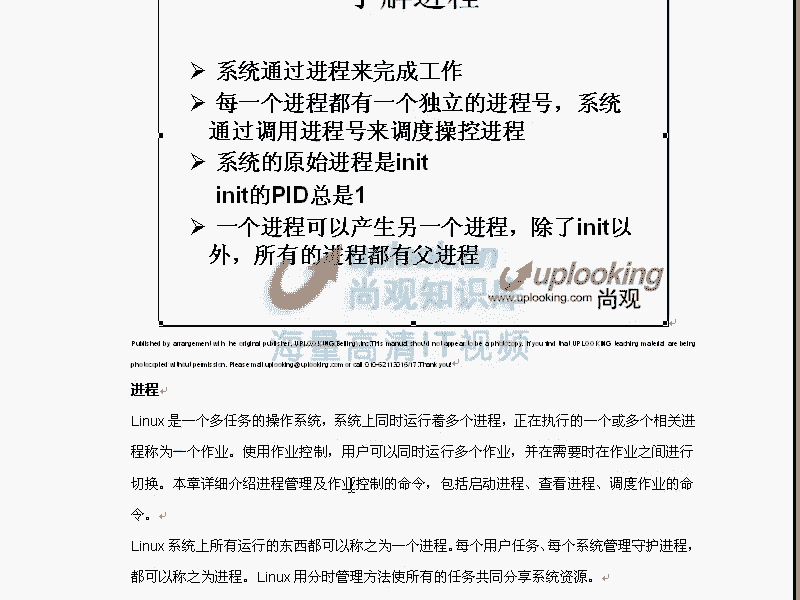
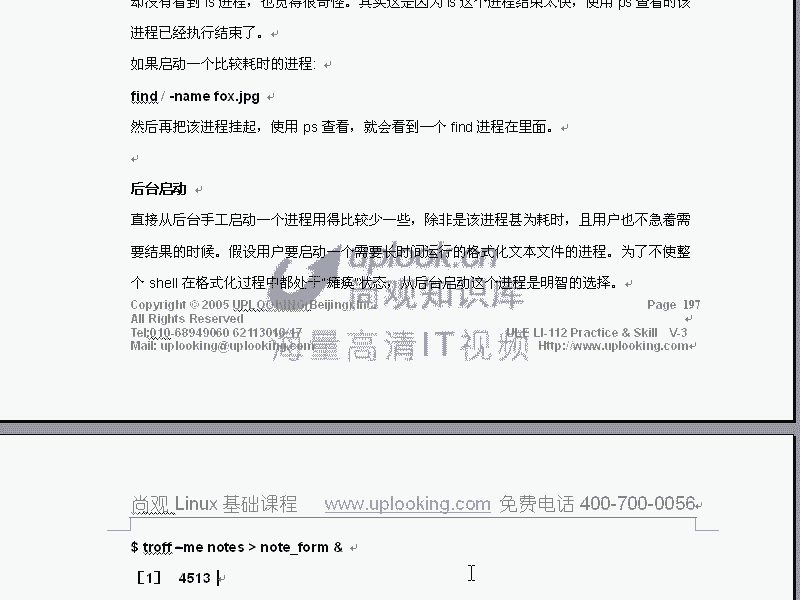
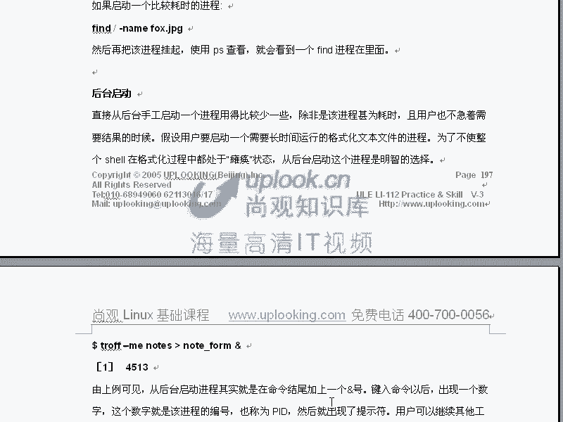

# 尚观Linux视频教程RHCE 精品课程 - P22：RH033-ULE112-12-2-进程优先级前台后台 - 爱笑的程序狗 - BV1ax411o7VD

那我们来呃小赵，我们来那个进程部分的第二啊第二部分。那么我们刚才呢上就是上一节的话呢，给大家讲的就是说我们进程的这些控制。比方说top命令啊，然后呢P命啊。

那么大致的列表呢都在这个地方你们可以看一下啊命令列表的话呢，还在原有的位置上啊，包括top的话呢，你应该掌握些什么呢？比方说问号MKNN是re niceice一个进程是吧？

大于号小于号翻译Q的话退出这个nice re nice的话，我们还没有给大家讲啊，那么在这一节当中呢，我们要给大家把这个地方讲清楚PS命令AUXF啊，每个参数是什么。那么大家可以。

忘了啊，忘了老师忘了怎么办，那你可以自己敲一下看一下，对吧？对，那么PS杠EF可以看一下什么样的Q1个PID这边是1个PIDQ-9，可以加1个PID对吧？对，然后这边的话呢。

还有就是Q2S呃QQ2-9是吧？对，SQPQ那么这是刚才我跟大家说的。还有呢像一些进程，还有一些命令号，比方说PST，这个我们原来给大家演示过，以竖形的方式来显示所有的进程啊。

你看所有的进程的副进程是不是IIIT啊，对IIT打开这样的进程，这样的进程，这样的进程这样对不对？对，那这就是我们的PST啊，好玩吧，嗯，这个确实非常清楚，是不是嗯看这些进程的关系非常清楚。

原来我们给大家演示过演示过这个PST。

OK我们现在继续呃，看一下呢我们这个进程以后的话，我们还给大家把进程的这个一些属性上介绍了一下。比方说它的状态S是吧？T啊D然后呢呃STDR然后呢Z等等这个状态，对吧？那么我们进程的话还有个属性呢。

就是它的优先级，那么我们这样top命令的话，你可以看到这个进程优先级的话是。

mice值在linux里面的话，我们说主要是靠mice值来看到的优先价。nice值是怎么样一个概念呢？就是说从啊从呃负的20。到。正了19，那么负的20的优先级是最高的。嗯，正了19。

它的优先级是最低的那么在执行进程的时候，刚才我们看一下呃。fin子是吧，从根查到一段名字为。呃，AA这样的一个文件是吧？然后呢，我这样的呃加上一个and符号，让它丢到后台去是吧？对。

这个时候呢我再看一下，那么这边是呃PS。A x。GREP呃放的。刚才那个进程划已经直接执行完了，直接执行完了。じ。up这CB是吧，就。upDB普通的一个running进程是吧？对。

然后呢现在我在执行第二个upDB，然后呢，我加上一个nice。高恩。负的十是高一先级的是吧？对，然后呢你再去回车，然后再去看。是不是又出现了一个嗯，它呢也是D状态的，看到了吗？嗯。

但是他呢这边的话是不是有个小于号是。是不是嗯这小的号码是高优先级的进程。

那么因为它Y只是负10嘛。那么我如果说再做一个十的优先级呢进行。

是吧，然后再看。刚才有个进程结束啊。这该是不是有个N呢？嗯对N话表示的是一个低线级的进程。明白了吗？明白小于号表示高优先级，N表示低优先级。嗯，那么这个时候你如果要是用top谱命你看的话。

那你可以看到这个呃up dayDB的话，你的m值是-1，看懂了吗？嗯，看了啊，这就是它的优先级级明白吗？明白，这就是mice值。如果要是你现在把这个upDB想把这个优先级的话，改的。

改的低一些是吧？N这NN是吧，N的话是58。气死。😔，74是吧，嗯，然后改成多少呢？像先级改成多少呢？改成呃19。哎，想这个进程可能结束了，刚刚进程结束了。那么你可以用N的话呢，来把它的嗯啊你可以用N。

就是在套里面摁N的话呢，把一个进程的优3级改高或者改低是吧嗯。他现在说这个进程那边辑的话已经没有了。然后NN然后呢，现在我想把你方说。ARRARTSD啊，那么这是2969是吧？嗯，直接回车。

那么进程优先级它话改成什么呢？改成。看一下啊。啊。我要改成。我把这个进程优先级改成多少呢？改成呃19。2969的话一下就不见了。嗯优先优优先级的话就太低了。错了。哎呀，我晕了，不是N呢。不是N哪晕额呃。

请大家原谅，就是刚才的话做就是刚才的话头脑不清啊，就是给大家呢把这个调优先级的时候，应该按R去调优先级，明道吧？按R去调优先级R的话，你比方说arist对是吧？我们优先级他呢改成多少？

比方说229692969是吧？对，直接回车。那我把它的优先级他改成什么？19，直接回车。那么它的优先级的话呢，nice值就变成19，下就跑到后面去。嗯，他都抢不到CPU了。

嗯那优先级time姆从本质上来讲的话，你想一下他这个优先级是什么。嗯。谁能优先更更优先抢到这个CPU，是不是就这样的东西。那么刚才的话呢晕头转向的啊，那么给大家呢说错了。Yeah。那么这个优先级的话呢。

是通过R命令top命令R命令上去改造优先级啊。R命的话是改成有先级。所以呢希望大家就说重新看一下。那么说top的话呢，我们说呃通过呃。通过K沙掉进程R的话是把分预算机改项N的话呢，它是什么调那个列数啊。

刚能我说错了，然后呢，按问号的话呢是helll啊，Q的话是退出按K的话是沙掉的进程。嗯，大于号小于号的话是翻页翻页嗯，对吧？对，这是我们的这个top。那么PS的话AUX。F是吧嗯，然后呢还有杠EF是吧。

Q1个PID是吧，PID号码，然后者Q杠9或者杠什么1个PID是吧？还有Q21个什么呢？进城了什么呢？内内是吧，然后呢，还可以Q2-9这个进城的名字是吧？对，还可以SQ，然后呢，杠SQ。

然后呢加上一个进城的拥有者，然后sh是吧？嗯，那么SQ。杠9，然后呢对吧？还可以SQ杠9，然后1个TTY1TTY1这个空白上所有的进程干掉对吧？对，那么PQ的话呢。

比它的功能的话稍微怎么样稍微就是更精确一点，跟它差不多，那杠一的话对吧？然后呢我们还给大家说了一个PS tree是吧？显以数形的方式去显示进程，嗯，那么由由这个地方的话，我们还给大家说了一个S啊B是吧？

然后呢，T就是进程的状态了，还有呢嗯R还有Z将是进程是吧？对，那么这将这些进程的状态后面的话，还可以有小于号表示高间级的进程，还可以有N表示低先级的进程对吧？对那么如果要是高分进程的话。

你是用nice命令，然后呢杠N那么找一个小于小于零的数负数的话都是高级的正数都是什么低先级的那么负数最小。是负的20是吧？对，那么加上一个比方说啊update dD这个命令，对不对？对。

那么它呢就会执行这个进程，以高线级去执行。然后呢还可以呢呃就是低一优先级的话呢，这个数值的话就是大于零的数嗯，默认是多少呢？默认是零，对默认是零。那么还可以把一个已经存在的进程的话呢。

变大或者变小reixre一个进程。比方说杠N我把这个进程的优先级的话变成10，把进PID为一的进程的优先级的话，变成什么？变成-10了，这样直接回车。哎，错了。这样的啊，这个地方的话是不能加杠N的。

那么这个地方的话就是说什么呃reice加一个优先级嗯，P这个后面是PIDDPID原本的优先级是零是吧？对，现在新的优先级是什么？是-1-1。那么你当然可以用top用按R命令的话，那把它优先级的话。

调高或者调低，对吧？对，那么这个呢就是我们的呃有关进程的优先级这个地方嗯啊，有没有问题啊？嗯，没有调这个已经存在的进程优先用reice如果要是你新打开一个进程，让它优先级高或者低的话，是用nice嗯。

对吧？对。nice把一个进程的优先级的话呢，打开的时候就设置成负的20。remice的话是把一个进程的优先级调成什么呢？-10是吧？对，那么同样我再给它调回来remice。零是吧？对，一那这样的话。

他原来的优先级O呢。原来老的优先级是负1，现在优先级是零嗯，0还是正常的优先金，对吧？对优先级不同呢，他抢CPU的时候呢，决定谁能抢到谁抢不到，明白吗？明白？这样一个情况OK呃。是这样的，呃。

这就是我们的这个刚就是我们的这个进程的这个控制。然后呢，比方说我们呃看一下，从新再捋一下，那么每个就是系统的话是通过进程来完成任务的。那么现在呢进程里面还有线程般unix下的多线程编程的话是用的很多的。

嗯多线程编程任务是很多。然后呢，我们通过进程号话来调度或者操作这些进程。比方说PID对吧？然后呢，进程原本第一个进程系统当中第一个进程的话，应该叫做IIT是我们的触化进程。

它呢是由内核启动完以后直接打开的第一个进程，一切进程的话都是由它再来启动的嗯。

这个在我们的115部分，就是我们的系统部分，就是lininux的EIE的115部分啊，上关这个课程是这个基础的lininux课程是分成三本书。第一本的话是112基础操作，第二本是系统。

第三种是基础服务和安全啊，那么第二本书里面，我们详细介绍IIT是怎么样去处始化那些进程的。它到底是怎么打开那些进程。

一个进程的话可以产生另外一个电程，这个时候的话它就有父子关系了。嗯啊IOT是一切进程了什么？父近进程啊，那我们说一个进程的，它是一个进程数，一为进程打开进程以后的话，它会形成一个数，就是一个进程数。

用PS tree可以看到，对吧？对，或者PSF参数也可以看到。

那么我们看这个进程状态的时候呢，你可以用PS命令可以看是吧？嗯，top的话也可以看嗯。

一些参数的话呢，我们给大家已经列过了，大家可以仔细看一下这些是干什么用的。

Q命令这个Q命令的这个列表，刚才我们给大家重新说了一下。

然后接下来的话呢，还有一些就是说我们的这个呃进程的这个优先级是吧？mice一个进程和rem一个进程是吧？对。

现在的话我们来看一下那个控制台的前台后台啊，那么后台进程的话呢，刚才我给大家我已经给大家呃做过几次。那么我不知道大家注意到了没有？你要看在这里面的话，我们执行这些进程的时候的话，我是怎么执行的。

加个end符号and符号加上去以后呢，表示把它丢入后台运行。当前的控制台呢，就是我现在操作，这就是我当前的这个控制台。那我现在执行个LS命令的时候，是不是它就在当前运行，是这表示进程的前台。

就是控制台的前台。那比方说我这样VI，那它肯定就是前台了。嗯，对是不是？对那这个的呃就这种程序的话呢，它呢是在前台或者后台运行，你可以加不同的符号控制它。

你比方说我这样VI加上1个air的符号，啊表示在启动的时候就把它丢到后台去就行。那你这时候呢可以输入一个jobs。你可以看到后排的话，正会正正在有一个进程在运行。刚才是运行这个命令嘛，嗯，对吧？对。

那么现在的话我再去执行一下。再去执行下，现代化的就应该有3个VI在后台运行。现在我想杀掉其中的一个。删了其中一个，你当然可以用PSAXGREP什么VAM来看一下这三个进程的PID，你可以把它Q掉，对吧？

对，但是呢你也可以用这样命令Q百分号。一、这样的话就把第一个进程干掉了。呃，不是第一个进程，这个里面的话，我要声明一下，就是任务跟进程的话是两码事。任务的话，它有可能是由多个进程组成。嗯，明白吧明白。

他可能有一堆进程。所以这时候你一定要杀掉第一个任务，这个1%的话，可能代表的不只是一个进程。嗯，明白了吗？明白，那现在我是一个进程。假如说我写的是要脚本，它就是一堆进程。嗯，所以Q1%杀掉第一个进程。

呃，第一个任务任务，第二2%，第二个任务嗯，明白吧？明白，这就是我们对这个进程的控制，那么这时候的话，你看我杀掉了两个，应该还有一个是吧？嗯，还有一个3号进程的话还在这边。

那三号任务的话还在这边你怎么样把这个进程的话，拿到前台来呢，你可以用FG。嗯。FG你可以打分号是么？3把第三号任务拿到前台来运行，就是FG那么如果要是你想把它就是让他在后台运行起来，那就BG号3嗯啊。

也就是说我们现在执行你某个任务的时候，你可以呢用一个end方号把它丢到后台去运行。如果要是呢你现在在执行某个程序啊。你方说我现在要执行update。DB是吧？嗯，然后呢，现在他在执行是吧。

我把我想把它丢到后台，并成暂停ctl加Z。他就直接被暂停了，并且丢入后台。那你这个时候呢是不是应该有一个后台任务？嗯，对，是不是？现在你想你想让他在后台运行。不要占用我钱台嗯。B近期。

这样的话他就在后台运行起来了。你看他现在是是running对，刚才是吧？我用BG号1第一号任务让它运行起来，那么它变成running了。那假说我想把它调到前台来。

并且把它运行起来GG如直接回车就是第一个任务如果FG你想到第二个或者第三个，那你可以这样的再去输入号2和号1那我说FG块1那的话，它就变到前台来你再到后台去l加是不是丢到后台并且暂停来是吧？

所以的话我们现在所谓的多任务啊，多任务，那么大家可能都听说过像什么呃我们手机你windows可能多任务是吧。那么手机的话，你看原来的话有一种手机的它叫做paPALM。怕嗯。

还有呢就是说我们的这个windows C啊，还有就是我们的这些什么dos啊这些系统，它是单任务的，还是多任务的，就是它诚时的话能执行多少个程序是吧？对，那么这个多任务的时候呢，我们在这个多任务的话。

它可能这些任务是在后台去执行的。但是呢在当我们这个控制台在控制的时候，我们也可以让这些多任务的话，在这个后台去运行，那么你可以控制它。那它肯定是多任务的了。对但然有些系统的话呢。

你可能就没有前台后台这种概念啊，它肯定是现在呢因为它只能运行一个单单独的一个任务，对不对？对，那这种程序的话也是很多的。像一些实时性非常强的这种场合，它可能就需要很多。那很多这样的系统，明白吗？明白了？

单任务的话呢。也有。然后呢，我们说多任务的时候的话，你在控制它的时候，对于控制台来说，你还可以把这个任务放到前台或者后台去运行啊，那么这个的话跟就是说这个的话呢。

就是我们的一些对前端或者后台的一些操作嗯啊。这是ds，我们可以看不到。那么FGBG的话呢，可以这样的后台前台后台让它运行起来。嗯，FG就是把它滴溜到前台来运行起来。

那么ctrl加Z是不是直接把它丢入后台并且暂停了？嗯，对，对吧？呃，这是一些具体的做法。那么还有呢就是我们刚才杀掉一个后台的一个任务，Q1是吧？对，后台的一个任务，Q1可以把这个任务杀掉。

那么这是Q去对后台任务进行操作的时候的做法。然后还有什么呢？还有我们的这个呃。还有一个还有最后一点，最后一点是这样的。当我们现在在执行某个任务的时候，当我们现在在执行某个任务的时候，那这个任务的话。

假如说呃我现在呢要离开这个电脑，嗯，我要直接退出了。但是我希望退出以后，我后台执行的这个任务仍然执行。那默认情况下是不行的。你把刚才我这个upDB。现在不是upDB吗？嗯假如说它在运行的状态。

我直接退出了以后，它是不是我的子禁程。对，那这个子禁程你是不能让他你附进程走了以后，那你的子禁程不能继续留下的，除非你加个参数。这参数就是这样no how。no help不要去什么挂起是吧？

不要去把它呃就是说删掉。那么no help执行什么呢？update。定律加个M符号，这样一回车啊，那这个时候呢。这时候他no的话就是说O那么以后你看它的输出的时候呢，到noh点out这个当文件当中去看。

那么这时候呢你XIT退出去，EXIT退出去。然后我在这个地方PSUX什么呢up发觉upB的话还仍然在运行，而它不属于任何的控制栏。嗯，看到了吗？嗯，这样的话呢。

你能让一个程序在脱离你的控制台之后仍然运行，尽管它是你这个空栏的子进程。那么我们就把它变成了一个IIT的子进程了，明白了吗？明白，所以就no。所以我们总结一下的话给大家看一下。🤧执行一个程序。

比方放的一个什么什么程序是吧？嗯，杠AME然后执行它的时候的话，加上一个什么的and符号丢到后台去就行。然后呢你也可以按cttrol加什么C。ctrorl加Z暂停，并且丢入后台嗯是吧？然后呢。

你可以用jos来查看这些数序，也可以用Q，然后呢加上有个号1或者2%这样的Q掉这些任务嗯，是吧？那么你当然可以把他们呢进行就是杀掉，或者说呢在后台暂停或者是说什么运行呃运行，那么BG然后呢。

2%表示把一个第二号任务在后台运行起来嗯，FG。🤧Okay。等23表示把第三号任务拿到前台来，并且把它运行起来，嗯，对吧？对。然后呢，如果要是你想在离开的时候。你想在离开的时候，仍然让他怎么样呢？

仍然让他把那个呃程序的仍然运行着。你同时你是离离开这个hell，那么你加上一个什么no hub，然后呢加上这个程序。最后再加上你的艾号，必须得连因嗯啊否则的话它是不行的。那么这样的话。

你即使退出这个空盘，它仍然在后台运行。这是我们对进程的一个控制。嗯啊，基本上就结束了。有没有问题小张嗯，没有没有问题嗯。小赵领悟能力确实非常强啊。

🤧。然比我打死的小芳的话要好很多。开个玩笑，就说我们很多同学的话呢。呃，就说你你要知道你现在学的这个部分的话呢，确实是比较难的。因为它颠覆了你原来种种控制的这个定式的思维。

你说windows上面你点点鼠标什么都接受了，是吧？但是在windows里面必须进行一些命令。那么这他记得什么时候是个头啊，你把前期的话呢顶过去，你后来越学越好学。你要比你周围的人的话要强很多。

这个的话一定要搞清楚，因为一个简单的东西，谁点点鼠标都会的东西，人家凭什么要花很多钱来雇佣你对而且我们现在学的东西并不是为了难为你，而是为了自动去执行一些事情，为这个做打基础的。你在一个公司里面。

比方说QQ啊就是腾讯啊像百度啊这些公司里面，他们那个服务器，如果用windows是没有办法用的。必然是要涉及到你的脑力去自己去控制一些流程啊，自自动去执行一些任务，这些都是这样的环境。

所以的话不是没有意义，你必须学完了以后话，熟悉它以后，那么你就比。然熟悉那种windows操作人要强很多。嗯，那么这个我们刚我们原来给大家呃分析过百度和google的这个招聘职位。

像什么腾讯啊等等这些职位，你看哪个是不要求这些东西的。而这些东西的话确实难顶过去以后就没事了。你现在已经走的差不多了。这段的话已经是学了很多了。明白吗？明白啊，好，我们来看啊，前端后台等等。

Sure。

OK那么没有什么太多的问题的话呢，我们这一章的话就结束了啊，这张就结束了。这些我们刚才的这些呃命令的一个总结啊，大家可以仔细看一下。

大家可以仔细看一下。那么接下来的话呢，这边是第13章，就是我们的ba share的使用详解O那么我们这节的话就先到这儿。

大家呢不要忘了自我练习啊，一定不要忘了做练习。每一章后面都有练习。如果不做练习的话呢，你就跟听天书差不多啊，这些郭德纲的相声是吧？讲完了以后的话一句不记，当时乐一乐啊，但是呢之后你学到什么东西。

你把郭德纲的相声重新复述一遍啊，不可能，因为你没有这个必要性。但是我们这个的话不是你听完就没有没有必要再去练了啊，一定要去再练。然后呢要让你自己能掌握这些技术。嗯，O。

