# Linux进程管理：P22：进程优先级与前后台控制

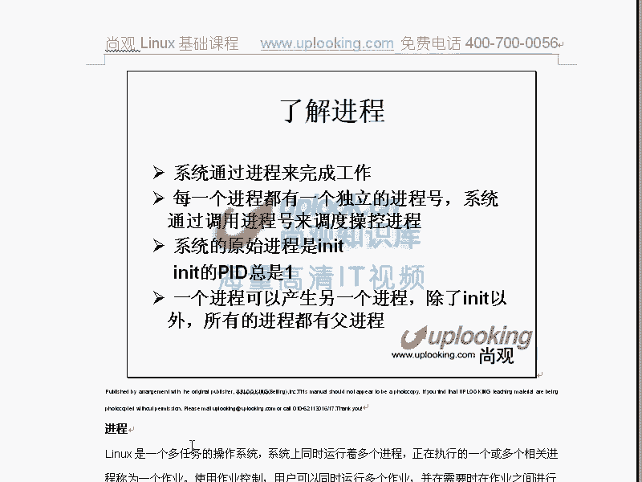

在本节课中，我们将学习Linux进程管理的核心概念，包括如何查看和调整进程的优先级，以及如何控制进程在前台和后台运行。掌握这些技能对于高效管理系统资源和执行多任务至关重要。

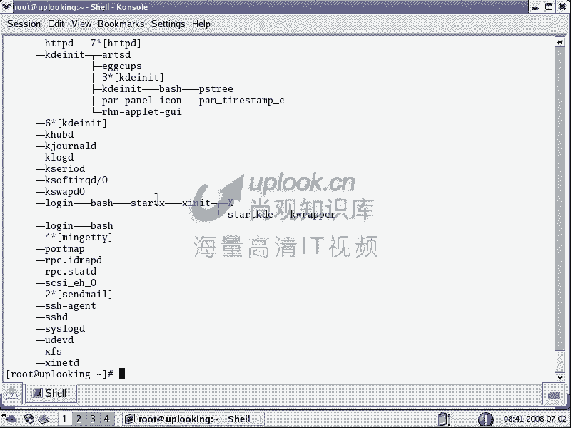

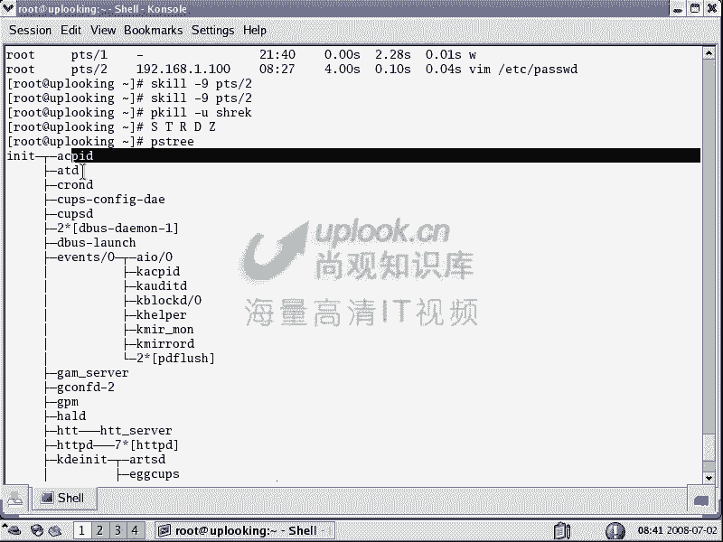

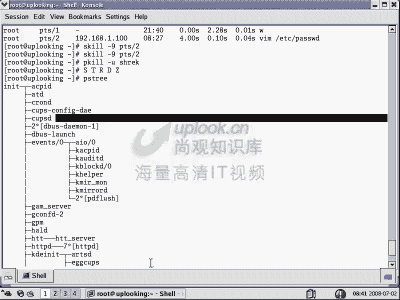

上一节我们介绍了进程的基本控制和查看命令，如`top`和`ps`。本节中我们来看看进程的优先级以及如何管理进程的前后台状态。

## 进程优先级与nice值

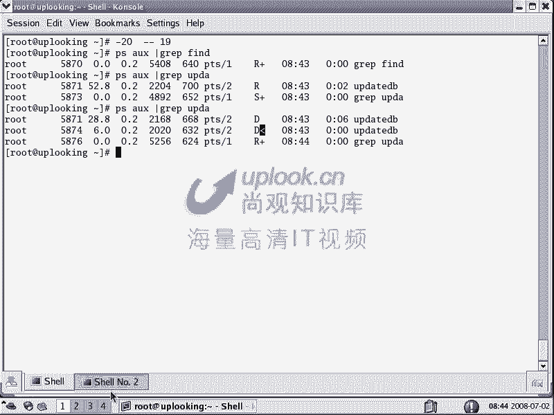

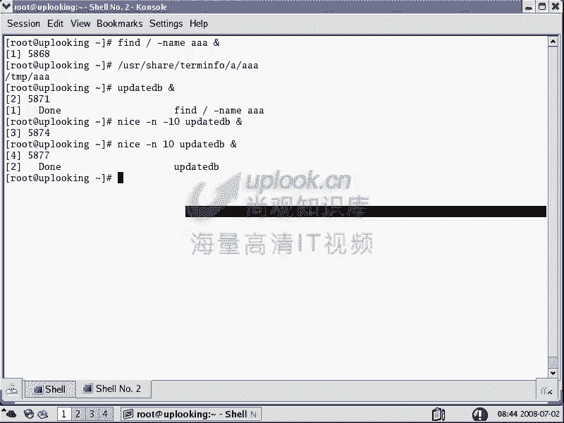

Linux系统中，进程的优先级主要由一个称为 **nice值** 的数值决定。nice值的范围是 **-20 到 19**。

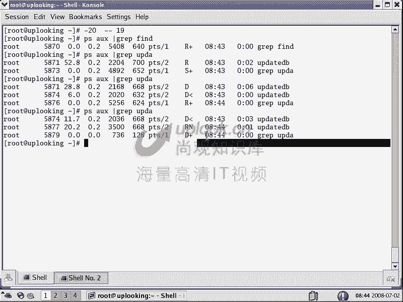

*   **-20** 表示最高优先级。
*   **19** 表示最低优先级。
*   默认的nice值是 **0**。

在`top`命令的输出中，高优先级进程旁会显示 **<** 符号，低优先级进程旁会显示 **N** 符号。

### 为新启动的进程设置优先级

使用 `nice` 命令可以在启动进程时直接指定其优先级。

**命令格式：**
```bash
nice -n <优先级数值> <命令>
```

以下是具体操作示例：
*   以高优先级（-10）启动一个进程：`nice -n -10 updatedb &`
*   以低优先级（10）启动一个进程：`nice -n 10 updatedb &`

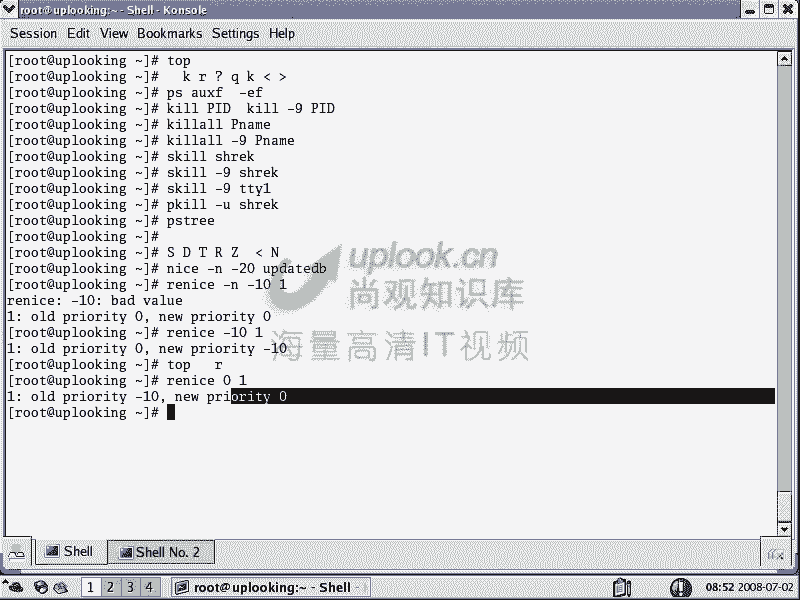

### 调整已运行进程的优先级

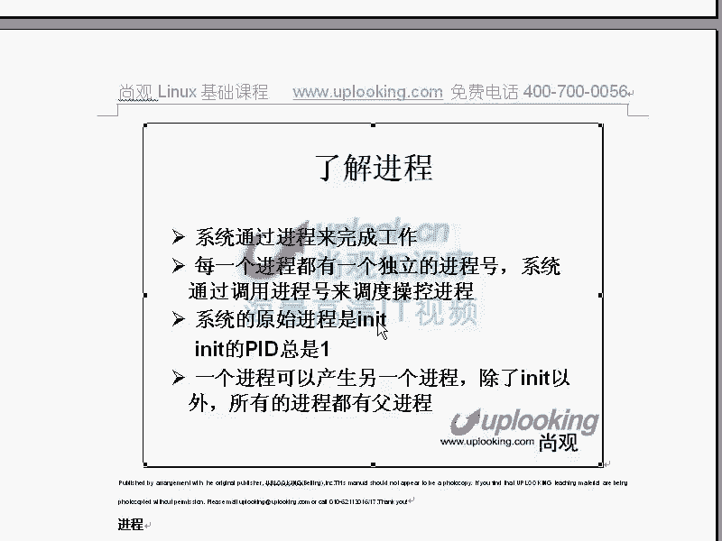

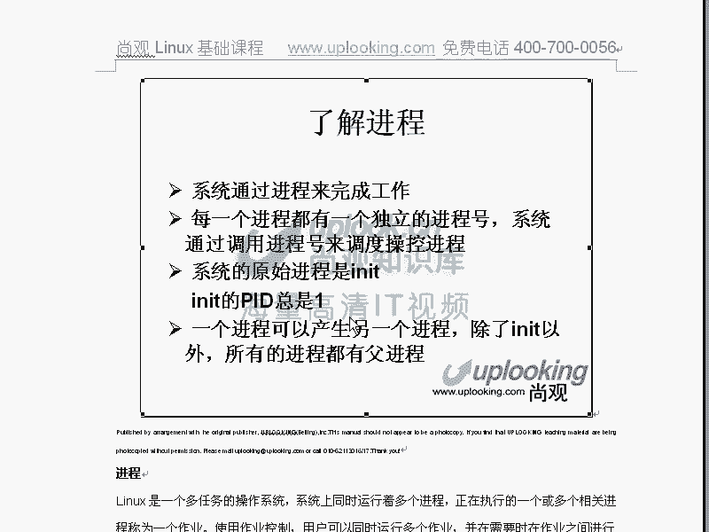

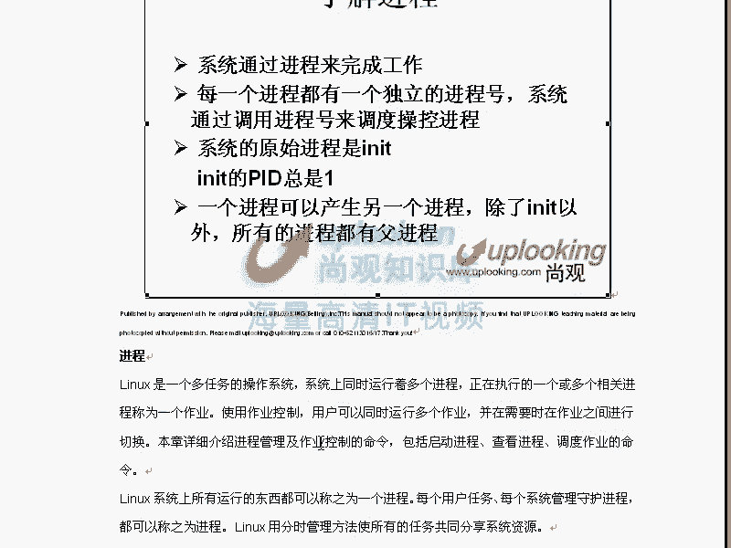

使用 `renice` 命令可以调整一个已经在运行的进程的优先级。


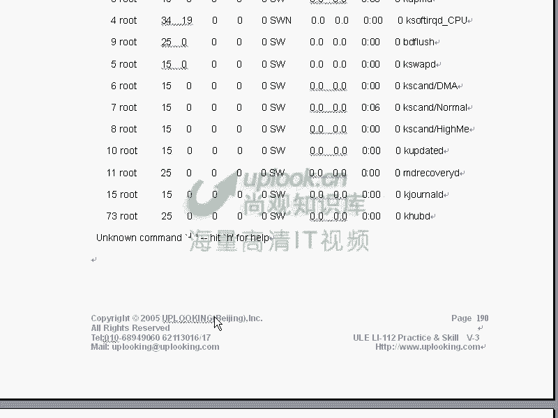

**命令格式：**
```bash
renice <新优先级数值> -p <进程PID>
```

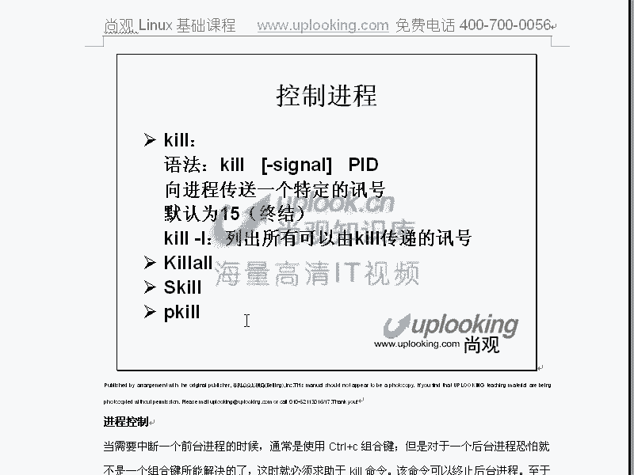


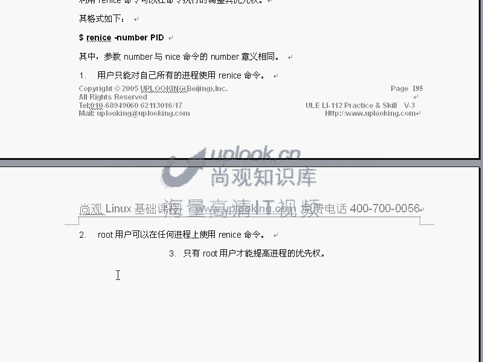

例如，将PID为1234的进程优先级调整为-5：`renice -5 -p 1234`


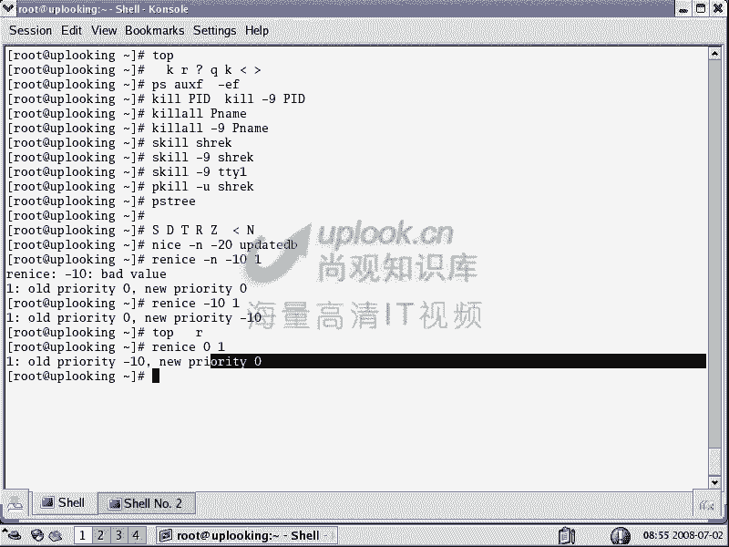

**在`top`命令中调整优先级：**
在`top`的交互界面中，按下 **R** 键，然后输入目标进程的PID和新的nice值，即可实时调整其优先级。

## 进程的前台与后台控制

在Linux终端中，进程可以在前台运行（占用当前终端），也可以在后台运行（不占用当前终端，允许你继续输入其他命令）。

以下是控制进程前后台运行的关键操作：

*   **`&` 符号**：在命令末尾添加 `&`，可以使该命令在**后台启动并运行**。例如：`vi file.txt &`
*   **Ctrl + Z**：暂停当前正在**前台运行**的进程，并将其放入后台（处于暂停状态）。
*   **`jobs` 命令**：查看当前终端会话中所有后台任务（作业）的列表及其编号。
*   **`fg` 命令**：将后台任务切换到前台运行。使用 `fg %<任务编号>` 指定具体任务，例如 `fg %1`。
*   **`bg` 命令**：让一个在后台**暂停**的任务**继续在后台运行**。使用 `bg %<任务编号>`，例如 `bg %2`。
*   **`kill` 命令**：终止后台任务。使用 `kill %<任务编号>`，例如 `kill %3`。

### 脱离终端运行进程

默认情况下，当终端关闭时，其启动的所有进程（子进程）都会终止。如果希望进程在退出终端后继续运行，需要使用 `nohup` 命令。

**命令格式：**
```bash
nohup <命令> &
```

`nohup` 会将命令的输出重定向到当前目录下的 `nohup.out` 文件中。这样，即使关闭终端，该进程也会继续运行，并转由init进程（PID 1）接管。

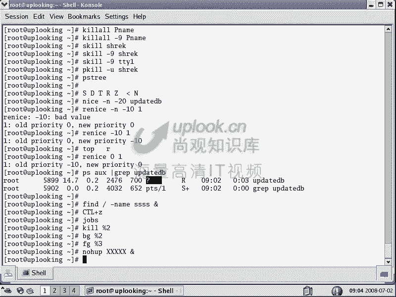

## 命令回顾与总结


本节课中我们一起学习了以下核心命令和概念：

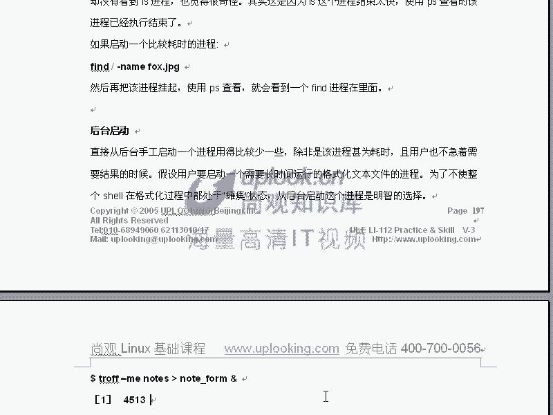

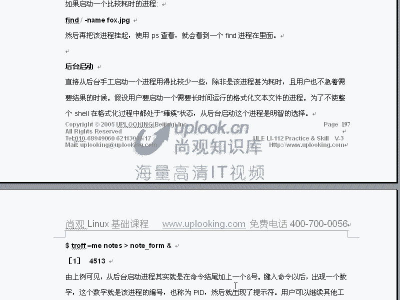

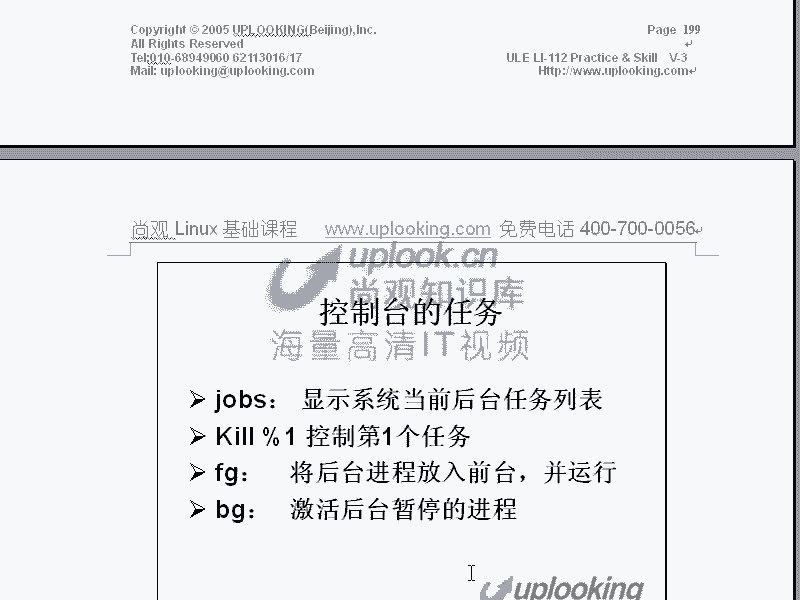


*   **进程优先级**：通过 **nice值**（-20 到 19）管理，值越小优先级越高。
*   **`nice`**：启动时设置进程优先级。
*   **`renice`**：调整已运行进程的优先级。
*   **前后台控制**：
    *   `&`：后台运行。
    *   `Ctrl+Z`：暂停并放入后台。
    *   `jobs`：查看后台任务。
    *   `fg` / `bg`：前后台切换与继续运行。
    *   `kill %n`：终止指定后台任务。
*   **`nohup`**：使进程在终端关闭后仍继续运行。


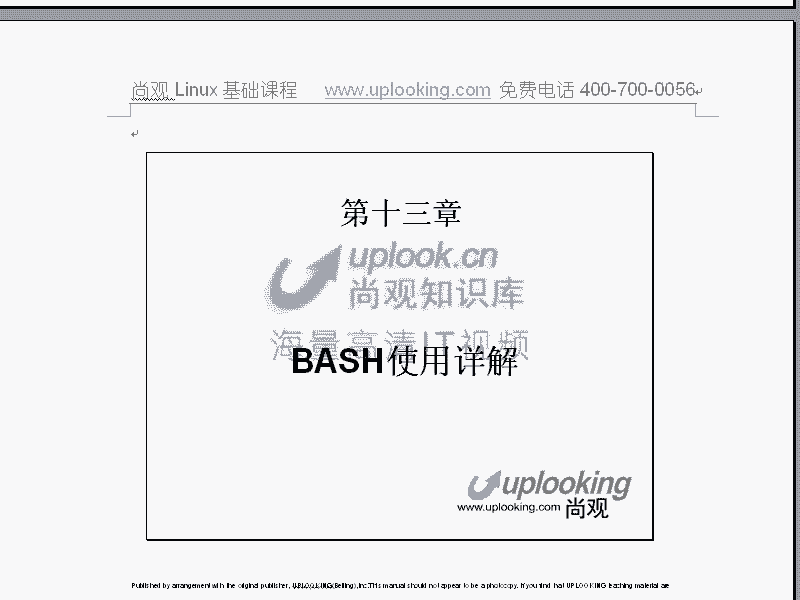

这些技能是进行系统管理、性能调优和自动化脚本编写的基础。请务必通过实践练习来巩固理解，例如尝试启动多个进程，并熟练使用`jobs`、`fg`、`bg`、`nice`等命令进行管理。下一章，我们将进入Shell脚本的详细学习。