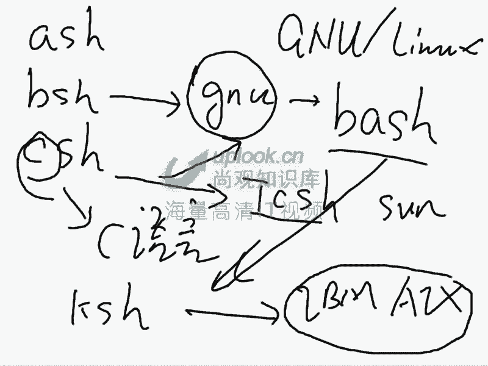
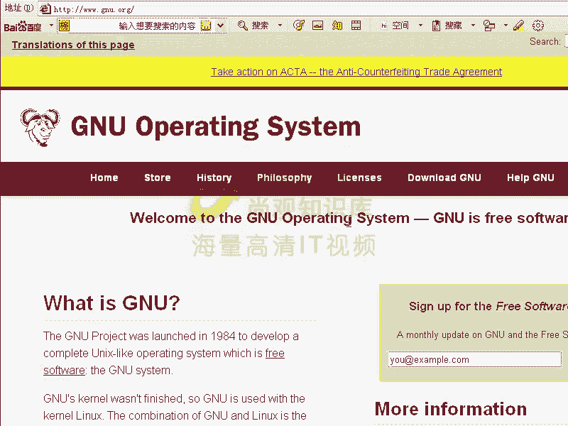
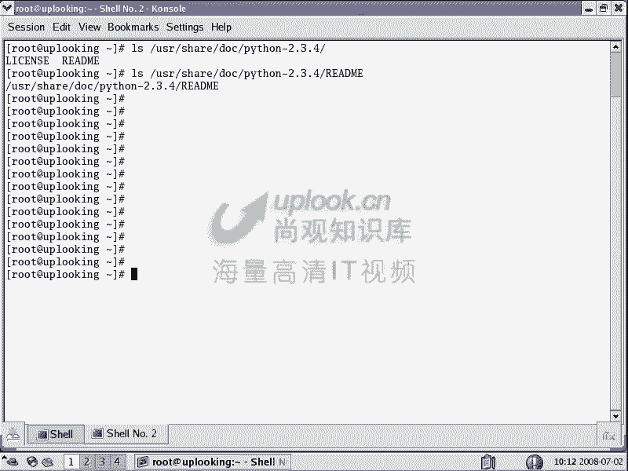
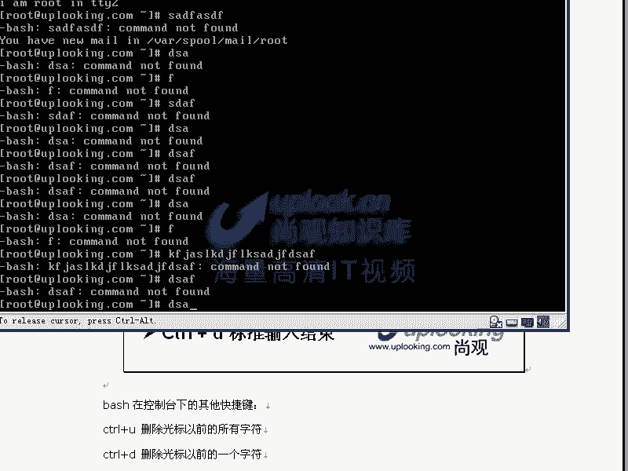
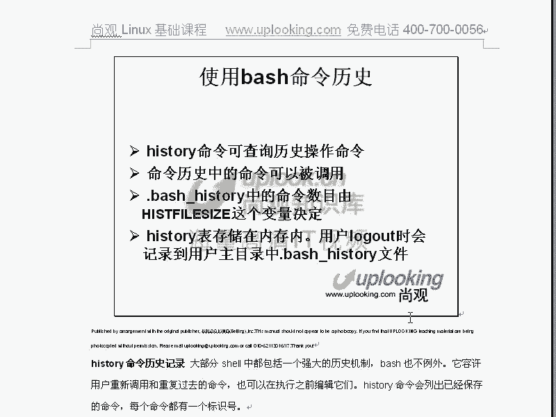

# 尚观Linux视频教程RHCE 精品课程 - P23：RH033-ULE112-13-1-bash变量快捷键 - 爱笑的程序狗 - BV1ax411o7VD

好，小赵，我们一块儿呢来讲一下第十3章ba shell的使用详解啊嗯那个。嗯，悲笑啊悲 shell它实际上呢我们自始终我现在讲第十三章了是吧？嗯其实前面11章全都在讲悲。

现在只不过是要给大家再去总结一下而已。所以这章内容的话呢，可能稍微有点多嗯，但是呢大家不用怕，因为你们前面的话已经在学点点滴滴在学输不舒出横向在学了嘛，嗯是吧？我闹学的嘛。

那这些东西呢全都是在悲 shell里面去做的那也就悲 shell前台后台嗯是吧？都是悲 shell的话给你去处理这件事情。所以的话我们现在呃说是在学reote词。

实际上是在学reote词里面的一个笑而已。而这部分内容话是非常非常重要的嗯。对吧嗯，我们今天给大家说的那个比方说啊。你看。我给大家打开一个典型的这样的一个招聘呢。典型的招聘行业。好慢呐好慢啊。

要look了啊。啊3W点百度，然后我们不有分析google了，google的话全都是一样的。就是我们原来给大家看的，他说关于百度啊，进去。那么百度里面的话，我们找加入百度。加入白菜。点加20嗯。

乔二0他在这地方。下面呢点那个关于百度里面的加入版度是吧？那这边了以后的话，呃，你看一下北京的职位是吧？啊，这些的话可能够加。平台到就要发出5万真的。啊，这是P2PP2P的话也是lininux平台的。

嗯啊这里面他没有啊。咦。技术呢技术在哪？哦，下一页。这么多车位，你要说这些运维工程师。你看了吗？什么叫熟练掌握unuxlinux？对吧嗯，对。大家啊。你们刚才学的那些基础东西，实际上就是在为这个做准备。

什么叫熟练掌握，你们把它玩转是吧？不能完转，那么这就是熟练掌握了。所以呢在这里面大家可以到百度公司去试试看啊，那么这些这些网页里面的话都会变的，你看熟悉linux系统去需要脚本编程，嗯。

都是在家我这些东西。所以说我们现在学的东西确实是非常非常有用的。那么你是完全嗯可以拿来去找工作的。所以呢大家不要认为它是很枯燥的，如果他跟工作没有关系，或者说他脱离实际，我们一点都不会去讲的嗯。

有时候必要现在这个社会的，你说有点时间的话是吧啊，追女朋友是吧？吃饭是吧？然后呢玩游戏是吧？有很多休闲的东西，我们没有必要去拿一个东西，就是说跟孔乙几释的回字有几种写法，对不吧？那他如果没有用。

我们不会讲。嗯，我们在讲的那个从第一章到第12章，实际上都是在告诉你怎么样去熟练使用lininux。但是你说熟练使用linux，使用linux，实际上你是在需要的环境里面使用。对不对？对。

那我们现在拿出来看。还记得上一次我们给大家讲怎么样就是怎么样看进程吧。嗯，啊，我如果要是可以用top是吗？嗯，我如果想用竖形的方式来显示所有的进程，嗯，该怎么办呃。竖竖形的方式PS tree吧。

PS tree对啊，直接回车。那我现在是不是在执行PS tree嗯，我在执行PS tree是不是？对我在哪执行？没事。对呀，我要执行个LS是不是也在背 shell嗯，我要执行输入出重庆下，输入重下。

是不是也在下面？所以咱们从头到尾一直在学啊，学到第十三章全都是被 shell。但是我们在这里面他要给大家总结一下，这个呢就是我们经常看网站上招聘职位当中熟练unixlinix熟练使你怎么样熟练使。

能把它玩的非常赚是吧？然后呢，ba shell这个 shell编程的话，非常熟练，这就是你已经把自己的母语。转向了。有一个inux嗯，是吧？你原来是windows啊头嗯。原来是在中文环境里面。

现在你到外企里面去，你一定要有英就是外外语的这个思维习惯是吧？写写email的话，跟中文就不一样了。等等。这就是我们要介绍的一个重点。所以的话呢不给大家把这个东西说清楚，你们现在对这个东西的话。

学的时候你就会觉得特别痛恨老师，想砍砍它，为什么这东西是人学的嘛，就会这种感觉O现在我们怎么学呢？首先的话我们学下 shell的概念，什么是 shell啊，这个我们原来讲过。

那再一个 shell的种类与用户的 shell的指定，这个我们原来也讲过，那么现在我们就种 shell shell当中的一种但但的是那么 shell的常见技巧与快捷键啊。

总结一下 shell的变量的使用常见 shell要变量的这个用法啊，然后在 shell的运算符总结一下，在使用什么呢？启动脚本来定制 shell啊，这是我们介绍的这样东西，这个实际上是非常有用。

挺好玩的，想玩。だ。那么OK我们看一下呢ba shell的简单的使用。我们看一下什么是 shell的， shellll是这样的，就是我们看到一个程序，这个程序呢叫做bsh SH结尾。嗯。

那么一去呢它就是ba shell呃，那它就是shall。那么这个 shell是怎么样的？我们原来给大家画过这个图啊，画过这个图，现在给大家重去画一下，让大家看一下。原来是怎么样呢？

原来是我们现在啊对于系统来说。对于系统来说。我们说呢有这个内核，是不是？对？内核的话呢，对外围的话呢是一层什么API就是我们的应用程序接口。嗯，如果要是一个人一个正常的人类哦，不是说像特别特别牛的啊。

一个正常的人类，他想跟内核去直接交流，这个内核就是我们的操作系统嘛。他去招交流，它是不可能去用这些API的这个API的话是很难很难，就是说你基本上记录住你现在记些命令已经够呛了，是吧？

那你说我我想看这个API我该怎么去看这些APIAPI在哪是吧？对你看一下。看到吗？哎，1个LS命令，你要做这么多事情。1个LS命令。晕吧嗯晕吧，他是正常人类去看的吗？他不可能，所以他基本上的话。

大家就断了这个念想是吧？除非是你做比较高深的事情嗯，那么听听有一个笑长说有个人用0101的机器干编出一个windows啊，这个我觉得比尔盖茨都干不了的事吧，可能干不了的太强了。所以一个正常的人类。

他不是这样去工作，他是怎么样呢？他呢是跟一个程序打交道，这个程序呢叫做shall。你可以把它认为是谁的笑的，是内核的 shell，也可以认为是它包裹着人的 shell，明白吧？嗯那么你跟他去交流。

然后呢，这个笑的话，再跟什么我们的API去交流。这样的话呢，这种程序就到什么 shell。所以说你下命令或者是做什么东西的是给 shell去下，而 shell要的话，为了响应这个人。

就是说他是为人去设计的。嗯，那么它必然是有很多方便人的功能，比方说快捷键等等，明白吧？明白，这就是 shell。那么说 shell的话有很多种，一般都是以SH结尾的。嗯，明白吧？

那么reux里面的 shell有哪哪些种呢？多了啊，多了。那么我们说原来给大家看过LS。B目录下的什么呢？新SH是不是这些 shell的话都是我们的 shell，嗯，都是SH都是 shell。

那么只不过他们的方式和方法不太一样。那么这个方式和方法的话，我们说A shell的话呢，它是一种呃B shell的就是说近亲啊，就我们看一下，但它实际上是有一些呃它实际上是有一些那个家族成员的关系的。

因为联ux词或者unix，它是典型的一种传承非常明显的这样的一些东西啊，就说它有一定的方派啊，或者说来源这样的东西。比方说你看最早的话呢，实际上是有A shell对A shellB shell，呃错了。

B shell啊B shell是 shell是这个这个人的名字。然后呢呃他是贝尔实验室开发的。还有什么呢？C shell啊，C shell的话呢，这个C是一个双关的，它跟什么C语言是有点关系的。

他的语法结构跟C语言差不多。所以呢这是他的一个呃C shell改。那么这个 shell的话呢都在不断的发展。后来还会出现什么呢？K shell shell那么B shell的话呢发展的时候的话。

GU当中有一个人的话呢，把这个BBB shell的话改写了GU的这个人的话呢，把B shell改写完以后的话，叫做bro啊干 shell这个人话又来了一个 shell。明白吧？

白所以就是 shell那么 shell话呢，它从C那C shell当中话汲取了一些东西。那么C shell它也挺好用的。那么汲取了一些东西。

然后最后的话形成了 shell shell那么 shell不还在发展叫做什么呢？T shell shell的话呢。

就是我们的公司的主主流那么K shell话呢也汲取了 shell啊 shell的一些特点。那么它也用了一些这样的一些特点。那么它现在是什么什么公司的呢？

IBMIBM的呃AX系统主流的 shell shell，它的 shell是不一样的，嗯明白吧？那么现在你说我原来的话用的是什么？我原来用的是IBM的X系是吧？我现在想那这个时候我对我来说的门槛有多高呢？

你只需要把你常用的也用起来就好了。你我现在想用什么 shell这是不是也有看到没有也有是吧？那输是H。这个嗯你用LS命令一样的，只不过提示符和习惯不一样。嗯，你刚才原言的话，你那cttrol加L呃。

ctrl加L是不是能清屏啊？现在不能了。嗯，它有其他的这个功能，明白吧？明白，那么现在PS tree这些命令的话都是在的外部命令是没有任何的区别的。外部命令是没有任何区别的，你要PS是吧？

我现在是不是在K share下面？嗯是对吧？那你说我是一个AX的管联，我现在在用winux，我想让我再sha的话呢，也是K share可不可以没有问题，他们都装了。我现在是管理员。

我现在想用AX可不可以那你可以在上面打开就完，你会感觉很习惯，就跟你用了windows95以后再去问用windows98什么的一样的，所以这个时候的话呢，这就是对所有的inix。

我们刚才是不是打开了一个呃百度公司的求职的这样的一个页面是吧？那这些页面里面实际上就是什么？就是说为什么都说inix杠linux，因为他们7年关系实在是太太强了，所以的话呢原来的话我们公司话。

就上官的话呢在网上，因为上官做主要是做那种高端，就是高端的这些培训，然后就是说这些专业的课程。那么有些公司的话不好好在那边。课程他在骂我啊，他在网上乱骂，他骂他他怎么办呢？他说。😊。

你上官的话是搞明明搞linux的，你说你搞unix的是吧？然后你说unix呃多么多么专业，linux多么多么不专业，这纯粹就是胡扯。因为的话咱们从这里面看，它根本就不明白unux和linux的亲缘关系。

在我们看来的话呢，你学到一定程度unux系统它是触类旁通的嗯。但是它跟windows差别很大，对吧？但是它跟inux的话是差别很小很小。你像PS杠EF嗯，那它是unix啊都可以用的L命种都有，对不对？

对，所以这时候这契缘关系非常非常强。所以一般我们说掌握了linux或者掌握inix，它是inix杠linux都是相通的。那么没有必要分那么清楚，你要说掌握unixok那我问你，你掌握的是哪种unix。

😊，unix你说有IBM公司的AXsHPUXer什么这些unix系种sreunix多了6种unix，你知道到底掌握内种，你掌握了一种unix就叫掌握unix嘛？

所以的话呢这个这个的话就纯粹跟一个行行外不懂的人的话，在那边呃去乱骂说unix多么多专业。unix多么都不专业。实际上呢大家抛开一个，就是我们第一章就带大家给大家讲。不在于你学什么，在于你学的怎么样。

嗯，如果linux足够深，其他unix是触类方通的。明白了吗？明白O那么我现在给大家说了，这个K share由此啊引出了一个unux和linux的这样一个契缘关系的问题。嗯呃。

那么同样我现在呢不是一个我现在的话不是一个呃AX系统管理者。我是一个ss管理者，那么我现在特别习惯使用TC share，那么这样这样回说可以嗯，你看到提示不变，对吧？我再去运行PS tree。

我再去运行PS区在这儿吧，对我是不是在TC摄下用嗯，是对不对？对，这也是另外一种需项，这没什么太大的难的，只不过操作方法略微有点不同。那么在众多的 shell要当中。

为什么ba shell是被linux所选用的？第一是因为悲 shell它是G因英原创的？嗯，对吧？对我们知道linux的话，它就是一个什么？我们说linux的话，它实际上就是一个。GNU。レナ。

对吧嗯大家可以呢在网上上去看。

Okay。进U点ORRT。大家可以在网站上去看，那么GEU的话呢，它有大量的开放源代码。linux只是其中的一个这个GEU的话呢呃就说操作系统GEU的操作系统，大量的这个软件当中。

那么它们负责shall这块ation。而且它开发出来确实比较出色。它开发出来的话确实是比较出色。那么你在这里面的话呢，我们看到大量的GEU的这种。

这种软件大量的这种金融的软件。嗯，那么实际上雷uxux斯不是唯一的这种 shell，但不是不是唯一的一种坑能，它还有自己的坑呢，就her，对吧？它有很多这种软件，那么他们因为呢都是GU的。

所以的话呢我们说那么大家用V shell的话是理所应的。而而且的话呢，我在用V shell的时候，我说的一些功能确实没有第二个 shell要能同时具有。嗯。你比方说看一下他们的细微的差别。

你比方说在这个我在这个KSH当中啊，那么我向上翻，我比方说是执行了L命令是吧？对我向上翻。没反应啊，是不是？对，所以这个时候话你说这个K shell的话，它它这个功能的话是不是就不太爽。对。

让你用的不舒服。而TC是TCSH当中，你输个LS命令，它是可以翻的。嗯，看到吗？它还可以翻是吧？那么比方说icle一个什么东西，要摁一下上，它不是全都出来了。嗯，那么这样就回去它是可以翻。

但是呢你现在想去LSETC下的ssfi想让它自动补齐摁table键，哎，它也能补呃。本来我还以为他不能补的。你比谁小的。那么它的这个功能的话就跟ba shell是非常类似的。但是呢它有很多功能的话呢。

也是没有。你比方说它现在定一个变量，必须得用set，然后呢设置一个变量值等于什么什么什么东西？那么这个时候呢它的功能话呢跟ba shell就有略微的差别。那么为什么说但是跟TC shell很相像的。

因为TC shell在产生了以后，ba shell在它之后产生的。那么在从它那边学到了很多东西，是这样一回事？嗯。我看一下啊，一个是一个是table键啊，一个是table键，一个 historyory。

一个history，一个是table键。那这些东西呢呃在我们的ba shell当中，我觉得是最全的。但是呢在TC shell跟它相近的一个 shell当中还好。

但是像K shell a shell这些 shell当中就很难了，嗯，就不不能运行了。所以这是我们呢呃要体醒大家。所以的话为什么我们选择呃ba shell你是G优的。再一个它功能确实不错嗯。啊。

那么我们做东西所有操作，比方输入输出重定像这些东西都是在ba shell下运行。那么也就是除了被 shell下有没有这些功能呢，必必有嗯啊，不一定有。所以的话呢我们要知道你的这个环境习惯了以后。

不一定就是说不一定类似所有环境都可以用的啊，用那一种 shell话就可以了。那么这个shall的这个机理的话呢，我们跟大家说过了，然后呢，大家可以仔细看一下我们的这个书籍。看看这个数据。

那么我们的背 shell的话呢，它是一种什么样的概念？那么我们一直在用，实际上呢已经不用给大家再去重新去说了，是吧？但是呢我们要给大家总结一下，呃，它叫它是reite的默认的 shell。

ba shell的常见的这个命令。这个地方的命令的话是说内部命令。也就是说我们刚才是不是运行过BG是吧？FG是不是？嗯，还有呢我们的这个呃A呃EXIT啊helpQ那么PWD想刚才当当前工作路径等等。

这些呢都是内部命令。那内部命令的话呢，你可以看一下which。C利。他说没有这个CD这个命令，是不是嗯，没有CDNGM，那我可以CD到蹲下去。哎，为什么可以运行？因为它是碑需要提供给你的。

相当于是怎么样呢？相当于这样的。那大家看一下，相当于啊。我呢现在的话呢是一个人。再控制一个程序，这个程序呢是bash，是不是？嗯这个bash里面呢给你提供CD这个。命令或者不是个功能啊。

给你提供一个什么呢？给你提供ele这个功能，嗯，给你提供等等这些程序BGFG这些程序。当你去执行一个命令的时候，首先是ba shell要给你提供，对不对？对，那么给你完成一些功能。

那么这些功能的话去打包在背 shell当中的。所以你看到一个真正的CD的命令。嗯，但是你当你去执行一个LS。这个命令的时候，这里面就没有了，是不是？嗯对，于是的话呢，他呢就去到悲需的话呢。

再到指定的路径当中，这就是他那个pass那个变量所代表的那个路径当中。比方说呢pass等于什么b目录，他呢就会到并目录下去找这个什么那么这个命令的话是什么呢？放在这个地方的是吧？

它是一个什么外部目令外部命令。哎，说的非常好，那么这里面的这些东西的话是什么呢？内部。内部命令嗯，所以他呢这些命令的话呢，你说哎。我不知道有哪些是吧，那你可以man配置一下man dash。

那你能在这里面的话呢，找到众多的这个外部命令。这是变量啊这是变量。这个变这个manage的话是非常非常多。因为ba shell的话相当于它的功能非常多了。嗯，我看找一下ADS。这是一个。方式。

你看这就是所有的命令的一个列表了。你看这些变量那这些命令的话有太多太多的命令。source source的话呢，后面可以跟一个文件名表示呢我把这个文件里面的程序啊执行一下，然后设置一下初始的环境啊。

s设置一个什么呢？别名。你还记得我们说执行VI的时候，实际上执行VIM对不对？对设个别名BG那么这个我们呢原来给大家说的是吧？在后台让它自动执行一下FG啊boundbound是绑定一个什么呢？一个键。

然后呢让它执行某一个函数啊，你去按一这个键的时候，他帮你去自动执行某一个啊函数是吧？啊，bak break循环的时候退出啊等等。内件参数buil in CD是吧？嗯，然后呢还有就是我们的一些什么计算。

然后com这些comman的这些命令。很多嗯是吧。擎天阳。啊Eles。嗯，Nbel等等。那么这就是门配置里面的这些内部命令。它有很多很多这些内部命令。我们说一般sha要编程。

我刚才看到百度是不是要求sha要编程能力啊？对，shall编程就是让ba shell自动帮你做一些事情。那还记得我们刚才那那次的话，输出重新项时cat，记不记得这个catch。

然后呢输出重新项程A点TT是吧？对，两个小于号EE是不是？对，那这个时候呢就是我把这个东西放到一个脚本里面，让ba shell要自动帮我创建这个文件嗯，这就是所谓的视要编程。明白吗？

让ba shell帮你自动去做。那么这个的话，我们到时候再会给大家再来说。那么M page置里呃就是我们这个man page置里面你可以查到所有的内部命令是吧？ba shell内部命令。

那么我们说悲 shell的另外一个非常重要的概念就是它的什么呢？它的变量，这个变量是非常重要的。变量的话呢，你可以通过一个命令话来看所有的变量。这个命令的话是呃ss可以看所有的变量。s命令嗯。

他看所有变量，你方说加上一个more是吧？嗯，那么这些变量，人家空格这些变量很多是吧？是那么其中比较重要的变量的话呢，最重要最重要的是一个pass。错了。

pass那么也就是你执行个LS命令的时候到哪些目录当中去找，是不是嗯是不是在这些目录当中去找？对，那么所以LS命令它是在pass这个路径当中呢去找。嗯，那这就是我们的什么，这就是我们的呃。

pass这个作用。嗯，那么假如说我现在看啊阿F卡啡。能执行是吧？能。那么假如说这个pass这个变量有问题了。那么现在我们呃现在的话呢，我在。SU1-1。我现在呢作为s账号啊s账号，我去运行什么RF卡费。

能执行出来吗？不能对啊，那你这时候必须得告诉他是在S并路下F卡的，为什么会这样呢？因为它的pass这个路径当中不包含着S并目录。明白吧？嗯就是你平时所执行的这个程序，它必然是在pass路径当中的。

如果要不在路径当中，你必须得直接指定这一个位置。那比方说我在TMP目录下TMP目录下有一个什么文件呢？DD目录下是吧？在这里面的话有一个B点SH这样文件记得吧？

我直接回车是不是它不行啊慢慢放那你必须得执行点杠就是当前目录，这个点不是表示当前路径当前目录下的。但。B点SH是不？对，但是我这样直接回去，这是肯定可以的了。嗯，没有问题吧，没有，还有一种办法。

现在的目录的话不是在TM线定嘛。嗯，那我这样的PHH pass这个变量是吧？等于dollarPATH dollarllarPATH的话，是不是把刚才的变量值的话取出来嗯。

dollar的话就是取出变量的值了嗯。再加上一个什么冒号，再加上1个TMP下的PDD。明白吧？明白，这样回撤完以后，你再输入什么？B点SH没有输入那个点杠啊嗯。可以就行。可以。可以执行一点问题都没有啊。

所以这个时候的话你的。可执行文件的这个搜索目录就多了一个。嗯，所以通常情况下，我们想让我们的这个变量呃，想让我们这个可执行的呃可可搜索的这个目录多一些的话。

那么典型的方式就是重新定一下pass嗯这个变量。典型就是这样做，明白吧？明白，那么你现在定义好了以后，下次申请的时候生效不生效，不生效。对啊，你这边做完以后，它是不生效的。那么如果要生请永久生效。

你可以改你自己的配置文件。嗯那么你可以VI你的主目这个波浪符号是主目，主目下的典但驶。こさほれ。RC这是一个悲 shell的初始化的目录。那么你改这个文件啊，我要把这个东西是吧，复制下来是吧？嗯。

然后呢改这个文件，那么进入音色的模模音色的模式下是吧？嗯，然后呢把那个粘列出来。明白吧明白，这样每次启动的时候就会包含那个路径。嗯明白了吗？明白好，那比方说你的oracle。

每次启动的时候执行它的启动脚本，它都不能正常工作，都找不到这个oracle的配置文件。呃，找到oracle的可执行文件。那你把那个路径放到这里边去用这种方式去放，特别好了。

嗯所以你说pas命令的话重要不重要对，所以这就是我们的呃pa啊，就是我们pass。然后呢还有呢就是一些变量了。你比方说我们再看呃这些变量的话呢，是很多啊不同的不同的这个作作用的话是很多的。

你比方说我现在取出变量值，一般用e dollar dollar这取出变量的值。那pa是刚才一个是不是嗯那么还有什么呢？还有。PS1这个变量PSE这个变量的话呢，你看它是等于这样的。

PSE变量是等于这个PSE变量的话，实际上决定着你当前的这个提示服务的状态。嗯，那现在我这样重新定一下PS1。这个变量等于什么呢？等于我们上号引起来啊，上号引起来等于。杠U表示用户啊at。H。

杠H表示你的主机名啊，然后呢杠小W就是表示你的路径，嗯，然后呢杠T时间，然后再加上一个什么呢？什么号。要回去了。系白吗嗯。杠U是不是你的用户名啊？对，杠H你的主机名是吧？嗯，然后呢。

杠W是你的完整的路径，是不是？对，然后呢，杠T是不是你的时间啊嗯。好玩吗？好玩嗯，你可以随便的改。你说哎，我现在想跟windows一样。我定义这个pasPPS1的时候，我等于什么呢？C冒号杠。好玩吧。

所以他你想怎么样去定义的话，就可以就可以怎么样去定义。然后呢，这个时候的话呃。这个时候的话呢，你在做这个呃提示符的时候，你用PSE变量的话，直接关系到你你的使使用习惯。你比方说你就使用习惯看一个时间。

或者看一个完整的路径，你都可以完全定义这个PSE变量。嗯，那么同样你要想永久的去设置的话，你是不是定义它的话，应该改你主录下呢点是不是对，然后呢，我这样呢呃重新登录一下啊，我这边的话就好了。

你要说你想resite的时候，就是说我想把这个所有变量什么的全都清掉，res一下。重新看一下。所因为我们刚才没有改那个配置文件是吧？对所以我重新登录一下的话呢，它就变成这个样子。

还是回复成就原来这个样子。O这就是我们的刚才的PAATH变量和什么呢？PSE变量啊，你说老师刚才你说的那个东西啊，就是说你是这样的PSE是吧？等于什么呢？双引号连起来是不是你想想你是杠U是吧？杠H是吧。

还有什么呢杠T是吧，时间是吧？杠W路径是不是嗯那你这个东西的话，我到哪去查。你说干气就是时间，那为什么干记不这时间是吧？我到哪去查，你可以卖。Dash。nbnb的时候呢，你在这里面去查。

你说我要查找以及杠诉没查找嗯这个地方啊。这个地方一杠查找查找，然后呢杠杠U，因为你知道你这边用的是正格表达式嗯，一杠的话不是脱E嘛？我把这一杠的这个特殊意义拖去，那么直接回车，那找的是U啊。

杠U杠U代表什么呢？用户名是吧？杠V是版本号是吧？杠W是路径是吧？杠杠W的话是当前的这样的一小截路径，嗯，对不对？对，然后呢，杠感叹号是什么嗯，杠井号是什么，杠什么do方号是干什么都有嗯，对吧？对。

OK这是PSC变量。那么变量还有很多，我们说用s，你能看到所有的变量嗯。啊，所有的变量。那么这些变量，你方说PPID就是你的上级上上一个附进程的这个ID是吧？嗯，然后呢，PID是什么？PIC变量是什么？

然后呢，什么he的版本是什么呃，user用户是什么UID是多少要打开的时候，就打开终端的时候呢，打开默认是哪个终端啊等等。在这里面还有个LS命令显示出来那些颜色通过这个变量的话去做的呃。

然后呢呃后你的瞩目是什么？然后你的命令历史的话有多大嗯啊等等。这个呢就是我们的这个呃这些变量的作用。那么我们定义变量的时候呢，大家看到刚才定义变量时候是非常简单的变量，呃，非常简单的定义方式。

我这样的PS1是吧？直接一个等号是不是就可以把变量设置了。对，那我这样直接设置完以后，它不是变成AA了嘛？嗯，对吧？对。所以设置变量就是非常简单。那么s命令能看当前所有的变量。嗯。

但是变量的话实际上是有两种类型。一种是全局变量，一另外一种是就是我们当前的这种普通变量。那么全局变量的话，你可以用ENV的话来看到所有的。全局变量。那么全局变量和s的这种呃所有变量有什么区别呢？

那么首先全局变量应该也能被s命令看到，嗯，对吧？s命令的话呢显示出来的是包含着ENV显示出来，也就是它ENV显示出来变量是s的一个缩级嗯是吧？那我现在看一下呢，他们所谓的全局变量是怎么样的。

你良心我看定1个AA变量，那这个地方非常重要啊，比较非常重要。AA我定义一个它等于什么呢？这样一称值。是吧对，那我apple它的值的时候，取出它的值的时候，刀了嗯是不是？嗯，能举出了嗯。咱们刚才看到了。

百度招聘职位就要求市要编程，嗯，是不是对，这也就是是要编程的基础。所以这个地方一定要搞清楚。那么ele dollar AAA那么能取出AA的值是吧？嗯，对，那我现在这样输一个d。

我再 echoical sorryry诶。有吗？没有，为什么？Yeah。那看我现在在运行PS是吧？我刚才是不是在这个 shell里面定义了一下AV啊然后我又执行了个ash是不是嗯也就是在这个 shell里面又执行了b是不是执行了这个sh对对吧？

对那么在这里面我在运行的PS是吧那么也就是我刚才这个变量定义的时候，是在这个变在这个里面定义的。所以呢我这个里面去用这个变量的时候就用不到的嗯对不对？对那么这个时候的话是典型的一个什么呢？

因为你刚才定义的变量是个普通变量，它不是一个全局变量所以他这个时候呢，我EXITXI是不是我就退出了这个。那么这个时候的话我们再是怎么样？我去再去ecle这个dollar。

这个AA是不是值还在啊嗯是那么现在我说我想把它变成全局变量。Export。诶系。这个时候呢它就变成了一个全集变量。这个时候我再去执行V驰啊，嗯，然后呢我再去执行什么ic是不是就有嗯。

是这个时候我们再去看。你还是这样一个情况，你还是在这个被需要下。但是刚才这个变量的话，被export出去以后，它的子效就可以用了。嗯，明白了吧？明白了。

所以呢子校当中的话是呃就是说能不能去访问复效的这个变量，是看那个副效那个变量它有没有export，嗯是不是还全的变量。明白了吗？明白了，仔细琢磨一下，大家仔细琢磨一下，刚定一个变量。

这个变量是在这个时项当中定义的。然后呢，我又打开了一个 shell，又打开这个 shellll以后呢，再去安cle这个do的值，没有。是吧对，没有，为什么没有呢？因为我没有把它export。

当我export它了以后，然后再打开个背 shell，还是这个倍 shell。那这时候我在艾cle的话，它就可以用这个变量的值了。对吧对。呃，可能很多同学说无聊不无聊一点。如果你不清楚。

你会发觉你编这个程序的时候，有时候成有时候不成嗯。我给大家看一下。有时候成有时候不成。你刚才说我现在占ESIT回到刚才那个市场下面，哎，错了啊。我在这边的话呢去定一下AA变量。对吧对，定义完了。

那么现在呢我去编一个视要脚本，VIC点SH这样的脚本。那么我在这个脚本里面说apple。你好，这是C点SH这个脚本是吧？嗯，然后呢，我ele什么呢？我ele这个呃这样的执行PS去。杠A2。嗯B样。是吧。

😔，PS区加管道啊，需2APP。Okay。这个嗯。然后呢，我再去。Ile。多少0嗯，是不是对，能保存得去。那么现在我这样的啊，CHMDA加上个XC点SH对吧？嗯。

那么我现在itle dollarAA那我刚才定义好的这个A的这个值是吧？对，直接回车。没错啊是，那么很多人都会想，老师你告诉我定义就好了，不要告诉我export，这个太无聊了。

和打开一个子 shell的机会很少，对不对？嗯，那为我为什么要给大家做这个脚本呢？我是告诉大家你一定要明白这个道理。而且呢你要知道 shell它呢打开任何一个脚本它都需要什么，都需要打开一个子示。

那么你不知不觉的话，就会让你这个 shell，那你这个变量的话无效。啊，所以说你一定要export。那现在我是不是没有export，嗯是没有export，我没有注意是吧？对呃，我觉得老师说的很无聊是吧？

我没有注意，那我这时候去执行一下。我去执行点杠C点SH是吧嗯。那我说哎this isC点C是吧？对，那么我去执行完以后哎。你看啊我还是执行PSca下C点SH。你看我也执行这个PS tree是吧？对。

我执行完了以后有什么区别没有？看这个地方还有这个地方有什么区别没？不是，这个地方只有一个被上失。对，这个地方是怎么样多。都是个冰箱嗯。哎，那你有没有打开背向啊，没有。那怎么回事？

这就是在执行任何的一个脚本的时候，如果你按默默认的方式去执行，它都是先打开一个子需要去执行。那这个时候呢你看你apple到了AA的时候，是不是空啊，对，是不是？是。

所以你这个变量的话有没有被这个子孝所用啊？没有，所以他你是不是应该export嗯，是，那如果不明白这个道理是不是就晕了。嗯，哎，我这个程序怎么不执行了是吧？怎么有问题了，所以这个export非常重要。

那么你可以这样的export啊AA那么同样再去执行一遍什么点杠C点SH是吧嗯。什么有了没有嗯。对吧对，那么export的非常重要，这就是我们所谓的环境变量，你也可以怎么样呢？

export啊AIA啊等于什么呢？等于什么什么这样称值。那么前面加个export，它就变成环境变量。明白了吧？明白了，这样的话，你再去执行这个任何的脚本的时候，它就会用这个变量。明白了吗？明白了。

OK那么这就是我们的这个变量的。环境变量和普通变量的一个区别，嗯，明白吧？嗯，那么我们在讲变量的时候呢，先给大家说的是什么呢？先给大家说的是我们说常见的像pass是吧，PAT。呃，PAATH是吧？

还有什么PSE这个变量是吧？嗯那我给大家说了定义变量非常简单，你随便一个什么变量，然后等于什么什么东西就可以设置了，对吧？不要告诉大家，大家说变量的话，能不能能没有那么方便方面，但是你还要注意呢。

有环境变量之说是吧？把它export出去啊，然后呢，为什么export，刚才我们举了一个例子。嗯，你再打开一个子 shell的时候，就是说它会用到就是它能不能用上级的这个环境变量。

如果要是普通变量用不了环境变量就能用。嗯，那你说我不打开子 shell，实际上不是那么回事。你打开一个脚本的时候，它就会自动打开子。是吧，对。所以的话呢大家认识到这个export的重要作用。

嗯啊这就是我们的这个shall。那么其他的一些什么常见规纳，我们方说export是什么home。就你的逐目是吧？等等。那这些变量的话呢是呃大家可以看到这些常见的变量。那么你们可以呢看到这里面的这些呃。

就是说这个作用是吧，有强这个变量。呃，那么我们呃就是说呃给大家讲了这么多这些悲需的这样的一个变量，实际上是蛮枯燥的。但是呢啊也不得已啊，确实是非常有必要。如果搞不清楚这个，那就最基本的这个需要编程的话。

都没有办法进行了。好，我们再看。那么微笑的这个特性的话呢，大家看那么我见我见到的就是说所有这些。都都具有的s要的话呢，只有北 shell了，所以这些好的特性的话都具有的sh要的话，只有北 shell。

你要命令补齐。那么你用t键命令补齐是吧？可以对，然后呢，很多快捷键ctrorl加L是吧？刚才我们在TC shell里面的话没有运行ctrl加Lctrl加Z的这些快捷键，那么不太多是吧？

然后通配符像新啊问号这些通配符，命令历史可以来回翻是吧？对，然后呢，别名别名输入重序项输出重道是不是这些都是北 shell。你讲了半天的话，你说我讲的是输入输入重项。

实际上它是北 shell提供给你的功。那么提示服啊作业控制就是说我们这个呃就是说我们比方说第一个任务，第二个任务，后台前台对吧？用户的配置通过脚本的话来配置。但是我们现在还没有讲到呢，嗯对吧？

这些呢都是basure特性。我们再看一下呢，重温一下微的快捷键，按table键的话，它可以自动补齐命令，呃，自自动补齐命令或者是文件名，这样话减少你输错的这个概率。那么很多人为什么它操作起来比较慢。

你比方说我记得哪个目录下有个文件来的，那个文件叫什么来着？记不太清楚是吧？你说可LS那个是在USR目录下是吧？share share怎么批来着，我用不太好道？SH什么摁一下 table键哎。

自动帮我补齐sha下面D开头的什么文件夹来着？D开头有哪些文件夹，摁一下 table键没有反应，再摁一下table键告诉我D开头的这个文件夹然后去DIDOC文件夹摁下 table键帮我补齐了是吧？

DOC目录下有个。呃Poster fix。Poer。Fix post post fix。没有装啊，喷碎都能装。那比方说我是P开头的什么东能压来着，我记不太清楚了。比方python吧PITHO。

然后按下t键哎，嗯装了两个版本是吧？嗯，两个版本，一个是2点嗯1个2点。3是吧那这样的自动包补齐，他那下面有个什么文件，我忘了这个文件下面有什么文件，忘了，我问你你也不清楚，嗯。

按点还 tableload去，所有的文件全部都出来。那看哦readread me文件。只动补起嗯，特别太好用吧嗯。减少你的出错的几率。如果我给你的路径啊，你闭着眼睛给我撬出来，那你是不是明很熟练呀？

初学者的话呢，实际上掌握这个技巧以后，你会越来越熟练啊，越来越方便。所以呢这也是我们的ba shell的特性嗯ba shell，然后双击的话可以列出所有匹配的选项是吧？

ctrl加C结束当前任务cttrol加Z当前任务暂停，并且登入后台，然后呢cttrol加S停止屏幕输出，ctl加Q啊恢复屏幕输出。你比刚方说这样的。cttrol加C呃，ctl加S停止了是吧？嗯。

我看不对啊，cttrorl加S。Yeah。同嘅下。不爱啊。啊。我他们家S什么用不了的呢？呃，大家可以再设，我看这个里面可不可以用啊，可能是快捷店是不是冲突。

横直加S。可能加S完了以后的话，这边就没有反应了。嗯，加Q，它才会反应。嗯，对吧？对，那么刚才的话呢，很可能是因为什么？刚才的话很可能是因为我们这个呃这个环境的话呢，可能屏蔽这个快捷键啊。

因为它已经是在X中的环境里，它可能首先截获这个快捷键。然后再有呢就是说呃ctrorl加什么的Q是退出是吧？嗯，ctrl加L是清屏是吧？对，c加D是表示标准输入结束，你键盘输入结束，加D。那么这个的话呢。

大家呃。

可以呢，就是自己琢磨一下，这边还有什么ctl加K，ctl加H是吧等等，这些呢都是我们移动来移动去这个光标的啊，移动来移动去光标的。但上下的话是不是也可以移动这个这个快就是就是说我可以搜索那个内置是吧？

那么有关面对历史的操作的话呢，我们还有啊，我们呢先就是说先暂停一下，因为这张的话比较长。嗯，我们分为两段去讲OK那我们这张的话呢先到这儿。嗯大家呢照着书的话呢，仔细把前面的话看一下，那仔细把前面看一下。

