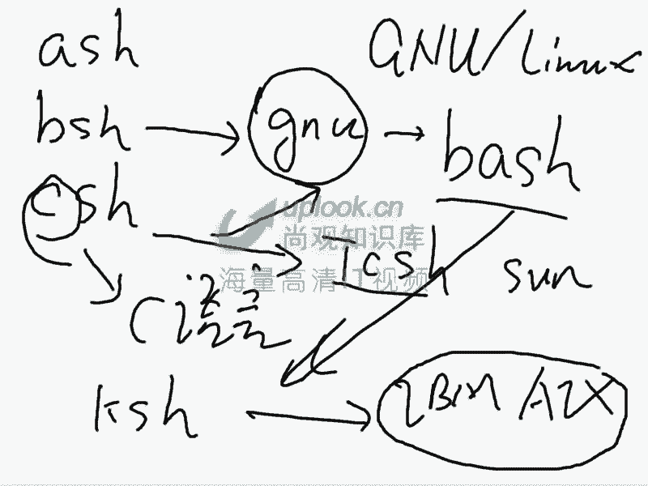
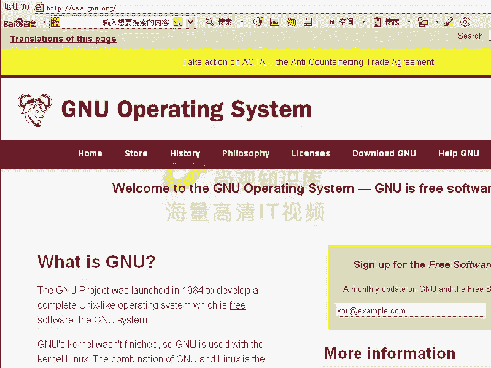
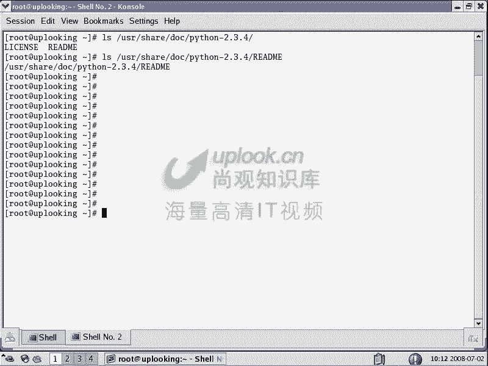
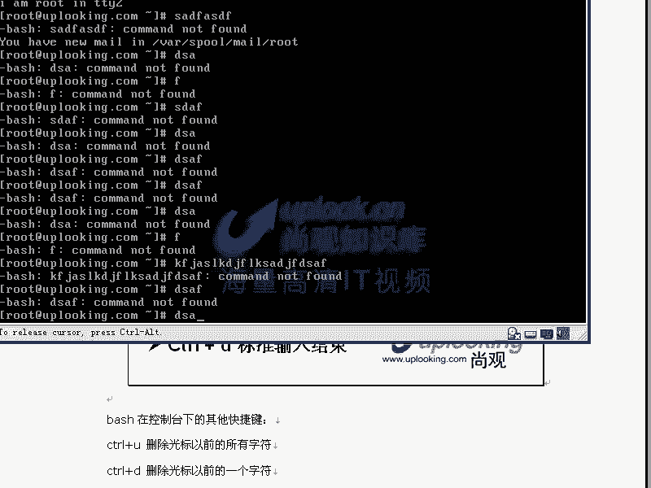

# Linux基础：13：bash shell详解与变量使用 🐚

在本节课中，我们将深入学习bash shell的核心概念，特别是变量的定义、类型和使用方法。理解这些内容是掌握Linux系统管理和Shell编程的基础。

## 什么是Shell？

Shell是用户与Linux内核之间的接口程序。用户通过Shell输入命令，Shell将这些命令解释后，通过系统调用接口（API）传递给内核执行，并将结果返回给用户。可以将Shell视为内核的“外壳”或用户的“命令解释器”。

## Shell的种类与bash的优势

Linux系统中有多种Shell，例如`bash`、`csh`、`ksh`、`tcsh`等，通常以`sh`结尾。Red Hat Enterprise Linux默认使用的是**bash**（Bourne-Again SHell）。

bash之所以被广泛采用，主要有两个原因：
1.  **GNU项目原创**：bash是GNU项目的组成部分，与Linux系统有天然的亲和性。
2.  **功能全面强大**：bash集成了众多优秀特性，如命令/文件名自动补全（Tab键）、命令历史、快捷键、强大的变量和脚本编程能力等，这些特性在其他Shell中不一定全部具备。

## bash的内部命令与外部命令

在bash中执行命令时，需要区分内部命令和外部命令：
*   **内部命令**：内建于bash程序本身的命令，例如`cd`、`bg`、`fg`、`exit`、`pwd`等。它们由bash直接执行，无需启动新进程。
*   **外部命令**：独立的可执行程序文件，通常存放在`/bin`、`/usr/bin`等目录下。当用户输入一个命令（如`ls`）时，bash会到`PATH`环境变量指定的路径中去查找并执行这个程序。



可以使用`man bash`命令查看所有bash内部命令的详细说明。



## bash变量的核心概念

变量是bash中用于存储数据的命名单元，是Shell编程的基石。

### 变量的定义与取值

定义变量非常简单，格式为：`变量名=值`。注意，等号两边不能有空格。
要使用变量的值，需要在变量名前加上美元符号`$`。

```bash
# 定义一个变量
my_name="尚观教育"
# 取出并打印变量的值
echo $my_name
```

### 环境变量与普通变量

变量根据其作用范围，分为**环境变量**和**普通变量**：
*   **普通变量**：仅在定义它的当前Shell进程中有效。
*   **环境变量**：可以被当前Shell进程及其创建的所有子Shell进程继承和使用。

使用`export`命令可以将一个普通变量提升为环境变量。

```bash
# 定义一个普通变量
AA="Hello"
# 尝试在子Shell中访问，无法获取
bash -c ‘echo $AA‘
# 将AA变为环境变量
export AA
# 再次在子Shell中访问，可以获取
bash -c ‘echo $AA‘
# 也可以在定义时直接声明为环境变量
export BB="World"
```

**为什么这很重要？** 当你执行一个Shell脚本时，系统会启动一个新的子Shell来运行它。如果脚本中需要使用父Shell中定义的变量，就必须将该变量设置为环境变量。

### 重要的系统环境变量

bash预定义了许多有用的环境变量，以下是一些最常用的：

*   **`PATH`**：定义了执行命令时系统搜索可执行文件的目录路径。当输入`ls`时，bash会依次在`PATH`列出的目录中查找`ls`程序。
    *   添加新路径：`PATH=$PATH:/your/new/path`
*   **`PS1`**：定义了命令行主提示符的格式。你可以自定义提示符显示的内容，如用户名、主机名、当前目录、时间等。
    *   例如：`PS1=‘\u@\h:\w\$ ‘` 会显示为 `user@hostname:/current/path$`
    *   具体格式符可通过 `man bash` 查询 `PROMPTING` 章节。
*   **`HOME`**：当前用户的家目录路径。
*   **`USER`**：当前登录的用户名。
*   **`SHELL`**：当前使用的Shell程序路径。

使用 `env` 或 `set` 命令可以查看所有环境变量。

## bash的实用特性与快捷键

上一节我们介绍了bash变量的核心概念，本节中我们来看看bash提供的诸多便利特性，它们能极大提升命令行操作效率。

以下是bash中一些极其实用的快捷键和特性：

*   **命令/路径补全**：按 `Tab` 键，bash会自动补全命令、文件名或目录名。按两次 `Tab` 会列出所有可能的选项。
*   **历史命令**：按 `上/下方向键` 可以翻阅之前执行过的命令。使用 `history` 命令查看完整历史列表。
*   **控制快捷键**：
    *   `Ctrl + C`：终止当前正在前台运行的命令。
    *   `Ctrl + Z`：暂停当前任务并将其放入后台。
    *   `Ctrl + D`：发送EOF（End Of File）信号，通常用于退出当前终端或结束输入。
    *   `Ctrl + L` 或输入 `clear`：清空当前终端屏幕。
    *   `Ctrl + A`：将光标移动到行首。
    *   `Ctrl + E`：将光标移动到行尾。
    *   `Ctrl + U`：删除从光标处到行首的所有字符。
    *   `Ctrl + K`：删除从光标处到行尾的所有字符。



## 总结




本节课中我们一起学习了bash shell的核心知识。我们首先理解了Shell作为用户与系统内核桥梁的角色，以及bash因其GNU血统和全面功能而被选为Linux默认Shell的原因。我们深入探讨了bash变量的使用，学会了如何定义变量、区分普通变量与环境变量，并理解了`export`命令在Shell编程中的关键作用。最后，我们熟悉了能大幅提升操作效率的bash快捷键和特性，如`Tab`补全、命令历史和各种`Ctrl`组合键。掌握这些内容是迈向Linux系统管理和自动化脚本编写的重要一步。