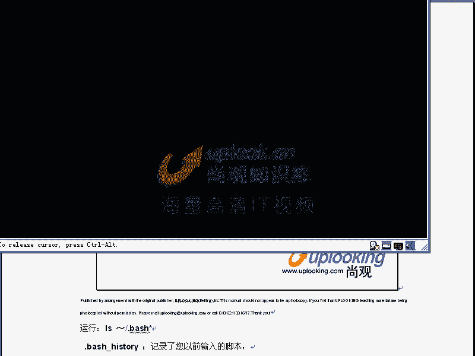

# 尚观Linux视频教程RHCE 精品课程 - P24：RH033-ULE112-13-2-bash运算符及启动脚本 - 爱笑的程序狗 - BV1ax411o7VD

开始呢悲 shell的第二个部分嗯啊悲 shell第二部。因为背 shell东西太多了啊，刚才讲的话已经痛痛不欲生了。然后呢，现在的话我们稍微缓缓劲儿啊，又开始新的。

那么bsh呢它有很多刚才我们给大家说的什么快捷键嗯变量变环境变量和什么普通变量对吧？然后我们说背 shell shell是什么，是吧？为什么要用ba，嗯，对吧？对，这些呢是我们给大家讲。

然后现在呢我们要看一下he的命令历史。这个命令历史的话，刚才我们一看到key shell它就不保存命个历史。对，这时候话你刚刚说完ho也说完一个特别长的命令，等你讲就重新调用一下不行了，就是很痛苦。嗯。

所以我们现在看到它的悲 shell它的它的这个bu的命令历史的话，是怎么样去保存，或者它的这个基理是怎么样的。我们看一下，那么你可以在这里面去运行啊history。这个命令来看所有的命令历史默认情况。

它会保留1000个命令。嗯啊那么你可以这样到上下去翻，看到吗？嗯，这样上下去翻这个命令历史的话呢，为什么会保留1000个？然后保存在哪个地方很很很简单，你看一下啊，set不是显示所有的变量吗？

对sGREP你可以输一个黑是吧？那么这样的话相关的有三个变量？一个是说我的命令保存在什么？点bash就主目录像的如头的点点b的黑直目录像。另外一个呢是说我命令历史的话呢，保存什么千0个是吧？

我这边的命令历史的话是1000个文件里面的话是用1000个。那么这个命令的话再额外再加1000个，是这样一个情况。所以的话呢我们靠这些变段的话，可以定义说你保存多少个命令，如果你想再多或者再少点都可以。

嗯，那么我们可以在就是现在我这个目录不是如头目录，我自己的主目录嘛？嗯，对那么在这里面我VI点bash。History。那，那你看到这个命令，1000命令的话，就在这里面。别慢啊，能抢CPU抢不过来。

哎，出来了是吧？对。他好像比较慢，我看什么原因呢？OK你看这样的话就是我们的这个命令是1000个命令是吧？嗯，那么当你用history这个。history这样的一个命令的话去显示的时候呢。

它会把原本他登录的时候，那个文件里面保存的1000个命令显示出来。嗯，同时的话呢，它额外再给你缓存命令。那么等到你EXIT你正常的EXIT的时候，他会把你最后的1000个命令全部都保存下去。

其他命就删掉。嗯，你要吧？这个这是他的一个机理。那么这样的一个方式呢去做这个命令的时候，就是保存这个命令的时候，那么很可能会造成你的一些泄密，你方说我每次系统启动的时候的话，我会用到原来命令。

但是黑客如果进来的话，他可能看你原来做过些什么，嗯，那你可以用什么呢？history。

杠C杠C全部都清掉。嗯，那么这样一回车，你看你再输入history，你再输入一个history。按上下翻上下的话已经没有了。嗯，那么这样输入history。只有这样一条面，对吧？对，哎，你说哎多可惜啊。

我刚才说什么秘密是吧？全都删掉了，多可惜啊。那你说我这个地方啊，大家看我现在不是有两个sll吗？对，对吧？嗯我在这个sll里面EXIT退出了。那他按理说我再新开个hell的话，我再输入一个黑群。😊。

是不是只有这样几条命呢？对，但是我这样的EXIT推出这个项。但是我这边是不是还有需要的？对我这个需要的话，在EXIT是不是它本身有个命令历识？嗯，对这个命令历史是不是又把那个1000命令补回去了？嗯。

对吧？对，这个时候你EXIT然后呢我再重新打开。看下。是吧对我重新再打开它。不知道怎么回事，这个时候应该用top命令来看一下，用PS命令来看一下嗯，你到底什么进程的话，站在这边占CPU占的这么猛。

然后你在这边的话，你可以看一下。是不是这这很多命令历史的话，它都保存下来，对，对吧？这个时候呢他的这个命令的话呢，是呃是刚才这个事要当中哈保存下来的。所以这就是我们的什么呢？就是说命令历史它的基底。

那么如果要是你想到每次系统启动的时候，都把这个命令的话呢清一点。那你可以呢在这个目录下啊，你看点bsh开头的文件还有很多。它有这样几个文件，有个history是吧？对，有个profi刚才我们改过是吧？

对，点b选到C是吧？嗯，还有个点blashlog out，就是说你退出的时候，你自动执行的这个脚本。也就是你想退出sell的时候，自动执行的命令。那么如果你不想保留命VI点bash。我 got。

在这里面的话，你添加一个什么呢？你添加一个嗯。History。C嗯，是不是？对每次你退出的时候，它都会清命令历史是吧？对，所以这个时候呢它就不会有任何的命令历史保存下来了。所以这样的话呢。

你可以非常啊就是说干净是吧？那么也不会出现那种情况。说哎这个是要退出的时候，起码那个是要退出的时候，又把它保存回去了，不会出现那种情况，所以这就是命令历史相关的东西，明白了吧？明白了？嗯。

O那么这就是我们刚才说命令try可以查询命令历史，对吧？然后命令历史当中的这个命令的话，可以按上下的话来调用。然后呢，你的这个命令历史的这个。这个命令啊保存在哪个地方。

保存在这个history file file当中。那么history file size可以指定这个文件的大小多少是吧？istory的这个表存在内存内。然后呢，如果lock out的时候。

它会记录在这个history这个文件当中，对吧？对，那么我们想去搜索命令历史的时候，我们看啊搜索命令历史的时候，摁上下是不是可以这样子去搜索是对吧？很方便吧，嗯，还可以怎么样呢？

你说这个1000多个命令。嗯，那你搜索起来摁上的话，直头都摁的摁累了，是吧？所以这时候你可以摁场值加R。考德加尔，你说我想调用上一个mount子命令。输入1个MOUNT，它就自动的去访问那个。

然后不是这个命令，我记得是什么呢？空格加个杠T是吧？对这时候是不是这个命令历史的话，最匹配你刚才输入的这个的命令就出来了。嗯，按这就是这个命令没错，你这个时候一回车它就可以执行这个命令。如果你说哎不对。

略微一点不太一样，我想保存另外一个目录下，我按一下左右键，大家看我按一下呃左键右键往右的这个箭头啊，嗯然后把它改一下这个命令是不是就出来了。对我就可以改了。对不对？嗯，那我这样的话就可以执行了。

所以这个时候它非常简单啊非常简单。你用mount的话，杠T这样的话呢就可以做呃，不是就是你想去把那个原来执行的这个命令的话，你调出来，你是不是mount杠T它就可以调出来。嗯那么你进行一些略微的修改。

你摁一下左右的这个键就可以进行修改。嗯这是cttrol加R。我们刚才比是说背，它有很多快捷键，ctrol加R没给大家说，那么就做这个用的，那么再演示一下，比如说cttrol加R，我想呢找第一个DD命令。

看到了？DD。空格哎，没有DB的，没有DB这个命令啊。加Cctl加R。那么我现在要搜索一个什么呢？ecle第一个icle开头的命令ECHOR唉这个命令出来了，你这么长一段是不是对它都可以直接调出来。

那么这时候呢我可以直接回车，对吧？对，这就是调用命令历史，调入命令历史的话，我们刚才说了两种，第一种是上下是吧？对，第二种是什么呢？ctrol加R。杭州加R是吧？对，还有一种是什么呢？

还有一种是我们的那个呃。还有种是我们的这个。就是说感叹号感叹号也是掉命历史。你现在输一个history。你看到现在我想去调用什么呢？调用这个第213号这个命令是吧？那我就这样。感叹号213。直接回车。

那么他就会降低213号的指令，对吧？嗯，如果只只有两个感叹号表示上交指令。是不是上海只能够充分执行了嗯。感叹号和感叹号加上一个数字也是调命令历史。所以三种方式可以调用命令历史。卡诺加R感叹号还有上下啊。

明白了吗？明白了。Okay。这样的话大家呢就明白了，就是刚才我们讲的这个内容，嗯，实际上用起来的话非常方便是吧？嗯，9加2感叹号，然后呢。

感呃感叹号加doller的话是我们上个命令上上个命令当中最后一个参数嗯。我看一下。啊。啊哈。Oh。对反到2。呃，I call一个感叹do感叹号2。这感叹号的话可以，你说感叹号导导的话。

就是最后一个参数了。你比方说叫嘛touch1个AA这个文件是吧？然后呢去呃ecle。ele。dollar感叹号，那就是AA呀。就是AA好吧，就是AAA。对吧对，这样的情况。那么就感叹好到了。

然后呢我们看那么这边就是刚才说的s和ENV是吧？ENV是显示环境变量，是不是对嗯。诶。晕了，这个地方错的。这应该是显示环境变量。你刚说我这样的呃ANA是吧，嗯，等于这样的串值是吧？对。

那么我这样的setGREPANA那么应该是有这样的值是吧？嗯，对ENV然后呢GREPANA。就没有这个值，因为EAV显示的环境变量啊嗯，是吧？有，那么如果要是有这样的export。哎A。

然后呢再去做一下。是不是它就显示出来了，对，对吧？嗯，所以他这个地方是不是错的，因为是显示什么？环境特别亮，对吧？这个书这个地方的话是错的。很对不起啊。

那么export可以把一个环普通变量变成环境变量是吧？对on site可以删掉你个变量。嗯，你比方说你现在变量不要了，你说这个AA这个变量我不想要了，嗯，咋整？onside onside原来的话不知道。

我可能原来只是把它设置成空值是吧？对，但是现在的话就可以直接把它m塞。那个系统为为什么那么慢？我要看一下啊，top。给大家看一下。哎，你说还行啊，80%多的话可以用是吧？应该还行啊嗯。应该还行。

我感觉总是特别慢啊，可能是刚才有个程序的话呢，在抢我的CPU，然后现在我不见了。嗯，那么现在的话大家看on site exportENV还有呢s啊，是干什么用，跟大家说过了。那么定义变量非常简单。

你就直接AA等于什0个。当在C shell里面啊在C shell里面。C shell里面的话，你必须有sAA等于一个变量值。那么这个呢在C shell里面必须得要这样设置变量。嗯。

那么你在杯 shell里面可以非常简化的什么AA等于一，这样的可以设置，嗯，明白吧？每个不同的嗯。alience和un alienance就是我们说过的那个非常节目原来已经给大家做过的。比方说al啊。

我要设置一个什么呢？OOO啊，OO等于什么呢？我要等于执行串命令，比后e呃这样的一串值是吧？嗯，这样直接会撤，那我输了OO的时候，哎，他就执行这个命令，对吧？对，那么当我去不想要这个的时候。

那么un alienience是吧？OOO。取消掉是不是？对。那么A点S的话总是在最先执行。我们知道呢它有内部命令与外部命令是不是A点最先执行啊，这样一种情况。嗯，那么我们再看。运算符。

这是我每回讲的时候啊，我恨不得以头枪毙这个。哎呀，这头疼这个地方，因为太多了。我们这样说啊，你说多到什么程度呢？但是但是大家啊不要认为这个多就就放弃或者怎么样。我们刚才说了百度的话。

他招聘的人的话都是要求你熟悉这些东西。对，那么什么叫熟悉unixmin？就是这些运算符啊或者视啊非常熟悉。嗯，那么熟悉笑要编程等等，总是用到。虽然说我是非常痛苦啊，但是我还是要讲一下。

然后因为它确实比较重要。这个运算符的话呢，大家已经接触过很多很多了。现在看一下你的键盘，你的键盘上所有那些键，然后1234567890那些键啊，90那些键那些键上面不是都有特殊字符嘛。

每一个字符都有特殊的意义。😊，每个字母都有特殊意义，我们现在开始看啊。😊，你比方说。我们给大家看一下呢，就是我们原来学过的感叹号是不是刚刚学过对，感一感叹号的话，加上一个数字表了20。

表示执行了第20号命令是吧？嗯，然后呢，感叹号感叹号是不是表示上一命上一条命令是吧？对然后呢，如果要是加上一个感叹号doer的话是表示上一个命令的最后一个参数，对吧？对。

那么doer符号是不是求出某个变量的值啊，对，然后dollerAA是吧，求出这个变量的值，那么还有呢就是说我们的呃你比方说我们用了很多星号。星号。表示什么呢？任意多个任意自符表示的是什么呢？

你看啊呃比方说这里面。Ale。是吧文件是文件名啊，任意多个任意字符的文件名，嗯，对吧？对，那么icle问号。三个问号表示有三个字母的文件，嗯，是不是？对，所以这个时候呢它表示的是什么？

任意多个任意字符的文件名啊，那么问号的话表示这个文件名的话任意的一个部分啊任意的一这个任意的一个字符，这个字符的话是文件名的一部分。对不对？对。

那么还有呢就是说中号中号ABC那么表示这个文件名的这个部分的话呢，可能是A，可能是B，可能是C。那比方说我们看这个地方啊，我们apple。不是LS了，连LS命令都不是的啊apple。

然后呢ABC开头的任何的什么文件名啊，对吧？回车，那么是不是ABC开头任何文件名啊？嗯，对对吧？嗯，这几个文件呢都都有了。所以呢这就是当前的这一个位置是A是B是C，对不对嗯。那么同样加上一个向上的肩。

当前的这个位置不是A，不是B，不是C，也就是不是以A开头，不是以B开头，不是以C开头的任何的其他的文件，对不对？嗯，对，仔细看清楚了。嗯啊看清楚。如果要是大家没有琢磨过来的话，按一下暂停。😊，那叫暂厅。

是不是？对呃，那表示呢就是中号表示说这一个位置的话，可能是A，可能是B，可能是C是吧？那我ABC的话经常用大家说12345行不行啊，这样可以对吧？那么呃，我这边我这个地方的话还可以什么呢？一个中号是吧？

一个向上的肩是吧？ABC是不是对，可以是这样，那么还可以呢是怎么样呢？还可以这样。还可以的是这样，就说这是运算符，这都是中括号的运算符是吧？对，那么还有呢大括号，这大括号非常有意思。大括号的话。

大家看一下这个地方啊，那比方说我现在到C到TM下的呃DDD这个目录下，这是我啊用的目录啊DD这个目录下。我先把这所有的文件全部都删除掉。对吧对，删除掉了以后的话。

我在这里面这样的touch我要创建文件了，创建什么文件呢？大括号ABC是吧？嗯，然后呢再去杠再大括号。123凡是做过我们的这个练习手册当中练习的哈，都应该是明白的。那么这样做完以后会创建出多少个文件呢？

有9个9个因为的话它是枚举，用逗号分割的这些东西进行枚举嗯，是吧？对啊，A配1A配2A配3，然后再B配一被派B配3是吧？三乘三得9是吧？这边创建出结构文件来，所以它大括号的话是表示枚举。对吧对，没景。

然后呢。还有我们的这个呃M符号记不记得？嗯，M符号是吧？对，表示什么？呃，把一个成序丢入后，对，丢入对吧？对，丢为后台。然后呢再看呃波浪符号表示的是。表示的是什么呢？瞩目目主目对吧？

嗯你刚才说我这样的CD到什么波浪符号s到衰ck用户的瞩目，直接就跑到sck用户的瞩目了，嗯，对不对？那么我们直接CD波浪符号跑到自己的瞩目当中去了，对不对？嗯就是波浪符号，然后呢还有呢就是说呃at。

哎呦，我靠。艾我就不知道了。艾特好像是没有什么重要的作用，那可能就是email啊就是email。那么这个井号表示注释。嗯，啊，应该是有这样的啊，输入一个井号，然后呢输入LS命令是吧？嗯，它不不不执行呢？

为什么他的需要脚本里面的话表示注释。嗯，就比方说我把LS这个命令注释掉了，后面的话只是标识一下而已。明白吧？相当于写了一个文本，让你去看一下而已，就这样一个意思。所以井号化注释。

那么再有呢就是我们的这个呃。打分号呃打分号打分号的话是表示对第几个任务，打括号一是吧？是不是第一个任务啊，后台的第一个任务是不是？然后呢，还有就是我们的这个向上的肩啊，向上的尖的话，在这个地方的话。

我们就用到了。嗯，是不是？对，还有呢就是我们的这个呃大家这个这个运算符啊，你要跟你的这个什么项目区分开，跟正轨表达式区分开。嗯，对正规表达正则表达是这个地方的话是悲笑的运算符，明白吧嗯。然后呢还有括号。

这个小括号的话比较有意思。你看么这个小括号的话可以做一个什么呢？做个函数出来，它做函数的，你后我定一个AIA是吧？然后一个小括号知道吧？嗯，那么直接回撤，他们就等待你执行了。

那么现在呢相当于我要声明一个名叫AAA的函数。这个函数包含着几条命令呢，我先一个大括号开始。第一个命令是什么呢？先ecle说什么呃。This is。AAA是吧，嗯，然后呢再去帮我LSmin一下。

再去帮我他呃CD到CD到TMP录像是吧？嗯然后呢再去帮我touch一下什么呃。TMP目录下的DBD目录下的A文件知吧？然后呢再怎么样嗯在一个大块结束是吧？那我这样定义好了以后呢。

并不代表AA这个这个函数的话就执行了。只是说我已经声明好这样的一个函数了。那我执行AAA的时候。嗯，看到了？嗯，他就帮我执行那几个命令了。所以这个括号的话表示我要声明一个声明一个这样的一个函数。嗯啊。

那么是做这个用。好，接下来的话我们再看呃。接下来我们再看这个。那么还有呢就是我们的这个反引号呃双引号啊，这几个引号这几个引号的话，我们看那么有。有双引号啊，单引号双引号嗯，还有什么呢？还有反引号。

反引号就是波浪符号那一个键跟波浪符号一个键。那么这个时候呢我们看一下这几个引号的区别。那么我们在这里面touch一个文件啊，比方说双引号，那么A。控制了B。

那我现在先CD把DDD目录下去RM杠RFC是吧？嗯，然后把所有的文件文件夹全部删掉，然后呢，在这里面touch一个文件，双引号是吧？嗯，A空格B。是吧对，这时候LS杠L看一下。这是不是一个文件是是吧？

嗯，那么如果要是我这样的touchA空格B这样会怎么样？对嗯1个A1个B文件AB啊，对，之前那个对之前的话这个文件的话是上一面你创建的。嗯，所以的话呢双引号实际上把空格当成普通字符。

那如果要是你没有加商引号的话，这个空格代表什么？嗯。至早是参数结束了对，是不是嗯，是不是参数结束了？所以现在的话你要如果要删除RM啊，A空格，B删除一个文件还剩出两个文件，两个两个文件，对吧？对。

那么如果要是我这样加上一个双引号的话，删除几个文件，一个一个文件，对不对？对那么所以的话这个双引号，实际上就是把所有的字符啊，都是按照他们的本意去做，但是呢像有刀了符号啊。

或者说什么我们刚才说的这些符号。比如说这个双引号里面有感叹号啊这些东西的时候，它并不会去什么屏蔽掉它的特殊作用，它只屏蔽空格的特殊作用，嗯，空格不是表示参数结束嘛，嗯我把你这个空格的特殊作用去掉。

你把你当成一个普通的阿斯克玛。那这样的话你就不表示参数结束了，是吧？那我这样双引号当中的话，是不是就表示A空格B就是三个字符，是不是？对表示呢我要创建这样三个字符的一个文件。

或者删除这三个字符的一个文件名，或是一个文件名那如果要是这个空格的特殊意义没有去掉的话，它就表示什么？A是一个参数，空格表示参数结束了，B又是另外一个参数明白吧？明白。

所以三双引号的最根本的作用就是什么呢？就是说我们并没有啊屏蔽掉其他的任何的特殊字符的意义，只屏蔽掉空格的特殊字符的意义，明白吗？明白？所以这样的话，我这样的啊，如果touch一个文件。

那或者apple applele双引号双引号A空格B是吧？然后加上个er符号user。那是不是就把你的这个doer符号的特殊意义还是存在的，是不是？那么他是不是把root就显示出来了，嗯，对不对？对。

那这样的话呢，它的特殊意义还是存在。那么所以的话现在我如果把双引号变成单引号的话，会怎么样呢？也就doer符号的特殊意义还在不在？不在，那就是doer符号它变成普通字符的是吧？

所以双引号和单引号的区别在于双引号只会屏蔽空格的特殊意义，而单引号会把所有的特殊符号的意义全部都去掉嗯，都当成普通的普通s嘛，还记不记得我们讲正格表达式的时候。

我们说GREP一定要用单引号把你的正格表达式引起来是吧？所以你在这里面的话，这个点呀，星的话就不会什么就不会受到悲的影响影响了，对吧？所以为什么要用单号引响就清楚了吧？嗯清楚，这是双引号和单引号的区别。

然后呢，反引号是什么呢？反引号的话是反引号里面应该是一个命令可执行的命令，这个命令的话呢预先被执行。那你要说which。L那这时候显示出来是什么呢？显示出来这么一长串值，对不对？嗯。

对那么which L是不是预先被显示啊嗯预先被执行对执行完了以后呢，又被ele命令又去执行点是吧？对，但是一个命令行当中你是不能输入两个命令的。

然which那这时候呢他把which和LS当成是一个什么普通字符去看的。它没有执行两个命令，对不对？对，所以单引号引起来的东西的话呢，会被预先当成命令去执行执行的结果。再放在这个位置上。明白了吗？

明白了。所以看你比方说原来我举的一个例子，touch log是吧？嗯然后你这边用反引号faceatedate这个命令date这个命令它显示时日期是吧？date加上百分号M。然后呢。

再加上一个什么百分号D，那么这样直接回撤完以后，我们看到这里面就会串了一个log0。有つから。创建一个log0702这样的一个文件，是不是？对，就是创建这样的一个文件。那这个文件它为什么会出现呢？

我这边创建一个log嘛，是吧？对，那么这边是不是反引号，就是那个波浪符号那个一个键啊，跟波浪符号一个键就ESA下的那个反引号。嗯，那么这时候呢daer加分号M号D，它显示的结果就是什么？

月份加上一个日期。嗯，月份加日起定。对，那如果要是百号Y呢，就是年年对吧？就是年幼日了，是不是？对，那么如果要是我再创建一个。这样的一个文件是吧？那我这边加上一个什么F号Y啊。

那么这样的时候是不是就嗯它就创建了一个什么？080702嗯，对吧？对，那么这就是我们的一个文件啊，这就是我们这样的一个文件。那么OK这个搞清楚了，搞清楚了以后的话呢，我们再反过头来再看。

那么跟大家说的单引号反引呃双引号还有反引号这三个引号的作用就搞清楚了吧。单引号哈，所有的特殊字符都没有特殊意义。双引号的话只有空格没有特殊意义是吧？嗯，单反引号的话是这里面东西先执行一下啊。

那么还有呢是什么呢？像我们的这个呃斜杠脱译幅。嗯，脱衣服，你比方说你说空格是不是有特殊意义啊？对。就现在是不是有个A空格B啊？对，那我这样的RMA空格B是不是就删除了两个文件？对。是吧删除两个文件吧。

对，那我如果RMA空格B，然后再回车，它就没有这个文件了嘛。对，然后呢，A空格之前加上一杠是不把空格的特殊意义脱去了。对，也就是说把它当成普通ask玛直接回车，是不是删除一个文件，对然删除它嗯，对吧？

那我要创建一个touch一个文件。doller开头的文件可不背下嗯。就是趁那个道路开头嗯，对，是不是？这就是这样啊，非常简单，那么杠就是脱逸输入，对不对？嗯，那么。这个分号分号表示呢命令结束。

那么我刚才不是说一行当中是吧，ele是吧，ele which LS是不是它就一行当中只能有一个命令啊，但是你加上一个什么，加上一个分号以后，它就可以执行两个命令，表示第一个命令你就执行完毕了。

那么直接回车，看到吗嗯？ecle一个空空出来是吧，在执行什么位置L。明白了吧？明白，这就是我们的另外一个运算啊，另外一个运算。总之的话。我可以这样的跟大家说，一般来讲一般来讲啊，还有个等号是什么？

就是负值是吧？嗯，一般来讲，你在这个键盘上看到的所有的特殊字符基本上都有特殊意。好玩吧，嗯嗯基本上都有特殊意义。那么所以呢这个时候的话大家就知道呃，这个悲 shell的话呢确实是稍微复杂的。

你学悲 shell，实际上在学C语言编程或者学什么的东西。只不过他C语言的话，它不能交互的。那么你在这边的话是有个交互，同时能让他去执行某种任务那你这时候必须得学它的表达式，嗯，表达式的话。

就是这些东西，它没有C语言那么麻烦，但是呢它也有那些一个呃就是说一个呃就是一个相当于内目解释器的所有的这种功能，你也需要学它的语法，学它的运算符，明白吧？跟C语言是很相像。

但是大家苦过了以后非常非常开心的啊那个。😊，这个啊实际上我们刚才已经列出了很多运算符是吧？对，但是啊还没完还早啊还早呢，为什么呢？因为他特都下啊，在你特别恶心的地方，还有一点，就是你这个预算符啊。

我们是同意啊，运算符嘛，我要把它一定要搞清楚是吧？学清楚了，然后老师你列出来这些东西，我每一个的话都念过了，都不知道它是什么意义是吧？嗯，那么。😊，可惜的是什么呢？

就是我们这个东西啊它有点特别头疼的地方是什么呢？这个运算符啊，你加空格不加空格还是不同的意义，一个和双个还是不同的意义，这边很痛苦。嗯，你看一下啊。你刚方说中括号是什么意义呢？

是表示这个里面是表示这个比方说1到9是吧？表示呢这一个位置是一是2是3是4或者说是9的时候，它表示文件0是吧？对，但是呢如果你把它加上一个空格，它的意义就不同了。表示出 false呃 false的判断。

明看吗？除了 false判断话，你比方说这样，我现在呢呃去判断一下说这个文件啊，就是ETC下的呃pass的这个文件存在不存在。那么这样一回车完以后，你看没有显示是吧？嗯。

那么你这样的ele dollar问号表示上面一个命令，它是否。成功执行它返回的值是什么呢？0零表示上面一个命令是to的toe啊，那么所以呢你说啊不会吧，那么我这边加D这个文件肯定是不存在的，是不吧？对。

那么我再这样的再去ecle dollar问好。一。对不对？对，所以的话当了问号的话呢，它也是两个字符结合在一起，结果它的意义就已经不一样了。大家呢只能去此记它。

记因为你想这个东西也比C语言编程的话实际上简单很多了。你像我们讲了这么一两个小时就能把它讲清楚，你苦过都得一两个小时，你把它死记住，听两遍嗯，听三遍嗯好，记住它，那你基本上就可以了嗯啊，搞清楚了嗯。

OK那么现在这个地方呃弄清楚了以后，我们我们看啊继续往下。那么也就是中括号加上两个空格以后，它的意义就完全不一样了。看到了吗？嗯这个中括号这个地方加个空格吧，对，不再是紧接着了，是不是？

对所以呢这个时候的话，我们杠F表示这个文件是否是一个文件。那它这个文件根本不存在，那肯定不是文件了，它返回的值就是fse是不是对，那么这个时候的话，我再加上一个什么呢？加两个and的符号。

两个and符号，一个按符号表示前面命用在后台去执行，两个按的符号表示什么呢？前面的结果为to的时候执行后面的命令，前面结果为fse的时候，不要去执行的。那么这个时候的话我说什么呢。ok。

那么这样的一回车，你说会执行OK吗？不会两个按的符号表示前面的结果为te的时候执行为fose的时候不执行不执行是吧？但它会执行会显示okK了吗？不会。果然不会对吧？但是说我如果要是这样的。😊。

有这个文件是吧？嗯，对，是不是就OK啊，是，所以这是一个连用的用法。这个时候呢你又把这个doller符号的特殊意义颠覆了嗯，是吧？原来我们单独一个doller用的时候，它表示什么？

前面命令给我执行到后台去嗯，丢到后台运行。现在把两个M加起来，就完全不是这回事嗯，是不是？对，然后呢，接下来的话我们还有什么呢？还有这样的，那么。这然如果要是加两个感叹号，刚好跟那个是相反。

两个竖杠两个竖杠，一个竖杠是不是表示呃就是管道啊嗯是吧？两个竖杠呢表示前面的结果如果为Q的时候反而不执行，没fo的时候反而执行。嗯啊，那这样一回车，是不是它就OK了。嗯，对，是不是？是。

那么这个时候的话这种操作非常多见。死是你别拿着我了，这啥破东西，这种操作太常见了。你看这多简洁呀，嗯，怎么简洁呢？你比方说你现在做一个系统，这个系统呢，它自动判断arle有没有装嗯，是吧？那我可以这样。

oracle有没有装呢？我可以杠D，你说登录一下有没有oracle这个目录。是吧有这个目录吗？这个目录如果存在的话，那么就怎么样，那么就ele说说什么hello是吧？welcome那就是啊ele什么呢？

bein。看一尼送是吧，嗯，那一回车没有是吧，没有它就不存在。嗯，没有的话，他只么出错。嗯，就是如果这个文件夹不存在的话，那么是不是我就不会去执行后面这个命令？对，那它就不会出错是吧？对。

那如果要是存在的话，它就会执行后面这个命令。对，那么在系统当中到处去用这个用这样操作。你比方说我这样的系统的启动脚本VIETC下的什么呃ETC下的RC点D当中的RC点s。我们打开它。

你看到这边到处是用什么中号做判断，嗯，看到吧？是if啊，我们说不用if，你看这个地方说这个目录存在不存在呢？看是不是嗯，对，这是要脚本吧。对这个目录存在不存在杠D是表示这是不是一个目录，嗯。

这是一个目录的话，那么我就m他一下。是不是？对，那么如果这个目录不存在，这个目录如果不存在，就是返回值为fse，我还执行不执行后面这个命令吗？不执行，不执行后面这个命令，它怎么会出错呢？嗯？

你不可能想看到系统启动的时候，啪噼里啪啦一大堆错了。所以在需要脚本编程的时候，到处都是这样的东西。嗯，明白吧？到处都是这样的东西。所以呢这就是我们刚才给大家介绍的这样的一个标准的用法。

我们给大家详细的解释了一下，这就是要编程嗯，需要编程的话是由短的这样的一些小的表达式组成的。那么这样的话非常有效的一个表达式，嗯，明白吧？明白，那么我们说哎杠F啊，刚才复持表示它是一个文件。那杠D的话。

比如说它是一个目录是吧？嗯那么杠L呢。😊，是不是一个链接啊，杠。诶。杠B它是不是一个block类型的设备文件，杠C是不是一个自符设备文件是吧？嗯，杠X是不是可以执行，杠R是不是可以读，明白吧？

杠W是否可以写，是不是对你说老师你用这边又问我这么乱七八糟东西，我怎么去记得住啊，太简单了，R不是读吗？W不是写X不是执行吗？是不是你说那我在哪查呢？没。Fash。看道吧？嗯，manbsh就可以查了。

然后呢，接下来的话我们再看。嗯，就是这样的。那么这个表达式的话，刚才我们说呃，还有呢就是大于号小于号，是不是？对，是不是输入输出重新项？对，对吧？还有呢我们的那个。诶。

还有呢我们的这个像刚才给大家说到的这个呃比方说doller是吧，doller dollar是表示你你当前的这个PID就是进程的ID它会自动显示出来啊等等，这样的东西的话是很多的。

嗯如果大家呢现在就是说呃这个东西的话呢，搞清楚以后啊，就是说加空格不加空格了，就重复的，它跟单个的是不一样的作用是吧？嗯，这个的话我们都把它列出来。还有一个呢是这样的，等号大家都知道等号是负值的是吧？

但是呢如果要是这样的话去做，在中号里面加个等号，而且是空格的，等号里面的空格，你但时我现在定义A呀A这个变量啊，如果这个变量。等于你要这吗user吧user这个变量，如果等于如此的话，那么我就怎么样。

and是吧嗯，icle说hello rich是吧？嗯，那一回车它hello rich是不是？但是你看这边是是不是加了空格啊，嗯，是表示表示你是否相等等式两边是否相等嗯，做一个判断。明白了吗？明白了。啊。

okK那么呃这个地方的话呢，我们又跟大家说过了是吧？嗯，加空格不加空格又是不一样。嗯，明白了吧？明白。OK这样的话就是我们的呃运算表达式的这样的一个汇总。嗯哎头大头大，但是还好你听完了，然后呢。

你把它仔细再看一遍。那实际上呢没那么多麻烦。如果你理解了以后，你对这个笑的使用可以说是啊什么就是说有点像那个呃你鼠标啊会了以后，你在操作电脑的时候是不是很方便啊，对，那这边呢表达式去使用的时候。

你一开始用鼠标的时候可能也是比较嗯那个糙的是吧？但是你后来的话越来越熟练，那你就是得意的一个工具啊。所以它这个东西学完以后，你看就这么点东西，学完了以后，虽然说每一个话都要记一下。

但是你越用的是越熟练的嗯。嗯，搞清楚了嗯搞清楚以后，我们来继续看一下呃，我们的教材啊，看一下上面这些比方说单引号双引号是吧？嗯是双引号的作用，单引号的作用是不是？然后呢，还有我们的这个反引号的作用是吧？

对，然后呢，算术表达式就是你想求一个值2加3等于多少的时候，那么你可以什么呢？doller中括号doller中括号跟中括号就不一样了。嗯，doer中括号表示里面的话是个算术表达式，你来计算一下它嗯啊。

还有呢就是我们的这个呃这样的一个斜杠拖一符是吧？分号是表示命结束是吧？呃，进来的话呢，这个输出重项是吧，大于号输出重定项。对，然后呢还有就是我们这个括号表示呢这个括号表示在子 shell当中执行是吧？

对，在表示我新打开一个子需去执行。那如果要在这个中号前面加上一个什么呢？AA就表示一个函数了，明白吧？嗯比说函数这个这个小的括号的话呢，意义又不同了。嗯。

就表示在子 shell当中去执行整个的这一串东西，就新打开一个子 shell执行里面的这个will的这个循环啊，执行这个循环，明白吧？明白，那么两个and两个感叹号这是什么意义啊，就就跟大家说清楚了。

嗯，那OK。这就是我们刚才的笑的表达式，如果还不清楚啊，大家呢仔细对照一下这个地方，然后呢把它搞清楚了，把它搞清楚了。那么可以暂停一下啊，你可以仔细去琢磨一下这个是干什么，那个干什么的。

然后把常见的用法，把常见的用法，然后呢仔细琢磨一下常见的用法，自以琢磨一下嗯是吧？你看干F是么什么东西啊，OK那么就是这样。嗯，可以稍微暂停一下。我我们呢现在要讲后面这段了，后面这段的话就是定制微笑。

这是最后一点了对，痛苦就痛苦最后一点。那么定制悲笑是这样的。我们知道呢系统当中，如果要是每次启动，每次启动的时候，你需要这个东西的话，都帮你自动去执行一些就自动去定制某一个呃。

你比方说我刚才PSE变量是不是改过了。下次重新启动它就不生效的对吧？你怎么让它生效，你是不是要写到一个配置文件当中啊，对所以悲笑的配置文件有哪些，它主要是有4个。第一个的话呢是你的ETC下的。明白吧？

然后呢呃接下来的话呢，是你的瞩目录下的点但是。下限proel。啊，接下来的话是你的瞩目下的。接下来的话是你的主目下的点bshRC嗯，然后接着是ETC目录下的bashRC明白吧？嗯，这四个配置文件呢。

它是按照这样的顺序去执行的。也就是说每当你去打开一个sell的时候，你然后这就是一个打开shall的过程，嗯，它呢就会执行这四个脚本。那你定义一个变量以后，你把它放在这四个脚本当中的一个。

那它就会有相应的变化了。嗯，那么我们说哎这四个脚本，你说我定义这个悲啊，我。合并呢搞四个脚本，不一个不就完了吗？嗯，一个配置的那不就完了。为什么四个呢？你看啊首先的话有ETC录像，是不是？对。

ETC录像是针对所有人的。每个人启动的时候不需要启动什么，他都会执行这两个脚板，是不是？对，那么每个人他都会执行这两个公用的。也就是你想定些大家统一的这样的一个呃设置的时候，这样来定。你比方说。

所有人在执所有人在登录进去以后，都可以执行acle目录下的这个oracle目录下被目录下的所有的可执行文件。是不是你要定义pas变量啊。

对那这个pas变量是不是你应该写在proel当中或者干shRC当中啊，对对不对？那如果要是你只想让如此账号去执行le下的可执行文件，是不是你就定义什么如目录下的主录像的这个文件就好了。对对不对？

你只想让sck账号的话去执行那个，那么是不是你只要定义shack的主目录像的这个文件就好了。对，所以是是不是是不是需要两个文件一个功能的一个是。各自的这那你说这两个人呢就够了，你为什么要4个？四个的话。

你看这边这两个是profer。是不是对，这两个是什么呢？但是而C。那么profi的话呢，在loing shell当中的话会执行，就是pro但是RC的话是每一次被 shell启动的时候都会去执行的。

你到说我现在看这样的，现在这是不是一个sll，是我再去执行这但是的时候，但是LRC会执行，但profi不会执行。明白吧？明白，那么如果要是我EXIESIT，那么我如果要是这样的。啊，我是SU啊，帅。

我这样吧。去VIETC下的什么呢？profi。那我在这里面的话去。apple啊ETC。profi是吧。然后呢，我再去VIETC下的flashRC。在这里面的话呢。

我去执行ele啊ETC下的gash RRC嗯，是吧？对，像仿再说这样做好了以后的话，我SU成什么shack，对吧？对，这样一回车，哎，你看它是不是只执行了这一个脚板嗯，对他有没有执行上面那个没有啊。

那我这样的SU一干。是。它是不是两个都执行了？嗯，是，所以的话呢这就是SU和SU1杠的区别。SU1杠，它呢会执行完整的这4个脚本。但是如果要是光是SU的话，它只是打开一个shall而已。嗯。

那么它就只执行一个脚本。嗯，明白吧？明白，这样的话呢，我们这四个脚本的话呢，都有存在的道理。嗯，首先ETC目录下的是大家功能的，主目录下的是自己独特的。嗯，那么当你进行一次完整的初始化的时候。

那你就需要执行完整的这4个。嗯，那如果要是执行只是执行下北小，想让它简化这个初始化的时候，那你就执行这个。但是嗯，那吧明白，所以话我们在这边你看一下啊，我新开一个，我在这边点击这个地方的话。

就是新开一个B笑嘛。我新开一个B笑的时候。在我当前这里面轻被要的时候，它就继承了刚才那个，那么它就不是一次完整初始化，嗯，它只执行一个，是不是？对但是我切换SU切换成一个log的时候。

那这个时候呢它就会执行两个嗯那么同样你在这里面我到第我在另外一个空台上去我在这个控台上我输入如的用户名是吧？然后输入它的密码。当然我现在的话把这个输入密码的过程你它减去了，那么具体怎么改的话呢。

在我们的安全的时候的话，我们会讲我这样直接回撤是不是登录进来。对，那你看到profi执行了没有执行那C执行执行了它是一次完整的初始化这就是什么log会执行完整初化明白了吧？明白。

OK这就是我们定制这些呃需要脚本。那么用到这四个配置和经件。嗯，那么如果定制你自己的，那你赶紧总录下。嗯，如果定制什么，大家的赶ETC录下，嗯，对不对？对，那么现在我看了一下啊。

那么现在比方说呃我呢现在想定制大家的，让所有人都可以运行什么呢？我现在没有保存，我现在是12个账号是吧？对我输入IF卡费。是不是说命令没有发现啊？对，那么是不是我变量有问题？pass这个变量有问题啊。

对，那我想改变这种状态。那么于是的话我改这个文件，我呢在这里面去定义一个什么呢？我定义pass路径，我定义pass路径的话，你比方说呃我在这边定一下PAATHpass等于dollarPAATH是不是？

对，然后加上个冒号冒号作为分割服务，分割什么呢？我在这边加上一个什么呢？S定目录。对不对嗯，只要这样保存退出。我内出了吧。对，然后呢我在这里面这是这现在我改完配置文件以后是不没有立刻生效，嗯。

要重新启动一下它会生效，是不是？对我知样在SU成什么？是啊，然后呢再去输入什么。对不对对，这个是常见的我要定制我的这个背shop要需要做的。那么你改某某一个配置文件的话都可以。但是这四个配置文件的话。

你要明白它到底是怎么回事。嗯，那么一般来说的话，我们说呃profile的话呢是一次loing上，它才会执行的，是不是？对，但是呢。除了这个之外，还有个profi点D，这个目录下的话呢，还有众多的脚本。

这些呢点SH结尾的这些脚本，那么会被profile去调用。你说尽管我们这边执行的是一个profi是吧？但是profi会调用这个目录下的所有的SH脚本嗯，明道吧？明白，那么你说哎不对吧，怎么做的呢？

那我这样的啊，我去BI这个文件。你IEC profile这个文件，那你可以看一下它，我先把上面那个删除啊，我先把这个啊删掉了。那我先你先看一下呃，他会去调什么呢？

你看他会去调ETC下的profi点D目录下的新点SH所有的点SH接尾的文件都被他怎么样执行就行都给他执行。具体这个语法的话呢，下节课我们会给大家讲，下节课我们会会给大家讲。

那么也就是说这个目录下所有的脚本全部都会被执行。嗯，对吧？所有点SH我们都会执行下，所以他呢我们把它完整的去重新写一遍的话，就是这样。我先改一下。我把这个刚才我改的这个还原回去啊嗯。要不然的话。

下次就是说你不能随便的去改这个系统脚本，然后呢，就不管了。因为的话你下次可能你的同同学或者怎么样去用你的机器的时候，可能就有问题了。嗯，或者说你自己改完以后做一个实验嘛。结果你在这边做完这个实验以后。

不管。结果你在真实在真实的这个生产系统上，你做了那么多实验。要黑客里用。所以说你一定要把什么呢？我就说的不好听点，屁股擦干净是吧？对，然后呢你看一下这过程首先呢要执行ETCR的profi。

是不是对这个profi呢会同时会调ETCR的profile点D目录下的所有的点SH结尾的文件。你比方说你的语言怎么设置的，在这里面设置的等等，是吧？然后呢接下来的话呢，你还可以看到。

那么他会去调你的着路下的点但是。下划线profi是不是？对，然后呢还会去执行你的准目下的点blashRC嗯对吧？对，那么还会执行你的ETC目录下的bRC，他们是按照这样的顺序去执行的。嗯，明白了吧？

明白了OK那么这就是我们系统启动的时候执行的这些脚本。嗯，那么什么时候定义什么，你应该能找得到，嗯对不对？嗯，嗯，那么如果要是你现在的话想呃退出退出你的系统，退出你的项，那它会执行哪个脚本。

你EXI我想说EXIT退出，嗯，那他会执行什么？呃，记不记得？肿部下的点半是。嗯，老 out。诶。明白吧？嗯，那你退出的时候呢，会执行这个点但al，明白吧？明白，你想退出的时候自动执行某个脚本。

那么这样那是进来的时候是执行上面的啊，退出的时候执行后面的这就是你定制什么被 shell的时候都执行脚本。嗯，那常见到刚才我们已经说过了，你想让所有人的变量是吧？都去多一个路径的时候，那你可以改它。嗯。

对吧？对。只要你学会了linux这些笑编程了以后，那么整个的linux构建啊，就相当于是什么？你就整个这个世界当中的神仙啊，这个整个世界的神仙。因为你已经掌握它的基础的构建的语言了，对不对？

你可以随心所欲的去定制你的这个不再会像windows里面哎坏了坏了怎么办？重新装一遍，啊不会这样，那你在linux里面你可以去仔细琢磨这个问题到底在哪，这个笑脚本哪不合理，哪好哪儿坏，或者哪个地方的话。

导致我这个问题，你可以自己去改，所以的话呢这个笑的这个预算符到我们的这个呃这些脚本的关系啊，那大家都要仔细琢磨清楚，嗯明白吗？明白，非常重要啊非常重要。那么你可以用s杠O的话来设置一些选项。

这个的话我们就不讲了，因为的话没什么意思，很少去用。那么呃。启动脚本有这些启动脚本，对吧？对，然后呢还有的就是我们的这个log out的时候，是点blog out是吧？对。

那么ETCI的profi点地部上7念SH，这是各个子系统的初始化脚本。嗯，你比方说你设置你的语言，设置你的语言它在哪设置的呢？你说你为什么这边是中文，为什么那边是英文是吧？怎么设置呢？

我给大家看一下chat啊，你可以这样子啊取VI啊ETC下的profile。点D幕下的什么呢？language点SH。这就你是不是语言的地方嗯。语言的相关的变量的话，有这样一些啊LANG这是一个变量。嗯。

那么现在你可以这样子看一下你当前的语言，ele dollar什么LANG那现在你是英文的是吧？对，然后呢，你还有个LC下划线2，这个呢也是一个呃就是红变量啊。

这相当于一个红变量ICLC开头的就是本地化的一些变量。嗯，那么如果要是你想让你的系统的话，每一次你登录的时候都是中文的呃，每一次登录的时候都是中文的，那你可以改什么？你是中文的，其他人要不要中文的。呃。

不一定是吧？对，所以说那你应该改哪个配置文件？呃。哪个是ba那个LRC那个。是不是主目下的点是LC或者是profi是吧？都行，定义这个变量的话都行。那你比方LC根可以在这边的话设置一个什么呢？

export不要忘了是吧？设置变量L呃 language是吧？langu等于什么呢？我说要变成中文的ZH下划线CN嗯，明白吧？嗯你比方在HL4里面，你可以用什么UTF杠8，那么前面是什么呢？

前面是国家啊，嗯语语言和国家，后面是字符集，嗯，用UTF杠8的字符集，然后呢，你还可以export什么呢LC下划线2。然后呢，等于什么呢？等于双引号啊，ZH下划线CN是吧？点UTF。杠8对吧？对。

然后呢，现在我这样的ESC啊保存一下，保存一下。嗯，然后保存完了以后的话呢，我在这个地方我呢去out controltrol加F4，我再打开个hell。那我登录进去以后呢，语言就应该已经是中文了。对。

是吧？语言就中文了。那我现在 echocho dollar。

IG。是不是中哎，是不是中文了是吧？那我这样starX就应该是中文界面。嗯，因为我已经打开了个X window，所以我现在打开第二个X window。嗯，那么杠杠空格冒号一是吧？对。

那么第一个X signal是0嘛，对，第二个X signal是一嘛。

那大家看一下，稍微等一下，这个系统的话现在有点慢啊，系统稍微有点慢。我大家看语言是不是中文的，嗯，这样的话就可以了。

但是我们建议大家一定是中，一定是英文的，一定要熟悉英文。你看男配置啊，带什么各种配置的脚本全部都是英文的。嗯，如果你英文不熟悉，那相当于你的那个字跑不远的。对，你说啊我英文太差了不好，实际上我告诉你。

如果要是你做这个东西，你呃熟悉的那英文单词就那么几百个，嗯，实际上背会这些的话就很容易。但是现在是不个中文的是对吧？那我们现个conttrol加F7，我回到刚才那个当中去，这个地方的话是。

是不是英文接文的嗯，对吧？对，这时候呢你启动起来的话，所有的东西全部都变成中文中文了，对不对？对，所以的话你改这两个变量的话就可以。那你说我想把系统当中的所有的都改掉。

你可以把那个变量的话放到profile当中去嗯，对吧？那么还有一种办法的话，就是让整个的系统的话，全部都变成中文的，你可以改成么ETC下面的。啊。ss就是改语言啊那我不用光定义那两个文件了。

那么这样呢你可以改这个呃sstem杠下面的什么呢？I18N还记不记得I18嗯，那个我们在讲正个表达式的时候，I开头N结尾中间18个单词嗯，那18个字母是吧？那么改I18N在这里面的话。

你可以把language改成什么ZH小SCN这样的话你的系统就变成中文的。嗯嗯明白吧，明白。OK那么这边的话就是说你如果要是想让你自己的这个系统变成中文的，那你改什么呢？g符号是吧，点fshRC是吧？

嗯，在那个里面的话呢，把这两个变量，一个是LANG变量是吧？对还有个LC下线R，不要忘了都把它们前面加个export等于双引号引起来，ZH下划线CN大写的CN是吧？嗯就是ZH下划线CN点什么UTF杠8。

你可以定义什么呢？langu。对吧嗯等于那么还要加上一个什么X point是吧？把这个东西的话呢放置在哪个脚本里面呢？这个点back始呃C里面，那么每次系统启动的时候，你都是中文了。嗯。

那每次你登录的时候都是中文了。别人的话还是各自的语言。嗯如果要是先改整个系统的语言，默认语言，那你就改这个文件。对不啊？对。好，这就是我们刚才给大家说的几点应用啊，你可以定义自己的pass路径。

定义什么呢？定义你的这个呃定义你的pass路径，然后呢定义你的语言啊，所以的话呢刚才pass路径的话，我们说有的时候你执行卡，并不是这个命令没有，而是你的pass路径当中不包含着这个路径。

那么刚才怎么样定制的，大家也看到了。嗯，如果没有看明白，自己调一下嗯啊，O那么今天呢这个悲 shell的话呢，就到这了啊， shell就到这了。这些呢脚本一定要记清楚，一定要记清楚，没多少。

真的非常简单。你一旦记记清楚，记明白以后的话，非常非常的好啊，感觉非常非常的自如。那么这边呢第十4章的话就是我们的sha脚本的详解啊，编程详解这里面的话就包含了一些sha脚本的概念。

我们实际上把语法还有表达式的话，全部给大家已经通过十3章给大家点一点讲清楚。实际上现在你已经已掌握熟练掌握re使用。只差一步啊啊只差一步。那么再把这个笑表本的话再看一下，那你就有什么不能说无极了。

呃至少已经是很强了啊OK那么这一章的话呢就到这儿，希望大家呢把练习好好做一下好。

