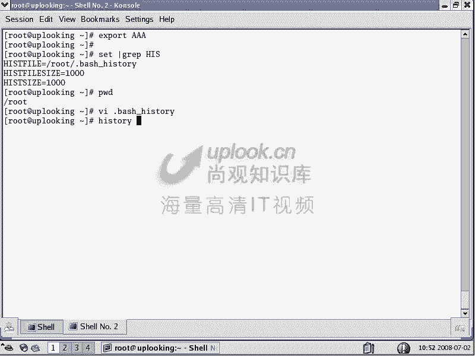
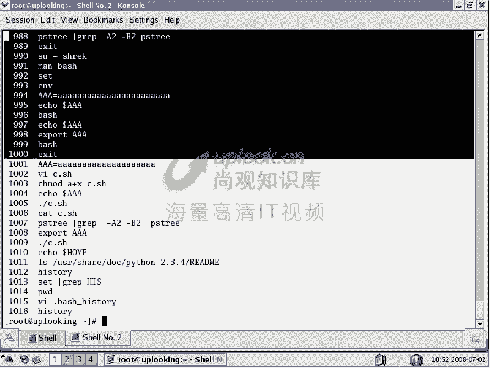
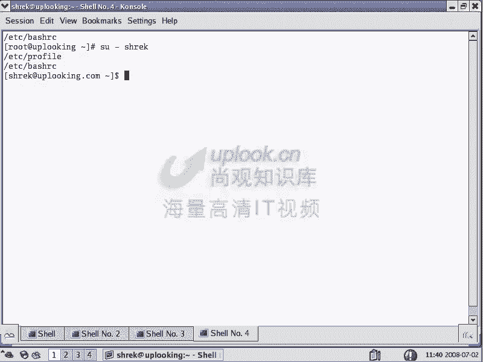
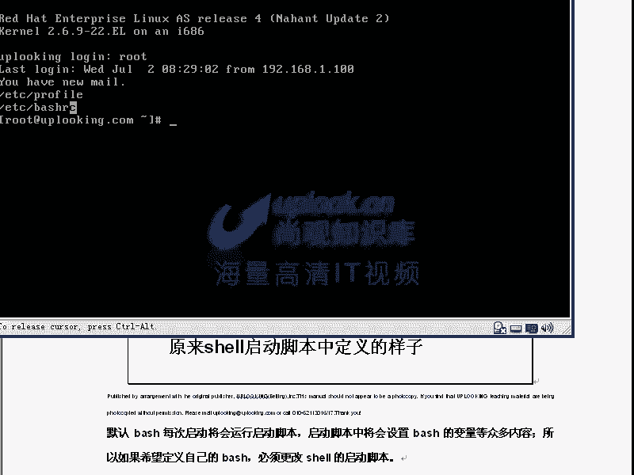
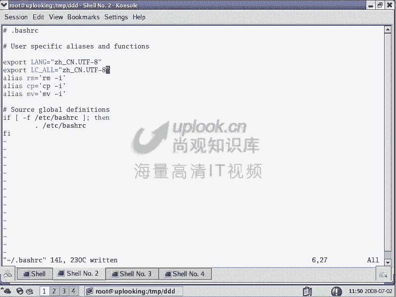

# Linux Shell 编程：P24：Bash 运算符及启动脚本 🐚

在本节课中，我们将深入学习 Bash Shell 的第二部分，重点探讨命令历史、各种运算符的用法以及如何通过启动脚本定制你的 Shell 环境。掌握这些内容是熟练使用 Linux 和进行 Shell 编程的基础。





## 命令历史 📜

上一节我们介绍了 Bash 的基本概念和变量。本节中，我们来看看 Bash 如何保存和调用你执行过的命令，即命令历史。

运行 `history` 命令可以查看所有命令历史，默认会保留最近的 1000 条命令。

```
history
```

你可以通过上下方向键来翻阅历史命令。那么，这些历史命令保存在哪里，又如何管理呢？以下是相关的环境变量：

*   **`HISTFILE`**： 指定历史命令保存的文件路径，通常是用户主目录下的 `.bash_history`。
*   **`HISTSIZE`**： 定义在当前 Shell 会话中内存里保存的历史命令数量。
*   **`HISTFILESIZE`**： 定义历史文件 `.bash_history` 中最大保存的命令条数。

当你正常退出 Shell (`exit`) 时，内存中的命令历史会被保存到 `HISTFILE` 指定的文件中。为了安全，你可以随时清空当前会话的命令历史：

```
history -c
```

如果你想在每次退出 Shell 时自动清空历史，可以将该命令添加到用户主目录下的 `.bash_logout` 文件中。

## 调用命令历史

调用历史命令有多种高效的方式，可以提升操作效率。

以下是三种常用的方法：

1.  **上下方向键**： 最基础的翻阅方式。
2.  **`Ctrl + R`**： 进入反向搜索模式，输入关键词即可快速定位并执行历史命令。按左右方向键可以编辑找到的命令。
3.  **感叹号 `!`**：
    *   `!!`： 执行上一条命令。
    *   `!n`： 执行历史记录中编号为 `n` 的命令（通过 `history` 查看编号）。
    *   `!$`： 代表上一条命令的最后一个参数。

## 变量回顾与环境变量

我们回顾一下变量相关的命令，这对于理解环境配置很重要。

*   `set`： 显示所有变量（包括环境变量和局部变量）。
*   `env` 或 `printenv`： **仅显示环境变量**。
*   `export`： 将一个局部变量提升为环境变量，使其在子进程中可用。
*   `unset`： 删除一个变量。
*   `alias` / `unalias`： 设置或取消命令别名。

在 Bash 中定义变量很简单：`变量名=值`。注意等号两边不能有空格。

## Bash 运算符详解 🔣

Bash 中的运算符非常丰富，键盘上的大多数特殊字符在 Shell 中都有特定含义。理解它们是编写脚本的关键。

### 文件名通配符（Globbing）

这些运算符用于匹配文件名。

*   `*`： 匹配任意多个任意字符。
    *   示例：`ls *.txt` 列出所有 `.txt` 文件。
*   `?`： 匹配任意一个字符。
    *   示例：`ls file?.txt` 匹配 `file1.txt`, `fileA.txt` 等。
*   `[abc]`： 匹配方括号内的任意一个字符。
    *   示例：`ls [abc]*.txt` 匹配以 a, b 或 c 开头的 `.txt` 文件。
*   `[^abc]` 或 `[!abc]`： 匹配不在方括号内的任意一个字符。
*   `{a,b,c}`： 展开枚举。**这不是模式匹配，是生成字符串**。
    *   示例：`touch file{1,2,3}.txt` 会创建 `file1.txt`, `file2.txt`, `file3.txt` 三个文件。
    *   示例：`touch {a,b,c}{1,2,3}` 会创建 `a1`, `a2`, `a3`, `b1`...`c3` 共 9 个文件。

### 引号的区别

引号用于控制 Shell 如何解释特殊字符。

*   **反引号 `` ` ``**： 命令替换。先执行反引号内的命令，然后用其结果替换整个表达式。
    *   示例：`` echo `date` `` 会输出当前日期。
    *   现代写法更推荐使用 `$()`，如 `echo $(date)`。
*   **双引号 `"`**： 弱引用。会解释大部分特殊字符（如变量 `$`， 命令替换 `$()`），但会**保留空格的字面意义**（不将其作为参数分隔符）。
    *   示例：`file="a b"`； `touch "$file"` 会创建一个名为 `a b` 的文件。
*   **单引号 `'`**： 强引用。引号内所有字符都保持字面意义，不进行任何解释。
    *   示例：`echo '$HOME'` 会输出字符串 `$HOME`，而不是你的家目录路径。

### 其他常用运算符

*   `~`： 代表当前用户的家目录。
*   `;`： 命令分隔符，允许在一行中写入多个命令。
*   `&`： 将命令放入后台执行。
*   `&&`： 逻辑与。只有前一个命令成功（返回状态码 0），才执行后一个命令。
    *   示例：`[ -f /etc/passwd ] && echo "File exists."`
*   `||`： 逻辑或。只有前一个命令失败（返回非 0 状态码），才执行后一个命令。
    *   示例：`mkdir /newdir || echo "Failed to create directory."`
*   `\`： 转义符。使其后的一个字符失去特殊含义。
    *   示例：`touch a\ b` 创建名为 `a b` 的文件（空格被转义）。
*   `#`： 注释符，其后的内容会被 Shell 忽略。
*   `$?`： 上一个命令的退出状态码。0 通常表示成功，非 0 表示失败。

### 测试表达式 `[ ]` 和 `[[ ]]`

`[ ]` (实际上是 `test` 命令) 和 `[[ ]]` (Bash 关键字，功能更强) 用于条件判断。**注意括号内两侧必须有空格**。

常用测试选项：

*   `-f file`： 检查 `file` 是否存在且为普通文件。
*   `-d file`： 检查 `file` 是否存在且为目录。
*   `-e file`： 检查 `file` 是否存在。
*   `-r file`： 检查 `file` 是否可读。
*   `-w file`： 检查 `file` 是否可写。
*   `-x file`： 检查 `file` 是否可执行。
*   `-z string`： 检查 `string` 长度是否为 0。
*   `-n string`： 检查 `string` 长度是否非 0。
*   `string1 = string2`： 检查字符串是否相等。
*   `string1 != string2`： 检查字符串是否不相等。
*   `num1 -eq num2`： 检查数字是否相等 (equal)。
*   `num1 -ne num2`： 检查数字是否不相等 (not equal)。
*   `num1 -gt num2`： 检查 `num1` 是否大于 `num2` (greater than)。
*   `num1 -lt num2`： 检查 `num1` 是否小于 `num2` (less than)。

示例：
```
if [ -d "/etc" ]; then
  echo "/etc is a directory."
fi
```

## 定制 Bash 启动脚本 ⚙️





了解了变量和运算符后，我们来看看如何永久性地定制 Shell 环境，这需要通过启动脚本实现。

Bash 在启动时会按顺序读取并执行一系列脚本文件：

1.  **`/etc/profile`**： 系统全局配置文件，为所有用户设置环境。它通常会调用 `/etc/profile.d/` 目录下的所有 `.sh` 脚本。
2.  **`~/.bash_profile`** 或 **`~/.bash_login`** 或 **`~/.profile`**： 用户个人配置文件（Bash 按此顺序读取第一个存在的文件）。通常在这里设置用户专属的环境变量和启动程序。
3.  **`~/.bashrc`**： 用户个人的交互式非登录 Shell 配置文件。例如，定义别名、函数等。
4.  **`/etc/bashrc`** 或 **`/etc/bash.bashrc`**： 系统全局的交互式非登录 Shell 配置文件。

### 登录 Shell vs 非登录 Shell

*   **登录 Shell (Login Shell)**： 需要用户认证的 Shell，如系统启动后的终端登录、`su - username` 或 `ssh` 登录。它会执行 **`/etc/profile`** 和 **`~/.bash_profile`** (及其同类文件)。
*   **非登录 Shell (Non-login Shell)**： 不需要重新认证的 Shell，如在图形界面中打开的终端、直接执行 `bash` 命令、`su username` (没有 `-`)。它通常只执行 **`~/.bashrc`** 和 **`/etc/bashrc`**。

**`~/.bash_logout`**： 当用户退出登录 Shell 时，会执行此文件中的命令，可用于清理临时文件等。

### 配置实例




**1. 永久添加自定义路径到 `PATH`：**
编辑 `~/.bashrc` 文件，添加：
```bash
export PATH=$PATH:/your/custom/path
```
然后运行 `source ~/.bashrc` 使更改立即生效，或重新打开终端。


**2. 设置系统语言为中文：**
编辑 `~/.bashrc` 文件，添加：
```bash
export LANG=zh_CN.UTF-8
export LC_ALL=zh_CN.UTF-8
```
若要为所有用户设置，可以编辑 `/etc/locale.conf` (RHEL/CentOS) 或 `/etc/default/locale` (Debian/Ubuntu) 文件。

## 总结 🎯


本节课中我们一起深入学习了 Bash Shell 的核心功能。我们掌握了如何高效地使用命令历史，详细解读了 Bash 中纷繁复杂但功能强大的各类运算符，包括通配符、引号、逻辑操作符和测试表达式。最后，我们厘清了 Bash 启动脚本的执行顺序和区别（登录 Shell vs 非登录 Shell），并学会了如何通过编辑这些脚本文件（如 `~/.bashrc` 和 `~/.bash_profile`）来永久定制个性化的 Shell 工作环境。这些知识是迈向 Linux 系统管理和自动化脚本编写的重要一步。