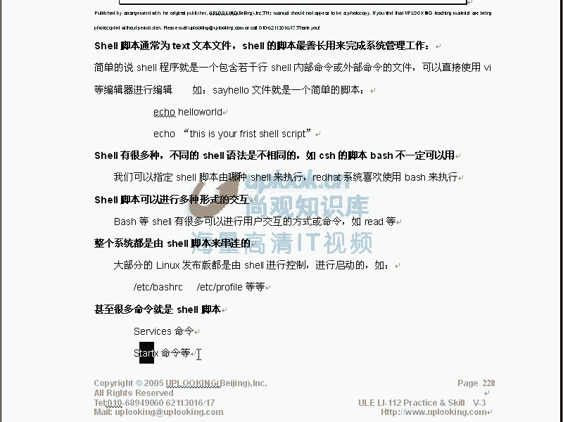
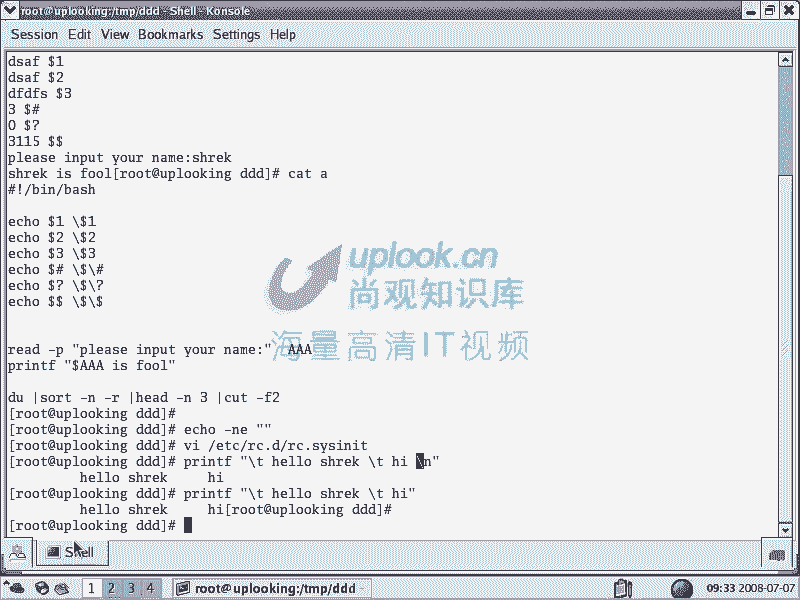

# 尚观Linux视频教程RHCE 精品课程 - P25：RH033-ULE112-14-1-shell脚本及交互 - 爱笑的程序狗 - BV1ax411o7VD

我们开始第十四章啊s shell脚本的这个详细的一个编程。那么前面的话实际上贯穿在第一章到第十3章的时候，一直都在讲shall嗯 shell要的使用输入输入出命向快捷键是吧？我们一般呢用命令的时候呢。

它的这个各个的参数是吧？习惯等等。那么这些讲完了以后呢，我们现在要真正进入到sha要编程了，实际上就把前面东西做一个总结。上节课我们总结的是什么呢？一些比方说命令历史啊运算符啊等等这些东西。

那这节课的话就是我们真正把它串起来，做一个完整的事情。嗯，啊，这个点像什么？大家看啊就是说呃我跟小赵的话呢，也在这边看这个PPT，这个PPT那大家看这边的话是一个shall脚本编程脚本脚本是什么？

咱们听说过电影脚本是吧？嗯所有的脚本语言啊，实际上是有很大的一个类别，就脚本语言的话。那是很大的一个类别。你比方说。呃，有code的脚本啊，ba shell的脚本。还有呢这些呃比方he脚本。

 shell的话，我们说有很多种。那么现在我们打开一个网页的话呢，给大家看一下呢，就是实际的工作当中的话，这些呃公司要求的这种职位啊，我们看一下，比方说现在我们到3W点百度点com当中去是吧？

百度当中去的话，那么我们点击进去，比方说呃。

百度的。关于百度，那么我们要找他的这个公司的需求的职位啊，因为我们有学员的话是在百度里面的，比如加2百度在这个地方啊，对吧？加入百度进去。才看到北京的职位。北京北京的职位。

比方说我们的这个呃网络工程师吧，我们看一下啊，这里面有没有，现在还不太确定。应该没有没有特别详细的，确实是网络的啊。

你看一下这边的话，总共职位的话有很多种。比方说系统工程师或者高级系统工程师。

嗯，看这个地方的话，它就说什么呢？熟练使用什么shall编程。那么很奇怪了，为什么？😮，为什么？就是为什么我们要熟练的去使用sha编程？为什么它要 shell shell编程呢？因为 shell的话呢。

它是让我们的这个系统自动执行一些任务的。那么你现在想一下，就是google公司的话呢，在2005年、06年的时候呢，就声称自己有100多万台电脑嗯。他难道找100多万的人来管理吗？

不可能所以的话呢一个人的话，他平均管理的电脑的数量是非常非常多的。而且通过各种手段去做。那这时候呢百度公司也是一样差不多的。因为在中国的话。

它的这个服务器的数量可能跟google的话不次于google是吧？那么这么多人的话，这么多机器的话要管理。那你想自动的去执行一些比方说自动执行，每天的话自动去备份一次，或者自动去什么呢？维护一下。

这些都是需要什么需要需要脚本的，就是让系统的话自动去执行一些任务。那我这边的话举出这个例子来的话，是为了干什么呢？告诉大家说需要编程的话，确实在整个的系统管理当中是非常非常重要。

而且几乎每一个职位的话都是这样需求。你说哎不对啊，这个呢是一个什么，这是一个百度的是吧？那我现在到google当中去我现在找的是非常非常呃就是说非常非常那个大的两个公司。

那么其他互联网和公司基本上都是这样。你要说我们到这个google当中去，你看一下。😊。

看他的职位。那比方说我建那到加盟google是吧？嗯，然后研发类型的研发类型的，我们到软件工程师里面去，那你方到北京这里面去啊，那边的话我没有看到这边比方说资深的这个呃就是软件工程师。那这里面的话。

你看到他呃。这是C语言。那么unux的这个环境标。别成经验啊，这里面的话没有说太太多的这个具体的语，具体的某种语言，我们再找一个。就windows都不是啊，能是系统。现在话我找啊，这是windows。

找个系统嘛。

系统的那你看到这里面。呃，就是说他要求跟就是说这个知识呢是什么脚本语言。嗯，这个脚本语言呢它写的非常精确了，就说什么类似什么shallproon嗯，啊，这些这些都属于脚本语言。那么shall是其中一种。

它这边写的更精确，对不对？所以的话呢不管什么样类型的互联网的公司，或者只要用到这个联动系统的公司，它多多少少的话，都会用到这个shall编程。所以它话shall编程非常重要。嗯，明白吧？

那么shall编程的话呢，我们在呃这里面的话把它拆开shall脚本编程，脚本语言。刚才我们看到脚本语言，它包含着什么呢？有pro是吧？paon是吧？还有什么sha等等。那么这些脚本的话呢是有很多种。

什么叫脚本呢？你比方说我们在这里面我现在运行一下。

那么现在我要运行起来，这边的话就是一个sll了。我们看到sell提示符了是吧？嗯，当然如果你输入一个什么pro。哎，你现在可以输入po的语法。嗯，那这时候po帮你做一些事情。

那么如果输入pyython需要THON那他会要求你执行他的这个脚本，你把这个脚本的话语言放上去。所以他你会发觉所有的脚本的话。所有的脚本语言啊，它都呃所有的脚本语言，它都是一种非常相似的。

就是它是文本文件。嗯，只不过语法不一样。明白吧？明白那么这有点像电影脚本，电影脚本的话，你比方说看一下我们的什么功夫熊猫是吧？然后再看一下我们的赤壁是吧？然后里面有小乔是吧？小乔是一个人物是吧？

那他有点像什么ba就是一个笑脚本。然后呢他有个什么周瑜周瑜是谁呀？周瑜是那个呃是是比方说谁谁演的，好像是梁朝伟演的是吧？梁朝伟他是一个人，那么小乔的话是不是他有一个他要执行什么什么任务的列表嗯。

这是他的脚本，周瑜的话有周瑜的一个列表是吧？比方说周瑜拿起一把剑，然后呢挥舞一下是吧？然后对小乔说说是什么美女王爱你是吧？这个时候是很正常的。因为这个语法的话是他可以去识别，并且他可以执行。

那但是呢如果要是我们把但是他都是文本是吧？都是文本，但是我们把周。一个文档。给了小乔让小乔去演。那说小乔拿一把剑，然后对一个女孩子说什么美女，我爱你，这很怪，他不识别这种语法，对不对？

所以他不同的人执行不同的脚本，它是语法是不一样的。所以我们看到呢大家看到pro脚本脚还有包括什么呢？PP的脚本，还有什么呢？GSP的脚本，这是是java的服务业是吧？

java的呃 service配置是吧？java服业，还有包括我们什么呢ASP啊，就是ASP就是微软的点net这种呃点net里面的这个页面的语言是吧？这些都属于脚本语言这脚本语言共同的特点是什么呢？

都是文本都是TSP的文本在windows里面在linux里面的话都可以去怎么样编辑它你甚至VI它都可以编辑。但是呢执行的角色是不一样。😊，明白吧？

那么如果要是由hell去执行的这种hell去执行的这种呃脚本的话，应该叫什么呢？就是hell脚本。嗯，明白吧？由pro执行的脚本，那就是pro的脚本，但是他们都叫什么脚本语言，明白吗？明白。

那么只不过这是什么？梁朝伟，这个是谁啊？林志玲是吧？啊，他们的语法是不一样，嗯，明白了吧？明白了。好，那么现在我们看shall脚本。那么现在我们就看的是什么sell。那么shall脚本的话。

sll脚本的话呢，它也是不一样的。比方说悲 shell和什么C shellTC shell还有什么呢？K shell他们的脚本呢也是不一样，明白吧？明白嗯。

那么悲 shell你看和TC shell它是有区别的。他们的语法结构是不一样。呃，所以的话呢这边的话就是我给大家介绍一下什么是 shell什么是脚本是吧？嗯，然后呢什么 shell脚本。

然后 shell脚本的脚本的执行方式，然后脚本常见的流程控制的一些语句，然后呢脚本的编写和SED和AWK的一些基本的使用啊，这里面的话呢我们讲的这张对整个的s脚本来说的话呢，是一个入门。

就是说实际上是一个你能编一些简单的东西，但是能达到多深的程度呢还没有啊，但是呢这部分知识是你必须的。这这实际上决定着你对整个系统的一个理解。因为整个的linux系统都是由 shell去构建的。明白了吧？

明白好，我们看一下什么是 shell编程呢，我们看一下 shell编程的话呢呃 shell脚本也叫。

也就是英文的话就是shall script是吧？是inux back系统的话，有一条原则的话，呢说inux系统的命用的话越简单越好啊，这是我们在讲最前面一张啊，当时的话跟小方讲，嗯。

那么最前面那张的话呢一个原则。对吧对，那么越越小越好，什么意思呢？在windows里面，比方说我们打开一个魔兽世界，嗯，这个魔兽世界的话，是不是里面点点按钮可以做各种各样的事情是吧？

在windows里面打开word，它也可以做很多东西。但在lindows里面的话呢，我们说它的程序的话越简单越好，你比方说我们执行一个什么执行一个这样的命令啊，你说哎LS是不是列出所有的文件。

嗯你想知道列出多少个文件吗？嗯，记不记得上核的命令。

1S。然后怎么着？呃，我说总共多少个文件？查行数啊。嗯。加管道是吧然后WC是吧？杠L啊，你下回再记不动的话就打了十几个文件是吧？还记不记得说呃看到其中的文件夹了多少个然杠L是吧？然后呢GRP是吧？

然后呢向上一个以D开头的是吧？然后这样的话全都文件夹了嘛，加上再加上一个什么WC杠L是不是两个文件夹，那这个时候的话它是每一个命令特别简单，当然了，现在你说所有的所有的这个unix的命令都是这样的。

也不一定他可能还是有一些特别的。然后说这个事话这种这种系统的话呢，它可能随着这个系统的增就是不断的这个完善，那它可能的程序越来越大背离了unix的原则，但这个也是为了完成的某种任务。

并不是说就有一定越小越好，但是呢设计的习惯是这样嗯，那么如果要是你看现在我们组合起来做一个特别简单的事情是吧？做一个特别简单的事情，用了三个命令是吧？😊，假如说我们做一个再复杂一点，比方说自动备份。

而且根据基数的日期备份在指定的目录，根据偶数的日期部备份到另外一目录，然后呢再进行一下增量，或者是自动执行一下差量备份等等。这个时候你做的事情是不是就更多了。嗯，是是不是要组合的命容更多了？对。

这时候你就是把它编成脚本。明白吧？明白，也就是说你在命令行里面这样一行一行一行输入的东西，那么你把它怎么样放在一个文文件里面，让它自动去执行，明白吗？明白，这就是效定了。那么这个呢要脚本的话呢。

我们说他实际上是把命令的话呢，这样的做出来，然后放在一个文本文件里面，让它自动去执行。那么所以的话也是因为我们是unix back系统，它有一个特点啊。

所以的话这样做的机会是非常多的然后实际上还有个特点没有写出来，就是说ix系统它是避免交互，避免交互有什么好处呢？这个脚本啪在那边半夜去运行，你不用去动的。是吧？对通过参数给它传递任务就好了。

所以你在完成复杂任务时，把短小的命令组合起来使用。那么怎样组合呢用用要明白吧？明白就这样那O那我说需要有很多种不同的 shell要的话，它的语法是不一样的。

就跟我们说小桥大桥它可能执行的命令它也是不一样的，对不对？

然后呢，我们说呃有些很多命令本身就是需要脚本，nstar x star X的话，它就是启动X window，启动那个图形界面，它呢就是一个脚本。那你说不会吧，那个star X也是脚本吗？那我们看一下啊。

star X我们说start X它在哪个位置，你知道不知道嗯，不知道不知道，那应该用什么命令去查，它查看它的位置呃。

and或者是或者什么命令啊，他说普通命还好，没有被我打3X那么在这个位置是吧？那么我现在想打开它，我是不是可以在同一行当中去输入啊嗯VI是吧？反引号是吧？对反引号就是反引号当中去会被预先执行是吧？嗯。

那么which。start X是不是执行这样的命令以后，那么这个路径就会放在这个反引号这个位置了，对对吧？就相当于我在一行当中输入了两个命令，对不对？对，直接回车哎。

你看这是不是需要脚本这是个文本文件是吧？他说是用并且的SH这样的一个命令去执行一下，就相当于我这个脚本的演员是谁呢？SH明白吧？明白哎，O那么这样的话呢，这个命令它本身都是sha要脚本。

所以他用的非常非常多，他用的非常非常多serv命令的话呢，它是在我们的这个呃也是一样的，你可以VVI是吧？反引号whichs等等。

然后我们再看那么什么是sha脚本呢？我们说脚本脚本语言的种类有很多什么sha script pro等等。那么系统的话是由hell脚本搭建的。那么它呢是呃整个的linux系统都是由sha脚本串起来的。

明白吧？像像那个你要想你比方说我们在启动的时候有welcome to lin是吧？你说welcome to什么啊，关迎来到什么绿帽系统，随便改一个字符就可以了。嗯啊，所以的话非常简单。

你比方说改成什么绿帽公司是吧？VI啊ETC项的INIT呃RC点D方中的什么呢呃s。

啊，RC点最新那题。sit在这里面的话呢，你可以看到welcome to water Linux是吧嗯。

查一下，那你看到这边他是说什么welcome to relin，你可以把它改成什么，把它改成说哎我welcome to什么呢？re hat那是吧？现在的话是31是红色，32呢就是。

32的话呢就是呃绿颜色了，你看一下啊。微信的话，你看一下啊，我现在把这两行复制下来是吧？嗯，靠py，然后呢。

然后退出啊，我没有改这个文件，我不想变成绿报系统啊。然后呢，像这样的一看是不是绿似了？是。是不是这不能显？是不是啊？对，所以的话呢这个icical杠EN的话呢，就是显示不同的颜色。那这个时候的话呢。

它就说哎整个把这个页面它变成绿颜色。那么实际上呢你改的这个脚本，在每次系统启动的时候，它都会变成绿色的green hat是吧？那么这这个时候的话呢，它就是改这个脚本，实际上改的是系统的一个启动过程。嗯。

那么我给大家举这样一个例子，实际上非常非常简单。

啊，那么在这里面呢，我们说很多脚本呃，很多的这个命令的话呢就是脚本，很多命令就是脚本。然后呢整个的系统都是由 shell脚本搭建起来的。那么如果你掌握了 shell是不是就可以把整个的系统搞清楚是吧？

那么就是非常这常简单了。那么这边的话呃你看一下，那么我们看一下刚才那个脚本打开那个脚本，然后这样的啊向上那么VI的话呢，我们VI这个呃starX是吧？打开了以后，它是一个标准的这样的一个脚本。

那你看它的语法是这样的。那么首先的话以井号是不是井号作为井号作为这个 shell里面的运算符表示后面的命令不要去执行注释注释所以的话呢后面这些的话都是注释，对不对？嗯这都是注释吧。

是不是都是以井号开头嘛？那么第一行是不是也以井号开头但是第一行不一样。

第一行不一样，第一行虽然是井号开头的，但是它不是注释的作用。这个井感叹号是这个需要脚本，必须呢以以这样的方式开头的。你说啊不会吧，我现在的话这样的啊，我VI在这里面VI1个AA这样文件嘛，在这里面的话。

我不是以井号开头的。我直接什么e啊，这样的一串东西是吧？嗯，再去ele这样一串东西。保存内出OK那我再去这样的CHMODA加上1个X给A加上X是吧？嗯点杠AA那么这样的话是不是就让它直接执行了？嗯。

这样执行完了以后呢，它实际上也是可以执行的是吧？对。呃，这样的话也是能执行的。你看我们执行一下点AA是吧，就可以执行。但是说唉。你这不是胡扯吗？刚才你明明说在这个脚本里面一定以警感叹号开头，对吧？

对你现在的话并没有以警感叹号开头，你是还是可以执行的嘛。那么因为你现在栽的环境就是悲 shell的环境。嗯，你现在是不是在背 shell下去执行。

对那你可以看到 dollar SHELL是不是对你现在在背你现在就是在背 shell当中，所以话你执行这个 shell要脚本的时候，它呢自动以这个变量所代表的这个 shell它去执行的。

当然是这个有可能是这样。那么因为不同的linux的话呢，它的差异是很大的。嗯但是有些内核的话呢，它就可以调用默认的使要。有些内核它不调用默认的使要。所以这个时候的话呢，你怎么样避免这种问题。

那最标准的办法是怎么样去VI是吧？你要告诉他演员是谁啊？演员是啊井感叹号是吧？并且的什么A或者是什么呢？并且的SH并并且的SH是A的一个软链接，嗯，也就是说是一样的，如果把这个B和A的话去掉是吧？嗯。

这样的话去掉，那么这个是一样的，因为它是一个软链接那这样的话呢是一个标准的写法，尽管这个地方的话是景感叹号井开头的，但是呢他这一行意义并不是注释掉明吧？明白表示这个演员是谁，演员是谁啊？小乔是吧？

说完了以后，那你就要点个AA那它还是一样的可以执行。但是你如果要是这样去VI你说老师你胡扯了。我不太相信啊，那你这边的话，你写一个什么？比方说呃你给它改成并下的pro啊，或者说USR下的并下的pro。

USH的并且的pro是吧？嗯，这样保存内出。那么这个时候你再去执行啊。他是不是就说语法出错了，对对不对？他说语法出错了。嗯，那这就是说哎我不支持你这个语法，因为你钓你的演员是错的。

这个演员他不支持那种挥舞大刀那种操作的，对不对？对，所以的话呢演员是不一样，所以证明什么呢？证明这第一行是不是有用的，是是不是？对，所以呢这一行啊，那么你最好的话，如果是需要脚本，那你最好是这样的，嗯。

开头明白吧？明白啊。

所以他呢回过头来看，那么也就是说我们的s脚本，它呢是文本文件。首先就是你随便可以编辑的。嗯，文本文件。那么在第一行的话应该以景感叹号开头，告诉他整个的后面是什么样的语言编的，也就是角色是谁？

角色是小乔还是大乔是谁，嗯，对吧？对，然后呢这些角色的话呢，执行不同任务的话，要符合这个角色的这个习惯，要让它能执行，对吧？语法是这个角色的语法，嗯，是不是？所以的话这就是说呃有很多种。

那么一般是阿玛的是吧，可以直接编写。那么第一个字符的话呢，是景感呃，如果要是你不是以景感叹号开头，那么第一个字符，如果要是非景话表示是一个非 shell脚本。如果是景的话表示。

但第二个字符不是感叹号的话，表示一个非 shell脚本，这些还有这样的一个说法，你听你看这些东西乱乱，你看这几行的话乱吧。嗯，所以你还不如景感叹号直接就是景感叹号说。

定一个嗯演员就好了。嗯，对不对？对，所以的话呢我告诉大家，哎，你还是那样做比较好一点。

然后呢再看，那么我们说笑当中的话，正则表达式的话，悲笑本身是不提供正则表达式的支持。那么他只提供通配符，就是亲啊问号啊那种。但是呢我们说正则表达式可以通过一些命令去支持。比方说GREP啊。

或者VI啊或者SEB和AWK嗯SED和AWK那么这些的话，我们正则表达式的话呢，给大家说过，那么什么行首是吧？行伟等等。这些的话我们就不说了，如果大家对这个地方还是不清楚。

你点回去看一下正则表达式哪个地方啊，也就是说我告诉大家悲笑当中它不不直接支持，要通过什么呢？GREPSED和AWK等等这些东西来支持啊，这边的话是给大家回顾了一下然后你们再看后面。

那么我们说跟需要脚本啊，现在的话需要脚本是什么样子，你知道吗？嗯啊那么你跟需要脚本的话呢，进行这个交互的话，是这样来交互了。你看一下，那么需要脚本的话啊。

resite的话是把整个shall的话呢重新重置一点啊，就没有那个蓝色了对吧？对，嗯，没有那个绿色了。那么现在看，假如说我们现在跟shall只稳进行交互，那么我们可以写一个脚本出来，比后VI啊。

那么现在我这样的VIA这样一个脚本，嗯，这个脚本的话是我跟他进行交互的那我可以让他ele啊dollar。一是吧嗯，apple。dollar2什么交互呢？就是我希望传递给这个脚本一些东西。然后呢。

再让这个脚本的话给我输出一些东西。那么首先呃我这边按理说的话应该是这样的，请感叹号是吧，并写的什么微笑作为我这个小的脚本是吧？脚本的这个执行者。那么接来的话呢。

我这样的ele还可以 echo什么dollar3是吧是？对还可以 echodoar呃。后来。井是吧，嗯，还可以ecledollar。嗯，问号还可以eledoller dollar。

那么我apple这样几样东西。嗯。我这样呢就是为了输出更清楚啊。我要把这些东西的话呢，全部都输出出来，告诉你我e的是哪个东西，是吧？我加上这样的一个脱译服的作用，就是说什么把它的特殊意义取消掉是吧？嗯。

对，那么也就是我现在希望给这个s要脚本，我现在编了一个名叫A的s要脚本，给他传递一些信息的时候，是用doller一doller2doller这些东西来传递的。你比方说可以看那么现在我这样保存了。

我执行它CHMOD是吧？对你那A加上X所有的角色都加个X权限嘛，对对吧？然后这样执行点杠A。Yeah。啊，点杠A好像都有反应是吧？然后这样的点杠A那么AAADBBCCCCDDD这样一回车。

那么他会告诉你是什么呢？doer一代表的什么呢？是不是第一个参数啊，对，是吧，是不是第一个参数？是然后呢，do2是不是代表第二个参数啊？嗯，doer三是不是第三个参数？对，那么deer井是干什么呢？

4告诉你总共有4个参数嗯，是吧？是有4个参数。嗯，然后呢，doller问号是什么呢？doller问号是说你上面一个命令是否成功执行。也就是说呢。

先把这个ele dollarer问号的话说上面ele dollar紧的时候是否成功执行，对吧？这个我们原来看过，然后呢，doller dollar是你的PID就是你的进程的ID号码，嗯。

你可以自己杀掉自己，这都可以。PID就杀掉自己。那么现在看，那么假如说你看到这边啊呃我现在LS一个这样的一个目录，这个目录是不存在的是吧？对，ical。到了。问号是不是现在的话就是一呀？对。

表示返回的值是什么？不是零错误就是零是吧？呃，正确的话是0，错误的话就是非零。嗯，那假如说库函数和文件不存在，那么它的错误的代码可能是不一样的。明白吧？明白它可能是非零的其他数，所以我们只能说非零啊。

那么现在看那么假如说我现在呢再给大家看一下啊，这边的话呃doer一就表示第一个参数是吧？对doller2第二个参数这个很有用的，我们经常去执行，比方说现在这样的是吧？

HTPPD star这是不是我们说把这个服务啊，把这个服务启动起来是吧？传递给他的两个参数是吧？嗯，那这两个参数是不是在serv这个脚本当中就是doer一和2对。

那你现在看呃这样的re star说我们这re star可以把这个服务重启一下，对不对？对，那么这时候我们揭入一下VI是吧？再加翻译号，应该加个什么which对不对？现在打开它，那我看这边有没有do一啊。

😊。

还得要加政策表事啊。咦。😊，啊，匹配不到，看一下。啊，他没有用到。他这样的，你看首先呢他去判断一下这个参数是不是等于0，看到吗？doer井号是不是参数啊？

对杠1Q是表示呢等于因为你不能直接加等于等于它表示负值值对或者字符串相等。如果要是等号两端加空格的话表示字符串是否相等对不是数值是吧？那么这边杠一Q的话表示数值是否相等，也就是说呢这个数值是否等于零呢？

如果等于零的话，那么它这边就是说输出一个什么东西是吧，对吧？对，然后呢既然那么如果要是大于大于大于零是吧？对，这个是大于零的，大于0，如果要是它的这个数值的话呢。

是在呃是杠杠hel这边不是doller括号一嘛，是吧？对说这个呃就是说返回的参数是杠杠hel那么就输出一个什么东西等等。它在这里面的话这样去定义嗯。他们在这里面这样去定义啊，那么如说刀了警号等等。

这样的话他都做出来。诶。我们呢在这里面service，那么它是一个脚本。如果是现在我自己要做一service这样的脚本，然后VIB那么我在这边啊井号感叹号是吧？然后呢，这边背景下的bsh是吧？

然后这样的le呃star是吧？Doer。doller一啊。刀er一再怎么样呢？刀er一啊。到了2。那我现在假如说做随随便做一个模仿一下他啊嗯。那我这样吧，点到B是吧？对，HTVPD是吧？对，star。

系。对。stop这边当然是输错了。脑，这有问题。我脑袋有问题啊。是吧。然后呢，HVD正在关机或者怎么样。那我这边是非常简单的只是ecle一下嗯，是不是但并不是说你光是 echo完事了。

你可以真正把它关掉，比que掉这个进程啊等等，是不是？对，那么这时候呢它组合在一起的话，我们就可以让这个脚本的话实现我们自己要的功能。这就是一个要变程的功能。

那么说呢用这样的一的话第一个参数第二个参数是第三个参数，那么这边的话是可以输入给它是吧？用read命令可以读取一个变量给这个变量赋值，然后呢的话是我们输出过很多次是吧？对print的话也可以输出。

那么现在我们再做一个更加就是稍更加稍微复杂点的。后IB这个东西那么在这里面我们这样的一2的话已经是可以了。那我看一下我VI才那个那么我现在再怎么样呢？再去。

为。read放屁的话呢，表示先打印出来啊，说。内是吧，然后呢在后面的话输入，那么你这个名字叫什么呢？你把这个名字给AAA作为一个AA的值。AAA是变量的名字。你这个变量名字叫AA单取出变量的名字的话。

该用什么什么符号，取出这个变量的值来。AAA是个变量的值了。是不刀了的对是吧？那么现在说请输你的名字，然后我这样的ecle一个呃，我这边用print app吧。

print F print F是C元当中的是吧？嗯，但是它这里面的话继承下来，那么printF。不呢 dollar了。你我看这样可不可以啊？啊，说这个人的话有点傻，然说直行A啊，那么。

他说请输入你的名字那么说ck有点傻是吧？这样的话就出来了。那么这里涛先给大家演示的是什么呢？就是演示的说哎我们这边输入给他是用doll一去输入是吧？

然后呢果是这边的话呢前面的话是真正取出一这个值来那这个地方的话就是说什么呢？说告诉你就是这边我执行这个doll，我告诉你说我正在执行这一行对吧？那么现在话是read了一个变量，那么他是不是先打印出来了？

请输出你的这个名字对吧？然后呢这个把你的这个输入的这个内容，你输入是吧这个内容的话给ANA作为AA的这个值A是变量的名字那么这个变量的值是什么呢？那么那么为什么说呢？就是说A的这个变量的值调出来。

然后呢打印出来这样这个输入输出刚才我。您看到呢就是说。咦。😊，错了。那么本来的话我想给大家看一下iccho实际上也是有很多语法的。比方说杠NE刚才杠NE嗯，然后呢，我们这边双引号出了一大串。

比方说那个颜色记不记得？嗯，就是那个颜色，我们不是在这个地方。VIETC下的RC点D这是系统的启动脚本的位置啊，s这是系统初始上的脚本。那打开它以后的话，你看到这边e杠NE这边的话就是输出不同的颜色。

嗯，明白吧？也就是它还是有很多语法的。嗯那么的话也不是那么简单，就是我们刚才看到print是可以起到这个作用是吧？对那么le的话呢，它也可以有很多语法也也是不简单的，一般来说的话。

print的话它可以控制的控制的东西是更多的。你比方说我这样的print我当然可以在这里面也可以输出了是吧？对print f我这边上一行，那我这边是什么呢？杠T表示一个table就是质表符说什么呢？

hello呃然后呢，这边再杠T然后呢。

T，然后呢最后的话这边是杠N杠N就表示回车。嗯，那我这样直接回车。哎，你看这时候它就有回车了。嗯，它是先一个质表符看到了吗？嗯，杠T是不是一个质表符，对，是吧？再杠T是不是又一个质表符嗯，对，又跳一下。

那最后是是T是吧？对，如果你没有这个杠N的话，那么它就不回车。那时我把它去掉。他就不回去嗯。所以呢它能控制的这个字符的话呢，要比ele控制的话更简，那就是更多一点。

它的功能更多点。嗯，那你可以用help来printF来看它的语法啊，它是干什么的，是吧？嗯你可以man。

微想。然后在这里面找什么呢？纯这F。你在这里面找，你看它的格式，你要这一杠代表什么是吧？嗯，然后呢摆分B代表什么？百方A代表什么等等。这样的话你可以输出这种各种各样的格式。那么你也可以找这个什么。

formit就找这个格式。这个格式的话呢，它它总是有。Yeah。这样吧。有。查查不到。啊，这。你看杠N的话是new life是吧？现在杠T的话就是一个table符号是吧？对。

这时候呢你可以找到杠A的话是一个啊声音，然后打印一个这样的声音，它B声嗯，它的D声。我们经常听到这种声音。那么你可以在这里面的话，找到这个呃符号，比方说我这样的。春天。啊，有声音了吧。对。

刚才我把那个就是声音的话关了，我现在提出声音来，我站那。它就自动去产生一个声音，对吧？对，那么你可以说哎出错的时候，你打一个杠A出来，嗯，对吧？对，这时候就有作用。

所以的话你现在的话想把这个东西完整的控制出来，那么你是要1。1点的去维护的，呃，1。1点的去熟悉它具体的一个个命令。嗯，那么这样的话才可以。

一会的话随心所欲是吧？对，所以我们是实际上熟悉这个 shell里面的内部命令。然后呢内部的话，一些什么样的命令是做输入的，什么样命令做输出的。我们刚才明显的可以看到什么呢？

就跟我们这个A文件一样是吧那么输入的话，你以用一做输入第二个参数作输入你以看到总共有多少个输入多少个参数对不？问号你可以看上一个命令是我成功执行，如果上面命令没有成功执行，那你怎么怎么做。

你可以这时候自己决定吧你看本身的这个ID就是这个I的话然后命令是读入一个变量作为这个变量的内容为这个变量内容那么的话说你可以输出出来也可以输出出来以输入输出的话。

们大致给大家介绍就是本里需要给输入的那你可以用些方式你需要给输出的时候，那么你可以用些方式。

这是我们介绍内容OK。

我们再看那么比方说这里面的话就是一些简单的操作了，比方说echo是吧？read，然后呢，pre app等等，这就是我们的这个呃具体的这个语法。具体的这些呃输入输出的这种方式。

然后呢我们看一下下面看下面就是下面的话是我们的这个呃ACel脚本的一个执行方式，这个执行方式呢，我们实际上给大家大致说过，你要点杠什么什么的话，我们经常去执行嗯，但是实际上呢它还有另外两种执行方式。

那这两种执行方式我们要汇总一下嗯啊，O那呃这个呢就是我们原来说的那种是吧？嗯，你可以输入一个完整的路径或者是一个什么呢相对路径。点的话，很多人说啊它已经习惯了，他已经习惯了。

他在这里面这样的说啊我这边执行一个脚本，比方说执行呃如下面的一个backup。

对吧或者执行什么呢？现在我这个目录下不是TMP目录嘛？嗯TM目录下的DD目录是吧？对，反正有个A脚本嘛。嗯啊，那他说唉老师，你这样执行是不对的。呃，老师，你这样执行是不对的，为什么不对呢？

因为你没有加点但是你要知道你这个点的话，实际上就是指当前的路径。嗯，所以这样执行一个完整路径和直接执行在当前目录下执行点杠A，或者说你CD到上级目录当中去执行什么执行DDD当中的什么A这都是一样的啊。

这都是一样的。😊。

这些都这些方式都是一样的。嗯，那么这样的都是说你在输入一个路径，然后告诉他这个路径下，某个路径下有一个脚本。嗯，某个路径下有个脚本可以直接执行，是这样一个情况。嗯，明白了吧？明白啊。

那么也就是说你现在看到的这个这样的一种执行方式是我们主要的这种执行方式。嗯啊，还有一种执行的话就是这样，你现在写一个脚本，你比方说写个B这样的脚本B这个脚本里面的话就直接就是一行。

我是为了为了给大家演示，所以的话随便这样写一下。但是呢你直接执行B。那他是说pe。你猜是什么原因？

嗯。嗯。佢没声顶啊。没权限，没就是去可根限是吧？嗯，权限被拒绝了。嗯，那么这时候你没没有这个权限，是不是CHMD啊，A加上一个X给他加个X权，也就加上一个X权限，他就可以执行了是吧？方正我先不执行。

我先不回撤，我还有另外一种方法可以让他执行，那我直接把什么把把梁朝伟叫过来说什么，你照着这个去去呃这个脚本给我做不是说自动这个脚本，说让招梁朝伟过来，而是我去找梁朝伟，那就是我说什么A需要你好。

你给我照着什么B这个脚本来给我执行。嗯，那这样的话就不需要你有什么。行行行，明白吧，明白这是第二种方法。但是不管这两种方法，换汤还是换换药啊，换汤换药换药呃，换汤也好，换药也好都无所谓。

但是你这样做完了以后的话，它都是在一个子效当中去执行的。什么叫子效当中执行。这样。那么你现在看B这个文件VIB那我现在在这边加上一个什么PS去。是吧PHGREP本身杠A2杠B2，然后呢。PS tree。

也就是说我现在要执行PS tree这个命令是吧？对，但是这个命令呢，我呃我呢在命令数当中是不是也会自己显示出自己来啊？嗯，对，那么也就是说我想显示什么呢？PSH这个进程的上面和下面的情况，对吧？

那么现在我是在一个脚本当中，那我直接cut啊，我看到B。那么我现在先去在我当前的事要当中，我去执行它。是不是我现在执行PH啊？对我现在在当前的悲当中执行，对不对？对，那我现在这样的。

按照上面这种方法去执行。看有些什么样的区别。多一个被多了一个被 shell是吧？也就是说你现在执行的一个脚本，在你不知不觉当中，实上它已经是怎么样，被已经打开一个子需去执行这个命令，明白吧？明白。

所以上面这种方式和下面这种方式都是一样的。也就是你现在这样的CHMD现在我给他加了一个什么？A加上一个X权限B加了个权X权限。然后呢，我在这边去执行什么呢？

TMP目录下的TMP目录下的呃DDD当中的B是吧？嗯，那么这样的话唉，错了。诶。D呀。哎，刚才有点问题啊，记错路径了，就是说我这样这样的，直接就是它实际上不是DDD目录下，就TMT目录下的对是吧？

在当前目录下嘛TMT录下B那么这样直接执行，那你看到它也是什么多了一个 shell是也是多了个所以的话跟我刚才ca b这个结果，如果要是我在当前的目录下直接执行这个脚本，它实际上是不一样的。

多了一个 shell看到了吗？嗯是不多了一个 shell。所以的话你是这种方式去执行也好，还是呢这样的方式就是说还是呢直接加个bash什么什么这样方式也好，他们两种方式都是换汤不换样。嗯。

都是新打开一个shall是然后呢去执行。嗯，明白吗？明白这种方式的话呢，有一点弊端，就是说你想通过这个脚本来设置某个变量的时候就不行。你要说我现在这样VIB啊。你刚才这个过程清楚了吗？清楚了。

之前那个也已经讲过一次，这个也已经讲过一次是吧？对，也就是说直接执行路径的话，相当于打开一个新的shael。嗯，然后呢，或者是说现在我教了一种新的方式，嗯，就是ba shell加上一个脚本名字。嗯。

不管对脚本有没有。

X权限它都是怎么样，它都是可以执行直直接执行。但是它也是什么？新打开一个bael嗯，是不是？对，那么现在我们讲第三种方式，第三种方式呢，它的就是我给大家讲这个意义在哪了？就是你设置一个变量的时候。

你是不可能用前两种方式去设置的。嗯，你比方说我现在这样VIB啊，我在这里面去定义一个什么呢？去定义一个呃，比方说BBB这个变量BB这个变量等于什么呢？等于。

啊，等于帅。那这样的话，我为了保险起见，我还把它export，把它变成环境力量，对吧？对，那这样的话啊保存内出。然后给大家ca一下B。那你看到唉XportBB是吧？嗯，那我直接执行它了呃点杠B执行了吧。

嗯，然后呢我ecle dollarar BBB。是不是空龙的？嗯，那为什么呢？因为它设置变量，它是在这个事项当中设置。嗯你现在是在这个事项当中是吧？嗯，你说哎那你不是把它变成了一个环境变量吗？

export出去了吗？export只会在当前的 shell要和子 shell要当中运行，它不会跑到副视要当中去。嗯，那你说你这个脚本执行的作用就是设置一个这样的变量，是不是就没有达到。对，没有达到下个？

嗯，所以话需要第三种，第三种是怎么样呢？加上一个点，再加上一个路径。加上个点加空格，再加路径。那空格的话，你比方说TMP下的什么比率，嗯，或者是什么呢？我就没有执行啊，点或者点杠比这都是一样的。

那有这样直接执行。那么是不是你看到这里面只一个是嗯，那么你现在在e。是不是这实是有的。是，所以说啊如果要是你的这个变你这个脚本要设置某个变量，为当前的需要设置某个变量，那必须得是点开头的点空格。

然后再加上你的路径。嗯，你要说这边是点空格，再加上什么点杠B啊，这样的话就表示什么？在当前的 shell要当中去执行。嗯，明白吧？明白嗯，那么我们给大家说过，说需要启动的时候。

不是会启动那么几个会有几个初始化的脚本吗？嗯，是吧？对，会有几个初始化脚本，现在我们打开它嗯。VIETC下达fi这是不是一个对打开它，那你会发现这里面执行脚本的时候，这里面在执行脚本的时候。看到了吗？

看这个地方他说ff是个循环啊，I是个变量名。变量名的话，在以下的这些文件当中，所有的星点SH这些文件当中去执行这个循环do和当之间循环说如果要是他可以读的话，那么就执行它怎么执行它呢。

这边你看到这个点没有嗯点空格是吧？到了到了I是吧就是取出变量的I的值来嗯你不理解这个没关系，等一下我们会再给大家说，但是你看到这里面执行的时候就是点空格是吧？嗯加个空格吧，嗯，对，对不对？对。

如果要是你不清楚啊，没有关系，你就先这稀里糊涂往下听多听几遍就清楚嗯这是非常重要的。因为看呢一开始就让你具有跟我们一样的这种素质不可能的。但是呢你又不能让我一点点的样，但是呢你多讲几遍你习惯就好了。

就跟开车的时候，你原来只会骑自行车，一般骑哇这么大怎么办？那你是。

开几次是吧？就可以了。所以的话不开车的是你要不开去学开车，那你肯定学不会。嗯，就跟你不游泳去学游泳一样。对啊，看半天图也没有用，所以的话自己敲一下就清楚了。嗯。

那么这时候的话你可以呃就是明白我们这边加上一个点的作用，对吧？在当前的事项当中去执行，那这就是我们的三种执行方式啊，所以的话我们在这边总结了一下，前两种。

第一种的话呢，要求有可执行方式嗯，是吧？对，后两种不要求有可执行的这个权限。嗯，无用可执行权限都可以执行。嗯，然后呢，第一种的话要求有可执行权限。第一种和第二种的话都是在新需要当中去执行。嗯，是吧？对。

那么第三种的话呢，是在什么？在当前的需要当中去执行，这就是需要脚本的三种执行方式。嗯，明白了吗？明白了？O我们再看。

呃，大家看到这些书的话，有可能会经过升级啊，就是不是我们现在这种书。那么这个的话就是条件流程控制的。我们前面给大家讲了试要脚本是什么嗯，是吧？又给大家讲了什么呢？就是说试要脚本的话呢。

你一般是一个呃就是说数输出的话，是用什么语法去输输出对吧？然后呢又给大家介绍了什么呢？需要脚本的三种执行方式，嗯对吧？对然后呢接下来的话我们就要看实际的脚本，实际脚本的话，我们先给大家看的话。

就是一个判断啊，如果要是这个条件没真的时候，我们怎么怎么做这个的话，大家几乎学每一种编程的话，都要接触，而且特别简单，对那你比方说啊你说这样的，如果要是我是你的哥们是吧？你就借给我钱。

如果要是你不把我当成哥们，那你就不要借给我钱是吧？这是一个对你来说这样的一个判断那么对脚本来说说如果要是这个条件成立，那我自动执行什么事情，如果这条件不成立，自不要去执行这个事情。那么这个的话，也在。

版本他们是经常做的嗯，明白吧？明白。那么接下来的话还有一些什么呢？除了除了 false判断之外，还有什么呢？循环嗯，比方说我要把这个事情循环做100次啊，100次。那么你不可能一一个按下上回车。

按下上回车执行100次，那么都是由循环控制来来做的，这些都是流程控制。嗯，然后最后的话我们会介绍一下ba shell的一个什么呢？ba shell的一个调试工具啊，我们呢呃先把它分一下。

然后等一下的话再来讲，我这是上半段。

