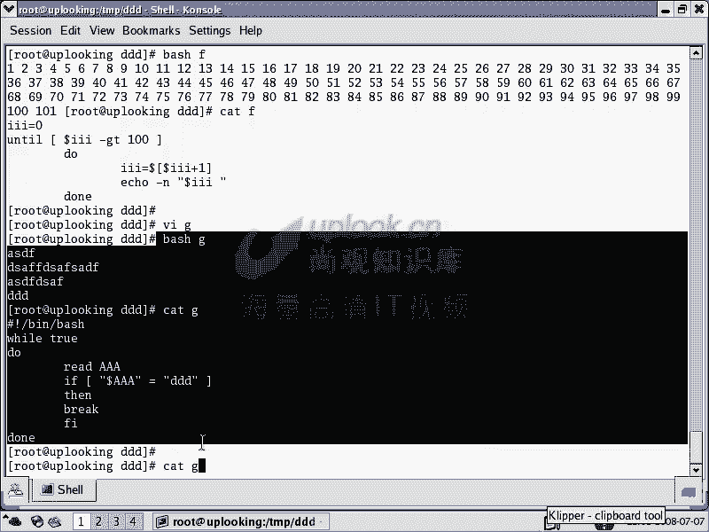
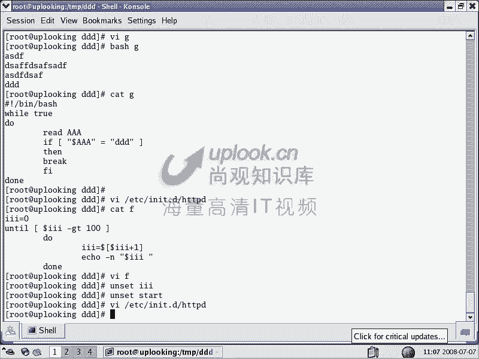

# 尚观Linux视频教程RHCE 精品课程 - P26：RH033-ULE112-14-2-shell脚本流程控制 - 爱笑的程序狗 - BV1ax411o7VD

继续呢刚才就是ba shell的一个继续的这样一个编程啊那ba shell编程的话，也就说你会的输入输出，知道它的执行方式，嗯，知道它的这个呃就是说知道它的这个结构怎么样了。你要紧感然好开头对吧？

对那么那么还有就是说执行方式，还有呢就是我们的输入输出，呃，还有就是交互了，就是背 shell脚本的交互了。还有就是说需要脚本它到底是什么样子，就是我们上节课讲的对，那么目的是什么呢？

目的是呃告诉大家就是说撇开这种呃比较紧张的那种心理啊，那你觉得啊编程好恐怖，我记得很多人他他学这个东西的话，都会觉得编程好恐怖，实际上没有那么麻烦啊，那你只要把这个琐碎的东西计算呃就是记清楚的话就好了。

那么进下来的话又是一些琐碎。但是我们上节课已经给大家讲过这些琐碎的东西，所以的话实际上需要脚本的话，我们说就单纯从 shell要脚本编程的角度上来讲，我们实际上已经讲过一堂课了尽管说。

三到第十3章都是在给大家讲什么呢？ shellll到底怎么用怎么用高效，怎么样是怎么样一个习惯，对不对？嗯，然后的话。现在的话实际上讲少编程，单独角少编程已经讲了两万课，那堂课大家已经过去了嗯。

是不是啊？对，那现在的话就是我们要组合起来，组合起来的话呢，再给大家介绍一些额外的命令，比不要循环啊，我们上节课讲的print f对吧？对read命令是吧？那么我现在看那比方说哎这是一个屏保。

linux里面屏保特别搞笑啊，就是各种各样的。呃，好，我们现在看一下呢，就是说呃我们这个tro false的判断。t false判断的话，我们说呃最简单的就是一个中括号。

对我们说中号如果ABC这样的去说的话，就是说文件名当中包含的A类或者B或者C是吧？但这样一加上空格的话就不一样。t false。那么你说这样的话，我直接回车的话会是怎么样呢？嗯。

那你是不是用中号进行了一次tro false的判断？对嗯，那你返回的结果是什么？这个。很怪异是吧？那谁问谁的话都怪。但是你要知道ABC是不是三个字母啊，这三个字母的阿斯格玛是不是都是为大于零的数啊？嗯。

那么这时候它返馈的值就为Q。嗯，明白吧？他这样一个机理，那你说这样的呃，那我那我怎么知道返回值位toele一个什么doller问号。是法律主一初。嗯，是，那么如果要是这样的。这里面为空是不是啊？对。

空的话呢，你说出 false，那他就认为是什么？forse嗯是是虚的是吧？嗯，是假的。那么这个时候true的话呢，就是大于零的数。那么如果要是为f的话，就是空的嗯，等等，明白了吧。

那么所以它呢我们用ch false这是判断的话，它可以判断的面非常广。你当然你可以判断什么呢？doer。useruser是不是取出user这个变量的值嗯嗯，这个值如果要是为什么呢？shack的时候。

那么就怎么样啊，就是说如果为shack的话，那它就为ch。如果要是不等于shack是其他字符串的话，就是说 false一般的话字符串的话，我们用双引号引起来。我们说双引号和单引号的区别和记不闭的？嗯。

什么区别。呃。单引号是。呃是。He。打引号是把里面的特殊字符全部特殊意义全部都取消掉嗯，是吧，那么商引号呢？剩以后就是。空格只有空格的特殊意义被取消掉了。嗯，对对的对，也就是说呢里面的特殊字符的话。

还是特殊字符的意义，是吧是？是不是？那么所以放呢这样的，一般情况下，我们这样呢双引号把这个字符串引起来。那这样的话你一回车，那说来把这个doeruser这个user这个变量的值取出来，它是s吗？

如果是就为 true，如果是不是的话，它就是什么 false，那我这样的ic，那你说是是什么？这个值为多少？00呢？你现在user是如此来嗯，你看这原user如ot是吧，一那么一嗯，对吧？对。

如果要是这个值为什么？如此是吧？嗯，那你如果要是有这个双引号和没这个双引号实际上是一样的，嗯，为什么一样的？因为双引号不是把空格的特殊意义脱去了吗？嗯，对，但是如果要是你后面你这如此是不是没有空格。

没有，如果要是你这个字符串当中有空格的话，那你就应该加双引号了或者单引号，明白了吧？明白，那么这样的话是如此吗？那你艾le这个值为什吗？这个回撤下去以后，返回的值应该为H0。嗯，明白吧？明白。

那么如果要是前面这个值返回的值为去的时候，那么你加两个案的符号表示说前面有返回值为零的时候，我就执行后面的嗯，对吧？对，那么两个案符号是表示什么？前面为去的时候，那么就执行后面的那个。嗯。

那么后面什么呢？还有。root是吧嗯直接回事，但是有很多root。嗯，那么如果要是有这样的，如果要是为1的时候。他就不执行，嗯，对吧？对，这是最简单的一个判断。而这种判断的话。

在整个的市场脚本里面特别多。上一次我们给大家看到了。对吧嗯再给大家看看VIETC的RC点D当中的C点s面是吧？就是我们系统触放。对，刚才还打开了，我们都把re变成green嗯，对吧？打开它。

那我们看这里面。看一下啊。好多的，但是他现在都是用if了。嗯，如果不用if的话，实际上也可以，我看到也不用if，看到吗？是不这个啊嗯，这里面值为去的时候就执行后半几段。嗯。

如果要是为 false的时候就不执行了。嗯，明白吧？明白啊，OK那么现在我们这样搞清楚了，那么现在我们看啊这个地方我化为去的时候，那么就执行这是是不是一样的。嗯，对，那么但他那个地方呢，它这样判断。

它加了个什么？杠X是吧？杠X表示呢，你指定的后面这个路径的这个东西啊，它有没有X权限嗯，它也不管是文件还是文件夹，只要是有X权限，那么就怎么样。执行。他现在有X权限吗？嗯，对，是吧，这是个目录嘛。

目录一般都是有X权限的。对，他时给他指定一个文件。有没有没有，因为叫LS杠LETC下的的是吧？它是一个什么普通文件嘛？对，普通文件它这边也没有X权限啊，对，没有是吧？没有X权限的话。

那这边反回的就为forse嗯是吧？那么所以的话我们说当时给大家讲的，我说如果判断的时候，杠X表示可执行是吧，是是不是可执行权限。那么杠R的话是什么？可读是吧？杠W是不是可写杠X是可可执行然后呢。

杠F是表示它是不是一个普通文件。😊，杠D他是不是有个目录，对不对？对。还有呢杠什么？哎呀，它是不是个链接杠S是不是一个目录型呃，是不是一个呃设备文件呃，杠杠B啊，block型的设备文件，然后呢杠呃杠B。

然后呢，还有杠C是不是一个自身性的设备文件。那比方说我们现在看那么用中国话来判断说哎杠。B在DV目呃，在DV目录下是吧？嗯是否有个HDA的这样的一个设备文件呢？如果有的话，那么我就执行什么？

说echo说什么呢？呃，例如呃ha。啊。比方说ID。爱丽嗯。是吧嗯，那么回撤，那么他现在没有，那我现在变成。SDA。然后呢，如果要是有SDA的话，那我就说。すかせ。说哎。

那你看他这边这是不是一个blocking设备文件。是如果设备文件有的话，那就就执行设什么？你这边有一个scar设置类文件。嗯，那我如果把这两行的话放放在一个事要脚本里面。嗯，是不是它可以自动判断出哎。

你这边是一个什么文件，都是什么文件嗯，对吧？对他经常都是这样做的。那还有一种用法的话是这样。那比方说呃每一个linux系统它都有几千个包，就几千套软件时候，那你装哪些是不是他不能确定啊？

对那他能不能确定说我要装的时候，ache需要一个包，这个包的话，你没有装对吧？那那他是强制装是不是就不行啊，对，那么于是的话，他事先要判断一下这个包有没有装嗯，是吧？他可以判断说什么呢？

说啊如果要是在某个目录下，USR下的，比方说对目录下啊S定目录下。是否有个HBD的这样进程？如果有的话，那么就怎么样挨口说什么说呃。Please。系。inst hPD again。是吧嗯再去装一遍。

那么这时候呢如果要有的话，他就说这个如果要是没有这个文件的话，他就直接装了。嗯，是不是？对呃，如果要有的话，不是f这样呢加上with。这样的话我就写了一个非常简单的。说说请你重新装这个HVD，然后呢。

用刚刚fo这个op，对吧？对那么如果要是你你如果要是这样的，并且的话让他去执行一下什么呢？再加个艾符号，再加上符号什么呢？EXIT就退出当前的那这样的话一回车是不是当就退出了。

对那么否则的话就让他在上面再去执行一个什么，否则的话再去执行一个RPM杠RVH也就是说如果这个文件是不存在的嗯杠F它不存在的，是不是了对后面这一串是不是都不执行了，对不执行了以后呢。

就直接RPM杠IH啊，HTTPD然后什么什么点RPM这样他就直接执行了直接装了。明白吗？明白了，那这样的话，我把这两行我把这两行放在一个事要条本里面，嗯，那么是不是就可以自动来判断。嗯，对，啊。

这个的话是非常方便。明白吧？明白，所以的话呢这个中末号的话呢就是出 false的判断。当你想知道这个杠F杠R什么杠W杠X这些东西到底还有一些什么，或者各自的作用是什么样的，是不是可以去看man是吧？

对那我在这边执行什么呢？查找杠W。对吧对，杠W是否这个文件是可写的是吧？嗯，杠T它是否是个文件，是1个FD的设备，然后杠S是不是一个网络类型的设备，嗯，是吧？对，然后呢。啊，不对。

杠X最话是表示它是否大于0。啊，杠L的话是否可以可以读可读杠P的话是不是一个就是说网络那就是那个管道类型的文件。杠K的话呢，这个文件是不是有sticky给啊？杠呃杠H的话是不是个软链接啊？

杠L的话是不是杠L的话，难道不是吗？啊，杠大气的L是不是一个软链接嗯啊，那么杠大气的S是一个socket的文件啊，所以他在这边的话能找到所有的这些东西，所有这些东西。那么这个时候的话你可以看到呢。

刚才做的这些运算符的话都是能查到的。嗯，所以我们在讲的时候，我们都是告诉大家怎么可以鱼是吧？鱼的话就是什么那个鱼列的那个鱼是吧？这点的话是非常重要的，就是不能讲一个单纯的一个东西。嗯，那么一定要什么呢？

你要会什么自己去。找啊。是不是？嗯，如果要是你自己的话去怎么样？只要一条鱼的话，那么你这个鱼吃完以后该怎么做，那就不会了。对，所以的话呢这点是最重要。嗯啊你要先看到一个小鱼，哎，这个东西对我有用是吧？

然后你还要学会什么，自己去鱼对吧？所以这个的话非常重要。呃，OK我们这边的话呢，把这个。这种运算符的话呢，这回是彻底的给大家交代了。嗯，对吧？对，那么现在的话呢，接下来的话，你再看if的话呢。

就会简单很多了。那么if的话是这样。if的话呢，它也是一个语句啊，你在编那个脚本的话，可以编那一句，你方说VI啊D。样呢CD到我们的这个。D当中学啊我这边的话是要有个习惯的。

因为的话你在每个目录下弄的乱七八糟的做各种各样实验，到时候你重新启动的时候，你这个系统有可能做一个生产系统，做生产系统的话，你拉拉下很多这种乱七八糟的东西，我经常的话去骂我们的那个编程者。

他呢在我的机器上，我维护的机器上，他做了各种各样测试。结果他不把这些目录删除掉。那不都是给黑客做这种漏洞嘛，是吧？所以他呢一定要在指定目录当中的话，去做这种操作，不能随便去随便去搞啊。

你那VIB那我在这里面的话先把这个删除掉。然后呢，我在这里面去这样。如果要是呃你的这个比方说dollar AIA啊，然后呢是等于什么呢？sha的时候。那么我们说什么呢？

比如说呃hen啊你要这样的和分割开的hen说什么呢？说。那么你还可以什么呢？LFLF说如果要是另外一个条件啊，如果要是这个dollar AAA啊等于如此的时候。那么我去怎么样挨口哎，错了。上面错了。

你能直接hello开口 hello。如此一般来说的话呢，这个缩紧的话要。说一下。那么再有呢就是else。再有呢else elsese什么呢？呃。算了，不要骂别人嗯。这感叹号放这边的话是非常危险。

所以一般呢如果要是你单纯的话，就要去输出这些东西的时候，你就加个单也号。嗯，你感叹号的话记不记是运算符对是吧？对，然后呢，它不一定给你调出什么东西来嗯，所以if开头的话，FI结尾嗯啊，那么保存内说啊。

错了。你在前面的话可以瑞。瑞的我就直接AA了，我就不打印了。得出，那我就执行B。均民币那么输入嘛shck啊咦。House。错了发错了。し。Oh。难道我。难道我的脑袋都出错了？我脑子错了。看一下啊。

这个时候的话呢，通常因为你的这个设置有问题，我我刚刚写的话肯定是写错了，这个地方它应该是加上Z。上的在。那hello sha是吧？对，如果要是这样的输入一个root，那就helloroot。

如果输入任何其他的，他说。嗯，是吧对多远点是吧？嗯，那么这个时候呢这个呃B这个文件的话呢，我刚才就少了一个when是吧？然后出错。但是你看这个边的话，你能看出来他是说少there吗？

看不出来看不出来是吧？那怎么着，没办法，你就仔细看一下if的语法，嗯，那么你再这样的，最好的就是说这里面的话，我刚好给大家讲一下调试。那你调试这个脚本的话，你怎么样呢？你可以这样ashash。嗯。

执行B是吧？对，bsh然后呢杠V表示呢我要去执我要去执行这个B这个脚本。但是呢我要把执行的过程的话呢，比如可见那么直接就回车，他告诉你说什么，第一行的话，没什么好说的。嗯。

他说哎我现在要执行readAUA是吧？嗯那我就执行一个这样一串值是吧？对，那么直接就回车，他说如果要是他现在要执行这个语句嘛，对这个语句，然后执行的结果是什么呢？这样一台东西。

你要还想你说还是调还是调试不出来，他还是出一个错，就你现在最起码知道执行这个语句的时候，他出错的，对吧？但是执行这个语句到底哪出错，还是看不出来，那加个VX。

直接回车了以后，他会说哎，我现在执行这个语句是吧？嗯，但是呢我把其中的变量都已经替换过来。那么实际上这个语句的话没有所谓的变量嘛。嗯，那我直接执行一个sha，对吧？对，输个sha输入完sha以后呢。

他说我再执行这个语句是吧？但执行这个语句的话呢，我执行的结果就是把这个变量的话呢，把这个sha这个变量是不是付给A了？对付给A以后的话，我是不是要执行这一行。嗯，那执行的结果当时执行的时候是怎么执行的。

是这样执行。你看看这边是不是把这个已经给换过来，换过来啊，也就是执行这一行的时候，当时变量是什么。那么这边加号的话是让你替完掉对听完掉以后，你看哎这一行的结果是呃执行的时候是这样的。然后呢没有输出是吧？

后呢接着话它就输出这一行执行这一行，执行这行的时候结果是这个嗯明白吧，明白这个时候的话你就调试你的系统就非常方便。嗯，也就是你就是用什么杠VX调试就非常方便了。所以杠V的话呢是看执行到哪个语句。

那么加上X的话就是执行这个语句的时候，各个变量的值也帮你显示出来。然后呢并且把你就是最后的结果显示出嗯，所以的话悲你要写个几万行的。

那也是非常方便去这样去写非常方便这样写但是呢你这几万行的这写出来以后的话，它也是最终怎么样？他跟你写这几万行的这个那么哪一行出错了，你是不是可以用VX完成来调试这点在C语言当中就不可能了。

虽然话你必须得专用专门的调试器制调试，设个断点。当时怎么样的话，再怎么样嗯，因为它它是二进制的程序啊，这边的话是一个什么呢？这边是纯文本的。嗯，那你可以看它整个的过程，明白吧？明白。

这就是杠VX刚好是我们给大家介绍一下什么呢？调试技术嗯，啊这是流程，流程当中判断的第二项，第一项话是方杠2嘛，嗯，对吧？对，第二项的话是什么？if。实上ifif的话也是什么三过嗯，对吧？对。

if也是方括号，那么常见的语法的话呢是这样的t加B的话就清楚了。那么这边的话你可以做多重的选择，你也可以if是吧？对然后when是吧？嗯然后再什么呢？再FI结尾了或者什么呢然再加上什么就完事了。

也可以什么呢？然后再L还可以再加个LA你可以加多个L你要说如果要是等于1的时候，你怎么样做，等于ro时候怎么样做，等于什么呢？等于t的时候怎么做，等于什么呢？的时候怎么做。

那么都是什么L你可以加多好明白了明白，你就判断多次但是呢这样的话呢，你判断多次的时候呢，有另外一个专门的命令专门的这个命令话呢非常简单，VI它呢就是说什么当然我们说要的话都已感叹号开头是吧？并且。

这个的话呢遵循这个规则的话是有好处的。因为他话呢你的 kernell，有些 kernell他在执行直接执行这个笑的时候，没有当前需要的环境，他可能就知道找哪个角色去演这个演这个脚本了，嗯，对吧？

那么现在这样的话呢，是希望大家能这样做，这是标准的。好的，不会出问题。然后现在再看，那么现在我要用1个CASECSE那么这边的话你可以还是执行那个readAAA。好嗯，那么CS。😊，呃 in。か。

去CSE。KCS。KCASE然后呢A。嗯。嗯。😊，然后这个时候的话呢，你可以输入第一个字符串。比方说那什么呢？shack的时候加上一个括号。加一个括号，那么如果为sha的时候，那你echo什么？

hello sha是吧？嗯，对，然后呢你可以你这行如果没有结束，你可以再查一行。嗯说Ale嗯nice to meet you。是吧嗯，对。当然呃算了，我就不入麻了。那么你最后可以两个两个封号结束啊。

然后呢，你再在为如此的时候，那么上面那个变量在为如此的时候，那么再去执行一个。操作嗱 eel hello  richcha嗯啊 eel i miss you。と。so much啊。

那么实际上呢这两个两个感叹号的话是一定要有。然后呢，你还你也可以跟他同行嗯同行。然后呢，这边的话你要说others全部的所有的其他的那你可以一个星啊，那么说什么？海ical。Here是吧嗯好公开是吧？

对，然后呢以1个CSE开头，以1个ESAC结尾，刚好把它反过来嗯，ESAC结尾，那保存内出。那么我这样呢执行啊balashC是吧？对，哎错了，blash，然后呢点杠C是吧？对，然后他等待那样也行啊。

然后这样的话等待他去执行。那么说啊shat。他说啊，不对吧啊，可能人不能加空格，不能加空格，我总是忘啊。不能加空格。我说个shack就让我滚了是吧？然后呢，这样的啊shck。诶。还是一样，太强了。嗯。

😊，这故事等一下。呃，一。杠VX。Suck。啊。倒不是我的问题了那不是是我的问题啊，不是刚才我想的问题了。是这个地方的话，你看没有取出这个变量的值来，没有刀，没有刀刃，取出变量的值来。对。

然后这个时候的话我看一下加空格应该也行了。加空格应该也行，保证退出。然后这个时候的话执行它是吧，是sh或者什么l sha是吧？对我把这个杠BX去掉。嗯，是吧？对，如果输是如。

是不是就直接miss see you so much是吧？对。太想你了是吧？就是这样了，这个时候的话就是我们的一个多重的判断。你当然这边的话。

你不用if来一个if1个if一个if if你要串那么多if很LFLF很烦是吧？对，所以说直接这样一个case就好了。嗯对吧？对，所以你看一个例子，我们给大家看一个例子，if当然的if的例子太多了。

ETC的C点D当中的RC点s是吧？对，那么if的例子太多了，这全都是if。是是嗯if then if then是吧？对，然后呢我们再看一个ki那说VI啊ETC下的RC点D当中的IIT点D是吧？当中的。

比方说HD对D的启动脚本。那你看这里面的话是典型的，到处都是。

其实啊这些东西都非常简单。你看它的文本文件。那么等一下我们再讲完这个的话，非常简单，这是定义了什么？定义了两三个函数，你看到没有？这括号不是说说明化者数吗？star函数嗯。

s函数当你输star的时候是只行这个命令，明白吧？嗯，那么你看啊。

你看ki dollar一是不是有了？对，do一是不是刚才我们有那个说的那个参数是？第一个参数，如果第一个参数的话呢，为什么为star的时候，那么就执行star。那你说这个star是哪的？

就刚才我声明的那个star那个函数。上面是个star函数吗？嗯就执行这个。嗯，明白吧？明白嗯，那么如果要是呃你的doer一就是你的这个后面的变量，后面的变量为什么stop的时候。

它就执行stop那个函数。如果是ts的话，呢，执行tatus函数对不对？对，然后呢我们这样看。那么我现在这个脚本我步VI了啊，我直接的话在这里面去输入它的路径是吧？嗯，加上一个什么star。

是不它这个执行star了对如果执行restar是不就先star，然后再s先 stop再再star是吧？这个时候呢它就自动判断出来你后面这个dollar一是restar。

那么dollar一是restar的时候该执行执行什么呢？do一是restar的时候，是不是先执行star再执行star这是不是就连在一起了简单。嗯所以很多人说哎我pass了。

这个是要但是编程是要脚本到编程实际上非常简单。嗯你只要不受到thon pro这些东西，你在学pathon或者再学pro实际上也非常简单，只不过它是另外一套语法。嗯，实际上你在学完这个lin以后。

你对什么样的系统的管理后维护的实际上都不会太害怕了。那很多人的话呢就是因为你比方我们。你学了C语言啊，学了一段时间，你什么时候能编成一个特别大型的程序，编成一个windows出来。很多东西吧嗯。

所以当你在学了很多东西以后呢是很难去立刻看到一个效果。但是是要变成不一样。你学了一点，你就可以变成一个自己知道那一点的话不能自己知道那一点编成一个实际的东西了。嗯，是吧？对啊。

OK那就是说HTVD的这个启呃启动脚本，就是你个CSE立刻就可以用上去嗯，对吧？对，然后呢我们看这是条件判断。😊，条件判断。那比如说条件判断呢有这些是吧？对。

那么两个两个竖干的话表示前面的值为fse的时候执行前面的值为 true的时候反而不执行是吧？这跟按两个N呢是刚好相反的，这个我们上上次课已经讲过上上章讲过的对，然后呢，FSE是吧？

对那么这边的话你可以再看一下，那么中括号当中可以判断为 truee和fse，但是呢我这边的话出写错了，应该说什么啊，中号两端加空格才会出fse判断是吧？不加空格呢是文件名对吧？然后呢这边加空格了吧。

这边也加空格了吧。那么杠F是表示这是一个普通文件是吧？杠E是这个文件是否存在啊，等等。那么杠O是属于当前当前的杠大O属于当前的用户是否属于当前用户等等。那么这边的话。

你看这边inform呃杠NT就是说比他硬。啊，杠OT是O的是吧，比这个旧是吧？对你可以这样判断。你说如果要是这个文件比这个文件新的话，我就备份这个文件。如果要是反过来的话，我就备份另外一个文件。

谁信我备份是是不是非常方便。对，在这里面那么这边的话呢是我们的文件的一个判断杠G那表示它的GID是SGID是不是被被设置啊等等。那么SUIDSGID这些位置位的话，我到时候再给大家讲，嗯。

那么杠EQ是表示数值相等嗯数值相等杠NE表示不等于啊，那么感叹号的话，还记不记得我们是求就是说我们是找这个你看啊。感叹号的话，是不是我们说上一条命令再给我执行一遍？对。对吧这条命令再给我执行一遍。要。

它执行了VI了嘛是吧？啊，上一命令再执行点，那么感叹号加空格就不一样了。感叹号加空格的话表示求反。那这个文件的话是否存在呢？并且的pasword的是否存在呢？如果存在的话，那为 true是吧？嗯。

那么我就执行什么，执行后面 echocle去。是吧对。哎，这怎么拼啊，就这样编吧。对啊。TURE对，然后呢直接回车，但是他不回，他不输出为什么行面加卡呢感叹号，感叹号加个空格表示求反。嗯。

那么就是说它为什么fose了嗯，它会fse，明白吧？明白这边感叹号就这个意思，所以说这个感叹号是出刚好编倒，所以加个感叹号的话，你也可以在其他地方用非常方便啊，这边就是求反O那么再再继续过来。

那么这边是杠NE就表示呢？不等于嗯，那也等于什么呢？也相当于感叹号加I等于就不等于，那么大于大于号呢，杠GET那为什么不能用大于号呢？大于号是输出重定项就。

所以它不能用大于号杠小于的号杠LTttle to杠GE就是说什么杠GE是什么？GE是通用电器是吧。开玩笑啊，就grreeeitch。😊，g two嘛就是GT嘛。嗯那么g equal就是等于是吧？

那么就是说GE然后LE的话就小于等于对吧？对，为空啊，这个为空是非常重要的。杠Z为空你这个变量为空的时候，我怎么么做，这个变量不为空的时候，我怎么怎么做？那么为空的话，就这个变量没有设置过。

或者这个变量的话就有一个空制，嗯，对吧？所以杠Z的话也非常用，不为空杠N嗯不为空杠N。所以的话这里面的话，你看这边的话除了house的判断的话就写错了啊，这边因为加空格，因为大家的话看不清楚。

实际上它也加了空格，但是也没看清楚。这边的话应该完全加了空格加大一点啊，杠Z杠Z刀文号这边就是这个变量为空嘛这个一定要记住，经常的话呢去判断的，你比方说呃等一下我给大家举个例子啊。

现在的话呢呃我想让大家呢去判断一下HTPPD就是ache是否正在运行。如果正在运行的话，杀掉它你写这样脚本，那我VR一个什么C啊。啊，VI1个什么呢？VI1个呃D吧。那么现在的话如判断啊，如果要是。

如果要是aparache正在运行，那我就杀掉他。如果要是不没有再运行的话，那我就直接退出是吧？那么于是的话我就这样呃，除了fs判断，那么杠Z。那这样呢PGREPHTBPGREP的话呢。

是把HTBD的所有的呃所有的这个就是说这个PID显示出来。嗯，那么我呢定一个变量AA这个变量等于什么？等于这个反引号啊，先当个双引号。先在上引号，再加上一个什么呢？反引号。你说A这个变量的话呢。

是等于这样的一个字符串是吧？嗯对，如果A这个变量的话呢，为到了AA的话是吧？对，为空的话，如果AA这个变量的这个值为空的话，那么就怎么样and说apple。HBD是吧？对，in not。

running是吧嗯。那这边的话这感叹号怕不怕，你还怕吧？那么加上个单引号啊，不要加双引号了，e这样的一个单引号，就说HBD running是吧？对啊，然后呢如否则的话啊。

然后在这边的话再加个and符号。再加两个N的符号，就直接怎么样EXIG退出了是吧？然后呢，我这边的话，否则的话我就怎么样呃。for。I这是一个造循环什么呢？到了。系嘅。也就是说HP它可能一堆进程是吧？

嗯那么这边的话就是怎么样呢？do啊do和大m之间的话呢。是一个循环体嗯，然后呢我就什么Q。杠9。dollerII的话是不是一个变量的名字啊？对，把这个变量的值取出来以后，是不是有一大堆的数字啊。

那么它呢就做一个循环。I的话呢取第1个PID嗯，再取第2个PID等等。嗯那么这样呢一个一个来Q。嗯，那么这样的话。然后呢再去啊，我不我现在的话声明一点，我不能判断它是否能杀掉。因为你杀掉1个HB的话。

它的母进程会再刻隆一个出来，嗯再fk一个出来。所以的话呢我不一定能杀完全杀掉啊。那么我这样的，最后的话我再怎么样呢？ical。apple说什么呃。HDVD is cute。是吧嗯。然后呢。

这样呢就退出好了，保它退出。然后呢，这样执行C项ODA加上一个。加上一个XXD是吧？对，然后执行执行D。Too many。太多了。啊，你看这是一个常见的错误。那么这个常见的错误是什么呢？在这个地方啊。

他把那个引这个do取出AA的纸感。你看我我比方说去。我比方说去把这个值的话，这能复制下来啊。那我去执行他，你看。我爱ical。高了AA是吧嗯。诶，你空啊。Yes。是不是这样穿偏ID啊？对。

那现在不为空了吧。嗯，那么这个时候的话呢，你看到这个地方。呃，就是说你为了避免这个回空值的时候，它出错是吧？嗯，那你应该的话在这里面加个双引号。这个时候呢就不会出错了，这个就是常见的一个习惯。

就说你求出变量的值来，这个变量值，你看我不加这个双引号的话，你的变量值是不是有空格啊？嗯，对，那这时候是不是扰乱了你的语法，嗯，是不是扰乱了你的语法。那么就是时候抓双引号以后的话。

这个是不是变成一个字母串了。嗯，这样的话就不会跟你的语法有有冲突了，是不是啊，那么这时候的话我们再去呃，你能明白吗？能明白。这样一串值，这是一个数字，嗯，是以空格为结尾的嘛。对。

但是如果你把这个数字数字的话，拿到这个D文件，你看如果这一串数字是吧？嗯，这一串数字放在这个地方没有加双引号的话，那就相当于怎么样呢？杠Z。就这样。到位。一个一个。你没有加商意号，那他就是这样的。对。

是这样了，嗯，那这个时候的话呢，就是你干位，相当于干位的话，只针对这个了。嗯，对，这个完全是就肯定为处了，嗯，肯定为处对是吧？后面这些怎么办？那也没处啊，嗯，永远都为处。

对所以的话呢这个倒是为处倒是正确的。嗯，但是呢它会扰乱你的语法。那这些因为这些空格的话怎么样？它不能当成运算符。所以说你加个双引号以后的话会怎么样呢？就相当于这样突特殊因。

就相当于这样的加了个双引号把它引起来，把后面这一串东西的话，全部当成一个字符串那这个字符串为空呢，如果为空，那返回值为为空返回值为 true如果不为空返回值为呃是吧？

那么所以这样的话就清楚多了否则的话你永远为 true没有为你说这个东西为空吗？不为空是吧？他按理说应该返回值为 true的是吧？那结果你中间的话有这么多数字，还记得我说大于零的数字都是 true嘛对吧？

那最后就扰乱语法，所以的话一般呢我们这边写起来的话，这边我刚才犯了个错误，但是我这边加改正了加双引号引起来明白吧明白那现在我们看现在能不能杀掉呢，我这样点杠什么B是吧？

那点到D这样的直接掉ache已经被Q掉了，那我这样的PH那现在看是不是全杀掉了没有了吧剩下一个进程是我自这个自这个进程全部都删掉。

那么假如说这个时候我在运行地做什么a partyyno morning嗯，是不是？对，然后呢，我如果要说servHVDstar了以后，那么这时候他你再去看这个时候他应该有一大堆进程嘛。对，是吧？

那这时候我去杀掉他。Q掉了嗯，然后再你看。是不是都没了？没，所以这个时候的话，你用这个地是不是很方便的，就是受不到你这个进程。对，那这边的话。好玩不好玩嗯。好啦嗯。所以呢一个不懂的人。

他呢直接去看这个东西，哎，好难啊。那经过我们的这几个小时的这样的不断的去给大家，实际上算起来也没多少个小时。嗯但是对你的一生来说啊，你你有一些东西的话，别人不给你点，你是过不去的。

所以必须得要经过这个呃就说把它首先贬低了什么东西你学会了以后，你觉得它没不值钱。但是你要是在底线，你要不懂的时候，你去找一份工作的时候，这个东西就是你要命的东西。嗯，所以呢经过我们这样点多了以后的话。

你就能把它掌握好。嗯，明白了，明白O那这个就搞清楚了。那么这里面的话牵扯到一个造循环f，那你后面不一定是I呀，可以是其他的，你比方说这样的，我可以这样的我可以再写一个啊，我再写一个什么呢？

再写一个E啊这样的一个东西。那么在这里面的话也是是吧？感叹号，然后呢对应性的是吧？然后呢f。你可以不用I，你可以什么AA是吧？嗯，in什么呢？in后面一个后面的话要是什么？呃，刚才我是一串东西是吧？

那对AA呃AA音什么呢？1A12233是吧，嗯，这样的你就把它以空格的话呢放到后面do一个循环down什么结束，do和大之间的话是循环体。嗯，说什么呢？e dollar AAA。对吧对。

那我在这个地方的话，他们就会说执行三次嘛，因为你A你后面它话有三个三个数值嘛嗯那么他就是说取AAA取第一个数值的时候，执行一下这个命令AA取第二数值的时候，再执行这个命令。嗯A再取第三个数值再执行一下。

那我在这边的话，我再加上一个什么，我再加上一个呃比方说呃ETC下面的。嗯，比方说。ATTC项目的。好。我想哪个文件比较有效一点啊。比方说这样的profile。D当中的星点SH这个我们刚才见过，嗯。

那你看导不退出。现在我让看D。很简单吧。对，那我这样执行E啊CHMOD大家呢在执行某一个地方的时候呢，如果要是出，就是如果要是呃如果要是觉得太快的话呢，你可以再向法庭仔细看一下嗯。那执行意义了。嗯。

112233的话倒是出这这和所有的意义是吧？结果的话哎这个目标这个文件是不是也也出来了。嗯，对，那么为什么呢？因为你这里面的话新的SH还记得星是运算符嘛？嗯，什么运算符表示文件名的名，对不对？对。

点SH结尾呢，任何的文件名开头的时候，点SH结尾的对是不是都符合要求嗯。你是不是可以对批账对一些文件进行操作？对，把这所有的这些文件全部加上X权限。

可以吗？可以。所有的这些文件全部加X权项。那比方说我把这个地方删除掉，是不是啊？对。批量的给一大堆这样的文件全部加X权限CHMDA加上X嗯可以啊，可以，那每个文件是不是做一遍嗯，对，好用吗？嗯。

哎那就是for循环。所以for循环的话呢，它不只可以做多少次循环，还可以呢做这种对这某种文件的话，批量进行一串操作，对吧？包括我们刚才那个呃D是吧？对，把那个PID就是PGREP的话。

把HEVD的PID的话显示出来。嗯，那你要直接执行它的话，就是这种效果。ここで。不把发去启动起来啊，那么。直接执行它，那就是一串这种命令。那这时候呢这些的话，每一个那么执行一遍什么呢？Q-9啊Q-9。

因为它他把这个变量值取出来了嘛，嗯就相当于把这串东西放在这个后面了嘛。I in它的时候，那每一个它就Q一下，每个都Q一下，对不对？对，那这样的话就非常方便了。嗯，好玩吧？嗯好玩。

大家的话如果没有看明白的话，仔细看一下。啊，如要看明白的话，仔细看一下。你比方说这个地方的话呃AA这个值，然后等于把他们的PID全部都显示出来，就是反引号，这个地方反引号外面是双引号号对吧？

然后这样执出完以后的话呢，就是一大堆的PID嘛，把这个PID给了AA了给了AA以后的话，A拿到这个值那么就放到这个地方相当于把这些数值的话放在I什么这些数值后面。

然后每一个的话呢取第一个值的时候执行一遍什么Q杠9，然后呢，这个PID是吧？然后呢再去一个一个来执行那你说我要去怎么样，我想看一下啊，我先把这个启动起来。

然后呢我去怎么样呃我去这样执行一下杠VX我想看一下它的过程是吧？D这个脚本的过程是不就这什么什么一个一个去执行下对不对对这样的话是不是很清楚那执行这个脚本的时候是吧？执行了12345吧？非常简单那么。

个循环的话还蛮有意思的。那么现在的话我想让你做一个循环循环100次，嗯，那你是不是要把100个数放放在上后面？100个数啊。不用吧。对你你感觉头疼吗？嗯？当然这个的话是产生100个数的这样的一个命令。

它是专门产生100个数的，所以他你想让某一个东西的话呢去呃做100次的时候，你看VI啊E在这里面的话呢，forINAA因什么呢？这边加上一个反引号S。EQ嗯一空格100。是吧嗯，那把它再出。

那么这样的话你就。执行他就好了。是100次吧。嗯，对，是不是？然后呢，如果说每秒钟一次。SEQ1空格100就表示说从一开始到100嗯，一个一个的话产生100个数字是吧？对，那我现在这样的呃。

每每当我appcle一下的时候，我就怎么样sleep一下。sleep也是一个秘密啊嗯。sle一就表示休息一秒嗯。这一行当中是不是有两个命令啊？对，所以我用分号分开啊。嗯如果要是你不用分号分开的话。

那你就这样回撤一下就好了。那这样的完了再说哎。还少一点啊，如果要是你想让他连续去做的话，那你就这样的杠恩，不要加回车。那么这样的双引号。加个空格，再加个声音号嗯。对吧看清楚了吗？看清楚了。

当然不要回车呃，就是不要不要回车，不要换行，嗯，取车单的直来加个空格。也就一的时候呢，为打印一个一空格，然后呢休息一秒，再打印二空格，再这样休息一秒，明白吧？明白。嗯，好玩吧，好好。

你想干说怎么做就怎么做了。嗯，就读秒是吧？对，机器正要爆炸，一两秒后就要炸等等或者100秒钟之后话，你要做些什么什么操作。嗯，如果呃你要是直接这样。😊，100100秒后的话，这个进程的话才会结束。嗯啊。

明白吗？明白。好，那么这个呢就是我们的这个呃f的循环。f循环的话呢，实际上是有很呃就是f循环的话是其中一种。刚才我们引出来了嗯，就是ki，就是CSE开头是吧？对，ESAC结尾呃，f循环f一个变量。

因什么一个数组当中，然后执行度和大之间的循环，对吧？对，就是刚才我们给出的例子，那么这边的话呢是非常简单啊，这边的话是f。IE什么什么的时候，那么下面句话是个will循环，下面是个will循环。

也是一个循环。嗯，要和。嗯，和另外一个的话，until。都是循环。嗯，也就他们两个的话也是另外一种循环了。呃，那么度呃就围绕循环和un气循环实际上都是换汤不换药非常非常相似的。

它也靠t false来判断。那么就是说他们两个区别在于一个是fse的时候为循环那来循环，一个是处为循环。那你听的话可能都是有点晕是吧？嗯EI你个F那看下一个ve循环。嗯。

围绕的话是当这个后面的这个条件为Q的时候，嗯，那你做循环。那你来说呃。你方说呃will，然后加上一个说I啊。如果要是杠。LT。100的时候，那么我这边执行一个什么呢？do和。down时间的循环是吧？对。

那我这个循环的内容是什么呢？啊。I等于。我要进行算术运算dollar中括号。dollar I加上E嗯，是吧？对，这个dollar中括号的话表示我要进行算式计算一次嗯，看到吗？嗯。啊，你看这个地方。

这个表示我要进行算术运算嗯，是吧？对，那么doerI的话是不是求出标doer的变量的值了？对，然后呢让它加上一个一嘛。嗯这个I如果要是觉得比较小的话，或者这个变量比较小的话，你可以加上个什么II好了。

是三个I嗯，然后呢这边是三个I。是吧对，这边是三个I。这样的话就是说II级的变量等于我要进行算术运算，求出取出边II的值来嗯加了一。那么在之前的话，我这样的。然后呢，RII这个变量我等于0先嗯，对吧？

设置方等于0，然后呢执行Y这个循环。然后呢，我去iccle。对吧杠N的话是不回车嘛，嗯是吧？求车到了II的时。那么最开始一个循环的时候，II是不是等于零啊？对，等于零的话，它肯定是小于100的嗯。

little two嘛对小于100。那么啊这个地方又错了。do了就求头特别值了。那么呃。零是不是小于100对，零小于100以后，那么让II等于什么呢？0是吧？对，加一负于II。嗯。

那这时候呢II的值是不是为一了呀？对，那我 echo也就一出来了，是不是？对一空格，然后它再是不是再一个循环。这时候II的话是不是等于一了？对一是不是小于100啊？对。

那么再给它什么I这个负值把一加一是不是等于2了，对，那等于2，然后呢再去 echo二空格是不是？对，那这样的话呢就会100次嘛，然后那相当于99次是吧？对，然后点杠F。还就哎，好像100次还是90哎。

100次啊100次。我们要加X权限嘛，那我就直接back就好了，是不是100嗯，对，对吧？对，1000，那么这个时候呢它就会成为显示是了。嗯，所以就说不要老循环。那么打开这个文件的话，你看看非常简单。

也就是这个为为为为的时候它执行。嗯，那么为就是什么退出了退出啊，那么还有呢就是说你可以把它改成untun的话是怎么样呢？啊，你就是你加上一个法求法。嗯，如果要是RI的话呢，是什么呃，不小呃。

就是说这边的话，RI如果要是小于100的时候是吧，它是re。对，我们求法就是说直到这个条件满足呃，这样说话有点乱。嗯，也就是说呢。昂气的话跟威尔是使相反的。威尔是条件满足的时候。

没处的时候对我大这个时候嗯昂气的话是什么？不满足的时候，对和当权直到什么？这个条件满足了就不循环了。嗯，所以的话是这样一点区别。那我想把这个求法的话取消掉啊，这个逻辑的话太太麻烦啊，那么不好理解。

那么把它这边的话是什么大于也就是说呢RO的话呢求成的值大于100的时候，嗯，那你就不执行这个循环了，明白吗？明白度和度和这之间循环就不执行，大于100的时候，它就不执行了。所以这个时候呢。

那么你再去执行它。嗯，多了101出来，是不是？对，那这时候怎么回事呢？你说为零的时候。大于100吗？不大于不大于条件维 false是吧？对你 false的话，那执行度一下对大时就行。

直到它最后等于101的时候，不是说I等于I加一嘛，那么100的时候大于100嘛，它也不大于于它是不是要执行变加一啊，那变成101了嘛？101回来了以后的话是大于100，就不循环。嗯，明白了吗？明白？

就是他们两个的区别，所以特别怪，这两个的话，你是要知道一个我觉得就可以了知道一个就可以了。un和ve循环那话知道一个就可以。

嗯都是说一个表达式为什么为to的时候循环或者为fose的时候循环unt是为fose的循环。那么will的话是为t的时候循环，嗯，对吧？对，就这么一点区别。那么ve和un的话还有一点这个呃用法的话。

常见的用法是这样的，你方说不一样啊。你呀，然后呢。VI1个FEG啊，那我在这边做一个这样的一个选，那么还是什么呢？我现在的话就是不不规矩了啊，大家看我就不规矩了，还是应该规矩一下，对吧？对，然后呢。

这边的话是我直接well。我直接价格去。而一E吧。对对吧对啊，L一不要去，刚才是拼错了，真是丢人的很啊，不要去，然后呢执行do和d之间的循环啊，do和d之间循环去的时候，那他就一直循环了，是吧？

嗯一直循环，那么就是这样的。等于呃我现在的话要读取瑞，就是AA嘛。嗯如果这个值为什么呢？如果这个值为那个我想一下啊。No， true， of course。这样我前面加了一个剩一号啊。如果这个值为。诶。

啊。DPT的时候吧，那就怎么样呢？唔咩。Break。就不要去做了，嗯不要做循环保存内称，然后呢直接执行dashG是吧？这说明让我输入一个哎，再让我输入。再输没完然后直接输一个什么DD这种推出嗯，对吧？

对，所以的说你看一下G这个脚本，那么就说是怎么样呢？嗯，就在这个循环里面不断的去读，因为你一直都去了嗯，对你为去了，那么为 true，那你一直读，就这个循环不断的去执行死循环嗯。

那么循环到什么时候结束了。如果要是你这个值为DDD的时候，那么就什么break否则的话就怎么样还继续循环继续完的，明白吧？明白了，这个循环就没完美了。所以这就是一个悲的脚本明白了吗？明白了啊。

OK那么这就是我们的这个呃这个循环啊，你看一下。f循环no循环。那么这里面就是函数了。这个函数你要定一个函数的话，就像我们刚才说的那样啊，非常简单是吧？我刚才打开的是哪一个来着？

如果大家刚才这个没有看明白的话，可以暂停一下啊，可以暂停一下，看一下，仔细琢磨一下这个过程。

嗯，是吧，对。好，那么我看一下刚才那个循环VIETC下的IIT点D当中的。HTVD对吧？对，打开这个以后的话，你看一下这里面呃这个循环的话呢，是呃刚才是说刚刚刚刚那个循环是一个。

然后这边是生明一个函数嘛，嗯你这边加上一个什么什么star函数，大括号里面的这个大号里面的，就是当执行这个函数的时候要执行的这些东西。嗯，这个我们在讲上上一章讲那个2块的时候也是一样的对对吧？对。

OK那么这就是函数，这个函数的话呢，如果要是取消掉变量或者取消掉函数都是一样的on site这个函数嗯或者on set这个变量。因为咱们看啊刚才做出来这个变量的话呢，之所以没有引起混乱。

你看看这个变量的话用的到处都是那说F这个这些变量的话用的到处都是是吧？对，但是我们之所以不引起混乱，是因为我们是在子需当中运行嗯，这个子效关掉以后，这个II这个变量还在不在？

不在那假如说你是在当前需当中是不是会引起变量的混乱啊。对，那你最后的话可以但后面还可以加上一个什么on siteII。嗯，啊RBF是吧？对，在这个后面的话加上一个什么呢？嗯。

这样的话这个变量的话就不会出现，就就不会跟你当前这个变量的话呢相冲突冲突。啊，你方方说你下一个循环又用到II了，那这时候呢他们俩个冲突了，嗯，对不对？对？哎，我想循环100次，结果它循环了一次就了。

为什么它最后一个值是99嗯，是吧？对，这种情况的话也会常见，所以的话on site。啊，就是说onside一个什么变量的值是吧？或者onside一个什么star这样的一个函数啊，都可以明白了吗？明白了。

on site也就是说你现在呃也就是说现在我怕大家不明白啊，这边不是s是不是说star这个函数定义完了吗？嗯你如果不想要的话，那你到移到最后去怎么样呢？输入一个。on site是吧。

有startoprestar等等，这些看呃 standards。等等这把这些东西都掉明白了吧？明白了，这个呢就不会引起你当前的这个市场。当然了呃不会引起当前的这个冲突。当然如果你是在子当中运行。

那就无所谓了。到时候一下关掉所以这个非常重要，你要经常去看一下会不会有冲突，这点是很多人都不会注意的你都用那个I你看这个循环你I下一循环你还是用I，那这时候就乱七八糟，所以的话好的习惯是虚环完以后。

你把这个循环的变量给它un掉。你常用的那些变量，你看我用AA用过很多次是吧？对为什么你不会冲突呢？因为都是在子，对还有一种说法就是说这个子太短了，你知道吗？

这个脚本就那么五六行如果五六千行你敢保证AA不冲突吗？这个习惯特别喜欢用AA？所以就你不能保证，所以经常要用掉。

这边的话就是典型的一个求求方啊，嗯就是说乘乘方，他是说啊 dollar一乘 dollar一A等于 dollar一等于乘 dollar了一等等嗯，这一成方啊。

O那么这就是我们的这个呃刚才的这个 shell shell要部分。那么像SED的话呢是比较麻烦SED的话呢，它是更复杂了。就是说呢它本身的话就相当于一个小的 shell要啊，它也有自己的语法。

但是呢在 shell要里面的话，经常用到它来进行文本的这种处理。SED和AWK的话是一对SED和AWK是一对。那么这个内容的话呢我们下一节的话呢，再来讲啊，SED和AWK的内容。

下一节再来讲O我们呢呃上一章的这个内容的话呢，大家自己呢再看一下，那么我们说呃照着我们的书本是吧？啊这些全部都自己做一下。那么我们还给大家讲了调试技术杠V和杠X不 shell杠V杠X对吧。是调试技术。

OK这节的话呢先到这儿嗯。

