# 尚观Linux视频教程RHCE精品课程：P26：RH033-ULE112-14-2-shell脚本流程控制 🚀

## 概述
在本节课中，我们将深入学习Bash Shell脚本编程中的流程控制。我们将探讨条件判断、循环结构以及函数定义等核心概念，并通过大量实例演示如何编写实用的脚本。课程内容旨在帮助初学者克服对编程的恐惧，掌握构建自动化脚本的关键技能。

---

## 条件判断：真与假的逻辑

上一节我们介绍了Shell脚本的基本结构和输入输出。本节中，我们来看看如何让脚本根据条件做出不同的决策，这是流程控制的基础。

### 使用 `[ ]` 进行真/假判断
最简单的条件判断是使用中括号 `[ ]`。它用于测试一个条件是否为真（true）或假（false）。

**公式：**
```bash
[ 条件 ]
```
如果条件为真，命令返回状态码 `0`；如果为假，则返回非零值（通常是 `1`）。我们可以通过 `$?` 变量来获取上一条命令的返回值。

**示例：**
```bash
[ abc ]
echo $?  # 输出 0，因为字符串“abc”非空，视为真。
[ ]
echo $?  # 输出 1，因为空字符串视为假。
```

### 字符串与变量判断
我们可以判断变量的值是否等于某个字符串。

**示例：**
```bash
[ “$USER” = “root” ]  # 判断当前用户是否为root
echo $?  # 如果是root，返回0；否则返回1。
```
**注意：** 使用双引号包裹变量是一个好习惯，可以正确处理包含空格的字符串。单引号会取消所有特殊字符的含义，而双引号只取消空格的特殊含义。

### 文件测试运算符
中括号内可以使用多种运算符来测试文件属性。

以下是常用的文件测试运算符：
*   **-f**：测试是否为普通文件。
*   **-d**：测试是否为目录。
*   **-r**：测试是否可读。
*   **-w**：测试是否可写。
*   **-x**：测试是否可执行。
*   **-e**：测试文件或目录是否存在。
*   **-s**：测试文件大小是否大于0字节。

**示例：**
```bash
[ -x /etc/init.d/httpd ] && echo “这个文件可执行”  # 如果文件有执行权限，则打印消息
[ -b /dev/sda ] && echo “发现一个块设备文件”  # 判断/dev/sda是否为块设备
```
**逻辑运算符：**
*   `&&` (AND)：前面命令返回真（0）时才执行后面的命令。
*   `||` (OR)：前面命令返回假（非0）时才执行后面的命令。
*   `!` (NOT)：对条件取反。

**示例：**
```bash
[ ! -f /etc/passwd ] || echo “文件存在”  # 如果文件不存在为假，取反后为真，执行echo
```
要查看所有测试运算符，可以使用 `man test` 命令。

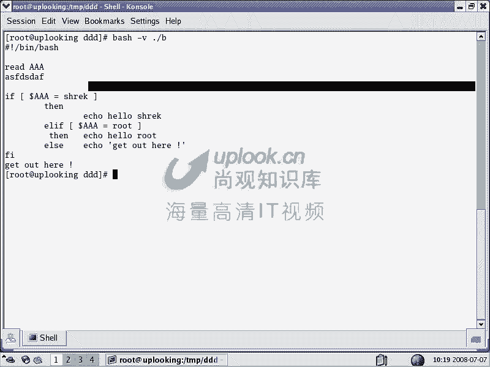

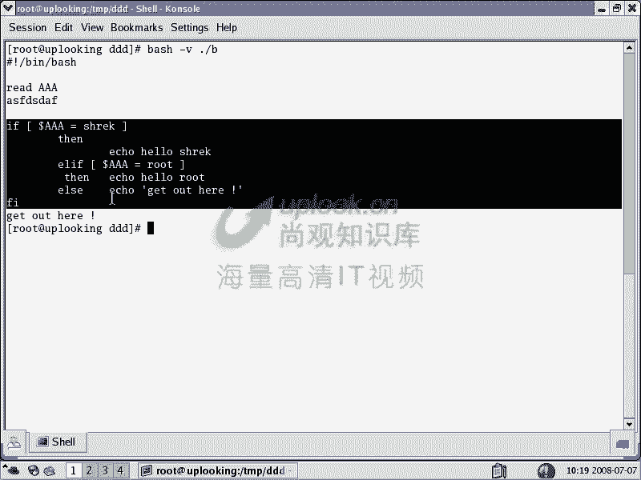

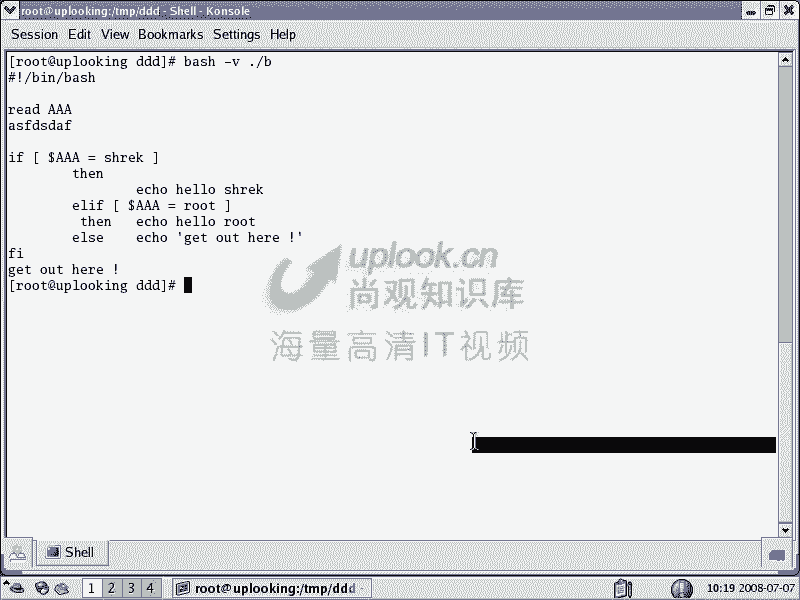

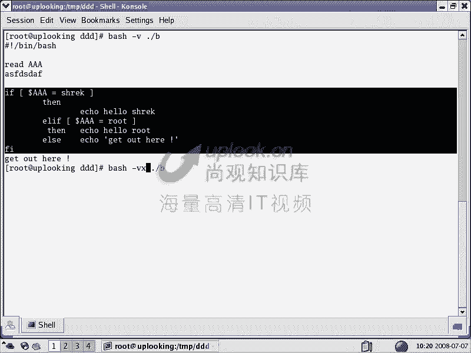

---

## 流程控制语句

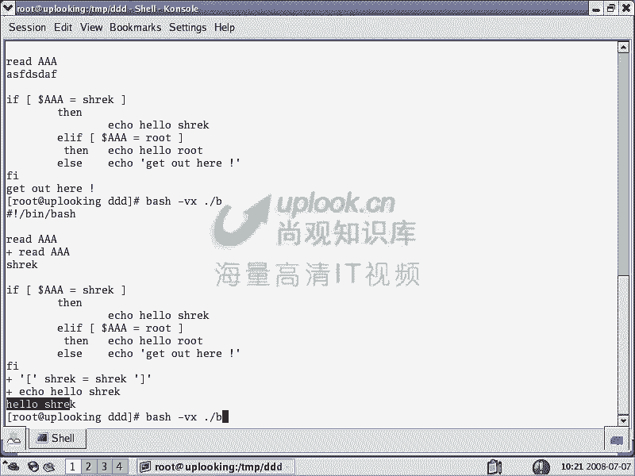

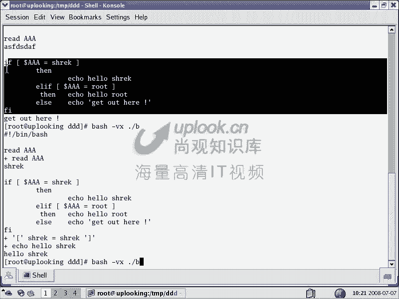

掌握了基础判断后，我们可以构建更复杂的逻辑。以下是Shell脚本中主要的流程控制结构。

### 1. `if` 条件语句
`if` 语句允许我们进行多分支的条件判断。

**基本语法：**
```bash
if [ 条件1 ]; then
    # 条件1为真时执行的命令
elif [ 条件2 ]; then
    # 条件2为真时执行的命令
else
    # 所有条件都为假时执行的命令
fi
```

**示例脚本 (`b.sh`):**
```bash
#!/bin/bash
read -p “请输入用户名: ” AAA
if [ “$AAA” = “shrek” ]; then
    echo “hello shrek”
elif [ “$AAA” = “root” ]; then
    echo “hello root”
else
    echo “go away”
fi
```

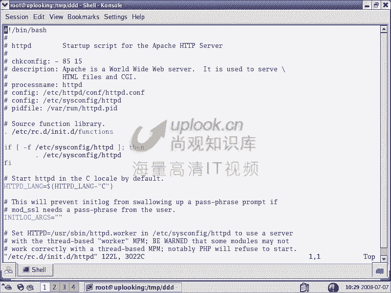

### 2. `case` 多选择语句
当需要对一个变量进行多种值的匹配时，`case` 语句比多个 `if/elif` 更清晰。

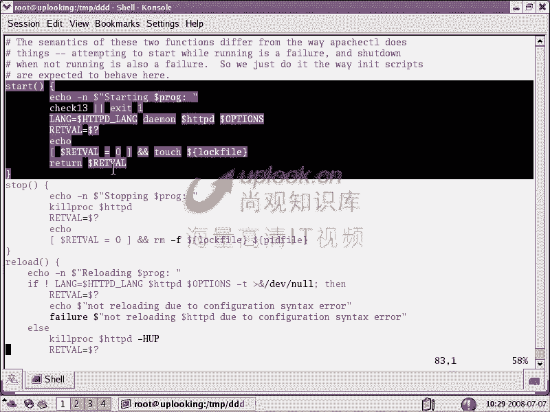

**基本语法：**
```bash
case $变量 in
    模式1)
        命令序列1
        ;;
    模式2)
        命令序列2
        ;;
    *)
        默认命令序列
        ;;
esac
```

**示例脚本 (`c.sh`):**
```bash
#!/bin/bash
read -p “请输入名字: ” AAA
case $AAA in
    shrek)
        echo “hello shrek”
        echo “nice to meet you”
        ;;
    root)
        echo “hello root”
        echo “i miss you so much”
        ;;
    *)
        echo “go away”
        ;;
esac
```
系统服务启动脚本（如 `/etc/init.d/httpd`）中大量使用了 `case` 语句来解析 `start`， `stop`， `restart` 等参数。

### 3. `for` 循环
`for` 循环用于遍历一个列表中的每一项。

**基本语法：**
```bash
for 变量 in 列表
do
    # 循环体，针对列表中的每一项执行
done
```

**示例1：遍历数字**
```bash
for i in 1 2 3
do
    echo $i
done
```

**示例2：遍历命令输出结果（常用于处理进程PID）**
```bash
#!/bin/bash
# 停止所有httpd进程
PIDS=`pgrep httpd`
for PID in “$PIDS”
do
    kill -9 $PID
done
echo “httpd is killed.”
```
**重要提示：** 在将命令结果赋值给变量并在 `for` 循环中使用时，务必用双引号包裹变量（如 `“$PIDS”`），以防止因空格导致的分词错误。

**示例3：遍历文件**
```bash
# 为/etc/profile.d/目录下所有.sh文件添加执行权限
for file in /etc/profile.d/*.sh
do
    chmod +x “$file”
done
```

**示例4：循环固定次数**
```bash
# 使用seq命令生成数字序列
for i in `seq 1 100`
do
    echo -n “$i ”  # -n 表示不换行
    sleep 1  # 暂停1秒
done
```

### 4. `while` 与 `until` 循环
这两种循环在条件满足时持续执行。`while` 在条件为真时循环；`until` 在条件为假时循环，直到条件为真才停止。

**`while` 循环语法：**
```bash
while [ 条件 ]
do
    # 循环体
done
```

**`until` 循环语法：**
```bash
until [ 条件 ]
do
    # 循环体
done
```

**示例：使用while循环进行累加**
```bash
#!/bin/bash
iii=0
while [ $iii -lt 100 ]  # -lt 表示小于 (less than)
do
    iii=$(( $iii + 1 ))  # 算术运算，iii值加1
    echo -n “$iii ”
done
```

**示例：使用until循环达到同样效果**
```bash
#!/bin/bash
iii=0
until [ $iii -gt 100 ]  # -gt 表示大于 (greater than)
do
    iii=$(( $iii + 1 ))
    echo -n “$iii ”
done
```

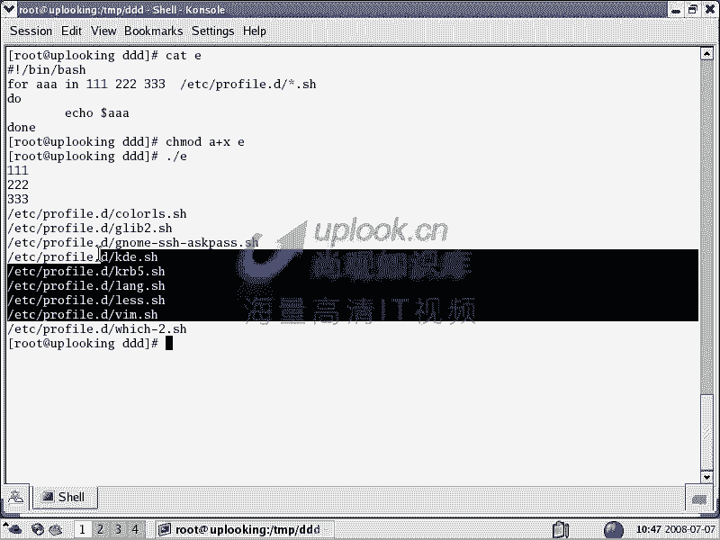

**无限循环与`break`：**
可以构造一个条件永远为真的循环，并在内部使用 `break` 语句在特定条件下跳出。

**示例 (`g.sh`):**
```bash
#!/bin/bash
while true
do
    read -p “请输入指令 (输入’ddd’退出): ” CMD
    if [ “$CMD” = “ddd” ]; then
        break  # 跳出循环
    fi
    # 执行其他命令...
done
```

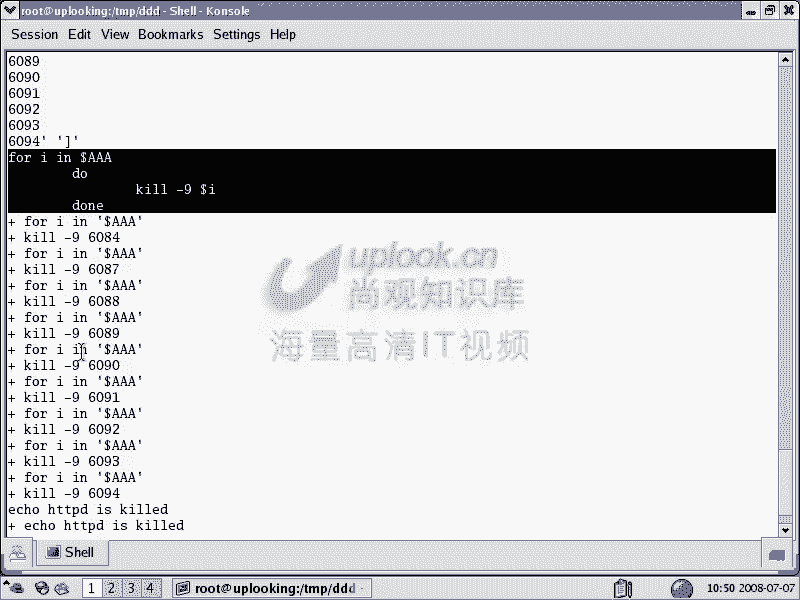

---

## 函数与脚本调试

### 函数定义与使用
函数将一系列命令封装起来，便于重复调用和组织代码。

**定义语法：**
```bash
函数名 () {
    # 函数体
}
```

**示例：**
查看 `/etc/init.d/httpd` 脚本，可以看到 `start()`， `stop()`， `restart()` 等函数的定义，然后在 `case` 语句中被调用。

### 清理变量：`unset`
在脚本中定义的变量和函数，如果担心与后续代码或父Shell环境冲突，可以使用 `unset` 命令将其清除。

**示例：**
```bash
unset iii  # 清除变量iii
unset start # 清除函数start
```
这是一个良好的编程习惯，尤其是在较长的脚本中。

### 脚本调试技巧
编写脚本时难免出错，Shell提供了方便的调试选项。

**调试命令：**
*   `bash -v script.sh`：详细模式，在执行前打印每一行脚本。
*   `bash -x script.sh`：跟踪模式，在执行时打印命令及其参数（变量会被替换为实际值）。

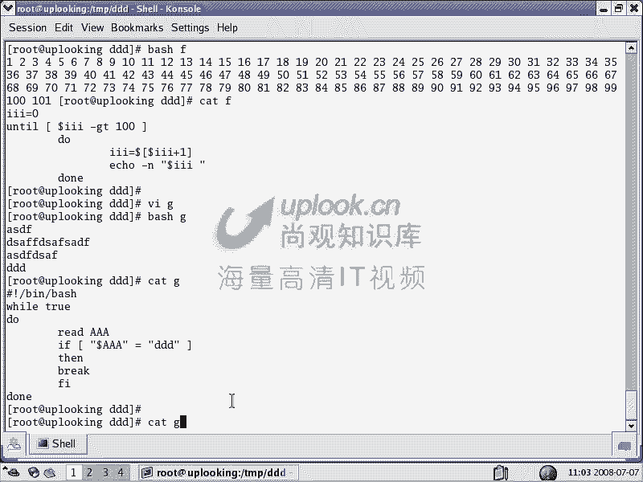

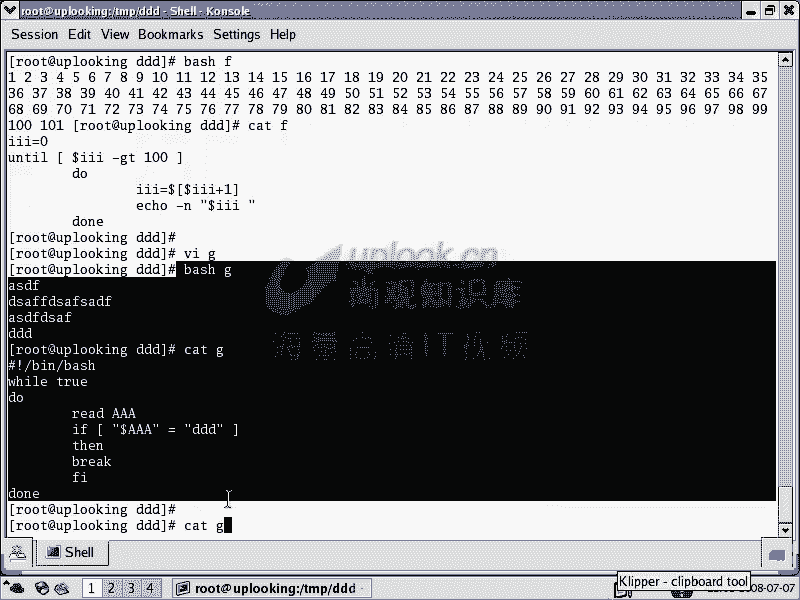

**示例：**
```bash
bash -vx ./b.sh
```
结合使用 `-vx` 可以清晰地看到脚本的执行流程和每一步变量的状态，是排查错误的利器。

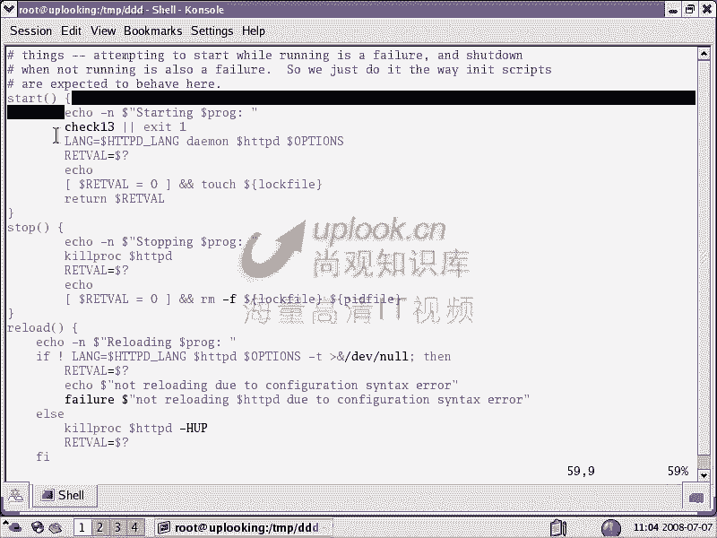

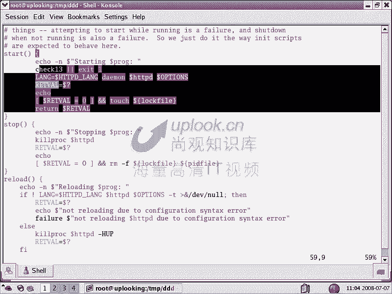

---

## 总结
本节课我们一起学习了Shell脚本编程中至关重要的流程控制部分。

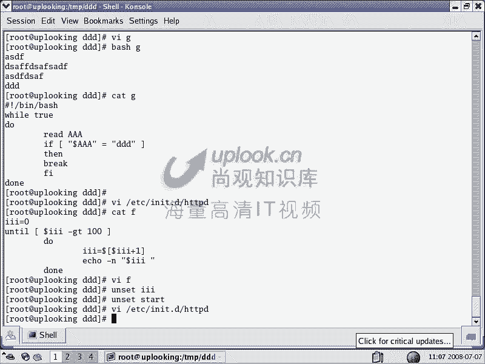

我们首先深入探讨了使用 `[ ]` 进行条件判断的逻辑，包括字符串比较和丰富的文件测试运算符。接着，我们系统学习了三大流程控制结构：
1.  **条件分支**：使用 `if` 和 `case` 语句让脚本根据不同条件执行不同路径。
2.  **循环迭代**：使用 `for` 循环遍历列表，使用 `while` 和 `until` 循环在条件满足时重复执行代码块。
3.  **函数封装**：将代码块定义为函数，提高代码的复用性和可读性。

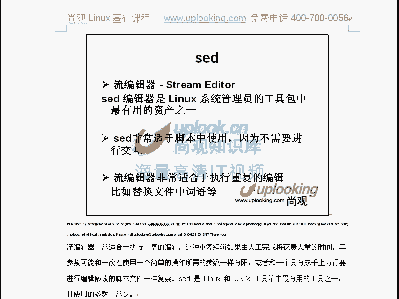

此外，我们还介绍了 `unset` 命令来管理变量环境，以及使用 `bash -vx` 进行脚本调试的实用技巧。通过本节课的多个实例，相信你已经能够编写出具有逻辑判断和循环能力的实用Shell脚本，为Linux系统自动化管理打下坚实基础。下一节，我们将探讨更强大的文本处理工具：`sed` 和 `awk`。