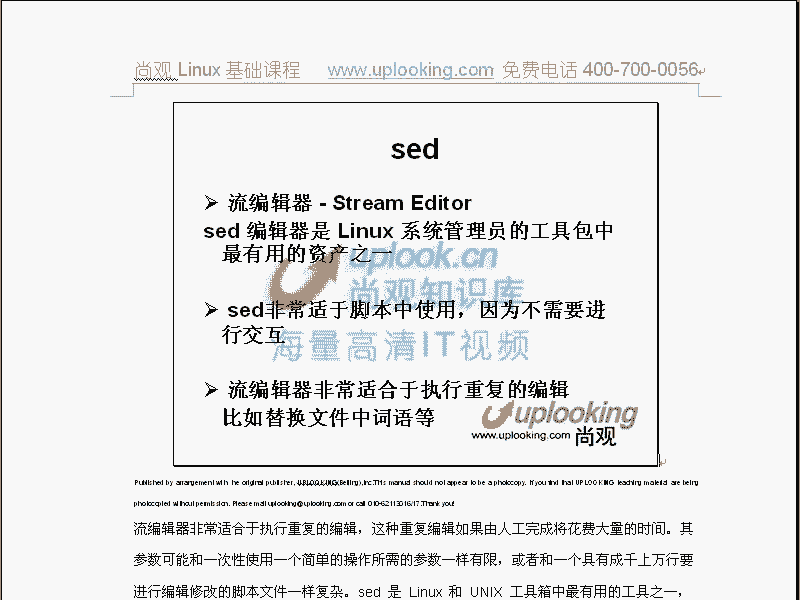
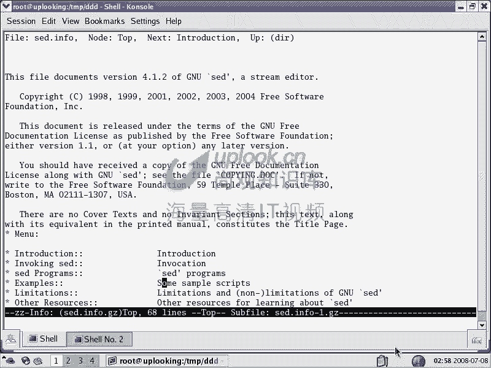
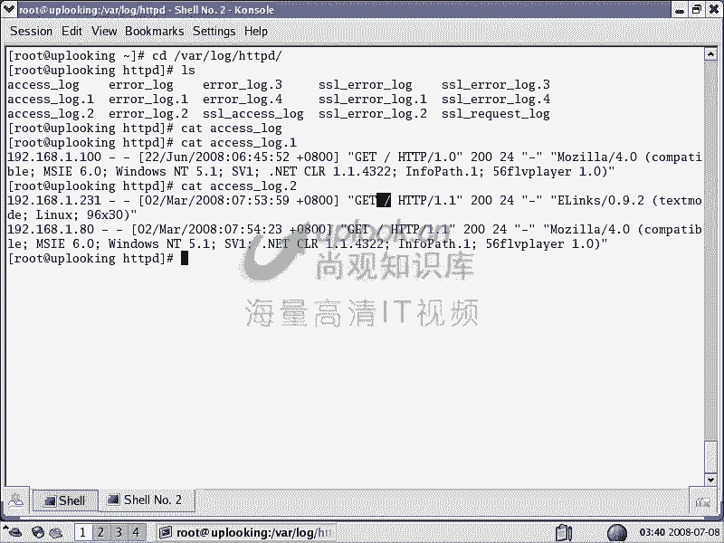

# 尚观Linux视频教程RHCE 精品课程 - P27：RH033-ULE112-14-3-shell脚本sed-awk - 爱笑的程序狗 - BV1ax411o7VD

那我们开始呢shall的第三部分的学习。嗯，嗯那个前面的话确实比较痛苦，知吧？那个我们接下来第三部分的话，为什么要单独分转讲两个命令是吧？前面讲了well啊，什么这种循环啊报循环if判断啊等等。

那你为什么又在这边讲SED单独分一张出来呢？就是分不是分一章，分一个部分出来。因为SD和AWK的内容实在是太多了。嗯瑞y的话，瑞y的话是一个非常知名的，就是国际性的这样出版组织。嗯。

那么这个公司的话呢推出这个呃就是专门有针对SED和AWK的一本书很厚啊。嗯，也就是它本身呢都可以编程的。那么SED的话呢叫做流编辑器。流编辑器呢，我们看这边啊说是lininux管理员当中呃。

这个工具包当中最有用的资产之一，为什么呢？因为看我们在讲编辑器那张还记不得这样的。

你们讲编辑那张话说哎最基本的编辑器实际上不是VI是ED对不对？嗯，EDETC下边什么哈座了是吧？嗯，这样的话呢我就可以进行编辑了。嗯那当时一看哎呀这还是非交互式的编编辑，就是非这个可视化的编辑工具。

那这边呢你看第一逗号第10P。那么这样的话你才能看到。你才能知道这个第一行到第十行是什么东西。你假如说第一行我们进行替换，替换什么呢？把root替换成1rack，然后呢这样的加个P。

那么这样替换完了以后啊，错了。第一行S替换，那么P是不对的。SHRK。G，那么这样直接回车，那么替换完了是吧？嗯替换完了以后才我输入一个一，那你看到这一行的话就被改过了。嗯，看到了吗？

看能啊G的话表示通行当中不管出现多少次都替换。我们刚才的话只替换了一次，你看刚才只替换了第一个是吧？对，这才叫更改，更改完了。你觉得这很很好笑啊，这个东西很好笑。

你说这东西呢它跟编辑器跟我们想象的word什么这种什么写字板完全不一样的，对不对？对，但是呢它后来的话会有一些什么呢？会有一些改进啊，就是说那么之后的话，我们说出现了一个什么分支啊。

出现了一个什么分支呢推了一个可视化的编辑器的分布值对？那么VI的话又演化成什么VIM，那但是ED的话呢，它还有一个分支就什么SED就是说我们的流编辑器。嗯，那么你比方说还是刚才像刚才这样的替换操作。

然后我们这边的话是不是第一行是吧？替换是不是对第行替换，那么SED我这边杠一啊，我要替换替换什么呢？我要把S把此替换成是吧？然后呢这样的话，我把ETC下的那么如果我后面没有加G的话。

它就只替换第一个字符那第一个单词那么刚才像这个地方的话是由有多个单词看到吗？一个单词两个单词，那它就只替换。😊，第一个嗯，如果加上一个G的话呢，它就两个都会停了，那么直接一回车。

你看哎这边怎么会一下全都出来呢，是吧？一下全都出来，你看到最上面，那么是不是如此就被替换成srack？对。对吧对，那么这边的话是SED杠E的话，这样的情况。嗯，明白吗？明白，那么SED的话呢。

默认的情况下它全部都会显示出来。那么这边的话呢进行一次简单的编辑，简单的编辑啊。那么我让小赵来猜一猜啊，那ETCR的paword的这个文件啊有没有改动。教下。有没有改过？嗯。

但他不知道如此切换成sha吗嗯，改过了吗？拣得咩。嗯，可能没有吧，说的好啊，确实没有。因为的话呢，你在这边替换完了以后，它只是给你显示出来，它相当于一个过滤器。嗯，输入源是这个文件嗯，输出源是什么呢？

是屏幕啊，它给你显示出屏幕显显示到屏幕上了。所以这个时候的话呢，你再看这个本身这个文件的话是没有任何更改。那么除非怎么样呢？一般情况下你这样输出重定向成一个文件是吧？对，然后呢再需要编程的方法再怎么样。

把这个文件。copy上ETC下的pa这样倒一下手才行啊，否则的话呢你这个文件是改不了的。嗯，明白吗？在se脚本里面的话，我们应该要这样做。嗯，那这话这到底有什么用？说SED啊，老师。

你说SED的话很强大很好是吧？那你到底对我们来说有什么用呢？它可以在sell脚本里面帮我们去改。某一个文件。你现在想改一个配置文件，你怎么改？你是VI去改，是不是？对，半夜每天半夜都改一次，你受得了。

每天半夜3点钟闹铃一闹，然后你就上去把这个文件改一下，受不了是吧？但是如果要是你有一个脚本半夜运行，三点钟运行，自动去改另外一个配置文件，改一个文本文件，你就可以呢把这个东西用SED写到什么地方。

写到这个需要脚本能源，那么让SED的话帮你自动去做，所以这就是SED的重要作用。嗯，明白吧？明白，所以他按照你的需求的话，你可以做。你要是这样的SD可以做很多事情，SED杠N表示默认情况下。

我就不输出啊，ETC下呢，他做了，我就不不要去输出这个东西。SB杠N杠1，那么单引号啊引起来。那比方说默认圈号我们就不输出。当我发现shack这一行的时候。shack这一行的时候，嗯，P就是打印出来。

嗯，那么体就只打印包含着shack这个关键词的这一行，我要加正何表达式的，我们不是包含shack这一行，而包含shack这个单词的这一行，还记得用中则表达式怎么写吧？

这两杠之间要用政则要用政的表达式政则表达式怎么写？shack这个单词。我想想一想啊，你要想不出来的话，就会遭到毒打。是单词嗯。而家亦。记不记得大于一个小于号。这个表示单词以什么开头，嗯，对吧？对。

那么以什么结尾呢？然后是一个。你啲。还是一杠是吧？嗯呃以一个大于号结尾是吧？这表示呢哎我现在光去显示出包含着sha这个单词的显示出来。那么包含着shack这个字符的啊字符串，那么字符串当中的话呢。

比方说它只是其中一部分，我们不包含，然sha器的话就不会显示出来，对吧？嗯，流量的回车。你看是不是只显示一行sha的话就不不显示出来嗯，是吧？因为这个单词的话是以QIE结尾的嘛，嗯，对不对？对。

这样的话呢，我们就可以在这个条中正策表达式了，明白了吗？明白了啊。一呃，大家等我一下，我把那个小赵干掉，再再给大家继续讲啊，开个玩笑啊，就是说他又忘了，他忘了。所以这东西呢翻来覆去的话。

你不断去听两遍啊，你就熟了。但是说你只听一遍，像小赵这样的话，跟着我这走一轮，他只是有这个印象。那你不用的话，你就没这个动力去学。但是你现在用的话，你就可会把当初学那些东西翻过头掉过来的话。

去掉到脑子里面去搞清楚，明白了吧？明白好，那就这样。😊，那SED的话呢可以做很多事情。你比方说哎我呢现在想把这一行的话呢，包含着shap这个单词的话呢，删除掉啊，我把这个杠N去掉。啊。

比方说不要的单词了啊，我就包含着什么但ash删除掉删除掉。那么这样的话，我直接回车。那你看到剩下的这一些行的话全部都看到了吗？嗯就去掉了，看到了吧？那么也就是刚才我们是做了提样，第样的话是什么呢？

第样的话是替换对不？杠E表示我要进行替换杠是杠E表示我要后面要执行某一个命令，执行了什么命令呢S是替换明白吗？明白那么也就是这样的方式的话呢就进行了一些就是他自己的这个相当于他自己给他自己下命令。

也就他他可以接受什么S这个命令对不对？那么S是不是替换那么D的话是不是删除啊嗯是吧？然后呢这个的话呢是P的话是打印看到吧？P的话是print嘛，打印打印和杠N的话呢是结合在一起的杠N的话是默认情况下。

我不要把它显示出来。那么只有在什么时候的话才把它打那个显示出来呢。前面这个条件的时候嗯把它。把他那个做什么是吧？对，那么现在的话我们比方说再有刚才这个啊。我现在不是P打运了。

我是说把含这1X个单词它进行替换，替换成呢？替换什么呢？把那个呃be呃把那个悲啊啊替换成什么呢？no love in。

OK大家看一下大家看一下这个地方哎错了。😊。

不好意思啊，刚才有些杂音啊，那现在看一下这个地方，就说我刚才呢进行了一下这种呃操作，SED的话呢，默认圈不要打印出来是吧？对，只打印什么行呢，包含着我这样的一行是吧？这行的话呢，我列出来以后的话。

我同时进行一下替换是不是有多个命令P和S命令是不是都用到然后呢把1个替换成什么noble那么之后的话，你看到这边就是并且ble所以这时候的话你再去怎么样你再去把它输出重新下成一个地方。

是不是它就我们就可以把它进行一些操作是吧？进行一些操作，然后再把它修改保存回去等等这样操作，所以这时候呢你就非常灵活，也就是说我们SED翻过来调过去，实际上再讲什么？

就是在讲当我们遇到这个文本在ll里面需要改这个文本的内容的时候，需要用的SED那你可以符合你的指定条件的这一行列出来，然后你单独怎么去改是是就这样的话就完事了。那么这时候的。我们比方说要把它改一下。

那么我把这个地方P的话去掉啊，改成G是吧？嗯，然后呢呃把这个杠N去掉。那么现在我想改ETCL的pas错了，那我在需要编程里面的话，可以这样的把它输出成定下成什么TMP下的A这个文件是吧？对。

然后呢再去copyTMP下的。A这个文件copy成什么呢ETC下的还这一回车，是不是这个文件就改改动了。对，那么下次的话重新启动呃，下次的话，你再去你比方说第二天早晨起来啊，你去VI这个文件。

哎一看哎它已经改过了。嗯，是不是对，就符合我们的期望的话就改过了。所以这样的话呢就是你可以进行替换啊，可以进行什么打印，可以进行什么删除等等这样的操作，明白了吗？明白了。好。

那比方说啊我们再再做一个例子，比方说现在的话呢呃我在另外一边啊，我现在在另外一边。那么我们现在这样的VI啊ETC下的。GU啊SQUID当中的SQQUID点com啊，打开这个文件。

这个文件里面的话有大量的注释，对不对？嗯，对，大量的注释。然后呢。我这样的SED我想把注释全部都取消掉啊，那么当然用GIP可以了。嗯，那我这样的SED杠E然后呢去怎么样呢去进行一些删除。什么样的删除呢？

以井号开头的删除掉是吧？嗯，你井号开头的这一行是不是删除掉对。啊，那么这样呢ETC下的SQID当中的SQID点com对吧？对，那么这样的话就是一些空空行还有一些呃一些这样字符。那么它的速度的话呢。

显然要比那个什么要快很多，就是要比GLEP要快很多。GLP是最慢的AWK和SCD的话都会有优化的这种算法。所以的话快很多。那我这边再想做一个操作杠E然后呢再去用单引行，那么是不是我把空行也要删除掉。嗯。

对，那么这样的话就是两杠是吧？当中开头就结尾的行，是不是就删除了对这样直接回去。是不是也可以实现？可以啊，那么这样的这个文件，这个文件原本有多少行呢？这个文件原本有多少呢？你看现在的话是这样多。

那么原本有多少行呢WC杠L这个文件。原本的话有3400多行是吧？对，那么经过你这样处处理的话，非常快，那么变成30多行。嗯，非常快。那么现在我们看一下经过我们处理的话有多少行WC杠L多少行呢？35行。

也就是说缩减了那么多，而且速度非常快，这些呢都不是以井号开头的，对不对？对，而且把扣行删掉了。嗯，那么这里就非常方便，而且呢你看这边后后面的话有井号呢，都没有被删除掉嗯。

这就是我们的一些应用，对不对？对，那么现在我们这样的把它复制过去。那么这边的话，我们看SED的这些用法。

S是一的这些用法。嗱。这是刚才我们列出来的。嗯，那么会不会杠E的话表示我要执行后面的命令是吧？对，单引号当中的话是我们的命令命单引号当中是我们的命令S表示替换，后面这个G的话呢，表示我全一行当中。

不管出现多少次，我都要替换。嗯，那如果要是没有这个G的话呢，它只替换第一个对吧？对，然后呢，接下来这边杠E这边的话又是执行命令，执行什么命令呢？这两杠啊，就是说在这边是直接一个S开头是吧？对。

那么是S开头前面的话还可以加两杠。这两杠之间的话呢是这么多表达式，说我要匹配什么样的行，我才会操作。匹配什么样的行，我才去操作什么东西。那么现在的话就是说匹配悲笑的有悲笑的这样的关键字的这一行。

我就怎么样删除掉。那么假如说有悲笑这样关键词的这一行，我就要替换该怎么做？替换在后面应该是。有ba shell这样关键词的这一行的话，我要替换掉。那你可以这样的，在这个地方的话呃。

你就有悲 shell的是吧？对我就要替换，对不对？替换什么呢？我把呃比方说把这个。12是吧替换成ro是吧，G这样替换掉。那么也就是说你刚才这边的话是讲的一个命令是吧？S是吧？实际上在这个命令之前的话呢。

你可以用两杠来表示的是一个什么呢？匹配什么样的行进行操作。那么这样一回车的话，那么就是说整个这个文件的话全部都过去了。那么但是呢有这样一行的，那么变成什么ro是吧？这样的话呢，就符合我们的要求。

当然了你可以加什么正则表达式，对不对？嗯对正则表达式，那么这样的话就是说我们弄清楚了它的这个基本的结构杠E表示我要后面是命令了是吧？杠一后后面是命令了，当一号当中的话呢，你可以直接加命令是吧？对。

也可以呢前面加上两杠之间加一个正则表达式，表示匹配这个正则表达式的。我要执行这个命令是吧？执行S的话呢是表示替换执行D的话是表示什么。

删除是吧？对S替换的话是这样的一个方式，对吧？对D删除的话，就直接加个D就好了。嗯，然后呢，当你跟杠N去同步，就是同时运运用的时候呢，杠N表示我默认情况不要输出。嗯，那么当你加上一个P的话呢。

表示只有加P的这样的一个才会输出是吧？也就是说匹配这样的和的和符合这样的规则的这样的一行，有这样的内容文本的这样内容的，那么我就怎么样输出输出P。所以它呢我们现在讲了几个啊，一个是S，一个是P。

一个是什么D第删除，对对吧？这个呢就是我们的一个基本的用法。SED的基本用法。嗯，明白了吗？明白了。所以这段的话呢，大家仔细看一下啊，大家的话仔细看一下，那么可以稍微停一下啊，可以稍微停一下。

可以仔细看一下。OK我们看下面。😊，那么SEE呢在非常适宜脚本，因为不需要进行交互，嗯，对吧？对呃。

重复编辑，然后呢重复去执行等等。那么SED的使用的话呢，你看这SEDS替换是吧，替替换把旧的值替换成新的值是吧？嗯，或者后面加个G是吧？嗯，那么如果要是你进行多次替换的时候，你可以用多个E。

多个意义的话来进行做杠一是吧？嗯加个单引号，然后呢再加杠一，然后再加单引号是吧？对，也可以这样的，也可以这样的。那么你可以加分号表示什么呢？这个命令结束了嗯啊，前面命令结束了也可以这样。

那么这是它的基本的使用。然后呢，现在我们看。

すこ。

呃，还有呢就是他说三种方式去实现多个命令人，看他这样的一种方式啊，也可以实现。啊，大家看这样的话，回车回车两个字他也是可以的。就是说你在这边的话多一个回车。

实际上这个回车的话就相当于一个分号嗯嗯分相当于一个分号，就相当于这样的符号，然后呢把它呃去掉啊，这是一样的，是吧？对。是一样的，我总是想按一啊，然后呢。

那恢复成原来这个状态就好了，是这样的。嗯，然后接下来的话呢我们再看一下，那么你可以呢就是说前面它叫正州辖式，也可以加上一个行号。第一逗号2呃，一逗号十0就是第一行到第十行进行替划。

那么如果要是说起始行，然后再加上一个步长啊，起起行步步长为2啊，那就是说从第一行开始，步长为2，那就1357这样的也可以用正策表达式。刚才我是不是反反复复都在给大家说这个地方是正格表达式可是吧？

你这前面还可以加上一逗号十，第一行到第十行嗯，一波浪符号2，那就是说第一行第三行第五行和第十行，明白吗？就是在这个地方的话去改的。那么这就是我们SED的话，指定哪些行可以用是吧？对。

O我们再看那么SED呢脚本SED脚本的话呢，实际上就是说我执行多次SED的这个命令。比方说S也好，D也好等等。那么假如说我进行一次多个就是同一个文件的话，进行多次的这种操作，进行多次操作的话，我们这样。

你看假如说我们进行多次操作这样的，那么都进行多次操作的时候呢，我可以说呃先把指定的打印出来是吧？嗯然后呢进行一下替换等等。那么我这样的呃。比方说我需要两次吧，SED啊，那么首先杠一，那么呃杠一。

然后我这样的话可以加两次。比方说把如此是吧，替换成sharack是吧？对，那么我这样的呃我要进行替换，把如此替换成sharack。然后同时的话呢把。S替换把dash替换成no loging，对吧？

嗯那经两次替换对ETC的pasor嗯，这样的话是肯定可以的。北笑话全部都替换成nlog game了。对吧没有一个是悲伤啊，全都是包包给。那我这样做完了以后。我这样做完了以后。

那么我还可以呢去VI一个文件。VI一个文件的话就是什么呢？SSS这样的文件。那我把刚才那两行块加在这里面去。那比方说S。S我要替换替换什么呢？把如此替换成s啊，然后呢再去怎么样，然后再去替换。

把dash替换成什么呢？no log是吧嗯。然后呢，这两个命令的话输出在这个地方，然后SED加上一个什么呢？杠F然后呢，SSS然后呢对ETC下的pass这样去做，那么直接回车，可也可以做。

跟刚才的结果是一一模一样的嗯，对吧？对。它就相当于我们执行了这样的一个命令，嗯，对不对？对，这个就相当于你把后面的比较复杂的这种事情。那么写到一个文件里面。嗯，这样文件里面的话呢，它是一行一行去执行的。

相当于做了两次，对吧？对，那么一行的话一个一行一个，这样的话可以让SED相当于先执行这个命令，也就是先执行到这个命令是吧？对，然后再执行这个命令，再执行这个命令。嗯，一样的，对吧？对。

那么这就是我们的说SED杠F可以指定1个SED的脚本这样去做。还有些人的话呢比较习惯是这样的。你要说呃。我现在不太清楚成不成啊，比方说SS。S吧，那么这里面的话，我这样的。记得是要脚本嘛？

嗯是要脚本是不是以井选叹号开头是吧？对，井感叹号开头，我这边的话运行的不是被视，而是什么呢？并且在SED。我看一下啊。我看SED再来并一下是吧？嗯，然后VI它并下来SED是吧？对。到F。

那也就是说相当于我执行这个脚本的时候，就执行了SED杠F嗯，明白吗？明白。然后呢，点杠SS。嗯，这也是一种执行方式。当然很多人的话可能看的不太清楚啊，catSS。你看那这SS的话。

我这边是警感的号表示我要调用什么，并且的SEB1个F是不是？对，那跟刚才不一样，刚才是怎么呢？呃，我刚才的话去写S呃，就是那个SS这个文件的时候是非常简单。刚那我这样。我去掉。

那么最开始呃就说最开始的话我是。这样是吧？对我是SED。杠F，然后呢加上这个S一是吧？ETC下的。那么后来的话呢呃我说呢这样的话就相当于你说了1个SED，然后呢，杠E执行两件命令嘛。

第一个命令是S把1呃把如此替换成1是吧？对，然后呢再去怎么样呢？再进行一次替换，再去单引号替换什么呢？把杠替换成no是吧？对这就相当于这样去做了。这相当于这样做他是一样的。那后来的话有个更进化了。

把这个SS的话这样来做。那么原来的话你还需要输入到SED杠F是吧？对，加上这个文件是吧？现在的话我直接把它变成个笑脚本，这个笑脚本还记不说我们可以指定他一个什么呢？指定他给一个角色是吧？

对原来这个角色如果是的话呢，就是的脚本，对如果要是呃比方说如果要是小乔的脚本的话呢，就是小乔脚本是吧？对如果要是梁朝伟的梁朝伟的脚本对吧？现在是SED的脚本对吧？对，那么他们会自动调用什么？

并且把SED加杠F去相当于执行什么？并且的SED杠FSS然后呢，我现在执行这个的话，就是什么SS什么呢EPC那相当于执行了什么啊，相当于执行的这个。对吧相当于决定了它。那么这样的话呢也是一种方法。

很多人的话呢也习惯这样去使用。嗯，咱们看到这里面好像哟这个脑子好像转不过来了的，感觉好像挺奇奇怪奇妙的，实际上这个东西呢，习惯你慢慢习惯就好了。那么当你去知道这样的一个东西以后。

你就比别的人的话要强很多，但是你说老师我就是不知道，就不想学他，那怎么着呢？没问题啊，随你是吧？你要不知道的话，你用其他方式能实现也是一样的。嗯，是不是？对你完全没有什么呢？没有必要说一定要这种方式。

悄悄道路通过难是吧？对，就这样一种情况，所以呢很多时候在考虑你的这个想象力，你的想象力强，那么就非常强嗯，明道吧？嗯。

好。呃，那么这个呢就是我们的说SED的话执行这个呃文就是执行这个脚本的这样的一个使用。这个SED执行脚本的话，比方说它这边是第一行到第十行删除掉是吧？然后呢再去进行个字什么什么替换。

它可以完全把这个东西的话，写在一个脚本当中是吧？嗯，写在脚本当中。

那么D的话呢是删除什么？呃，删除前面那行，5D的话表示删除五行啊第五行的这个资料。然后呢，什么apple d的话就是含有apple这样的去删除掉，这是一些字符的使用是吧？嗯，那么它这个这样的表达是吧。

apple到orange。

这样的两行之间的全部都删除掉，它是这样的一个表示方式。嗯，这边的话呢还可以去建立函数啊等等。

那么SED加F，然后呢可以指定一个脚本文件，然后针对这个文档。呃，文档在这儿处理的文档在这儿。嗯然后呢，这个脚本文件你给他用杠F指定这个脚本文件，然后呢去让他去处理啊，这就是我们的SED啊。

这就是我们的SED嗯，然后呢我们再看一下AWK。

SED的话呢，它实际上还是非常复杂。还有很多东西的话让你去自己琢磨的。嗯，对，那么最好的办法的话呢，还有系统当中它有个免费的教程是这样man啊manSED你是清楚的是吧？对，那么实际上呢in。

SED它非常好ED非常好。你进去以后的话呢，你可以看到它各种这样例子看他说简单的这个简单的脚本的例子，道吗？直接回车。我说info的话，它可以去怎么样呢？有信号的地方。

它可以直接回车的那比方说用用SED来实现什么呢？WC杠2的功能统计行号的功能那么直接回车，那他告诉你说SED的话，想去实现那个这个功能，那你就把这个脚本这样写就好了。杠NF就好了。嗯，明白吧？

明白那shift也就大写的U它就回到上一。那么比方说你想让它实现什么呢？t杠S的功能，或者说呢UIQ杠U的功能，比方说t杠S的功能直接回车进去，那么它这边的话是怎么用这个脚本的话呢，也会告诉你明白吧？

明白那么推出来，这就是D我们解释这个SED的话，讲的还是非常简单的，就是一般基本的使用，但是如果你干更深入的去使用，你可以看到例子这个例子。

好地方就是inleSEDinferSED里面有各种各样的小例子，你可以看它的这个基本的使用，嗯，从这例子当中上去学，嗯，明白吧？明白。

OK那我们看一下AWKAWK的话呢是一种处理文本的编程语言工具，它的功能的话我感觉要比SED要更强。它处理这个文本的话呢，它的它是更强的。也就是说呢它除了具有SEB的功能之外，还有其他功能。

也就SED非常适于去做什么事呢？就是说这种一行一行的事情。嗯，我把这一行的话呢进行处理。比这一行打印出来这一行的话进行更改是吧？那么也就是说我们在比方说ETC下的password里面那样一行我该怎么做。

可能用SED的话比较方便的处理。但是呢在我们的这个AWK里面的话更强。那AWK特别适合于做什么呢工作的，做这种工作，它除了处理行之外列它也可以处理。你要 check。

你看啊这时候你能看到每一个服务在每个地方打开或者关闭，对不对？嗯，那我们看现在的话呢。现在这样的一行，我们用SED是不是可以处理的？是，但是呢现在我们多了个列，然后第一列是这样的内容。

第二列是这样内容是吧？对，第三列是这样内容，第四列是这样内容。那我想问一下party到底现在是还是of我用脚本来告诉我是还是of那这样话可以用AWK来做。首先呢可以用check刚是吧？交给谁呢？

AWAWK拿到了以后的话呢，你可以去进行操作。那么是单引号引起来表示我要进行AWK的这个命令了，嗯，那么不要被 shell所干扰是吧？单引号里面东西sha要是不会碰嗯对吧？那我现在要进行什么呢？

我呢现在呃去。诶。Print。一个。好不好推。到了。呃，4。大括号大号。然后呢，这样回车，那你看到就是什么呢？每一个是吧你给我的这个输出，每个的level2是吧？嗯，对，也就这是第三行是吧？

那么离我这个第level3的话还差一点是吧？对，那么我说运行级别为三的时候是暗还是off，那我这样的。do了5是吧，那么运行级别V3的时候是off还是off就出来了，对是不是？那我在这边的话呢。

还可以再去加一些。比方说。啊。IF。如果doer一。等于。诶。如果高了一等于。HTTPD的时候，那么。都处打印。如果到了一等于HKPD的时候，那么我再去打印。一。Yes。系。这样写法对啊。

这样的写法不对。稍等一下。OK刚才出现这些问题啊，但这并不是这并不是就是说呃偶然的啊。就说这种事情的话，大家经常都会遇到。就是你在编一个少脚本的时候，你首先在做的。

你感觉语法的话好像哪个地方哎怎么就不对，怎么总是出现问题。但是呢这时候你要通过各种方式的话去试一下，或者说去查一下man配置等等。那么我们现在看呃现在不行，不行的话呢，他没有反应，没有反应。

我现在是想把，它到底是暗还是of在运行级别为三的时候是暗还是off。嗯那么我打印出来，这个大家可能现在还不知道我们运行级别这些东西，到时候我会跟大家说，那么现在到底怎么回事呢？我这样的啊。我得写出来。

这样吧。这边是加个双一行。还是不行还是不行的话，我看。如果 dollar了一，然后print dollar了5。如果要是现在这样子不行的话，很难有问题。感し？到底脑有问题？哪有问题呢？看一下这个地方。

我把这个if的话去掉。佩可能只能在那个发了房，哎，OK现在出来了。看如果要是doer一 dollarer一它是表示第一列，咱们看一下che on这个。刚刚list是吧，就。

那么它第一列是是是不是这样嗯对ache是吧？等等这样的，第一列是表示服务的名字。第二列是表示运行级别为零的时候是暗含of运行级别为一的时候暗含运行级别为二的时候暗含是吧？

我现在想看运行级别为三的时候暗还是但是呢我需要的话就是是HTD所以呢大家看到AWK的话适合于做什么呢？除了这一行的操作之外，它还能看每一行当中呢，以什么作为分割服是吧？那么说第一列是怎么样的条件的时候。

那么第几列是怎么怎么样。嗯，那么也就是说它除了这一行之外，除了这一行之外，它还可以针对什么？这一行当中的这个纵列是吧，对进行这个操作。那么第一列应该是刀er一对不对？第一列er一第二列是什么？

er2第三列3等等这样的话去看那么于是的话我们看到这里面的话，我们说er一也就是说第一列的话为什么？HD的时候，那么我们就。打印什么刀5刀5是12345，刚好是什么？运行级杯为三的时候如何如何。

那么这时候呢我看运级为三的时候是2嗯。是吧对，那现在的话我可以通过脚本判断出来我这个apparty是否打开的。如果没有打开，我做什么什么操作，如果要是打开的状态，我做什么什么操作，那我这样组的命令的话。

就可以写在笑聊本里嗯，是吧？对，那么接下来的话，我们说可以判断说如果要是什么哎。if中括号是吧？对，然后呢我说做下判断，然后呢，它等于什么呢？3。那号。按的时候是不是嗯，3冒号按的时候。

那么前面这边的话必须得还嗯这边你可以加个反引号啊。是吧像翻号。对，然后呢如可以按的时候，那么你就可以怎么样呢呃。Then。那你看这个时候的话，我用个if句加在这边是吧？嗯，对 if句写在这个地方。

那么说如果它等于R的时候，那么就怎么样ic ok是吧？嗯当icle ok的话，好像为什么是意义，那你可以把它什么从装下或者把它 check on个等等这样操作再去跟进去。那这样的话在需要脚本里面的话。

你完全可以用AWK来采出来某一列的这样的值，对不对？对，那这是一个那么我们看AWK的话，我们说可以用 dollar一啊，可以用 dollar一来表示第一列对吧？对，然后呢用do二表示第二列等等。

用print的话，这是它的打印命令。嗯，当然可以打印各种各样的符号，当可以打印各种各样的符啊。你比方说现在这样我呢需要把刚才che on啊，这样的刚类似的这种。改一下，那我想给他这样的来输。

前面是这个名字，前面说是什么什么服务。然后呢呃他on level三的时候是on还是off的是吧？那我这样的可以打，那么我圈场这个然后加上1个AWK。我呢可以用单号引起来。那么在我去大于号啊。

我呢去printrentrain什么呢？doar一是第一列是吧？对，然后呢加双引号表示呢你要打印的内容，那么你方说算号空格。那么首先呢doer一是这个名字是吧？对，而这个名字空格on。lel多少？

这边加上一个什么呢？再加上一个dollar。5是吧？对，好像print，那就说。我们这个服务在level三的时候是吧？哦对，是不是？那么这样的话你可以。这吧。你可以看一下。

啊HBD on level3的时候啊，那你完全可以靠双引号等等的话，打印出你各你自己想要的这种状态。对吧对，很方便。那么也就是说刀er一是表示第一列刀er2呃刀5的话表示第呃第五列是吧？

对刀er零的话是表示呢 dollarer零的话是表示整个这一列啊，整个这一整个这一行，就是整个这一列了。那么刀er0的话是表示整个这一行，那你可以做各种各样的事情，你甚至可以做一下什么统计。

现在在运行级别为三的呃这个服务的话到底有多少个就ar的服务。现在我们che on这个呃刚刚list这样的来看一下，我说如果要是预级为3是吧？是ar这样的服务的个数有多少个，啊，我们可以看一下。

那么我可以呢 check到这个呃AWK。然后呢，我这边的话呢是先。他可有三段笔记。begin啊begin的时候的话，我加个税号，我定义II这个变量等于什么呢？等于0。啊，我让这个变量它等于0。然后呢。

在程序之中啊，我先定一个变量是吧？嗯，然后呢在程序运行之中，然后呢，我如果if啊括号。if。哎系系。啊，入if什么的到了。五等于双引号3冒号R的时候是吧？嗯，然后呢，那就怎么样呢？

if如果这个条件满足的时候，那么就让RI。加等于一就是I等于I等于IAI加1啊。然后呢，再这样。And。最后再怎么样？Print。系系。加上一个什么单号线数，嗯，这样直接回车哎，错了。错了。

因然不是不是负值了，两个等于号是判断是否相等。嗯，如果一个等于号的话，判它是负值嗯，是吧？对。36告诉你有36个服务是什么I嗯，那为什么呢？你看再仔细看一下，这个地方我再改一下，可能会大家更清楚一些。

I加等于一等于什么呀？II加1对，这样的嗯，这样的话也应该是36啊，这样的话更清楚一点。那么beg的话是表示我在开启这个程序AWK程序之前，某些运行的命令。那么运行的命令的话呢，是放在什么？

打括号之间的。嗯，然后这些东西的话是在begin的时候运行的。然后呢，中间这个大括号的话表示我在不断的一行一行在处理这个文本的时候，每一行我去执行价值给你每一行我执行的这么列。那这样的结果就是什么呢？

如果要是这一列就是第五列，如果是3R的时候，嗯，那么我就执行什么II等于II加一是吧？对，这样的话呢，原来它是不是等于零了，嗯，那么出现一个R的时候是不是它就变成一了。对，再出现一个的时候是变成R了。

对，这样的一行一行做嗯，那么做到最后的话，and最后的话呢，我去执行一个什么呢？print呃printI，那我把这行把这个变量的值的话，打印出来这样就可以了。

所以这个的话就是典型的一个AWK的这样一个小的脚本嗯。我果这个还不清楚啊。😡，那你就先习惯，一定要先自己去练几遍啊，自己去回这几遍。那么现在的话我想我想问一下啊，就是假如说。

我想现在让你统计一下整个的碑向啊，就说我们在ETC下的password这个文件里面。使用ba shell的这个文件的话有多少个啊，使用背 shell的文件的话有多少个，就是这个用户有多少个。

使用这个用户的这个呃数量有多少个。然后呢呃使用这个背 shell的用户的数量有多少个，那我就可以在这里面这样香港费的是吧？刚到类似，然后呢说begin的话是I是吧？然后呢，这边doer几呢dolar。

嗯。那是第七列。第七列等于。并且呢是吧？对那我这边的话就不是check这个刚list给他了。嗯我后面是不是直接跟的是一个文件，对，那么就是什么ETC下的它是吧？对，如果你不放心的话。

给它加上一个什么小于符号示输入重定项是不是也是可以的对，对吧？对，那么这样的话，我呢如果要是导er7导er7，那么你看到刚才这边的空格是不是作为分割符啊？对。

现在的话是不是这个文件里面是空格作为分割符吗？是不是以冒号作为分格符，对冒号，那么现在我是不是要定定一下这个冒号作为分割符啊？嗯，对，那么现在的话我这边你之前的话，这边加上一个大F。行吧，你冒号都很多。

哦这样应该这样的，直接回车。嗯，你看以SB定的no king开头的嗯，是有31个是吧？对，以悲 shell开头的是有什么7个7个。嗯，那么这样的话呢。

你可以呃通过就是说指定分割符的方法来分割这一行当中的一列一列，因为这这一行当中，它不是以空格作为分割符。嗯，它是以冒号作为分割符的。冒号分割符的话第一列是什么？第一列是。这个用户名是吧？

第二列是它的什么？是否有密码是吧？对，第三列是它的UID第四列是它的GID是吧？嗯，那么当然了，我这样的话去呃控制的时候，那么就跟上面这种以空格作为分割符头就不一样了。嗯。

所以它默认情况是以分空格作为分割符，对不对？对，那现在要记录，我现在想打印什么呢？打印啊。我不想做这么麻这么简单的工作了，我现在的话想去以冒号作为分割服是吧？对，然后呢我这样搬引号引起来办括号。

我呢去printnt。printnt什么呢？printdoer一说嗯双引号。u i d 。E是吧空格，然后呢aler3是吧，第三页不是。这边的第三列不是它的UID嘛？对，是吧？我先把第一列打印出来。

然后再打印第三列是吧？对。ETC现的pas了，对吧？这样一回车，他说哎这个用户的UID是？他这个用户的UID是他嗯这样的话就指定的就出来了。嗯，是不是？对，所以用它去处理的话是非常的方便。

嗯，是吧对，大家可以仔细看一下啊，这边的话是比较多了，大家可以仔细看一下。可以看一下刚才我做的这些操作是吧？对，可以稍微停一下。那么感感受一下。那么这边的话是以什么作为分割服是吧？对。

给G的话是说我在做一切的命令之前，我先定义一个什么东西，或者先做一件什么事。嗯，那么这边的话呢，这个中括号的话呢，是表示我在每一行一行处理的时候，我执行什么命令。嗯，是不是对，然后呢，最后的话呢。

是endand最后这个中号的话就是大块的话就end就是结束了之后，我在处理完所有的一行一行文本，全部都处理完这个文本文件了以后，最后再执行一个什么什么命令，对吧？你可以分成三段的话去做嗯。

这个东西的话也可以写在一个sll呃也可以写在一个脚本当中啊，也可以写在一个脚本当中。比方说我现在这样的VI1个什么ANA这样的一个东西啊，稍等一下。呃，我现在是先VR1个AA这样的东西啊。

那么就是说我现在VRAA是吧？嗯，那打开这个文件以后，刚才是不是这样的begin是吧？对。begin然后呢，接着是一个大括号是吧？对括号当中的话，I等于等于是吧？负值一个等号负值是吧？嗯等于0。

我先赋值一下，然后呢再去什么程序体，是不是？对，就是说在每一行执行的时候都执行这个中间这个括号内容，那么也就是说如果要是dollar呃，如果要是if是吧？对if的话是括号。ifdoar5呃。

比方说doar5吧，等于双引号啊3。R的时候三冒号on的时候，嗯，有这样的字符的时候，那么就怎么样呢？嗯III等于嗯就III加1是吧？对，这样的你如果要这样写的话也可以，那么也是可以做成什么？

RI加等于等于就是C元的写法，是不是？对，这样的话更简单，那么接下来的话就是一个什么呢END是吧？对，然后再是一个大括号。可是吧？对，按按就完事了。嗯，那这时候呢保存下来以后，那么你可以怎么样呢？

呃用这样的脚本，用什么呢？check on贝是吧？对，刚杠listist，然后呢是用AWK杠F，然后来处理这个脚本。那这样的话你。啊，怎么是不行的啊。OK这样弄就好了，对吧？对。

也就是说改这个文件的时候呢，应该beg的话，这个后面这个大括号应该跟本在后面嗯啊。那么这样的话呢，它就可以自动执行。那么这样的话就非常简单了。刚才这边好像也错了，这边又务错了，这边是一个等于号。

应该两个等于号是吧？对，等两个等于号表示是相等。对一个等于号的话是负值是吧？降到36是对啊？对哎，大家看的话，我在做这个调试的时候的话，是错误百出是吧？但是这这并不是说呢这并不是说不可以接受的。

只要你最后执行的这个脚本啊，是真正能完成你的任务。并且你反反复复实验出来。那么你看我们在第一章到第十4章这样的讲授的过程当中，你每一个参数每一个东西都记得非常清楚，那我真的是太佩合，你比我强多了。

是不是这样？对，所以他呢也不要做那种呃就是说不要要求自己的话做得出那种超人做的事情啊，这个不太可能，但是呢你在经常用的时候能想到它，能知道他是怎么样一回事，这样的话，我就我觉得你应该可以了。

嗯你可以达到我这样要求的这种效果，对吧？对这个就是我们这样的一个作用啊，那么。大家看AWK杠F跟那个SCD是一样，是吧？可以直接去写这样的一个脚本。这个脚本的话呢，前面一段中间一段，后面一段中等等对嗯。

那么这就是我们的AWK的使用。那，大家可以自己看下，这也是简单的使用。嗯，并没有说深入特别多。那么同样你如果要是想看一看的话，你可以用什么de讽刺来看一下AWK的这个配置啊。

嗯那么通常情况下大括号内的话，包含着操作train的话是一种，还有其他的它有其他的函数呢，然求和啊等等求分因数啊，它还有其他的函数啊。

那么AWK号直接单引号，那么加input文件是吧？单号加input文件或者AWK杠F指定一个文件，然后呢处理个input文件。这是我们刚才都操操作过的。那么这边的话呢，它可以用两杠，这跟SEB非常像。

用两杠的话呢是表示把还有这行列出来，对对吧？

就跟那个SB非常非常像。那么这个呃这边的话也是刚才我做的一个说do了do了5等于什么32呃3括号的时候怎么怎么样操作是吧？对，这样一个操作。

那么如果使用大量的原始数据当中产生报告，比方说你分析日志啊，你说啊这个东西老师你说的这些东西我觉得太没有用了，一点用都没有，怎么怎么没有用呢。你看一下这个呃，我给大家举个例子啊。

这个例子的话呢我是经常用的。你比方说呃你用AWK去根日志。那么我们到哇下的log啊，不一定非是这个日志的。嗯比后到这个里面的话，你可以看到一些呃一些日志，你方说ca一下access。

哇。嗯，你看比方说这是一个日志，那么现在我们分析出来说什么呢？要求2168。1。231是吧？嗯，对这个来源的IP地址的话来源的话，它访问过你的一个什么什么页面，它访问过你的一个什么什么页面首页对吧？对。

然后呢这个来源的话，是不是也访问过你嗯，对是吧？用z或者是说什么呢？I16嗯呃用I16啊，这种兼就z4。0兼容的这种浏览器的话，访问过你是不是？对，那么这个时候的话。

你是不是要呃你是不是可以根据你刚说我自动话找到的第一个什么第一列是吧？对找到这个第一列这个内容。然后呢，我看一下整个的这个日志文件当中出现过多少次。我是不是能用AWK的话来来呃来算出一个数字？嗯。

比如说这个人的话，要1。118。1。231，他话访问掉你5次，是不是你能得出一个数字数字？对，这个时候就是志分析嗯，是不是对再有一个话，他访问的是你的根是吧？get是根是吧？如果他ge是另外一页位。

那我访问根的话，这边我可以分析这边的话，是不是分析了两次，对，就是访问我根的话，访问了两次，嗯，是不是？对，那我可以告诉你访问根的人有两次，那么这个二是怎么得来的？你是不是可以根据AWK然后呢。

print打印它的第几遍是吧？对，第几页如果为这个的话，那么是看多少次，对，那么这种操作的话非常多的。

所以的话呢高手的话呢就是用AWK用SCED用我们的刚才 shell要编程一些运算符用的非常非常厉害。那你就是高手。嗯，那我们所谓的什么熟悉 shell要编程，就是熟悉这些东西，嗯，明白吧？明白。

那么如果要是再想深入下去的话呢，可能AWK的话呢，你还要琢用的东西更多。然后他有大量的什么的运算符。你要让我们看一下啊，in。

我在刚才的话给大家说说什么呢？我们这些日志分析的时候，很可能要用到AWK嗯，这类似的东西。那当然不一定是appartache日志，appartache日志太多了，嗯，你不须用专门的日志分析工具。嗯。

那么像inle AWK，我们看这里面还有一些什么功能。你方说呃最前面的基本的语法。

这些这些的话是参数啊，这是参数。你AWK能做什么？就定义那些预算符定义那些符号。那比方说判断是吧？你在打印的时候，你可以打印制表符。那它print的时候，我们不是没有print制表符吗？

对用print杠T的话，就是一个制表符。啊，像拿if那就是begin begin是吧？对and还有什么正则表达式都可以用用在这里面，还可以用这种方式的话呢，一个条件判断等等。这他的表达式。

你比方说想让他打打印一个匹配一个空格，这个的话表示空格空格的匹配。杨不想给大家看一下就是什么呢？

啊，你看这些都是命令，那么再打开一个文件，你后我再打开第二个文件，然后print打印出什么样的东西来，print只是一个是吧？对，那么我叫当那种条件发生的时候，我stem我可以执行一个命令行。

那种条件发生的时候，我去响一声啊，你比方说 echocle一个什么告A响一声等等啊。

这些操作是蛮多的，然后呢上面还有一些其他的这种预算服务。比方说这边if是吧，嗯if条件判断，刚才我们用过了吧，对那你还well循环呢，嗯，还有 do well循环呢，do well循环。

还有 for循环呢。但是这些的话跟sha的编程就不一样了。嗯它自己的一个语法，也就是AWP有点像自己的一个什么，有点像自己的一个呃它本身就是一个小 shellll，有点像这种感觉。还可以删除。

那么print是打印是吧？对，delete是删除了嗯，EXIT就直接退出了。嗯嗯啊这些条件的话呢还有很多它 break。跳出这个循环嗯等等。那么你可以在这个AWK里面做各种方式。如果让你直接输入AWK。

那么。那这样的话，你看你现在直接回车是吧？对他不等你等你做操作了。嗯，那比方说print。そ。诶。😊，不是这样玩的，眼砸来了。哦，他这边是等到标准数了，应该不是呃，不是这样的。等待我标本书了。

不是这样的。还是像刚才那样的话是比较对的。AWK这样大写的F。You。好们好，然后呢这边的话呢，你要么加上一个单引号是吧？嗯，把这个预算服务加进去，要么的是什么？加上一个。

F然指定这个刚才最好的这个就是脚本写到一个文本里面。那么也就是AWK的这个操作的话呢，我们给大家介绍的这个地方。然后大家可以自己呢去练一下。那么因为的话这个东西呢。

AWP和SED还有加的那些基本的运算符构成了整个的的这个的编程编程当中也应该包含AWK和SED的，这个的话我们因为有专门的呃就是编程的课那本课的话呢要讲5天的那这个课的话呢。

到时候大家再来自己去呃操作一下。那我们现在的话只是讲一下什么呢？那编程的一个相当于一个入门。啊，也就是说呢但是大家不要怕，当你习惯了那些东西以后呢，是很容易的。嗯，明道吧？

明白就要AWKO那么我们呢它第15章软件的安装啊。

