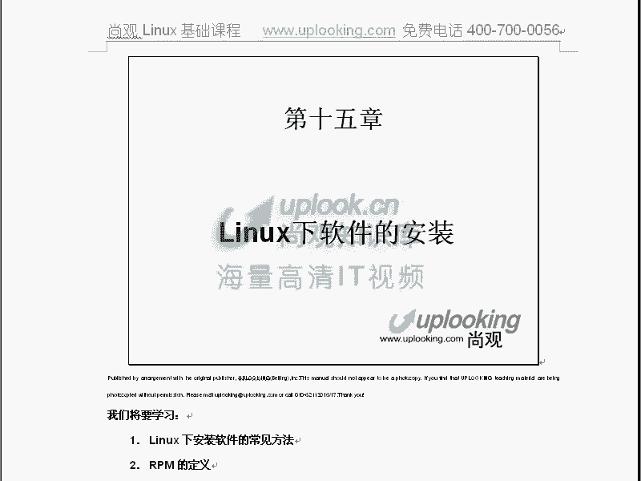
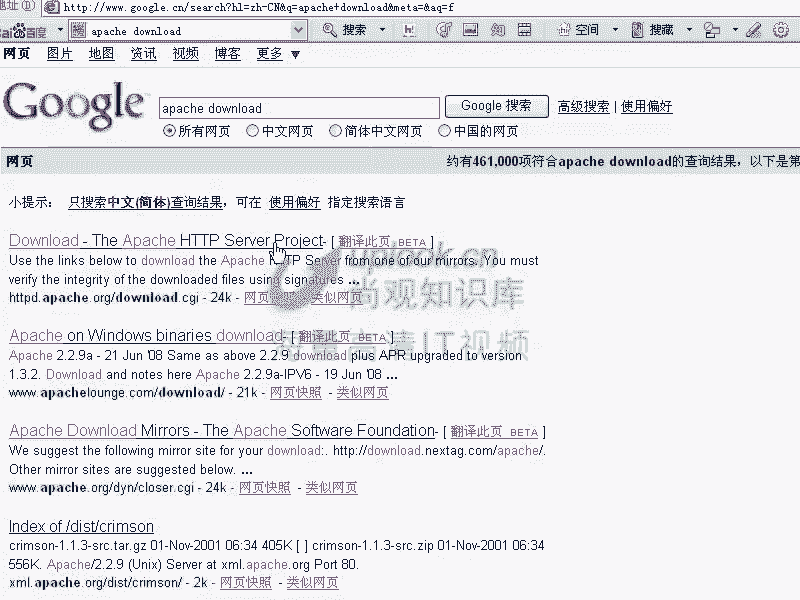
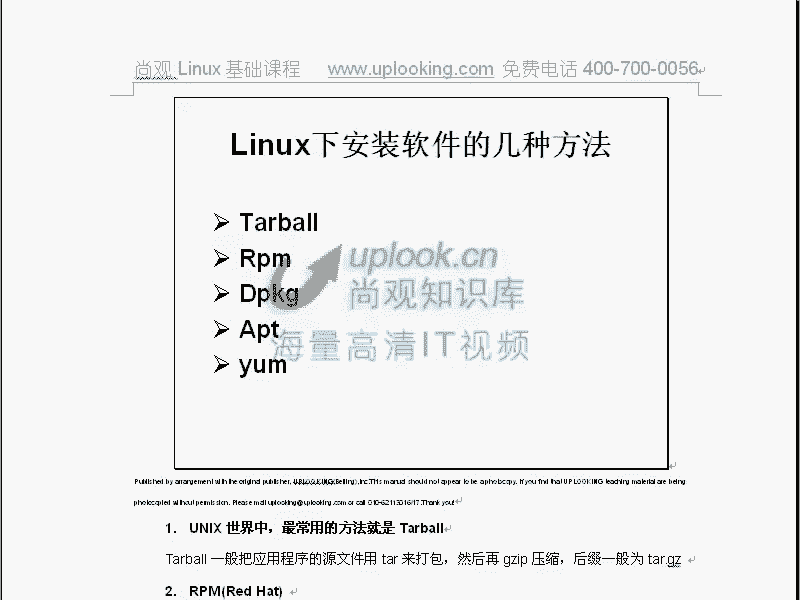
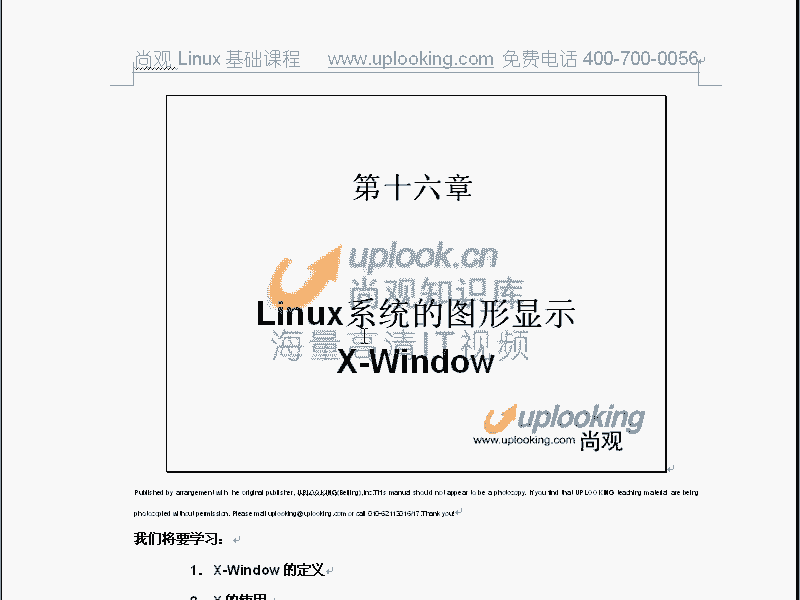

# 尚观Linux视频教程RHCE 精品课程 - P28：RH033-ULE112-15-Linux安装软件 - 爱笑的程序狗 - BV1ax411o7VD

第15章啊小赵啊，我们一块的话呢来讲一下，就是linux set的软件安装。那么实际上windows软件安装的话，你觉得是怎么安装呢？应该就是那种傻瓜操作，双击执行，然后按下一步下一步下一步。

实际上呢在linux里面的安装的话呢，略微有点区别啊，这点它也是linux和呃就是windows的话主要区别之一。因为linux软件的话呢有有很多种。那么你看一下这个。

看这个假如说呢现在我现在得到一款软件，这款软件该怎么装上去呢？那么你首先知道你这块软件是干什么的，这是首先的。嗯那么很多windows下的软件的话，你可能不知道它是就是具体是怎么样一个基理。

那么这时候话你都可以去装上去。对，那么所以windows确实在这方面比wind强太多。但windux和windows最本质的一个装软件的方法的话是什么呢？reux里面的软件啊，很多都是源代码。嗯。

源代码的话就是说我们一看到这个C语言的程序啊，怎么样看呃。然后我们看到了。这个就是说reite的这个源这个reite这个源代码啊，I686。那么大部分呢都是这样的，就是你看到这里面的这个。

比方说文件系统啊，EST3的这个文件系统。こ。那么也就是说这个是make file，这这里面是make file。那么这里面的话并没有太多的源代码，就是说C呃就是re并没有给你带太多的源代码。嗯。

那么也就是说源代码呢，在我们los里面安装是主流的方式，为什么是这样的呢？这个的话要从另外一个角度上来考虑了。那么在windows2的话，你说病毒懂不懂？对。多是吧？为什么？嗯，这多嘛是吧？

但是你要考虑一下病毒是什么？是自我复制自我感染自我执行的一个程序。嗯他可以自己复制是不是？嗯他可以自己的话复制到一台前一台机像，在那台机箱也执行起来是吧？这要求什么呢？就要求你的这个平台啊质量非常好。

你像它在这台机能执行，在另外一台机用相同的方法是不是也可以执行这种windows所以windows下的这个软件的话，它的平台是相对来说比较统一的，那么运行一款软件很容易的吧？

但在lindows下面不一样。linowux的话，两台linux的机器啊配置起来是千差万别的，你知怎么样呢？你现在看一下，因为是吧？最主要的一个区别，它的版本内核的版本是不一样的嗯对吧？

对内核的版本不一样。再一个呢，我现在的话是一个686的版本对不对？那么现在的话你换一台机器，这台机器的话是一个AMD的X864的机器，就是64倍计算这种机器，那是不是它的平台就不一样了它的代码可能就不。

😊。

那这时候它的环境是不一样的，导致你在这边leux编一块病毒啊，能感染另外一台linux吗？不一定嗯也就是说你想让它运行起来都够呛。所以它的linux set的这个就是说这个平台的一致性的话非常差。嗯。

那么就是linux和linux之间是吧？对，那么如果reux和inux之间呢？那差异就更大嗯，所以基本上说的话，uxa或者unixa为什么病毒少，因为编病毒的人太可怜了。编了一款病毒完了以后啊。

让他在这个平台上运行，结果能跑起来。哎，换一个平台就不行了。所以这时候的话我们说一般软件是一样，你要一款软件在这台机上能跑起来，另外一台机上很难跑起来。嗯，所以的话我们可以在一些网站上看一下啊。

比如说我们在。😊，我打开一个网页啊我打开网页，打开apparache的网页好了。

哪怕这是我们的外的服务器是吧？对。哪怕就得下来。而且他这个。还是用google好点，就是说我们在做这个软件的时候，还要提醒大家一点，就是装软件的时候，最好从官方去装，嗯，不要在那个什么。

不要再随便找一个地方。你看这个地方，他说一个apache放那个地方，你怎么知道他到底有没有中的木马？对，很难说啊？嗯，那么在这里面输入apache。

登咯。那你看google给的页面就不一样。google给的话是把那个国外的这个你看阿帕ache官方的网站，你看。

他是官方的网站，你看到这边的话是。HPD点点ORG站开邮软件一定要注意，就是不能乱装软件的。你从网上随便下载下来以后，它的这个C语言的文档给你了，也就是它是一个文本文件。这个文本文件的话，随意可以改的。

我如果把里面的话运行起来加一个木马，你也不知道，嗯，所以一定要从官方去下，嗯明白吧？明白那么大家看这个下载官方，难说我现在是2。2。9的这个原文档下载下来是吧？对。

看这边是inux的源程序，它这边的话就是inux源程序。而windows的话呢，它不给你源程呃，它源程序这边也给。但是呢你一般下载不是这个SRC。你看我这边有个RSSRC嘛。

嗯表示sourcece就是原文档给你什么原文件呢？就是说我把这个程序啊，编的时候是怎么编的，这个源代码都给你。嗯，那么你在拿过来以后，你能直接执行一源代码吗？不行，对，你必须把它编译，明白吧？

所以呢说这里面我给大家看一下啊。这里面是这个样子，假如说呢你在这你给你一个人你给你一个程序。那么这个程序的话呢。よし。嗯。😊，那大家看。给你一个源代码。那比方说有个man是吧？对，这样的一个括号。

这代码比方说有几万行是吧？对，这这些东西的话写成一个什么呢？写成1个AAA点C的文件。嗯，那么在linux下面的话，他直接把这个文件给你一个用户。当你这个用户拿到了以后的话，你必须得用各种各样的编译器。

这个编译器的话，比方说在联特上用的非常多的是GCC。嗯，如果要是你用英特尔的CPU的话，它还有专门的更高效的ICC编译器制编译器。嗯，制编译器。用这个编译器的话呢，把这个CC文件的话，转换成什么文件呢？

转换成可执行文件，可执行文件。这个文件是什么呢？二进制的。可执行文件那这二进制的可执行文件话就可以直接执行了。嗯在windows里面的话呢，这个过程也是有的。只不过呢在windows里面。

你拿到的直接就是什么二进制程序程只后面还加个小尾巴明白了吧？所以他呢在windows里面主要的分发形式是这种形式然后在windows里面的分发。

就在windows里面分发形式这种形式它给你C文件让你自己去编译，为什么让你自己编译呢？因为你的环境是不一样的。刚才我们说那个病毒为什么在这台机器能运行，那台机器运行不起来，因为它你的环境不一样。对。

所以呢在这边的话，你编译完以后就是适应这台机器的环境。嗯，明白吧？明白所以它的这种方式的话，就是我们的什么。源码方式嗯，而这边的方式的话就是直接什么二进制的方式。所以这是什么windows的。分发形式。

而这边的话是主流的什么？window因为系统啊都是用这种方式，嗯明白吧？是其中一个，所以他我们看到这个地方啊，我们看到这个地方，那么ache这边windows下，你如果想要源代码的话，就要这个源代码。

但是你必须给VC之类的东西要把它A没有的话呢，你就不要去下载了。那么在windows下上你去看到这边什么win32的什么。

是吧就是我们的二进制的是吧？二进制的win32的这个程序，是不是？那么就直接下载这个这个的话是可以直接执行的。嗯，那么这个是可以直接安装的。它是MSI结尾的，就是说你可以直接安装的。

而这边的话是不能直接安装的，是VIP结尾啊，解开了以后，你只是看一下，那么在minow话全都是这种形式，看到了吗？嗯全都是这种形式。那么在winowux4里面的话呢，你下载回来以后，你看一下。

比如说把它下载回来。有。

因为我就想要他的链接啊。就是说我把这个链接的话，如果下载回来以后，你会看到里面全都是那种C语源的文档，就是这种什么这种文档，这种文档是绝对不能直接执行的。嗯，所以这种文档的话，拿回来以后的话。

你必然是一个点赞咖啡的making making stop过程。

我还是下载下吧。他保上回来啊。我们下载回来，下载回来以后的话，等一下给大家打开看，那么里面全都是文本文件。那你是怎么样去安装呢？必须把它解开，解开了以后的话呢，编译去安装，编去编译安装，然后才行。

我看一下啊，在雷dow里面也可以的呀。但是说现在这个windows的工具太恶心了，算了，我自己在这边打吧。在这里面打。嗯。Se。呢可以用文本方式，我看这个这个小这个网站的话叫做。或者按下。Elink。

然后。确不定要他这电话机。EHTVD当中的aache。然ORG。我这样的话去访问一下。不行。现在这里面这台机器上拉网。那一会只能是下来以后再看。我本来想给大家看到这个里面的文文件啊，全都是C语言的文件。

然后把它一点点的这样这样改改完了以后的话才可以用改完就是就是说改完你可以改这个C语改完了以后话，你可以点到 making合成那么也就是说非常简单。那么假如说你把这个东西解就是拿到了以后的话。

你可以这样的VFVFZ然后呢，把这个HVD的什么什么这样的一个BZ的这个文BZ two的文件啊，如果是 two结尾的应该是解开的时候，用G是吧？我解开了以后呢。

再C到那个目录下去到HTVD的这个目录下去2点多的这个版本这个目录下去当那个目录下去以后呢，一般都是点到。

现在是。然后呢再去make然后再去makeint啊，这样的话才可以把它呢装上去。也就是这是我们inux下的最常见的安装的方式。嗯，但这种方式的话呢，它总是会出错，经常会出错。

所以他们很多人都特别痛恨这一点。这个时候呢我们看到retite，它就用的是retite package manager，嗯，就是RPM的格式。嗯，这种格式的话在linux里面的呃。

大部分版本里面都是可以支持的那这种方式啊，就跟windows里面是一样的。也就是说它直接就打包的什么东西啊，它直接呢打包的是一种二进制。这种二进制的话在lindowux里面，那么它用什么RPM去打包？

嗯，明白吧？明白这种点RPM的文件，它就打到二面制的文件。那么一般的话，你看到这里面的这些文件都是这种格式，什么什么。

什么什么什么点呃，I386点RPM就这种格式。那么你去安装的时候，就RPM到IVH什么什么什么点I3。八六啊。I386。点RPM这样的话去装的，明白吧？明白，所以这样的话呢，它是非常方便的。

它跟lininux呃跟windows里面安装程序是一样的。嗯，那么在lininux里面是这样装，在windows里面的话呢，是双击它装一下。嗯这个实际上道理都是一样的。嗯，那么马上的话我给大家来看一下。

就是我们具体该怎么样装这两个软件啊，然后我给大家看一下，我要找一下原完程序。好，呃，看一下，就是我现在的话在这个目录下的话呢，当录的全套东西C到MNT下的呃ss呃MNT下的，我看。Yeah。

特别慢CD到南门旗下的。啊是鸟。嗯。

上。U2因为的话这是1个USB设备。嗯，那么我们在这个光盘上，假如现在我C到MNT的HTL4U2就是我们的re给大家原配的那个光盘上。嗯，那么到这个目录下去以后，如果是RTL4的话。

在这个目录下就会有什么呢？就会有re的目录和成么呢？呃re目录所有的RPM包的话，都在这个re目录下。那如果要是在HEL5里面的话呢，这个目录就变成什么serv目录大写的S，大小是区分的。

那现在我到什么Rre目录当中去。那么在这里面的话，CD到RPM。Yes。😊，当这个RPMS弄录下去，那你可以看到所有的RPM包，给大家配的RPM包，就是你在官盘上能看到的全都是经过编译的。

我你怎么看出来是经过编译的。在这里面的RPM包的话都是I386点M这表示呢我针对386以上的CPU的话都进行的什么就是都可以都可以进行适应这所有的386以上的CPU我经过我编译了以后的话。

可以让它在上面都运行起来，只要是386486586，说这些CPU都可以运行起来，所以这些RP包告你是直接可以安装的。那后我们看到这里面的话有一个包，有一个叫做XPDF这样的一个包是吧？

我就可以RPM杠IVHXPDF是吧这个PM包这样装上去IVH的话I表示安装V的话呢是过程可见就是说百分比是可见的H的话是什么呢？就是这条看到吗？这条东西就是HV的话呢是这个IVH。

V的话是这个嗯百分比百百分之多少百分之多少，那么IVH是做这个这样的话就把它装上去了。嗯啊这个包的话装上去以后，全部是什么？全部都是二进制的。嗯，啊，那假如说你说王老师。

你刚才说V二进制的那种伊丽萨常用的包，那我这样的我这样的啊，假如说我单落下来XVFZ啊或者G我现在不太确定的Z的话是针对GV比缩嗯，这的话是什么？丁多G的话是这个。

Bive two的bu two嗯对吧？啊，你也快了，小小芳的话已经被我打死了啊，小赵的话呢也快了，一会儿我去扁他啊，s尔目录下。呃，这是我自己的目录，你们的目录没有啊，那么在呃aarache。

目录下在Apache目录下的话呢，会有大家看这个apache。apache比方说2。0。55啊，我现在演示的就是典型的一个unic的安装方式。那比方说HTPPD和2。0。55这个点它点GD的包是吧？嗯。

放大C。干把C我这样的轻呃写到什么呢？USR下的SRRC那个上去，一般我是这样来做，然后把它解开，我它解开了以后。

就是所有的源代码，你看全都是点C的文件，看到没有？嗯，点C的文件，点C的文件或者是什么呢？点就是一些辅助性的点TXT文件，或者说呃BSP文件啊。

那文件make file文件等等。嗯，make file文件是吧？make field的话，就是点C文件。对吧，多点4面，嗯，这个时候的话呢，你直接去运行它是不可能的。嗯，他给你的是一个什么？哎。

我看我硬盘比较大，然后他在访问的时候特别慢。而且是USB的这个U盘啊，就是1个USB的移动硬盘，所以它比较慢。这样解开了以后的话，那你一进到那个路里面去。

必须得要什么点杠confi make making stop这样去做，这样的话才行。因为我的这个硬盘的话呢，好久都没有用，所以的话呢需要比较长的时间啊。呦，不会吧。看一下啊。し。下图。看一下。

还有一个呢。Okay。是营公路啊。

お。哎，有点问题啊，没关系，先不管它了。那么我刚才不是解开了吗？嗯把这个文件解到USRSSRC目里下，为什么要解这个目录下？SRRC看源代码嗯，USS的SRC所以一般的我们习惯上把源代码解到这个目里。

你要不按习惯来不按规矩来也无所谓。嗯，但是呢你自己是找找麻烦是吧？对，就是说你在这边把源代码放这里面，别人可能也知道。嗯，但是如果要是你不放里面的话，别人就不知道嗯。等会还给我找。到这里面去是吧？对。

在这里面的话呢就是一些呃就是一些刚才没有解完啊，如果解完的就好了。那这边是点杠confi这样做完，一般的话加上一个什么prefix，然后呢，我要我要安装到哪个目录下。

我装在什么USR的local项目的HPD啊，那么假如说我装在这录下，就是说呃杠杠prefix等于这个目录，然后呢再去加一些其他选项。比方说杠杠位。这个这个选项的话就是根据不同的。程序它就不一样了。

换看位置什么的杠MPM。等于什么呢？worker啊，那这样的话就是我真我要把这个ache在编译之前的话，我要告诉他我要装成什么样子的。装在哪个位置，是不是这个刚要prefi的话。

几乎所有的这种源代码的报道都要这样去指定个位置但但是呢如果要是这个后面这个选项的话，就是只针对ache的那它有这样一个选项。那你想让它怎么样这样一回撤那他就开始编译。

这边的话就开始帮你che做完了以后看你再去make然后再去makeint，那这样的话这个软件呢就到相应的位置上去到哪去找呢？到USR下到H地域是吧？你可以装到其他目录下明吧？这种源代码的文件下。

那么RPM回过头来看RPM的话，刚才我们进行了一简单的安装，嗯，对吧？对，那现在对于这个包来说的话，你还想知道它一些什么东西。你比方说安装的时候出现一些问题，你再次安装的时候，它就出错。老，哥们。

你这个包已经装过了，不能再装了。这相当你可以用这样的方式，你没你是要装过了，但是呢它已经坏了，你想重装一下，杠杠forse就是经常要用的。嗯，那你这杠杠forse它它就会以重新装一个。是吧对。

那么还有的时候的话呢，他这个包的话需要其他的包依层以其他的包，那也就是有依层关系。你依层关系的时候呢呃。你一般要这样解决，就比方说现在我们说有A点RPM，它需要B点RPM先装。嗯，然后呢它它是不是需要。

B点片是吧？那B点片它是需要什么呢？C点。RPM包嗯，而4点RPM包它又需要什么呢？又需要A点RPM包，你这怎么办？它也有个依层关系的包和包之间有依层关系，在Mdux里面的话有这个问题。

在windows里面没有这个问题。嗯windows里面的话，它一般把所有的包都全部都打在那里面了，对吧？对，但是lindux里面的话，它需要装一个包的话，它需要其他的程序跟大家配合。嗯。

你要你想装一个呃我看一下啊。你帕ache它这样这些包，有个啊HTVD还有个HBD点SU这些东西。而现在我把它们全部都删除掉。现在我把他们全部删掉。RPM杠E啊HTVD。

那么这样的话杠E的话是删除删除的时候呢，你不能加IPM包的这个所有的名字，你不能加完整的这个名字包的名字，你必须加上这个程序的名字。那我说我要删除arache，那它是不不允许的它说什么呢？

你这个partache的话，这么多东西啊都是需要这个partache。那么你要删除它它是不允许的。嗯，那但是呢我就强制删除，那你可以加上杠杠啊no DPS那我就强制删除掉。

no depends就是强制删除它啊。所以呢这是依存关系。那么刚才的话你之所以删除不掉它，是因为它有依存关系存在，嗯，也就是其他人是需要他的那现在我再把什么呢？再把这个杠。SUEXEC啊。

给它给它删除掉，那你也不能加后面的完整的东西，就加这个包的名字，都删除了是吧？对，那现在我这样了RPM杠IVHHTVD杠SUEXE这个包是吧？嗯，我刚才不是卸载掉了吗？对，现在我要把它删除掉。吓。哇。

 shit。じさ。不行啊，刚才那个什么就是我这个U盘的话有一些问题，就是说时间比较长。那么我要装它的时候呢，它就会出现依存性关系的问题，他就不允许我装了。但是不是这个错，他说的你需要的包没有装上去啊。

我这样的呢再重新放一下。有盘的话呢，在。厦门的话呢，支持还是可以的。嗯，我们先不管他啊先不管。就是说我在装的时候呢，他就需要这个另外一个包了。因为的话你看啊我们先把aparache给删掉了，是吧？

对你又把aparache的一层aparache的这样的一个功能模块删掉了。嗯，那你直接装这个appache的功能模块，但是没有装aparache。这相当于什么呢？相当于你的船还没有造好。

上面就想安大号啊，就不行的是吧？对，所以他这时候有一次性关系的问题。但是呢当你去遇到这种问题的时候，呃，那么你RPM杠IVH的时候，你可以加上什么呢？杠杠EID。😊。

这是自动解决依层关系但是呢大家一定要注意，这是在HEL4和HL4之前的版本当中有HL5就去掉了。为什么去掉这么好用的功能呢？因为原件要收钱你要没有他的钱啊。

就是在H15里面HEL5里面它就没有什么没有干到AID这个就不启动了，你必须得通过什么方式去装呢，要通过这样方式装YUM去安装int你要说HTVD啊，杠SUEXEC那么你必须这样的去装了。

那么这个时候YUM它呢是是HL5的安装的方式嘛，它就需要你有一个的internet的账号嗯，你有没有没有我也没有那怎么才能有花钱买对，所以它原件这样的话就是赚钱了所以他把这个好用的功能去掉了。

那HL5之前的版本当中都可以明白吧？都可以赚那么这个时候你可以怎么办呢？在HEL5之前的。当中你可以，但是要求啊所有的包呢全部都在这个目录下。那你这边加杠杠AIID的时候，HED然后呢杠SU这个的时候。

SU啊EXEC什么什么什么这样的片包的时候嗯。那么它呢就会自动装两个包，先把ache包装上去，然后再装这个包，它自己解决一层关系。嗯，明白吧？明白就杠杠AID所以他刚才我们介绍几个参数，一个是什么呢？

一个是杠杠 force，一个是杠杠AID对吧？对，那么还有一个呢，就是我装这个包，我现在想怎么样呢？想完全怎么样，我管它三件，我实在找不到它一层那个包了。嗯，那我就想不要一层关系。

就是杠杠noDPSno depends是吧？嗯然后呢把HPD然后呢，杠SUEXEC什么什么什么什么。RPM帮装去明白吧？明白这个时候呢，它就单装一个包，不像上面这个杠AID一样给你解决解决一似关系是吧？

那么当我刚才看到刚刚才跟你说的那个A1存以B1存以C又一存以AA又回来了怎么办呢？那这种关系上你可以杠杠啊杠IVH杠杠AID是吧？对A点RPM它就自动装三个包或者是这样的RPM杠IVH，你知道这三个包。

那你就什么A点RPM。B点RPMC点RPM。是吧再狠一点就是RPM到IVH什么新点RPM啊这样的话就全都装上去。这是我们常见的安装的方式。嗯，明白吧？明白那么power到方式安装的话呢。

刚才嵌来去一般都是吧后面加一些选项然后再去怎么样make make那RPM安装的话就这样RPM杠IVH直接装，如果有一层关系的话，你可以加杠杠AID试一下是吧？加杠AID不行的话，你就想试一下。

就想把它装上去，呃，能不能装，我先装一下试试看是吧？加上什么杠杠是吧？然后如果要是呢你原来已经装过这个包想再重新装一点杠杠把复制覆盖掉明RP。

这个来我们把它列出来了，大家仔细琢磨一下，看这几个参数搞清楚没有？啊，搞清楚没有？大家可以稍微暂停一下啊，那么同时要提了一下RT15里面说什么没有杠杠AID啊嗯。

没有杠杆AID那你是用y来自动解决依存关系。但是他要求呢访问到internet嗯，那你没有internet账号怎么办呢？那你就装不了那你只能在本地配一个y的源头，这个的话呢我们。

后面会给大家讲怎么样在本地做一个亚的安装术。那么这个时候你是在本地就可以自动解决一次关系。但P15里面干到AID这个好用的参数没有的。所以你必须得怎么啊，怎么样呢？就用y然后in去装。

这个时候如果你想用本地的安装语言来装的话，那你就要重新改一下嗯，如果要是还不懂的话，没有关系，这个我本来也没有让大家去学，但是你要知道RPM这几个参数，干到AID的作用是吧？嗯，干不到fo的作用。

干到mod test的作用嗯。

对吧对，但们现在我想考一下你啊，考一下小张，你小心点啊，假如说我让你装一个包，比方装这个包嗯装不上去啊。装不上去，他说依层关系有问题，嗯，你俩强制的去装，该怎么装，用哪个刀具看。

那你看一下不是g force吗？g force不是强制吗。呃。缺乏医生关系，然后那个所以才要强制装才用那个哎对，想这非常好，没有上当啊，没有上当。实际上呢就是说如果要是你去安装的时候呢。

我们感觉强制安装是吧？不要一层关强制安装，实际上不是用杠杠命而是用什么杠杠no如果是杠杠的话是什么时候用了，你已经装过这话或者说这个包子有一个文件已经存在了，它就不不会装了。

那你刚杠是把它覆盖掉嗯明白吧？明白，所以这几个参数都要搞清楚。那么RPM杠E的话，刚才我们已经说过了是吧？杠E就直接卸出卸出来掉，那么杠E如果要是他说一层关有问题，那你就杠E加个no depends。

对吧？对那你现在装了哪些包呢RPM杠QA你可以看到所有的装的包名。你说问你呢SMP的就是比方说我们的。说一个熟人吧，你方说ache的包装了哪些啊？GRAHV知道吧？ache的包装了哪些呢？

装了这么几个嗯，ache的包相关的包，这样的话呢能告诉我真正到底有没有装这个包，嗯，对吧？对，能装这个包。那么这是一个，然后再有呢就是说我们的GRPM杠QA啊，然后呢。

还有就是我们的呃RPM杠Q这个参数非常重要嗯非常重要。QA的话是查询所有的包。嗯，那我只查询一个什么HATTPD然后呢杠man。这样的话呢，他告诉你说我当时装这个包的时候，装的是具体的这个型号的吧，嗯。

这样的一个版本的包，明白吧？他就是查询这个包。嗯，那时我想查询这个包，这个包里面还有哪些东西，我想看一下，那么这样的啊。

把它复制下来是吧？我为了不影响刚才那个啊嗯放在这边吧。

这样的嗯，然后加上一个什么呢？加上一个呃2。2。加包的名字，而不是加完整的那个包裹的名字，就是包裹那个文件的名字那么QL那直接一一列出来。

那么这样的话所有的这个文这个包里面所有的文件的话就全部显示出来你装的时候装了哪些文件全部显示出来。那我说QLQI是什么呢？告诉你这个包的一些信息，是这个包的名字叫这个名字，然后呢，它是版本号是多少。

然后提供方是谁，是吧？然后呢，这边呢这个这个就是说加的这个呃签名是什么签名，然后呢，是谁出品的，那么在哪是可以包了知，对吧？对，然后呢，这个包的话呢，它的呃比方说这个描述这个包的话是什么什么包。

全部告诉你你说哎现在我有个包，我不知道这个包是干什么。比方说刚才装了个XPDF是吧？XPDF这个包是干嘛的，你知道不知道不知道那直接回去了，他告诉你XPDF是X window的。

基于X window的什么查看。和部署这个呃PDF文档的时候，也就是说你在X文面想想去看PDF文档就是道啊？嗯，明白吗？明白了，你是不是能看到这个包的信息啊？嗯，所以话我教给大家一个什么呢？

QI一个什么呢？QL嗯是吧？对，当然你还可以合在一起。QIL合在一起。对吧嗯，那么你还可以看什么呢？当时装这个包的话，这个包里面有哪些脚本？スいち。就相当于。crs啊I和L去掉。

那就是说你装这个包的时候呢，有哪些呃，就是要执行哪些脚本，自动执行哪些脚本？这个包裹在装的时候，它要自动运行的命令。你windows下，你装的魔兽世界的话，它是不是要把一些东西注册在注册表里面去了？对。

这种命令的话，有哪些？嗯，杠杠scripts，明白吧？明白，所以我们现在再继续完善。那么Q啊。

这边杠Q是吧？对，那么有QIQL，还有什么呢？杠杠s是不是？对，这是一个。然后呢，还有什么呢？RP，然后呢，还有就是除了这几个Q之外，还有什么呢？还有Q呃QRQLQ冠状scripts，还有呢呃QP。

QPQP是干什么的？就是说假如说现在我们有一个RPM包，这个包还没有装，那你是杠Q的还是你Q不出来的对你们标之后，我看看刚才我是把ache卸载掉了。对，那RPM杠Q啊HTTBD它没有装啊嗯，对吧？对。

那么有时候想看这个包包能不看有哪些文件也没有啊，看不到这时候你是不是可能有个HTTBD的这样的一个角这样的一个包裹。对，那你可以加上什么QPL你知道吧？QPL现在话我把那个弄出来啊。

我把它考移动设备的话。做出来。也特别讨厌。就我的那个移动硬盘的话，它因为比较大，门件系统话又不是特别先进。然后呢，一连的时候的话，它要很长时间。

那么移动硬盘的话，原来我们在一开始给大家讲过该怎么用呢？我们说慢是吧？嗯，DV上面的S，如果要是你原来的硬盘是SDA那你这个硬盘到这SDB如果你原来的硬盘是HDA，那你这个硬盘就是SDA。有点绕。

也就是说你SDA这个硬盘如果要是用到了嗯你原来已经用了，那你就是SDB顺序排下去。嗯，如果你原来SDA没有用。你可输一下mark命令嘛输命令。你看我现在的话跟子在哪呢？

放在SDAE上嘛是不是用SDA用了，是不是那我应用硬盘或者我的U盘，那就应该是用SDB对不对？对如果你原来是HDA你用的是HDA1或者HDA那说明你SD没有应用那就它自动放到SDA上那现在的话我SDA用了。

我应该是什么下的SDBE在M录像。Yeah。还是没有识别出来啊，还是没有识别出来。本正想给大家看一下，看不出来了。这边的话我顺便复习了一下这个U盘的使用。嗯啊，这倒没有关系，看看不到的话就算了。

就是说我想给大家看的是什么呢？当你后面这边的话不是一个已经装的包，而是还没有装的包的时候，那么还没有装的包，是不是很长一串，他刚才我们装包的时候是不是这样装的，是不是？对，这样长的一串。

那你想装你想看这个包里面有什么啊，QPL嗯。😊。

这个包还没有装，那么你这边加上个什么PPP的话表示packackage嗯，对吧？对，如果你想看它这个里面的说明性的信息加I。对不对？对，这样的话你可以查询这个包里面的这些属性了。明白了吧？

明白就是杠Q杠Q系列的命令和杠I系列杠E系列必须得啊。搞清楚嗯，别业搞清楚。QP的话，后面是一个没有装的包，那么Q直接没有加P的话，就是一个已经装的包。这个包的话只加上前面的名字。

不要加后面的什么什么RPM等等这些东西，只要加这个包的名字就好了，明白吧？明白。而QP的话后面跟的是这个包裹的文件的名字。不是包的名字，包裹的文件的工字。然后呢他杠QA的话是查询所有的包。

如果你说哎某个软件有面装，那么QAGREP就是软件的名字。嗯，那我可以告诉你，哎，你到底有没有装过包嗯，明白了这现在装的全都是二进制了。嗯，全都是二进制了，明白了吗？明白了。

那以后我们还会接触到SRC的RPM，就是它原代码的RPM嗯啊，这个就是再说了，这就是我们的RPM嗯这个RPM那么RPM的话，在后来的话我们讲的时候还会有一些比方说啊导入公钥啊，然后验证啊等等这些事情。

那这个呢再放到后面去讲。那么我们刚才讲的话就是这些内容就是这些内容。大家呢可以暂停一下，然后仔细看清楚啊，仔细看清楚，然后呢复习一下，看刚才明白了没有？我讲这些东西明白没有O我们的安装软件这个地方的话。

就给大家讲完了啊，给大家讲完了。

那你要掌握linux安装软件的常方法杠fi吧对对他到去装的，也就是原文档装的。那么RPM包的定义的话就是re package manager它可以把一些二进制程序打开一个包然后让你直接去用用来装。

那么你可以用来他用它来安装软件，可以用它来卸载软件，还可以用它来什么查询安装啊，那么他报的方式来安装软件。就是刚才我们大家说过的嗯，就是讲的主要内容，那么这是linux装装软件话，我们刚才讲的他报是吧？

RPM是吧？还有DPTG就是。

deb还有APAPT等等这些安装方式，还有y刚才我们还说有ym对吧？这些安装方式的话呢不同很多种。那么一般来说呢，linux里面主流的是什么呢？用的最多的是他宝。

因为整个linux系统的它全部都是开源的嘛，开源派就可以用源代码去装，对对吧？那么我们在re系统里面re相似的系统里面用的最多的是RPM嗯，re package manager。那说非原系统用不用呢？

大多数也用，因为这是一个流派。

另外一种呢是dbindbin系统的话就DPKG呃dbin什么package这是另外一种方式。APT的话呢是呃另外一种就是网带网络这种安装的这种方式，还有y啊，还有什么呢？YUM啊亚安装知的嗯。

那么这是几种常见的方式。

RPM款全称叫做readpack manager。

啊，包管理系统。那么reRPM的先就是说是我们ret呢，试图把一个复杂的安装过程变得简单的一种方式。因为它到安装的话太复杂了。嗯，他要求验证所有的什么投纹面等等这些东西。

那么对于一个陌生的就是不太熟悉del系统的人，或者原来在windows上长期使用的人当中的话，那他是很少很少这样很少去用的。那么也就是说PM的话，他可以把它转换成二进制啊，二进制。然后呢。

你还可以呢去把RPM开发一下，就是自己做一下RPM包很简单的。

那么一般来说的话呢，呃RPM安装的话呢，你要就是找到相关的安装包。那么RPM的话还有什么呢？安装包互相之间的依存关系等等。那么这就是我们呃。

大家还是可以仔细看一下啊，还可以仔细看一下，这是刚才我们给大家说的这些参数。

跟跟大家说这些参数，这些参数的话呢呃杠杠如子没有说杠杠如的话是以什么作为以什么目录的话呢，作为我们的这个根目录。那么刚杠如子这个参数没给大家说的话是呃这个是什么什么作用的？

我们在第二章就是第二本书115给大家讲刚作用就是它是以另外一个目录作为自己的登录录，他把这所有的软件装到别处去啊干这个杠杠到AID是不是给大家讲对对吧？

那么杠E的时候呢，也经常加上一个什么呢？加上一个杠杠no depends啊，那么如果要是升级的话呢，可以用杠F来升级，也可以用杠大U来升级。这两个都是升级。升级包的话呢是干什么呢？

就是原来你已经就有这样的RPM。

RP杠UVH。啊，这个可以升级，后面加上一个包，这个包话呢要比现在装的这个包的话版本要高，它就会升级。那么升级的时候的话。

他如果要是原来没有装这个包，没有装后面这个包，他会帮你装上去。装了的话，他会帮你升级。没有装的话，他帮你装上去。嗯，那么RPM还有个升级的话是什么呢？到FVHFH它是怎么样呢？

FVH的话是原来你装了这个包，我帮你升级是吧？嗯，没有装这个包呢？这就不升级不装不我就不装。所以这点的话跟UVH有点区别。嗯，FH的话是你原来装了，我帮你升级，没有装的话，我帮你什么。

我哦我帮你我不帮你装嗯，晕了啊，然后UVH的话是不管怎么样，我都帮你装嗯，装的话升级没有装的话，装了，就是他们两个区别。嗯，FH和是UVH明白了吗？明白。好。所以它FVH和UH在什么时候用呢？

你把FVH的话，RPM。到FVH加上个新点RPM这没有什么大不了。嗯，因为他你现在装你现在总共有100个包，嗯，你现在装了20个，你要升级这20个FH新点片M他就全都帮你升级了20个包。嗯，对。

如果现在当前供不下100个包，你原来只装了20个，用UVH的话，他把你10个包全都装上去。嗯，所以你UVH不能般不不加新点RPM对吧？对，O这就是UVH和R呃和FH的区别。

ok那么这就是我们的这个参数啊，这个参数啊还有很多，你们可以看一下嗯，你们可以看一下。

杠Q是查询啊杠Q是查询。那查询的内容的话呢，QL啊QIQLQC是干什么的？QD是干什么的啊，这边呢都可以。然后呢，RPM杠大V可以验证这个包的话呢，原来有什么变化。你比方说我看一下这个地方。

RPM杠大V啊，嗯，那么它可以验证这个包有没有变化。但是我看这个地方。呃。大V空的可以加个F啊杠F。然后呢，比方说定下的LS，它可以告诉你呢这个。

并且在LS这个文件里面的话啊这个所在的包里面有没有什么变化。嗯，那告诉你没有变化。嗯，对吧？对，那么我们说RPM杠Q啊，刚才也少讲一个参数QFQF的话，他可以告诉你，并且在LS属于哪个包的。

它属于callUTIL这个包呢，明白吧？那你可以看看这个包的话是干什么呢？加个I说他可以看这个包干什么的。对吧刚才我们是不是学了RPM杠QPI是吧？对，那实际上还有个QF啊嗯。

那后面跟的是一个已经装过的文件的名字。就这样的话你可以传出来嗯说哎他那边怎么有这个文件，我这边那个命令怎么就没有？啊，他装了哪个包，我这个包为什么没有装是吧？对。

那你可以让他去运行一下什么RPM杠QF说什么变成RS那他那边为什么有这个命令呢？因为他装了这个包，那你也把这个包装一下吧，嗯，所以这也是常见的。大V的话是RP。

杠大V是验证VF并且在LS它会把这个包里面所有的文件全部验证一遍，看看这个文件它有没有什么变化。嗯啊，那比方说我看一下这个包还包含哪些其他文件QL啊，那么它里面包含着。

你后他这里面有个。呃，base name这样的一个文件吧。嗯，对，那么现在我这样呢偷偷的把这个文件删除掉 move并且呢b name。我把它录到TM并幕下去，嗯，这个文件丢了是吧？对。

刚才我把这个文件的话呢。移过去了是吧？对，然后呢我叫他验证一下它。何院这下。是不是他他就知道这个文件丢掉了。对，哎，那他怎么知道的，嗯我偷偷给他换一个好了，copy并且的LS我给它copy成什么。

并且的baase。name是吧？嗯，对我给他换了，然后你再验证一下。哎他立刻告诉你说什么这个文件有问题，嗯，首么什么问题呢？size变化S点s。文件的话呢大小不一样，嗯，跟原来不一样。

嗯五的话是表示什么呢？MD5求和的值不一样，也就文件内容发生变化。嗯，文件的内容然发生变化了，你要知道吧？MD5。S12我要求和，就把这个文件套用MD5的算法全部都求和一遍，得到了串值，是不是？对。

那么我运行多少次，是不是去串值都是一样的。对，但是当这个文件有一点点变化的时候，没有挨扣一个什么空空字符是吧？嗯然后呢，输就追加到这个文件里面去ETC项的发索，我就挨扣了一个什么空的字符。

就是相当于回车，然后呢挨扣过去，然后你再去求和。一样不一样不一样。是不是这个文件内容变化了对，即使肉眼看不出来，他也能告诉你。嗯，所以这个时候呢，尽管这个文件名是存在的，是不是跟原来不一样。对。

他就告诉你说什么MD求和的值是不一样。嗯，再一个呢它的时间啊等等有问题。这个时候呢他就会警告你。所以杠大V的话呢，可以有效的避免你的机器被别人篡改。嗯，或者你的机器被别人攻击完了以后。

被别人攻击完了以后，人家给你中了一个什么root kitroot kitROTTIT嗯root kit的话就是把常见的一些PS命令啊，PS命令toplk命令。

N state命令等等全部都替换成黑客的工具，让你看不到真实的系统的状态。嗯，这时候它就全都能看出来。所以说而片杠大V非常有用，对不对？对，现在我把这个文件的话移移回来。

newTM片的base name移到移成什么呢？并且呢base name。对吧对，移会了，那么覆盖掉它，然后再去验证。你看哎这个时候它就不出来了。对，说明什么呢？这个文件的话跟最初那个状态是一样的了。

嗯，不会有这样的问题了，是不是？对啊，所以这样的话呢，我们就可以知道系统到底有哪个文件被别人改动过，嗯，是吧？对，是大V参数非常有非常有用。

而且校验嗯。

OK我们的后面一张的话是16张啊X windowX window的一些基本的使用。跟大家说一下。O我们看到刚才这个地方，大家呢可以在这里面呢总结一下啊RPM大VHDVD你可以把这个包的话，验证一下。

如果你不知道这个包的名字杠大V是吧？对，加上这个价格F，然后呢，就是一个实际的一个安装之后的文件的名字。然后它在USR这个S定下的HVD啊，你可验证它，那么还可以呢RPM大。

大VA验证所有的当然这个耗时耗的非常多了。嗯，刚才少讲了一个什么呢？RP杠QF并下的他告诉你这个文件是属于哪个包的，嗯，是吧？对你当然还可以加上一个IQFI啊，那么跟我们上面这边的话呢。

大家仔细琢磨一下啊，这就是我们整个的RPM希望大家呢对它使用话非常非常方便，那么就是非常自如。然后呢，你用这个系统话就非常方便了。人哎那个软件的话，我怎么没有我装一下。嗯啊，那个软件的话是属于哪个名字。

我装一下很容易的。嗯，明白了吧？明白了OK我们这节课的话就给大家讲完了，大家呢可以自己呢再仔细琢磨一下，然后呢做下我们后面的练习啊。

