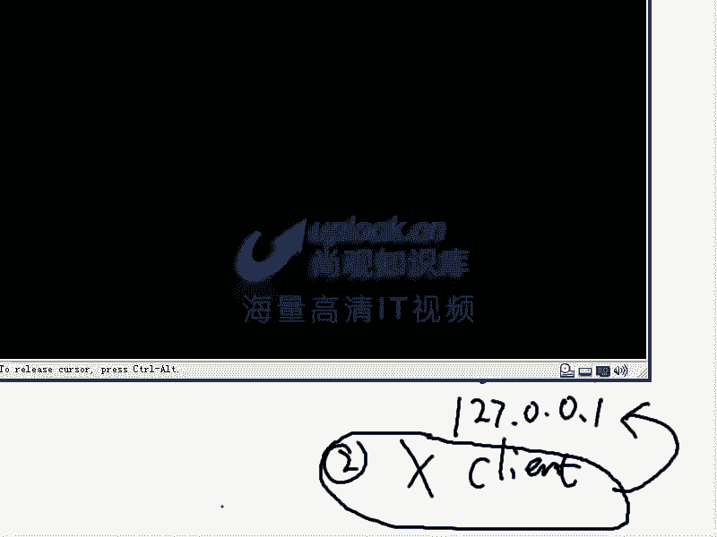

# 尚观Linux视频教程RHCE 精品课程 - P29：RH033-ULE112-16-linux下X图形显示体系 - 爱笑的程序狗 - BV1ax411o7VD

好啦。我们来开始呢给大家讲一下16章啊，linux图形显示和X window还小赵的话看啊因为小方呢因为太笨了，被我已经打死了啊，开玩笑。

那大家看第16章的话是linux系统的图形显示和X window这部分内容呢，就是我们在windows下主要接触的这种界面，就是来看一下windows下话主要就是一个图形界面了。这图形界面的话呢。

在linux里面跟windows里面它是不一样的，用起来是不一样的。一般这些感觉好像差不多是吧？实际上呢windows的话是开图形就是图形用户接口的这种先河。它这种东西的话呢。

它直接颠覆了大家的这种使用的习惯。嗯，那么现在我们linux里面呢可以说是秉承了inix下的那种文本操作的这种就命令行操作的这种呃使用习惯。但是呢图形方式呢，它因为毕竟是贴近大家的这种。

常规的思考模式多一些。所以的话我们必须的也在linux当中提供这个模式。包括现在我们在linux set它可以提供什么3D的那种界面啊，什么呃什么60型的那种桌面转来转去的话，很容易的。

但是在我们的呃就是说。在我lindows里面的话有一点不好，就是说它的显示的话，响应还是要慢一些。为什么会慢一些呢？咱们要从它的结构上来看啊，这个结构的话，大家看好像就是说我们看到这个界面的话。

好像跟windows是差不多的对吧？对，那实际上这个界面没什么太多好讲的。因为你只要会windows，然后呢再按照我们的说法就是英语的话呢是这最起码office知道什么internet知道什么吧？

对是吧？还有什么我们的这些呃小的工具是不是那么再有一些比方说PDF等等这样一些概念，然后programming之类的东西。那这样的单词的话呢，大致清楚一些。

然后又熟悉一些专业词汇点在这里面的话运行或者是操作的话是完全一点问题都没有。那如果你用中文版话更好。

对吧对，所以他非常非常方便。但是呢我们说这个结构啊，它呢有跟windows不一样的地方，而且呢很难理解很out的地方。你比方说我们现在看这样的。呃，现在的话呢我在一个系统当中啊，我这样来做。

我呢去呃现在这是一个我们的这个呃小的linux系统是吧？对，然后现在我们看一下，在这里面的话呢，我在呃启已经启动好了一个linux。那这个linux怎么启动的，我是这样启动，我先把它关掉啊。

conttrot加delete可以关掉任何的一个X window。那这里面的话我是输入start X启动的。实际上启动X的话呢，很多种方式去启动。那它怎怎么样机顶，你让star X它就直接去运行起来了。

直接就运行起来了，非常简单。这个呢在我们的第呃第三章还是第四章就给大家讲过。嗯，那么大家讲怎么切换conttrol加F1就切换到第一空白等等啊，那么这个是F7是吧？如果启动多个X window的话。

就是star x那star X空格杠杠空格冒一，就启动第二个X window，也就是你假如说你还想再启动个X window。

还想再启动一个X signal，比方说我在控制台里面输入start X是吧？空格杠杠空格冒号一启动第二个X signal，对吧？对，这是一样的。那么你现在再回撤以后的话，又启动一个X signal。

那你会简觉得它跟windows是差不多啊，但是有一个控制台这个概念是吧？对，那么比方说我们这样的啊，就是另外一个启动起来，那么我在这里面的话，比方说我新建一个。

诶ron command 啊。Council。我现在去运行一个conunl，就是说有这样的一个空呃 shell要出来了，对吧？对，那我想切换到刚才那个当中去，conttrol加F7。哎。

这是刚才那个第一个X的嗯，那么outconttrot加F8，这边就是第二个Xn的，对吧？对，那么conttrot加F1就是第一个空白了，文本空白了，嗯对吧？对，就非常简单的。

那么它的这个过程是就是它的架构是怎么样呢？我们必须得要画一下，它这个架构是这样。整个的这个架构的话呢，X windowow的架构跟windows下完全不一样。那么大家可以看一下，那么在这里面。

X window那我们说一般叫做什么呢？一般叫做。一般叫做什么呢？X。一般叫X，而且呢我们称之为什么呢？X杠。window不叫X windows，win的话是微软的注册商标。对，明白吧？嗯。

那么X window X window的话呢，那么这个X的话呢是unix啊，通常的就是说我们。它有个X协议，然后进行图形传输用的。它分为客户端和服务器端。客户端和服务器端在这个机器上的话。

假如说啊这个机器上，那么是一个X的ser。X是12吧。那么有一个这个程序啊，比后有另外一台机器，这台机器是一个大型机，嗯，这是一台机大型机。比方说花2000万美金买的。花200万美进来。

它呢是不配什么显示器，乱七万，它是一个一个机柜来的那这个时候的话我想让那个大型机，比方说它运行的是一个卫星云图的运算啊，运算量非常大。把卫星云图的这个结果的话呢，输出到这个ser当中去。那么这个时候呢。

我们这边的键盘鼠标，你看啊键盘和鼠标这是两个输入行为吧。对，这是两个输入行为吧嗯。显示器是不是一个输输出行为，嗯，所以就是IO嘛？对I这个IO的话呢充当这台主机的IO也就是它的话呢。

实际上充载这台主机的什么IO也就是相当于我把它的键盘和鼠标接在这台机上，把显示器接在这台机器，那么这时候呢他们走的协议就是X协议。现在用的X协议的话是X11嗯，第11个版本的协议。

那么现在我们具体来说的话是X11R6用的最多。嗯那么现在最新的话有X11R7R715的话是R7，嗯，明白了吗？明白了，所以这就是我们的所谓的什么X协议啊，明白了吗？明白，那么在unux系统里面的话。

这个东西是非常非常多的用。那你想一下啊，比方说前20003年还是05年03年嘛，中央气象台花2000万美金买的这个IBM的服务器。这个服务器摆在那个机房里面，服务器摆在机房里面。然后呢。

那么你知道机房的话，温度多少呢？是18摄氏度以下啊，必须18摄氏度以下。然后呢，我们的老专家头发花白，然后一个人的话扛的键盘鼠标。然后呢。

另外一个人拿着显示器跑到里面照着那个2000多万的美金的那个机器的话乱乱插，它不可能这种事情不可能所以这个服务器一旦放到那边去以后，我们说控制它的话呢，都是通过X协议去控制。

这个呢就是典型的什么unix的这种控制方式。这台机器的话呢可能很贵很贵，甚至是多个机柜的这种小型机或者大型机，明白吗？明白，那么我们在另外一端的话可能只是你的笔记本，这边笔记本的话呢。

实际上是什么X的4端。而这边的话呢是X的什么？那么就拿我们最近的话呢比较多用的什么呢？功夫熊猫啊，就是你看功夫熊猫的话，比如说挺受欢迎嘛。对但是功夫熊猫的话呢，为什么中国人做不出来？很多人的话。

我看在网上抱怨，他说什么？他说中国的文化，中国的什么这那的，然后呢，老美拿出来以后赚钱他就不爽，实际上呢这些人抱怨的人根本就看不到其中的技术含量，全世界的话没有几家公司能做出那样的动画片，为什么呢？

因为他的那个软件啊，就是他每一个图片，就是你看的热闹，因为这个功夫熊猫挺可爱的，然后那个阳光话普照什么那个他根本就不是让人去画出来的，不是让人的话一帧一帧去画，嗯，那你说一般的这种一般的这种东西的话呢。

它是让游人的话，一帧一帧去画，我先画这样一个图片是吧？然后呢这个熊猫在这个地方，然后呢再画第二张他话把它位移一下，然后把它这边移一下是吧？对这样一张一张画画多少张但是呢在那个工。😊。

他们做的话是怎么样的？就专门找一个集群，这集群的话，它有很大很多很多机器。每一台机器的运算的能力的话还是比较强。但是呢不是那种大型机的强，就是没有说什么病情计算机那么强。但是呢它的集群的话有很多。

当它呢建模完了以后，你比方说你们知道它有个大厅是吧？那么大厅怎么渲染呢？它先建模建模完了以后的话渲就是贴皮贴上去贴上去以后呢，再把阳光等等这些物理引擎加上去，然后呢或者跟熊猫跳起来以后。

它不是要落下来嘛？有物理引擎嘛，就要有重力引擎那这些东西加上去以后呢，实时你说我这个虚拟的摄像机绑在哪，它根据这个虚拟摄像机的这个角度，然后来动态生成你这个应该产生的这个照片。

那应该产生的这个图像是怎么样的。所以呢处理的事情全部都是在这边处理，而产生的结果是怎么样输出的所以他呢你这边的这个机器呢它实质上是怎么样，它只是起到一个显示的作用和输入输出作用。得点一下暂停。

那他就暂停了是吧？那实际上是这边的话呢，暂停的运算，对不对？所以你控制的全部都是这边控制。嗯，那控制的是这边东西清楚了吗？清楚了，这就是我们所谓的什么unix。

所以呢当时的话工程猫很多人他在那边说啊不许用中国文化来做这你的技术太落后了，你在那边还要一张一张图片去画，人家建模完了以后想生成多少张就生成多少张，想让他做什么动作就做什么动作。那么当时的话呢。

看那个鸭子的或者头发或者鸭子那些羽毛，他们那些不是就是你要一张一张画的话，那画到哪辈子去，可能十年都画完。但是你一旦把它做出来以后，有这样一个羽毛的这样的一个对象，这个对象的话，该有些什么样特质。

然后呢，该有哪些比方说什么颜色 color啊，然后再有一个呢风的这个风来源啊等等，它会实时产生这些东西。这些运算量非常大，都在这边一。全世界块没有几家。公司能做。

结果呢一些不懂的人还在那边嚷嚷说什么公共情包怎么怎么样，我们也要做公共情包，能做出来，我觉得不是不行。因为的话呢呃技术含量是不一样，确实是这样。那么我们的话由技术角度上的话。

说说出就是说国外现在这种虚拟现实的动画片，实际上也是linux的一个应用之一。那比方说泰坦尼克号就100多台linux机器，一块协同去进行渲染。比那个什么roose在传头那个整个那个大的渲染那个背景。

实际上都是由linux完成的，那么它都是在机房里，而机房里面的这些东西并不是说每一台机器你上去鼓捣鼓捣，然后它运行啊软件，而是呢在我们这边统一进行控制，让他们去运算。产生的这个结果的话输出过来。嗯。

明白了吗？明白了，所以的话这就是一个Xwin的这样的体系。那么现在我再把它呃这样的详细化一下，也就是说我们的X window，它实际上分成两部分，一个是什么呢？一个是s尔端，一个是cl对。

那么s尔端应该有显示器。是吧对，应该有输入用的什么键盘和鼠标是吧？对，这个呢就是输入输出。那么服务器这端的话呢，负责进行运算。它的这个机器的话呢，负责进行运算。

它们之间的话是通过X协议进行传递这个视频和这个输入输出的，明白吧？明白传递这个东西。所以的话我们通常情况下，我们是不是感受不到这些你刚才感受到了客户端和服务器端了吗？没有没有嗯，你是怎么样的？

你是运行的一个star X是吧？对，3X的机体是什么呢？它呢先帮你启动第一步先启动一个X window。它相当启统于X window，这是X window的什么ser端这个ser端的话去监听127。0。

0。1。那么第二步的话再启动什么呢？自己这台机想再去启动什么X的cl。再去启动X client，然后呢让这个X client东西的话输出到127。0。1上去，明白吧？就自己输出到自己上去。

所以你最终看到一个X window。那么我你说不信啊，你要不信的话，我们看一下那么现在我们把这个东西关掉cttro加格键可以把X window关掉，这是第二个X window是吧？

那我在加X7是不是到了第一个X window第一个X window是不是我也可以contl加格键把它关掉，对对吧？那么现在我这样的，现在这里面输出呃，就是说在这里面，那么我给大家分开演示。

刚才不是说哎老师刚才不是说分两步吗？第一步先开X windowX4，然后再启动X client嘛？X client就是类似我们说那个功夫熊猫里面那种产生视频用的程序明白吗？或者演示卫星云图的程序。

它要输出过来那么实际上是服务器端控制客户端这个等一下我们再说，那么现在我们看。

那么现在我单纯想启动X42。那么我就输入一个大写的X，直接回车XO就启动起来。

看一下啊。你看是不是启动起了，嗯，已经启动完成了，说哎这个黑屏已经启动完成了，看到了吗？嗯一个叉看到了吗？在晃，说明我的什么鼠标已经被驱动。那这个图形后面的话呢，只不过是黑色的，并没有太多东西。嗯。

那么它就没有任何的输出，就是一个黑屏，那么这就是什么X就启动完了，那么是不是没有任何东西输出啊。对，那是因为X client没有启动。那现在的话呢，我contrl加退格键把它关掉。

ctro加退格键关掉了以后，那么X刚才是我输入一个X就把它启动起来，嗯，对吧？对，那现在我除了启动X之外，我再启动一个客户端，我输入什么呢？XNIT。这个呢就是说我启动X了以后，我再启动一个客户端程序。

这个客户端程序叫X term，就是一个shift。我看一下啊，现在XINIT直接回车。

先启动X是吧？对，是不是启动X哎，出现一个客户端，对对？嗯，就这样一个东西，就是一个客户端，明白吧？它是一个通时输出的东西。那么现在的话呢，我们就分布启动了。我们刚才启动了一个什么呢？

我们刚才启动了一个呃启动了个X，然后又启动了一个X term是吧？现在我把它再画再再新建一个。

现在把这个X收了。一启动嗯，这个X21启动，它呢实际上是驱动你的什么显示器。是吧对驱动的什么呢键盘和和这它的设置完了。然后呢，刚才我是在X server启动完之后，在启动的一个什么程序呢？

启动的一个名叫X term的程序。X term的话实际上X terminal就是X的终端就启动这样程序，于是你看到的这个结果就是什么呢？就这样嗯这个这X term这你在这里面可以输入命令的对吧？

对那现在的话呢，你star X的话一般是做了一些什么呢？做的东西要比它更多是吧？你首先是要启动X server是吧？那star x呢之后会帮你启动一个DE所谓DE的话是什么呢？它是一种类型的东西。

这种类型的东西的话是什么呢？

DE啊desktop桌面的环境啊，桌面环境。那么常见的DE的话，在lininux里面的话有两种啊，非常常见，一种叫做什么呢？ know。这是一种敌义。然后另外一种是什么呢？KD。明白吧？

一只能们一种KDE那么这是系统常盖的两种，其他的话它可能有别的。那么有些公司开发的定义，甚至跟windows一模一样，有开始菜单啊什么的一模一样。

大家可以在网上下一模一样跟windows但是里面的肯定不一样。所以这种定E的话呢还有很多种这种定E的话叫做桌面环境，什么叫桌面环境呢？你看一下现在现在的话我们分不来启动，启动的X terminal是吧？

但这个东西的话，它有没有有没有标题栏，能不能插掉它不能不能是吧？没有那个把叉是吧？对没有标题栏，也没有办法拖拽吧，对，没办法拖拽，没办法大小写是吧？对要把它放大或者是减小对？那么当我启动一个定E以后。

启动定E的话呢，这边就是我光启动一个呃就是客户端程序了。如果启动KDE的话呢是starDE这是KDE的启动的脚本所以在X启动完之后，你的E。

启动掉了。嗯，明白吧？明白，那么直接回撤。那这时候呢D一就启动起来。哎，你看KDE启动下来大家留行这个框，哎，看到吗？嗯，有框了吗？有了有这个叉嗯，有最大化最小化，对对不对？对，有这个下面的标题栏，嗯。

所以DE就是做这个的DE的话它把这个桌面环境当中常用的这些东西，它给你规范出来明白吧这就是DE那么KDE的话呢，它在运行了以后，那么我们刚才一个窗口就有了窗口常用的这些东西，嗯。

那么就有了桌面的背景看到吗？嗯桌面背景就有了下面的什么任务栏和开始菜单，对不对？对，这些东西的话，就是我们的所谓的什么的DE提供的那也是一样。你要的话， session。

刚才我们说启动DE的话是starDE是吧？对starDE那么如果想启动那个的话，那就是然后现在我们看一下，我看一下我的启动没有，我现在不太确定了。

我现在不太确定我的举no启动没有。那么举动话我输入一个举no，哎呀，特别小这个字。一。ome呃还记得我们上节课上一章讲的说怎么样看一个软件有没有装是RRPM是吧？对杠Q呃QRA是吧？

查询所有的包GREPGome对吧？对，看能有么有装ome如果装了以后的话。看一下啊。you know VF。我也不知道怎么能不能能装，只能我这个包好像没有装啊，请能杠 terminal。没有装的话。

没有装那个吧，那我没办法给大家演示这个genno。如果只no装了以后的话，那么会有一个genno杠char能。啊，那么你说这个灰车，那就跟什么starKDE是一样的。

也就是那个上面的命令它是启动Gome的定E的。嗯，下面命令它启动KDE的DE的。嗯，明白吧？明白，那么启动这两个定E以后呢，就会有这个窗口出现。也就是这个结构的话你才能搞清楚。嗯，明白吗？

明白结构的话才能搞清楚。所以的话呢我们在这里面看到这个DE的话呢，是种类型的东西。但是说这两种定E的话呢，它提供的东西不一样是吧？它提供的这个桌面是不一样的。嗯但是他们的话呢要显示这这些东西的话。

还需要基于一些库。你比方说呃我现在啊我现在想显想自己编一个程序产生这样一个窗体。自己编一个程序，想产生这样一个窗体，就镶嵌产生这样的窗体。那么你想编这个程序，产生这个窗体的话，像这个拔叉该怎么样去。

像这个拔岔的话，该怎么样去添加上去。呃，然后呢这个窗口的话，默认情况还有多大啊，在哪个位置等等。然后最小化的时候呢，它是怎么样一种行为，是不是我要提供给你一个库，让你去调去使用，对如果你全都自己去写。

很累的，对不对？对你可能要想几几千行，就跟什么呢？我们那个大楼里面，那么厕所的话只有一个，是不是？那么每一层呢只有一个不是整个大楼一个，那每一层只有一个。

那为什么这么多呃商家他不如租了很多小小的这个呃住就是好小的办公区间嘛，为什么每个办公区间不自己弄一个呢？因为那个厕所公用就好了，嗯，对吧？对这样的话呢，我们不用在每一个商家里面都撞建一个厕所。

那么所以的话呢我们的这个库函数也是一样。假如说我们。只是在偶尔去使用这个库轴，而这个库库库栏数的话，别人也需要调用。那我们就做成一个库，嗯，不做到我这个系统当中。

所以的话呢G诺和DE啊gome和DE的话呃KDE的话，他们调用的库是不一样的。假如说他们想显示一个窗口的时候，他去调用的是叫做什么呢？GTK。加的库，这是整al的嗯。具体弄的？

那么TDE的话调的是什么呢？QT的库。QT的库的话呢。啊，错了，这个不是真的吗？GNU的啊GNU知道吧？就是我们的那个呃就是开源软件，linux也是属于GNU的嘛，是吧？对。

这个rechelstorm那个QT的库。QT的库的话呢，它是一个什么？它是一个呃商业公司推出的。这个商业公司的话呢，在中国也有分公司叫做奇趣奇趣科技。但这个公司的话呢，非常有名。

那么像摩托罗拉的很多手机都是基于嵌入网的QT这个公司的话，这个公司的话已经被诺基亚收购。嗯，这个公司的话已经被诺基亚收购了。啊，稍等一下啊，这个公司的话呃这个这个已经被诺基亚收购了。

诺基亚吧这个QT收购啊，就是QT的这个公司的话呢，实际上就是奇趣就是奇趣。那么奇趣这个公司收购以后的话呢，摩托拉就遭到致命的这种影响。因为它原来的这个它原来的这个手机的话呢都是基于QT的呀。

就是嵌式版T的所以这点的话呢在linux的话呢，影响是什么呢？就是本来QT的话，商业支持要GDK要强很多。因为它是一个商业公司。那么我们去使用的话可以免费去使用。但是如果要是你想用一个嵌式版本。

那么一个license的话要1万多美金的嗯1万多美金还是人民币这个我不太清楚，因为它是靠奇趣公司的话，就是靠卖这个license挣钱的。你想用我这个商业式版本。那么你在那边买一套软件是多少钱。

然后呢发布一套多少钱。因为你用了基于我这个QT的库。所以呢这是两个基础。他们来说支持的一个基础的库。那么这个库的话呢，是用GDK然后呢KT的话是用QT那么GDK加的话呢，在就我因为我们公司的话呢。

有linux内核的公版的开发者。这人他说的linux就是ux支付DK的团队你们弄的东西太烂了所以说又不好用，然后又有问题多现在基于这个GDK的开发软件的这个公司的话呢很少。

因为这个东西确实不太好这是整个linux界里面的一个什么呢最弱的一点。但是大家可以就是说可以不听我刚才说的这是一些行业的背景知你要是开发一款软件光是有那个命令行界面不行，播一个电话话。

加输一行命令肯定不行。那你要有个图文界面这个图径界面的话呢，你要是基于GDK要基于Q第三者的话呢，还有什么呢比少。那比方说既不用T也不用DK也不用么还有另外。叫做什么呢？你。G安。

迷你GUI迷你GI是中国的那是那个叫魏永铭啊，魏永铭做的。那么这套东西的话呢，它是不基于Xwin是直接去用frameme buffer做去做这个驱动的。也就是说不用Xwin做机础，明白吧？

这是它的这个呃不一样的地方。所以的话这是我们的这个基本的图形的这样的一个使用，也就是你完全不用Xwin这一套，那么用min你GUI的话，是在嵌入系统上用的非常多，嗯明白吧？明白白OK那么现在我们看。

现在的话呢我再把这边的话X window都打开了。呃，呃就是说最后的话把这个图形界面它整个都打开了。那么这个结构的话也给大家说的比较清楚了。那么其中的话还有另外一些的应用程序。这个应用程序的话呢。

不一定是DE啊不一定是DE，也不一定是某一个应程序，它还有其他应用程序。那么这个应用程序的话叫做什么呢？DM。DM的话就是desktop manager。

也就destop manager的话呢也是另外一种应用程序。这种应用程序的话，它呢跟呃genno的话由GDM。

KDE的话有KDM然后呢X window的话还有XDM就是它本身自带一个DM这些DDM是怎么样的，要求输入用户名密码才能进去，也是先启动X window。

然后呢再启动这个它需要输入用户名密码才能进去这边的话如果是你运行的是NIT进运行级别为5的，IT运行级如果你不明白没有关系。那么听完第时你就完全清楚运级别为5的话。

那你运行的就是一个DM不是DE了DM再去启动DE？我给大家演示一下这个过程啊，那么现在我把这个X window关掉。刚才我们就说了很多次这个快捷键应该是按么键格键就是break space？

加格键就是那个加号旁边那个删删除一个上上一个字符那么如果你在这里面输入一个什么GD那么就会启动的如果输入什么呢？KD那就是KDE的。

啊这个东西它是自动去输入的，嗯也就是它会提供给你一个输完用户名和密码，输入用户名和密码的这样的一个呃接口。你看你输完正确的用户名和密码以后才能进入这个系统。所以这就D验刚才第E的话是不是直接进去了。对。

那这里面你输完用户名码。比如说啊输入直啊，密码的话是uplic。

然后等到A登录进去。这个时候的话，你可以呢在这个地方mer这个地方呢话，你可以选择说我要用中文还是用英文，用jimo还是用KDE嗯啊，我这边的话okK哎。啊，如此登录是不允许的。这真是见鬼。废有啊。

那比方说用一个用户登录进来，这个时候的话才去启动DE看到了吗？不是KDE在启动。嗯，也就是只能呃DM，然后再去启动DE它需要输入用户名和密码，然后呢才让你进去。也就是说我的系统一启动完以后。

我就启动1个DM是不是比较安全。嗯，对，对吧？输完用户名密码以后才进去，嗯，是吧？对，这样一种情况。所以这就是我们的什么DM嗯啊和DE的一个区别，听楚了吗？清楚实际上本质上来讲。

他们都是什么上面这些东西全部都是。

client程序ex the client。X client明白吗？明白了？那么现在我们看啊，那假如说我直接运行X client不运行X server成不成，你觉得成不成？嗯。

X plan是需要重新输出的是吧？对，等后我现在输入三角形，我要输出出来。嗯，但是我没有接收这个三角形的这个程序成成不成不成啊，不成，确实不成。你看一下，那么现在我把它关掉是吧？

然后现在我是不是直接去运行个starKDE是吧？对。

看一下啊。

你看DM的话有一点区有一点不好的地方，就是什么呢？你关掉它，你关掉它以后它会重新启动起来。嗯，那么现在我这样的啊。我在这个空制白下，我输入一个什么呢？star。

KDE对吧DE这是一个启动DE这个cl程序的命令是吧？starX是不是先启动X2，然后后启动KDE是吧？现在的话我就光去启动这个DE我直接从这个地方开始启，我不启动下面star x的话。

我是先启动它再启动它吧那么现在我直接先启动它不启动这个下面的X是不是就starE就好了对吧？那么直接回车，你看它能不成能能不能成啊。

它是不是会出错说belbel to open display不能打开图形显示是不能打开图形显示，这时候它就出错。那么你说X term刚才是不我运行X的时候可以运它那现在直接回车。

它也不允许对不所以这样的结果就是什么？直接运它的话呢X的程序没有X的情况下是运行不了的除非怎么样除非。

你呃，事先去直接定一个变量，让它输出到1个XO上去。你比方说现在这样的IS卡费，我看下IP地址是19218。1。231是吧？嗯，对。1。231，然后呢，现在我这样的star X。

刚才那个X window是不是已经占了第一个第一个X的图形显示是吧？我们star x看杠杠空格冒号一哎。空格冒号一是吧？对我现在提到第二个X温是吧？对，启动第二个X温斗。

请问第二个XN的。

那么在这里面的话呢，我们运行一下呃。就是在就是在命令行当中啊，你去输入一个这样的命令，叫做什么呢？叫做X host，去表示你允许谁把你现在是个X4是吧？嗯，你现在允许别人把图形输出过来嘛？

那么我说X host，加对方的IP地址。如果要是你不加对方IP地址，直接一个加回车，那就允许任何人输同形输出到这边嗯。因为我的IP地址19218。1。231是吧？对，那我可以加上1921的8。1。

2331。那这样的话就只允许什么？只允许这个IP。如果按上面这种方法的话，就是说允许任何人，他说访问控制被禁止了就是说你没有访问控制，随便可以输入嗯明白吧？这样呢加上这个以后的话，那他就是允许1918。

1。231去访问，那不是说允许所有人了，嗯，对吧？那现在我是允许了，现在我退回到什么上退回到控台上去，你要是在我的控台上，我本来输入ex。

是不允许的是吧？对，但是我定一个变量export把它变成环境变量，嗯，对不对？对，display。Okay。等于这个环境变量的话非常重要。比127呃192。点168。1。1。

2231冒号一表示呢输出到这台机器的第二个X分的，冒号零是第1个X分的嗯，对吧？对，那我这样你直接回车，然后呢，接着我再输入X。刚才不是出错吗？嗯，现在回去。

没出错，对不吧？嗯，然后我们outt加F8是吧，第二个X嘛看这个X算面出来的，看到没有嗯。这出来了吧。对。

那我在G端把它关掉啊。然后我在这端ctrl加C是不是把它关掉嗯，对，关掉了是吧？然后再按alt加FY，是不是那个东西就没有了。嗯，对，对吧？那么我们现在再看呃再切换回去，哎，这个好玩。

我再去运行一下其他的程序是吧？嗯然方我运行一个什么X talk。

Xclock，那么直接飞车。阿加8。哎，这块表出来嗯，看到吗？看到，那我在那边把它关掉，这个表就没了是吧？对我在这边也可以把它关掉，嗯，对不对？对，那么也就是说我即即使我现在是一台机器。

但是我的一个控制台作为我的cl。嗯，我现在这个现在这个界面奥X8这个控制台实际上就是一个什么X是吧？对我自己输出到自己的XO上，那我能不能输出到别人的XO上去，也可以也可以，那是没有问题嗯。

反正没有问题。呃，能不能就输出到别的地方啊，就是说我们看了一下呃，现在的话呢，我把这个图重新画一下。刚才的话是我在自己的机上，是在自己机上，是不是？对，这边也是在自己机上分布去运行的，是吧？

那现在我重新把它画一下。看一下，那么现在假如说我找了一台机器，这台机器呢是X server。是吧对，是X的s。Xer嗯，那这个X server上运行了什么呢？首先我在这边运行了个X2。嗯，XIIT的。

XINT嗯运行了XINT以后，然后我在这边运行个X host。加。对不对？嗯，这两个的话呢运行起来，运行完了以后的话，这边就允许别人输出过来了，是不是？对，就在一台机上。那么在另外一台机器上。

这台机器呢可能是个大型机，也可能是一个随便一个神么机，比个远程的机器。嗯，你要想远程控制它的话，那么你在这边的需要的提示浮像， shell要提示服像，你输入了一个什么呢？export。

display这个变量大写的是吧嗯。export display等于双引号。你的这个IP就是这个server端的IP。是吧就是他的IP对这台机器的IP12端的IP然后呢加上一个冒号一呃。

冒号0默认情况是0是吧？第一个Xwin是默认是0对第二个Xwin是冒冒号一是不是然后呢这边的话是这样输入就好了。那么1个IP加上个冒号表示第一个这这个IP上的第一个IP对第一个Xwin是吧？这样的话。

你再输入任何的一个比方说X term是吧？嗯或者输入X clock。是吧或者是什么star KDE是吧？对DE这样的话呢，它就直接输出过去了。嗯，那这样的话呢。

你的这个程序X term实际上是在这边实际上在这边也行。你如你在那边L的实际上是这台机器的东西对吧你在那边看的时间实际上这台机上的时间是吧？你在你在这边的话看到这个界面，比方说一个开始下单。

实际上是这边的这个下单是不是对所以这样的话，你就是进行一次什么远程控制所以的话这台机器，你看这边是cl端是吧？对那么是端控制端还是端控制控制端端控制端吗。你再仔细看看。控制。😔，应该是。

是cl端他控制so的啊啊。不是吗？是吗？你看你现在输入个X term或者是starKD以上D在这边输入过来了是吧？那么是图像的话是放在这边嘛。嗯你在这边看到一个任务条是吧？

对一个开始菜单是不是嗯那你在这边点一个按钮以后，是不是在这边运行的那你是在这边控制它是不是你在这边你说我要运行一个什么，我要运行一个程序是吧？这边出现一个程序，这个程序是它这边输出的吧。

那你这个程序上点来点去的话，实际上是操作它嗯对对不对？对所以的话呢是服务器端控制了端所以这就是X的什么扭之处，也就是说是X的所有端控制的是嗯明白了吗？明白那现在的话呢我可以就刚才实际上已经演示一个啊。

假如说我现在在这台机上输入了一个X host加是吧？我现在另外一台机，怎么在另外一台机象呢，那么我在这台我在我在这边SS知1921680另外台机上SS过去以后，我输入一个什么。

啊，display我没有刚才没有回车啊，刚才没有回车。Yeah好。display等于双引号1921到8。0。1按0。0。231是吧，冒号0是吧？回车。

然后再输入什么starKDE这样的话是不是你就可以控制从远端啊，在这台机箱，在另外一台机上是不是可以控制19218。0。1这台机箱。因为你是SS过去的嗯，对对不对对。

现在我我我假设说我是先到这台机器然后呢export display这边，然后输了一个什么star kDE嗯是吧？对这样的话图形界面输出到哪去了？这个图形界面输出哪去输出到231这个的第一个X弄上去是吧？

那我就可以在231上控制这个0。1这台机器是吧？也就是231这台机器实际上是什么服务器端嗯对不对？对，也就是在231上，你要去运行X加是吧在这台机上，你Xport display对1。18。0。

231冒号零嘛，然后你可以输入star kDE那你的图形界面是不是输出到这边去了，对你可以在这台机上去控制它，对不对？对，那现在的话我给大家再看一个更极端的。

那你现在这个X server的话是没个词是吧？嗯那么我如果要是把它做成一个windows。

也就我可把windows模拟，让它支持X11协议，让windows支持X11协议。让windows支持，那么让windows支持XL11的话呢，就这样我在这边的话装一个软件啊。看一下。稍等一下。

我这边的windows windowsows这个端的这个XO叫什么呢？在linux端的话就是大小的X是吧？嗯，实际上大写的X它叫XORG啊，这是在linux端的。那么在windows端的话呢。

叫做X manager。X manager那么在在这是在windows端的，那么大家可以呢去网上下这个软件X manager这个软件。那么还有很多其他软件，像呃IBM等等这些公司呢。

他可以附带给你赠送一些这样的软件。那么现在的话呢我呢就就要在就在windows装一个X manager我装好了这个XX managerX manager在这是吧？

嗯我点击Xstar它的star点进去了以后呢，他说你的主机名是什么？1921的8。0。呃1。231。现在我这个windows的机器呢是232那么lin那个讯拟机的话是231是吧？对。

那么现在我要用X term去连接到什么？SSH用XSSH去连接到1。231的什么呢？这台机器上去然后呢输入用户名是密码是。OK现在我连接过去，那这个时候的话呢就看到这样一界面，这个界面的话就是什么呢？

X term只不过这个X term是在什么windows下的X term，也就是说他把我们现在这个microsoft微软的windows当成一个X因为为什么可以当成X呢，不是说微软直接可以支持。

因为我在这个windows下运行X manager这个X manager支持X协议。嗯，那这些是不是可以输出过来了。对那你看一下我现在的话X term运行起来了。

这个X term实际上连接到我们的什么这台机器，就是231这台机器，这是231。这才真ow机器嗯，你能理解吧？能这边是1个231，我连接到231就连接的过来，这边是一个windows机器，232啊机器。

我现在的话远程连接过去SSA连接过去。那么在这边运行的X termX term的话呢，输出到我这个。所以这边的话出现了一个什么X term但是这个X term里面内容是不是这台lin的嗯对是吧？

那么现在的话我看这个X term里面内容啊，这是X term这X里面那种。你看一下是不是就是我们刚才那台机器啊，231这台机器1。231这台对吧？那么现在我这样输入个W是不是能看到这些人在这边登录。

那么我的话是点成远程连接过来那远程连接过来。那么现在我在这个地方的话呢，这样来做一下，我现在在这边的话来这样做一下，就是说怎么样呢输入一个呃starD1。😊，嗯啊。

那我直接回撤starKDE是不是启动了一个，你看这个东西啊，它现在是在不是在那个不是在windows里面了。大家可能现在还看不太清楚啊，就整个这个界面都已经变了。你看到这个界面。

这明明是windows里面的界面啊，你看这个就是windows，这是lindux里面这个界面。但是呢现在在windows下运行。嗯，你看到这个windows就是windows里面的话已经出现了这些东西。

比如说我运行1个KD的什么什么东西。

这些呢都是在windows下，也就是如果整个的桌面环境的话，全部都运行在windows下。那大家可能看不太清楚，看不太清楚。那么现在的话我这样的然后把home这个呃启动起来。

我把home双我现实际上现在在操作windows。但是呢这些界面全都跑到windows下了，你看到这些界面的话全部都跑到windows下。你看ETC。这是linux里面的内容啊。对。

那么实际上在windows下直接运行就。嗯，也就是说我刚才那些应用程序啊，那么这个应用程序还在的，windows运行程序还在的。你看他们怎么会跑到一起呢？

因为他把windows当成一个linux的X server。所以的话才会在这里面windows里面出现这样的一个图形界面。嗯，明白吗？明白windows里面怎么会出现这样的一个窗口呢？

windows里面会出现什么样的窗口是这样的窗口啊，对，对不对？对，现在就完全分完完全这样的。所以这个时候的话就是一个什么这个时候呢就是我们呃完全的就是把windows变成一个exel的这样过程。

所以看到刚才我们实际上做了三次。现在的话我把它关掉。

现在我在这里面啊，我我在这里面它话，我我crl加C，把这个把这个X的X关掉。那么现在你看到这个虚拟机还是在这边运行的。嗯，但是呢刚才直接全都跑出来了。嗯，刚才这个进这个窗口是不是也不是这个样子啊，对。

是那个雷ux里面那个样子，是不是对？这样的话就全都变了。

啊，如果不明白的话呢，我现在再给大家来仔细看一下啊，那给大家仔细看一下。那么刚才我实际上是演演演示了三次三次分别是什么样的呢？是这样的啊，演示了三次内容。刚才实际上经过三次。第一次的话是这样。

我呢给大家剖析出star X是吧？实际上并不是在你的迹象启动一，就是同形界面它实际上分成两部分，第一部分的话，它是先启动了一个XO啊，它是运行XX的话是启动X server是吧？对那这个Xor的话呢。

这个大写的X实际上叫做XORGXORG是这个X server的名字。也就是linux下面的什么X server明白吧？嗯然后呢之后的话呢又去启动了一个什么star。K1是吧，这是一个什么X的。

client对吧？这是我们第一次给大家剖析这个，然后呢给大家分阶段启动，先启动X over，先输入一个X是吧，看成什么样子，然后运行了一个什么呢？XIIT是吧？然后再star KDE是吧？这是过程。

然后第二次的话，这是第一次第二次的话呢，我们是分成这样启动。我呢首先在一台机器上，我去启动一个什么呢？XINIT或者说启动什么star X啊，然后呢启动起来了以后的话，输入了一个什么呢？X host。

加嗯允许任何人的话，把图形输出过来，嗯，对吧？然后呢，我在另外一台机上，这是第二台机器。第二台机器啊运行什么呢？export。Display。等于是吧，双引号1个IP冒号0双引号对吧？对。

这个IP地址的话，就是上面1个机器的IP地，就是他的IP地址。嗯，这IP地址就是他的IP地址。然后呢，再输入什么start。KDE这样的话呢，我可以在第二台机器上运行的X呃KDE输出到第一台机器了。

然后呢，也就是说在第一台机上就可以控制它了。对，是吧？就可以控制它了，对，就可以控制第二台机器。在第一台机上可以控制第二台，因为它你的starKDE的界面是不是跑到第一台机器。

对你可以通过这个第一台机上的界面去对它指指点点。嗯，点来点去的话是他帮你动作。对第二台机器帮你动作，对吧？然后呢，第C呃C的话呢，我们是怎么样呢？我们不是运行XINT我们是在一台windows的机器上。

winow斯机器的话是232这台机器啊，我去运行了一个什么呢X many。这个XX manager实际上就是一个什么？X啊，他把windows变成X嗯，那么。第二步呃，第二台机器的话，我运行了什么呢？

在第二台第二台是linux是吧嗯。第二台linux上运行什么呢？就是export。是吧display等于什么什么？然后运行什么呢？star。K也就是说还是这两步第步第二是吧？在第二台机箱就行这样。

但是呢这台机linux它不知道它自己输出的对象实际上是一个windows但是这点对它来说无所谓，因为话你想知你要知道X的话实际上是一个议我只要支持这个议我无所谓平台的uxwindows这些平台只要你能想到啊。

能想到，那么你是可以充分发挥你的想象力，然后玩各种各样的话样出来，所以这个是我们的什么ABC3次，第一次的话是自己启动是吧？第二次的话呢换了两台机器是吧？

一台机器启动X另外一台机器我启用什么X的ud是吧？再有的第第第三次的话是在一台机去windows下去启动下去启动什么然后让我们的或者的话输出到什么winow这样话你在整个windows里面就看到一个X就是这样的一个界面？

这个是我们这样的一个过程。然后呢，我们在lindux上想去控制windows。如果是你你看啊我们现在的话是自己这是自己一台机器嘛，对吧？对，这边的话是linux控制linux。

是不是对linux控制linux，那么这边的这个的话是windows windowsdow控制linux图形方式控制，对不对？windows同形方式控制linux。

那么假如说我们现在的话呢想让是linux控制linux，window控制linux对吧？对，那么linux控制windowswindow，那么怎么做呢？你可以在这里面啊，比如3X。

我看一下啊，加8位。日气啊。那么这样进去了以后，就是在图形界面下，在雷ux的同形界面下，是在lin子的图形界面下。

然后呢，我在这里面去运行什么呢？呃。我去。打开cl吧。我打开看or。冇。哦。不过康s打开康s打开的话，我运行什么呢？R desktop。し。F top，然后呢加上一个什么呢？大S191的8。0。呃1。

232。这样的话呢你就可以控制windows了。你可以在lindowux下去连接windows的远程共享，也就是它呢是可以连接windows远程共享。那当然windows的远程共享的话。

你需要在这边设置一下。你需要在这边的话，是允许什么允许别人连接到这台机器，对吧？对，然后呢允许别人连接到这台机器，这样的话呢才能才可以。这个机器的话，我看是R没有嘛？SU杠。

我看下有没有啊R desktoptop。确实没有抓啊。这个软件没有装。那么用RSS套的话，你可以去连接过去R。RDESTTOP是吧？对，然后呢在S192看一下。92168。0呃1。232。

这是linux下运行，就是连接windows的这样的一个命令。这个软件的话，你要装起。你说我没有啊，跟我一样也没有。那么你在你的光盘上肯定有光盘上肯定有这样一个报。

就是top什么什么RPM那你RPMIH把它装上去就好。嗯，明白吧？明白，这样的话，你就可以去远程连接，OK那么我们就给大家刚才解释了整个X window的一个原理。嗯，然后呢给大家解释了什么呢？

就是说互相控制，是通过什么方式，那么我们现在给大家再总结一下啊，大家可以仔细看看这个图，仔细看看这个图是吧，linux控制linuxwindow控制linux是吧？对。那么我们说呃总结一下。

那么如果要是linux。控制linux是吧？嗯，那么你可以通过什么呢？通过X协议是吧，去控制，实际上还可以用什么呢？VNC去控制。winC的话呢也是一种控制方式。那么winC的话呢。

它是完全跨平台windows控制windowslinux控制windowuxwindows控制windows都可以，它是自己一套东西。windC是自己一套东西。如果要是呃linux去控制什么呢？

windows就是想看到windows这个图形界面啊，我这边都是说图形方式，如果文本方式让，你SSHtenet。是不是都可以啊？对，这是文本方式。

那么如果windows控制windows也是同行界面的话，你可以用R desktop。也可以用什么呢？winNC啊，那你在windows下装个VNC的ser。

在window下装个winNC的客户端那就可以了。那么如果要是windows。windows想去啊就边加个S啊，windows想去控制linux，那么你也可以用什么呢？你也可以用X manager程嗯。

是吧对，然后呢还可以用VNC嗯，对吧？都行。那么所以的话呢，这就是我们刚才互相之间用图形方式控制的话一个基础。啊，你想怎么样就怎么样，非常方便啊，也就说X它是一个主流的方式，嗯，这个地方也在用X。

这个地方也是在用X，对吧？对，然后呢我们现在呢看。那么我们看下这个PPT啊，那么雷呃系统里面的通显示X window是吧？对，然后呢再有呢就是说我们的这个Xserv和X client程序和X协议。

就是我们刚才介绍的。那么雷ux目前使用Xwin是的话大多是Xfr86我们说不是Xfr86是XORG啊。那么X free86的原班人码，后来做了一个什么呢？XORG啊，也就是Xfr86的话呢。

它是比较老的新版的话，都是XORG你吧？现在是第七版，也就是原版人码做了一个XORG现在我们用的是X11协议的X11协议的R6rease6啊，那么在H15里面的话用X11的rease7的啊。

那么就是这样。然后再有一个呢就是说我们说DE和DM给大家解释一下，对吧？对，DE和DM解释一下，那么说X是86XORGX manager，这些都是XO了。

那么我们说DX come当包当中包含着什么DMDE还有什么呢？X termX clock等等这些东西，对吧？对刚才我们给大家演示过。然后ome的话呢，它是桌面环境，就是DE就DE它是G优的项目。

所以是G开头的对吧？对G，然后呢它可以支持多种语言使用GTK的库来进行显示。嗯，就ome的一些设置。KDE的话呢是K team完成的，它是一个商业公司的一个开发小组，这个有针对嵌入式版本，还有什么呢？

还有我们的普通的X86版本等等。那么DE的话呢是带K的什么destop这样的一个缩写。那么使用QT作为显示嗯对吧？这个刚才给大家讲。然后呢，如果是你启动X window的话，你要是启动不起来。

那你可以用red杠config杠fr呃，就是XX free86。在HEL4里面，那么运行的是什么呢？system杠 config杠diplay。在H14里面，或者是说呃。

或者说我们的这个呃得啊嗯call7call8这版本里面就是stem杠杠费的杠display。那么以前R713啊，以前的R713以前的版本里面的话都运行re的杠费的杠X。

现在都是stem杠费的杠display。对这样的话呢，你在重新界面启动起来，你可以用它来配明白吧？明白你可以用它来配置。如果你想启动X signal。

那么用这你面sstarX空格杠杠空格冒号一启动第二个X是吧？对GDMKDMXDM或者IIT这都启用DM嗯，然后呢Xfr86只是启动XO在以前的版本当中，现在的话是运行什么X。X或者是什么XORG啊。

都是可以启动启动这个X over的嗯，对吧？对，XIRG是启动X486或者XORG之后，再启动一个X2嗯，对吧？对。然后呢，你可以用switch desk来切换指动网和KDE。

你说我现在不喜欢用KDE了，我现在不喜欢用KDE了，怎么办呢？我先把它关掉啊关掉。

我。发言他吗？

这个BM一启动起来以后，它就非常麻烦。那么一般运行什么呢？INIT3以后的话呢，可能能把它去掉啊，有可能把它去掉。然后呢，我在这边，如果要是现在我不喜欢用KD，我想用只弄，那我就这样的switch。

Deest。啊，然后呢只弄。那么这样的话呢。啊，他这边报错，说什么呢？只能我猫死。insidein。那么就是说没有装，也就是说呢我们sweet desk只能的时候没有办法切换过去。

如果要是你现在只能是有的那你可以切换过去，那你可以用指动以后star X的话就都是只动。嗯，不是KD明白吧，明白，就是说切换桌面的话，你可以用这命令。那现在的话呢，我的X window启动点问题。

我可以去我运运行stem杠fi杠。display，然后呢我来我来重新设一下我的分辨率等等。那么你可以运行stem杠c贝杠display，嗯，明白吧，明白。

嗯，OK那么switch desk这个文件的话呢，你可以改它，就是说决定所有人打开桌面脚本。也就是你到底打开指屏还是KDD，你可以改这个文件啊。

那么今年快捷键conttrol加退格键就是backspace是吧？嗯关闭Xor，那么control out加。加号小键盘的加号嗯增加分辨率，小键盘的减号减少分辨率20加1。那么就是出现这样的菜单啊。

那么然后在这里面。你看这这就是X systemt杠comp杠di出现的那你选一下分辨率是吧？让你选下多少颜色，然后让你选一下什么呢？显卡和显示器的。这个参数嗯，然后呢你可以在这里面去输入什么呢？

输入一个。诶。现在的话呢，我奥t加F1是弹出这个菜单，看到了吗？奥t加F2是出现一个就是运行画面，我运行什么程序的画面，奥t加F3是没有啊，奥t加F4关闭当前的窗口嗯。是吧对，那么。呃，contl的家。

现在的话在这个里面的话呢，是没有，就是说没有那个。就是说没有那个3D界面，因为RT14的话跟3D界面。嗯，那么像如果有3D界面的话，contrl的加就是左右符号就是左向左向右的话。

它会出现一个那种六六边形的这种滚动的画面，就是3D影桌面，嗯，然后比较漂亮啊。但是呢实用性的话就是我觉得还是像这几个话都比较常用。嗯，ctralt加FNF1啊或者F2就是切换到其他虚拟功能。然后呢。

outt加table就是切换当成上跟windows还是一样的，嗯其实跟windows啊很相像，对吧？嗯。就一些控制。那么如果要是鼠标的问题的话。

你可以输入reite杠fi杠mo或者输入什么呢sstem杠卡fi杠mo。system刚刚非常mo也是一样的啊，那么是不同版本。那么像我们那什么X终端X term式的终端，嗯，那么。哦。

只只ome terminal的话是终端。刚才我说说错了，就是genno到启动的话，实际上输的是genome session。就是我刚才不是说star KDE是启动X window吗？

star人KDE是启动呃，启动这个KD的DE是吧？对，如果还是能启动那个genome的话，那你输入的是什么呢？genome。到 sessionession。这个的话是启动那个的定义刚才我说错了。

的话是启动这样类似的一个什么就是类似的这样的一个控盘。类似这样的控盘明白吧？明白也就是说刚才实际上是说错了starE是启动DE后是启动什么呢？启动这个控台no才是跟star的KDE是一样的功能明白了吧？

明白的话启动这样的一控盘并不是说启动我们的这个专用环境啊这的话请大家原谅。刚才的话呢就在这张里面的话说错了啊，说错了。

那么conil的话呢是KDE下打开控这三个打开控命其中的话 term它占用的资源是最小的最简单像这两个话都用到G或者QT。那么像什么。这样的一些工具啊，比方说在这里面的话，你想去呃聊聊QQ或者聊MSN。

那么你可以抓一个什么呢？叫个GEIM啊这样的东西的话，它可以支持我们的这个MSN登录啊G talk什么乱七八糟，它都可以支持ICQ啊QQ的话，需要你装一个插件，它就可以支持。嗯啊。

那么这是我们的GAIM。如果要是呢你想去进行那个就是说我们的。就是类似photoshop这种工工具。那么GIMP就是类似photoshop这种功能。这个小组特别搞笑。他说我们不需要进行研发啊。

photoshop有什么功能，我们就照着往里面去写就好了，特别搞笑。那么还有就是说一些这是文本编辑器啊，这几个文本编辑器。

然后呢还有就是说我们的这个GIMP是吧X当中的shop实际上有个G就是GEU的了。然后呢，display是我们的图片预览器con从线转换转换的工具是吧？z现在的话呢不叫z是z出出的什么呢？

fireairf3。0刚出来。那么据说是呃就是说在全世界之内下载数量数量在指定时间当中最多的一款软件。fairf3。0。那比IE的话呢要稍微精巧一点，然后呢更加的快速一些。

就是ff那么GFTP只能我们的FTBGEM支持MN雅虎messageger等等这些东西evol就是我们的类似的outlook类似outlinux那就windows的outlook那种东西嗯。

就收发emaileution你可以直接运行。但在RRT15当中没有了G14当中的话呢，大家可看这个地方就是evolution这个就eution。即做 o 。现在没有装啊没有装，然后呢。

没有办法让它运行起来。他们都是用的GDP的库，所以我少装了个库的话，他们都运行不起来这样的一些问题。但是大家的机器上只要H14H15已经不带了。H14的话还有这些软件的话呢，真是比较常用的。嗯。

mozilla fair f啊。某些料的来源好像就是说我们的那个。嗯，就原来那网警浏览器的很多人话是在那里工作。那么O那这样的话呢就是我们这个X window的这一章的话就给大家讲完了啊。

希望大家呢能得到自己所需要的这是我们整个的第一本书就是上的话实际上这样的教程的话，总共是有大约116套左右16套左右。那么这是第一本啊就说是我们最基础的那么 office工具的话。

那么就是some公司的star公 star office的话是必的那它有个开源的就是什么呢open office就是它的开源版本就star office开en office那么可以打开word文档PT什么都可以做永州off是我见过的就是说非常非常好要比open office我觉得还要更好的这样软件中国人开发可惜是什么必的啊。

就是说需要编译的，需要编译的那么这就是我们的这今天的话讲的内容就是我们的X window的使用这些内容。实际上并不是特别多啊，因为它呢你只要是会用windows，那么这个东西的话。

应该我觉得不用不需要太多的去给大家讲太多了。你比方说这里面怎么配置啊等等。你如果习惯使用图形界面去配置，那你就做好了但是呢我们教的都是文本方式去配置。所以我们同形界面这种配置工具的话，很少很少就。嗯。

重非是万不得已才会交，所以它呢你如果习惯使用它，那你换一种linux你可能就不会用了。嗯，而且呢你你想一下，你在这里面用这个图形界面给我试要编程一下，你说等到指定时间，这个图形界面自动打开一个什么窗口。

再怎么自动签什么东西，这个事情是很少见。所以它呢在lininux里面视要编程为什么非常重要？它非交互自动完成，那么在同形界面不行。那么也就是说在真正的试产系统上，图形界面甚至可以不装的。

你甚至可以不用装同界面，那它自动的话就可以什么就是说运行这些服务没有问题就O了。同镜面也没有没有关系。嗯，所以看同界面如果打开它会占有多少内存呢？我们看一下啊，top命是不是看进程的看进程的。

那么看同同界面打开，你看到排名第一的就是X这个进程嘛？对它就占了多少呢？11兆是吧？对再再加上什么HNKDE的这些东西，KDNITKDE这些东西怎么的都有100多兆你在CPU的话始终还是由它的什么占的。

你看X占有CPU是不是最多对它累积的CPU时间就是这么多了。嗯所以呢它是最耗费CPU的。所以一般情况下呢，我们在linux的生产系统上，如果要是你已经配置好了，或者说定期的话，有专门人去管理的。

很少去打开X所以你要走这个方向就走偏了就是。成天去琢磨X window的话走偏了。当然你平时使用的话，你可以用X window用的非常熟练，那也非常好的，嗯，对吧？对，并不是说大概千万不要学X。

不是这样的，就是说你在生产系统上用它的机会特别少。嗯，也就真正的本式当中不应该包含X window的知识，嗯，除非你就编这个同界面啊。好，这就是我们的这个内容啊。

就是我们的整个的这个linux里面的112部分啊，欢迎大家呢就是说继续听我们其他的这个部分的课程啊，OK那么我们就讲到这个地方啊，这节课结束。

