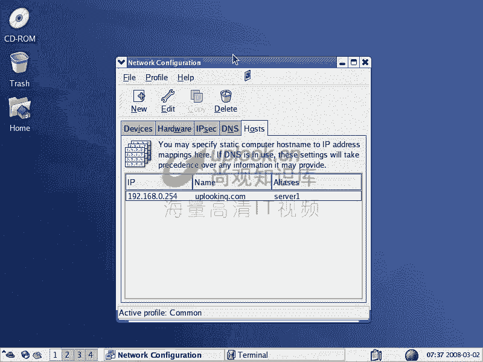
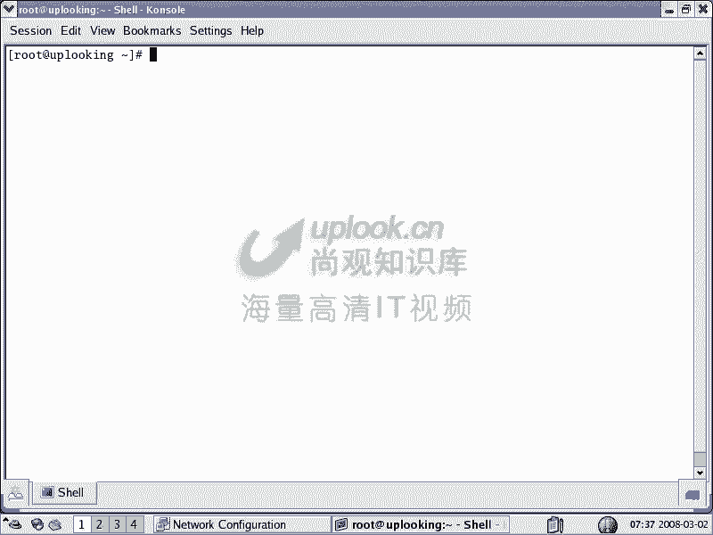
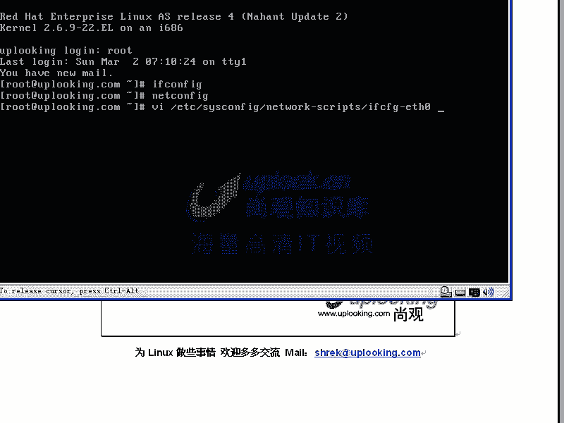
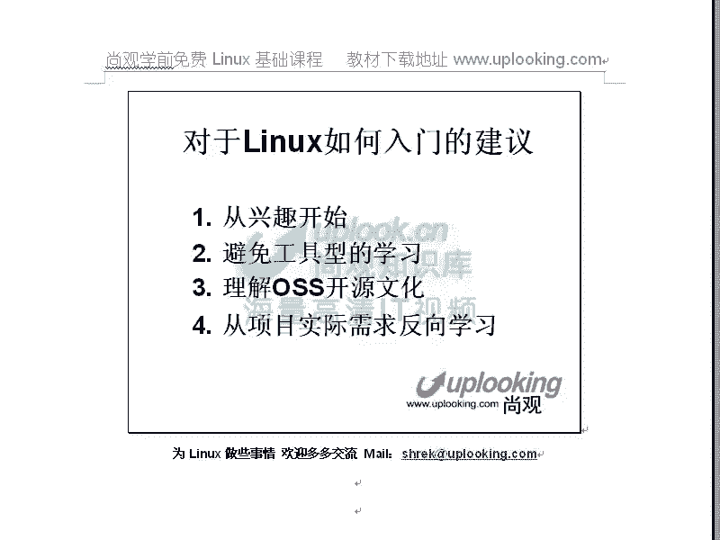

# 尚观Linux视频教程RHCE 精品课程 - P2：A-ULE-Linux-00-Linux学习建议1 - 爱笑的程序狗 - BV1ax411o7VD

我们现在开始一个linux入门课程的学习。呃，这次的话就是主要帮到大家呢非常快速的开始使用lininux。同时的话少走一些弯路啊，我是上官科技的s。然后跟我们公司的小张的话。

一块跟大家呢来就是提供一些建议啊好，大家好，我是小张很高兴，今天能和大家在一起。聊一聊。好的，那我们开始吧。大家也看到这个屏幕啊，就是说呃对于linux的一些入门的建议。

那么我觉得呢第一点的话应该是从兴趣开始。那么可能在很多人的话看到我这个就是视频以后的话，可能会心里面说哎这是windows3linux啊什么什么呃其实的话我在下面就会跟大家讲抛弃门户之间啊。

真正的高手的话呢，他不会太在意于说什么工具啊。windows linuxwindows呢在客户端领域的话，它是非常强的。而linux的实力呢，在服务器端领域。你比方说google它的集群的话是全。

是lininux平台的。但是你在各客户端，如果要是用一个呃lininux来搭建所有的应用，那你就会遇到很多麻烦，对吧？那么效率也不高。所以的话我们说呢抛弃门户之界。

然后你能把服务器端的lininux用的非常好。比方集群呢呃分布式存储啊，集群文件系统啊就用的非常很好，那你也很厉害了，所以的话呢先抛弃门户之鉴，等一下我会给大家详细讲这个问题。那么s我想问一个问题啊。

这个里面我们讲到的说这个从兴趣开始。嗯，那就像我我没有什么太多的经验，我只是说哎我们现在的话，我们平时更多的面对的肯定是微软的windows操作平台。嗯。

那么我怎么样去培养我这样的一个兴趣去了解这样一个在客户端大多数情况下，我看不见的东西呢？嗯，那这个就是从你个人的这个职业生涯定位上来考虑了。如果要是你从事的是计算机专业是吧？

打算往这个方面发展lininux。是值得你去好好的去琢磨的。因为你如果要是对计算机专业感兴趣，你就特别想知道这个底层的数据，或者说我这个服务器端是怎么做的。

那么你不会把就是把自己精力一直放在非常简单的东西上，因为你比方说我爸爸妈妈很喜欢呃上网，也很喜欢在网络上看一些电电影啊，电视，那么他们不会对计算机技术本身感兴趣。他们就用windows就可以了。

而我的话是搞计算机专业的，我特别想知道，哎我这个比方说IPTV或者说P to P技术，那么他内在的这个编程或者服务器端那边该怎么做。那么我就想深入了解下去。这时候你自然就有兴趣了。哦，明白了。

这个上面的话，我们还有一点说法。你比方说学英语，我们在大学里面学了很长时间的英语。小学初中、高中大学是吧？但是英语好像学好的人也不多。但但是如果我们一开始给大家啊一上英语课就放什么friend啊。

放六人行等等这种纯英文的这种片子，那大家就会立刻有这种表达的欲望是吧？就会觉得哎真好，那个我也想去说两句，我也想去唱两句英文歌，那这个时候自然就有兴趣。所以这样的人学英语会快。而另外一些呢按部就班呢。

今天第一本书明天第二本书第二章什么什么，这样的话就会学的比较慢一点。也就是说当有一件事情是你感兴趣的，或者是他能够引起这种实用性的实用性比较强的应用，那呃那在动力的时候，大家学起来就会比较容易一些。对。

就是对你实质有帮助啊，你特别喜欢，那这样的话就会学的比较快一点。然后另外呢就是避免工具型学习，工具型学习的话就是说有点那种呃什么样的感觉呢？我给大家又做了个PPT啊，大家看这个PPT。

工具学学习的话是这样的。呃，比方说我们举一个非常简单的例子，比方说微软的windows和呃linux，我们说的微软的东西还是很不错的。就是说它的代码质量还有它内核的这些实验方式。

比起lininux来的话，是很多地方要强，实际上很多学linux人的话，他对微软的话都有一种呃发自内心的这种憎恨啊，当然这种情绪的话呢，是呃不应该有。因为你仔细了解微软的话。

你会发现微软的技术真的是很厉害。嗯，但是lininux的话呢，它开放更开放。那么我把他们两个做比较的话，就是说呃你比方说酒店和workpo。如果要是你住在一个特别破旧的这样的一个窝po当中。

那么你可能从头去搭建它，有地基，有支柱，有框架是吧？然后呢在上面再放什么瓦片啊等等。这样的避语。那么你住的舒服不舒服，那肯定不舒服。而windows的话，你相当于一下就住进酒店里面，什么都帮你搞好了。

很舒服。但是呢这个酒店你没有办法理解到里面是怎么构建的。你没有办法知道地基打在哪，这个墙的话该怎么砌？然后呢，我的这个屋顶的话该怎么盖？那么但是窝棚你可以。帐篷。嗯，我觉得好像像你说的话。

就是我们外出旅行的时候，我不是帐篷还不是就是worken的话，是你长期住的，酒店也长期住的。那么如果workpo的话，你比方说啊几根棍子，然后呢支起来，然后呢再做一个什么茅草避语等等。

但是你了解了房屋的基本结构啊，现在就等于我们现在用windows一样，我现在只知道ok这个工具，我打开以后，我现在可以呃用来做什么做什么，但是究竟它是怎么形成的，我根本就一无所知。对。

因为全部都是就是微软遮盖起来的。大家说过一个懒人那个就是说现在是数码相机是那个傻瓜相机，以前现在是傻瓜的计算机使用者的，所以就是微软的功劳。那么但是这一点的话，对于普及化，对于普通人来说好一些。

但是对于就是学计算机的人的话，可以说是就是一种致命的商是是这个意思吧。对，就是说你没有办法理解到深层次的技术，如果要是你不接触底层或者不接触这个系统怎么架构。方说。从无到有，我怎么做一个操作系统出来。

就是说当然不是说重新编啊，就是说把人家做好的东西11块一块弄上去。比方说呃有一个启动的程序，就是butload，然后呢再有科内核，再有呢drivers就是说我们的mods啊等等这些模块一级一级加上去。

然后再加上什么启动脚本之类的。那么你是不能知道这样的一个计算机操作系统是怎么构架的，然后呢再有一个呢就是说这是打了个比方，不是说windows和linux而是扩展开来。你比方说很多人话是学那个VB啊。

或者说学一种集成开发环境，比方说VBVC啊，或者是其他的这种环境。那么从根本上讲的话，这些呢都是工具工具去学完了以后的话，能带来的好处，就是说你非常开发速度非常快，能把这个事情做出来。

但是呢最重要的就是说你要理解这个语言，然后呢学会用这些语言的话去解决你的问题，这是最重要的。然后我记得的话，原来我在刚刚毕业的时候，那时候还。是VB5。0嘛，很多人的话去学。学完了以后呢，过了一段时间。

一两年的时间，结果VB怎么被微软就淘汰掉了。嗯，那么换成C sharp了。嗯，那么呃当时的话还有人学del斐等等这些编程的集成方案开发环境。他说你在学什么？学del斐学VB。

那么这时候呢它就是一种工具性的学习。嗯，最终的话呢你要随着这个工具的升级而升级。那么工具的话自然是越来越容易是吧？那么新手的话，他是不是一看一下就找到了这种新的工具，新的工具而使用起来还比较容易。

结果呢你说你得到了些什么呢？明白吗？明白明白，嗯，就是说这个工具必然是越来越容易使用，那么越来越容易使用，你掌握这个工具的这种技术，那么会随之而贬值，这是一种变相的贬值。最后这个工具。

那么年轻人很容易去掌握。那么你年龄大了以后，那么你得到的是什么？我感觉就是像你现在说的这个问题就是知识的保鲜期一样，嗯，你学的这个知识到底可以运用多久，很不幸你现在学的，假如说你现在假设你学了一门语言。

很不幸这个这个语言环境已经消失了。所以你学了就没有用了，是这个意思是吧？嗯，所以单单的只看着就是表层的一些嗯使用工具的话，就很难去发挥，是这个意思吧？对那个小张的话总是给我总结一下。

就是说很多时候的话也未必全都是我的意思啊，所以我就问我这么想对不对？就是说我希望呢我讲的这些东西的话，能给大家呢非常就是呃。容易带来一些这种指引吧。然后有问题的话呢，大家随时给我发邮件的话都可以。

然后呢再一个呢，什么是本质能力的提升。我们说呢你掌握一两种工具，并不是但然最重要的是什么呢？就是说你掌握这种语言也好，或者说这种工具也好，或者这种使用习惯也好，那么你能触类旁测。

我们说呢一个真正的unux高手，他去掌握lininux的时间是非常短的，为什么呢？因为他掌握的是一种使用开发习惯，他已经把它融入到自己的这个使用习惯当中了，而不是去哎reite提供这种工具。

reite有很多这种通行化的工具。比方说我给大家看一下。

啊，这是rightite系统。那么我们看假如说re给大家提供啊这样的一个sstem杠fi这个有一系列的工具sstem configurefi方说net啊，那么在这里面你能看到一个就是就是一个GUI啊。

你在这边可以设置你的网卡等等。那么这种工具的话，跟windows没什么太大区别。但是很多人的话在学习的时候呢，它是怎么样，它是特别习惯使用命令行的方式，命令行的方式呢，它就是一种本质的内容。

就是这个能力的提升。为什么这么说呢？命令行的这种操作界面，你看我为了给大家截图好看点，所以打开的是X实际上在真正呃操服务器管理的时候，就是纯的文本就可以了。就是这种文本啊，就说呃给大家看一下。

那这边的话演示起来的话，可能不太方便。比方说在这里面我输入一下用户名是吧？那么我一般去配置IP地址的话，我就直接用什么fi去配一下是吧？如果想永久的更改的话，netfi去改一下等等。

或者是我直接去VI特的文件ETC下的呃ss卡当中的嗯。Night。Work。杠下面的FCF也就是它实质的内容是放在这里面。那么如果这些东西不了解，你只会怎么样？就是说我们看到的这种看到的这种工具。

那么你最终的话是学不到东西的。就是说命令行的话，我们直接一层一层一层，我就是一定要了解它的本质才可以能够操作的。对，就是说在学lindux的时候，很多人习惯是把就是图形界面打开。

然后呢去配置里面的呃各种比方点来点去跟windows操作没什么区别。当然了，你一开始想去用它的时候啊，完全可以这样学。但是之后的话一定要深入下去。嗯，我们并不是说你学这个呃图形界面就不好。

那么我要告诉大家，就是linux系统有很多种re是吧？就是两大派系。然后再加上什么呢？亲re就是用re那种包管理的sy呃woen to这些东西呢都是用re包管理啊，用那个RPM这种。

包管理而的话用的是D一B的这种包管理系统。那么这些流派的话很多，每一种的话，它的图形界面都是不一样的。那你说你学到什么东西，如果要是你不专注于什么这种途形界面，那你就是一个工具性的学习。

如果要是你习惯使用sell使用文本界面，那你就是一个本质性的学习。而这些人的话，他在接触其他的unixux系统，在接触其他的这种linux统时候就非常快的可以上升。所以这就是本质的能力提升。

而学习这种工具，那你最终就跟微软一样，你已经受到了微软的这种影响，那么一辈子都离不开它那种操作方式的话，你是离不开的。所以像re等等，他们出于自己的利益或者自己的考虑。

那么他们自然会让用户想去习惯他们自己的这种呃管理方式管理命令是吧？但是呢你要知道你自己本质的话，学到什么地方。这个清楚了吧？清楚清楚了啊，好看好，我们看一下啊，就是说学到这个本质提升的话。

我们说本质能力的提升。让我们看一个例子，就是看google招一些什么样的人，他对linux或者对linux啊这些东西的要求是怎么样的。我们可以看一下google的话呢。

大家打开以后可以在google大全当中点开，然后这边有加盟google，大家可以现在的话就可以自己去打开。嗯，然后加盟google的话，你看有北京的或者上海的是吧？假如说我点到我要找研发方面的职位。嗯。

那么点击进去，比方说软件工程是吧？嗯，那么在这里面比北京啊，进去了以后，我们给大家已经打就是我曾经打开过这样的几个职位，我们随便点一个，比方说。除了mobil和这个嵌入式的这个linux之外啊。

我们看一下其他的，比方说呃。软件工能师系统方面的，它都是说什么呢？非常强的什么使用这些语言的经验pro C andjava哈嗯嗯然后呢。

还有就是说要有unixlinux或者是windows这种呃知识系统的知识。然后呢有hell编程hell的话，就是我们刚才看那个命令行，就ba shell是一种是hell的一种。然后还有什么pro。

pro的话呢是一种呃脚本语言，pathon也是一样，pathon也是一样。嗯pathon的话是用的蛮多的。pro的话呢跟pathon相比话，pathon可能比pro的话更适合大规模开发一些。

它有点就是再加PP等等。这个linux的这个语言的话是很多。也就是它考察的不是说你会VC或者会B还是怎么怎么样。而是在于你用这些工具。集成墙管你三七21，我用什么工具都别别管我。

但是我最终能把这个事儿干好。那么但是呢你unux或者是linux的这种环境的话是必须的啊，你说windows环境的话，我很熟。那么linuxlinux我不太清楚。那你要知道google的话。

100多万台机器啊，那么是100多万台是以前了，200多万台或者说更多的机器，他们全都是lininux平台的。嗯啊，那么你熟悉windows的话，只是说熟悉windows下去开发他们的这些工具而已。

所以的话unux或者lininux平台，它是必然呃就是说要求的。你们可以自己去看一下，你可以看看百度的，百度也是这样要求的。很多同学的话都说啊我学了linuxlinux以后能做什么。

那么我们说如果你以后接触呃。接触这个IT业不接触不熟悉lininux是不可能的。那么肯定是要接触lininux。如果要是你lininux呃很熟的话，对你来说是有帮助，而且是有很大的帮助。

那么对于这种就是说尤其是互联网络的公司来说，那么它的这个市场份额是非常非常大的，很多你看一下像IBC的这种什么市场报告什么的？那里面的数据都不是真的，就为什么不是真的。

就是说它是按照你出货量或者是说那个就是这个钱啊，就是说比方说呃价格等等这样去调查，但是你要知道google几百万台机器，它不用某一个发布完，它直接自己编译。

那你说这个lininux算不算在这个市场份额当中，它没有算进去啊嗯，明白吗？很多这样的公司吗？呃，就说几大个google肯定是用啊，大家可以从公开的资料里面去搜索百度你可以看百度招聘的职位。

那么linux平台或者说linux平台lininux平台的很多嗯主要的。他的互联网络平台就这样，新浪、搜狐163，还有呢像我们什么盛大征途，那么不用linux可以说是凤毛麟角。这是新时代的IT公司。

但是你要进入到一个，比方说过去的IT公司，或者说比较呃强悍的，比方说微软那，你肯定他是不用windows的那它不是用lininux的，嗯是不是？对，说错了啊。看一下，那么随便点一个。

你比方说呃我们看呃就是说搜索工程师是吧？搜索工程师的话，这边是专门的这样的一个呃就是他自己的专业的这样一个东西。在这里面的话呢，是说它的专门的像什么视频啊等等这样的一些东西。

它是招聘其他公司的这种相应的职位。那么资深软件工程师，我们看一下那么大多数都是什么熟悉linuxlinux环境C语言javapyython嗯啊，是吧？PD degree嗯。

像我们这样的10多个职位当中不写linux的有多少个，这是gogle再看下百度，再看下163啊，再看一下征途征途的话，因为呃再看征途或者说那个巨人网络吧，巨人的话，就是对，它转名叫的巨人网络。嗯。

然后像这些公司的话用的是非常多的。呃，这个呢就是我们给大家举个例子，且不说这个啊，且不说这个linux开发，就是开源工程师。回到我们这边来看，那么你会发觉什么是本质的能力提升。

就是说你不是说熟悉一两个工具啊，就叫本质能力提升。你必然是熟悉什么？就是说这个环境操作这个环境的能力，还有呢操作这个语言的能力。然后并且结合起来去完成你自己的事情，那么这个就是本质能力的提升。

一定要往什么呢？深层次去走，从表面上来看，就是说有一些简单的技术，你掌握它是很容易的。当然最终呃可能在几年之后的话，你不得不被迫转行。我有一个同学的话就是这样，他python的话写的非常不错。

然后像什么so啊这些东西，就是python里面的一些什么基于服务的这种应用啊等等，学了很多。当然最终呢啊这个python这个工工具，那么这并不是一个呃就是本质的提升，它是工具的这种学习。

最终他不得不转行。好，OK这边是回过头来再看。那么我们说在学习linux的时候，还必须得要理解OSS开源文化。开源文化的话是这样的，open source software就是OSS哦啊。

开源软件开放源代码软件。那么你要知道linux它只是一个内核，只是一个 kernelel，嗯只是一个 kernelel，并且包含了它外围的一些驱动。那么真正团结它它周围的。

比方说apache这些东西全部都是开源软件，它不能叫做linux系统。对吧嗯那么比方来说， kernelel的话呢，在这里面非常小非常少。LS到L啊。不承诺录下。大家看VMLNUZ啊。

这是我们的一个什么呃压缩过以后的内核，这个内核的话，1。4兆，这就是linux的内核了。然后呢再加上它的一些驱动模块等等。那么放到LB下的model当中以你的内核的版本号命名的这个目录当中。

就这些嗯这就是linux，那你说其他是什么团结它的周围的额外的一些软件，这个我们到时候会给大家讲基基U是什么东西。那么这个时候呢你要理解linux它只是一个开始，也就是用linux的时候。

linux只是一个 kernel，那它的周围的一大圈软件的话，是linux真正的实力。你比方说google看中的linux看中什么呢？它可以改这个linux。

首先再一个呢就是linux上面像thon现程写的代码等等。呃，什么pro的话，它都可以去用，都可以跑在这平台上，所以它最终linux是什么东西呢？只是一个非常基础的工具而已。非常基础的平台。

那我可不可以这样理解啊，就是说呃如果我用就是windows微软的。操作平台的时候，那么我只是一个纯粹的用户。但是现在的话就是说如果我学习lininux的话。

我可以是那种能够自己定制自己想要的东西的这样的一个自产式的这种嗯把自己的从用户的身份转换为一个生产者，嗯，可以这样想，很多公司就是这样的，它可以把linux和linux下的这些东西啊，传一下。

就相当于传机器嗯嗯然后呢，比方说linux系统装上去，然后呢，再加上一个什么在线办公的免费在线办公的那样开源的软件，那加上去以后再跑在ache和PP下。那我把这个东西放在一个服务器当中。

我就可以去卖钱了，就可以到公司里面去推销这个东西，你们不用去懂linux插上网线以后，在线的这个平台就有了。在线办公平台就有。所以也就是说linux是不是更适合于那种个性化的定制。

服务呢它适合于你做产品，适合做产品。对你比方说你要做一个产品。你把lininux的话定制或者lininux代表的一系列的开源软件，经过你的这个更改以后，然后呢放在里面。

比方华硕的EPC你知道1990的那种就是所谓的笔记本电脑那它里面的话，如果要是装windows，它需要再给微软的话，几百块钱，leense费用对几百块钱话是必须得要掏的。但是如果你装linux。

那linux的开源软件的话，在网上可以随意当当，我开发的一些特特定的比方说ACPI的模块，就是电源管理的模块等等，让让他在我这个小的平台上跑起来。

那我这部分费用我是不需要费的是不是嗯那这样它的产品的这个价格的话会很低。但你单买一个windows版本，那么少了几百块钱，你是下不来的至少一个最简单版本要三四百块钱吧。

那你的这个产品就不是1990而是2400左右了，对吧？然后呢理解这个开源文化对你的话非常。重要嗯，然后呢从项目实际需求反向去学习，这个点非常重要。很多初学者的话呢都说哎我这个会联公司以后能干什么？

他必然是有一定需求以后，你再去学习它比较快。你比方说老板啊，拍着你教版，哎呃一周之内啊，把公司的这个论坛搭建起来，嗯，如果搭建不起来，那么明天的话，我们就拜拜啊，就是说下周一的话就不要在这边待着了。

那这时候你就疯狂的去找各种资料把它搭起来。嗯，那这就是一种什么实际的需求去了以后，我反向去学习，涉及到什么知识的话，我再去学，那么什么是最慢的呢。我见很多同学的话，哎买那种厚新华字典一样厚的书。

我那个书真是从头看到尾我都费劲。比如说看完了以后还要记住，看完后面就忘前面，所以这是一种非常不好的学习方式，好像上学都是这么学习。所以的话我们一般学到的东西都不是特别有用。嗯对吧？就像我们说的。

如果英语呃小小学的。时候的当然看friend不太合适了，是吧？你小的时候的话，一开始就是原版的迪士尼的动画片，那个时候的话那个语速又慢，然后你就特别有表表达的欲望。那你英语自然就不是什么大问题。嗯。

对吧？对然后公司不是公司，就是小学里面的这种老师啊学生都喜欢学说英语，那那大家学英语的话，肯定口语是没有问题的，再去看看书的话，背背单词可能就好，所以这就是从实际需求反向去学习，这点非常重要。

这是初学者的话容易犯的一个大问题，他们都是拿本后书，然后在那边一页页放，我们正常的话，因为都会要面临学校教育的时候是正向的一个学习嘛，那比方说要学的话，第一入门。

然后第二是不是简单的那个VI服务器的一些编辑语句，肯定都是这样学习对，这个是说我们反向学呢？这个是说我们系统的去学的时候，是这样然后呢，但是那个。时候的话也要以案例的方式去组织啊。

你比方说我要让你完成一个任务。然后呢，我才先把你现在什么就是一张白纸一样，什么都不懂。那我先给你任务，然后让你呃就是有个框架以后，然后你开始做这个事情。最终的话呢。

你需要以案例的方式呢去学习才比较好那么按部就班的来还是比较难。比方说现在啊我现在非常简单，我艾le一个值，比方说呃一串东西AA这样串的东西。然后现在我想把外部服务器弄起来太简单了，是吧？

然后现在这样service hTTPDstarO这样它一启动。就这样两步是吧，然后呢用elink来访问一下这个页面，192168点。哎，我看一下我的IP地址是多少。1。231。

OK你看了刚才那串东西就已经有了嗯。是吧AA那串东西就已经有了，你说它简单不简太简单了。嗯，这个时候呢你学习的兴趣就立刻有了。你比方说我们再打开IE，就是像刚才那个IEIE的话，也可以立刻访。

就是刚才访问google那个页面。我在这边1921168。1。231，然后你看哦直接就可以出现了。对，你说几步呢，我们一共做了几步，就是两行命令吧，好像。这个很简单的。你看ecle一个值是吧。

到外界的3W当中HTM index点HMMNHtM然后service hTBDstar把这个服务一起来，然后一定自己访问就OK了。嗯，就这么简单，那么当你做完这个以后，你再去搭一个什么搭一个论坛。

论坛的话又需要有数据库，你要再把数据库再启动起来，然后再做成来，这个时候呢就很快。我如果要是LS命令，然后呢再去1。1点的去翻那么厚的书，这时候的话是非常慢的，学习的速度非常慢，明白吧嗯？嗯。

那么现在就是说这种的话，几行命令就OK了。那你想下次重新启动的时候啊，HTTPD的话呢，它不会启动。那么你这个页面又没有了，怎么样让它去永久的生效的？你这时候又有疑问了是吧？那么又学一个命令。

那太简单了，这样的话就学习非常。如果下次想让party还是启动的che onHVD啊是吧？那么当然了，我们一般呢在呃讲完课以后的话，是希望什么呢？就是说最终的话它可以自己编译啊，根据需要的话去编译。

你能把它用起来还是一回事用好了，当然另外一回事，你最起码要加什么日志分析是吧？再加上什么呢？定制模块，这些模块这个干什么那干什么呢？是以现程模式还是进程模式去运行，再去调优它，这就是我们以后讲内容。

那么再再多了以后是不是要加个集群等等，这就是需求不断的过来。对吧这就是我们倡导的什么学习方式。所以的话呢要从实际的需求反向去学习哦，啊OK and no嗯，好的。

