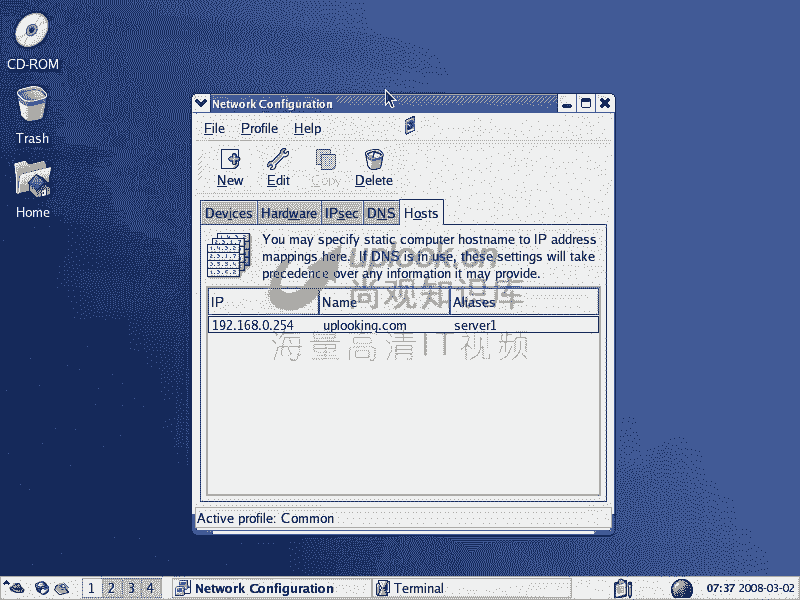
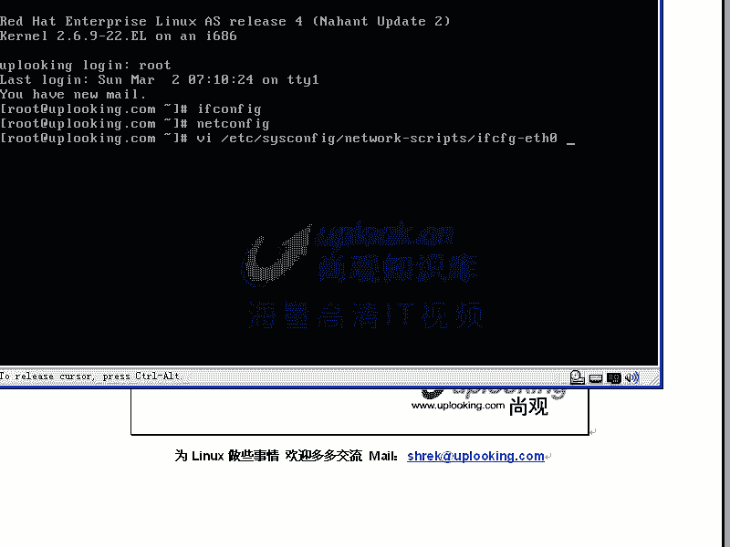
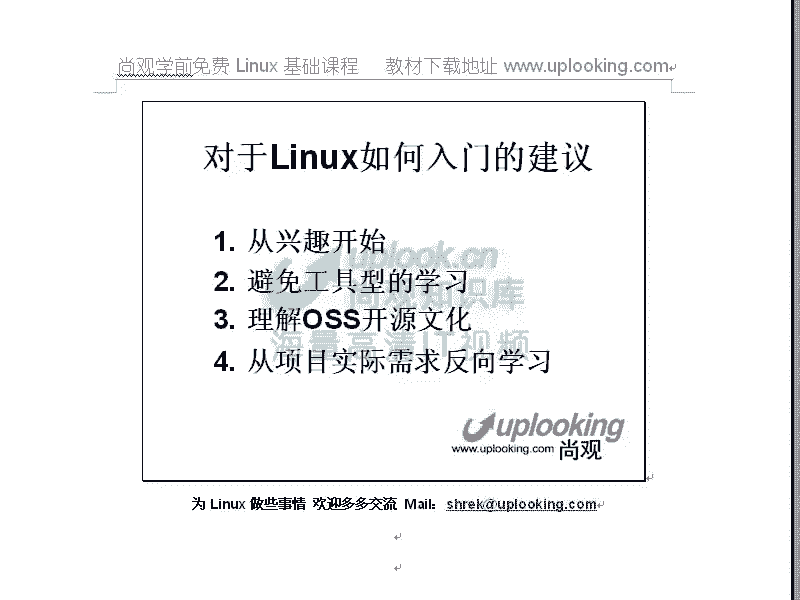

# 尚观Linux视频教程：P2：Linux学习建议 🐧

在本节课中，我们将一起探讨如何高效地开始学习Linux。课程将提供一系列核心建议，帮助你快速上手并避免常见的误区，为后续的深入学习打下坚实基础。

## 从兴趣开始 🎯

上一节我们介绍了课程目标，本节中我们来看看如何培养对Linux的兴趣。学习任何技术，兴趣都是最好的驱动力。对于计算机专业或希望向IT领域发展的学习者而言，了解服务器端技术的内在原理本身就是一种强大的兴趣来源。这不同于普通用户只关心如何使用软件，而是渴望探究技术背后的实现机制，例如服务器集群或P2P技术是如何构建的。

## 避免工具型学习 🛠️

在明确了学习动力后，我们需要警惕一种低效的学习方式：工具型学习。这种学习方式过于依赖特定的图形界面或集成开发环境，就像住在装修好的酒店里，虽然舒适，但无法了解房屋的建造结构。




*   **工具型学习的弊端**：当工具更新换代（例如从VB过渡到C#），之前投入的学习时间可能大幅贬值。工具本身会越来越易用，使得掌握特定工具的技能竞争力下降。
*   **本质能力提升**：真正的能力提升在于掌握底层原理和通用的工作方法。例如，在Linux学习中，习惯于使用命令行（Shell）进行配置和管理，就是一种本质能力的锻炼。命令行是跨不同Linux发行版的通用技能，掌握了它，就能快速适应各种Linux环境。




以下是本质能力提升的关键点：
*   深入理解系统架构和配置文件（如 `/etc/sysconfig/network-scripts/ifcfg-*`）。
*   掌握Shell脚本编程和系统管理命令。
*   培养通过修改文本配置文件来解决问题的习惯，而非仅仅依赖图形化工具。

## 理解开源文化 🌍

Linux不仅仅是一个内核（Kernel），它更代表了一个由众多开源软件（Open Source Software, OSS）组成的庞大生态系统。理解这一点至关重要。

Linux内核本身很小，其强大功能来自于周围丰富的开源软件，如Apache、Python等。许多公司（如Google）和互联网产品（如百度、新浪）都构建在这个开源生态之上。学习Linux，实际上是学习如何利用和定制这一整套开源技术栈来构建解决方案，这为个性化定制和产品开发提供了巨大空间。

## 从实际需求反向学习 🔄

最有效的学习方法之一是从一个具体的、实际的项目需求出发，反向推导需要学习哪些知识。这比按部就班地阅读厚重教材效率高得多。

例如，你的第一个目标可以是“搭建一个能显示简单网页的Web服务器”。这个过程可能只需要几步：

1.  创建一个测试网页文件。
    ```bash
    echo "Hello Linux" > /var/www/html/index.html
    ```
2.  启动Web服务器（如Apache）。
    ```bash
    service httpd start
    # 或 systemctl start httpd
    ```
3.  通过浏览器访问服务器IP地址进行验证。

完成这个简单任务后，你会获得成就感，并自然产生新的问题，例如“如何让服务器开机自启？”或“如何搭建一个带数据库的论坛？”。这样以问题驱动、案例实践的学习路径，能让知识吸收得更牢固，学习过程也更有趣。

---



本节课中我们一起学习了Linux入门的核心建议：从兴趣出发，避免停留在工具表面，深入理解命令行和系统本质；认识到Linux背后强大的开源生态；并采用从实际项目需求反向推导的高效学习法。掌握这些理念，将帮助你在Linux学习之路上走得更稳、更远。