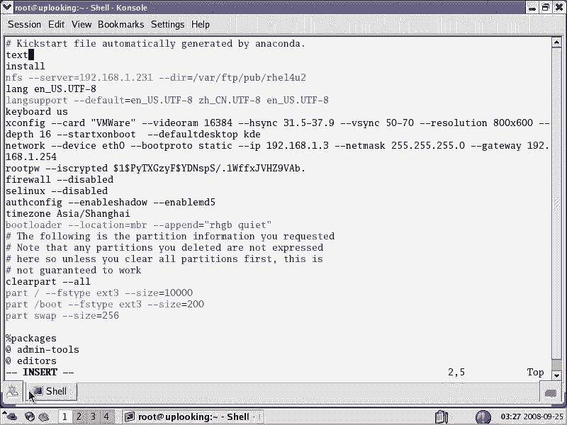
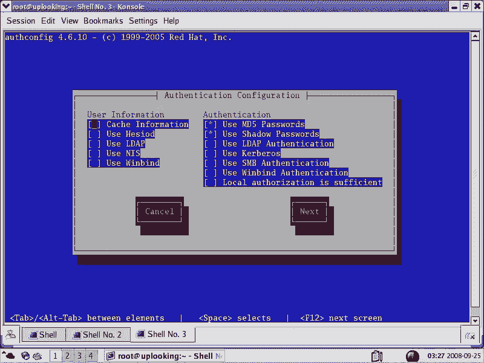
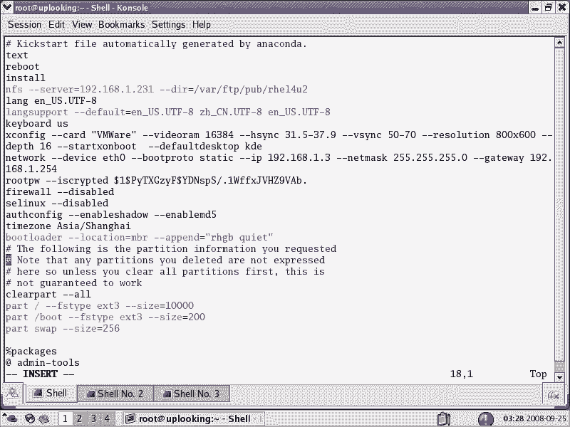
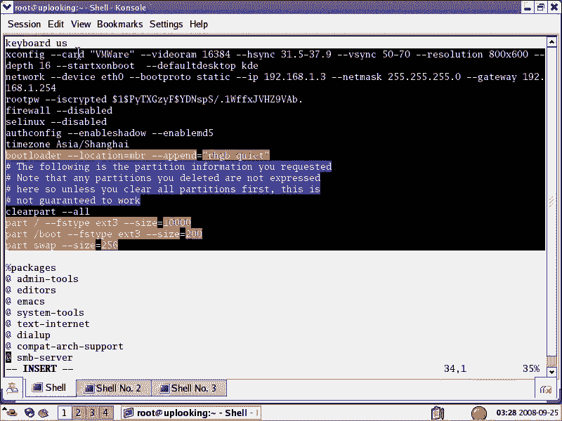
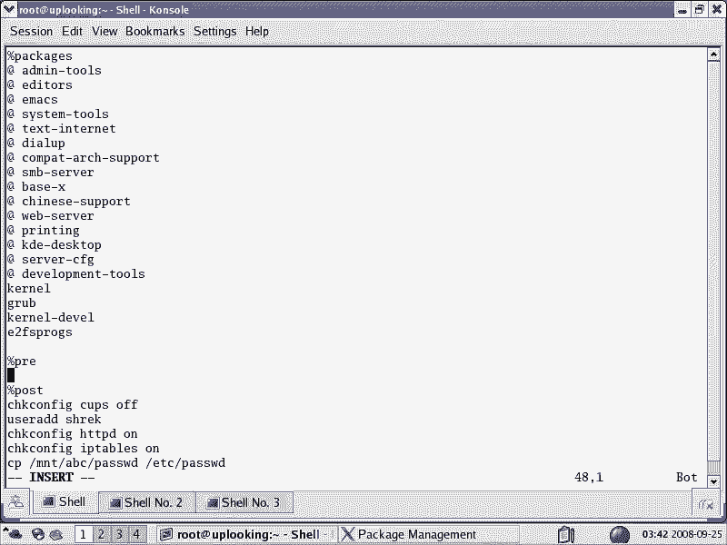

# 尚观Linux视频教程RHCE 精品课程 - P30：RH133-ULE115-0-1-RHEL-kickstart-无人职守安装 - 爱笑的程序狗 - BV1ax411o7VD

欢迎光临呃，ULE的115部分的第一章。我们呢在1152部分的话呢，给大家讲的是什么呢？linux啊linux的基本的操作。那你如果接触到windows以后，你首先是想干嘛？哎，我来点两下鼠标是吧？

我点下开始菜单，然后呢，我装个软件，那你基本的使用，是第一印象，就是想想去最起码我要用它吧，然后呢，用的熟练了以后，也就是在我们的第一部分的话，用的比较熟练了以后的话，我们再开始什么呢？再看第二部分。

再把这个系统的话呢，分解开系统怎么分解开呢？比方说我现在有个系统。😊，那你知道它的驱动程序的这个装载机制是怎么样的。在windows里面，你可能通过向导方话来做这件事情。放在wininux里面。

如果你不知道，那么你可能没有办法把这个驱动装好，对吧？那么驱动程序的装载机制。然后再一个呢，你现在的话呢有呃windows里面有C盘D盘E盘是吧？这样的话呢，你在做就是在放数据的时候，你很直观。😊。

linux里面就那么一棵大树，这一棵大树它从根开始。那么这个呃你有一个新的磁盘，或者有一个新的分区的时候，到底是怎么用的那这个存储的话到底是怎么去管理是吧？这个文件系统的子系统啊。

这个文件系统的子系统到到底是怎么运行的那怎么样去加载这些分区的那这个你也想知道。😊，在linux4里面，你最起码要用文件嘛，对不对？然后呢，接着的话还有什么呢？

还有像我们的这个呃像我们的这个类似呃比方说呃你的这个计划任务啊，计划任务计划任务啊，还有就是说什么日志系统啊，还有什么呢？备份系统啊，还有网络子系统啊，X windows系统啊。

整个系统的话是怎么组织的，怎么从一开始安装到最后结束的呢？呃，一开始安装，然后到最后就是说呃就是就是安装完了以后，那么它怎么启动从deos啊，然后呢一步一步一步过来啊，这个过程的话呢。

到底是怎么去组织的，这个也是呃大家要感兴趣的。所以的话在我们112部分对112部分来说，那么你是学会了用这个系统。😊。

学会用这个系统。那么115部分是干什么呢？115部分的话就是解析这个系统，把系统的话呢解就是分解成非常细。然后呢你去理解它。那这个时候的话呢，如果系统有什么问题，或者需要定制。

或者需要 troubleub收oting啊，就是排错，那么这时候呢你都可以找到方法，这就是我们的什么呃上官的这个115部分的目标，就是把系统的话像庖钉剪牛量啊。

把它的呃尾巴啊身体然后呢四肢头啊都给大家分解开。那么解剖开给大家看这个结构是怎么样？为什么这个腿会动啊，为什么呢？这个尾巴来回摆是吧？那么这就是我们115部分的呃目的。😊，这个地方的话呢。

对于理解个系统来说非常重要。那么我们先从一个第一章开始，就是kiickstar无人智安装来看kickstar无人制安装的话呢呃，它它叫什么T脚就开始是吧？kick star是吧？

这个东西呢它是re的一个安装机制也就是说re编了一个就是说启动的这个图形化的这个工具，那么你可以在自己的根目下看到一个这样的东西，就是说我们的under杠SFG对吧？

under就是说re的这个安装程序是一种啊它是用编的也是一种on是一种脚本语言，它跟hell shell是差不多的啊，就是说它不是he，但是它是一种脚本语言。

它像什么什S这些东西都不多这些东西非常呃非常相像那么的话编出来的什么呢？编出来的。😊，编程under counter以后呢，这个under count是用来干什么呢？

是用来install啊instlinux的。是这样的，那么它编出来一个应程序叫做under。在linux里面的话呢，我们说快速的安装啊，快速的编呃快速的这个应程序是用python来做比较多一点啊。

是用python来做的比较多一点。这就是我们的这个原由啊，就是说我们这个S就是KS文件的来源，就是说KS文件是谁去做的呢？是我们的under去读的under是什么呢？是python编的一个什么安装程序。

那么这个安装程序呢，它可以照着KS点CFG这个里面的这个设置的话呢，来自动给你安装。你说哦自动安装这跟我有什么关系呢？我一般的话点来点去，我也不嫌麻烦。但是实际上呢你再点来点去。

你比方说我们在12部分的话，有这个安装H14H15的过程是吧？在你点来一步一步一步一步那个过程当中，实际上并没有安装。那是到底什么时候安装的，就是你点那些步骤的时候呢，实际上是在生成这个文件。

就这个KS点CF文件，只能点最后一步确定的时候，under才会根据你刚才设置的保存成这个保存的这个文件啊，你设置完了以后，保存那1个KS点CFG的文件。那么under才会根据这个文件的话呢，来进行安装。

也就是最后的话，它实际上还是一个自动的过程。😊，那很多同学说。呃，这还是跟我没关系啊，我就点nex next就完了嘛。那么你想一想。在你点下一步下一步那种传统的安装过程当中啊，你是不是在进行设置。

设置完以后的话，保存成一个文件。这个文件的话最终被underac count这个程序呢所读取，对吧？那如果你在之前已经生成好这个文件，直接由undercon去读取。直接就undercon去读取。

那么是不是你就不用在nex next下一步下一步了。这个的话呢，你说哎我不需要省那么多事儿啊。但是你想一下，你在一个工作环境里面，你比方说像百度之类的这种工作环境里，你装的程序啊可能不是一个两个呃。

装的这个机器的话，s尔不是一个两个，那百度的话几十万台总是有的是吧？那么google的话是几百万台，那么我不知道百度到底有多少台啊，那么google的话呢，2005年的时候就200万台机器了。

到现在的话更多，那么这些机器该怎么定制？你说哎我们公司的话没有像google百度那么大，那这时候又有个问题了。你说哎google呃就是你你们公司的话有几十台电脑总呃几十台服务器总是有。😊。

现在你想让这些服务器呢装的软件都是一模一样，配置的环境都是一模一样，怎么办呢？那你可以生成1个KS点CFG文件，这样的话呢，它就可以完全自动的安装了。这就是我们的什么。

这就是我们的K kickstar安装的这个就是说必要性啊必要性？为什么要学学习它那么kickstar这个名字由来于什么呢？

kickstar kickstar的话就是T一讲就开始这个安装方式叫做kstar方式。那么它呢实际用到的文件就是KS点CFG就一般情况下的话，我们这个名字叫做KS点CPFG就是kickstar对吧？

kstar那么可以用的kickstar杠S点CFG也就是你在安装的过程当中呢，安装完了以后，系统会自动把你安装的那个种种的这个设置。😊，保留成这个文那保就是设置出来那个文件的话，保留下来。

那么就生成了KS点。那undercount杠KS点CFT就这个文件。明白了吗？那这个文件的话，实际上就是一个原始的你当前系统的这样的1个KS点CFG的这种文件是给kickstar呢这个机制用的。

那么kiickstar的话呢，它的来源是什么？sm公司的这个叫s公司的那个呃就是s拉us斯系统，也可以无人的这种大规模的去定制。这个无人至手大规模去定制的话，它也叫做什么什么star。

那么re这个的话是reuxlinux系统实际上跟索斯很相像很相近的。所以呢呃re呃就是re这个系统的话也叫做什么什么star叫kickstar啊是这么来的那我们在质量里面的话呢，大家要学一些什么东西呢？

学一些那re的这个安装的深层次讨论。那么re安装程序kickstar的这个安装机制，然后执行它的所必要的一些条件。然后这个文件的详解。最后的话呢我们要执行kickstar的这个呃就是说这个过程啊。

就是执行一下它。😊，好，说了那么多，我们就开始。大家看到呢就是说kickstar文件啊，就说我这样的，刚才罗里八嗦很多啊，那么最主要的一个意义就是什么呢？它可以开始一次无人值守。

就是不需要有人跟它交互的，自动的安装这个自动的安装，你可以告诉这个机器，它的配置文件在哪个地方。也就是说我们这个配置文件就是kickstar文件在哪个地方，让安装程序找到那个配置文件以后。

它就自动安装了。那这个自动安装，它有什么意义呢？第一啊它可以大规模的去定制一大堆的机器。😊，这个大规模定制一大堆机器，你说我不需要我就那么几台机器，但是呢你总是需要一个规范化的环境吧。

比方说你手下的话呢有两个呃就是说系统管理员，你说哎把那10台机器给我装成什么什么样的，他在里面点噼里啪啦噼里啪啦一点，一下午就在干那个事情。结果呢他在装两台机器的时候，忘了选哪些包了，哎，给你造成麻烦。

但是呢如果要是你有kixel文件，那么有这样台服务器的话，为他们提供就kixel文件呢共享。那他安装的过程的话，他可以直接。十分钟就可以干好的事情，不需要人在那边去交互，对吧？你说第一啊。

就是我们说第一点就是说可以呃大规模的去定制。呃就是大规模定制一堆机器，而这些机器的话呢是不需要就是说呃不需要这个个性化的。那么这个时候的话，每一个呃机器装出来的都是一模一样，标准的这种工业的这种呃形式。

就跟罐头一样，每一个罐头都是一模一样，对不对？就这样的。第二点的话就是说呃当你需要呃当你不需要交互的安装一个程序的时候的话，你也需要kickstar。这个我们有一个例子啊。

就是我有一个学生这个学生的话呢，我觉得很了不起。那么十几岁的话就在外面打拼。那么后来的话呢，在呃就是说后来的话呢，它。就是自己呃做就是做创在创业啊，他做的是一个网吧的里面用的专用的lininux系统。

这个网吧专用的linux系统的话，你像网吧的话，它的数据量很大，那么有些人的话上这个上那个那么这个时候呢他在给网吧做了一个服务器，这个服务器呢是linux系统带转发啊，带监控等等，还有带电影服务器等等。

那这一套系统的话呢，你只需要拿着到DVD光盘放在那个网吧的那个就是那个服务器的光光驱里面。那么一放进去自动运行，它就自动安装了，啊，不需要人去干预，直接他就自动安装了。

那你说这个网吧的人他需不需要呃学习lininux，他不需要学。因为呢你光盘放进去，我自动完全都安装了，安装完了以后，这个系统就是他要的那个样子。然后呢，通过外部界面进行一下配置，OK就起活了。

那这时候的话呢。你是一个会lininux的高手，或者说高手可能谈不上，那就是会lininux的。但是呢呃你让一个毫不懂lininux的人去装lininux，然后你要给他解释。

而且这个人的话还远在千里之外，你还没有办法控制，你是不可能做到的。所以这种方式的话，在这种情况下用的也是非常多啊，这是一个现实的例子。后来我那个学生。😊，呃。

自己做的这个就是说全国的话装机量的话已经有几千个了，就是几千个，然后呢还在就是还在做，后来他就不干这行了，他去搞那个视频网站了啊，这是后话。所以的话我在这边的话给大家说一下呢。

就是原来的这个就是说这个根据我的经验啊，kstar会用到哪。那这个地方呢就是做一下结束啊，我们现在开始看一下呢，到底怎么用kickstar安装的话是linux的自动安装方式。

那么主要是自动定制那就是开开发的。那么它呢支持硬盘网络安装等等。就是说呢你在linux呃ask method，就是我们呢在122部分呢学习安装linux的时候，linux ask method的时候。

那些安装方式它都可以支持。那你只需要把KS文件放在某几个介指下，要放到软盘上放到光盘上，放在NFS共享当中FTP共享，或者说一个什么呢？HTP共享都可以。那么这时候呢安装程序的话。

从kstar文件里面的话去。😊，读取啊这个配置参数自动安装，就这样。那么我们来看一下呢，就是实际的一个实际的一个就是说这个文件。那么很多时候呢，我们为了得到这个KS点CFG这个文件的话。

你可能要自己全心去写，这个很累的啊，反正我是没有这个本事能好一字不落的把它写出来。如果你有这个本事的话，那你肯定是专门干这个的。就比你是戴尔的这个工程师，然后呢，每天要定制一大堆机器等等。

那么我的话一般都是这样来做。那么我告诉大家，我的这个工作步骤，一般呢我要进行无人知种安装的时候，我会这样的VI啊。😊，IIS点C这是我当前的这个系统，它的配置kstar配置。那么打开这个文件以后。

这个文件的话是很乱的是很乱的。那么这个文件的话显示我当时安装这个系统的时候是怎么安装的。首先的话我进行的是一次int过程。你说废话当然是inst了，那实际上呢它要upate啊。

update就是说呢你可以是升级也可以是安装。你比方说现在我们知道啊的版本的话，你方说企业版的话，HER5是吧？后面还要带个update一是吧？那么现在我们用的是企业版5当中的第一个升级版本。

那么第一个升级版本的话就相当于windows XPP1对吧？那现在我想装一个呃就是我现在SP2出来了，或者是update二出来了，我要把它全部都升级下。

那这个地方就是upate所以int的话就是全新的安装。那么安装的时候的话，它找一个数据源，就是我们的inst。😊，install tree的话呢。

就是说它在每个地方能获得它安装过程当中所需要的所有的什么安装包，对吧？那这个安装包的话叫做什么install treeinstall tree的话是放在这个地方哇系的FTB加POB当中HL4U2啊。

这是我们的习惯。放这里面那么呃这个找的server是什么server呢？是19168。1。231。也就是个当时安装的时候呢，就是一次NFS的网络安装。那你说我想用其他的安装方式，其他安装方式。

比方说FTP方式，那么或者其他方式，这个时候的话呢呃你当时怎么装的这个地方的话，就怎么记录下来。如果要是是光盘安装那就C就普通的方式了。当时的装的时候的话，这个安装的过程啊。

语言的话呢一直都是英文的啊这个我们也给大家反反复复强调过，你在装的时候不要装中文界面，不要装中文界面，不要用中文的这个环境越用越傻啊，越用越傻，不是说中文傻，而是说你依靠中文的话。

你没有办法获得最新的这个知识。因为毕竟英文那就是linux的这个开发者或者说帮助呃英文的话是最权威的啊，那么你像内核代码当中呃，中国人写的代码的话，毕竟还是少，对吧？那么各种各样的这个代码它全都是英文。

😊，うい。所以呢习惯这个环境了以后，你自然会获益很大。如果要是你呃还是中文的那我见到很多人都是这样，最终啊你不得不改。那么与其叫别人逼你改，你还不如自己主动去改所以的话我们再看下面啊。

就是说这个语言支持的话，你可以装中文的语言支持看到了吗？有中文的语言支持，这个时候呢你装完了以后的话，你你的系统访问中文的页面，中文的网页的时候是可以的，没有问题。

这些的话就是我们一步一步选择的那个过程，它全部都记录下来了。比方说呢呃用US的这种键盘啊，就是美国标准美式键盘，然后呢，什么样的图形啊什么样的网络啊，什么样的网卡。

然后呢呃如此的加密的password是多少。那么firework是 disable的S disableable，然后呢认证方式的话是采用什么shadow和MD5加密对吧？那么时区我们说非常重要。

是亚洲的什么上海对吧？然后呢装到哪个地方 load的这个选项，就是说这个。😊，呃， kernelnal的内核的选项。这个马上我们在第二呃第三章的时候的话，就给大家介绍，就是 kernell的参数。

 kernelnal参数是RHGB和qu就是说。嗯car到初始化的过程哈，不要给你显示出来。那么在这个配置文件里面呢话，你直接去用用不了，为什么用不了呢？

就是因为下面你看下面这电话有个什么clean partclean part就是删除所有的分区啊，杠杠2，删除所有的分区，然后呢，part分一个分区，名字叫做什么呢？根啊。

这个分区的话是根分区是ES三文件系统，那么大约是3G啊，这个很少很少3G为什么这么少呢？因为这是讯机啊，对吧？然后呢，一个slpe分区，那么是256兆是这样的。那么如果你不把前面的注释取消掉啊。

它是不能用的。😊，那很多人都奇怪了。😮，那为什么我要什么？为什么我要把它注释掉呢？你这个文件为什么要注释掉呢？因为呃它这是一个保护机制。如果要是你什么都不懂了，学的是一个什么呃半屏促。

然后直接拿这个文件去搞，一下的话把它的系统就原本的系统。你像an删除所有的分区是吧？全部都删除掉了，那你数据都找不回来，你找谁麻烦，那到这个破东西写的太差了，是不是你会这样的抱怨。

实际上人家的话呢是为了懂懂的人写的，那么所以linux系统的话呢，他为这种傻瓜型的用户的话呢，考虑的就是说呢呃比较少，但是这个地方的话是一个非常人性化的设计，如果要是你个井号前面不注释就是注释不取消掉。

那么他不会起作用，他不会删除你的分区，也就是你不懂的话，那这个文件能不能损害让你呢？损害不到。那么你懂的话，自然会把它的井号注释取消掉。那么只要你这样做完哎，这个文件就可以做了。然后你保存下保存退出。

这个时候呢，它就可以来进行什么，就是说就可以把它。😊，那个呃真正可以用，这个时候的话才真正是呃可以用的1个KS文件。那么这样的做完了以后呢，这个文件你看我们做了一些什么修改，基本前面的井号，三个地方。

前面的井号的话去就是说呃去掉。那么如果要是我现在的话想多一个分一分区哎，粘接一下是吧？那么原来的话这边是三3G太小。我说实际吧。那么我再分一个什么分区出来呢？再分一个bo出来啊，bo分区的话。

再分一个出来，那就是大小多少呢？200兆啊，这个时候的话呢，你照着这个语法去写就好了。通常情况下，这里面还可以写一些什么东西呢？比方说呃我们呢进行安装的时候呢，它是一次这个图形化的安装。

就是我们说比较漂亮的一个界面，各种各样的颜色，对吧？这个大家都习惯了。但是你如果是是。😊，非交互模式就是我们说KS文件的话，提供的不是一个无人之手，就说不需要人为干预的这样的一个环境嘛，不需要人为干预。

你要它漂亮不漂亮有什么用呢？所以你这时候想速度快一点是吧？所以这个时候呢，你通常情况下可以加上一个texttext的话就是说全文本啊，不需要你人去手动去。呃，就是说呃鼠标的话呢在里面是没有用的。

那么就是一个文本安装的这个界面。那文本安装界面是什么样的？这样的界面啊这样的。😊。

就这样的界面就这种类似的，它就开始安装一个包一个包安装。那么这时候的话它不会呃出现那种特别繁琐的这个X window啊这样的东西。

所以呢这就是text的这个作用tex还有就是说呢有的时候还要加个什么的话表示什么呢？安装完了以后它自动重启系统。安装完以后，它自动重启系统。如果没有它的话，它可能就停在那个地方啊。

这就是我们的什么就是常见的还有几个其他的一些改写的东西。那假如说呢你用其他的安装方式，那比方说不是FS，那么你可能是或者其他的硬盘HD的方式，那它的选项是不一样。然后接下来的话呢，这边是一个什么。

就是前面的话呢是我们nax max一步一步当中的话，做的所有的设置，对吧？然后呢通过把这个前面的井号去掉，然后呢或者后面的这个分区的大小改动，这个时候呢，你可以定制一个标准的。

就是自己喜欢的这样的一个系统，然后呢在装完了以后呢，它就是分了一个。😊。

实际的根分区啊，200兆的一个bo分区，然后sweft空间的话呢是256兆，对吧？然后接下来前面的话呢，都是我们nax next一步一步做的这个工作。通常情况还加两个选项，这是我们刚才做的。

那之后的话是怎么样呢？😡，之后的话呢，我们这边就是这样了，该选包了，就是你到底装哪些软件包。那么选包的时候呢，它这边是一个版号packs这样的一个标记。这个标记表示什么呢？

这个标记表示的是呃我要装哪些包。那么装这些包的话呢，它有个问题啊？就是说什么问题呢？就是你看看这个包的话。

前面加个艾是不是加艾这个什么什么的话是表示一组包那么ad main toth并不是表示一个RPN包，它是一组包。你说这个东西组是怎么来的？它是实际上是undercon里面呢有一些XMLXML的这种。😊。

这种文件啊这种点XM配置文件。那比方说他说addmin to。所对应的是10个包。那这样的话呢，那10个包就全部都会装上去，就这样。如果你单独选了一些。

那比方说 kernelelgra kernel干d啊，e twoFSpro，那么这些呢是单独的RPN包。那你要想装几个单独的RP包，你可以放在下下面，如果要是装一组包的话呢，就是这样的一组。

你说哎我不知道哪些组啊，该咋整呢？我不知道有哪些组啊，看一下啊。System。啊。那么打开一个这种包管理器，就是这种呃还有这种包管理器啊。现在我们是H1L4的系统。H1L5的系统它是不一样的。

那么我会给大家再讲。那这个时候呢，你看这个呢实际上是在安装的时候呢就已经出现的安装的时候出现的什么呢？就是说让你选择那一个一个包嘛，那么当你选择说比方说我要装一个atX window的时候。

那么它这边38个包看到吗？这边这38个包的话就会安装上去。那么你点一下detail，你说我要装一个其他的什么什么包，那么这里面的话这个包我要装你点它那这个时候的话，在那个kstar文件里面啊。

下面就会多这个包，而不是标准的包了，所以的话你这边艾，你比方说这边basic是吧？😊，base X那这时候呢相应的这边呢就是什么？这38个包啊，这38个包的话呢，就会装上去。

那如果要是我要装genome的话，把genome都装上去的话，那你比方说我这边点中，你这样一点的话，它不就是现在就把这41个包都装上去了吗？那么如果要是你在开始安装的时候，就想让它自动装这41个包。

那么这边的话就怎么改，就是呃genomegenome的 base或者是什么，就说我但是我不太清楚它的这个名字该怎么写，你说啊老师你都不知道你想你你想让我怎么记住，等一下的话我们有个方法啊。

那在这里面的话呢，这些包的名字是一组包，就前面加艾的话，是一组包的名字，我给大家演示了这个过程，就说呢你在这边点下edit。那么这边的话呢，你看到这个有关就是说。呃，你看edits这边的话就会选中是吧？

表示是一组包，这一组包装都包含哪些包呢？包含两个包，对吧？然后还有什么科学计算，什么这样的一些包，那么点中它了以后的话，相应的一堆包的话就会被装上去，是这样的。如果要是你选择一个独立的。

那么独立的包的话会出现在最下面，这样的一个RPM包的名字啊就会放到最下面。所以呢这个包裹的名字的话是这样来的啊，是这样来的。我不知道有没有问题。那大家仔细思考一下，就是说我们刚才讲的是什么？😊。

我们刚才在讲这个配置文件对吧？这个配置文件，我说前面的话呢是在你前面next的 nextex的每一步的话进行一个选择，它都帮你保存下来了。但是呢保存下来了以后呢，这个文件并不能直接用。

你还需要呢把这个part就是分分区和删除分区这个前面这个部分呢，井号呢这个注释掉的呢，给它井号去掉，让它起作用，它才会有用。那么我们在一般在改来改去了以后的话呢。

你还可以加个text或者reboot这样的一些选项啊，加完了以后的话，你先像这些一些呃基本的选项的话，你还可以根据它的语法的话，自己去定制。啊，比方说你现在有2块网卡。那你可以在这边的话再加一块网卡。

对吧再加一块网卡，然后呢，你想启用什么fwall，你可以把杠杠diable的话给它改成什么in，对不对？那时区不是上海，你可以改成别的。那么如果要是内合参数的话，想改一下，也可以改。😊，改完了以后的话。

我们说进入到第二个部分。第二个部分是什么部分呢？就是说我们的package部分packages部分packages。那么我们说这边的话有两种形式，一种是艾加一样一个包裹的这个组的名字。

还有一个呢就是单独的1个RPN包的名字。如果你要是不知道，就是不知道该选择哪一个，那么你可以呢在这边复制一下，那么按照它原本的这样的来。然后等一下我们有另外一种方式可以自动生成这个文件。😊。

这是第二个部分，就是选包的部分。还有一个部分的话就是po的部分。po的部分的话呢，就是说在装完了以后的话，你可以给它加一些什么样的什么加一些什么样的自动的sha要脚本。

要不我们说需要需要编成非常非常重要。在这个地方你还可以加需脚本，比方说你想让系统启动完了以后啊，就是装完了以后启动完以后自动执行一个程序，自动执行一个命令。比方说把某一个服务打开，或者某个服务关掉。

比方说check onfi，我现在想把一个系统的自动的服务关掉，把什么服务关掉呢？比方有个服务的话，我呃很难就是经常呃就是经常不用啊，比方我想把一个呃caps。😊，s服务关掉。那这样的话。

你添在在后面它就会自动把这个服务关掉。啊，你现在的话呢想自动在系统里面的话呢，去创建一个用户。你比方说us add是吧，sh。那这样的话呢，系统启动完以后自动去创建了一个名叫sh这样的一个用户。

这样的话呢，需要编就需要编程就用到这边了。但这个脚本的规模你可以写的很大。那还回忆一下，就是回顾一下，我们说呃原来的话我们有个学员是吧？这个学员的话在创业创业什么呢？他自动给网吧的话呢。

做一些呃linux的系统。这个lininux系统的话呢，他是不要网，就是网吧的人他根本不懂linux无所谓，他怎么做的呢？他就是无人值手安装，安装完以后，这个系统的话，就自动呃就是提供一个什么样的界面。

那你是不是要把ache服务打开啊，那你就怎么样che这个HTBD是吧？star。😊，然后呢你要说呃这个HPD服务，然后呢还要怎么样呢？还要che out这个啊IP tables啊。

然后呢还要从某一个地方，比方说copy啊，那么DV呃就是MNT下的ABC这个目录下的一个什么文件呢？比方说一个呃配置文件啊，比方说pasword文件，然后呢。

copy到ETC目录下把password的话，替换掉啊等等。那么这些需要编程的东西都放在这里面。那么安装好的系统是不是就是你定制的那种系统，你可以用需要编程的话呢，把它做成你想要的样子。

当想要的服务打开，不想要的服务关掉，然后呢，这个时候它这个系统就是你自己什么在没有装之前就定制好的了。😊，那他不需要你再到那个网吧去SS这弄上去，然后再怎么样再去配置。所以这就是它的现实意义，非常好用。

你说呢？所以我看到有有很多人说，哎呦我就不需要大规模去定制系统，我为什么要学它？这纯粹是什么呃，就是说呃你没有用到，然后你觉得没有用。实际上他是有很多用处。然后我们在学这个过程当中也知道啊。

大家也要知道上官是一个什么地方，上官是一个学的这个知识以后呢，他是直接有用的地方。我记得有个学生啊，他是潜在的学员，他是他是一个什么呢？他是一个咨询者，他这样问，他说上官能呃，就是说上官的话发什么证书。

上官的话呢，能给我呃就是说。😊，就能保证学的东西真有多少是实际当中用的。那么我觉得这个问题很可笑啊，就是说因为上官是什么地方呢？上官它不是一个大学是吧？不是中国的这种呃大学，不是清华北大这样的大学。

那么他又不发教育部的这种证书。那你说上官的学员凭什么来上官，他肯定是学的东西能直接用在工作当中才有用才行，是吧？所以的话没有用的东西我们是不会去讲的。那么大家考虑一下这个东东西有没有用。

我们已经说过了很多就是两个主要的用用处，对不对？所以的话呢呃上官的话呢，不是一个卖证书的地方，对吧？他如果教的东西的话，没有实际的用途，同时的话要是告诉你说这个东西呃，我如果要讲这个课的时候。

我告诉你说这个东西是呃实际当中我也不说他们有什么用。那你学它干嘛？你学肯定没用没劲了，对不对？所以的话这个地方的话呢，是我们一定要让大家懂，而且我感觉非常非常的好的地方。所以讲到这个地方的话。😊。

就引申出去了啊，那么呃希望大家呢。能明白我的意思啊，就是定制一个系统。这个系统的话在没有装之前。你已经把它考虑好它是什么样子了，你可以把 shell编程里面大量的东西放在这个地方。这个很简单啊。

这才几这才有五六个命令。你如果写个几百行的命令或者上千行的命令，这个系统可能就是你想要的那个样子。系统一启动起来以后，呃，这个光盘一装完以后，就是你定制好那个样子是很有用的啊，真的很有用。

OK这是第三部分。 shell要编程里面的东西的话，都是放在这个地方啊，就是说启动就是安装好之后，你希望系统自动执行什么样的脚本，那么就把这个脚本的话放在这边，中间这地方的话是包的选择。

上面的话是安装的时候的一些选项，对吧？总共是三个部分，三个部分，那么这个时候的话呢，我可以保保存退出啊，这个时候我这个文件的话就定制完了。实际上呢它还有一个什么呢？这边是po是吧？还有一个什么呢？

安装之前啊，就是说我在系统当中安装之前的话，我还可以有个什么可以啊，就是说在装之前的话可以有一个什么脚本。但这个脚本的话很少用。因为你安装之前想执行一个什么脚本的话，这个用的少一些。

那么如果要是大家需要的话呢，也可以在这里面去添加一些 shell要脚本啊，那么你要知道在装的过程当中光盘启动了以后，就有个小的lininux启动了。这个小的lininux系统，实际上是一个什么系统呢。

实际上是一个。😊，光盘自带的一个lin。不是你硬盘上的系统，你硬盘现在还是空着呢。那这时候呢就是说你硬盘在格式化之前，你希要格式化安装这个程序之前。

你需要的在这个小的lininux系统里面想去执行一些什么什么样的操作。那么在pre里pos的话是安装之后，你现在这个系统已经是硬盘上的个linux系统啊，那么该自动执行哪些呃哪些这个脚本。

实际上pos的话呢是说呃没有重新启动过系统，还是那个光盘上的个小系统呢。但是它怎么样change root进去了，进到了这个硬盘的这个安装刚刚安装好的这个系统里面以后执行的些脚本。

所以就要chan rootot，明白吧？chan root过去之后的话，执行这个脚本，也就是在新的装好的这个硬盘上的这个linux系统里面执行这些脚本。而pre的话是在什么？

没有装这个硬盘这个新的linux系统之前，在原本光盘上的那个linux系统里面执行一些需要脚本。所以这是他们的区别O。😊，就是我们的什么啊。😊，就是我们的kiickstar的这个KS这个文件。

那么等一下的话呢，我给大家讲一下什么，给大家讲一下呢，就是说嗯你现在这些选项我根本记不住啊，我没有办法记住，那么你该怎么样自动去定它定制它。同时的话呢给大家介绍一下H115的一些变化啊。

那么这就是我们的H14的这个KKKS文件啊，那么还没有讲完，我们这一节的话呢先结束。😊。

