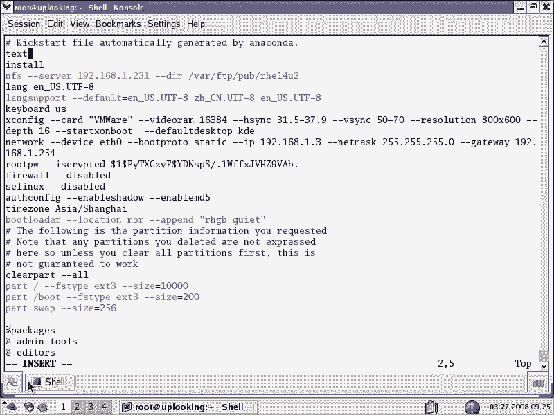
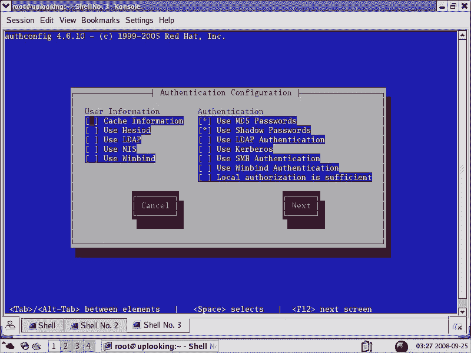
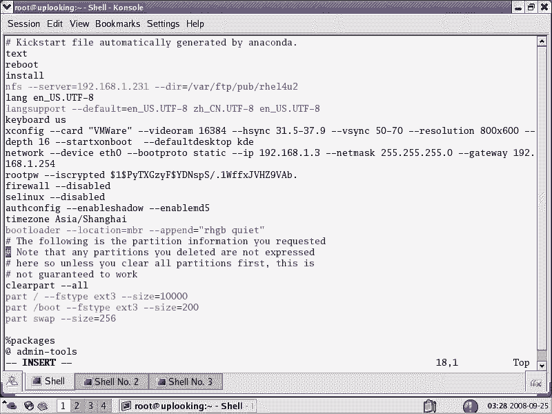
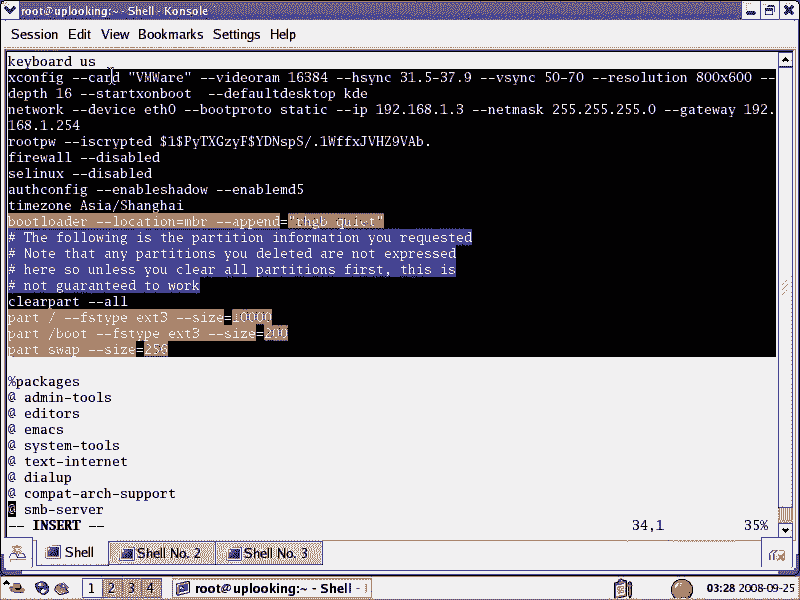
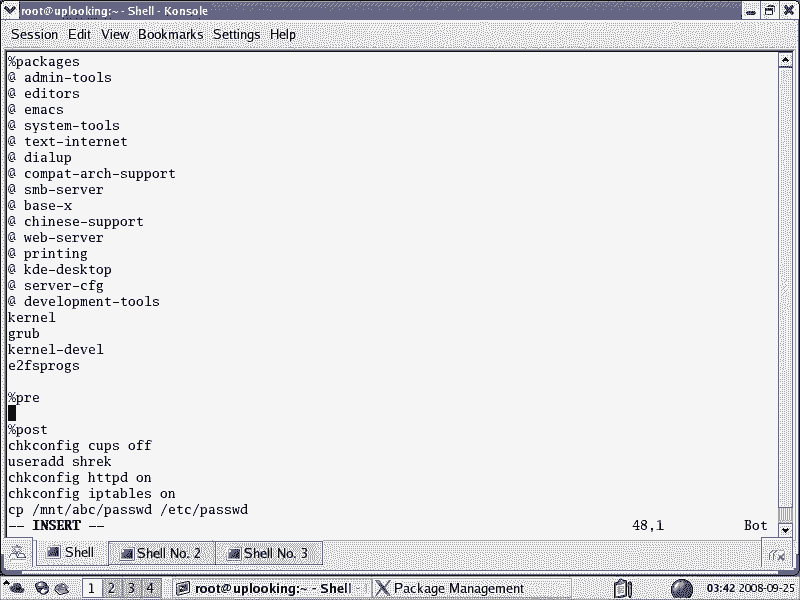

# 尚观Linux视频教程RHCE精品课程：P30：RH133-ULE115-0-1-RHEL-kickstart无人值守安装 🚀

在本节课中，我们将要学习RHEL系统中一个非常强大的自动化安装工具——Kickstart。通过它，我们可以实现系统的无人值守安装，这对于批量部署服务器或创建标准化系统环境至关重要。


## 课程概述

在上一节课程中，我们学习了Linux系统的基本操作。本节我们将深入解析系统，从安装环节开始。Kickstart是Red Hat Enterprise Linux（RHEL）提供的一种自动化安装机制，它允许我们通过一个预先配置好的应答文件，无需人工交互即可完成整个系统的安装过程。

## 什么是Kickstart？

Kickstart是一种无人值守的自动化安装方式。它的核心是一个名为`ks.cfg`的配置文件。安装程序`anaconda`会读取这个文件，并按照其中的设置自动完成分区、软件包选择、网络配置等所有安装步骤。

**核心概念**：`anaconda`（安装程序） + `ks.cfg`（配置文件） = 自动化安装。

## 为什么需要Kickstart？

以下是Kickstart的主要应用场景：

*   **大规模标准化部署**：在企业环境中，需要为数十、数百甚至数千台服务器安装完全一致的系统环境。手动安装不仅效率低下，还容易出错。Kickstart可以确保每台机器都按照相同的标准安装。
*   **简化安装流程**：对于不熟悉Linux的用户，或者需要远程交付预配置系统的场景（例如，为网吧定制服务器系统），Kickstart可以让安装过程变得极其简单——用户只需放入安装介质并启动，系统就会自动安装并配置成预定好的状态。
*   **环境复现与排错**：系统管理员可以保存一个已知稳定状态的Kickstart文件，用于快速重建测试环境或进行故障恢复。

## Kickstart配置文件详解

一个典型的`ks.cfg`文件主要包含三个部分：安装选项、软件包选择和安装后脚本。

### 1. 安装选项

这部分对应图形化安装界面中一步步的配置，例如语言、键盘、时区、分区方案、root密码、网络设置等。这些设置都记录在配置文件中。

**示例（关键分区部分）**：
```bash
# 注意：以下带#号的行默认被注释，不会执行。取消注释后才会生效。
#clearpart --all --drives=sda       # 清除sda盘上所有分区
#part /boot --fstype=ext3 --size=200  # 创建200MB的/boot分区
#part / --fstype=ext3 --size=10240    # 创建10GB的根分区
#part swap --size=2048                # 创建2GB的交换分区
```
**重要提示**：像`clearpart`（清除分区）这样的危险命令默认被注释（以`#`开头），这是一种安全保护机制。只有当你明确了解其作用并取消注释后，它才会执行。

### 2. 软件包选择

这部分定义了系统需要安装哪些软件包。你可以指定安装整个软件包组，也可以指定单个的RPM包。



**示例**：
```bash
%packages
@base          # 安装“base”这个软件包组
@x-window-system # 安装X窗口系统组
kernel         # 安装单个的kernel包
vim-enhanced   # 安装vim-enhanced包
%end
```
**如何知道包组名称？** 在图形化安装界面选择软件包时，看到的分类（如“Base System”、“Web Server”）就对应着包组。系统安装后，`/root/anaconda-ks.cfg`文件中也会记录你当初选择的包组。







### 3. 安装后脚本

这是Kickstart非常强大的部分。你可以在`%post`段中添加任意的Shell命令，这些命令将在系统安装完成后、首次重启前自动执行。

**示例**：
```bash
%post
# 安装后自动启动httpd服务
chkconfig httpd on
# 创建一个新用户
useradd -m john
# 从网络获取一个配置文件
wget http://server/config/myapp.conf -O /etc/myapp.conf
%end
```
通过`%post`脚本，你可以完成复杂的个性化配置，例如部署应用程序、修改系统参数、拉取公司内部配置等，最终让安装好的系统直接达到生产就绪状态。

## 如何获取和定制Kickstart文件？

你不需要从头编写`ks.cfg`文件。最常用的方法是利用系统安装后自动生成的模板。

**标准流程**：
1.  手动安装一次系统，在安装过程中仔细配置所有选项。
2.  安装完成后，在`/root`目录下会生成一个`anaconda-ks.cfg`文件，这就是你刚才手动安装过程的“录像”。
3.  以这个文件为模板，根据你的需求进行修改：
    *   取消必要的注释（如分区部分）。
    *   调整分区大小、添加分区。
    *   增删软件包或包组。
    *   在`%post`段添加配置脚本。
    *   可以添加`text`参数强制使用文本模式安装（更快），或添加`reboot`参数让安装完成后自动重启。

## 使用Kickstart进行安装

要让安装程序使用你的`ks.cfg`文件，需要将其放置在安装介质可访问的位置，并在启动时告诉内核。常见方法有：
*   放入U盘或光盘的根目录。
*   放在HTTP、FTP或NFS服务器上。
*   在启动引导时添加内核参数：`ks=http://server/path/to/ks.cfg`

## 课程总结

本节课我们一起学习了RHEL Kickstart无人值守安装技术。我们了解了它的核心价值在于**自动化**和**标准化**。通过剖析`ks.cfg`配置文件的三个核心部分——安装选项、软件包选择和安装后脚本，我们掌握了定制自动化安装流程的方法。无论是为了提升运维效率，还是为了交付定制化系统产品，Kickstart都是一项极其重要的实用技能。



在接下来的课程中，我们将继续深入解析Linux系统的其他核心组件。